- [深入理解计算机系统第八章读书笔记](#----------------)
- [异常控制流](#-----)
  * [8.1 异常](#81---)
    + [异常处理](#----)
    + [异常的类型](#-----)
      - [中断](#--)
      - [陷阱和系统调用](#-------)
      - [故障](#--)
      - [终止](#--)
      - [Linux/x86-64系统中的异常](#linux-x86-64------)
  * [8.2 进程](#82---)
    + [逻辑控制流](#-----)
    + [并发流](#---)
    + [私有地址空间](#------)
    + [用户模式和内核模式](#---------)
    + [上下文切换](#-----)
  * [8.3 系统调用错误处理](#83---------)
  * [8.4 进程控制](#84-----)
    + [获取进程ID](#----id)
    + [创建和终止进程](#-------)
    + [回收子进程](#-----)
    + [让进程休眠](#-----)
    + [加载并运行时间](#-------)
    + [利用fork和execve运行程序](#--fork-execve----)
  * [8.5 信号](#85---)
    + [信号术语](#----)
    + [发送信号](#----)
      - [1 进程组](#1----)
      - [2 用/bin/kill程序发送信号](#2---bin-kill------)
      - [3 键盘发送信号](#3-------)
      - [4 用kill函数发送信号](#4--kill------)
      - [5 用alarm函数发送信号](#5--alarm------)
    + [接收信号](#----)
    + [阻塞和解除阻塞信号](#---------)
    + [编写信号处理程序](#--------)
      - [安全的信号处理原则](#-------------)
      - [正确的信号处理](#-------)
      - [可移植的信号处理](#--------)
    + [同步流以避免讨厌的并发错误](#-------------)
    + [显示地等待信号](#-------)
  * [8.6 非本地跳转](#86------)
  * [8.7 操作进程的工具](#87--------)
  * [8.8 小结](#88---)

# 深入理解计算机系统第八章读书笔记 

# 异常控制流

从给处理器加电开始，直到你断电为止，程序计数器假设一个值的序列
$$
a_0, a_1，...,a_{n-1}
$$
其中$a_k$是某个相应的指令$I_k$的地址。每次从$a_k$到$a_{k+1}$的过渡称为 **控制转移**。这样的控制转移序列叫做处理器的的 **控制流**。

现代系统通过使控制流发生突变来应对跳转、调用和返回等情况。这些突变称为 **异常控制流（Exceptional Control Flow, ECF）**。

异常控制流发生在系统的各个层次：

1. 硬件层： 硬件检测到的事件会触发控制突然转移到异常处理程序
2. 操作系统层： 内核通过上下文切换将控制从一个用户进程转移到另一个用户进程
3. 应用层： 一个进程可以发送 **信号**到另一个进程，而接收者会将控制突然转移到它的一个信号处理程序 。 一个程序可以通过回避通常的栈规则，并执行到其他函数中任意位置的非本地跳转来对错误做出反应。

## 8.1 异常

异常是异常控制流的一种形式，一部分由硬件实现，一部分由操作系统实现。

**异常就是控制流中的突变，用来响应处理器状态中的某些变化**。

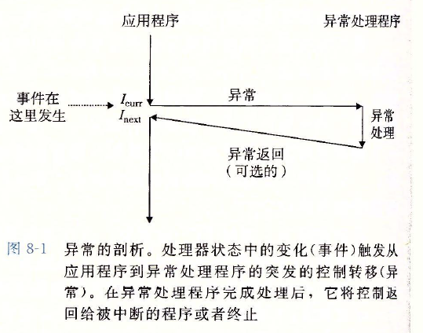

状态变化称为 **事件**，当处理器检测到事件发生时，它就会通过一张叫做 **异常表**的跳转表，进行一个间接过程调用（异常），到一个专门设计用来处理这类事件的操作系统子程序（**异常处理程序**）。异常处理程序完成处理后，根据引起异常的事件类型，会发生以下3种情况之一：

1. 处理程序将控制返回给当前指令$I_{curr}$，即当事件发生时正在执行的指令
2. 返回给$I_{next}$，如果没有发生异常将会执行的下一条指令
3. 处理程序终止被中断的程序

### 异常处理

系统为可能的每种类型的异常都分配了一个唯一的非负整数的 **异常号**。在系统启动时，操作系统分配和初始化一张称为 **异常表**的跳转表，使得表目k包含异常k的处理程序的地址。

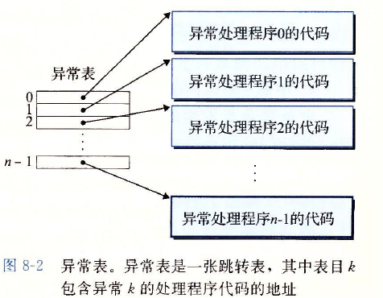

异常类似于过程调用，但有不同:

1. 过程调用时，处理器将返回地址压入栈中。然而，根据异常的类型，返回地址有三种情况。
2. 处理器还会把一些额外的处理器状态压到栈里，在处理程序返回时，重新开始执行被中断的程序会需要这些状态。比如，x86-64系统会把包含当前条件码的EFLAGS寄存器压入栈中

3. 如果控制从用户转移程序转移到内核，所有这些项目都被压入到内核栈中，而不是压倒到用户栈中
4. 异常处理程序运行在 **内核模式**下，意味着所有的系统资源都有访问的权限

### 异常的类型

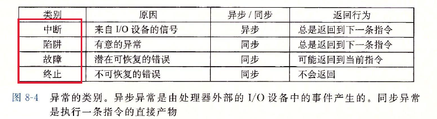

#### 中断

中断是异步发生的，是来自处理器外部的I/O设备的信号的结果。硬件中断的异常处理程序为 **中断处理程序**。

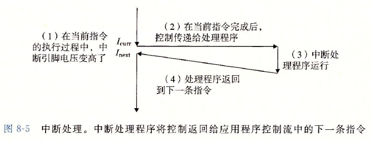

#### 陷阱和系统调用

陷阱是有意的异常，是执行一条指令的结果。陷阱最重要的用途是在用户程序和内核之间提供一个像过程一样的接口， 叫做 **系统调用**。

用户程序经常需要向内核请求服务，比如读一个文件， 创建一个新进程（fork）、加载一个新的程序（execve），或者终止当前进程（exit）。

普通模式运行在 **用户模式**中，用户模式限制了函数可以执行的指令的类型，而且他们只能访问与调用函数相同的栈。

系统调用运行在 **内核模式**中，内核模式运行系统调用执行特权指令，并访问定义在内核中的栈。

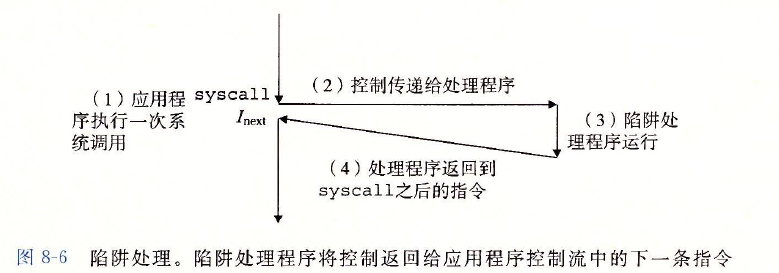

#### 故障

故障由错误情况引起，它可能能够被故障处理程序修正。一个经典的故障示例就是缺页异常。

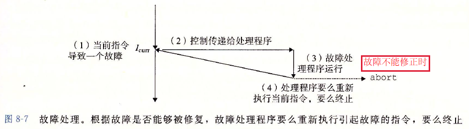

#### 终止

终止是不可恢复的致命错误造成的结果，通常是一些硬件错误。处理程序会将控制返回给abort例程，该例程会终止这个程序。

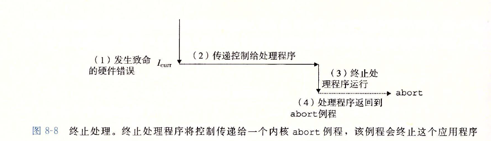

#### Linux/x86-64系统中的异常

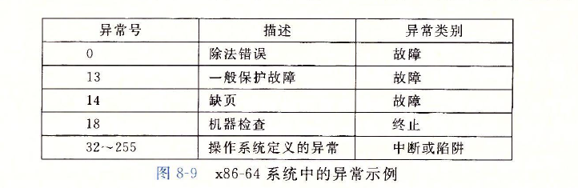

在Linux系统调用的参数都是通过通用寄存器而不是栈传递的。系统调用时通过 **syscall n** 的陷阱指令来提供的。

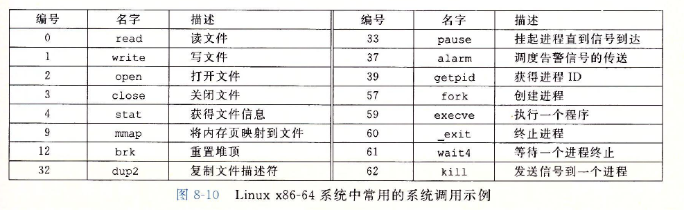

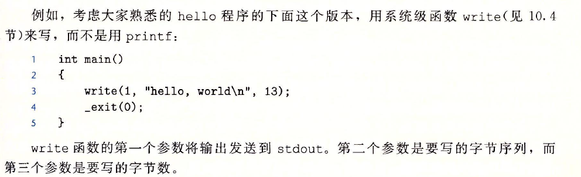

## 8.2 进程

进程的经典定义就是 **一个执行中的程序的实例**。系统中的每个程序都运行在某个进程的 **上下文**中。

**上下文**是由程序正确运行时所需的**状态**组成的，这个**状态**包括存放在内存中的程序的代码和数据，它的栈、通用目的寄存器的内容、程序计数器、环境变量以及打开文件描述符的集合。

进程提供的应用程序的**关键抽象**：

1. 一个独立的逻辑控制流，它提供一个假象，好像我们的程序独占使用处理器
2. 一个私有的地址空间， 它提供一个假象， 好像我们的程序独占使用内存系统

### 逻辑控制流

程序运行时程序计数器PC值的序列为 **逻辑控制流**。

### 并发流

一个逻辑流的执行在时间上与另一个流重叠， 称为 **并发流**， 这两个流称为 **并发的运行**。

多个流并发的执行的一般现象称为 **并发**。一个进程和其他进程轮流运行的概念为 **多任务**。 一个进程执行它的控制流的一部分的每一时间段称为 **时间片**。因此多任务也叫做 **时间分片**。如果两个流并发的运行在不同的处理器核或者计算机上，称它们为 **并行流**。

### 私有地址空间

进程为每个程序提供它自己的**私有地址空间**。一般而言，和这个空间中某个地址相关联的那个内存字节时不能被其他进程读或者写的。

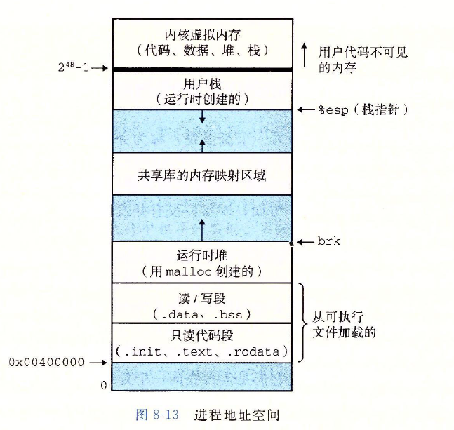

### 用户模式和内核模式

为了使操作系统内核提供一个无懈可击的进程抽象，处理器必须提供一种机制，**限制一个应用可以执行的指令以及它可以访问的地址空间范围**。

处理器通过某个控制寄存器中的 **模式位**来提供这种功能， 该寄存器描述了进程当前享有的特权。当设置了模式位， 进程就运行在 **内核模式**中，该进程可以执行指令集中的任何指令，可以访问系统中的任何内存位置。

进程从用户模式变为内核模式的唯一方法是通过诸如 **中断、故障或者陷入系统调用**这样的异常。

**/proc文件**系统是一个伪文件系统，它只存在内存当中，而不占用外存空间。它以文件系统的方式为访问系统内核数据的操作提供接口。用户和应用程序可以通过 proc得到系统的信息，并可以改变内核的某些参数

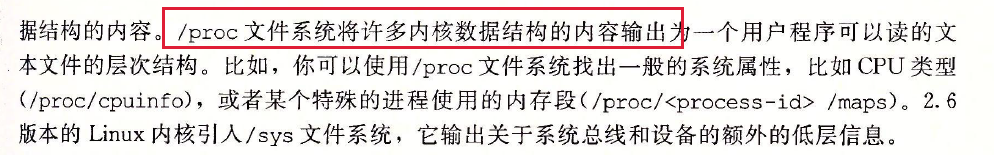

### 上下文切换

内核为每个进程维持一个**上下文**， 上下文就是内核重新启动一个被抢占的进程所需的状态。

使用 **上下文切换**的机制来进行进程切换。上下文切换有三步：

1. 保存当前进程的上下文
2. 恢复某个先前被抢占的进程被保存的上下文
3. 将控制传递给这个新恢复的进程

   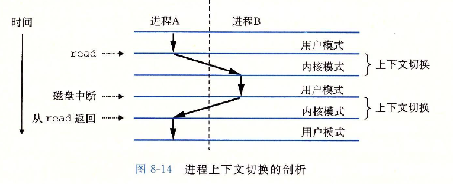

## 8.3 系统调用错误处理

当Unix系统级函数遇到错误时，它们通常会返回-1，并设置全局整数变量errno来表示什么出错了。

## 8.4 进程控制

Unix提供了大量从C程序中操作进程的系统调用。

### 获取进程ID

每个进程都有一个唯一的正数（非零）进程ID（**PID**）。**getpid函数**返回调用进程的PID， **getppid函数**返回它的 **父进程**的PID（创建调用进程的进程）。

返回一个类型为 pid_t的整数值，在linux系统上它在types.h中被定义为 int。

### 创建和终止进程

进程的三种状态：

1. **运行**： 进程要么在CPU上执行，要么在等待被执行且最终会被内核调度
2. **停止**： 进程的执行被 **挂起**， 且不会被调度。当收到SIGSTOP、 SIGTSTP、 SIGTTIN或者SIGTTOU信号时，进程就停止，并且停止直到收到SIGCONT信号，此时进程再次开始运行。
3. **终止**： 进程永远的停止了。三种原因：1. 收到一个信号，该信号的默认行为就会终止进程 2. 从主程序返回 3. 调用exit函数

**exit**函数 以status **退出状态**来终止进程，关闭所有文件。

返回值：1，表示异常退出，这个1是返回该操作系统的； 0，表示正常退出

**return**： 返回函数值，若在主函数中，则会退出函数并返回值

区别： 1. return它是关键字，不是函数，是C语言提供的，是语言级别的，表示堆栈的返回 2. exit是进程的退出，它是操作系统提供的，是系统调用级别的，表示进程的结束，删除进程使用的内存空间。

父进程通过调用 **fork函数**创建一个新的运行的 **子进程**。新创建的子进程几乎但不完全与父进程相同，子进程得到与父进程 **用户级虚拟地址空间**相同的（但是独立的）一份副本， 包括 **代码和数据段、堆、共享库以及用户栈**。还获得与父进程打开**文件描述符相同**的副本，这意味着子进程可以读写父进程打开的 **任何文件**。父进程和新创建的子进程最大的区别是 它们有不同的**PID**。

fork 调用一次，返回两次， 在父进程返回子进程的PID，在子进程返回0，因此可以区分父子进程。

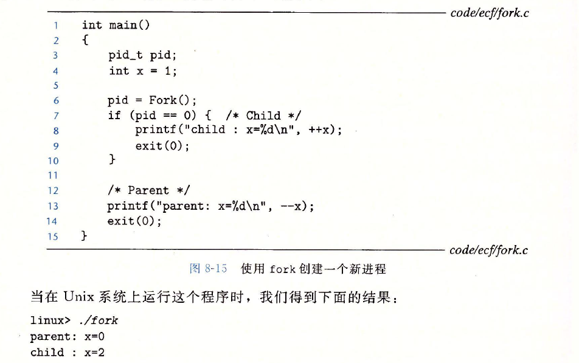

这个例子的特点：

1. 调用一次，**返回两次**
2. **并发执行**：父子进程是并发运行的独立进程
3. **相同但是独立的地址空间**，在读时，两个进程是共享的地址空间，在写时就有自己的私有地址空间
4. **共享空间**：子进程共享父进程的打开的文件描述符

### 回收子进程

当一个进程由于某种原因终止时，内核并不是立即把它从系统中清除。 进程保存在一种已终止的状态， 直到被它的父进程 **回收**。当父进程回收已终止的子进程时，内核将 **子进程**的 **退出状态**传递给父进程， 然后抛弃已终止的子进程。 

**僵死进程**：一个终止了但还未被回收的进程

如果父进程终止了， 内核会安排 **init**进程成为孤儿进程的养父。 init进程的PID为1，是在系统启动时创建的，他不会终止，是所有进程的祖先。

一个进程可以调用 **waitpid**函数来等待它的子进程终止或者停止：

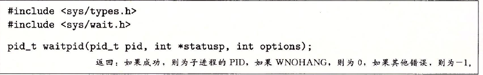返回值：

1. 如果成功，返回子进程的PID，

2. WHONANG(如果没有任何已经结束的子进程则马上返回，不予以等待,非阻塞), 返回0, 当options = 0时，是阻塞调用，会挂起调用进程

3. 如果其他错误，返回-1

4. pid > 0 等待子进程为pid的唯一进程, pid = -1，等待集合就是由所有子进程组成的

**wait函数**：等价于调用waitpid(-1，&status,  0)

waitpid可以控制子进程**按照确定性**的顺序来运行结束

### 让进程休眠

**sleep函数：**将一个进程挂起一段时间，返回剩下的还需要休眠的秒数。

**pause函数**： 让调用函数休眠（休眠无穷大时间），直到该进程收到一个信号

### 加载并运行程序

**execve函数：**在当前进程的上下文中加载并运行一个新程序

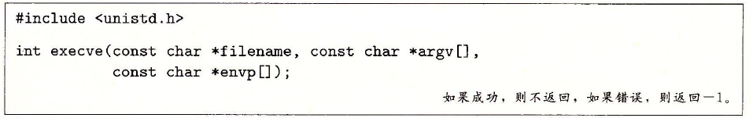

加载并运行可执行目标文件filename，并且带有参数列表argv和环境变量列表envp。

当出现错误时，才会返回到调用程序， 当调用成功时，调用一次不返回。

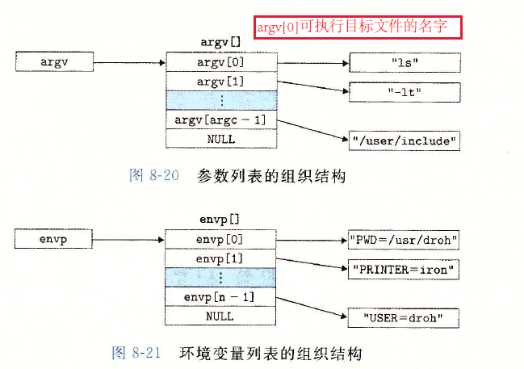

在execve函数加载了filename后，调用了启动代码，启动代码设置栈，并将控制传递给新程序的主函数，该主函数由如下形式的原型：

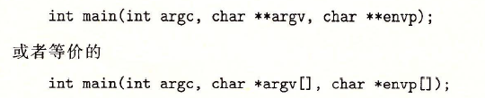

当main开始执行时，用户栈的组织结构为：

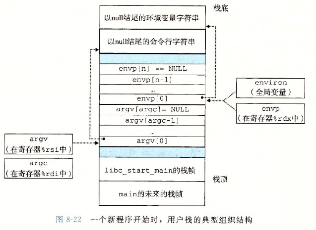

main函数有三个参数：

1. argc，它给出argv数组中非空指针的数量
2. argv， 指向argv数组中的第一个条目
3. envp， 指向envp数组中的第一个条目

   

### 利用fork和execve运行程序

## 8.5 信号

软件形式的异常，为Linux信号，它允许进程和内核中断其他进程。一个信号就是一条小消息，它通知进程系统发生了以个某种类型的事件。

### 信号术语

传送一个信号到目的进程由两个步骤组成：

1. **发送信号**：内核发送一个信号给进程，来更新目的进程上下文中的某个状态。发送信号的原因：1. 内核检测到一个异常事件，比如零除错误或者子进程终止 2.一个进程调用了kill函数，显示的要求内核发送一个信号给目的进程。一个进程可以发送信号给它自己
2. **接收信号**：目的进程被内核强迫以某种方式对信号的发送做出反应时，它就接收了信号。 进程可以 **忽略**这个信号，**终止**或者 **通过执行**一个称为 **信号处理程序**的用户层函数 **捕获**这个信号。

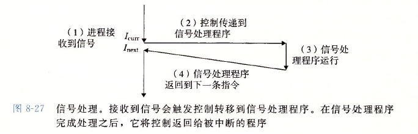

一个发出而没有被接收的信号为 **待处理信号**，在任何时候，一种类型至多只会有 **一个**待处理信号。

### 发送信号

#### 1 进程组

每个进程都只属于一个进程组，进程组由正整数 进程组**ID**标识。**getpgrp**函数返回当前进程的进程组ID。默认父子进程属于一个进程组。进程可以通过**setpgid**函数来改变自己或者其他进程的进程组。

#### 2 用/bin/kill程序发送信号

/bin/kill程序可以向另外的进程发送任意的信号，比如

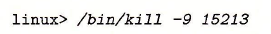

发送信号9给进程15213，一个**负的PID**会导致信号发送到进程组PID的每个进程。

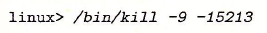

发送信号9给进程组15213的每个进程。

#### 3 键盘发送信号

**作业(job):** shell对一条命令行求值而创建的进程，任何时刻至多只有1个前台作业。shell为每个作业创建一个**独立的进程组**。

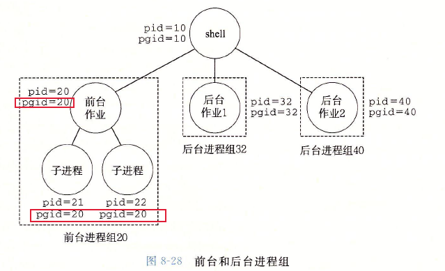

**Ctrl + C**: 内核发送SIGINT信号到前台进程组的每个进程，结果是**终止**前台作业。

**Ctrl + Z**: 内核发送SIGSTP信号到前台进程组的每个进程，结果是**停止（挂起）**前台作业。

#### 4 用kill函数发送信号

进程通过调用kill函数发送信号给其他进程，包括自己。

#### 5 用alarm函数发送信号

经常通过调用alarm函数向自己发送SIGALRM信号。

### 接收信号

当内核把进程p从内核模式切换到用户模式时， 检查进程p的未被阻塞的待处理信号的集合。

如果集合为空， 内核将控制传递到p的逻辑控制流的下一条指令。

如果集合非空， 内核选择集合中的某个信号k（通常是最小的k），并且强制p接收信号k。收到信号为触发进程采取行动。每个信号类型都有一个预定义的默认行为：

1. 进程终止
2. 进程终止并转储内存
3. 进程停止直到被SIGCONT信号重启
4. 进程忽略该信号

SIGSTOP和SIGKILL信号的默认行为是不能修改的。

### 阻塞和解除阻塞信号

**隐式阻塞机制**：内核默认阻塞任何**当前处理程序**正在处理信号类型的待处理的信号

**显示阻塞机制**：使用sigprocmask函数和其辅助函数，明确阻塞和解除阻塞选定的信号。

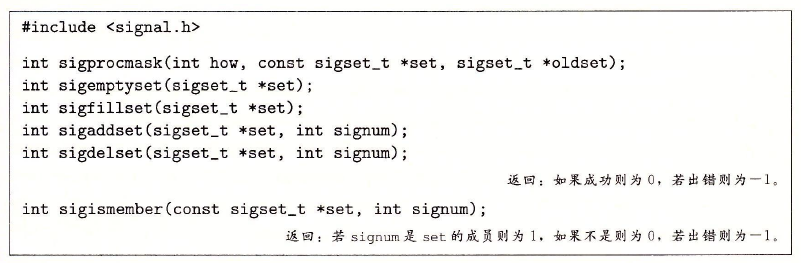

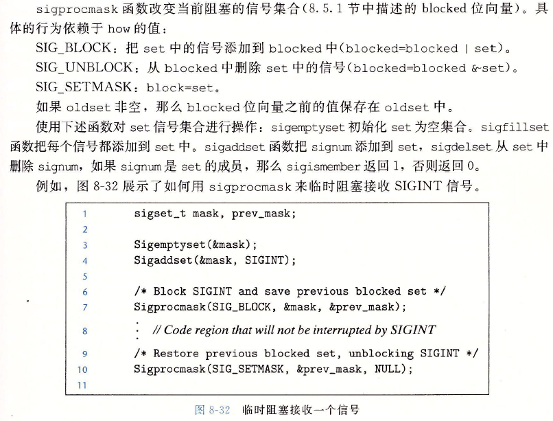

### 编写信号处理程序

1. 处理程序与主程序并发运行，共享同样的全局变量，因此可能与主程序或其他程序互相干扰
2. 如何以及何时接收信号的规则有违人的直觉
3. 不同的系统有不同的信号处理语义

#### **安全的信号处理原则**

1. 处理程序尽可能简单
2. 处理程序只调用 **异步信号安全**的函数， 该函数是 **可重入**的（例如只访问局部变量），或者是 **不能被信号处理程序中断**。信号处理程序中产生输出唯一安全的方法是使用 **write**函数。调用printf或sprintf是不安全的。

3. 保存和恢复errno
4. 阻塞所有的信号，保护对共享全局数据结构的访问
5. 使用 **volatile**声明全局变量，该类型限定符告诉编译器不要缓存这个变量，强迫编译器每次在代码中引用变量时，从内存中读取
6. 用sig_atomic声明标志，该整型数据类型保证读和写是 **原子的**，不可中断

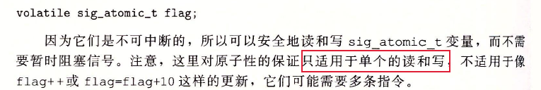

#### 正确的信号处理

未处理的信号是不排队的。存在一个未处理信号就表明 **至少**有一个信号到达了。

#### 可移植的信号处理

### 同步流以避免讨厌的并发错误

保证并发进程按一定的顺序进程，不需要保证所有的顺序， 只需要保证关键的进程顺序即可。

### 显示地等待信号

## 8.6 非本地跳转

**非本地跳转**：将控制直接从一个函数转移到另一个当前正在执行的函数，而不需要经过正常的调用-返回序列。**通过setjmp 和 longjmp函数来实现**。

非本地跳转的重要应用

1.  **允许一个深层嵌套的函数调用中立即返回**，通常是检测到某个错误引起的。
2.  **使一个信号处理程序分支到一个特殊的代码位置**，而不是返回到被信号到达中断了的指令的位置

## 8.7 操作进程的工具

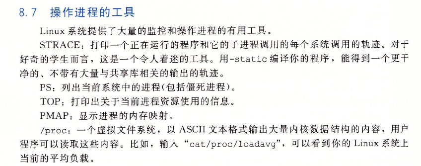

## 8.8 小结

异常控制流（ECF）发生在计算机系统的各个层次，是计算机系统中提供并发的基本机制。

在硬件层，异常是由处理器中的事件触发的控制流中的突变。控制流传递给一个软件处理程序，该处理程序进行一些处理，然后返回控制给被中断的控制流。

有四种不同类型的中断：中断、故障、终止和陷阱。

在操作系统层，内核用ECF提供进程的基本概念，进程提供两个重要的抽象，逻辑控制流和私有地址空间。

在操作系统和应用程序之间的接口处，应用程序可以创建子进程、等待子进程停止或者终止，运行新的程序，以及捕获来自其他进程的信号。信号处理的语义是微妙的。

在应用层，C程序可以使用非本地跳转来规避正常的调用/返回栈规则，可直接从一个函数分支到另一个函数。

