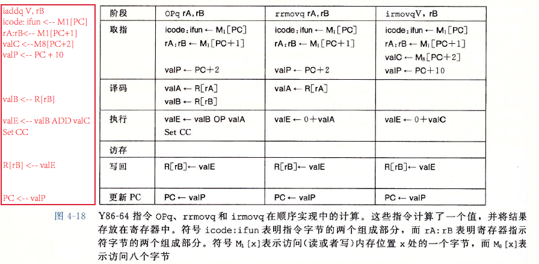
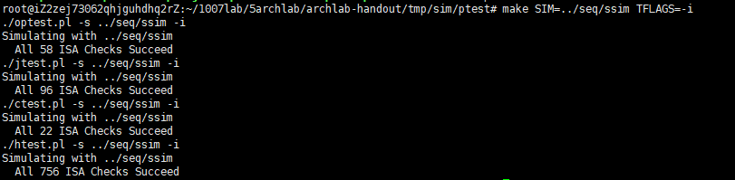
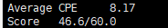

# Optimizing the Performance of a Pipelined Processor

# Part A

在Y86-64指令集体系下完成三个函数的实现，该三个函数的C代码实现为：

```c
/* 
 * Architecture Lab: Part A 
 * 
 * High level specs for the functions that the students will rewrite
 * in Y86-64 assembly language
 */

/* $begin examples */
/* linked list element */
typedef struct ELE {
    long val;
    struct ELE *next;
} *list_ptr;

/* sum_list - Sum the elements of a linked list */
long sum_list(list_ptr ls)
{
    long val = 0;
    while (ls) {
	val += ls->val;
	ls = ls->next;
    }
    return val;
}

/* rsum_list - Recursive version of sum_list */
long rsum_list(list_ptr ls)
{
    if (!ls)
	return 0;
    else {
	long val = ls->val;
	long rest = rsum_list(ls->next);
	return val + rest;
    }
}

/* copy_block - Copy src to dest and return xor checksum of src */
long copy_block(long *src, long *dest, long len)
{
    long result = 0;
    while (len > 0) {
	long val = *src++;
	*dest++ = val;
	result ^= val;
	len--;
    }
    return result;
}
/* $end examples */

```

采用Y86-64指令集实现为：

```c
#long sum_list(list_ptr ls) #sum.ys

#Execution begins at address 0,written by peanwang
	.pos 0
	irmovq stack,%rsp
	call main
	halt
# Sample linked list
	.align 8
ele1:
	.quad 0x00a
	.quad ele2
ele2:
	.quad 0x0b0
	.quad ele3
ele3:
	.quad 0xc00
	.quad 0

main:
	irmovq ele1, %rdi
	call sum
	ret
#long sum_list(list_ptr ls)
#ls in %rdi
sum:
	irmovq $8, %r8	  # Constant 8
	xorq %rax, %rax   # val = 0
loop:
	andq %rdi, %rdi   # if ls == 0?
	je test
	mrmovq (%rdi), %r10 
	addq %r10, %rax
	mrmovq 8(%rdi), %rdi
	jmp loop
test:
	ret

	.pos 0x200
stack:

```

```c
#long rsum_list(list_ptr ls) #rsum.ys

#Execution begins at address 0,written by peanwang
	.pos 0
	irmovq stack,%rsp
	call main
	halt
# Sample linked list
	.align 8
ele1:
	.quad 0x00a
	.quad ele2
ele2:
	.quad 0x0b0
	.quad ele3
ele3:
	.quad 0xc00
	.quad 0

main:
	irmovq ele1, %rdi
	irmovq $8, %r8	  # Constant 8
	xorq %rax, %rax   # val = 0
	call sum
	ret
#long rsum_list(list_ptr ls)
#ls in %rdi
sum:
	andq %rdi, %rdi   # if ls == 0?
	je test
	mrmovq (%rdi), %r10 
	pushq %r10
	mrmovq 8(%rdi), %rdi
	call sum
	popq %r10
	addq %r10, %rax 
test:
	ret

	.pos 0x200
stack:

```

```c
#long copy_block(long *src, long *dest, long len) #copy.ys

#Execution begins at address 0,written by peanwang
	.pos 0
	irmovq stack,%rsp
	call main
	halt
.align 8
# Source block
src:
	.quad 0x00a
	.quad 0x0b0
	.quad 0xc00
# Destination block
dest:
	.quad 0x111
	.quad 0x222
	.quad 0x333
#This is main function

main:
	irmovq src, %rdi
	irmovq dest, %rsi
	irmovq $3, %rdx
	irmovq $8, %r8	  # Constant 8
	irmovq $1, %r9	  # Constant 1
	xorq %rax, %rax   # result = 0
	call copy_block
	ret
#long copy_block(long *src, long *dest, long len)
#ls in %rdi
copy_block:
	andq %rdx, %rdx   # if ls == 0?
	je test
	mrmovq (%rdi), %r10 
	rmmovq %r10, (%rsi)
	addq %r8, %rdi
	addq %r8, %rsi
	xorq %r10, %rax
	subq %r9, %rdx
	jmp copy_block
test:
	ret

	.pos 0x200
stack:

```

编译和执行命令为:

```c
root@iZ2zej73062qhjguhdhq2rZ:~/1007lab/5archlab/archlab-handout/tmp/sim/misc# ./yas ./rsum.ys 
root@iZ2zej73062qhjguhdhq2rZ:~/1007lab/5archlab/archlab-handout/tmp/sim/misc# ./yis ./rsum.yo 
```


# Part B

在书上已经给出的Y86-64指令下再增加iaddq指令，并在HCL文件中实现。

iaddq指令的格式为：


该指令在顺序实现中的取指、译码、执行、访存、写回、更新PC六个阶段为：



因此在seq-full.hcl中需要进行修改的代码为：

```c
# Instruction code for iaddq instruction
wordsig IIADDQ	'I_IADDQ'

################ Fetch Stage     ###################################
bool instr_valid = icode in 
	{ INOP, IHALT, IRRMOVQ, IIRMOVQ, IRMMOVQ, IMRMOVQ,IOPQ, IJXX, ICALL, IRET, IPUSHQ, IPOPQ, IIADDQ };
# Does fetched instruction require a regid byte?
bool need_regids =
	icode in { IRRMOVQ, IOPQ, IPUSHQ, IPOPQ, 
		     IIRMOVQ, IRMMOVQ, IMRMOVQ, IIADDQ };

# Does fetched instruction require a constant word?
bool need_valC =
	icode in { IIRMOVQ, IRMMOVQ, IMRMOVQ, IJXX, ICALL, IIADDQ };

################ Decode Stage    ###################################
## What register should be used as the B source?
word srcB = [
	icode in { IOPQ, IRMMOVQ, IMRMOVQ, IIADDQ  } : rB;
	icode in { IPUSHQ, IPOPQ, ICALL, IRET } : RRSP;
	1 : RNONE;  # Don't need register
];

## What register should be used as the E destination?
word dstE = [
	icode in { IRRMOVQ } && Cnd : rB;
	icode in { IIRMOVQ, IOPQ, IIADDQ} : rB;
	icode in { IPUSHQ, IPOPQ, ICALL, IRET } : RRSP;
	1 : RNONE;  # Don't write any register
];

################ Execute Stage   ###################################
## Select input A to ALU
word aluA = [
	icode in { IRRMOVQ, IOPQ } : valA;
	icode in { IIRMOVQ, IRMMOVQ, IMRMOVQ, IIADDQ } : valC;
	icode in { ICALL, IPUSHQ } : -8;
	icode in { IRET, IPOPQ } : 8;
	# Other instructions don't need ALU
];

## Select input B to ALU
word aluB = [
	icode in { IRMMOVQ, IMRMOVQ, IOPQ, ICALL, 
		      IPUSHQ, IRET, IPOPQ,IIADDQ } : valB;
	icode in { IRRMOVQ, IIRMOVQ } : 0;
	# Other instructions don't need ALU
];

## Should the condition codes be updated?
bool set_cc = icode in { IOPQ,IIADDQ };

```

执行结果为：




# Part C

该部分主要是采用一切办法，来提高ncopy.ys的运行效率，即实现ncopy函数。主要分为以下几步来实现优化：

```c
word_t ncopy(word_t *src, word_t *dst, word_t len)
{
    word_t count = 0;
    word_t val;

    while (len > 0) {
	val = *src++;
	*dst++ = val;
	if (val > 0)
	    count++;
	len--;
    }
    return count;
}
```

1. 结合PartB部分，在pipe-full.hcl中实现iaddq指令，该指令的实现与PartB的实现基本一致，然后利用该指令改写ncopy.ys。

```c
ncopy:
# You can modify this portion
	# Loop header
	xorq %rax,%rax		# count = 0;
	andq %rdx,%rdx		# len <= 0?
	jle Done		# if so, goto Done:

Loop:	
	mrmovq (%rdi), %r10	# read val from src...
	rmmovq %r10, (%rsi)	# ...and store it to dst
	andq %r10, %r10		# val <= 0?
	jle Npos		# if so, goto Npos:
	iaddq $1, %rax		# count++
Npos:	
	iaddq $-1, %rdx		# len--
	iaddq $8, %rdi		# src++
	iaddq $8, %rsi		# dst++
	andq %rdx,%rdx		# len > 0?
	jg Loop			# if so, goto Loop:
```


2. 采用循环展开来进行优化，先尝试了2*2循环展开，发现有一定的效果，但是效果不是很大，于是继续展开成8 * 8循环展开，对于剩下的余数继续采用2 * 2循环展开，并且调整语句的执行顺序，来解决加载/使用冒险问题。

```c
# 2*2循环展开
ncopy:
##################################################################
# You can modify this portion
	# Loop header
	xorq %rax,%rax		# count = 0;
	
	iaddq $-2,%rdx		# len < 2?
	jl Last		        # if so, goto Done:

Loop:	
	mrmovq (%rdi), %r10	# read val from src...
	rmmovq %r10, (%rsi)	# ...and store it to dst
	iaddq $8, %rdi		# src++
	iaddq $8, %rsi		# dst++
	mrmovq (%rdi), %r11	# read val from src...
	rmmovq %r11, (%rsi)	# ...and store it to dst
	iaddq $8, %rdi		# src++
	iaddq $8, %rsi		# dst++
	andq %r10, %r10		# val <= 0?
	jle L1		        # if so, goto Npos:
	iaddq $1, %rax		# count++
L1:	
	andq %r11, %r11		# val <= 0?
	jle Npos		# if so, goto Npos:
	iaddq $1, %rax
Npos:	
	iaddq $-2,%rdx		# len > 0?
	jge Loop		# if so, goto Loop:
Last:
	iaddq $1, %rdx          # %rdx = -2 or 1?
	jne Done
	mrmovq (%rdi), %r10	# read val from src...
	rmmovq %r10, (%rsi)	# ...and store it to dst
	andq %r10, %r10		# val <= 0?
	jle Done		# if so, goto Npos:
	iaddq $1, %rax		# count++
##################################################################
```


```
#8*8展开
ncopy:

##################################################################
# You can modify this portion
	# Loop header
	#xorq %rax, %rax		# count = 0;
	iaddq $-8, %rdx		# len < 2?
	jl Last		        # if so, goto Done:

Loop:	
    mrmovq (%rdi), %r10	# read val from src...
	mrmovq 8(%rdi), %r11	# read val from src...
	mrmovq 16(%rdi), %r12	# read val from src...
	mrmovq 24(%rdi), %r13	# read val from src...
	mrmovq 32(%rdi), %r14	# read val from src...
	mrmovq 40(%rdi), %r8	# read val from src...
	mrmovq 48(%rdi), %r9	# read val from src...
	mrmovq 56(%rdi), %rcx	# read val from src...


	rmmovq %r10, (%rsi)	# ...and store it to dst
	rmmovq %r11, 8(%rsi)	# ...and store it to dst
	rmmovq %r12, 16(%rsi)	# ...and store it to dst
	rmmovq %r13, 24(%rsi)	# ...and store it to dst
	rmmovq %r14, 32(%rsi)	# ...and store it to dst
	rmmovq %r8, 40(%rsi)	# ...and store it to dst
	rmmovq %r9, 48(%rsi)	# ...and store it to dst
	rmmovq %rcx, 56(%rsi)	# ...and store it to dst

	iaddq $64, %rdi		# src++
	iaddq $64, %rsi	
	andq %r10, %r10		# val <= 0?
	jle L1		        # if so, goto Npos:
	iaddq $1, %rax		# count++
L1:	
	andq %r11, %r11		# val <= 0?
	jle L2			# if so, goto Npos:
	iaddq $1, %rax
L2:	
	andq %r12, %r12		# val <= 0?
	jle L3			# if so, goto Npos:
	iaddq $1, %rax
L3:
	andq %r13, %r13		# val <= 0?
	jle L4			# if so, goto Npos:
	iaddq $1, %rax
L4:
	andq %r14, %r14		# val <= 0?
	jle L5			# if so, goto Npos:
	iaddq $1, %rax
L5:
	andq %r8, %r8		# val <= 0?
	jle L6			# if so, goto Npos:
	iaddq $1, %rax
L6:
	andq %r9, %r9		# val <= 0?
	jle L7			# if so, goto Npos:
	iaddq $1, %rax
L7:
	andq %rcx, %rcx		# val <= 0?
	jle Npos		# if so, goto Npos:
	iaddq $1, %rax

Npos:	
	iaddq $-8,%rdx		# len > 0?
	jge Loop		# if so, goto Loop:
Last:
	iaddq $8, %rdx
	je Done

	iaddq $-2, %rdx		# len < 2?
	jl Last2
Lmo:
	mrmovq (%rdi), %r10	# read val from src...
	mrmovq 8(%rdi), %r11	# read val from src...
	rmmovq %r11, 8(%rsi)	# ...and store it to dst
	rmmovq %r10, (%rsi)	# ...and store it to dst
	iaddq $16, %rdi		# src++
	iaddq $16, %rsi		# dst++
	andq %r10, %r10		# val <= 0?
	jle L21			# if so, goto Npos:
	iaddq $1, %rax		# count++
L21:
	andq %r11, %r11		# val <= 0?
	jle Npos2		# if so, goto Npos:
	iaddq $1, %rax
Npos2:	
	iaddq $-2,%rdx		# len > 0?
	jge Lmo 		# if so, goto Loop:

Last2:
	iaddq $2, %rdx
	je Done
Lend:
	mrmovq (%rdi), %r12	# read val from src...
	rmmovq %r12, (%rsi)
	andq %r12, %r12	
	jle Done		# if so, goto Npos:
	iaddq $1, %rax		# count++
##################################################################
# Do not modify the following section of code
# Function epilogue.
Done:
	ret
##################################################################
```

最后结构是：



并且也发现循环展开并不是越多越好，当采用10 * 10展开时，效率反而有些许下降，这可能是因为后续的余数可能会更大，使得效率会有一定的下降。该代码还有继续优化的空间。

