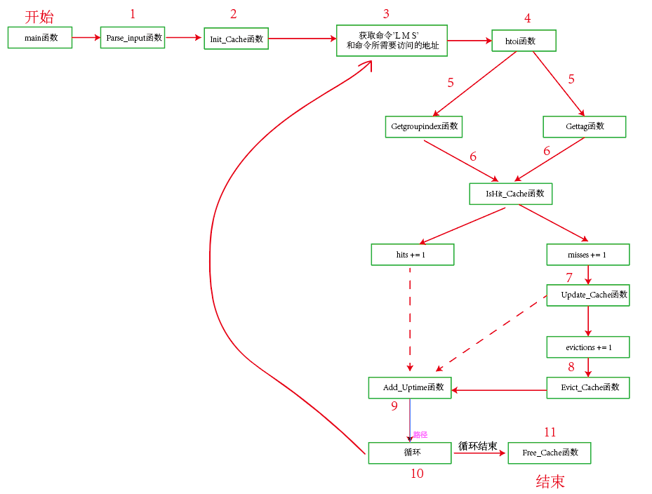
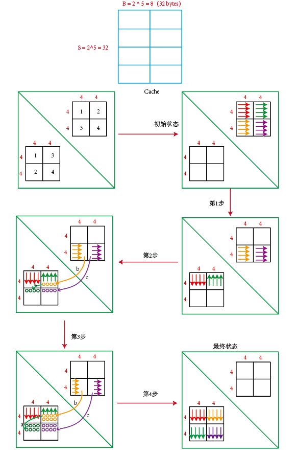
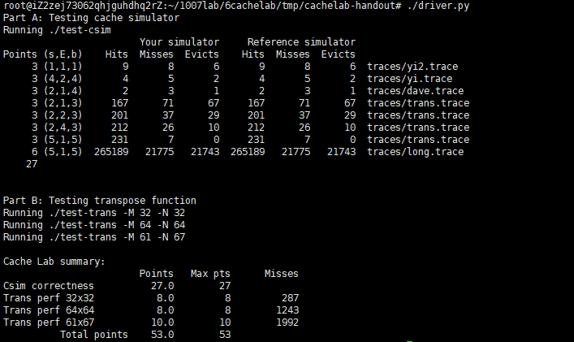

# Cache Lab: Understanding Cache Memories


# Part A

该部分是完成一个使用LRU替换策略的Cache模拟器，通过解析如下所示的命令，来模拟CPU对缓存的加载、存储和修改数据。

```c
 L 10,1
 M 20,1
 L 22,1
 S 18,1
 L 110,1
 L 210,1
 M 12,1
```

整个代码逻辑如图所示：



1. Parse_input函数：解析命令行输入的参数，主要是缓存的组数s，行数E， 块数b，根据输入的参数来确定缓存的大小情况，同时还有内存访问命令的输入文件
2. Init_Cache函数：根据输入的参数s，E，B来初始化缓存，为缓存分配指定大小的空间，缓存每行的结构包括有效位、标志位和访问时间
3. 然后根据内存访问命令的输入文件来解析每一条内存访问命令的操作（L、M和S）以及内存访问命令的地址（十进制）
4. htoi函数：将内存访问命令的地址（字符型）转换为整数型地址
5. Getgroupindex函数和Gettag函数：根据地址来确定所在缓存中所存储的位置，即组索引和标志位
6. IsHit_Cache函数：根据组索引和标志位来判断是否命中缓存，若命中，直接跳到第9步
7. Update_Cache函数：当没有命中缓存时，需要更新缓存。若此时，组索引对应的缓存中还有空闲位置，则直接更新即可，然后跳转到第9步
8. Evict_Cache函数：若是当需要更新缓存时，此时缓存中没有空行，则需要驱逐特定的行，此时更加LRU替换策略来驱逐特定的行，具体实现是驱逐访问时间最大的行，驱逐特定行后，并把新的数据加载到该特定行，此时该特定行的访问时间要重新赋值为0（因为它刚访问过）
9. Add_Uptime函数：将缓存中的所有有效位有效的行的访问时间加1。
10. 然后继续循环3-10，直到所有的内存访问命令都结束
11. Free_Cache函数：循环结束后，需要释放给缓存分配的内存

代码实现如下：

csim.h文件

```c
#define MAX_LINE 1024 //每一行所存放的最大字符数
// Cache memory row struct
typedef struct RowCache 
{
	int valid; // 有效位
	int tag; // 标志位
	int uptime; //访问时间
}RowCache_T, *PRowCache; //缓存行的结构

typedef struct GroupCache
{
	PRowCache Prows;
}GroupCache_T, *PGroupCache; // 缓存组的结构

void Parse_input(int argc, char** argv); //命令行输入的解析函数
void Init_Cache(); //初始化缓存
int htoi(char s[]); //字符转换为16进制数
int Getgroupindex(int address);//获取地址的组号，即组选择
int Gettag(int address);//获取地址的标记位，即行匹配
int IsHit_Cache(int curindex, int curtag); //判断地址是否命中缓存
int Update_Cache(int curindex, int curtag); //更新缓存
void Evict_Cache(int curindex, int curtag);//驱逐缓存，即LRU替换策略
void Add_Uptime();//更新访问时间
int tolower(int c); //
void Free_Cache(); //释放缓存
void Print_Help(); //输出help提示

```

csim.c文件

```C
#include "cachelab.h"
#include <stdlib.h>
#include <unistd.h>
#include <stdio.h>
#include <string.h>
#include <getopt.h>
#include "csim.h"

int hits = 0, misses = 0, evictions = 0; // 总命中数，总未命中数，总驱逐数
int s, E, b;// 缓存的组数（s），行数，块数（bit）
int hFlag = 0, vFlag = 0; //命令行输入参数是否有 -h，-v标志
char *tfilename = NULL; // 内存访问命令所存放的文件名称
int s_num; // 缓存的组数 = （2 ^ s）

PGroupCache Cache;  // 缓存结构

int main(int argc, char** argv)
{
	Parse_input(argc, argv); //解析命令行输入参数
	if(hFlag){
		Print_Help(); //-h，输出help说明
		return 0;
	}
	

	
	char buf[MAX_LINE + 1]; //存储内存访问命令的缓冲区域
	FILE *fp;
	if((fp = fopen(tfilename, "r")) == NULL) //判断-t后的变量是否为文件名字
	{
		printf("%s: No such file or directory \n", tfilename);
		exit(0);
	}

	Init_Cache(); //初始化缓存

	char bufcopy[MAX_LINE + 1];
	char *psplit1;
	char *psplit2, *zeropsplit2;
	int address, curindex, curtag;
	int Hitflag, Updateflag;
	while(fgets(buf, MAX_LINE, fp) != NULL) //从文件中读取内存访问命令，L 10,1
	{
		
		strcpy(bufcopy, buf);
		psplit1 = strtok(buf, " ,"); // 获取内存访问命令的“L”或“M”或“S”
		zeropsplit2 = strtok(NULL, " ,"); //获取地址字符

		while(*zeropsplit2 == '0'){ //去掉地址字符的前导0
			zeropsplit2++;
		}
		psplit2 = zeropsplit2;

		address = htoi(psplit2); //将地址字符转换为16进制地址
		curindex = Getgroupindex(address); //获取地址的组索引
		curtag = Gettag(address);//获取地址的行标记
		Hitflag = 0; //是否命中的标志位
		Updateflag = 0; //是否更新成功的标志位，未更新成功，则代表需要使用LRU策略先驱逐缓存行
		
		strncpy(bufcopy, bufcopy+1, strlen(bufcopy));
		bufcopy[strlen(bufcopy)-1] = ' ';
		
		
		if(strcmp(psplit1, "L") == 0 || strcmp(psplit1, "S") == 0) //当内存访问命令是“L”或“M”时，只会访问一次地址
		{
			Hitflag = IsHit_Cache(curindex, curtag); //判断是否命中
		
			if(Hitflag){ //成功命中
				hits += 1;
				printf("%shit\n", bufcopy);
			}else{ //未成功命中
				misses += 1;
				
				Updateflag = Update_Cache(curindex, curtag); //判断缓存是否更新成功

				if(!Updateflag){//缓存未更新成功，需要驱逐
					evictions += 1;	
					Evict_Cache(curindex, curtag);//驱逐缓存
					printf("%smiss evictions\n", bufcopy);
				}else{
					printf("%smiss\n", bufcopy);
				}
			}	
		}
		else if(strcmp(psplit1, "M") == 0) //内存访问命令是“M”，会需要访问两次内存访问地址（一次读取，一次修改后保存）
		{
			Hitflag = IsHit_Cache(curindex, curtag);//判断是否击中
			if(Hitflag){
				hits += 2;
				printf("%shit hit\n", bufcopy);
				
			}else{
				misses += 1;
				hits += 1;
				Updateflag = Update_Cache(curindex, curtag);
				if(!Updateflag){
					evictions += 1;	
					Evict_Cache(curindex, curtag);
					printf("%smiss evictions hit\n", bufcopy);	
				}else{
					printf("%smiss hit\n", bufcopy);
				}
				
			}
		}
		Add_Uptime(); //将所有缓存中的行的访问时间都加1，驱逐时，驱逐访问时间最大的行

		
	}	
    fclose(fp);//关闭文件
    printSummary(hits, misses, evictions);
    Free_Cache();//释放缓存
    return 0;
}
```

```c
void Parse_input(int argc, char** argv)
{
	int opt;
	while(-1 != (opt = getopt(argc, argv, "hvs:E:b:t:"))){
		switch(opt) {
			case 'h':
				hFlag = 1;
				break;
			case 'v':
				vFlag = 1;
				break;
			case 's':
				s = atoi(optarg);
				if(s <= 0){
					hFlag = 1;
				}else{
					s_num = 1 << s;
				}
				break;
			case 'E':
				E = atoi(optarg);
				if(E <= 0){
					hFlag = 1;
				}
				break;
			case 'b':
				b = atoi(optarg);
				if(b <= 0){
					hFlag = 1;
				}
				break;
			case 't':
				tfilename = optarg;
				break;		
		}
	}
	
}

void Init_Cache()
{
	
	Cache = (PGroupCache)malloc(sizeof(GroupCache_T) * s_num); //缓存有s组
	

	for(int j = 0; j < s_num; j++)
	{
		PRowCache Rows = (PRowCache)malloc(sizeof(RowCache_T) * E); // 每组有E行
		for(int i = 0; i < E; i++)
		{
			Rows[i].valid = 0; //0 is not valid
			Rows[i].tag = -1;   // -1 is not allocated
			Rows[i].uptime = 0;
		}
		Cache[j].Prows = Rows;
	}
	 
}

/*hex to int*/  

int tolower(int c)  
{  
    if (c >= 'A' && c <= 'Z')  
    {  
        return c + 'a' - 'A';  
    }  
    else  
    {  
        return c;  
    }  
}  

int htoi(char s[])  
{  
    int i = 0;  
    int n = 0;  
      

    for (; (s[i] >= '0' && s[i] <= '9') || (s[i] >= 'a' && s[i] <= 'z') || (s[i] >='A' && s[i] <= 'Z');++i)  
    {  
        if (tolower(s[i]) > '9')  
        {  
            n = 16 * n + (10 + tolower(s[i]) - 'a');  
        }  
        else  
        {  
            n = 16 * n + (tolower(s[i]) - '0');  
        }  
    }  
    return n;  
}

int Getgroupindex(int address)
{
	int sbits = (1 << s) - 1;
	return (address >> b) & sbits;
}  

int Gettag(int address)
{
	return address >> (s + b);
}

int IsHit_Cache(int curindex, int curtag)
{
	for (int i = 0; i < E; i++)
	{
		if(Cache[curindex].Prows[i].valid == 1 && Cache[curindex].Prows[i].tag == curtag)
		{
			Cache[curindex].Prows[i].uptime = 0; //缓存命中后，需要更新访问时间为0
			return 1; // hit
		}
	}
	
	return 0; // not hit
}

int Update_Cache(int curindex, int curtag)
{
	for(int i = 0; i < E; i++)
	{
		if(Cache[curindex].Prows[i].valid == 0)
		{
			Cache[curindex].Prows[i].valid = 1; 
			Cache[curindex].Prows[i].tag = curtag;
			return 1; //update success
		}
	}
	return 0; // update not success, need to evict
}

void Evict_Cache(int curindex, int curtag)
{
	int maxtime = -1;
	int maxindex = -1;
	int tmptime;
	for(int i = 0; i < E; i++)
	{
		if (Cache[curindex].Prows[i].valid == 1)		
		{
			tmptime = Cache[curindex].Prows[i].uptime;
			if (tmptime > maxtime) //驱逐访问时间最大的，即此行最长时间未被访问
			{	
				maxtime = tmptime;
				maxindex = i;			
			}
		}
	}
	Cache[curindex].Prows[maxindex].tag = curtag;
	Cache[curindex].Prows[maxindex].uptime = 0;  // evict and update
}

void Add_Uptime()
{
	for(int i = 0; i < s_num; i++)
	{	
		for(int j = 0; j < E; j++)
		{
			if(Cache[i].Prows[j].valid == 1)
			{
				Cache[i].Prows[j].uptime += 1;
			}
		}
	}
}

void Free_Cache()
{
	for(int j = 0; j < s_num; j++)
	{

		free(Cache[j].Prows);		

	}
	free(Cache);

}

void Print_Help()
{
	printf("Usage: ./csim [-hv] -s <num> -E <num> -b <num> -t <file> \n"
			"Options: \n"
			    "-h             Print this help message.\n"
			    "-v             Optional verbose flag.\n"
			    "-s <num>       Number of set index bits.\n"
			    "-E <num>       Number of lines per set.\n"
                            "-b <num>       NUmber of block offset bits.\n"
			    "-t <file>      Trace file.\n"
			    "\n"
			"Examples: \n"
			     "linux> ./csim -s 4 -E 1 -b 4 -t traces/yi.trace \n"
			     "linux> ./csim -v -s 8 -E 2 -b 4 -t traces/yi.trace \n");
}

```


# Part B

该部分是需要针对3种大小的矩阵来实现矩阵的转置函数，并且尽可能的使得内存未命中数少，缓存的结构为

```c
s = 5, E = 1, b = 5
```

1. $32 \times 32$ 大小的矩阵：由缓存的结构可知，缓存的大小为

$$
2^{5} \times 1 \times 2^{5} = 1024KB
$$

   可以存储 256个整数，即可以存储矩阵的8行，因此当分块大小的尺寸大于8时，会产生缓存冲突，因此采用$8 \times 8$的分块大小来进行矩阵转置，需要考虑到对角线元素的存取时，会造成缓存冲突，为了更好的减少缓存未命中数，采用8个临时变量，来先将A矩阵的一行读取出来，再存储到对应的B矩阵的位置。

```c
for(i = 0; i < N; i += 8){
	for(j = 0; j < M; j += 8){
		for(i1=i; i1<i+8; i1++){
            tmp0 = A[i1][j];
            tmp1 = A[i1][j+1];
            tmp2 = A[i1][j+2];
            tmp3 = A[i1][j+3];
            tmp4 = A[i1][j+4];
            tmp5 = A[i1][j+5];
            tmp6 = A[i1][j+6];
            tmp7 = A[i1][j+7];
            B[j][i1] = tmp0;
            B[j+1][i1] = tmp1;
            B[j+2][i1] = tmp2;
            B[j+3][i1] = tmp3;
            B[j+4][i1] = tmp4;
            B[j+5][i1] = tmp5;
            B[j+6][i1] = tmp6;
            B[j+7][i1] = tmp7;				
		}
	}
}
```

2. $64 \times 64$矩阵：对于该大小的矩阵，缓存只能完整的存储该矩阵的4行，因此不能用$8 \times 8$ 分块来转置，会造成冲突（第5行会与第一行开始产生冲突），因此采用$4 \times 4$的分块大小来进行转置，但是这样会使得缓存的大小不能得到充分的利用。因此我们采用改进的$8 \times 8$ 分块来进行转置。



```C
for(i = 0; i < N; i += 8){
	for(j = 0; j < M; j += 8){
		for(i1=i; i1<i+4; ++i1){
            tmp0 = A[i1][j];
            tmp1 = A[i1][j+1];
            tmp2 = A[i1][j+2];
            tmp3 = A[i1][j+3];
            tmp4 = A[i1][j+4];
            tmp5 = A[i1][j+5];
            tmp6 = A[i1][j+6];
            tmp7 = A[i1][j+7];

            B[j][i1] = tmp0;  /* 实现第一步 */
            B[j+1][i1] = tmp1;
            B[j+2][i1] = tmp2;
            B[j+3][i1] = tmp3;

            B[j][i1+4] = tmp7;
            B[j+1][i1+4] = tmp6;
            B[j+2][i1+4] = tmp5;
            B[j+3][i1+4] = tmp4;

        }
				
		for (j1 = 0; j1 < 4; ++j1)
        {
            tmp0 = A[i+4][j+3-j1];  /* 实现第二步的b操作 开始 */
            tmp1 = A[i+5][j+3-j1];
            tmp2 = A[i+6][j+3-j1];
            tmp3 = A[i+7][j+3-j1];
            
            tmp4 = A[i+4][j+4+j1]; /* 实现第二步的c操作 开始*/
            tmp5 = A[i+5][j+4+j1];
            tmp6 = A[i+6][j+4+j1];
            tmp7 = A[i+7][j+4+j1];

            B[j+4+j1][i] = B[j+3-j1][i+4]; /* 实现第二步的a操作 开始和结束 */
            B[j+4+j1][i+1] = B[j+3-j1][i+5];
            B[j+4+j1][i+2] = B[j+3-j1][i+6];
            B[j+4+j1][i+3] = B[j+3-j1][i+7];

            B[j+3-j1][i+4] = tmp0; /* 实现第二步的b操作 结束 */
            B[j+3-j1][i+5] = tmp1;
            B[j+3-j1][i+6] = tmp2;
            B[j+3-j1][i+7] = tmp3;
            
            B[j+4+j1][i+4] = tmp4; /* 实现第二步的c操作 结束 */
            B[j+4+j1][i+5] = tmp5;
            B[j+4+j1][i+6] = tmp6;
            B[j+4+j1][i+7] = tmp7;
        }

	}
}
```

3. $61 \times 67$矩阵：因为该矩阵不规则，所以对于$8 \times 8$大小进行分块，缓存不一定会产生冲突，不妨采用更大的大小来进行分块，采用$16 \times 16$尝试可得：

```c
for(i = 0; i < N; i += 16){
	for(j = 0; j < M; j += 16){
		for(i1 = i; i1 < i+16 && i1 < N; i1++){
			for(j1 = j; j1 < j+16 && j1 < M; j1++){
				B[j1][i1] = A[i1][j1];				
			}			
		}
	}
}
```

运行结果为：

