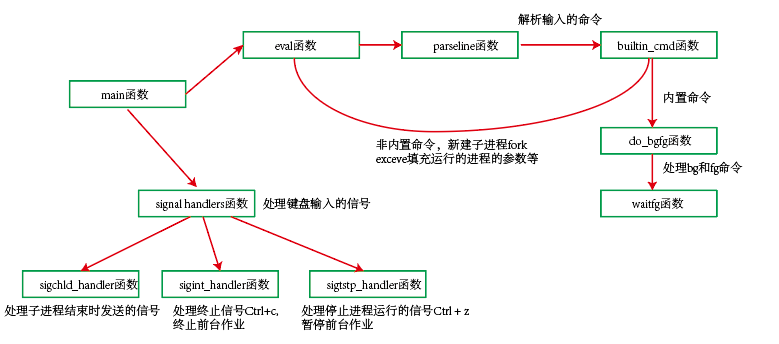

# Writing Your Own Unix Shell

该lab的内容是实现shell的功能。详细的解释在代码里面：主要是完成下列函数的编写。

```c
void eval(char *cmdline);//执行非内置命令
int builtin_cmd(char **argv);//执行内置命令
void do_bgfg(char **argv);//处理bg和fg命令
void waitfg(pid_t pid);//等待前台进程结束

void sigchld_handler(int sig);//SIGCHID信号处理程序
void sigtstp_handler(int sig);//SIGSTP信号处理程序
void sigint_handler(int sig);//SIGINT信号处理程序
```

## 函数之间的逻辑



1. eval函数：执行shell中的非内置命令
2. parseline函数：解析输入的命令行，并判断其是否是后台命令，若是后台命令，则返回1，若不是，则返回0（一个时刻只能有一个前台命令在执行，因此若是前台命令，则必须要等待当前的前台任务执行结束）
3. builtin_cmd函数：判断命令是否是内置命令，若是内置命令，则执行内置命令函数，若是非内置命令，则需要fork+execve函数来执行。若是内置命令，则返回1，若是非内置命令，则返回0。
4. listjobs函数：处理内置命令jobs，列出当前所有任务，包括前台任务，后台任务，暂停任务
5. exit函数：处理内置命令quits，退出当前程序
6. do_bgfg函数：处理内置命令bg和fg，首先判断是通过调用jib号还是pid号来操作作业（bg %jib，或 bg pid）。fg命令将该作业的状态变为前台作业，bg命令将该作业的状态变为后台作业。在操作全局数据时，通过sigprocmask函数来屏蔽所有信号，修改完全局数据后，通过sigprocmask函数来解除屏蔽。并且通过kill函数，来发送SIGCONT信号来给该作业的所有进程，使得后台进程变为前台进程。若命令是fg，还需要调用waitfg函数来等待前台作业结束。
7. waitfg函数：采用sleep函数来等待前台作业结束
8. 4-7都是处理内置命令，当为非内置命令时，则shell按照可执行程序来处理它，利用fork新建子进程，并且利用execve函数来替换子进程中的参数为输入的可执行程序的参数。这里涉及到父子进程的同步，当没有把新任务添加到全局jobs列表中时，必须要阻塞SIGCHID信号，因为若不阻塞，则可能子进程结束时，需要从jobs任务列表中删除任务时，此时任务尚未添加到jobs列表中，具体细节见代码。
9. sigchld_handler函数：SIGCHID信号的处理程序，采用waitpid函数来获取子进程结束时的状态：
   1. 当子进程是调用exit或者return返回时，此时子进程正常终止，调用deletejob函数来删除任务列表中的任务
   2. 当子进程收到终止信号而终止时, 返回导致子进程终止的信号编号，并调用deletejob函数
   3. 当子进程收到停止信号而停止时，将该进程对应的任务状态改为停止状态，并返回子进程停止的信号编号
10. sigint_handler函数：SIGINT信号（程序终止信号：ctrl+c）的处理程序，通过调用fgpid来获取前台任务的进程号，然后通过kill函数发送终止信号给该进程组。
11. sigtstp_handler函数：SIGTSTP 信号（程序停止信号：ctrl+z）的处理程序，通过调用fgpid来获取前台任务的进程号，然后通过kill函数发送停止信号给该进程组。

## 函数声明

```c
/* 
 * tsh - A tiny shell program with job control
 * 
 * <Put your name and login ID here>
 */
#include <stdio.h>
#include <stdlib.h>
#include <unistd.h>
#include <string.h>
#include <ctype.h>
#include <signal.h>
#include <sys/types.h>
#include <sys/wait.h>
#include <errno.h>

/* Misc manifest constants */
#define MAXLINE    1024   /* max line size */
#define MAXARGS     128   /* max args on a command line */
#define MAXJOBS      16   /* max jobs at any point in time */
#define MAXJID    1<<16   /* max job ID */

/* Job states */
#define UNDEF 0 /* undefined */
#define FG 1    /* running in foreground */
#define BG 2    /* running in background */
#define ST 3    /* stopped */

/* 
 * Jobs states: FG (foreground), BG (background), ST (stopped)
 * Job state transitions and enabling actions:
 *     FG -> ST  : ctrl-z
 *     ST -> FG  : fg command
 *     ST -> BG  : bg command
 *     BG -> FG  : fg command
 * At most 1 job can be in the FG state.
 */

/* Global variables */
extern char **environ;      /* defined in libc */
char prompt[] = "tsh> ";    /* command line prompt (DO NOT CHANGE) */
int verbose = 0;            /* if true, print additional output */
int nextjid = 1;            /* next job ID to allocate */
char sbuf[MAXLINE];         /* for composing sprintf messages */

struct job_t {              /* The job struct */
    pid_t pid;              /* job PID */
    int jid;                /* job ID [1, 2, ...] */
    int state;              /* UNDEF, BG, FG, or ST */
    char cmdline[MAXLINE];  /* command line */
};
struct job_t jobs[MAXJOBS]; /* The job list */
/* End global variables */


/* Function prototypes */

/* Here are the functions that you will implement */
void eval(char *cmdline);
int builtin_cmd(char **argv);
void do_bgfg(char **argv);
void waitfg(pid_t pid);

void sigchld_handler(int sig);
void sigtstp_handler(int sig);
void sigint_handler(int sig);

/* Here are helper routines that we've provided for you */
int parseline(const char *cmdline, char **argv); 
void sigquit_handler(int sig);

void clearjob(struct job_t *job);
void initjobs(struct job_t *jobs);
int maxjid(struct job_t *jobs); 
int addjob(struct job_t *jobs, pid_t pid, int state, char *cmdline);
int deletejob(struct job_t *jobs, pid_t pid); 
pid_t fgpid(struct job_t *jobs);
struct job_t *getjobpid(struct job_t *jobs, pid_t pid);
struct job_t *getjobjid(struct job_t *jobs, int jid); 
int pid2jid(pid_t pid); 
void listjobs(struct job_t *jobs);

void usage(void);
void unix_error(char *msg);
void app_error(char *msg);
typedef void handler_t(int);
handler_t *Signal(int signum, handler_t *handler);
```


## main 函数


```C
/*
 * main - The shell's main routine 
 */
int main(int argc, char **argv) 
{
    char c;
    char cmdline[MAXLINE];
    int emit_prompt = 1; /* emit prompt (default) */

    /* Redirect stderr to stdout (so that driver will get all output
     * on the pipe connected to stdout) */
    dup2(1, 2);

    /* Parse the command line */
    while ((c = getopt(argc, argv, "hvp")) != EOF) {
        switch (c) {
        case 'h':             /* print help message */
            usage();
	    break;
        case 'v':             /* emit additional diagnostic info */
            verbose = 1;
	    break;
        case 'p':             /* don't print a prompt */
            emit_prompt = 0;  /* handy for automatic testing */
	    break;
	default:
            usage();
	}
    }

    /* Install the signal handlers */

    /* These are the ones you will need to implement */
    Signal(SIGINT,  sigint_handler);   /* ctrl-c */
    Signal(SIGTSTP, sigtstp_handler);  /* ctrl-z */
    Signal(SIGCHLD, sigchld_handler);  /* Terminated or stopped child */

    /* This one provides a clean way to kill the shell */
    Signal(SIGQUIT, sigquit_handler); 

    /* Initialize the job list */
    initjobs(jobs);

    /* Execute the shell's read/eval loop */
    while (1) {

	/* Read command line */
	if (emit_prompt) {
	    printf("%s", prompt);
	    fflush(stdout);
	}
	if ((fgets(cmdline, MAXLINE, stdin) == NULL) && ferror(stdin))
	    app_error("fgets error");
	if (feof(stdin)) { /* End of file (ctrl-d) */
	    fflush(stdout);
	    exit(0);
	}

	/* Evaluate the command line */
	eval(cmdline);
	fflush(stdout);
	fflush(stdout);

    } 

    exit(0); /* control never reaches here */
}
```

## eval函数 执行非内置命令

```c

/* 
 * eval - Evaluate the command line that the user has just typed in
 * 
 * If the user has requested a built-in command (quit, jobs, bg or fg)
 * then execute it immediately. Otherwise, fork a child process and
 * run the job in the context of the child. If the job is running in
 * the foreground, wait for it to terminate and then return.  Note:
 * each child process must have a unique process group ID so that our
 * background children don't receive SIGINT (SIGTSTP) from the kernel
 * when we type ctrl-c (ctrl-z) at the keyboard.  
*/
void eval(char *cmdline) 
{
	char *argv[MAXARGS];
	char buf[MAXLINE];
	int bg;
	pid_t pid;
	
	sigset_t mask_all, mask_one, prev_one;//信号集变量
    
	strcpy(buf, cmdline);
	bg = parseline(buf, argv);
	if (argv[0] == NULL)
		return;

	if(!builtin_cmd(argv)){
		sigfillset(&mask_all); // 把每个信号都加到信号集中
		sigemptyset(&mask_one);// 初始化信号集合为空集合
		sigaddset(&mask_one, SIGCHLD);//把SIGCHID信号添加到信号集中

		sigprocmask(SIG_BLOCK, &mask_one, &prev_one);//把SIGCHID信号添加到block中，即阻塞SIGCHID信号，来实现父子进程的同步，
                                                     //即保证子进程结束时，在jobs列表中删除job在后，父进程在jobs添加job在前
		if ((pid = fork()) == 0){
			setpgid(0, 0); //将每个子进程放入一个新的进程组，避免子进程与shell主进程在同一个进程组，使得信号发生时出现问题
			sigprocmask(SIG_SETMASK, &prev_one, NULL);//在子进程中将SIGCHID信号解除阻塞，使得子进程在结束时，可以发送SIGCHID信号给父进程
			if (execve(argv[0], argv, environ) < 0){ //执行子进程
				printf("%s: Command not found.\n", argv[0]);
				exit(0);
			}
		}	
	
		sigprocmask(SIG_BLOCK, &mask_all, NULL);//在操作全局变量jobs时，为了避免其他进程同时对jobs变量进行修改，此时需要屏蔽所有信号
		addjob(jobs, pid, bg?BG:FG, cmdline); //添加job到jobs列表
		sigprocmask(SIG_SETMASK, &prev_one, NULL);//解除SIGCHID信号的阻塞，可以接受到子进程的SIGCHID信号
		if (!bg){
			/* if(strcmp(argv[0], "/bin/echo"))
				addjob(jobs, pid, FG, cmdline); */
			waitfg(pid);//如果子进程是前台进程，等待前台进程结束
			
		}
		else{
			printf("[%d] (%d) %s", pid2jid(pid), pid, cmdline);
		}
	}
    return;
}
```


## parseline函数

```c


/* 
 * parseline - Parse the command line and build the argv array.
 * 
 * Characters enclosed in single quotes are treated as a single
 * argument.  Return true if the user has requested a BG job, false if
 * the user has requested a FG job.  
 */
int parseline(const char *cmdline, char **argv) 
{
    static char array[MAXLINE]; /* holds local copy of command line */
    char *buf = array;          /* ptr that traverses command line */
    char *delim;                /* points to first space delimiter */
    int argc;                   /* number of args */
    int bg;                     /* background job? */

    strcpy(buf, cmdline);
    buf[strlen(buf)-1] = ' ';  /* replace trailing '\n' with space */
    while (*buf && (*buf == ' ')) /* ignore leading spaces */
	buf++;

    /* Build the argv list */
    argc = 0;
    if (*buf == '\'') {
	buf++;
	delim = strchr(buf, '\'');
    }
    else {
	delim = strchr(buf, ' ');
    }

    while (delim) {
	argv[argc++] = buf;
	*delim = '\0';
	buf = delim + 1;
	while (*buf && (*buf == ' ')) /* ignore spaces */
	       buf++;

	if (*buf == '\'') {
	    buf++;
	    delim = strchr(buf, '\'');
	}
	else {
	    delim = strchr(buf, ' ');
	}
    }
    argv[argc] = NULL;
    
    if (argc == 0)  /* ignore blank line */
	return 1;

    /* should the job run in the background? */
    if ((bg = (*argv[argc-1] == '&')) != 0) {
	argv[--argc] = NULL;
    }
    return bg;
}
```

## builtin_cmd函数 执行内置命令

```c
/* 
 * builtin_cmd - If the user has typed a built-in command then execute
 *    it immediately.  
 */
int builtin_cmd(char **argv) 
{
    /*当命令是quit、jobs、bg和fg时,该命令是shell的内建命令，直接执行此命令，否则认为该命令是非内建命令，需要用fork和execve新建子进程运行*/
	if(!strcmp(argv[0], "quit"))
		exit(0);
	if(!strcmp(argv[0], "jobs")){
		listjobs(jobs);
		return 1;
	}

	/* if(!strcmp(argv[0], "/bin/echo")){
		return 1;
	} */
	if (!strcmp(argv[0], "&"))
		return 1;

	if(!strcmp(argv[0], "bg") || !strcmp(argv[0], "fg")){
		do_bgfg(argv);
		return 1;
	}

    return 0;     /* not a builtin command */
}
```

## do_bgfg函数 处理bg和fg命令

```c

/* 
 * do_bgfg - Execute the builtin bg and fg commands
 */
void do_bgfg(char **argv) 
{
	int jid;
	struct job_t *job;
	pid_t pid;
	sigset_t mask_all, prev_all;
	
	if(argv[1] == NULL){
		printf("%s command requires PID or %%jobid argument\n", argv[0]);
		return;
	}

    /* 判断是通过调用jib号还是pid号来操作作业或者是进程，bg %jib，或 bg pid*/
	if(sscanf(argv[1], "%%%d", &jid) > 0){
		job = getjobjid(jobs, jid);//通过jid来获取作业job
		if(job == NULL || job->state == UNDEF){//如果作业不存在，或者状态时UNDEF，则跳过
			printf("%s: No such job\n", argv[1]);
			return;
		}
	}else if(sscanf(argv[1], "%d", &pid) > 0){
		job = getjobpid(jobs,pid);//通过pid来获取作业job
		if(job == NULL || job->state == UNDEF){//如果作业不存在，或者状态时UNDEF，则跳过
			printf("(%s): No such process\n", argv[1]);
			return;
		}
	}else{
		printf("%s: argument must be a PID or %%jobid\n", argv[0]);
		return;
	}


	sigfillset(&mask_all); 
	sigprocmask(SIG_BLOCK, &mask_all, &prev_all);//屏蔽所有信号，准备操作全局变量jobs
	if(!strcmp(argv[0], "fg")){//如果该命令是fg，则将job的状态改为FG
		job->state = FG;
	}else{
		job->state = BG;//如果该命令是Bg，则将job的状态改为FG
	}
	sigprocmask(SIG_SETMASK, &prev_all, NULL);//解除屏蔽

	pid = job->pid;//获得进程的pid
	kill(-pid, SIGCONT);//发送SIGCONT信号给该进程所在的进程组，如果该进程组的进程是在运行的，则该信号是忽略的，如果该进程是停止的，则收到SIGCONT信号后继续运行。
	if(!strcmp(argv[0], "fg")){//如果命令是fg，则需要等待前台进程运行结束
		waitfg(pid);
	}else{
		printf("[%d] (%d) %s", job->jid, pid, job->cmdline);
	}
    return;
}

```

## waitfg函数 等待前台进程结束

```c
/* 
 * waitfg - Block until process pid is no longer the foreground process
 */
void waitfg(pid_t pid)
{
	while(pid == fgpid(jobs)){//采用sleep来等待前台进程运行结束
		sleep(1);
	};
    return;
}
```

## signal handlers函数

```c
/*****************
 * Signal handlers
 *****************/

/* 
 * sigchld_handler - The kernel sends a SIGCHLD to the shell whenever
 *     a child job terminates (becomes a zombie), or stops because it
 *     received a SIGSTOP or SIGTSTP signal. The handler reaps all
 *     available zombie children, but doesn't wait for any other
 *     currently running children to terminate.  
 */
void sigchld_handler(int sig) 
{
	int olderrno = errno;
	sigset_t mask_all, prev_all;
	pid_t pid;
	struct job_t *job;
	
	int state;

	sigfillset(&mask_all);
	while ((pid = waitpid(-1, &state, WNOHANG | WUNTRACED)) > 0){//等待子进程结束，-1表示等待的集合是由父进程所有的子进程组成的，
                                                   //WNOHANG表示当等待的子进程没有任何一个终止时，则立即返回0，
                                                  //UNTRACED表示挂起调用进程的进行，知道等待集合中的一个进程终止或停止，返回该进程的pid号

		sigprocmask(SIG_BLOCK, &mask_all, &prev_all);//屏蔽所有信号，准备操作全局变量jobs
        /*判断子进程结束的不同方式*/
		if(WIFEXITED(state)){//子进程通过调用exit或者return返回，此时子进程正常终止
			deletejob(jobs, pid);		
		}else if(WIFSIGNALED(state)){//子进程收到终止信号而结束, WTERMSIG返回导致子进程终止的信号编号
			printf("Job [%d] (%d) terminated by signal %d\n", pid2jid(pid), pid, WTERMSIG(state));
			deletejob(jobs, pid);
		}else if(WIFSTOPPED(state)){//子进程收到停止信号而停止
			job = getjobpid(jobs, pid);
			job->state = ST;
			printf("Job [%d] (%d) stopped by signal %d\n", job->jid, pid, WSTOPSIG(state));//WSTOPSIG返回导致子进程停止的信号
		};


		sigprocmask(SIG_SETMASK, &prev_all, NULL);//解除屏蔽

	}
	
	errno = olderrno;
    return;
}

/* 
 * sigint_handler - The kernel sends a SIGINT to the shell whenver the
 *    user types ctrl-c at the keyboard.  Catch it and send it along
 *    to the foreground job.  
 */
void sigint_handler(int sig) 
{
	int FGpid;
	FGpid = fgpid(jobs);
	if (!FGpid){
		printf("sigint No Fg\n");
		return;
	}else{
		kill(-FGpid, sig);//将SIGINT信号发送给前台作业所在的进程组的进程
	}
    return;
}

/*
 * sigtstp_handler - The kernel sends a SIGTSTP to the shell whenever
 *     the user types ctrl-z at the keyboard. Catch it and suspend the
 *     foreground job by sending it a SIGTSTP.  
 */
void sigtstp_handler(int sig) 
{
    int FGpid, FGjid;
	FGpid = fgpid(jobs);
	if (!FGpid){
		printf("sigtstp No Fg\n");
		return;
	}else{
		kill(-FGpid, sig);//将SIGTSTP信号发送给前台作业所在的进程组的进程
	}
	
    return;
}

/*********************
 * End signal handlers
 *********************/
```


## helper函数

```c


/***********************************************
 * Helper routines that manipulate the job list
 **********************************************/

/* clearjob - Clear the entries in a job struct */
void clearjob(struct job_t *job) {
    job->pid = 0;
    job->jid = 0;
    job->state = UNDEF;
    job->cmdline[0] = '\0';
}

/* initjobs - Initialize the job list */
void initjobs(struct job_t *jobs) {
    int i;

    for (i = 0; i < MAXJOBS; i++)
	clearjob(&jobs[i]);
}

/* maxjid - Returns largest allocated job ID */
int maxjid(struct job_t *jobs) 
{
    int i, max=0;

    for (i = 0; i < MAXJOBS; i++)
	if (jobs[i].jid > max)
	    max = jobs[i].jid;
    return max;
}

/* addjob - Add a job to the job list */
int addjob(struct job_t *jobs, pid_t pid, int state, char *cmdline) 
{
    int i;
    
    if (pid < 1)
	return 0;

    for (i = 0; i < MAXJOBS; i++) {
	if (jobs[i].pid == 0) {
	    jobs[i].pid = pid;
	    jobs[i].state = state;
	    jobs[i].jid = nextjid++;
	    if (nextjid > MAXJOBS)
		nextjid = 1;
	    strcpy(jobs[i].cmdline, cmdline);
  	    if(verbose){
	        printf("Added job [%d] %d %s\n", jobs[i].jid, jobs[i].pid, jobs[i].cmdline);
            }
            return 1;
	}
    }
    printf("Tried to create too many jobs\n");
    return 0;
}

/* deletejob - Delete a job whose PID=pid from the job list */
int deletejob(struct job_t *jobs, pid_t pid) 
{
    int i;

    if (pid < 1)
	return 0;

    for (i = 0; i < MAXJOBS; i++) {
	if (jobs[i].pid == pid) {
	    clearjob(&jobs[i]);
	    nextjid = maxjid(jobs)+1;
	    return 1;
	}
    }
    return 0;
}

/* fgpid - Return PID of current foreground job, 0 if no such job */
pid_t fgpid(struct job_t *jobs) {
    int i;

    for (i = 0; i < MAXJOBS; i++)
	if (jobs[i].state == FG)
	    return jobs[i].pid;
    return 0;
}

/* getjobpid  - Find a job (by PID) on the job list */
struct job_t *getjobpid(struct job_t *jobs, pid_t pid) {
    int i;

    if (pid < 1)
	return NULL;
    for (i = 0; i < MAXJOBS; i++)
	if (jobs[i].pid == pid)
	    return &jobs[i];
    return NULL;
}

/* getjobjid  - Find a job (by JID) on the job list */
struct job_t *getjobjid(struct job_t *jobs, int jid) 
{
    int i;

    if (jid < 1)
	return NULL;
    for (i = 0; i < MAXJOBS; i++)
	if (jobs[i].jid == jid)
	    return &jobs[i];
    return NULL;
}

/* pid2jid - Map process ID to job ID */
int pid2jid(pid_t pid) 
{
    int i;

    if (pid < 1)
	return 0;
    for (i = 0; i < MAXJOBS; i++)
	if (jobs[i].pid == pid) {
            return jobs[i].jid;
        }
    return 0;
}

/* listjobs - Print the job list */
void listjobs(struct job_t *jobs) 
{
    int i;
    
    for (i = 0; i < MAXJOBS; i++) {
	if (jobs[i].pid != 0) {
	    printf("[%d] (%d) ", jobs[i].jid, jobs[i].pid);
	    switch (jobs[i].state) {
		case BG: 
		    printf("Running ");
		    break;
		case FG: 
		    printf("Foreground ");
		    break;
		case ST: 
		    printf("Stopped ");
		    break;
	    default:
		    printf("listjobs: Internal error: job[%d].state=%d ", 
			   i, jobs[i].state);
	    }
	    printf("%s", jobs[i].cmdline);
	}
    }
}
/******************************
 * end job list helper routines
 ******************************/


/***********************
 * Other helper routines
 ***********************/

/*
 * usage - print a help message
 */
void usage(void) 
{
    printf("Usage: shell [-hvp]\n");
    printf("   -h   print this message\n");
    printf("   -v   print additional diagnostic information\n");
    printf("   -p   do not emit a command prompt\n");
    exit(1);
}

/*
 * unix_error - unix-style error routine
 */
void unix_error(char *msg)
{
    fprintf(stdout, "%s: %s\n", msg, strerror(errno));
    exit(1);
}

/*
 * app_error - application-style error routine
 */
void app_error(char *msg)
{
    fprintf(stdout, "%s\n", msg);
    exit(1);
}

/*
 * Signal - wrapper for the sigaction function
 */
handler_t *Signal(int signum, handler_t *handler) 
{
    struct sigaction action, old_action;

    action.sa_handler = handler;  
    sigemptyset(&action.sa_mask); /* block sigs of type being handled */
    action.sa_flags = SA_RESTART; /* restart syscalls if possible */

    if (sigaction(signum, &action, &old_action) < 0)
	unix_error("Signal error");
    return (old_action.sa_handler);
}

/*
 * sigquit_handler - The driver program can gracefully terminate the
 *    child shell by sending it a SIGQUIT signal.
 */
void sigquit_handler(int sig) 
{
    printf("Terminating after receipt of SIGQUIT signal\n");
    exit(1);
}
```

