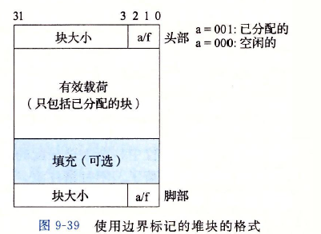
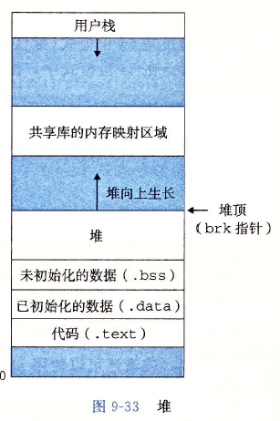
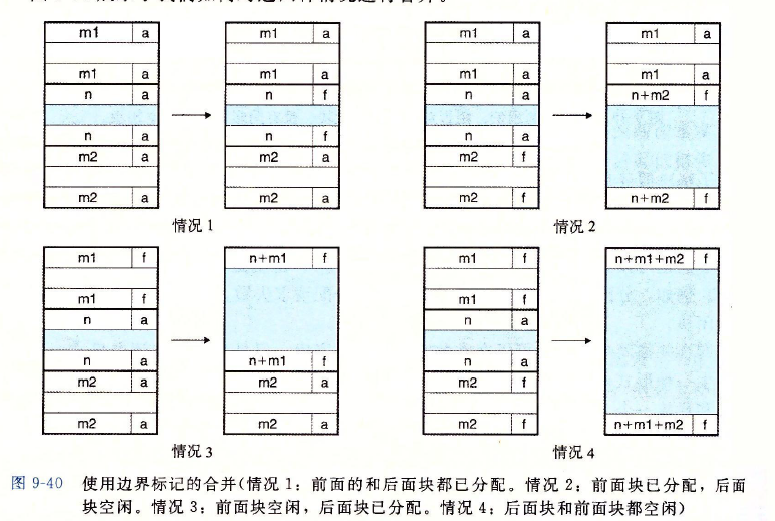
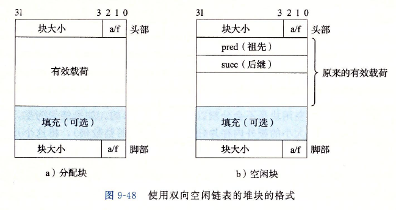
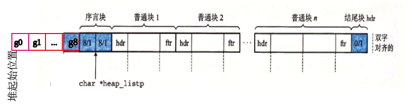
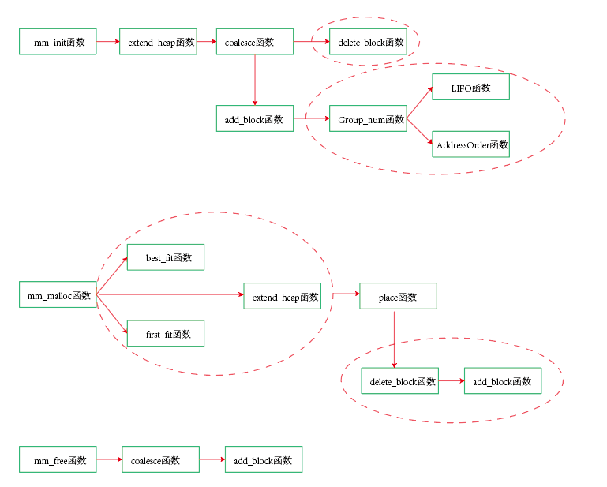

# Malloc Lab: Writing a Dynamic Storage Allocator

该lab是实现一个动态内存分配器。分配器的要求：

1. 立即响应请求：分配器必须立即响应请求，不允许分配器为了提高性能重新排列或者缓冲请求
2. 处理任意请求序列：应用可以任意的分配请求和释放请求，只需要满足释放的请求必须对应与当前已分配的一个块
3. 只使用堆：分配器使用的任何数据结构都必须保存在堆里
4. 对齐块：分配器必须对齐块，使得它们可以保存任何类型的数据对象
5. 不修改已分配的块：分配器只能操作或者改变空闲块，一旦块被分配了，就不允许修改或者移动

主要实现以下四个函数

```c
extern int mm_init (void);
extern void *mm_malloc (size_t size);
extern void mm_free (void *ptr);
extern void *mm_realloc(void *ptr, size_t size);
```

方案1：首先按照课本上给出的提示完成基于 **隐式空闲列表** 数据结构的分配器。

其整体结构为：


隐式空闲列表的数据结构为：



主要实现代码为：

1. 宏定义：具体解释可参考书上P599

```C
#define ALIGNMENT 8
#define ALIGN(size) (((size) + (ALIGNMENT-1)) & ~0x7)
#define SIZE_T_SIZE (ALIGN(sizeof(size_t)))

#define WSIZE 4
#define DSIZE 8
#define CHUNKSIZE (1<<12)

#define MAX(x, y) ((x) > (y)? (x) : (y))

#define PACK(size, alloc) ((size) | (alloc))

#define GET(p) (*(unsigned int *)(p))
#define PUT(p, val) (*(unsigned int *)(p) = val)

#define GET_SIZE(p) (GET(p) & ~0x7)
#define GET_ALLOC(p) (GET(p) & 0x1)

#define HDRP(bp) ((char *)(bp) - WSIZE)
#define FTRP(bp) ((char *)(bp) + GET_SIZE(HDRP(bp)) - DSIZE)

#define NEXT_BLKP(bp) ((char *)(bp) + GET_SIZE(HDRP(bp)))
#define PREV_BLKP(bp) ((char *)(bp) - GET_SIZE(HDRP(bp) - WSIZE))
```

2.  初始化函数实现：首先分配4字节的堆，分别为对齐块、2个目录块和1个结尾块，目录快和结尾块的分配位为1，可以在实现合并函数时帮助我们更快的识别内存分配块的边界，$heap\_listp$指向序言块，即内存分配块的起点。mem_sbrk函数扩展堆的边界，即移动brk指针的位置（在模拟器中，整个模拟内存的大小由sbrk指针决定）。



```C
void *heap_listp;
;
/* 
 * mm_init - initialize the malloc package.
 */
int mm_init(void)
{
	if ((heap_listp = mem_sbrk(4 * WSIZE)) == (void *)-1) //
		return -1;
	PUT(heap_listp, 0);
	PUT(heap_listp + (1 * WSIZE), PACK(DSIZE, 1));
	PUT(heap_listp + (2 * WSIZE), PACK(DSIZE, 1));
	PUT(heap_listp + (3 * WSIZE), PACK(0, 1));
	heap_listp += (2 * WSIZE);

	next_ptr = heap_listp;
	if (extend_heap(CHUNKSIZE/WSIZE) == NULL)
		return -1;
    return 0;
}

```

extend_heap函数：当已有堆的大小无法满足需要时，扩展堆的大小，按照4KB每页大小进行扩大。

```c
void *extend_heap(size_t words){
	char *ptr;
	size_t size;

	size = (words % 2) ? (words + 1) * WSIZE: words * WSIZE;
	if((long)(ptr = mem_sbrk(size)) == -1)
		return NULL;

	PUT(HDRP(ptr), PACK(size, 0));
	PUT(FTRP(ptr), PACK(size, 0));
	PUT(HDRP(NEXT_BLKP(ptr)), PACK(0, 1));
	return coalesce(ptr);
}
```

coalesce函数：进行空闲块的合并, 空闲块的合并分为四种情况。



```c
void *coalesce(void *ptr)
{
	size_t prev_alloc = GET_ALLOC(FTRP(PREV_BLKP(ptr)));
	size_t next_alloc = GET_ALLOC(HDRP(NEXT_BLKP(ptr)));
	size_t size = GET_SIZE(HDRP(ptr));

	if (prev_alloc && next_alloc){
		return ptr;
	}
	else if (prev_alloc && !next_alloc){
		size += GET_SIZE(HDRP(NEXT_BLKP(ptr)));
		PUT(HDRP(ptr), PACK(size, 0));
		PUT(FTRP(ptr), PACK(size, 0));
	}
	else if (!prev_alloc && next_alloc){
		size += GET_SIZE(HDRP(PREV_BLKP(ptr)));
		PUT(FTRP(ptr), PACK(size, 0));
		PUT(HDRP(PREV_BLKP(ptr)), PACK(size, 0));
		ptr = PREV_BLKP(ptr);
	}

	else {
		size += GET_SIZE(HDRP(PREV_BLKP(ptr))) + GET_SIZE(FTRP(NEXT_BLKP(ptr)));
		PUT(HDRP(PREV_BLKP(ptr)), PACK(size, 0));
		PUT(FTRP(NEXT_BLKP(ptr)), PACK(size, 0));
		ptr = PREV_BLKP(ptr);
	}

    /* 采用下一次适配法时需要这部分代码，采用首次适配时可以不需要这部分*/
	if(((char *)next_ptr > (char *)ptr) && ((char *)next_ptr < (char *)NEXT_BLKP(ptr)))
		next_ptr = ptr;
	return ptr;
}
```

2. mm_malloc函数：对所需的尺寸先进行8字节对齐处理，然后才有next_fit进行搜索空闲块进行分配内存。当空闲块不满足要求时，扩展堆的大小来满足要求。

```c
/* 
 * mm_malloc - Allocate a block by incrementing the brk pointer.
 *     Always allocate a block whose size is a multiple of the alignment.
 */
void *mm_malloc(size_t size)
{
	char *ptr;
	if(size == 0)
		return NULL;
	int newsize;
	if(size <= DSIZE)
    		newsize = 2 * DSIZE;
	else
		newsize = ALIGN(size + SIZE_T_SIZE);
	
	if ((ptr = next_fit(newsize)) != NULL){
		place(ptr, newsize);
		return ptr;	
	}
	
		size_t extendsize = MAX(newsize, CHUNKSIZE);
		if ((ptr = extend_heap(extendsize/WSIZE)) == NULL)
			return NULL;
		place(ptr, newsize);
		
		return ptr;
}
```

分配函数有：next_fit函数和first_fit函数

```c
void *first_fit(size_t size)
{
	void *ptr;
	for(ptr = heap_listp; GET_SIZE(HDRP(ptr)) > 0; ptr = NEXT_BLKP(ptr)){
		if (!GET_ALLOC(HDRP(ptr)) && (size <= GET_SIZE(HDRP(ptr))))
			return ptr;
	}
	return NULL;
}
```

```c
void *next_fit(size_t size)
{
	void *old_ptr = next_ptr;
    /*从上次找到的位置开始继续搜寻，直到末尾*/
	for( ; GET_SIZE(HDRP(next_ptr)) > 0; next_ptr = NEXT_BLKP(next_ptr)){
		if (!GET_ALLOC(HDRP(next_ptr)) && (size <= GET_SIZE(HDRP(next_ptr)))){
			return next_ptr;
		}
	}
	/*从起始位置开始搜寻， 直到上一次结束的位置*/
	for(next_ptr = heap_listp; next_ptr < old_ptr; next_ptr = NEXT_BLKP(next_ptr)){
		if (!GET_ALLOC(HDRP(next_ptr)) && (size <= GET_SIZE(HDRP(next_ptr)))){
			return next_ptr;
			}
	}
	return NULL;
}
```

place函数：找到空闲块后，将该空闲块分配给所需的程序，若该空闲块过大，则对空闲块进行分割，满足所需后剩下的空闲块继续保留为未分配。

```c
void place(void *ptr, size_t size)
{
	size_t csize = GET_SIZE(HDRP(ptr));

	if((csize - size) >= (2 * DSIZE)){
		PUT(HDRP(ptr), PACK(size, 1));
		PUT(FTRP(ptr), PACK(size, 1));
		ptr = NEXT_BLKP(ptr);
		PUT(HDRP(ptr), PACK(csize - size, 0));
		PUT(FTRP(ptr), PACK(csize - size, 0));
	}
	else{
		PUT(HDRP(ptr), PACK(csize, 1));
		PUT(FTRP(ptr), PACK(csize, 1));
	}
}
```

3. mm_free:释放内存函数，释放已分配内存块后，立即合并空闲内存块。

```c
/*
 * mm_free - Freeing a block does nothing.
 */
void mm_free(void *ptr)
{
	size_t size = GET_SIZE(HDRP(ptr));

	PUT(HDRP(ptr), PACK(size, 0));
	PUT(FTRP(ptr), PACK(size, 0));
	coalesce(ptr);
}
```

4.  mm_realloc函数：重新分配内存函数，当重新分配内存的大小比原有的大小更大时，先判断在旧内存块的相邻的下一个块是否是空闲块，并且判断尺寸是否满足需求。 若满足需求，直接将旧内存块和该空闲块分配给用户，若不符合需求，则重新分配整个所需尺寸大小的内存块，并将原来的数据复制到新内存块中。其他情况比较简单，见代码即可。

```c
void *mm_realloc(void *ptr, size_t size)
{
    void *oldptr = ptr;
    void *newptr;
    size_t oldSize, newsize;
    if (ptr == NULL){
		newptr = mm_malloc(size);
		return newptr;
    }

    if (size == 0){
		mm_free(ptr);
		return NULL;
    }
    
    if(size <= DSIZE)
		newsize = 2 * DSIZE;
    else
		newsize = ALIGN(size + SIZE_T_SIZE);


    oldSize = GET_SIZE(HDRP(oldptr));
    if(oldSize == newsize)
		return oldptr;
    if (newsize < oldSize){
		place(oldptr, newsize);
		return oldptr;
    }else{
        size_t next_alloc = GET_ALLOC(HDRP(NEXT_BLKP(oldptr)));
        size_t all_size = oldSize + GET_SIZE(HDRP(NEXT_BLKP(oldptr)));
        if(!next_alloc && (all_size >= newsize)){
            if (all_size - newsize >= 2 * DSIZE){
                PUT(HDRP(oldptr), PACK(newsize, 1));
                PUT(FTRP(oldptr), PACK(newsize, 1));
                PUT(HDRP(NEXT_BLKP(oldptr)), PACK(all_size - newsize, 0));
                PUT(FTRP(NEXT_BLKP(oldptr)), PACK(all_size - newsize, 0));
            }else{
                PUT(HDRP(oldptr), PACK(all_size, 1));
                PUT(FTRP(oldptr), PACK(all_size, 1));
            }
            return oldptr;
	}else{
	    newptr = mm_malloc(newsize);
	    memcpy(newptr, oldptr, oldSize - DSIZE);
	    mm_free(oldptr);
	    return newptr;
	}
    }
}
```

方案2：采用分离适配法实现内存分配器，基于  **显示双向空闲列表** 数据结构的分配器。（注意：后继和祖先存放的位置对调）

**分离适配法**：分配器维护着一个空闲链表的数组，每个空闲链表是和一个大小类相关联的，并且被组织成某种类型的显示或隐式链表，每个链表包含潜在的大小不同的块。C标准库中的GNU malloc包就是采用该方法。分离适配法搜索时间更快，显示链表的缺点在于空闲块必须足够大，来包含所有需要的指针，以及头部和脚部指针，这就导致了更大的最小块大小，也潜在的提高了内部碎片的程度。



分为9个大小类，分别为：
$$
{16-31}，{32-63},{2^6-(2^7-1)},{...},{2^{11}-(4096-1)},{4096-inf}
$$


整个分配器的结构为



从堆起始位置开始是9个大小类的起始位置，每个大小类与后续的相对应大小的空闲块构成一个链表，形成逻辑上的相互连接关系。

整个代码结构：



1. mm_init函数：初始化分配器
2. extend_heap函数：当堆内存不够时，申请新的堆内存（移动sbrk指针）
3. coalesce函数：合并相邻的空闲块，若能合并时，需要在空闲链表的大小类中删除被合并的空闲块（即删除双向链表的特定节点）
4. add_block函数：将空闲块添加到大小类中，首先调用Group_num函数来根据空闲块的大小来确定空闲块在哪个大小类中，然后采用LIFO函数或AddressOrder函数来插入空闲块。
   1. LIFO函数：采用后进先出的顺序维护链表，将空闲块的位置放置在链表的开始处。
   2. AddressOrder函数：按照地址顺序来维护链表，其中链表中每个块的地址都小于它后继的地址。在这种情况下，需要线性的时间搜索来定位空闲块所需要插入的位置。这种方法的首次适配策略比LIFO方法的首次适配策略有更高的内存利用率。
5. mm_malloc函数：分配器为应用分配所请求指定大小的内存块，可以根据采用first_fit和best_fit方法来根据所需的内存块大小来从大小类中找到满足要求的空闲块。
   1. first_fit函数：首次适配法, 先根据空闲块的尺寸找到对应的大小类，并从此大小类开始，遍历大小类的空闲块，直到找到满足要求的空闲块，若没有，则返回NULL（需要扩展堆）
   2. best_fit函数：最佳适配法，根据空闲块的尺寸找到对应的大小类，并从此大小类开始，遍历大小类的空闲块，找到满足所需要求的最小尺寸的空闲块。若没有，则返回NULL（需要扩展堆）
   3. extend_heap函数：若空闲块中此时没有符合要求的指定大小的块，则需要扩展堆
6. place函数：找到符合要求的空闲块，进行分配给用户，并且需要在空闲链表中删除，而且若空闲块还进行了分割，则分割后多余的空闲块也需要添加到空闲链表中
7. mm_free函数：释放的空闲块，并且通过coalesce函数立即合并空闲块，然后添加到空闲块链表中。

整个实现代码如下：

1. 宏定义基本同上，多了获取后继指针和祖先指针的宏。

```c
#define ALIGNMENT 8
#define ALIGN(size) (((size) + (ALIGNMENT-1)) & ~0x7)
#define SIZE_T_SIZE (ALIGN(sizeof(size_t)))
#define WSIZE 4
#define DSIZE 8
#define CHUNKSIZE (1<<12)

#define MAX(x, y) ((x) > (y)? (x) : (y))

#define PACK(size, alloc) ((size) | (alloc))

#define GET(p) (*(unsigned int *)(p))
#define PUT(p, val) (*(unsigned int *)(p) = val)

#define GET_SIZE(p) (GET(p) & ~0x7)
#define GET_ALLOC(p) (GET(p) & 0x1)

#define HDRP(bp) ((char *)(bp) - WSIZE)
#define FTRP(bp) ((char *)(bp) + GET_SIZE(HDRP(bp)) - DSIZE)

#define NEXT_BLKP(bp) ((char *)(bp) + GET_SIZE(HDRP(bp))) // 物理相邻的下一个块
#define PREV_BLKP(bp) ((char *)(bp) - GET_SIZE(HDRP(bp) - WSIZE)) // 物理相邻的上一个块

#define PRED(bp) ((char*)(bp) + WSIZE)
#define SUCC(bp) ((char*)(bp))
#define PRED_BLKP(bp) (GET(PRED(bp)))// 逻辑相邻的上一个块
#define SUCC_BLKP(bp) (GET(SUCC(bp)))// 逻辑相邻的下一个块
```

2. mm_init函数：基本同上，区别在于9个大小类的起始位置初始化为NULL指针。

```c
/* 
 * mm_init - initialize the malloc package.
 */
int mm_init(void)
{
	if ((heap_listp = mem_sbrk(12 * WSIZE)) == (void *)-1)
		return -1;
	PUT(heap_listp + (0 * WSIZE), NULL);
	PUT(heap_listp + (1 * WSIZE), NULL);
	PUT(heap_listp + (2 * WSIZE), NULL);
	PUT(heap_listp + (3 * WSIZE), NULL);
	PUT(heap_listp + (4 * WSIZE), NULL);
	PUT(heap_listp + (5 * WSIZE), NULL);
	PUT(heap_listp + (6 * WSIZE), NULL);
	PUT(heap_listp + (7 * WSIZE), NULL);
	PUT(heap_listp + (8 * WSIZE), NULL);

	PUT(heap_listp + (9 * WSIZE), PACK(DSIZE, 1));
	PUT(heap_listp + (10 * WSIZE), PACK(DSIZE, 1));
	PUT(heap_listp + (11 * WSIZE), PACK(0, 1));

	listp = heap_listp;
	heap_listp += 10 * WSIZE;

	if (extend_heap(CHUNKSIZE/WSIZE) == NULL)
		return -1;
    return 0;
}

```

extend_heap函数：在扩展堆内存时，调整结束块的位置，初始化空闲块的后继指针和祖先指针为NULL，并且合并空闲的内存块，该空闲内存块在需要添加到对应的大小类中（add_block函数)，构成逻辑上的连接。

```c
void *extend_heap(size_t words){
	void *ptr;
	size_t size;

	size = (words % 2) ? (words + 1) * WSIZE: words * WSIZE;
	if((ptr = mem_sbrk(size)) == (void *)-1)
		return NULL;

	PUT(HDRP(ptr), PACK(size, 0));
	PUT(FTRP(ptr), PACK(size, 0));
	PUT(HDRP(NEXT_BLKP(ptr)), PACK(0, 1));//调整结束块的位置
	
	PUT(PRED(ptr), NULL);
	PUT(SUCC(ptr), NULL);

	ptr = coalesce(ptr);
	ptr = add_block(ptr);
	return ptr;
}
```

coalesce函数：基本同上，区别在于合并了的空闲块，需要在原有的大小类中删除已经合并的空闲块。

```c
void *coalesce(void *ptr)
{
	size_t prev_alloc = GET_ALLOC(FTRP(PREV_BLKP(ptr)));
	size_t next_alloc = GET_ALLOC(HDRP(NEXT_BLKP(ptr)));
	size_t size = GET_SIZE(HDRP(ptr));

	if (prev_alloc && next_alloc){
		return ptr;
	}else if (prev_alloc && !next_alloc){
		size += GET_SIZE(HDRP(NEXT_BLKP(ptr)));
		delete_block(NEXT_BLKP(ptr));//删除已经合并的空闲块
		PUT(HDRP(ptr), PACK(size, 0));
		PUT(FTRP(ptr), PACK(size, 0));		
	}else if (!prev_alloc && next_alloc){
		size += GET_SIZE(FTRP(PREV_BLKP(ptr)));
		delete_block(PREV_BLKP(ptr));
		PUT(HDRP(PREV_BLKP(ptr)), PACK(size, 0));
		PUT(FTRP(ptr), PACK(size, 0));
		ptr = PREV_BLKP(ptr);
	}else {
		size += GET_SIZE(HDRP(NEXT_BLKP(ptr))) + GET_SIZE(FTRP(PREV_BLKP(ptr)));
		delete_block(NEXT_BLKP(ptr));
		delete_block(PREV_BLKP(ptr));
		PUT(HDRP(PREV_BLKP(ptr)), PACK(size, 0));
		PUT(FTRP(NEXT_BLKP(ptr)), PACK(size, 0));
		ptr = PREV_BLKP(ptr);
	}	
	return ptr;
}
```

delete_block函数：在大小类中删除对应的空闲块。实际上就是双向链表的删除操作。

```c
void delete_block(void *ptr)
{
	PUT(SUCC(PRED_BLKP(ptr)), SUCC_BLKP(ptr));
	if(SUCC_BLKP(ptr) != NULL){ //这就是为什么后继指针和祖先指针需要对调的位置，因为在初始化时，只有一个字节大小，
                                //因此要存放后继指针，这样代码的形式就更加统一，在初始化时，该后继指针就为NULL指针。
		PUT(PRED(SUCC_BLKP(ptr)), PRED_BLKP(ptr));	
	}
}
```

add_block函数：将新的内存块分配到对应的大小类中。

```c
void *add_block(void *ptr)
{
	size_t size = GET_SIZE(HDRP(ptr));
	int group_num = Group_num(size);//选择哪个大小类，范围为0-8

	void *head = listp + group_num * WSIZE;
	//return LIFO(ptr, head); //后进先出插入法，空闲块总是插入在头部
	return AddressOrder(ptr, head);//地址优先法，按地址大小排序插入
}
```

Group_num函数：根据空闲块的尺寸选择哪个大小类。

```c
int Group_num(size_t size)
{
	int group_num = 0;
	if(size >= (2 << 12)){
		group_num = 8;	
	}else{
		while((2 << (5 + group_num)) < size){
			group_num++;
		}
	}
	return group_num;
}
```

LIFO函数：后进先出插入法，空闲块总是插入在头部，实际上就是双向链表插入的实现

```c

void *LIFO(void *ptr, void *head)
{
	if(SUCC_BLKP(head) != NULL){
		PUT(PRED(SUCC_BLKP(head)), ptr);
		PUT(SUCC(ptr), SUCC_BLKP(head));
	}else{
		PUT(SUCC(ptr), NULL);
	}
	PUT(SUCC(head), ptr);
	PUT(PRED(ptr), head);
	return ptr;
}
```

AddressOrder函数：地址优先法，按地址大小排序插入

```c
void *AddressOrder(void *ptr, void *head)
{
	void *succ = head;
	while(SUCC_BLKP(succ) != NULL){
		succ = SUCC_BLKP(succ);
		if(succ >= ptr){ //在相应的大小类中，找到第一个地址比插入空闲块大的位置
			break;	
		}
	}
    /*在指定位置插入*/
	if(succ == head){ 
		return LIFO(ptr, head);
	}else if(SUCC_BLKP(succ) == NULL){
		PUT(SUCC(succ), ptr);
		PUT(PRED(ptr), succ);
		PUT(SUCC(ptr), NULL);
	}else{
		PUT(SUCC(PRED_BLKP(succ)), ptr);
		PUT(PRED(ptr), PRED_BLKP(succ));
		PUT(SUCC(ptr), succ);
		PUT(PRED(succ), ptr);
	}
	return ptr;

}
```

3. mm_malloc函数：同上

```C
/* 
 * mm_malloc - Allocate a block by incrementing the brk pointer.
 *     Always allocate a block whose size is a multiple of the alignment.
 */
void *mm_malloc(size_t size)
{
	void *ptr;
	size_t newsize;

	if(size == 0)
		return NULL;

	newsize = size<=DSIZE ? 2*DSIZE : DSIZE * ((size + (DSIZE) + (DSIZE-1)) / DSIZE);
	
	if ((ptr = best_fit(newsize)) != NULL){
		place(ptr, newsize);
		return ptr;	
	}
	
		size_t extendsize = MAX(newsize, CHUNKSIZE);
		if ((ptr = extend_heap(extendsize/WSIZE)) == NULL)
			return NULL;
		place(ptr, newsize);
		
		return ptr;
	
}
```

first_fit函数：首次适配法,  先根据空闲块的尺寸找到对应的大小类，并从此大小类开始，遍历大小类的空闲块，直到找到满足要求的空闲块，若没有，则返回NULL（需要扩展堆）。

```c
void *first_fit(size_t size)
{

	int group_num = Group_num(size);
	void *succ;

	while(group_num <= 8)
	{	
		succ = listp + group_num * WSIZE;
		while((succ = SUCC_BLKP(succ)) != NULL){
			if(GET_SIZE(HDRP(succ)) >= size && !GET_ALLOC(HDRP(succ)))
				return succ;
		}
		group_num++;
	}
	return NULL;
}
```

best_fit函数：最佳适配法，找到满足所需要求的最小尺寸的空闲块。

```c
void *best_fit(size_t size)
{
	void *best = NULL;
	int min_size = 0, cursize;
	int group_num = Group_num(size);
	void *succ;

	while(group_num <= 8)
	{	
		succ = listp + group_num * WSIZE;
		while((succ = SUCC_BLKP(succ)) != NULL){
			cursize = GET_SIZE(HDRP(succ));
			if(cursize >= size && !GET_ALLOC(HDRP(succ)) && (cursize < min_size ||min_size == 0)){
				best = succ;
				min_size = cursize;
			}
		}
		if(best != NULL)
			return best;//后续的空闲块的尺寸必定比目前满足要求的大，因此直接返回即可。
		group_num++;
	}
	return NULL;
	
}
```

place函数：基本同上，不过分割的空闲块还需要添加到大小类中。

```c
void place(void *ptr, size_t size)
{
	size_t csize = GET_SIZE(HDRP(ptr));
	delete_block(ptr);
	if((csize - size) >= (2 * DSIZE)){
		PUT(HDRP(ptr), PACK(size, 1));
		PUT(FTRP(ptr), PACK(size, 1));
		ptr = NEXT_BLKP(ptr);
		PUT(HDRP(ptr), PACK(csize - size, 0));
		PUT(FTRP(ptr), PACK(csize - size, 0));
		add_block(ptr);//分割的空闲块还需要添加到大小类中
	}
	else{
		PUT(HDRP(ptr), PACK(csize, 1));
		PUT(FTRP(ptr), PACK(csize, 1));
	}
}
```

4. mm_free函数：释放的空闲块还需要添加到大小类中

```c
/*
 * mm_free - Freeing a block does nothing.
 */
void mm_free(void *ptr)
{
	size_t size = GET_SIZE(HDRP(ptr));

	PUT(HDRP(ptr), PACK(size, 0));
	PUT(FTRP(ptr), PACK(size, 0));
	ptr = coalesce(ptr);
	add_block(ptr);
}
```

5. mm_realloc函数：

```c
void *mm_realloc(void *ptr, size_t size)
{


    size_t newsize, asize;
    void *newptr;

    if (ptr == NULL){
		return mm_malloc(size);
    }

    if (size == 0){
		mm_free(ptr);
		return NULL;
    }
 
    asize = size <= DSIZE ? 2*DSIZE:DSIZE * ((size + (DSIZE) + (DSIZE-1))/ DSIZE);
    newptr = coalesce(ptr);
    newsize = GET_SIZE(HDRP(newptr));
    PUT(HDRP(newptr), PACK(newsize, 1)); 
    PUT(FTRP(newptr), PACK(newsize, 1));
	
    if(newptr != ptr)
		memcpy(newptr, ptr, GET_SIZE(HDRP(ptr)) - DSIZE);

    if(asize == newsize){
		return newptr;
    }else if (asize < newsize){
        if (newsize - asize >= 2 * DSIZE){
            PUT(HDRP(newptr), PACK(asize, 1));
            PUT(FTRP(newptr), PACK(asize, 1));
            PUT(HDRP(NEXT_BLKP(newptr)), PACK(newsize - asize, 0));
            PUT(FTRP(NEXT_BLKP(newptr)), PACK(newsize - asize, 0));
            add_block(NEXT_BLKP(newptr));
        }
		return newptr;
    }else{
	    if((ptr = mm_malloc(asize)) == NULL)
	    	return NULL;
	    memcpy(ptr, newptr, newsize - DSIZE);
	    mm_free(newptr);
	    return ptr;
    }
    
}
```

