- [《Operating Systems:Three Easy Pieces》并发](#-operating-systems-three-easy-pieces---)
- [26 并发： 介绍](#26-------)
  * [核心问题： 不可控的调度](#------------)
  * [原子性愿望](#-----)
  * [还有一个问题： 等待另一个线程](#---------------)
  * [小结：为什么操作系统课要研究并发](#----------------)
- [27 插叙： 线程API](#27-------api)
  * [小结](#--)
- [28 锁](#28--)
  * [锁的基本思想](#------)
  * [Pthread锁](#pthread-)
  * [实现一个锁](#-----)
  * [评价锁](#---)
  * [控制中断](#----)
  * [测试并设置指令](#-------)
  * [实现可用的自旋锁](#--------)
  * [评价自旋锁](#-----)
  * [比较并交换](#-----)
  * [链接的加载和条件式存储指令](#-------------)
  * [获取并增加](#-----)
  * [自旋过多： 怎么办](#---------)
  * [简单方法：线程把CPU让出来](#--------cpu---)
  * [使用队列： 休眠代替自旋](#------------)
  * [不同操作系统，不同实现](#-----------)
  * [两阶段锁](#----)
  * [小结](#---1)
- [29 基于锁的并发数据结构](#29-----------)
  * [并发计数器](#-----)
  * [并发链表](#----)
  * [并发队列](#----)
  * [并发散列表](#-----)
- [30 条件变量](#30-----)
  * [定义和程序](#-----)
  * [生产者/消费者（有界缓冲区）问题](#----------------)
  * [覆盖条件](#----)
  * [小结](#---2)
- [31 信号量](#31----)
  * [信号量的定义](#------)
  * [二值信号量(锁)](#--------)
  * [信号量用作条件变量](#---------)
  * [生产者/消费者（有界缓冲区）问题](#-----------------1)
  * [读者—写者锁](#------)
  * [哲学家就餐问题](#-------)
  * [如何实现信号量](#-------)
  * [小结](#---3)
- [32 常见并发问题](#32-------)
  * [有哪些类型的缺陷](#--------)
  * [非死锁的缺陷](#------)
    + [违反原子性缺陷](#-------)
  * [违反顺序缺陷](#------)
    + [非死锁缺陷：小结](#--------)
  * [死锁缺陷](#----)
    + [为什么发生死锁](#-------)
    + [产生死锁的条件](#-------)
    + [预防](#--)
      - [1. 破解循环等待](#1-------)
      - [2. 破解持有并等待](#2--------)
      - [3. 破坏非抢占](#3------)
      - [4. 破解互斥](#4-----)
      - [5. 通过调度避免死锁](#5---------)
      - [6. 检查和恢复](#6------)
  * [小结](#---4)
- [33 基于事件的并发（进阶）](#33------------)
  * [基本想法：事件循环](#---------)
  * [重要API：select() (或poll())](#--api-select-----poll---)
  * [使用select()](#--select--)
  * [为何更简单？ 无须锁](#----------)
  * [一个问题： 阻塞系统调用](#------------)
  * [解决方案： 异步I/O](#--------i-o)
  * [另一个问题： 状态管理](#-----------)
  * [什么事情仍然很难](#--------)
  * [小结](#---5)
- [并发小结](#----)

#  《Operating Systems:Three Easy Pieces》并发

# 26 并发： 介绍


每个线程类似于独立的进程，只有一点区别，**它们共享地址空间，从而能够访问相同的数据**。

线程有一个程序计数器，独立的用于计数的寄存器，因此当线程切换时，**必定发生上下文切换**。对于进程，将状态保存到进程控制块，对于线程，将状态保存到 **线程控制块(PCB)**。 

**线程上下文切换：地址空间不变（不需要切换当前使用的页表。）**

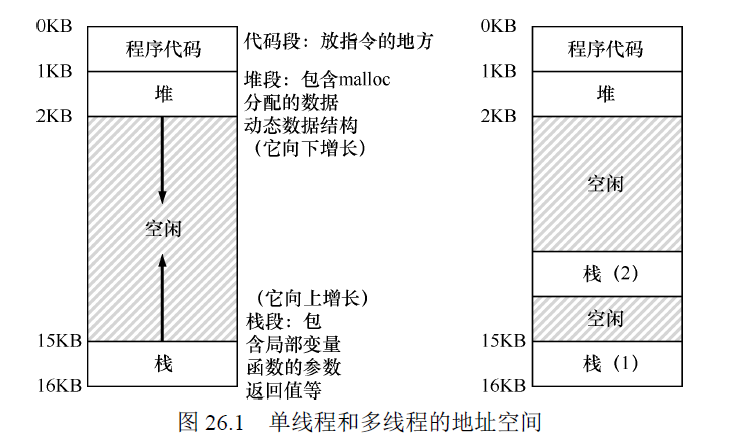

在多线程的进程中，每个线程独立运行，**有自己的独立栈**。

**线程创建有**点像函数调用，但是并不是首先执行函数然后返回给调用者，而是为被调用的例程创建一个新的执行线程，**独立于调用者运行。**


## 核心问题： 不可控的调度

**竞态条件**：结果取决于代码的时间执行。

执行这段代码的多个线程可能导致竞争状态，该段代码称为 **临界区**，临界区是访问 **共享变量**的代码片段，一定不能由多个线程同时执行。

我们真正想要的代码就是 **互斥**，该属性保证只有一个线程在临界区执行。


## 原子性愿望

指令要么没有运行，要么运行完成，不存在中间态。

要求硬件通过有用的指令，可以构建通用的集合，称为 **同步原语**。

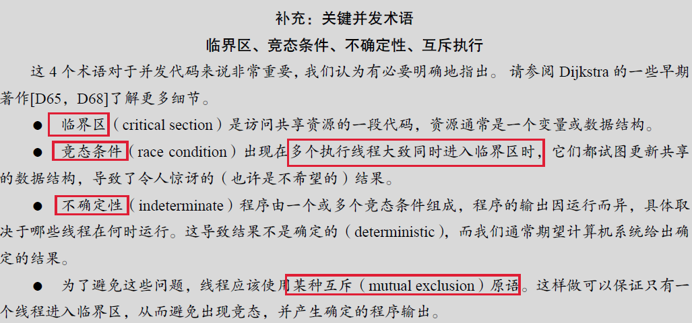


## 还有一个问题： 等待另一个线程

线程还有另一种交互，即一个线程在继续之前必须等待另一个线程完成某些操作。


## 小结：为什么操作系统课要研究并发

操作系统是**第一个并发程序**，许多技术都是在操作系统内部使用的。

设想有两个进程在运行，假设它们都调用write()来写入文件，并且都希望将数据追加到文件中，为此，这两个进程都必须分配一个新块，记录在该块所在文件的inode 中，并更改文件的大小以反映新的增加的大小。

**因为中断可能随时发生**，所以更新这些共享结构的代码（例如，分配的位图或文件的inode）是临界区。不合时宜的中断会导致上述所有问题。**页表、进程列表**、**文件系统结构**以及几乎**每个内核数据结构**都必须小心地访问，并使用正确的同步原语才能正常工作

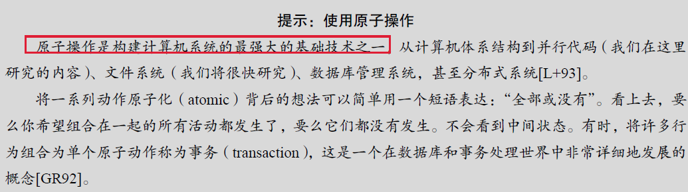


# 27 插叙： 线程API

1. **创建线程**：pthread_create

2. **线程完成**：pthread_join 等待线程完成

3. **锁**：**提供互斥**

   ```c
   int pthread_mutex_lock(pthread_mutex_t *mutex);
   int pthread_mutex_unlock(pthread_mutex_t *mutex);
   
   // 用于获取锁
   int pthread_mutex_trylock(pthread_mutex_t *mutex);
   int pthread_mutex_timedlock(pthread_mutex_t *mutex, struct timespec *abs_timeout);
   ```

   ​	

   **初始化锁**：

   ```c
    pthread_mutex_t lock = PTHREAD_MUTEX_INITIALIZER; // 方式1
    int rc = pthread_mutex_init(&lock, NULL); // 方式2
   ```

   

4. **条件变量**：线程需要同步时

```c
int pthread_cond_wait(pthread_cond_t *cond, pthread_mutex_t *mutex); // P操作 等待函数
int pthread_cond_signal(pthread_cond_t *cond);//V操作 唤起函数
```

典型用法：

```c
/* 等待线程 */
/* 在这段代码中，初始化相关的锁和条件后，一个线程检查变量ready是否已经被设置为0以外的值，如果没有，那么线程只是简单的调用等待函数以便休眠*/
pthread_mutex_t lock = PTHREAD_MUTEX_INITIALIZER;
pthread_cond_t cond = PTHREAD_COND_INITIALIZER;

Pthread_mutex_lock(&lock);
while (ready == 0)// 必须用while，不能用if，因为可能在执行完判断条件后，还没执行到下一条语句前，被唤醒线程中断，注意此时唤醒线程运行，将ready设为1，但是由于该休眠线程还没有进入等待队列，所以唤醒线程不会唤醒该线程，然后该线程继续执行判断体内的语句，此时线程进入休眠队列，但是该线程永远都不会被唤醒了（该ready为1，本来不应该进入此判断体）
	Pthread_cond_wait(&cond, &lock); //等待调用除了使调用线程进入睡眠外，还会让调用者释放锁（否则其他线程永远会得不到锁）
Pthread_mutex_unlock(&lock);

/* 唤醒线程 */
/* 在发出信号时，我们必须始终确保持有锁，确保不会在代码中意外引入竞态条件*/
Pthread_mutex_lock(&lock);
ready = 1;
Pthread_cond_signal(&cond);//在被唤醒之后返回之前，pthread_cond_wait()会重新获取该锁.从而确保等待线程在等待序列开始时获取锁 与结束时释放锁之间 运行的任何时间，它持有锁
Pthread_mutex_unlock(&lock);
```


有时候线程之间不用条件变量和锁，用一个标记变量看起来回很简单，例如

```c
/* 等待代码 */
while (ready == 0)
; // spin

//相关的发信号代码看起来像这样：
ready = 1;
```

千万不要这么做，首先，多数情况下性能很差（长时间的自旋浪费CPU），其次，容易出错，因为共享变量的使用没有加锁。

5. **编译和运行**：编译多线程程序，需要链接pthread库

```c
prompt> gcc -o main main.c -Wall -pthread
```


## 小结

本章介绍了线程创建，通过锁创建互斥执行，通过条件变量的信号和等待。线程难的部分不是API，而是**如何构建并发程序的**棘手逻辑

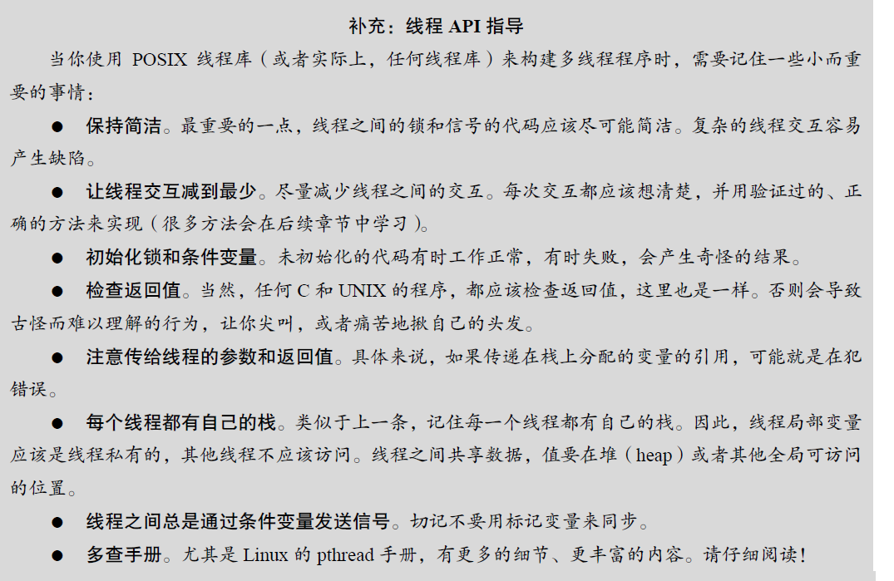


# 28 锁

我们希望原子式执行一系列指令，但由于 **单处理器上的中断**（或者多个线程在多处理器上并发执行），我们做不到。因此，通过在源代码中加锁，放在临界区周围，保证临界区能够像单条原子指令一样执行。


## 锁的基本思想

```c
lock_t mutex; // some globally-allocated lock 'mutex'
...
lock(&mutex);
balance = balance + 1;
unlock(&mutex);
```

锁就是一个变量，保存了锁在某一时刻的状态，它要么是可用的，表示没有线程持有锁，要么是被占用的，表示一个线程持有锁，正处于临界区。

**锁为程序员提供了最小程度的调度控制**，锁让程序员获得一些控制权，将原本由操作系统调度的混乱状态变得更为可控。


## Pthread锁

POSIX库将锁称为 **互斥量**，因为它被用来提供线程之间的互斥。

```c
pthread_mutex_t lock = PTHREAD_MUTEX_INITIALIZER;

Pthread_mutex_lock(&lock); // wrapper for pthread_mutex_lock()
balance = balance + 1;
Pthread_mutex_unlock(&lock);
```


## 实现一个锁


需要硬件和操作系统的支持来实现一个可用的锁。


## 评价锁

1. **锁是否能提供互斥**
2. **公平性**，是否有竞争锁的线程会被饿死
3. **性能**，使用锁之后增加的时间开销


## 控制中断

最早提供的互斥解决方案之一就是在 **临界区关闭中断**。

```c
void lock() {
DisableInterrupts();
}
void unlock() {
EnableInterrupts();
}
```

**缺点**：

1. 需要允许所有调用线程执行特权中断（打开关闭中断）
2. 该方案不支持多处理器
3. 关闭中断导致中断丢失
4. 效率低，打开和关闭中断的代码执行慢


## 测试并设置指令

最简单的硬件支持是 **测试并设置指令**，也叫做 **原子交换**。

1. 第一次尝试，用一个变量来标志锁是否被某些线程占用

```c
typedef struct lock_t { int flag; } lock_t;

void init(lock_t *mutex) {
    // 0 -> lock is available, 1 -> held
    mutex->flag = 0;
}

void lock(lock_t *mutex) {
while (mutex->flag == 1) // TEST the flag 当flag=0时，线程1在执行完这条代码时，被线程2中断，调用lock代码，则线程2会获得锁，同时线程1也不会进入循环体，也会获得该锁，因此没有保证互斥
    ; // spin-wait (do nothing) 自旋等待会很浪费CPU
    mutex->flag = 1; // now SET it!
}

void unlock(lock_t *mutex) {
	mutex->flag = 0;
}
```

当一个线程正处于临界区，如果另一个线程调用lock，则它会在while循环中自旋等待，直到第一个线程调用unlock，然后等待的线程会退出while循环，设置标志，执行临界区代码。该代码有两个问题， **正确性和性能**，详细解释见代码注释。


## 实现可用的自旋锁

第一次尝试的想法很好，但需要硬件的支持。在x86系统上，是xchg（原子交换）指令。通常称为 **测试并设置指令**。

```c
/* 该指令返回old_ptr 指向的旧值，同时更新为新值， 这些代码是原子的执行*/
int TestAndSet(int *old_ptr, int new) {
int old = *old_ptr; // fetch old value at old_ptr
	*old_ptr = new; // store 'new' into old_ptr
	return old; // return the old value
}
```

利用测试并设置指令实现的简单的**自旋锁**：该锁一直自旋，利用CPU周期，直到锁可用。因此在单处理器上，需要**抢占式的调度器**（即不断通过时钟中断一个线程，运行其他线程），否则，自旋锁在单CPU上无法使用，因为**一个自旋的线程永远不会放弃CPU**。

```c
typedef struct lock_t {
	int flag;
} lock_t;

void init(lock_t *lock) {
	// 0 indicates that lock is available, 1 that it is held
	lock->flag = 0;
}

void lock(lock_t *lock) {
	while (TestAndSet(&lock->flag, 1) == 1) //将第一次尝试中出现问题的地方 原子的执行
	; // spin-wait (do nothing)
}

void unlock(lock_t *lock) {
	lock->flag = 0;
}
```


## 评价自旋锁

1. 自旋锁可以保证互斥
2. 自旋锁不保证任何公平性，**自旋的线程在竞争条件下可能会永远自旋**，甚至会导致饿死
3. 性能：**在单CPU下**，性能开销非常大，假设一个线程持有锁进入临界区时被抢占，调度器可能会运行其他每一个线性，**而其他线程都在竞争锁，都会在放弃CPU之前，自旋一个时间片，浪费CPU**。 **在多CPU下**，自旋锁性能不错（如果线程数大致等于CPU数），假设线程A 在CPU 1，线程B在CPU 2 竞争同一个锁。线程A（CPU 1）占有锁时，线程B 竞争锁就会自旋（在CPU 2 上）。然而，**临界区一般都很短，因此很快锁就可用**，然后线程B 获得锁。自旋等待其他处理器上的锁，并没有浪费很多CPU 周期，因此效果不错。


## 比较并交换

某些系统提供了另一个硬件原语，即 **比较并交换**指令。

```c
/* 检测ptr指向的旧值是否和expected相等，若是，更新ptr所指的值为新值，否则什么也不做，都返回内存地址的实际值（初始值），让调用者知道是否成功*/
int CompareAndSwap(int *ptr, int expected, int new) {
    int actual = *ptr;
    if (actual == expected)
        *ptr = new;
    return actual;
}
```

 lock函数：

```c
void lock(lock_t *lock) {
while (CompareAndSwap(&lock->flag, 0, 1) == 1) // flag为0，设置为1
	; // spin
}
```

比较并交换指令比测试并设置更强大，如果只实现简单的自旋锁，两者行为一样。


## 链接的加载和条件式存储指令


```c
/* 链接的加载指令和典型加载指令类似，都是从内存中取出值放入一个寄存器。 */
int LoadLinked(int *ptr) {
	return *ptr;
}
/* 关键区别来自 **条件式存储**，只有上一次加载的地址在期间都没有更新，才会成功，
（同时更新刚才链接的加载的地址值。成功时返回1，并将ptr指向更新的值，失败时，返回0，并且不更新值） */
int StoreConditional(int *ptr, int value) {
    if (no one has updated *ptr since the LoadLinked to this address) {
        *ptr = value;
        return 1; // success!
    } else {
    	return 0; // failed to update
    }
}
```

lock代码：

```c
void lock(lock_t *lock) {
    while (1) {
        while (LoadLinked(&lock->flag) == 1) // 链接的加载
        	; // spin until it's zero
        if (StoreConditional(&lock->flag, 1) == 1) //条件式存储
            return; // if set-it-to-1 was a success: all done
                    // otherwise: try it all over again
    }
}

void unlock(lock_t *lock) {
	lock->flag = 0;
}
```


## 获取并增加

它能原子的返回**特定地址的旧值，**并且让该值**自增1。**

```c
/* 获取并增加 */
int FetchAndAdd(int *ptr) {
    int old = *ptr;
    *ptr = old + 1;
    return old;
}
typedef struct lock_t {
    int ticket;
    int turn;
} lock_t;

void lock_init(lock_t *lock) {
    lock->ticket = 0;
    lock->turn = 0;
}
/* 排队自旋锁 */
void lock(lock_t *lock) {
    int myturn = FetchAndAdd(&lock->ticket);//线程获取锁，ticket赋值给myturn，作为该线程的顺位（顺序），ticket再自增1，
    while (lock->turn != myturn) // 全局顺位=线程顺位时，轮到该线程运行了
    	; // spin
}

void unlock(lock_t *lock) {
	FetchAndAdd(&lock->turn); // 线程释放锁，全局顺位turn增加1
}
```

本方法能够保证所有的线程都能抢到锁，只要一个线程获得了ticket值，最终会被调度，之前的方法都不保证，比如基于测试并设置的方法，**一个线程可能一直自旋，即使其他线程在获取和释放锁**。


## 自旋过多： 怎么办

单CPU上，只有中断产生时，自旋的进程才会让出CPU。如果有N 个线程去竞争一个锁，可能会浪费N−1 个时间片，只是自旋并等待一个线程释放锁。


## 简单方法：线程把CPU让出来

方法1：**在自旋的时候，放弃CPU**

yield系统调用使得进程从运行态变为就绪态，从而让其他线程运行，让出线程本质上是取消调度了自己。

当有100个线程竞争同一把锁的时候，其他99个线程分别调用lock，发现锁被抢占，然后让出CPU，假定使用某种轮转调度策略，则99个线程会一直处于**运行—让出**模式，该方案比浪费99个时间片的自旋方案好，**但是仍然成本很高，因为线程上下文切换的成本也不小，浪费很大**。并且也可能出现饥饿，一个线程可能一直处于让出的循环。

```c
void init() {
	flag = 0;
}

void lock() {
    while (TestAndSet(&flag, 1) == 1)
    	yield(); // give up the CPU 让出实现的锁，线程调用yield主动放弃CPU，让其他线程运行，
}

void unlock() {
	flag = 0;
}
```


## 使用队列： 休眠代替自旋

线程或者一直自旋，或者立刻让出CPU，都存在太多的偶然性，都可能造成CPU浪费，也会出现饥饿。

因此，我们必须显示的施加控制，**决定锁释放时，谁能抢到锁。**我们需要一个队列来保存等待锁的进程。

park系统调用让调用线程休眠，unpark(threadID)唤醒指定线程。

```c
typedef struct lock_t {
    int flag; //真正的锁，保证代码临界区的互斥访问
    int guard;//起到自旋锁的作用，保护好flag和队列操作，保证flag和队列的互斥操作
    queue_t *q;
} lock_t;

void lock_init(lock_t *m) {
    m->flag = 0;
    m->guard = 0;
    queue_init(m->q);
}

void lock(lock_t *m) {
    while (TestAndSet(&m->guard, 1) == 1)
    	; //acquire guard lock by spinning 在获取guard自旋锁时被中断，会有一定的自旋，但是该自旋时间不是用户定义的临界区，而是lock或者unlock代码中的几个指令
    if (m->flag == 0) {
        m->flag = 1; // lock is acquired
        m->guard = 0;
} else {
        queue_add(m->q, gettid());//当flag被占用时，线程自己进入休眠队列
        m->guard = 0;// 这两行代码不能交换，因为如果先park，则可能park后被中断，而此时该线程又没有释放guard锁，因此其他线程不能再操作flag和队列，所以会陷入活锁
        park();// 但是这里还是有问题，如果在park之前，有线程中断，并且该线程释放了锁，那这个将要park的线程可能会永远休眠下去。称为唤醒/等待竞争。因此这里要做一些修改，调用separk（）来解决
    }
}

void unlock(lock_t *m) {
    while (TestAndSet(&m->guard, 1) == 1)
    	; //acquire guard lock by spinning 
    if (queue_empty(m->q))
        m->flag = 0; // let go of lock; no one wants it
    else
        unpark(queue_remove(m->q)); // hold lock (for next thread!) 线程被唤醒时，flag没有设置为0，因为线程唤醒时像是从park调用返回的，它没有获得guard，因此不能操作flag，所以我们直接把锁从释放的线程传递给下一个获得锁的进程
    m->guard = 0;
}
```


## 不同操作系统，不同实现

Linux提供了futex，每个futex都关联一个特定的物理内存位置，也有一个事先建立好的内核队列。调用者通过futex调用来睡眠或唤醒。

```c
void mutex_lock (int *mutex) {
    int v;
    /* Bit 31 was clear, we got the mutex (this is the fastpath) */
    if (atomic_bit_test_set (mutex, 31) == 0)
    	return;
    atomic_increment (mutex);
    while (1) {
        if (atomic_bit_test_set (mutex, 31) == 0) {
        	atomic_decrement (mutex);
        	return;
    	}
        /* We have to wait now. First make sure the futex value
        we are monitoring is truly negative (i.e. locked). */
        v = *mutex;
        if (v >= 0)
        	continue;
        futex_wait (mutex, v);
    }
}

void mutex_unlock (int *mutex) {
    /* Adding 0x80000000 to the counter results in 0 if and only if
    there are not other interested threads */
    if (atomic_add_zero (mutex, 0x80000000))
    	return;

    /* There are other threads waiting for this mutex,
    wake one of them up. */
    	futex_wake (mutex);
```


## 两阶段锁

两阶段锁的**第一阶段会先自旋一段时间，希望它可以获取锁**，但是如果第一阶段没有获得锁，**第二阶段调用者会睡眠，直到锁可用**。上文的linux锁就是这种锁，不过只自旋一次，更常见的是在循环中自旋固定的次数，然后使用futex睡眠。


## 小结

本章介绍了真实的锁是如何实现的，通过一些硬件支持（更加强大的指令）和操作系统支持（例如park和unpark原语，Linux的futex）。


# 29 基于锁的并发数据结构

**通过锁可以使数据结构线程安全**。


## 并发计数器

## 并发链表

## 并发队列

## 并发散列表


# 30 条件变量

锁并不是并发程序设计所需的唯一原语，在很多情况下，线程需要检查某一条件是否满足之后，才会继续运行，线程的同步。


## 定义和程序

线程可以使用**条件变量（condition variable）**，来等待一个条件变成真。

**条件变量是一个显式队列**，当某些执行状态（条件）不满足时，线程可以**把自己加入队列，等待该条件**，另外某个线程，当它**改变了上述状态**，就可以**唤醒**一个或者多个**等待线程**（通过在该条件上发送信号），让它们继续执行。

条件变量有两个相关操作：wait()和signal()。

```c
pthread_cond_wait(pthread_cond_t *c, pthread_mutex_t *m);
pthread_cond_signal(pthread_cond_t *c);
     
 /*父进程使用条件变量等待子线程*/

int done = 0;
pthread_mutex_t m = PTHREAD_MUTEX_INITIALIZER; //互斥锁的初始化
pthread_cond_t c = PTHREAD_COND_INITIALIZER; //条件变量的初始化

void thr_exit() {
    Pthread_mutex_lock(&m);
    done = 1;
    Pthread_cond_signal(&c); //唤醒线程
    Pthread_mutex_unlock(&m);
}

void *child(void *arg) {
    printf("child\n");
    thr_exit();
    return NULL;
}

void thr_join() {
    Pthread_mutex_lock(&m);
    while (done == 0)//子进程先运行，done为1，因此done是必须的，同样必须是用while，不能用if，因为有可能在该行执行完后，就被子进程中断，此时就会有问题。
    	Pthread_cond_wait(&c, &m);//休眠线程，wait调用时，需要释放互斥锁
    Pthread_mutex_unlock(&m);
}

int main(int argc, char *argv[]) {
    printf("parent: begin\n");
    pthread_t p;
    Pthread_create(&p, NULL, child, NULL);
    thr_join();
    printf("parent: end\n");
    return 0;
}
```

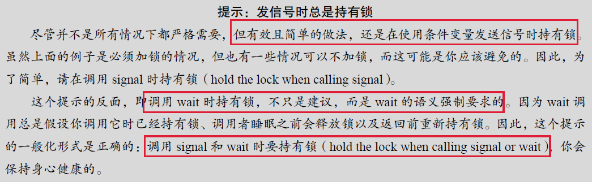


## 生产者/消费者（有界缓冲区）问题

有界缓冲区是共享资源，必须通过同步机制来访问它，以免产生竞态条件。

```c
/*单值缓冲区问题*/

int buffer;
int count = 0; // initially, empty

void put(int value) {
    assert(count == 0);
    count = 1;
    buffer = value;
}

int get() {
    assert(count == 1);
    count = 0;
    return buffer;
}


cond_t empty, fill;//一定要用两个条件变量，不能只用一个，当只用一个条件变量来唤醒时，无法区分唤醒的是生产者线程还是消费者线程，假设有两个消费者线程Tc1和Tc2，都在等待队列中，而此时生产者线程开始运行，生产完值后唤醒一个消费者进程，此时消费者进程运行完后，缓冲区为空，此时该消费者线程应当唤醒生产者线程，但是由于只使用一个条件变量，所以不能保证唤醒的是生产者线程，因此必须要用两个条件变量，确保生产者线程唤醒消费者线程，消费者线程唤醒生产者线程。
mutex_t mutex;

/*生产者线程*/
void *producer(void *arg) {
    int i;
    for (i = 0; i < loops; i++) {
        Pthread_mutex_lock(&mutex);
        while (count == 1)
        	Pthread_cond_wait(&empty, &mutex);
        put(i);
        Pthread_cond_signal(&fill);
        Pthread_mutex_unlock(&mutex);
    }
}

/*消费者线程*/
void *consumer(void *arg) {
    int i;
    for (i = 0; i < loops; i++) {
        Pthread_mutex_lock(&mutex);
        while (count == 0) //必须用while，不能用if，因为当有两个消费者线程时，假设首先缓冲区没有物品，第一个消费者线程Tc1先运行到这，发现count为0，因此进入等待队列，此时生产者线程运行，生产一个物品，此时生产者发出信号，缓冲区满了，可以进行消费，此时第二个消费者线程Tc2运行，消费了物品，而此时count从1又变为0了，现在第一个消费者线程再运行，当使用if时，就不再判断count值了，直接运行后面的语句，但是因为count此时为0，所以运行后面的语句会出错，因此一定要用while。
        	Pthread_cond_wait(&fill, &mutex);
        int tmp = get();
        Pthread_cond_signal(&empty);
        Pthread_mutex_unlock(&mutex);
        printf("%d\n", tmp);
    }
}
```

```c
/*多值缓冲区问题*/
int buffer[MAX];
int fill = 0;
int use = 0;
int count = 0;

void put(int value) {
    buffer[fill] = value;
    fill = (fill + 1) % MAX;
    count++;
}

int get() {
    int tmp = buffer[use];
    use = (use + 1) % MAX;
    count--;
    return tmp;
}

cond_t empty, fill;
mutex_t mutex;

void *producer(void *arg) {
int i;
for (i = 0; i < loops; i++) {
    Pthread_mutex_lock(&mutex); // p1
    while (count == MAX) // p2
    	Pthread_cond_wait(&empty, &mutex); // p3
    put(i); // p4
    Pthread_cond_signal(&fill); // p5
    Pthread_mutex_unlock(&mutex); // p6
	}
}

void *consumer(void *arg) {
    int i;
    for (i = 0; i < loops; i++) {
        Pthread_mutex_lock(&mutex); // c1
        while (count == 0) // c2
        	Pthread_cond_wait(&fill, &mutex); // c3
        int tmp = get(); // c4
        Pthread_cond_signal(&empty); // c5
        Pthread_mutex_unlock(&mutex); // c6
        printf("%d\n", tmp);
    }
}
```


## 覆盖条件


```c
cond_t c;
mutex_t m;

void *allocate(int size) {
    Pthread_mutex_lock(&m);
    while (bytesLeft < size)
    	Pthread_cond_wait(&c, &m);
    void *ptr = ...; // get mem from heap
    bytesLeft -= size;
    Pthread_mutex_unlock(&m);
    return ptr;
}

void free(void *ptr, int size) {
    Pthread_mutex_lock(&m);
    bytesLeft += size;
    Pthread_cond_signal(&c); // whom to signal??
    Pthread_mutex_unlock(&m);
}
```

当线程调用进入内存分配代码时，它可能会因内存不足而等待，假定目前没有空闲内存，线程a调用分配allocate(100)，线程b调用allocate(10)，此时线程a和b都会在等待条件上睡眠，线程c调动了free(50)，此时它法信号唤醒等待线程时，可能不会唤醒线程b，而线程a由于内存不够，还是无法执行，因此代码还是无法正常运行。

**解决方案**：

用pthread_cond_broadcast()代替上述代码中的pthread_cond_signal()，来唤醒 **所有等待线程**。这样可以保证所有应该唤醒的线程都能被唤醒，当然会影响一些性能，因为不必要的唤醒了其他许多等待的线程，这些线程重新检查条件，马上再次睡眠。这种条件变量叫做 **覆盖条件**，因为它能覆盖所有需要唤醒线程的场景。

在上述单个条件变量的生产者/消费者问题，也可以使用该方法，但是在那个例子中用两个条件变量实现效果更好。我觉得这两个例子的本质区别在于。对**于生产者/消费者问题而言，所有消费者都是等价的，因为都只消费一个值，而对于内存分配而言，不同的内存分配是不一样的，因为有分配大小的区别，因此，在内存调用/分配的问题而言，用覆盖条件是更好的。**


## 小结

本章介绍了另一个重要同步原语：条件变量，主要用来解决线程的同步问题，同步比互斥的要求更高，因为互斥不要求线程执行顺序，还介绍了生产者/消费者问题。


# 31 信号量


## 信号量的定义

**信号量是有一个整数值的对象，可以用两个函数操作它**，在POSIX中，是sem_wait()和sem_post(), 信号量的初始值能够决定其行为，因此需要首先初始化信号量，才能调用其他函数与之交互。

~~~c
/* 初始化信号量 */
#include <semaphore.h>
sem_t s;
sem_init(&s, 0, 1);//第3个参数，将它的值初始化为1，第2个参数设为0，代表信号量是在同一进程的多个线程共享的

/* Wait和Post的定义*/
int sem_wait(sem_t *s) {
	decrement the value of semaphore s by one // 要么立刻返回，要么调用线程会挂起
	wait if value of semaphore s is negative
}

int sem_post(sem_t *s) {
	increment the value of semaphore s by one // 直接增加信号量的值，若有等待线程，则唤醒其中一个
	if there are one or more threads waiting, wake one
}
~~~

信号量的值为负数时，该值就是等待线程的个数。

## 二值信号量(锁)

~~~c
sem_t m;
sem_init(&m, 0, X); // initialize semaphore to X; what should X be? 
// 当x为1时，信号量就作为锁

sem_wait(&m);
// critical section here
sem_post(&m);

~~~


## 信号量用作条件变量

~~~c
sem_t s;
/* 父线程等待子线程 */
void *child(void *arg) {
    printf("child\n");
    sem_post(&s); // signal here: child is done
    return NULL;
}

int main(int argc, char *argv[]) {
    sem_init(&s, 0, X); // what should X be?
    // 将X初始化为0，信号量作为条件变量
    printf("parent: begin\n");
    pthread_t c;
    Pthread_create(c, NULL, child, NULL);
    sem_wait(&s); // wait here for child
    printf("parent: end\n");
    return 0;
}

~~~


## 生产者/消费者（有界缓冲区）问题


~~~c
int buffer[MAX];
int fill = 0;
int use = 0;

void put(int value) {
    buffer[fill] = value; // line f1
    fill = (fill + 1) % MAX; // line f2
}

int get() {
    int tmp = buffer[use]; // line g1
    use = (use + 1) % MAX; // line g2
    return tmp;
}


sem_t empty;
sem_t full;
sem_t mutex; // 当缓冲区为1时，可以不用互斥锁，当缓冲区的容量大于1(假设为10)时，必须要用互斥锁来保证临界区（缓冲区）的互斥访问，假设当有两个生产者时，当两个生产者P1和P2几乎同时调用put时，P1先运行完f1行，还没运行到f2行时，此时P2开始运行，也会在P1填充的位置重复填充，因此生产者的数据丢失了

void *producer(void *arg) {
    int i;
    for (i = 0; i < loops; i++) {
        sem_wait(&empty); // line p1
        sem_wait(&mutex); // line p1.5 (MOVED MUTEX HERE...) //互斥锁一定要紧挨临界区，不然会死锁
        put(i); // line p2
        sem_post(&mutex); // line p2.5 (... AND HERE)
        sem_post(&full); // line p3
    }
}

void *consumer(void *arg) {
    int i;
    for (i = 0; i < loops; i++) {
        sem_wait(&full); // line c1
        sem_wait(&mutex); // line c1.5 (MOVED MUTEX HERE...) //互斥锁一定要紧挨临界区，不然会死锁，因为假设消费者先运行，此时缓冲区没有值，消费者阻塞，并且持有互斥锁，而生产者因为永远拿不到互斥锁，所以页不可能向缓冲区写入值，因此死锁
        int tmp = get(); // line c2
        sem_post(&mutex); // line c2.5 (... AND HERE)
        sem_post(&empty); // line c3
        printf("%d\n", tmp);
    }
}

int main(int argc, char *argv[]) {
    // ...
    sem_init(&empty, 0, MAX); // MAX buffers are empty to begin with...
    sem_init(&full, 0, 0); // ... and 0 are full
    sem_init(&mutex, 0, 1); // mutex=1 because it is a lock
    // ...
}

~~~


## 读者—写者锁

不同的数据结构访问可能需要不同类型的锁，例如一个并发链表有很多插入和查找操作，插入操作会修改链表的状态（因此传统的临界区有用），而查找操作只是读取该结构，因此可以并发的执行多个查找操作。 **读者-写者锁**就是用来完成这种操作的。

~~~c
typedef struct _rwlock_t {
    sem_t lock; // binary semaphore (basic lock)
    sem_t writelock; // used to allow ONE writer or MANY readers
    int readers; // count of readers reading in critical section
} rwlock_t;

void rwlock_init(rwlock_t *rw) {
    rw->readers = 0;
    sem_init(&rw->lock, 0, 1);
    sem_init(&rw->writelock, 0, 1);
}

void rwlock_acquire_readlock(rwlock_t *rw) {
    sem_wait(&rw->lock);
    rw->readers++;
    if (rw->readers == 1)
    	sem_wait(&rw->writelock); // first reader acquires writelock 一旦一个读者获得了读锁，其他读者也能获得该读锁
    sem_post(&rw->lock);
}

void rwlock_release_readlock(rwlock_t *rw) {
    sem_wait(&rw->lock);
    rw->readers--;
    if (rw->readers == 0)
    	sem_post(&rw->writelock); // last reader releases writelock 想要获取写锁，则需要等待所有的读者都结束，最后一个读者释放锁，从而写者能获得写锁
    sem_post(&rw->lock);
}

void rwlock_acquire_writelock(rwlock_t *rw) {
	sem_wait(&rw->writelock);
}

void rwlock_release_writelock(rwlock_t *rw) {
	sem_post(&rw->writelock);
}
~~~


## 哲学家就餐问题

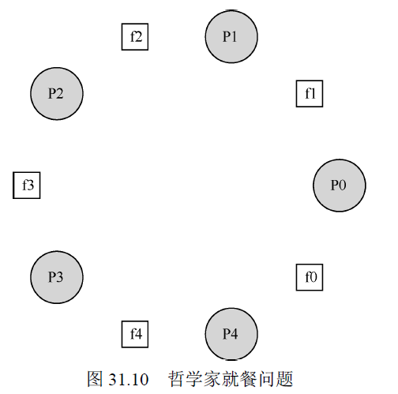

每个哲学家的基本循环

~~~c
while (1) {
    think();
    getforks();
    eat();
    putforks();
}

int left(int p) { return p; }
int right(int p) { return (p + 1) % 5; }
/* 如果哲学家希望用左手边的叉子，就调用left(p)，希望用右手边的叉子就用right(p)*/

/* 该方案会产生死锁，假设所有哲学家到拿到了左手边的餐叉，则会陷入死锁 */
void getforks() {
    sem_wait(forks[left(p)]);
    sem_wait(forks[right(p)]);
}

void putforks() {
    sem_post(forks[left(p)]);
    sem_post(forks[right(p)]);
}
~~~

**解决方案**:**破除依赖**

~~~c
void getforks() {
if (p == 4) {
        sem_wait(forks[right(p)]);
        sem_wait(forks[left(p)]);
    } else {
        sem_wait(forks[left(p)]);
        sem_wait(forks[right(p)]);
    }
}
/* 最后一个哲学家会先尝试先拿右手边的餐叉，然后拿左手边，因此等待循环打破了*/
~~~


## 如何实现信号量

用底层的同步原语（锁和条件变量），来实现自己的信号量，名字为Zemaphore。

用**一把锁、一个条件变量和一个状态的变量**来记录信号量的值来实现信号量。

~~~c
/*我们实现的Zemaphore 和Dijkstra 定义的信号量有一点细微区别，就是我们没有保持当 信号量的值为负数时，让它反映出等待的线程数。事实上，该值永远不会小于0。这一行为更容易实现，并符合现有的Linux 实现。*/
typedef struct _Zem_t {
    int value;
    pthread_cond_t cond;
    pthread_mutex_t lock;
} Zem_t;

// only one thread can call this
void Zem_init(Zem_t *s, int value) {
    s->value = value;
    Cond_init(&s->cond);
    Mutex_init(&s->lock);
}

void Zem_wait(Zem_t *s) {
    Mutex_lock(&s->lock);
    while (s->value <= 0)
    	Cond_wait(&s->cond, &s->lock);
    s->value--;
    Mutex_unlock(&s->lock);
}

void Zem_post(Zem_t *s) {
    Mutex_lock(&s->lock);
    s->value++;
    Cond_signal(&s->cond);
    Mutex_unlock(&s->lock);
}
~~~


## 小结

信号量是编写并发程序的强大而灵活的原语，本章主要介绍了信号量的应用及其实现。

# 32 常见并发问题

## 有哪些类型的缺陷

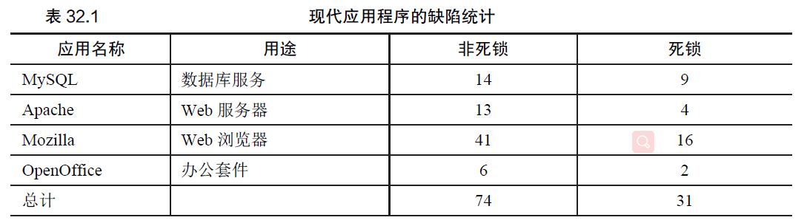

**主要是非死锁的缺陷和死锁的缺陷**。


## 非死锁的缺陷

非死锁的问题占了并发问题的大多数，主要包括 **违反原子性缺陷和错误顺序缺陷**。

### 违反原子性缺陷

**违反了多次内存访问中预期的可串行性**（即代码段本意是原子的，但在执行中并没有强制实现原子性）

~~~c
/* 该示例中两个线程都需要访问thd结构中的成员proc_info，但是当线程1在判断语句执行完，被线程2中断执行，再执行线程1的判断体的内容就会引用空指针，出现错误。*/
Thread 1::
if (thd->proc_info) {

	fputs(thd->proc_info, ...);

}

Thread 2::
thd->proc_info = NULL;
~~~

这种问题修复很简单，只需要给共享变量的访问加锁即可。

~~~c
pthread_mutex_t proc_info_lock = PTHREAD_MUTEX_INITIALIZER;

Thread 1::
pthread_mutex_lock(&proc_info_lock);
if (thd->proc_info) {

    fputs(thd->proc_info, ...);

}
pthread_mutex_unlock(&proc_info_lock);

Thread 2::
pthread_mutex_lock(&proc_info_lock);
thd->proc_info = NULL;
pthread_mutex_unlock(&proc_info_lock);
~~~


## 违反顺序缺陷

两个内存访问的预期顺序被打破了（即A 应该在B 之前执行，但是实际运行中却不是这个顺序）。

~~~c
/* 线程2的代码假定变量mThread已经被初始化了，然而如果线程1没有先执行，线程2就会引用空指针报错*/
Thread 1::
void init() {

mThread = PR_CreateThread(mMain, ...);

}

Thread 2::
void mMain(...) {

mState = mThread->State;

}
~~~

加入**条件变量**来修复这个问题。

~~~c
pthread_mutex_t mtLock = PTHREAD_MUTEX_INITIALIZER;
pthread_cond_t mtCond = PTHREAD_COND_INITIALIZER;
int mtInit = 0;

Thread 1::
void init() {

mThread = PR_CreateThread(mMain, ...);

// signal that the thread has been created...
pthread_mutex_lock(&mtLock);
mtInit = 1;
pthread_cond_signal(&mtCond);
pthread_mutex_unlock(&mtLock);

}

Thread 2::
void mMain(...) {

// wait for the thread to be initialized...
pthread_mutex_lock(&mtLock);
while (mtInit == 0)
	pthread_cond_wait(&mtCond, &mtLock);
pthread_mutex_unlock(&mtLock);

mState = mThread->State;

}
~~~


### 非死锁缺陷：小结

Lu 等人的研究中，大部分（97%）的非死锁问题是违反原子性和违反顺序这两种。因此，程序员仔细研究这些错误模式，应该能够更好地避免它们。
然而，并不是所有的缺陷都像我们举的例子一样，这么容易修复。有些问题需要对应用程序的更深的了解，以及大量代码及数据结构的调整。


## 死锁缺陷

**死锁**是一种在许多复杂并发系统中出现的经典问题。

~~~c
Thread 1: Thread 2:
lock(L1); lock(L2);
lock(L2); lock(L1);
~~~

上述代码就会可能出现死锁问题。

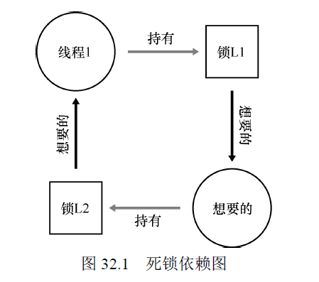

### 为什么发生死锁

原因：

1. 在大型大代码库里，组件之间会有复杂的依赖，以操作系统为例，虚拟内存系统在需要访问文件系统才能从磁盘读到内存页，文件系统又要和虚拟内存交互，去申请一块内存，以便存放读到的块，因此，在涉及大型系统的锁机制时，必须要避免循环导致的依赖。
2. 另一个原因是封装，模块化的设计隐藏了细节，可能会导致死锁。

~~~c
/*在内部这个方法需要多线程安全，因此会先给v1加锁，又给v2加锁，但是如果同时有线程调用v2.AddAll(v1)，就可能遇到死锁*/
Vector v1, v2;
v1.AddAll(v2);
~~~


### 产生死锁的条件

1. **互斥**：线程对于需要的资源进行互斥的访问（例如一个线程抢到锁）
2. **持有并等待**：线程持有了资源（例如已将持有的锁），同时又在等待其他资源（例如，需要获得的锁）。
3. **非抢占**：线程获得的资源（例如锁），不能被抢占。
4. **循环等待**：线程之间存在一个环路，环路上每个线程都额外持有一个资源，而这个资源又是下一个线程要申请的。

如果四个条件中的任何一个没有满足，死锁就不会产生。


### 预防

#### 1. 破解循环等待

**最直接的方法就是获取锁时提供一个全序**。假如系统共有两个锁，那么我们每次都先申请L1，然后申请L2，就可以避免死锁。这样的严格顺序就避免了循环等待，也就不会产生死锁。

但是在复杂系统中，锁的全序可能很难得到，因此，偏序可能是一种有用的方法，安排锁的获取并避免死锁。

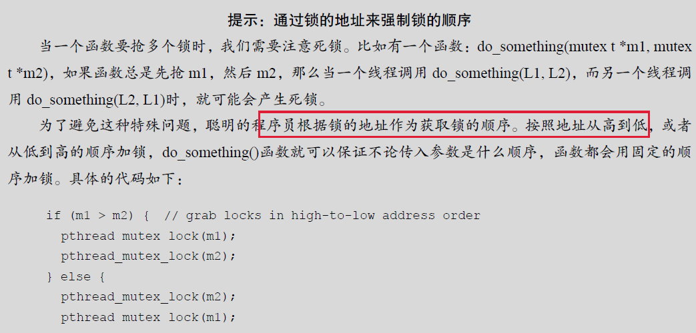

#### 2. 破解持有并等待

死锁 持有并等待条件，可以通过原子的抢锁来避免。

该方案也有问题，不适合封装，因为该方案需要我们提前知道所有需要的锁，并且要提前抢到，也会降低并发。

~~~c
/*通过全局锁prevention，保证在抢锁的过程中，要么全部抢到，要么都没抢到*/
lock(prevention);
lock(L1);
lock(L2);

unlock(prevention);
~~~


#### 3. 破坏非抢占

~~~c
/*在调用unlock之前，都认为锁是占有的，因为我们在等待一个锁时，同时持有另一个锁。*/
top:
    lock(L1);
    if (trylock(L2) == -1) { // trylock函数尝试获得锁，或者返回-1，表示锁已经被占有
        unlock(L1);
        goto top;
}
~~~

另一个线程可以使用相同的加锁方式，但是不同的加锁顺序，程序仍然不会产生死锁，但是会产生 **活锁**：两个线程都一致重复这一序列，又同时抢锁失败，此时系统一直在运行这段代码，但是又不会有进展，因此叫活锁。

**活锁的解决方法**：例如，可以在循环结束的时候，先随机等待一个时间，然后再重复整个动作，这样可以降低线程之间的重复互相干扰。

还是有**封装的问题**，如果其中的某一个锁，是封装在函数内部的，那么这个**跳回开始处就很难实现**。如果代码在中途获取了某些资源，必须要确保也能释放这些资源。例如，在抢到L1 后，我们的代码分配了一些内存，当抢L2 失败时，并且在返回开头之前，需要释放这些内存。


#### 4. 破解互斥

最后的预防方法就是完全避免互斥**，通过强大的硬件指令，可以构造出不需要锁的数据结构**。这种方式没有使用锁，因此不会有死锁（有可能产生活锁）。


#### 5. 通过调度避免死锁

除了死锁预防，某些场景更适合**死锁避免**。我们需要了解全局信息，包括不同线程在运行中对锁的需求情况，从而使得后续的调度能够避免产生死锁。

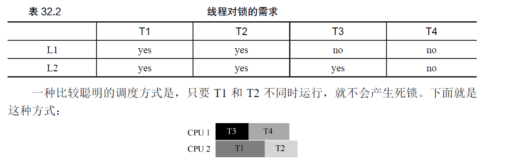

Dijkstra 提出的**银行家算法**是一种类似的著名解决方案，遗憾的是，这些方案的适用场景很局限。例如，在嵌入式系统中，你需要知道所有任务以及它们需要的锁。另外，和上文的第二个例子一样，这种方法会限制并发。因此，通过调度来避免死锁不是广泛使用的通用方案

#### 6. 检查和恢复

最后一种常用的策略就是允许死锁偶尔发生，检查到死锁时再采取行动。

## 小结

在本章中，我们学习了并发编程中出现的缺陷的类型。第一种是非常常见的，非死锁缺陷，包括违法原子性和违反顺序，通常也很容易修复。同时，我们简要地讨论了死锁：为何会发生，以及如何处理。也许，最好的解决方案是开发一种新的并发编程模型：在类似MapReduce这样的系统中，程序员可以完成一些类型的并行计算，无须任何锁。锁必然带来各种困难，也许我们应该尽可能地避免使用锁，除非确信必须使用。

# 33 基于事件的并发（进阶）

基于事件的并发，在一些现代系统中较为流行，比如node.js，但它源自于C/UNIX系统。基于事件的并发针对两方面的问题：

1. 在多线程应用中，正确处理并发很有难度，比如忘加锁、死锁和其他问题发生
2. 开发者无法控制线程在某一时刻的调度，程序员只是创建了线程，然后就依赖操作系统能够合理的调度线程，要实现在一个各种不同负载下，都能够良好运行的通用调度程序，是极有难度的，**因此，某些时候操作系统的调度不是最优的**


## 基本想法：事件循环

使用的基本方法就是 **基于事件的并发**。该方法很简单：我们等待 **事件**发生，当它发生时，检查事件类型，然后做少量的相应工作（可能是I/O请求，或者调度其他事件准备后续处理）。

基于事件的服务器是基于一个简单的结构，称为 **事件循环**。伪代码：

~~~c
/* 主循环等待某些事件发生，然后依次处理这些发生的事件*/
while (1) {
    events = getEvents();//通过该调用等待某事发生
    for (e in events)
    processEvent(e);//事件处理程序，
}
~~~

处理程序在处理一个事件时，它是系统中唯一的活动，因此，调度就是决定接下来处理哪个事件，这种**对调度的显示控制，是基于事件方法的一个重要优点。**

基于事件的服务器如何决定哪个事件发生，尤其是对网络和磁盘I/O? 具体来说，事件服务器如何知道是否有它的消息到达？


## 重要API：select() (或poll())

大多数系统提供基本的API，即**select()或poll()系统调用**来解决如何接收事件的问题。

这些接口对程序的支持很简单：检查是否有任何应该关注的进入I/O。

~~~c
/* select() 检查I/O描述符集合，它们的地址通过readfds、writefds和errorfds传入，分别查看它们中的某些描述符是否准备好读取、是否准备好写入,或有异常情况需要处理*/
int select(int nfds, // 在每个集合中检查前nfds个描述符，即检查描述符集合中从0~nfds-1的描述符。
fd_set *restrict readfds,
fd_set *restrict writefds,
fd_set *restrict errorfds,
struct timeval *restrict timeout); //超时参数设置为NULL，代表无限期阻塞，直到有描述符就绪，超时参数设置为0，让调用select立即返回
// 返回时，select用给定请求操作准备好的描述符组成的子集替换给定的描述符集合
// select返回所有集合中就绪描述符的总数
~~~

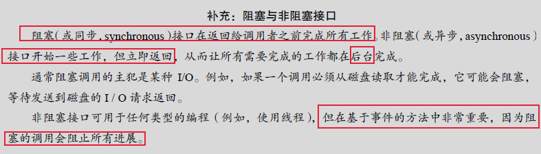


## 使用select()

~~~c
#include <stdio.h>
#include <stdlib.h>
#include <sys/time.h>
#include <sys/types.h>
#include <unistd.h>

int main(void) {
    // open and set up a bunch of sockets (not shown)
    // main loop
    while (1) {
        // initialize the fd_set to all zero
        fd_set readFDs;
        FD_ZERO(&readFDs);//清除描述符集合

        // now set the bits for the descriptors
        // this server is interested in
        // (for simplicity, all of them from min to max)
        int fd;
        for (fd = minFD; fd < maxFD; fd++)
        	FD_SET(fd, &readFDs);//将从minFD到maxFD的文件描述符包含到集合中

        // do the select
        int rc = select(maxFD+1, &readFDs, NULL, NULL, NULL); //查看哪些连接有可用的数据

        // check which actually have data using FD_ISSET()
        int fd;
        for (fd = minFD; fd < maxFD; fd++)
        	if (FD_ISSET(fd, &readFDs))
        		processFD(fd);
    }
}
~~~


## 为何更简单？ 无须锁

因为一次只处理一个事件，所以不需要获取或释放锁。基于事件的服务器不会被另一个线程中断，因为它确实是单线程的，因此不会出现多线程程序中常见的并发错误。


## 一个问题： 阻塞系统调用

open()和read()调用都可能向存储系统发出I/O 请求，因此可能需要很长时间才能提供服务。使用基于线程的服务器时，这不是问题：将发出I/O 请求的线程挂起时，其他线程可以运行，从而使服务器能够取得进展。

但是对于基于事件的服务器，它只有主事件循环，一旦被阻塞，系统处于闲置状态，存在巨大的浪费，**因此不允许阻塞调用。**


## 解决方案： 异步I/O

许多现代操作系统已经引入了新的方法来向磁盘系统发出I/O 请求, 称为 **异步I/O。**

这些接口使得应用程序能够发出I/O请求，并在I/O完成之前**立即将控制权返回给调用者。**

另外的接口让应用程序能够**确定各种I/O是否已完成。**

这些API围绕一个基本的结构，即struct aiocb或AIO控制块。该结构的简化版本是：

~~~c
struct aiocb {
    int aio_fildes; /* File descriptor */ // 要读取文件的文件描述符
    off_t aio_offset; /* File offset */ // 文件内的偏移量
    volatile void *aio_buf; /* Location of buffer */ // 应该复制读取结果的目标内存位置
    size_t aio_nbytes; /* Length of transfer */ // 以及长度的请
};
~~~

要想文件发出异步读取，应用程序首先用相关信息填充此结构

填充此结构后，应用程序发出异步调用来读取文件。异步读取的API是

~~~c
int aio_read(struct aiocb *aiocbp);
~~~

该调用尝试发出I/O, 如果成功，会立即返回。

通过aio_error()来知道I/O是否完成。

~~~c
/* 该系统调用检查aiocbp 引用的请求是否已完成。如果有，则函数返回成功（用0表示）。
如果不是，则返回EINPROGRESS。因此，对于每个未完成的异步I/O，应用程序可以通过
调用aio_error()来周期性地轮询（poll）系统，以确定所述I/O 是否尚未完成。*/
int aio_error(const struct aiocb *aiocbp);
~~~

在一些系统中提供了 **基于中断**的方法，该方法使用UNIX **信号**在异步I/O完成时通知应用程序，从而消除重复询问系统的需要。

在没有异步I/O 的系统中，纯基于事件的方法无法实现。


## 另一个问题： 状态管理

基于事件的方法的另一个问题是，这种代码通常比传统的基于线程的代码更复杂。

原因：当事件处理程序发出异步I/O 时，**它必须打包一些程序状态**，以便下一个事件处理程序在I/O 最终完成时使用。这个额外的状态在基于线程的程序中是不需要的，因为程序需要的状态在**线程栈**中。

**解决方案**：使用一种称为“**延续**”的老编程语言结构。想法很简单：在某些数据结构中，
记录完成处理该事件需要的信息。当事件发生时（即磁盘I/O 完成时），查找所需信息并处
理事件。

~~~c
int rc = read(fd, buffer, size);
rc = write(sd, buffer, size);
~~~

在该例子中，将套接字描述符sd记录在由文件描述符fd索引的某种结构（例如散列表）中，当磁盘I/O完成时，事件处理程序将使用文件描述符来查找延续，这会将套接字描述符的值返回给调用者，最后，服务器可以将数据写入套接字。


## 什么事情仍然很难

当系统从单个CPU **转向多个CPU** 时，基于事件的方法的一些简单性就消失了。为了利用多个CPU，事件服务器必须并行运行多个事件处理程序，发生这种情况时，就会出现常见的同步问题（例如临界区），**并且必须采用通常的解决方案（例如锁定）**。

另外一个问题是，它**不能很好的与某些类型的系统活动集成**，如分页。例如，如果事件处理程序发生页错误，它将被阻塞，并且服务器在页错误完成前不会有进展。 尽管服务器的结构可以避免显示阻塞，但由于页错误导致的**隐式阻塞很难避免。**

还有一个问题是随着时间的推移，基于事件的代码可能很难管理，因为各种函数的确切语义发生了变化。

## 小结

基于事件的服务器为应用程序本身提供了调度控制，但是这样做的代价是复杂性以及与现代系统其他方面（例如分页）的集成难度。

由于这些挑战，没有哪一种方法表现最好。因此，线程和事件在未来很多年内可能会持续作为解决同一并发问题的两种不同方法。


# 并发小结

编写并发程序时，尽可能简单，避免复杂的线程交互，使用已被证实的线程交互方式。

如果确实需要并行，那么应该采用一些简单的形式。使用Map-Reduce 来写并行的数据分析代码，就是一个很好的例子，不需要我们考虑锁、条件变量和其他复杂的事情。