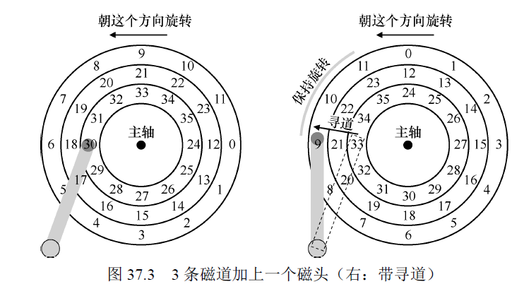

- [《Operating Systems:Three Easy Pieces》持久性](#-operating-systems-three-easy-pieces----)
- [36 I/O设备](#36-i-o--)
  * [系统架构](#----)
  * [标准设备](#----)
  * [标准协议](#----)
  * [利用中断减少CPU开销](#------cpu--)
  * [利用DMA进行更高效的数据传送](#--dma----------)
  * [设备交换的方法](#-------)
  * [纳入操作系统：设备驱动程序](#-------------)
  * [案例研究：简单的IDE磁盘驱动程序](#--------ide------)
  * [历史记录](#----)
  * [小结](#--)
- [37 磁盘驱动器](#37------)
  * [接口](#--)
  * [简单的磁盘驱动器](#--------)
  * [I/O时间：用数学](#i-o------)
  * [磁盘调度](#----)
  * [小结](#---1)
- [38 廉价冗余磁盘阵列](#38---------)
  * [接口和RAID内部](#---raid--)
  * [故障模型](#----)
  * [如何评估RAID](#----raid)
  * [RAID 0级：条带化](#raid-0-----)
    + [回到RAID-0分析](#--raid-0--)
    + [评估RAID性能](#--raid--)
  * [RAID 1级： 镜像](#raid-1-----)
    + [RAID-1 分析](#raid-1---)
  * [RAID 4级：通过奇偶校验节省空间](#raid-4------------)
    + [RAID-4分析](#raid-4--)
  * [RAID 5级：旋转奇偶校验](#raid-5--------)
    + [RAID-5 分析](#raid-5---)
  * [RAID比较：总结](#raid-----)
  * [小结](#---2)
- [39 插叙：文件和目录](#39---------)
  * [文件和目录](#-----)
  * [文件系统接口](#------)
  * [创建文件](#----)
  * [读写文件](#----)
  * [读取和写入、但不按顺序](#-----------)
  * [用fsync()立即写入](#-fsync------)
  * [文件重命令](#-----)
  * [获取文件信息](#------)
  * [删除文件](#----)
  * [创建目录](#----)
  * [读取目录](#----)
  * [删除目录](#----)
  * [硬链接](#---)
  * [符号链接](#----)
  * [创建并挂载文件系统](#---------)
  * [小结](#---3)
- [40 文件系统实现](#40-------)
  * [思考方式](#----)
  * [整体组织](#----)
  * [文件组织：inode](#-----inode)
  * [目录组织](#----)
  * [空闲空间管理](#------)
  * [访问路径： 读取和写入](#-----------)
    + [从磁盘读取文件](#-------)
    + [写入磁盘](#----)
  * [缓存和缓冲](#-----)
  * [小结：](#---)
- [41 局部性和快速文件系统](#41-----------)
  * [问题： 性能不佳](#--------)
  * [FFS: 磁盘意识是解决方案](#ffs-----------)
  * [组织结构：柱面组](#--------)
  * [策略：如何分配文件和目录](#------------)
  * [测量文件的局部性](#--------)
  * [大文件例外](#-----)
  * [关于FFS的其他几件事](#--ffs------)
  * [小结](#---4)
- [42 崩溃一致性：FSCK和日志](#42-------fsck---)
  * [一个详细的例子](#-------)
    + [奔溃场景](#----)
    + [崩溃一致性问题](#-------)
  * [解决方案1：文件系统检查程序](#----1---------)
  * [解决方案2： 日志（或预写日志）](#----2-----------)
    + [数据日志](#----)
    + [恢复](#--)
    + [批处理日志更新](#-------)
    + [使日志有限](#-----)
    + [元数据日志](#-----)
    + [块复用](#---)
    + [总结日志：时间线](#--------)
  * [解决方案3：其他方法](#----3-----)
  * [小结](#------)
- [43 日志结构文件系统](#43---------)
  * [按顺序写入磁盘](#-------)
  * [顺序而高效地写入](#--------)
  * [要缓冲多少](#-----)
  * [问题：查找inode](#-----inode)
  * [通过间接解决方案：inode映射](#---------inode--)
  * [检查点区域](#-----)
  * [从磁盘读取文件](#--------1)
  * [目录如何](#----)
  * [一个新问题：垃圾收集](#----------)
  * [确定块的死活](#------)
  * [策略问题：要清理哪些块，何时清理](#----------------)
  * [崩溃恢复和日志](#-------)
  * [小结](#---5)
- [44 数据完整性和保护](#44---------)
  * [磁盘故障模式](#------)
  * [处理潜在的扇区错误](#---------)
  * [检测讹误：校验和](#--------)
    + [常见的校验和函数](#--------)
    + [校验和布局](#-----)
  * [使用校验和](#-----)
  * [一个新问题：错误的写入](#-----------)
  * [最后一个问题：丢失的写入](#------------)
  * [擦净](#--)
  * [校验和的开销](#------)
  * [小结](#---6)
- [持久性小结](#-----)

# 《Operating Systems:Three Easy Pieces》持久性

# 36 I/O设备

## 系统架构

越快的总线越短，因此高性能的内存总线没有足够的空间连接太多的设备。因此系统采用分层方式，让高性能的设备离CPU更近，低性能的设备离CPU更远。

将磁盘和其他低速设备连到外围总线的好处很多，其中较为突出的优点是我们可以在外围总线上连接大量的设备。

## 标准设备

标准设备由两部分组成：

1. 向系统其他部分展现的 **硬件接口**，同软件一样，硬件也需要一些接口，让系统来控制它的操作
2. **内部结构**：包含设备相关的特定实现，负责具体实现设备展示给系统的抽象接口。

## 标准协议

一个（简化的）设备接口包含三个寄存器：

1. **状态寄存器**：可以读取并查看设备的当前状态
2. **命令寄存器**：用于通知设备执行某个具体命令
3. **数据寄存器**：将数据传给设备或从设备接收数据

操作系统与该设备的典型交互，以便设备为它做某事。协议为：

~~~c
While (STATUS == BUSY)
	; // wait until device is not busy
Write data to DATA register
Write command to COMMAND register
	(Doing so starts the device and executes the command)
While (STATUS == BUSY)
	; // wait until device is done with your request
~~~

该协议包含4步：

1. 操作系统反复读取 **状态寄存器**，等待设备进入可以接受命令的就绪状态，**称之为 轮询（polling）设备**
2. 操作系统下发数据到 **数据寄存器**，如果主CPU参与数据移动，就称为 **编程的I/O(PIO)**
3. 操作系统将命令写入 **命令寄存器**，这样设备就知道数据已经准备好了，应该开始执行命令
4. 操作系统再次通过不断 **轮询设备**，等待并判断设备是够执行完命令

该协议足够简单且有效，但是有一些低效，因为轮询过程比较低效，在等待设备执行完成命令时浪费大量CPU时间，如果此时操作系统可以切换执行下一个就绪进程，就可以大大提高CPU的利用率

## 利用中断减少CPU开销

有了 **中断**后，CPU不再需要不断轮询设备，而是向设备发出一个请求，然后让对应进程睡眠，切换执行其他任务，当设备完成自身操作，就会抛出一个 **硬件中断**，引发CPU跳转执行操作系统预先定义好的 **中断服务例程**，或更为简单的 **中断处理程序**，该程序会结束之前的请求（比如从设备读取到了数据或者错误码）并且唤醒等待I/O的进程继续执行。

因此，中断允许计算与I/O **重叠**，可以提高CPU利用率。

**没有中断，操作系统简单自旋，不断轮询设备状态，直到设备完成I/O操作（对应p）:**

**利用中断**：操作系统在CPU上运行进程2

**注意**：

1. 使用中断并非总是最佳方案，当有一个高性能设备时，它处理请求很快，通常在CPU第一次轮询时就可以返回结果，此时如果使用中断，反而会使系统变慢。因为切换到其他进程，处理中断，再切回之前的进程代价不小。

​     **因此设备非常快时，最好的办法反而是轮询，设备比较慢时，中断更好。如果设备的速度未知，可以先尝试轮询一小段时间，如果设备没有完成操作，再使用中断。**

2. 另一个最好不要使用中断的场景是网络，网络端收到大量数据包，如果每个包都发生一次中断，有可能导致操作系统发生活锁，即 **不断处理中断而无法处理用户层的请求**。
3. 另一个基于中断的优化就是 **合并**，设备在抛出中断前往往会等待一小段时间，在此期间，其他请求可能很快就完成，因此多次中断可以合并为一次中断抛出，从而降低处理中断的代价。

## 利用DMA进行更高效的数据传送

如果使用编程的I/O将一大块数据传送给设备，CPU又会因为琐碎的任务而变得负载很重，浪费时间和算力，如图所示：

进程1在运行过程中需要向磁盘写一些数据，所以它开始进程I/O操作，**将数据从内存拷贝到磁盘（标识c的过程）**，拷贝结束后，磁盘上的I/O操作开始执行，此时CPU才可以处理其他请求。

 使用 **DMA**来减少PIO的开销，**DMA引擎是系统中的一个特殊设备，它可以协调完成内存和设备间的数据传送，不需要CPU介入**。

DMA的工作过程为：

1. 为了能够将数据传送给设备，操作系统会通过编程高速DMA引擎**数据在内存中的位置**，**需要拷贝的大小**以及要**拷贝到哪个设备**，此后，操作可以就可以处理其他请求了
2. DMA的任务完成后，DMA控制器会抛出一个 **中断**来告诉操作系统自己已经完成数据传输

## 设备交换的方法

主要用两种方式来实现与设备的交换：

1. **使用明确的I/O指令**，这些指令规定了操作系统将数据发送到特定设备寄存器的方法，从而允许构造上文提到的协议。在x86上，in和out指令可以用来与设备进程交互，当需要发送数据给设备时，调用者指定一个存入数据的寄存器及一个代表设备的特定端口，执行该指令就可以实现期望的行为。
2. **内存映射I/O**: 通过该方式，硬件**将设备寄存器作为内存地址**提供。当需要访问设备寄存器时，操作系统读取或者写入到该内存地址，然后硬件会读取/写入转移到设备上。内存映射的好处是不需要引入新指令来实现设备交换。

## 纳入操作系统：设备驱动程序

在最底层，操作系统的一部分软件清除的知道设备如何工作，该软件称为 **设备驱动程序**，所有设备交互的细节都封装在其中。

Linux文件系统栈：

**文件系统**只需要简单**向通用块设备层发送读写请求**即可，块设备层会将这些请求给对应的设备驱动，然后**设备驱动**来完成真正的底层操作。

该封装的不足之处在于设备的很多特殊功能无法使用，只提供一个通用的接口。

## 案例研究：简单的IDE磁盘驱动程序

IDE硬盘暴露给操作系统的接口比较简单，包含四种类型的寄存器，即控制、命令块、状态和错误。在x86 上，利用I/O 指令in 和out 向特定的I/O 地址读取或写入，来访问这些寄存器。

**设备交换的协议**：

1. 等待驱动就绪
2. 向命令寄存器写入参数
3. 开启I/O
4. 数据传送
5. 中断处理：每个扇区的数据传送结束后都触发一次中断处理，或者全部数据传送完才触发中断处理
6. 错误处理

## 历史记录

中断思想很古老，存在于最早的机器之中，中断、DMA及相关思想都是**在快速CPU和慢速设备之间权衡的结果**。

## 小结

本章对操作系统如何与设备交换进行了介绍，还介绍了中断和DMA两种技术，用于提高效率，还介绍了访问设备寄存器的两种方式，I/O指令和内存映射I/O。

最后介绍了设备驱动程序，展示了操作系统本身如何封装底层细节，从而更容易以设备无关的方式构建操作系统的其他部分。

# 37 磁盘驱动器

## 接口

**驱动器由大量扇区（512字节块）组成，每个扇区都可以读取或写入**，在具有n个扇区的磁盘上，扇区从0~n-1编号，因此，**我们可以将磁盘视为一组扇区，0到n-1是驱动器的地址空间**。

在更新磁盘时，唯一保证的是单个512字节的写入是 **原子的**。

## 简单的磁盘驱动器

读写过程由 **磁头**完成，驱动器的每个表面都有一个磁头，磁头连接到磁盘臂上，磁盘臂在表面移动，将磁头定位在期望的磁道上。盘片围绕主轴旋转。

延迟包括有：旋转延迟、寻道延迟、传输延迟。

首先寻道、然后等待转动延迟，最后传输。

**磁道偏斜**：确保即使在跨越磁道边界时，**顺序读取**也可以方便的服务。

任何现代磁盘驱动器都有一个重要的组成部分，**即缓存**，也称为 **磁道缓冲区**。该缓存只是少量的内存，驱动器可以使用这些内存来保存从 **磁盘读取或写入磁盘的数据**。例：当从磁盘读取扇区时，驱动器可能决定读取该磁道上的所有扇区并将其缓存在其存储器中，这样可以让驱动器快速响应所有后续对同一磁道的请求。

在写入时，可以有**直写**，即写入实际磁盘，还有 **后写缓存（write back）**，即将数据放入其内存。后写缓存会使驱动器看起来更快，但可能有危险，当文件系统或应用程序要求**数据按特定顺序写入磁盘**来保证正确性，后写缓存可能会导致问题。

## I/O时间：用数学

I/O时间主要包括3个部分：
$$
T_{I/O} = T_{寻道} + T_{旋转} + T_{传输}
$$
在两种负载下，比较I/O时间：

1. **随机工作负载**：向磁盘上的随机位置发出小的读取请求，在数据库管理系统中常见
2. **顺序工作负载**：从磁盘连续读取大量的扇区，不会跳过

## 磁盘调度

对于磁盘调度，我们可以很好的猜测任务（磁盘请求）需要多长时间。通过估计请求的查找和可能的旋转延迟，磁盘调度程序可以知道每个请求将花费多长时间，因此（贪婪地）选择先服务**花费最少时间的请求**。

1. **SSTF：最短寻道时间优先**，按磁道对I/O请求队列排序，选择在**最近磁道**上的请求先完成。

   该策略的问题是：

   a. 操作系统无法知道驱动器的几何结构，而是只会看到一系列的块，该问题的解决是操作系统可以简单的实现**最近块优先**（NBF），用最近的块地址来请求。

   b. 饥饿问题，解决该问题，采用**电梯调度**（SCAN或C-SCAN）：将**一次跨越磁盘称为扫一遍**，如果请求的块所属的磁道在这次扫一遍中已经服务过了，它就不会立即处理，而是**排队等待下次扫一遍。**

2. **SPTF：最短定位时间优先**，综合考虑寻道时间和旋转时间，来访问最近的块。该算法实现起来也很困难，因为操作系统不清楚磁道边界在哪，也不知道磁头当前的位置，因此SPTF通常在驱动器内部执行

3. 其他调度问题：

   ​       在现代系统中，磁盘可以接受多个分离的请求，它们本身具有复杂的内部调用（它们可以准确的实现SPTF），因此，操作系统调度程序通常会选择它认为最好的几个请求，并将它们发送到磁盘。

   ​     磁盘调度程序执行的另一个重要相关任务是**I/O合并**，调度程序执行的所有请求都是基于合并后的请求，合并字操作系统级别尤其重要，因为它减少了发送到磁盘的请求数量，降低了开销。

   ​    在向磁盘发出I/O之前，系统应该等多久，最好等待一段时间，即所谓的 **非工作保全方法**。通过等待，新的和“更好”的请求可能会到达磁盘，从而整
   体效率提高。

## 小结

本章展示了磁盘如何工作。

# 38 廉价冗余磁盘阵列

我们希望磁盘更快、更大和更可靠。

**廉价冗余阵列，又称为RAID**，该技术使用多个磁盘一起构建更快、更大和更可靠的磁盘系统。

1. 从外部看，RAID看起来像一个磁盘：一组可以读取或写入的块。

2. 在内部，RAID由**多个磁盘、内存**（包括易失性和非易失性）以及一个或多个**处理器**来管理系统。硬件RAID非常**像一个操作系统**，专门用来管理磁盘

**优点**：

1. **性能**：并行使用多个磁盘可以加快I/O时间
2. **容量**：大型数据需要大型磁盘
3. **可靠性**：通过冗余，RAID可以容许一个磁盘损失，并保持正常运行

RAID **透明**的提供了这些优势，即RAID对于主机系统看起来就是一个大磁盘，操作系统和客户端的程序都无需修改，**透明极大的提高了RAID的可部署性**，使用户和管理员不用担心软件兼容的问题。

## 接口和RAID内部

对于**上层的文件系统而言，RAID就是一个很大的、快速的、并且可靠的磁盘**，就像使用单个磁盘一样，它将自己展现为线性的块数组，每个块都可以由文件系统读写。

**RAID内部相当复杂**，包括微控制器、运行固件来知道RAID的操作，还包括DRAM这样的易失性存储器，在读写时缓存数据块，还包括非易失性存储器，安全的缓存磁轭如，甚至包含专用的逻辑电路，来执行奇偶校验计算。**RAID是一个非常专业的计算机系统，它有处理器、内存和磁盘，**然而它不运行应用程序，而是专门运行操作RAID的软件。

## 故障模型

1. **故障—停止故障模型**：该模式下，磁盘可以处于工作状态或故障状态，工作状态下，所有磁盘都可以读写，故障状态下，认为数据永久丢失

## 如何评估RAID

1. 容量：在给定一组N个磁盘的情况下，RAID客户端可用的容量是多少
2. 可靠性： 允许有多少个磁盘故障
3. 性能：在不同的工作负载下，性能怎么样

## RAID 0级：条带化

该RAID级别实际上不是RAID级别，因为没有冗余，一帮将其作为 **性能和容量**的上限。

在系统的磁盘上将块 **条带化**，以轮转方式将磁盘阵列的块分布在磁盘上。该方法的目的是 **对数组的连续块进行请求时，从阵列中获取最大的并行性**。

使用较大的大块大小进行条带化，我们将每个磁盘上放置两个4KB块，然后移动到下一个磁盘，因此RAID阵列的 **大块大小（chunk size）**为8KB。

1. 大块大小主要影响阵列的性能，**大小较小的大块**意味着许多文件将跨越多个磁盘进行条带化，从而**增加了对单个文件的读写的并行性。**但是，跨多个磁盘访问块的定位时间会增加，因为**整个请求的定位时间**由所有驱动器上**请求的最大定位时间**决定。
2. 较大的大块减少了这种文件内的并行性，因此依靠多个并发请求来实现较高的吞吐量。**减少了定位时间。**

### 回到RAID-0分析

1. 从容量看，它是最好的
2. 性能也非常好，因为通常并行使用所有磁盘来为用户I/O请求提供服务
3. 可靠性，是最差的，因为任何磁盘故障都会导致数据丢失。

### 评估RAID性能

**性能指标**：

1. 单请求延迟：它可以揭示单个逻辑I/O操作期间可以存在多少并行性
2. RAID的稳态吞吐量，即许多并发请求的总带宽，由于RAID常用语高性能环境，因此稳态带宽非常重要

从延迟角度看，单块请求的延迟应该与单个磁盘的延迟几乎相同。

从稳态吞吐量的角度看，我们期望获得系统的全部带宽，因此**吞吐量等于N(磁盘数量) * S(单个磁盘的顺序带宽)**，对于大量的**随机I/O**, 我们可以再次使用所有的磁盘，**从而获得 N * R(单个磁盘的随机带宽)**。

## RAID 1级： 镜像

对于每个逻辑块，RAID保留两个物理副本。

读取：RAID可以读取任意一个副本

写入：RAID必须更新两个副本的数据，来保存可靠性，这些写入可以并行进行

### RAID-1 分析

1. 容量：镜像级别为2的时候， 有用容量是N/2

2. 可靠性： 可以容许任何一个磁盘的故障，最多容许N/2个磁盘故障

3. 性能：

   a. 读取：从单个读取请求的延迟角度而言，它与单个磁盘的延迟相同

   b. 写入：需要完成两次物理写入，两次写入并行发生，因此时间大致等于单词写入时间，但是它遭遇到两个请求中最差的寻道和旋转延迟，因此比写入单个磁盘略高

**分析稳态吞吐量：**

1. 顺序工作负载：**顺序写入时，**每个逻辑写必定有两个物理写，因此顺序写入镜像阵列期间的最大带宽是$(\frac{N}{2} \cdot S)$，即峰值带宽的一半。**顺序读写时**，也只能获得$(\frac{N}{2} \cdot S)$的带宽，**因为磁盘在跳过的块上旋转时，不会为客户提供有效的带宽**。

2. 随机工作负载：**随机读取时**，可以在所有磁盘是哪个分配读数据，因此带宽是$(N \cdot R)$。**随机写入时**，最大带宽是$(\frac{N}{2} \cdot S)$

## RAID 4级：通过奇偶校验节省空间

基于奇偶校验的方法试图使用较少的容量，从而克服由镜像系统付出的巨大空间损失。

对于每一条数据，都添加一个 **奇偶校验块**，用于存储该条块冗余的信息。

计算奇偶性，采用异或函数：

因此任何一行中的1的数量必须是偶数，这是RAID必须保存的不变性，以便奇偶校验正确。

### RAID-4分析

1. 容量： RAID-4使用1个磁盘来保护奇偶校验信息，因此有用容量是N-1。

2. 可靠性： 容许一个磁盘故障

3. 性能：**顺序读取性能**，可提供（N-1）* S的峰值有效带宽。

   **顺序写入时**，将大块数据写入磁盘时，执行一种简单的优化，采用 **全条带写入**。该情况下，RAID可以简单的计算P0的新值，然后将所有块并行写入上面的5个磁盘，因此，全条带写入是RAID-4写入磁盘的最有效方式。有效带宽是**（N-1）* S。**

   **随机读取时**，1组1块的随机读取将分布在系统的数据磁盘上，而不会奇偶校验磁盘上，因此，有效性能是**（N-1）*R。**

   **随机写入时**，需要修改校验块，因此对于每次写入，RAID必须执行**4次物理I/O**，两次读取和两次写入

   

写入块4和块13时，必须在磁盘4上写入两个奇偶校验块，因此数据可以并行写入，但是校验块无法并行写入，这是**基于奇偶校验的小写入问题**。奇偶校验盘是瓶颈，由于该盘必须为每个逻辑I/O执行两次I/O，一次读取和一次写入，因此小的随机写入的性能是 **R/2**。

4. 延迟：单次的写入延迟需要两次读取，然后两次写入，读操作可以并行，写操作也可以并行，因此总延迟大于是单个磁盘的2倍。

## RAID 5级：旋转奇偶校验

为了解决小写入问题，将奇偶校验块跨驱动器旋转。

### RAID-5 分析

RAID-5的大部分分析与RAID-4相同，包括两级的有效容量和容错能力是相同的。顺序读写性能也是相同的。单个请求的延迟也是相同的。

随机读取性能要更好，因为可以利用所有的磁盘。

**随机写入性能明显提高**，因为它允许跨请求进行并行处理。例如写入块1和块10，数据块和校验块都可以并行进行，**因此小写的总带宽是**$(\frac{N}{4} \cdot S)$。4倍损失是因为每个RAID-5写入还是必须产生4个I/O操作，这是使用基于奇偶校验的RAID成本。

## RAID比较：总结

严格要求性能而不关心可靠性，则RAID-0是最好的。

想要随机I/O的性能和可靠性，则RAID-1是最好的，代价是容量下降。

容量和可靠性是主要目标，则RAID-5是最好的，代价是随机写的性能。

## 小结

RAID将大量独立磁盘扩充成更大、更可靠的单一实体，并且还是透明的。使用的确切RAID 级别在很大程度上取决于最终用户的优先级。例如，镜像RAID 是简单的、可靠的，并且通常提供良好的性能，但是容量成本高。相比之下，RAID-5 从容量角度来看是可靠和更好的，但在工作负载中有小写入时性能很差。

# 39 插叙：文件和目录

持久设备与内存不同，持久设备在断电时会保存数据不变。

## 文件和目录

存储虚拟化形成了两个关键的抽象，

1. **文件**，文件就是一个线性字节数组，每个字节都可以读取或写入，每个文件都有某种低级名称，称为 **inode**号，每个文件都有一个关联的inode号。
2. **目录，**一个目录也像一个文件一样，也有一个 **inode**号，但是它的内容非常具体：它包含一个**（用户可读名字， inode）**组成的列表。目录中的每个条目都指向文件或其他目录，通过将目录放入其他目录中，可以构建任意的 **目录树或目录层次结构**，在该目录下存储所有文件和目录。目录层次结构从 **根目录**（/）开始，并使用分隔符来命名后续目录，直到命名所需的文件和目录。

## 文件系统接口

文件系统接口包括创建、访问和删除文件的接口。

## 创建文件

创建文件可以通过open系统调用完成。

~~~c
int fd = open("foo", O_CREAT | O_WRONLY | O_TRUNC);
//O_TRUNC代表如果该文件已经存在，则首先将其截断为0字节大小，删除所有内容
~~~

open的返回值是 **文件描述符**，它是一个整数，是每个 **进程私有的**，在UNIX系统中用于访问文件。因此，一旦文件被打开，就可以使用文件描述符来读取或写入文件。另外文件描述符也可以看做是**指向文件类型的指针**。

## 读写文件

采用read()和write()来读写文件

## 读取和写入、但不按顺序

从文件中的 **随机偏移**位置量中读取数据，采用 **lseek()调用**。

~~~c
off_t lseek(int fildes, off_t offset, int whence);
// 第一个参数是文件描述符，第二个参数是偏移量
~~~

偏移量的更新有两种方式：

1. 每次读取或写入都会隐式更新偏移量
2. 明确调用lseek，也可以修改偏移量

**调用lseek与寻道操作无关，对lseek的调用只是改变内核中的值**。**执行I/O时，根据磁盘头的位置，磁盘可能会页可能不会执行实际的寻道来完成请求。**

## 用fsync()立即写入

大多数情况下，调用write()，它只是告诉文件系统，在将来的某个时刻，将次数据写入持久存储。由于性能的原因，文件系统会将这些写入在内存中 **缓存**一段时间（5s-30s）。在稍后的时间点，写入实际数据发送到存储设备，**只有在极少数（在write()调用后但写入磁盘前，机器崩溃）数据会丢失。**

但是，有些应用程序（数据库管理系统）要求能够经常 **强制写入磁盘**。因此，通过fsync()，**文件系统能够强制将所有脏数据（即尚未写入的）写入磁盘来响应。**

~~~c
int fd = open("foo", O_CREAT | O_WRONLY | O_TRUNC);
assert(fd > -1);
int rc = write(fd, buffer, size);
assert(rc == size);
rc = fsync(fd);// 调用fsync,确保数据已经保存，在一些情况下，还需要确保fsync()包含foo文件的目录，此时可以确保文件也是目录的一部分
assert(rc == 0);
~~~

## 文件重命令

通过mv命令可以进行文件重命名，该命令调用了**rename()来实现的，它是一个原子调用。**可以确保文件名字不会出现奇怪的中间状态。

编辑器**更新文件（foo.txt）并确保新文件包含原有内容和插入行**的方式如下：

~~~c
/*将文件的新版本写入临时名称，使用fsync强制写入磁盘，
  然后，当应用程序确定新文件的元数据和内容在磁盘上，就将临时文件重命名为原有文件的名称。最后一步将新文件交换到位，同时删除旧版文件，从而实现原子文件更新*/
int fd = open("foo.txt.tmp", O_WRONLY|O_CREAT|O_TRUNC);
write(fd, buffer, size); // write out new version of file
fsync(fd);
close(fd);
rename("foo.txt.tmp", "foo.txt");
~~~

## 获取文件信息

我们还希望文件系统能够保存关于它正在存储的每个文件的大量信息，将这些数据称为 **文件元数据**。

通过**stat()和fstat()系统调用**来查看特定文件的元数据。该调用将一个路径名（或文件描述符）添加到一个文件中，并填充stat结构：从该结构中可以看到文件的大量信息，包括其大小、inode号以及何时文件别访问或修改的信息。通过命令行stat可以查看。

~~~c
struct stat {
    dev_t st_dev; /* ID of device containing file */
    ino_t st_ino; /* inode number */
    mode_t st_mode; /* protection */
    nlink_t st_nlink; /* number of hard links */
    uid_t st_uid; /* user ID of owner */
    gid_t st_gid; /* group ID of owner */
    dev_t st_rdev; /* device ID (if special file) */
    off_t st_size; /* total size, in bytes */
    blksize_t st_blksize; /* blocksize for filesystem I/O */
    blkcnt_t st_blocks; /* number of blocks allocated */
    time_t st_atime; /* time of last access */
    time_t st_mtime; /* time of last modification */
    time_t st_ctime; /* time of last status change */
};
~~~

每个文件系统通常将这种类型的信息保存在一个 **inode**的结果中，可以将inode看做是**由文件系统保存的持久数据结构**。

## 删除文件

使用rm命令删除文件，该命令调用unlink()调用来实现，unlink()只需要待删除文件的名称，并在成功时返回0.

## 创建目录

我们永远不能直接写入目录，因为目录的格式被视为 **文件系统元数据**，所有我们只能间接更新目录。

调用mkdir()创建目录。目录被创建时，它被认为是 **空的**，尽管实际上包含最少的内容，空目录有两个条目，一个是引用自身的条目'.'，另一个是引用其父目录的条目'..'。

## 读取目录

使用opendir、readdir和closedir这3个调用来打印目录内容。

~~~c
/* 打印目录中每个文件的名称和inode编号*/
int main(int argc, char *argv[]) {
    DIR *dp = opendir(".");
    assert(dp != NULL);
    struct dirent *d;
    while ((d = readdir(dp)) != NULL) {
    	printf("%d %s\n", (int) d->d_ino, d->d_name);
    }
    closedir(dp);
    return 0;
}
/* 每个目录条目中可用的信息 */
struct dirent {
    char d_name[256]; /* filename */
    ino_t d_ino; /* inode number */
    off_t d_off; /* offset to the next dirent */
    unsigned short d_reclen; /* length of this record */
    unsigned char d_type; /* type of file */
};
~~~

## 删除目录

通过调用rmdir来删除目录，与删除文件不同，删除目录更加危险，因为使用单个命令会删除大量数据**，因此该调用要求目录在被删除之前是空的**（只有“.”和“..”）。

## 硬链接

在文件系统中创建条目的方法是通过 **link()调用**。该调用有两个参数：一个旧路径名和一个新路径名。当我们将新的文件名链接到一个旧的文件名时，我们实际上创建了另一种引用同一个文件的方法，通过命令行程序ln执行此操作。

~~~c
/* 先创建一个包含“hello”的文件，命名为file，然后通过ln程序创建了该文件的一个硬链接。此后，我们可以通过打开file或file2来查看该文件*/
prompt> echo hello > file
prompt> cat file
hello
prompt> ln file file2
prompt> cat file2
hello
~~~

**link只是在要创建链接的目录中创建了另一个名称，并将其指向原有文件的相同inode号，该文件不以任何方式复制。**

创建一个文件时，实际做了两件事：

1. 首先，构建一个结构(inode)，它来跟踪几乎所有关于文件的信息，包括其大小、文件块在磁盘中的位置等
2. 其次，将可读的名称链接到该文件，并将该链接放入其目录

当采用unlink删除文件（取消链接文件）时，它检测inode号中的 **引用计数**，该引用计数计数文件系统跟踪有多少个不同的文件名链接到该inode，调用unlink时会删除我们可读的名称与给定的inode之间的链接，并减少引用计数。**当引用计数为0时，文件系统才会释放inode和相关数据块，真正删除文件。**

## 符号链接

符号链接是另外一种有用的链接类型，也称为 **软链接**。

硬链接具有局限：

1. 它不能创建目录的硬链接（因为担心在目录树中创建一个环）
2. 不能硬链接到其他磁盘分区中的文件（因为inode号在特定文件系统中是唯一的，在跨文件系统可能不唯一）

因此创建了称为 **符号链接**的 **软链接**。

~~~c
/* */
prompt> echo hello > file
prompt> ln -s file file2
prompt> cat file2
hello
~~~

创建软连接看起来几乎完全相同，但实际上完全不同：

1. 符号链接**本身实际上是一个不同类型的文件，将链接指向文件的路径名作为链接文件的数据**，符号链接是文件系统知道的第三种类型，前两种是文件和目录

~~~c
prompt> stat file
... regular file ...
prompt> stat file2
... symbolic link ... //不同类型的文件
    
prompt> ls -al
drwxr-x--- 2 remzi remzi 29 May 3 19:10 ./ //看第一个字符，代表目录
drwxr-x--- 27 remzi remzi 4096 May 3 15:14 ../
-rw-r----- 1 remzi remzi 6 May 3 19:10 file // 代表常规文件
lrwxrwxrwx 1 remzi remzi 4 May 3 19:10 file2 -> file // file2是4个字节，将链接指向文件的路径名作为链接文件的数据
~~~

2. 符号链接可能造成 **悬空引用**，删除原始文件会导致符号链接指向不再存在的路径名

## 创建并挂载文件系统

通过采用工具mkfs来创建一个文件系统，思路为：

1. 作为输入、为该工具提供一个设备（例如磁盘分区，例如/dev/sdal），一种文件类型（例如ext3），它就在该磁盘分区上写入一个空文件系统，从跟目录开始。
2. 创建了文件系统后，就需要在统一的文件系统树中进行访问，该任务是通过mount程序实现的，mount的作用是：以现有目录作为目标挂载点，本质上是将新的文件系统粘贴到目录树的这个点上，**mount将所有文件系统统一到一颗树中，让命名统一而且方便**。

## 小结

本质介绍了UNIX中的文件系统的接口。

# 40 文件系统实现

本章介绍一个简单的文件系统实现，称为VSFS（Very Simple File System，简单文件系统），它是典型UNIX文件系统的简化版本。

文件系统是纯软件，与CPU和内存虚拟化的开发不同，我们不会添加硬件功能来使文件系统的某些方面更好的工作。

## 思考方式

考虑文件系统时，通常考虑它们的两个不同方面：

1. 第一个方面是 **文件系统的数据结构**，也就是文件系统在磁盘上使用哪些类型的结构来组织其数据和元数据。
2. 第二个方面是 **访问方法**，如何将进程发出的调用，如open()、read()和write()等，如何映射到它的结构上，在执行特定系统调用期间读取哪些结构，改写哪些结构，这些步骤的执行效率怎么样

## 整体组织

研究VSFS文件系统在磁盘上的数据结构的整体组织。首先，将磁盘分成块，通常使用4KB大小的块

将这些块分为：

1. **数据区域**：存放用户的数据
2. **inode表**：存放每个文件的信息，该信息是元数据的重要组成部分，通过inode结构来存储，因此该区域是存放inode
3. **位图**： 记录数据区域空闲的位图和记录inode表区域空闲的位图，每个位用于指示相应的对象/块是否空闲
4. **超级块**：包含该特定文件系统的信息，例如文件系统有多少个inode和数据块，inode表的开始位置等，因此在挂载文件系统时，操作系统将首先读取超级块，初始化各种参数，然后将该卷添加到文件系统树中。

## 文件组织：inode

文件系统最重要的磁盘结构之一是 **inode**，几乎所有的文件系统都有类似的结构。名称inode是 index node（索引节点）的缩写。

**每个inode都由一个数字（inumber）隐式引用**，在VSFS中，给定一个inumber，都能够计算磁盘上相应节点的位置。

**inode的访问**： 要读取inode号32，文件系统首先会计算inode区域的偏移量（32 * inode的大小），并将其加上磁盘inode表的起始地址，从而得到希望的inode块的正确字节地址，磁盘是由大量可寻址扇区组成，一般是512字节，因此文件系统又可以得到正确的扇区地址，从而进行访问。

**inode内容**：所有关于文件的信息：文件类型、大小、分配给它的块数、保护信息、一些时间信息等，所有这些信息称为 **元数据**

设计inode时，最重要的决定之一是**它如何引用数据块的位置**，方法有：

1. 在inode中有一个或多个**直接指针**，每个指针指向属于该文件的一个磁盘块，该方法的局限在于不能满足大文件
2. **采用间接指针的思路**，它不是指向包含用户数据的块，而是指向包含更多指针的块，块中的指针指向用户数据
3. 对于更大的文件，采用 **双重间接指针**

## 目录组织

在VSFS中，目录的组织很简单，一个目录基本上只包含一个**二元组（条目名称，inode号）**的列表。对于给定目录中的每个文件或目录，目录的数据块中都有一个字符串和一个数字。对于每个字符串，当采用可变大小的名称时，可能还有一个长度。

删除一个文件时，会在目录中间留下一段空白空间，因此采用一些方法来标识它，这种删除是使用记录长度的一个原因：新条目可能会重复使用旧的、更大的条目，从而在其中留有额外的空间。

**文件系统将目录视为特殊类型的文件**，因此目录有一个inode，位于inode表中类型字段标记为目录的地方。该目录具有由inode指向的数据块，这些数据块存放在数据区域中。

## 空闲空间管理

**当创建文件时**，必须为该文件分配一个inode，文件系统通过位图搜索一个空闲的内容，并将其分配给该文件，文件系统必须将inode标记为已用，并更新磁盘上的位图。

**为新文件分配数据块时**，文件系统会保证文件的一部分将在磁盘上是连续的，从而提高性能。

## 访问路径： 读取和写入

假设文件系统以及挂载，因此 **超级块在内存中**，其他所有的内容，如inode和目录仍在磁盘上。

### 从磁盘读取文件

当发出一个open("/foo/bar", O_RDONLY)的系统调用时，文件系统首先需要找到文件bar的inode，从而获取该文件的一些基本信息。为此，**文件系统必须遍历路径名，从而找到所需的inode**。

所有的遍历都是从文件系统的 **根目录**开始，因此文件系统的：

1. **第一次读取**磁盘是读根目录的inode，要找到inode，必须知道它的i-number，通常我们在其父目录中找到文件或目录的i-number，但是根没有父目录，因此根的inode号必须是众所周知的，大多数文件系统中，根的inode号为2，因此，**文件系统首先会读入inode为2的块**
2. 当inode被读入，文件系统可以在其中查找指向数据块的指针，数据块包含根目录的内容，因此，通过读入一个或多个目录数据块，它会找到foo的条目，一旦被找到，文件系统就会找到下一个需要的foo的inode号
3. 递归遍历路径名，直到找到bar的inode号
4. open的最后一步是将bar的inode号读入内存，然后文件系统进行权限检查，**在每个进程的打开文件表中，为此进程分配一个文件描述符，并将它返回给用户**
5. 打开后，read可以从文件中读取，第一次读取将在文件中的第一个块读取，查阅inode以查找这个块的位置，会用最后的访问时间更新inode，更新文件偏移量等

6. 某个时候，文件被关闭，此时文件描述符被释放，没有磁盘I/O发生。

**注意**：**open导致的I/O量与路径名的长度成正比**。

### 写入磁盘

写入文件是一个类似的过程。首先，文件必须打开（如上所述）。其次，应用程序可以发出write()调用以用新内容更新文件。最后，关闭该文件。

**与读取不同**，写入文件也可能会**分配**一个块（除非块被覆写）。当写入一个新文件时，每次写入操作**不仅需要将数据写入磁盘**，还必须首先决定将哪个块分配给文件，从而相应的更新磁盘其他的结构（例如数据位图和inode）。因此，每次写入会导致5个I/O: 一个读取数据位图、一个写入位图、再是两次读取，然后写入inode，最后一次写入真正的数据块本身

创建文件，写入的工作量更大：

1. 一个读取inode位图（查找inode），一个写入inode（标记为已分配）
2. 一个写入新的inode本身（初始化它），一个写入目录数据（将文件名链接到inode号）
3. 一个读写目录inode以便更新它
4. 如果目录还需要增长来容纳新条目，则还需要额外的I/O

创建了file/foo/bar，并且向它写入了 3 个块的过程：

## 缓存和缓冲

读写和写入文件会导致磁盘的许多I/O, 为了解决这个问题，大多数系统积极使用**系统内存（DRAM）来缓存重要的块。**

在有**缓存时**，第一次打开可能会产生许多I/O流量，来**读取**目录的inode和数据，但是随后打开同一文件，大部分会命中缓存，因此不需要I/O。

在写入时，高速缓存不能减少写入流量，**写缓冲**的优点是通过延长写入，文件系统可以将一些更新编成一批放入一组较小的 I/O中。其次，通过将一些写入缓冲在内存中，系统可以调度后续的I/O。最后，一些写入可以通过拖延来完全避免。

因此，如果系统在**更新传递到磁盘之前崩溃，更新就会丢失**。但是，将内存写入时间延长，则可以通过批处理、调度甚至避免写入**，提高性能。**为了避免数据丢失，也可以采用**fsync来强制写入磁盘**，使用绕过缓存的直接I/O。

## 小结：

本章介绍了构建文件系统所需的基本机制，需要有关于每个文件元数据的一些信息，通常存储在inode的结构中。目录只是（文件名，inode号）映射的特定类型的文件。文件系统采用位图结构，来记录inode或数据块是否是空闲的。

# 41 局部性和快速文件系统

老UNIX文件系统，超级块S包含有关整个文件系统的信息：卷的大小、有多少inode、指向空闲列表块的头部的指针等。**该文件系统的好处在于它很简单，支持文件系统试图提供的基本抽象：文件和目录层次结构。**

## 问题： 性能不佳

1. 老UNIX文件系统将**磁盘当成随机存取内存**，数据遍布各处，而不考虑保存数据的介质是磁盘的数据，因此具有昂贵的定位成本。例如文件的数据块通常离其inode非常远，因此每当第一次读取inode，然后读取文件的数据块时，就会导致昂贵的寻道。
2. 文件系统最终会变得非常碎片化，空闲列表最终会指向遍布磁盘的一堆块，在磁盘上来问访问逻辑连续的文件，从而降低性能
3. 原始块大小只有512字节，太小，因此从磁盘传输数据本质上是低效的，较小的块会减少内部碎片，但是每个块可能都需要一个定位成本，因此传输不佳

## FFS: 磁盘意识是解决方案

**快速文件系统（Fast File System， FFS）**:思路是让文件系统的结构和分配策略具有 **磁盘意识**，从而提高性能。

## 组织结构：柱面组

​     更改磁盘上的结构，FFS将磁盘划分为一些分组， 称为 **柱面组（在一些现代文件系统，如Linux ext2和ext3，就称它们为块组）**，**这些分组是FFS用于改善性能的核心机制，**通过在同一组中放置两个文件，FFS可以确保先后访问两个文件不会导致磁盘的长时间寻道。因此，在每个组中分配文件和目录。

10个柱面组的磁盘：

每个组内部：

每个组都有超级块的一个副本，可靠性更高。

## 策略：如何分配文件和目录

为了提高性能，需要经相关的东西放在一起。

1. **目录的放置** ：**找到分配数量少的柱面组和大量的自由inode，并将目录数据和inode放在该分组中**。

2. **文件的放置**：首先，**确保将文件的数据块分配到与其inode相同的组中**，从而防止inode和数据之间的长时间寻道。其次，**将位于同一目录中的所有文件，放在它们所在目录的柱面组**。

## 测量文件的局部性

由FFS的设计可知，FFS只考虑了一级方式跳转，而对于一级跳转的出现次数占了40%所有，因此FFS的局部性假设是有意义的。

## 大文件例外

在FFS中，大文件的放置策略是不同的，因为如果相同，则大文件将填满它首先放入的块组，此时会妨碍随后的相关文件放置在该组内，因此可能破坏文件访问的局部性。

**大文件放置的策略**：将一定数量的块（例如12个块，或inode中可用的直接指针数量）分配到第一块组之后，FFS将文件的下一大块（即第一个间接块指向的那些部分）放在另一块组中（因为它们的利用率可能低），然后依此类推。

当没有大文件放置策略的例外时：

有大文件放置策略的例外时：

磁盘上分散文件会影响性能，但是如果每一大块足够大时，这个定位的时间可以摊销。

## 关于FFS的其他几件事

1. 使用4KB块虽然有利于传输数据，但是容易造成内部碎片，**因此引入子块，子块的大小为512字节，文件系统可以将其分配给文件**，不会浪费整个4KB块。当子块达到4KB时，FFS会将其复制到一个4KB中，并释放子块继续存储小文件。FFS通过修改libc库**来将缓冲写入**，然后以4KB的形式将它们发送到文件系统，从而避免复制所需的大量I/O.

2. 针对磁盘布局进行优化，提高性能。类似于磁道偏斜。

3. **采用磁道缓冲区**，在内部读取整个磁道并将其缓存在内部磁盘缓存中，然后在轨道的后续读取中，直接从磁盘的高速缓存返回即可。
4. FFS引入了 **符号链接**，允许用户为系统上的文件和目录创建别名，因此更加灵活。

## 小结

FFS的引入是文件系统历史的分水岭，展示了如何处理最重要的设备： **硬盘**，FFS的主要经验：**将磁盘当做磁盘**。

# 42 崩溃一致性：FSCK和日志

文件系统面临的一个主要挑战在于，如何在出现断电或系统崩溃的情况下，更新持久数据结构。由于断电和崩溃，更新持久性数据结构可能非常棘手，并导致了文件系统实现中一个有趣的新问题，**称为崩溃一致性问题**。通过日志记录，也称为 **预写日志**，该技术为每次写入增加一点开销，但可以更快从崩溃或断电中恢复。

## 一个详细的例子

工作负载：将单个数据块附加到原有文件。通过打开文件，调用lseek()将文件偏移量移动到文件末尾，然后在关闭文件之前，向文件发出单个4

KB写入来完成追加。假定磁盘适应标准的简单文件系统结构。

**要完成该追加，文件系统必须对磁盘执行3次单独写入，分别针对inode、位图和数据块。**当用户发出write()调用时，这些写操作不会立即发生，而是会在内存中缓存一段时间，然后当文件系统最终决定将它们写入磁盘时，文件系统才会向磁盘发出请求，遗憾的是，可能会发生崩溃。

### 奔溃场景

1. 只将数据块写入磁盘：在该情况下，写入好像从未发生过，但是不影响系统的一致性
2. 只有更新的inode写入了磁盘：该情况inode指向磁盘地址，但是数据块未写入，因此该数据是垃圾数据，此时遇到了 **文件系统不一致**的问题，磁盘上的位图表明数据块未被分配，但是inode说明它被分配了，矛盾产生了，就是 **文件系统的数据结构不一致**。
3. 只有更新后的位图写入了磁盘：同样出现文件系统不一致，会导致空间泄漏
4. inode和位图写入了磁盘，但是数据没有写入：此时，文件系统的元数据是一致的，但是数据是垃圾
5. 写入了inode和数据块，未写入位图：文件系统不一致
6. 写入了位图和数据块，没有写入inode：文件系统再次不一致，数据块没有指针引用

### 崩溃一致性问题

**理想做法是将文件系统从一个一致状态，原子地移动到另一个状态**，要做到这一点不容易，因为磁盘一次只提交一次写入，而这些写入之间会发生崩溃或断电，将这个问题称为**崩溃一致性问题，也称为一致性更新问题**。

## 解决方案1：文件系统检查程序

早期的文件系统采用一种简单的方法来处理崩溃一致性，**它们决定让不一致的事情发生，然后在重启时修复它们**。fsck工具就是解决这个问题的。目标是确保文件系统元数据内部一致，但无法解决inode指向垃圾数据的问题。

1. **超级块**：fsck首先检查超级块是否合理，例如确保文件系统大小大于分配的块数
2. **空闲块**：fsck扫描inode、间接块、双重间接块等，来了解当前文件系统分配的块，观察是否位图和inode之间存在冲突
3. **inode状态**：检查每个inode是否存在损坏或者其他问题，例如每个分配的inode是否具有有效的类型字段
4. **inode链接**：fsck验证每个已分配的inode的链接数
5. **重复**：检查重复指针，即两个不同的inode引用同一个块的情况
6. **坏块**：如果指针明显指向超出其有效范围的某个指针，则该指针被认为是坏的
7. **目录检查**：对每个目录指行完整性检查，确保目录中引用的inode都已分配等

fsck的速度太慢了，因为要扫描整个磁盘。

## 解决方案2： 日志（或预写日志）

最流行的解决方案书从数据库管理系统的世界中借鉴的一个想法，**即预写日志**。

基本思路：在更新磁盘时，覆写结构前，首先写下一点小注记（在磁盘上众所周知的位置），描述将要做的事，写下这个注记就是 **预写部分**，我们把它写入一个结构，并组织成日志，因此，就有了 **预写日志**。

描述**Linux ext3**如何将日志记录到文件系统中：带有日志的ext3文件系统如下

###  数据日志

数据日志作为Linux ext3文件系统的一种模式提供，继续考虑标准的更新，希望**将inode、位图和数据块写入磁盘**，先将其写入日志，如下

1. **事务开始（TxB）**告诉我们有关此更新的信息，包括对文件系统即将进行的更新的相关信息，例如inode块，数据块，位图块的最终地址，以及某种 **事务标识符（TID）**

2. **中间的三个块**只包含块本身的确切内容，称为 **物理日志**，因为将更新的物理内容放在日志中（还有 **逻辑日志**，描述更新的逻辑表示，可以节省空间，可能提提高性能）
3. **最后一个块（TxE）**是该事务结束的标志，也会包含 **TID**

一旦事务安全的存在与磁盘上，我们就可以覆写文件系统中的旧结构了，该过程称为 **加检查点**。

操作顺序为：

1. **日志写入**：将事务写入日志，等待这些写入完成
2. **加检查点**：将待处理的元数据和数据更新写入文件系统中的最终位置

若是在写入日志期间发生崩溃，事情变得有点困难，一般在写入这5个块的时候，我们理性情况下是想一次发出所有5个块写入，速度会更快，但是这是不安全的，因为当数据块没有被写入时发生断电，此时磁盘如图所示，然后系统重启重放此事务时，**会把垃圾数据写入真正的数据块中。**

为了避免该问题，文件系统分两步发出事务写入：

1. 将除TxE之外的所有块写入日志，同时发出这些写入，此时如下

2. 当上述写入完成时，文件系统再发出TxE块的写入，从而使日志处于最终的安全状态。

该过程的一个重要方面是**磁盘提供的原子性保证**，**磁盘保证任何512字节写入是原子的**，因此为了确保TxE的写入是原子的，我们应该使它成为一个512字节的块。

此时**文件系统协议的阶段为：**

1. **日志写入**：将事务的内容写入日志，等待完成
2. **日志提交**：将事务提交块写入日志，等待完成
3. **加检查点**：将更新内容写入其最终磁盘位置

### 恢复

1. 如果崩溃发生在事务被安全的写入日志之前（即步骤2完成之前），此时简单的跳过待执行的更新

2. 如果事务在步骤2之后，步骤3之前崩溃，则文件系统可以按如下方式恢复：

   a. 系统引导时，文件系统恢复过程将扫描日志，并查找已经提交到磁盘的事务

   b. 这些事务被 **重放**，文件系统再次尝试将事务中的块写入到最终的磁盘位置

   这种日志称为 **重放日志**，通过在日志中恢复已经提交的事务，文件系统确保磁盘上的结构是一致的

### 批处理日志更新

将所有更新缓冲到全局事务中，将多个更新事务合并成一个事务，可以避免对磁盘的过多的写入流量。

### 使日志有限

日志大小有限，如果不断的添加事务，将很快填满，会出现两个问题：

1. 日志越大，恢复时间越长
2. 日志已满时，不能向磁盘提交进一步的事务，从而使得文件系统无用

因此，日志文件系统将日志视为循环数据结构，一遍又一遍的重复使用，因此页叫做 **循环日志**。因此，一旦事务被加检查点，文件系统应释放它在日志中占用的空间，运行重用日志空间。可以在日志超级块中**标记日志中最新和最旧的事务**，所有其他空间都是空闲的。

此时协议的过程为：

1. **日志写入**：将事务的内容写入日志，等待完成
2. **日志提交**：将事务提交块写入日志，等待完成
3. **加检查点**：将更新内容写入其最终磁盘位置
4. **释放**：一段时间后，通过更新日志超级块，将日志中事务标记为空闲

但是，目前的问题是我们仍然需要将每个数据块写入两次，成本太高，特别是为了系统崩溃这样的罕见的事情。

### 元数据日志

上面描述的日志是 **数据日志**，因为它记录了所有用户的数据（除了文件系统的元数据），还有另外一种日志形式，称为 **有序日志，或称为 元数据日志**，与数据日志最大的区别在于 **用户数据没有写入日志**，因此，只有以下信息写入日志：

数据写入的顺序对于 **元数据日志**非常重要, 在将相关元数据写入磁盘之前，要先将数据库写入磁盘，协议为：

1. **数据写入**：将数据写入最终位置，等待完成
2. **日志元数据写入**：将开始块和元数据写入数据，等待完成
3. **日志提交**：将事务提交块写入日志，等待完成，此时认为事务已经提交。
4. **加检查点元数据**：将元数据更新的内容写入文件系统中的最终位置
5. **释放**：一段时间后，通过更新日志超级块，将日志中事务标记为空闲

通过强制先写入数据，**文件系统可以保证指针永远不会指向垃圾数据**。实际上，**先写入被指对象，再写入指针对象**的规则是崩溃一致性的核心。

在步骤3之前必须完成步骤1和2, 1和2的完成相对顺序不重要

### 块复用

但是在重放日志的时候，footbar的内容会被目录块foo的数据覆盖住，因此并不是真正的文件数据了，为了解决该问题，采用的方案是：

1. 可以永远不再重复使用块，直到所复用的块加上检查点，从日志中删除
2. Linux ext3将新类型的记录添加到日志中，称为 **撤销**，删除目录将导致撤销记录写入日志，在重放日志时，系统首先扫描这样的记录，任何此类被撤销的数据都不会被重放。

### 总结日志：时间线

## 解决方案3：其他方法

**软更新的方法**：仔细地对文件系统的所有写入排序，以确保磁盘上的结构永远不会处于不一致的状态。例如，通过先写入指向的数据块，再写入指向它的inode可以确保inode 永远不会指向垃圾。然而，上述日志层的实现只需要具体文件系统结构的较少知识，但软更新需要每个文件系统数据结构的复杂知识，因此给系统增加了相当大的复杂性。

**写时复制的方法**

**基于反向指针的一致性（Backpointer-Based Consistency，BBC），它在写入之间不强制执行排序**。为了实现一致性，系统中的每个块都会添加一个额外的**反向指针**。

**乐观崩溃一致性**：尽可能多地向磁盘发出写入，并利用事务校验和的一般形式来检测不一致。

## **小结**

本章介绍了崩溃一致性问题，并讨论了处理这个问题的各种方法。日志可将恢复时间从O（磁盘大小的卷）减少到O（日志大小），从而在崩溃和重新启动后加快恢复速度。日志有多种形式，最常用的是有序元数据日志，它可以减少日志流量，同时仍然保证文件系统元数据和用户数据的合理一致性。

# 43 日志结构文件系统

基于以下特点，开发了 **日志结构文件系统**。

1. **内存大小不断增长**：内存越来越大，可以在内存中缓存更多数据，因此，磁盘流量更多由写入组成，因为读取将在缓存中进行处理，因此，文件性能很大程度上取决于 **写入性能**
2. **随机I/O性能与顺序I/O性能之间存在巨大的差距，且不断扩大**，因此如果以顺序方式使用磁盘，则可以获得巨大优势
3. **现有文件系统在许多常见工作负载上表现不佳**，例如FFS会执行大量写入，尽管将所有这些块放在同一个块组中，但FFS会导致许多短寻道和随后的旋转延迟，因此性能远远低于峰值带宽
4. **文件系统不支持RAID**，例如RAID-4和RAID-5具有小写入问题，即对单个块的逻辑写入会导致4个物理I/O发生，现有文件系统不会试图避免这种最坏情况的RAID写入行为

因此，理想的文件系统会专注于 **写入性能**，并尝试利用磁盘的 **顺序带宽**。而且**在常见工作负载上表现良好**，该负载不仅写出数据，还经常更新磁盘上的元数据结构。最后，它可以**在RAID和单个磁盘上运行良好**。

引入的新型文件系统称为LFS，是 **日志结构文件系统**：

1. 写入磁盘时，LFS将所有更新（包括元数据！）**缓冲在内存段中**，
2. 当段已满时，它会在一次长时间的 **顺序传输**写入磁盘，并传输到磁盘的未使用部分。
3. LFS永远不会覆写现有数据，**始终将段写入空闲位置**。因为段很大，可以使文件系统的性能达到峰值。

## 按顺序写入磁盘

当用户写入数据块时，不仅是将数据写入磁盘，还有其他需要更新的元数据页写入磁盘。

## 顺序而高效地写入

单单顺序写入磁盘并不足以保证高效写入，因为在两次写入磁盘之间，磁盘可能已经旋转，因此需要等待一大圈旋转（因为要写入的位置刚旋转过去），我们必须向驱动器**发出大量连续写入**才能获得良好的性能。

LFS使用 **写入缓冲**的技术，来达到这个目的，在写入磁盘前，LFS会跟踪内存中的更新，到收到足够数量的更新，会立即写入磁盘。

LFS一次写入的大块更新称为 **段**，表示LFS用来**对写入进行分组的大块**。

两种更新写入磁盘。

## 要缓冲多少

LFS在写入磁盘前应该缓冲多少次更新，取决于磁盘本身，**特别是与传输速率相比定位开销有多高**。

## 问题：查找inode

在老UNIX文件系统，查找inode很容易，因为它们以数组的形式存储在磁盘上。

在FFS中查找inode，稍微复杂一些，因为FFS将inode表拆分为块并在每个柱面组放置一组inode，因此必须知道每个inode块的大小和inode的起始地址。

在LFS中，会比较复杂，因为inode分散在整个磁盘上。

## 通过间接解决方案：inode映射

在LFS中通过 inode**映射（inode map，imap）的数据结构**，在inode号和inode之间引入一个间接层。imap是一个结构，**将inode号作为输入**，并**生成最新版本的inode的磁盘地址**。它通常**被实现为一个简单的数组**，每个条目有4个字节（一个磁盘指针），每次将inode写入磁盘时，imap都会使用其新位置进行更新。

imap需要保持持久（写入磁盘），允许在LFS崩溃时仍能记录inode位置，因此，**LFS将inode映射的块放在它写入所有其他新信息的位置旁边**。

在该图中，imap数组存储在标记为imap的块中，它告诉LFS，inode k位于磁盘地址A1，接下来这个inode告诉LFS它的数据块D在地址A0。

## 检查点区域

文件系统必须在磁盘上有一些固定且已知的位置，才能开始文件查找。

LFS在磁盘上只有这样一个固定的位置，称为 **检查点区域（checkpoint region， CR）。**该区域**包含指向最新的inode 映射片段的指针**（即地址），因此可以通过首先读取CR来找到inode映射片段。

检查点区域只是定期更新，因此性能不会受到影响，磁盘的整体结构包含 **一个检查点区域**，**每个inode映射块**包含inode的地址，**inode指向文件（和目录）**。

## 从磁盘读取文件

当内存开始为空时，必须读取的第一个磁盘数据结构是检查点区域，**LFS读入整个inode映射并将其缓存在内存中**。在此之后，LFS只是在imap中根据给定的inode号，查找其到inode磁盘地址的映射，并读入最新版本的inode，剩下的工作与典型文件系统相同，**因此LFS在读取过程中的额外工作是imap中查找inode地址。**

## 目录如何

目录结构与传统的UNIX文件系统基本相同，因为目录只是（名称，inode号）映射的集合。

inode映射片段包含目录文件dir以及新创建的文件f的位置信息。

因此，访问文件foo（具有inode 号f）时，你先要查看inode 映射（通常缓存在内存中），找到目录dir（A3）的inode 的位置。然后读取目录的inode，它给你目录数据的位置（A2）。读取此数据块为你提供名称到inode 号的映射（foo，k）。然后再次查阅inode 映射，找到inode 号k（A1）的位置，最后在地址A0 处读取所需的数据块。

## 一个新问题：垃圾收集

LFS会反复将最新版本的文件写入磁盘上的新位置，此过程在保存写入效率的同时，意味着LFS会在整个磁盘中分散旧版本的文件结构，**这些旧版本称为垃圾**。

在老文件中覆盖写入新块，如下：

在老文件中追加新块，如下：

如何处理这些旧版本的inode和数据块呢？可以保留旧版本并允许用户恢复旧文件版本，这样的文件系统称为 **版本控制文件系统**，因为它跟踪文件的不同版本。

但是，LFS**只保留文件的最新活版本**。因此，在后台，LFS必须定期查找文件数据，索引节点和其他结构的旧的死版本，并清理它们，清理过程是 **垃圾收集**的一种形式。

LFS清理程序按 **段**工作，从而为后续写入清理出大块空间。过程为：LFS 清理程序定期读入许多旧的（部分使用的）段，确定哪些块在这些段中存在，然后写出一组新的段，只包含其中活着的块，从而释放旧块用于写入。

## 确定块的死活

为了确定块是不是活的，LFS会为描述每个块的每个段添加额外信息，具体的，对于每个数据块，LFS包括其inode号及其偏移量，该信息记录在一个数据结构中，位于段头部，称为 **段摘要块**。

~~~c
(N, T) = SegmentSummary[A]; //对于位于地址A的磁盘上的块D，查看段摘要块，并找到其inode号N和偏移量T
inode = Read(imap[N]);
if (inode[T] == A)
// block D is alive
else
// block D is garbage
~~~

LFS走了一些捷径，可以更有效的确定死活，例如，当文件被截断或删除时，LFS 会增加其版本号，并在imap 中记录新版本号。通过在磁盘上的段中记录版本号，LFS 可以简单地通过将磁盘版本号与imap 中的版本号进行比较，跳过上述较长的检查，从而避免额外的读取。

## 策略问题：要清理哪些块，何时清理

有一种试图**分离冷热段**的方法，**热段是经常覆盖内容的段**，对于这样的段，最好的策略是在清理之前等待很长时间，因为越来越多的块被覆盖（在新的段中），从而被释放以供使用。冷段可能有一些死块，但其余的内容相对稳定。因此，**应该尽快清理冷段，延迟清理热段**。

## 崩溃恢复和日志

在正常操作期间，LFS 将一些写入缓冲在段中，然后，将段写入磁盘。LFS 在日志中组织这些写入，即指向头部段和尾部段的检查点区域，并且每个段指向要写入的下一个段。LFS 还定期更新检查点区域（CR）。在这些操作期间都可能发生崩溃（写入段，写入CR）。那么LFS 在写入这些结构时如何处理崩溃。

**为了确保CR 更新以原子方式发生，LFS 实际上保留了两个CR**，每个位于磁盘的一端，并交替写入它们。当使用最新的指向inode 映射和其他信息的指针更新CR 时，LFS 首先写出一个头（带有时间戳），然后写出CR 的主体，然后最后写出最后一部分（也带有时间戳）。如果系统在CR 更新期间崩溃，LFS 将始终选择使用具有一致时间戳的最新CR，从而实现CR 的一致更新。

由于LFS 每隔30s 左右写入一次CR，因此文件系统的最后一致快照可能很旧。因此，在重新启动时，LFS 可以通过简单地读取检查点区域、它指向的imap 片段以及后续文件和目录，从而轻松地恢复。但是，最后许多秒的更新将会丢失。

## 小结

LFS 引入了一种更新磁盘的新方法。LFS 总是写入磁盘的未使用部分，然后通过清理回收旧空间，而不是在原来的位置覆盖文件。这种方法在数据库系统中称为影子分页，在文件系统中有时称为写时复制，可以实现高效写入，因为LFS 可以将所有更新收集到内存的段中，然后按顺序一起写入。

这种方法的缺点是它会产生垃圾。旧数据的副本分散在整个磁盘中，如果想要为后续
使用回收这样的空间，则必须定期清理旧的数据段。

# 44 数据完整性和保护

**数据完整性或数据保护**，文件系统或储存系统如何确保数据安全。

## 磁盘故障模式

在RAID章介绍的**故障模式是故障-停止模型**，该模型是指要么整个磁盘都在工作，要么完全失败，而且检测这种故障很简单。

故障模式还有其他类型，描述为 **故障-部分**模型，包括 

1. **潜在扇区错误（LSE）**：磁盘扇区以某种方式讹误，例如磁头由于某种原因接触到表面（磁头碰撞），则可能会使得数据位不可读。可以通过使用 **磁盘内纠错码**来确定块中的磁盘位是否良好，并且在某些情况下，修复它们
2.  **块讹误**：磁盘块出现讹误，但磁盘本身无法检测到，例如有缺陷的磁盘固件可能会将块写入错误的位置。该情况下，磁盘ECC指示块内容完好，但是从客户端的角度来看，在随后访问时返回错误的块。这种故障比较隐蔽，是无声的故障。

## 处理潜在的扇区错误

因为它们容易被检测到，潜在的扇区错误容易处理，当存储系统尝试访问块，并且磁盘返回错误时，存储系统应该就用它具有的任何冗余机制，来返回正确的块。

在镜像RAID 中，系统会访问备用副本。在基于奇偶校验的RAID-4 或RAID-5 系统中，系统应通过奇偶校验组中的其他块重建该块。

## 检测讹误：校验和

与潜在扇区不同，检测讹误是一个关键问题。在现代存储系统用于保存 **数据完整性**的主要机制称为 **校验和**。校验和就是一个函数的结果，该函数以一块数据（例如4KB）作为输入，并计算这段数据的函数，产生数据内容的小概要，该摘要称为 **校验和**。该计算的目的：**让系统将校验数据和与数据一起存储，然后在访问时确认数据的当前校验和与原始存储值匹**配，从而检测数据是否被破坏。

### 常见的校验和函数

1. 基于异或的校验和函数，该函数是一个合理的校验和，但是当有两个位发生讹误时，无法校验。1
2. 基于加法的校验和函数，在每个数据块上执行加法，忽略溢出，可以检测到数据中的许多变化，但是如果数据被移位，就不好
3. Fletcher校验和函数，计算s1和s2校验字节，该方法可以检测所有单比特错误，所有双比特错误，和大部分突变错误。

$$
假设块D 由字节d1,…, dn 组成。s1定义为：s1 = s1 + di \ mod 255（在所有di 上计算）。s2 依次为：s2 = s2 + s1 mod 255（同样在所有di 上）
$$

4. 循环冗余校验（CRC），基本想法将数据块D视为一个大的二进制数，并将其除以约定的值k，该除法的其余部分是CRC的值

无论何种方法，都没有完美的校验和，**因为两个具有不相同内容的数据块可能具有相同的校验和**，称为碰撞。

### 校验和布局

可以为每个磁盘扇区存储校验和，

也可以打包存储在一个扇区中，但是效率低，因为数据和校验和不在同一个位置

## 使用校验和

读取块D 时，客户端（即文件系统或存储控制器）也从磁盘Cs（D）读取其校验和，这称为**存储的校验和**。然后，客户端**计算读取的块D 上的校验和**，这称为计算的校验和Cc（D）。此时，**如果它们相等** [即Cs（D）== Cc（D）]，数据很可能没有被破坏，因此可以安全地返回给用户

## 一个新问题：错误的写入

在磁盘和RAID控制器中，会出现正确的将数据写入磁盘，但是位置错误，称为 **错误位置的写入**，因此需要在校验和中添加更多信息，在校验和中添加**校验和以及块的磁盘和扇区号**，则客户端可以确定位置是否正确。

## 最后一个问题：丢失的写入

当设备通知上层写入已完成，但事实上它从未持久，就会发生**丢失的写入**问题。因为旧块可能具有匹配的校验和，因此上述方案不能解决该问题。

解决方案是 **执行写入验证**，**或写入后读取**，通过在写入后立即读回数据，系统可以确保数据达到磁盘表面，但是效率降低至少一倍。

## 擦净

利用 **磁盘擦净**的方式，来定期读取系统的每个块，并检查校验和是否仍然有效，磁盘系统可以减少某个数据项的所有副本都被破坏的可能性。

## 校验和的开销

1. 空间开销：
   1. 磁盘开销：每个存储的校验和占用磁盘空间，开销为0.19%
   2. 系统内存：该开销也很少
2. 时间开销: CPU必须计算每个块的校验和，包括存储数据时（确定存储的校验值），访问时（再次计算校验和，并与存储的校验和比较），另外如果校验和和数据分开存储时，还需要额外的I/O消费。

## 小结

本章讨论了现代存储系统中的数据保护，重点是校验和的实现和使用。

# 持久性小结

长期（持久）管理数据比管理非持久数据（如内存中的内容）要困难得多。还学习了磁盘调度等内容，以及RAID、校验和等数据保护技术。磁盘意识在构建文件系统中很重要。

