- [37 磁盘驱动器](#37------)
- [38 廉价冗余磁盘阵列](#38---------)
- [40 文件系统实现](#40-------)

# 37 磁盘驱动器

该仿真磁盘驱动器的旋转时间为1（单位时间/度）， 传输时间（数字为每个块的正中心区域）为每个块30(单位时间/度)，寻道时间为40（单位时间）。

1. 

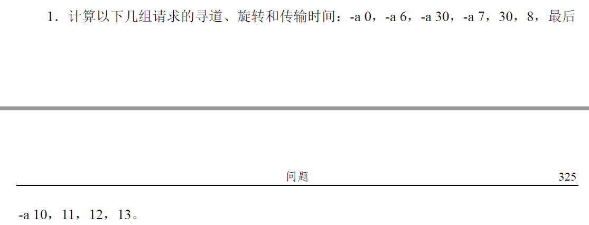

-a 10, 11, 12,13组：

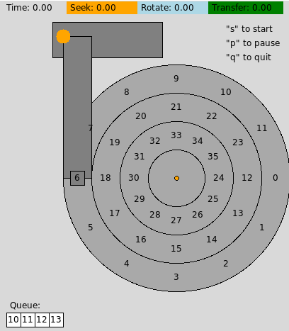

先从区域6转到区域10，此时旋转时间为105，传输时间为30

从区域10到区域11，此时传输时间为30， 因此上述总共时间花费105+30+30 = 165

接下来寻道时间花费40，此时总花费为165+40 = 205，因此中间磁道旋转了205度，因为区域12和区域18距离180度

所以到下一次旋转到区域12，还需经过旋转时间360 - （205 -180 ）- 15 = 320， 传输时间为30

从区域12到区域13 经过传输时间为30.

因此总时间为 205 + 320+ 30 + 30 = 585

运行结果：

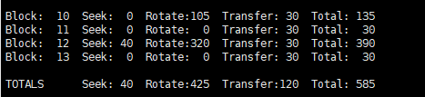

2. 

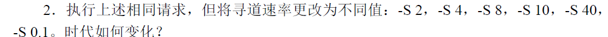

当将寻道速率增加时，寻道时间肯定会减少，但是总时间不一定会减少，这取决于不同的任务队列，主要原因是在寻道的过程中，当正好寻道完成时，此时区域刚好从磁头下面穿过，因此旋转时间可能会增加。因此旋转速率和寻道速率的最佳值对于不同的任务队列是不一样的。

3. 

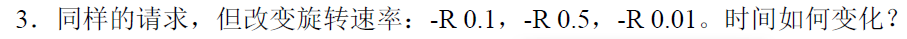

旋转速率降低，总时间基本是增加的。

4. 

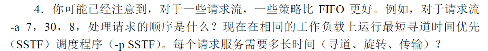

对于FIFO策略而言，执行的顺序为7,30,8

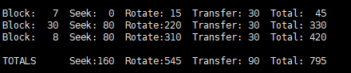

对于最短寻道时间优先策略而言，执行的顺序为7,8,30

从起始区域到区域7，旋转时间15， 传输时间30

从区域7到区域8， 传输时间为30， 此时总花费为15+30+30 = 75

从区域8到区域30，寻道时间花费80，此时总花费为75+80=155

旋转时间要花费360-155-15 = 190 传输时间花费 30

总时间为155+190+30 = 375

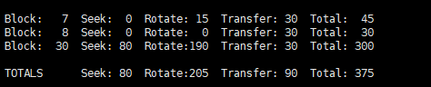

比FIFO策略花费时间节约50%多。

5. 

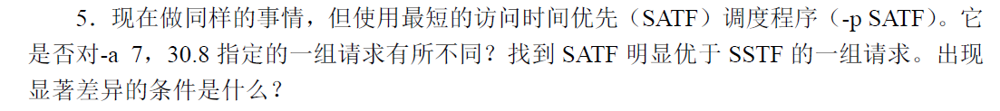

对于该任务，最短访问时间优先策略的执行和最短寻道时间的执行时间基完全一样

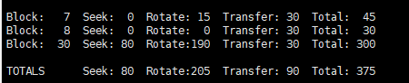

对于该任务-a 7,6,21 -S 10 采用SATF策略：

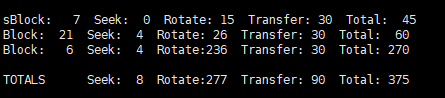

SSTF策略：

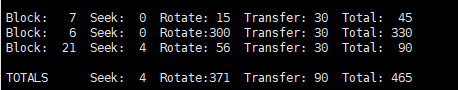

6. 

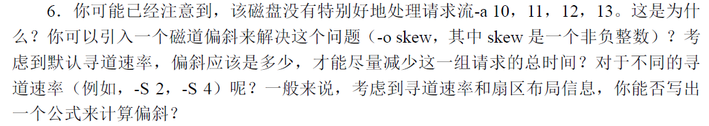

磁道偏斜2，时间显著减少

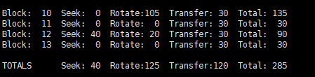

计算偏斜的公式：

假设寻道速度为k倍默认寻道速率 （40度/道时间）， 旋转时间默认为 1度/单位时间

因此磁道偏移skew满足：

如果：1(转转速率) * (40/k) < 15 则，skew=0

否则：1(转转速率) * (40/k) < skew * 30

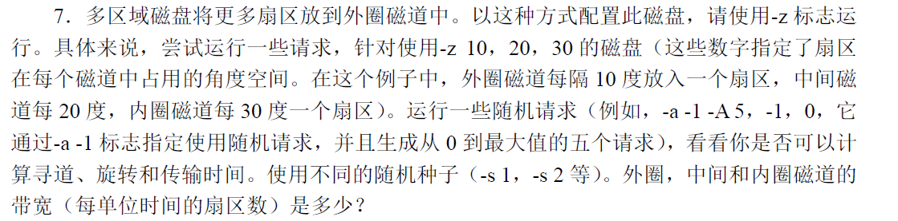

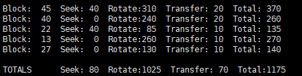

# 38 廉价冗余磁盘阵列

1. 

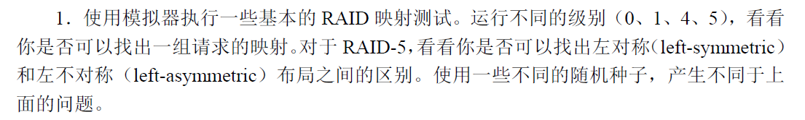

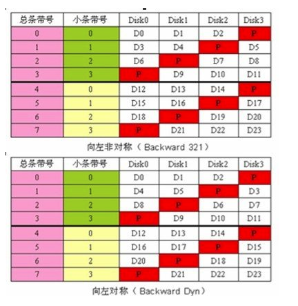

左/右指的是校验信息如何分布，对称/非对称指的是数据如何分布。“左”算法中，校验从最后一个磁盘开始，每一个条带将校验向靠近第一个磁盘的方向移动一个磁盘的位置。“非对称”算法将给定条带的数据块按简单的顺序方式放置，必要时跳过条带，并且总是从第一个条带的数据块开始。“对称”算法连续将数据块按顺序磁盘序列的方式分布，必要时重绕回第一个磁盘。因此，顺序算法对于大量顺序读取操作有更好的性能。

2. 

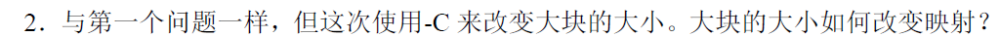

先通过取商（除数为磁盘数 * 大块）在哪个大块内，再通过取商（除数为大块）确定在哪个磁盘内，再通过取余确定在哪一层。

3. 

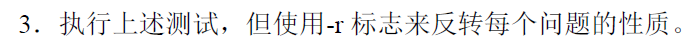

4. 

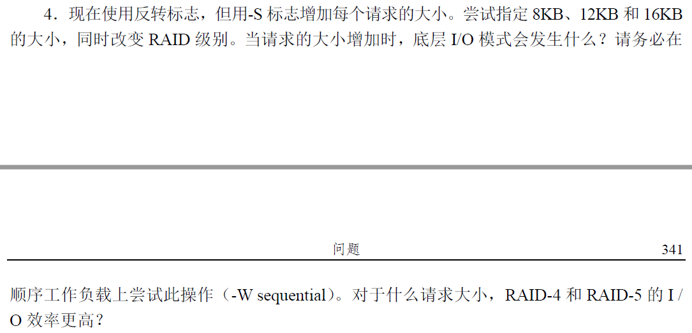

当请求的大小增加时，RAID1的I/O的并行性容易减弱

5. 

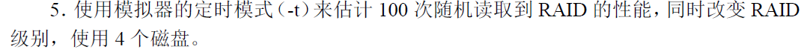

RAID0：

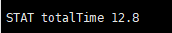

RAID1：

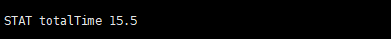

RAID4：

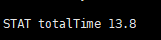

RAID5 LS和LA:

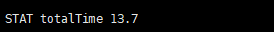

基本上还是RAID1最慢。

6. 

增加磁盘数量时，性能都会提升，因为磁盘数量多，冲突的概率就更小。

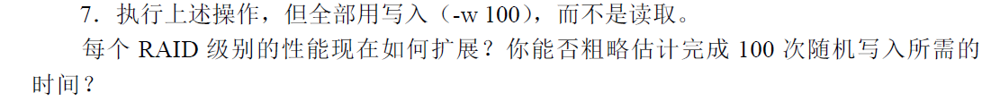

性能都会提升，提升最大的是RAID1，4, 5。

# 40 文件系统实现

1. 

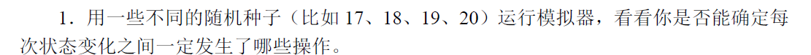

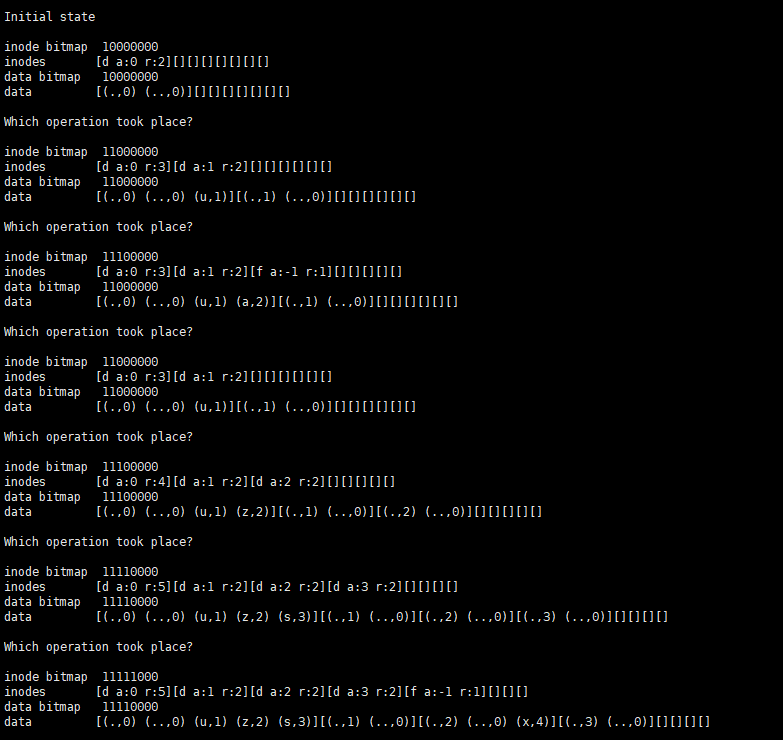

首先是在根目录下创建了目录“u”,

然后在根目录下创建了文件“a”,

接着删除了文件“a”,

在根目录下创建了目录“z”

在根目录下创建了目录“s”

在目录“z”下创建了文件“x”

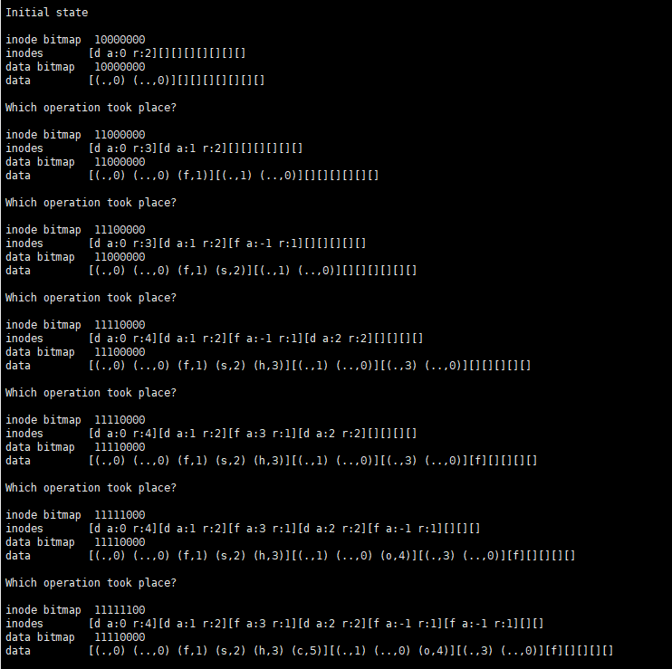

1. 在根目录下创建目录f
2. 在根目录下创建文件s
3. 根目录下创建目录h
4. 在文件s中写入内容f
5. 在目录f下创建文件o
6. 在根目录下创建文件c

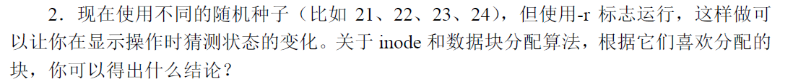

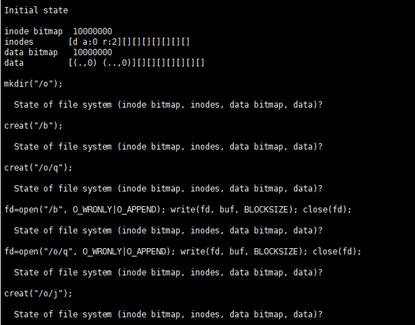

inode bitmap  10000000
inodes      \[d a:0 r:2]\[]\[]\[]\[]\[]\[]\[]
data bitmap   10000000
data       \[(., 0) (.. , 0)]\[]\[]\[]\[]\[]\[]\[]

1.

inode bitmap  11000000
inodes      \[d a:0 r:3]\[d a:1 r:2]\[]\[]\[]\[]\[]\[]
data bitmap   11000000
data       \[(., 0) (.. , 0), (o, 1)]\[(., 1), (.., 0)]\[]\[]\[]\[]\[]\[]

2.

inode bitmap  11100000
inodes      \[d a:0 r:3]\[d a:1 r:2]\[f a:-1 r: 1]\[]\[]\[]\[]\[]
data bitmap   11000000
data       \[(., 0) (.. , 0), (o, 1), (b, 2)]\[(., 1), (.., 0)]\[]\[]\[]\[]\[]\[]

3.

inode bitmap  11110000
inodes      \[d a:0 r:3]\[d a:1 r:2]\[f a:-1 r: 1]\[f a:-1 r:1]\[]\[]\[]\[]
data bitmap   11000000
data       \[(., 0) (.. , 0), (o, 1), (b, 2)]\[(., 1), (.., 0), (q, 3)]\[]\[]\[]\[]\[]\[]

4.

inode bitmap  11110000
inodes      \[d a:0 r:3]\[d a:1 r:2]\[f a:2 r: 1]\[f a:-1 r:1]\[]\[]\[]\[]
data bitmap   11100000
data       \[(., 0) (.. , 0), (o, 1), (b, 2)]\[(., 1), (.., 0), (q, 3)]\[f]\[]\[]\[]\[]\[]

5.

inode bitmap  11110000
inodes      \[d a:0 r:3]\[d a:1 r:2]\[f a:2 r: 1]\[f a:3 r:1]\[]\[]\[]\[]
data bitmap   11110000
data       \[(., 0) (.. , 0), (o, 1), (b, 2)]\[(., 1), (.., 0), (q, 3)]\[f]\[f]\[]\[]\[]\[]

6.

inode bitmap  11111000
inodes      \[d a:0 r:3]\[d a:1 r:2]\[f a:2 r: 1]\[f a:3 r:1]\[f a:-1 r:1]\[]\[]\[]
data bitmap   11110000
data       \[(., 0) (.. , 0), (o, 1), (b, 2)]\[(., 1), (.., 0), (q, 3), (j, 4)]\[f]\[f]\[]\[]\[]\[]

都是首次从跟目录开始，寻找跟目录的数据，依次遍历，知道查到下一级目录名，然后查看相对应的inode位置，看inode内容查到该inod节点对应的数据位置，再依次遍历，直到遇到文件名。

3. 

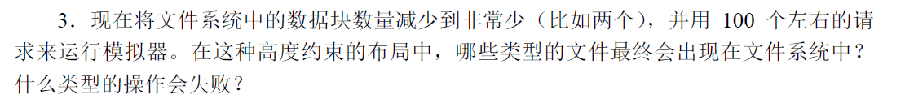

分配空间的操作会失败，只有根目录下的空文件会留在系统中，貌似最后一个数据块不能被使用

4. 

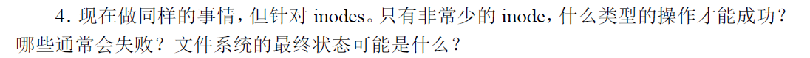

除了删除操作都会失败。