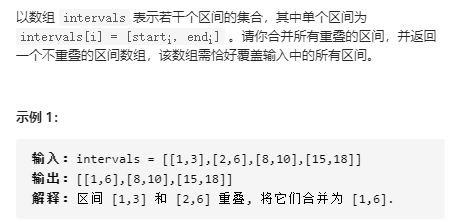
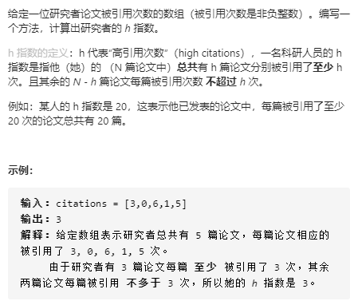

- [排序算法](#----)
  * [冒泡排序](#----)
  * [选择排序](#----)
  * [插入排序](#----)
  * [归并排序](#----)
  * [快速排序](#----)
  * [堆排序](#---)
  * [基数排序](#----)
  * [[56. 合并区间](https://leetcode-cn.com/problems/merge-intervals/)]
  * [[75. 颜色分类](https://leetcode-cn.com/problems/sort-colors/)]
  * [[148. 排序链表](https://leetcode-cn.com/problems/sort-list/)]
  * [[147. 对链表进行插入排序](https://leetcode-cn.com/problems/insertion-sort-list/)]
  * [[452. 用最少数量的箭引爆气球](https://leetcode-cn.com/problems/minimum-number-of-arrows-to-burst-balloons/)]
  * [[973. 最接近原点的 K 个点](https://leetcode-cn.com/problems/k-closest-points-to-origin/)]
  * [[剑指 Offer 45. 把数组排成最小的数](https://leetcode-cn.com/problems/ba-shu-zu-pai-cheng-zui-xiao-de-shu-lcof/)]
  * [[767. 重构字符串](https://leetcode-cn.com/problems/reorganize-string/)]
  * [[179. 最大数](https://leetcode-cn.com/problems/largest-number/)]
  * [[274. H 指数](https://leetcode-cn.com/problems/h-index/)]
  * [[220. 存在重复元素 III](https://leetcode-cn.com/problems/contains-duplicate-iii/)]
  * [[1329. 将矩阵按对角线排序](https://leetcode-cn.com/problems/sort-the-matrix-diagonally/)]
  * [[324. 摆动排序 II](https://leetcode-cn.com/problems/wiggle-sort-ii/)]
  * [[1353. 最多可以参加的会议数目](https://leetcode-cn.com/problems/maximum-number-of-events-that-can-be-attended/)]

# 排序算法

排序的定义：对$n$个数$a_1, a_2, ..., a_n$作为输入，输出为$a_{i1}, a_{i2}, ..., a_{in}$，该数列满足$a_{ik} < a_{ik+1}$。

原地排序的算法有：插入排序，选择排序，冒泡排序，堆排序，快速排序

非原地排序的算法有：归并排序

稳定排序的算法有：插入排序，冒泡排序，归并排序， 非稳定排序的算法有：选择排序，快速排序和堆排序。


排序算法选择的依据：

1. 待排序的记录数目n的大小，n较大，采用平均时间复杂度低的算法
2. 记录本身数据量的大小，也就会除关键字外的其他信息量的大小
3. 关键字的结构及其分布情况
4. 对排序稳定性的要求

## 冒泡排序

基本思想：遍历要排序的数列，每次比较相邻两个元素，如若前者比后者大则进行交换，因此最大的数第一次遍历后则放置在数组末尾。依次循环则整体有序

```python
#冒泡排序
def bubble_sort(arr):
    n = len(arr)
    for i in range(n):
        for j in range(1, n - i):
            if arr[j - 1] > arr[j]:
                arr[j - 1], arr[j] = arr[j], arr[j - 1]
        print(arr)
    return arr

#冒泡排序 优化1
def bubble_sort1(arr):
    n = len(arr)
    for i in range(n):
        flag = True
        for j in range(1, n - i):
            if arr[j - 1] > arr[j]:
                arr[j - 1], arr[j] = arr[j], arr[j - 1]
                flag = False
        if flag: #如果这一趟遍历时，没有需要交换的数，说明此是已经整体有序了，可以直接返回了
            break
        print(arr)
    return arr

#冒泡排序 优化2
def bubble_sort2(arr):
    n = len(arr)
    k = n
    for i in range(n):
        flag = True
        for j in range(1, k):
            if arr[j - 1] > arr[j]:
                arr[j - 1], arr[j] = arr[j], arr[j - 1]
                k = j #如果这一趟在j之后的数组都没有进行交换，说明后续的数组也已经整体有序了，后续的数组也不需要再遍历了
                flag = False
        if flag:
            break
        print(arr)
    return arr
```


## 选择排序

算法思想：首先在需要排序的数组中找到最小元素，将其放置在已排序数组的末尾位置，然后从剩下的需要排序的数组中寻找最小元素，继续重复上述过程。

```python
#选择排序
def select_sort(arr):
    n = len(arr)
    for i in range(n):
        min_index = i
        for j in range(i, n):
            if arr[j] < arr[min_index]:
                min_index = j
        arr[min_index], arr[i] = arr[i], arr[min_index]
        print(arr)
    return arr
                
```

## 插入排序

基本思想：通过构建有序数组，将新的需要排序的数组元素，从后往前遍历已排序的数组，找到所需要插入的位置插入。

```python
#插入排序
def insert_sort(arr):
    n = len(arr)
    for i in range(1, n):
        key = i - 1
        mark = arr[i]
        while key >= 0 and arr[key] > mark:
            arr[key + 1] = arr[key]
            key -= 1
        arr[key + 1] = mark
        print(arr)
    return arr 
```

## 希尔排序

```python
# 希尔排序
def shell_sort(arr):
    n = len(arr)
    gap = round(n / 2)
    print(gap)
    print(arr)
    while gap >= 1:
        for i in range(gap, n):
            temp = arr[i]
            j = i
            while j - gap >= 0 and arr[j - gap] > temp:
                arr[j] = arr[j - gap]
                j -= gap
            arr[j] = temp
        gap = round(gap / 2)
        print(arr)
    return arr
```

## 归并排序

基本思想：分治法，首先申请空间来存放两个已经排序的数组，其大小为两个数组之和。然后对两个已排序的数组进行排序，采用两个指针分别指向两个已排序数组的位置，比较两个指针所指向元素的大小，将小的添加到结果数组中，然后对应指针加1，重复上述过程，直到有一个指针已经到达末尾，再将另一个排序数组的剩下的所有元素直接添加到结果末尾。

```python
#归并排序
def merge_sort(arr):
    if len(arr) <= 1:
        return arr
    median = int(len(arr) / 2)
    left = merge_sort(arr[:median])
    right = merge_sort(arr[median:])
    return merge(left, right)
def merge(left, right):
    res = []
    i, j, k = 0, 0, 0
    while i < len(left) and j < len(right):
        if left[i] <= right[j]:
                res.append(left[i])
                i += 1
        else:
            res.append(right[j])
            j += 1
    res = res + left[i:] + right[j:]
    return re
```

## 快速排序

基本思想：快速排序也运用分治法的思想来进行，该算法通常比其他$O(nlogn)$算法更快，因为其内部循环可以更有效率的实现。

算法步骤：

1. 从需要排序的数列中选出一个元素，作为基准，基准的选取方式有**固定位置、随机选取基准，三数取中**。
2. 然后重新对数列进行排序，将所有元素比基准小的数放在基准的前面，大的放在基准的后面，相同的数可以任意放。该操作称为分区操作，此时数列已经逐步有序
3. 递归的将两个分区进行上述操作，最后即可有序。

```python
def fast_sort(res, left, right):
    if left >= right:
        return
    i, j = left, right
    while i < j:
        while i < j and count[res[j]] >= count[res[left]]:
            j -= 1
        while i < j and count[res[i]] <= count[res[left]]:
            i += 1
        res[i], res[j] = res[j], res[i]
    res[i], res[left] = res[left], res[i]
    fast_sort(res, left, i-1)
    fast_sort(res, i+1, right)

# 快速排序
def quick_sort(arr):
    return qsort(arr, 0, len(arr) - 1)

def qsort(arr, left, right):
    if left >= right:
        return arr
    key = arr[left]
    lp = left
    rp = right
    while lp < rp:
        while arr[rp] >= key and lp < rp:
            rp -= 1
        while arr[lp] <= key and lp < rp:
            lp += 1
        arr[lp], arr[rp] = arr[rp], arr[lp]
    arr[left], arr[lp] = arr[lp], arr[left]
    print(arr)
    qsort(arr, left, lp - 1)
    qsort(arr, rp + 1, right)
    return arr

# 快速排序
def quicksort(nums):
    if len(nums) <= 1:
        return nums
    left = []
    right = []
    bases = nums[0]
    for x in nums[1:]:
        if x < bases:
            left.append(x)
        else:
            right.append(x)
    return quicksort(left) + [bases] + quicksort(right)
```

**快速排序的改进**：

1. 若现在数组是逆序数组，则每次选择数组第一个元素作为基准时，则每次分区操作只能排序一个数，此时最坏的时间复杂度为$O(n^2)$，因此改进基准值的选取方式，即 **三数取中**，从数组开始、中间、结尾处选取三个数，以三位数的中间值作为基准。
2.  当待排序数组的长度分割到一定大小后**，使用插入排序**。这是因为对于规模小并且部分有序的数组，插入排序的效果更好。待排序序列程度可以取$5-20$之间。

```python
if (right - left + 1 < 10)  
{  
    InsertSort(arr,low,high) 
    return
}
    QuickSort(arr,low,high)
```

3. 在一次分区操作后，可以把与基准值相等的元素聚在一起，下次分割时，不需要对基准值相等的元素进行分区，**即三路快排**。这主要是解决当数组中有大量重复元素的问题，效率会得到提高。思路：将数组分成三个部分，分别对应小于、等于和大于基准值的元素。


主要是维护两个指针分别$lt$和$gt$，将小于基准的部分放在$lt$左边，将大于基准的部分放在$lt$右边，等于基准的时候将索引$i$右移。

```python
def _partition(nums, l, r):
    ind = random.randint(l, r) #随机选取基准
    nums[l], nums[ind] = nums[ind], nums[l]#将基准值放置在带排序数组首部
    base = nums[l]
    #初始时刻，小于部分和大于部分都先定义为空
    lt = l  # nums[l+1...lt] < base
    gt = r + 1  # nums[gt...r] > base
    i = l + 1  # nums[lt+1...i] == base
    while (i < gt):
        # i==gt时表示已经比较结束
        if (nums[i] < base):
            nums[i], nums[lt+1] = nums[lt+1], nums[i]
            lt += 1
            i += 1
        elif (nums[i] > base):
            nums[i], nums[gt-1] = nums[gt-1], nums[i]
            gt -= 1
        else:  # nums[i] == base
            i += 1
        print(nums)
    nums[l], nums[lt] = nums[lt], nums[l]
    print(nums)
    return lt, gt


def _quick_sort(nums, l, r):
    if l < r:
        lt, gt = _partition(nums, l, r)
        _quick_sort(nums, l, lt - 1)
        _quick_sort(nums, gt, r)


def quick_sort(nums):
    l, r = 0, len(nums) - 1
    _quick_sort(nums, l, r)
```


## 堆排序

基本思想：利用堆数据结构来进行排序。堆可以看做是一颗完全二叉树的数组对象

1. 将需要排序的数组构建成大顶堆
2. 将堆顶元素与数组最后一个元素进行交换，此时得到规模为$n-1$的无序数列，和规模为1的有序数列
3. 然后将规模为$n-1$的无序数列调整为大顶堆，重复上述过程。

```python
def heapify(arr, n, i): #构建大顶堆
    largest = i       # 父节点为i，当前最大值为父节点
    l = 2 * i + 1     # left = 2*i + 1 
    r = 2 * i + 2     # right = 2*i + 2 
  
    if l < n and arr[i] < arr[l]: #如果左子节点大于当前最大值，将最大值变为左子节点
        largest = l 
  
    if r < n and arr[largest] < arr[r]: #如果右子节点大于大于当前最大值，将最大值变为左子节点， 此时largest保存的是父节点和左右子节点中的最大值的位置
        largest = r 
  
    if largest != i: #如果最大值的位置不在父节点处，则此时不符合大顶堆的要求，因此要将父节点和最大值所在节点的位置进行交换，使得父节点大于左右子节点
        arr[i],arr[largest] = arr[largest],arr[i]  # 交换
  
        heapify(arr, n, largest) #此时经过交换后，子节点作为父节点时，可能也不满足大顶堆的性质，因此对此处再进行构建大顶堆
    
    #如果最大值的位置在父节点处，此时其子节点是不需要调整的，因为我们本身建立堆的过程就是从后往前遍历构建的，因此子节点的值未做调整时，它是符合大顶堆的性质的（因为前期建堆的过程可以保证这一性质）。
    
def heapSort(arr): 
    n = len(arr) 
  
    # Build a maxheap. 
    for i in range((n - 2) // 2, -1, -1): #最后一个节点为n-1，则其对应的父节点为(n-1 - 1) // 2, 因此父节点的最大索引为(n-1 - 1) // 2，最小为0
        heapify(arr, n, i) #n为堆的规模
  
    #当堆建立完成时， 一个个交换元素，从后往前遍历，使得最大值逐步从后往前放置
    for i in range(n-1, 0, -1): 
        arr[i], arr[0] = arr[0], arr[i]   # 交换
        heapify(arr, i, 0) #当堆顶元素和末尾位置进行交换后，则将堆的规模逐步缩小（i），并重新调整交换后的堆顶元素（索引为0），使得重新构建为大顶堆
  
arr = [ 12, 8, 132, 5, 6, 7] 
heapSort(arr) 
n = len(arr) 
print ("排序后") 
for i in range(n): 
    print ("%d" %arr[i]),
```


## 基数排序

```python
# 基数排序
def RadixSort(input_list):
    def MaxBit(input_list):
        max_data = max(input_list)
        bits_num = 0
        while max_data:
            bits_num += 1
            max_data //= 10
        return bits_num
    def digit(num, d):
        p = 1
        while d > 1:
            d -= 1
            p *= 10
        return num // p % 10
    
    if len(input_list) == 0:
        return []
    sorted_list = input_list
    length = len(sorted_list)
    bucket = [0] * length
    
    for d in range(1, MaxBit(sorted_list) + 1):
        count = [0] * 10
        
        for i in range(0, length):
            count[digit(sorted_list[i], d)] += 1
            
        for i in range(1, 10):
            count[i] += count[i - 1]
        
        for i in range(0, length)[::-1]:
            k = digit(sorted_list[i], d)
            bucket[count[k] - 1] = sorted_list[i]
            count[k] -= 1
            print(bucket)
        for i in range(0, length):
            sorted_list[i] = bucket[i]
    return sorted_list
```


## [56. 合并区间](https://leetcode-cn.com/problems/merge-intervals/)



解决思路：需要合并所有的重叠区间，因此首先将区间进行排序，按照$start$的顺序升序排列，如果$start$相等，再按照$end$大小升序排序。这样排序后的区间可以保证，与区间$k$重叠的区间必定是相邻（有重叠后会合并新区间来代替原区间所在的位置），因此我们只需要判断每个区间是否与前一个区间相邻即可。具体来说分为三种情况：

1. 当$start > preend$，即新区间的起点比前一个区间的结束点要大，因此此时两个区间不重叠，将原来区间添加到结果列表（因为排序保证了后面的区间不会与原来的区间重叠），用新的区间来替换原来的区间，继续循环。
2. 当$start == preend$时，此时两个区间重叠，用新区间的结束点代替原来区间的结束点，继续循环
3. 当$start < preend$时，如果$end >preend$，则表示两个区间有重叠，用新区间的结束点代替原来区间的结束点，若是 $end <=preend$，则表示新区间完全被原来区间包含住，不需要额外操作，继续进行循环即可。

```python
class Solution:
    def merge(self, intervals: List[List[int]]) -> List[List[int]]:
        if len(intervals) == 0:
            return []
        intervals.sort(key = lambda x:(x[0], x[1]))
        res = []
        prestart = intervals[0][0]
        preend = intervals[0][1]
        for i in range(1, len(intervals)):
            start, end = intervals[i][0], intervals[i][1]
            if start > preend:
                res.append([prestart, preend])
                prestart, preend = start, end
            elif start == preend:
                preend = end
            elif start < preend:
                if end > preend:
                    preend = end 
        res.append([prestart, preend])
        return res
```

## [75. 颜色分类](https://leetcode-cn.com/problems/sort-colors/)


解决思路1：直接遍历两次，第一次统计0、1、2的数量，第二次根据数量赋值给数组即可

解决思路2：采用双指针，第一个指针$ptr0$从左边开始，保存下一个0应该存储的位置， 第二个指针$ptr2$从右边开始，保存下一个2应该存储的位置。再从左边索引$i$开始遍历，当$nums[i]$为0时，将索引$i$和索引$ptr0$的数进行交换，并且$ptr0+1$，当$nums[i]=2$时，将将索引$i$和索引$ptr2$的数进行交换，并且$ptr2-1$,但是此时要注意，交换后的$nums[i]$还可能是为2，因为我们并没有判断交换前$ptr2$索引处的值，因此此时的判断还没有结束，还需要判断$nums[i]=2$是否仍成立，并且指定其不等于2，索引$i$才加1，因为$ptr2$处直到数组末尾都已经保证了为2，因此索引$i$最多前进到$pre2$即可。

```python
class Solution:
    def sortColors(self, nums: List[int]) -> None:
        """
        Do not return anything, modify nums in-place instead.
        """
        ptr0, ptr2 = 0, len(nums) - 1
        i = 0
        n = len(nums)
        while i <= ptr2:
            if nums[i] == 0:
                nums[ptr0], nums[i] = nums[i], nums[ptr0]
                ptr0 += 1
            while nums[i] == 2 and i <= ptr2:
                nums[ptr2], nums[i] = nums[i], nums[ptr2]
                ptr2 -= 1
            i += 1
```


## [148. 排序链表](https://leetcode-cn.com/problems/sort-list/)


解决思路：根据时间复杂度的考虑，采用归并排序来进行链表排序，首先需要找到链表的中间节点，将链表进行分段，然后再对分段后的链表进行排序，最后再合并链表即可。

```python
# Definition for singly-linked list.
# class ListNode:
#     def __init__(self, val=0, next=None):
#         self.val = val
#         self.next = next
class Solution:
    def sortList(self, head: ListNode) -> ListNode:
        
        
        def findmid(head):#找链表中间的节点
            p1, p2 = head, head
            q = p1
            while p2 and p2.next:
                q = p1#保留中间链表的前一个节点
                p1 = p1.next
                p2 = p2.next.next
            q.next = None#将链表分成两条链表
            return head, p1
        
        def node_sort(head):
            if head == None:
                return
            if head.next == None:
                return head
            p, q = findmid(head)
            head1, head2 = node_sort(p), node_sort(q) #对两条链表进行排序
            newhead = ListNode(-1)#引入一个虚节点，来避免边界条件的讨论
            new = newhead
            while head1 and head2:#将两条排序后的链表合并成一条排序后的链表
                if head1.val < head2.val:
                    newhead.next = head1
                    head1 = head1.next
                else:
                    newhead.next = head2
                    head2 = head2.next
                newhead = newhead.next
            newhead.next = head1 if head1 else head2
            return new.next
        
        return node_sort(head)
```


## [147. 对链表进行插入排序](https://leetcode-cn.com/problems/insertion-sort-list/)


解释思路：插入排序的关键是将新来的节点插入到已排序链表的合适位置，使得新链表依然有序，因此先完成插入链表的子功能，再从链表的头节点开始，依次遍历到链表末尾，不断插入，使得整个链表有序。

```python
# Definition for singly-linked list.
# class ListNode:
#     def __init__(self, val=0, next=None):
#         self.val = val
#         self.next = next
class Solution:
    def insertionSortList(self, head: ListNode) -> ListNode:

        def nodeinsert(head, curnode): #在有序链表中插入新节点，仍然保证有序
            if head == None:
                return curnode
            if curnode.val <= head.val:
                curnode.next = head
                return curnode
           
            res = head
            while head:#寻找新节点应该插入的位置
                if head.val < curnode.val:
                    if head.next == None:
                        head.next = curnode
                        return res
                    else:
                        if head.next.val >= curnode.val:
                            curnode.next = head.next
                            head.next = curnode
                            return res
                head = head.next
        
        if head == None:
            return
        newhead = head #当前已排序好的链表头节点
        curnode = head.next # 当前需要插入的节点
        newhead.next = None #将当前已排序好的链表从整个链表分离出来
        while head:
            if curnode:
                pnext = curnode.next #保存下一次需要插入的链表头节点
                curnode.next = None # 当前需要插入的节点从需要排序的链表中分离出来
                newhead = nodeinsert(newhead, curnode)
                curnode = pnext # 下一次需要插入的节点
            else:
                return newhead
```

## [452. 用最少数量的箭引爆气球](https://leetcode-cn.com/problems/minimum-number-of-arrows-to-burst-balloons/)


解决思路：该题目的本质在于给定的区间里，有多少个互不重叠的区间集合。涉及到区间重叠的时候，一般都需要对区间先进行排序，按照$start和end$的排序指标来对区间进行排序，因此分两种情况分析：

1. 若当前区间的$start$比前一个区间的$preend$大，则表示两个区间必定不会重叠，因此互不重叠的区间集合数增加1
2. 若当前区间的$start$比前一个区间的$preend$小，则表示两个区间必定会重叠（因为排序后，以及保证了$start>prestart$）, 为了后续的区间更有可能与前一个区间重叠，则$preend = min(preend, end)$，因为只有$preend$取两者的最小值，才能保证该区间是重叠的。

```python
class Solution:
    def findMinArrowShots(self, points: List[List[int]]) -> int:
        if len(points) == 0:
            return 0
        points.sort(key = lambda x:(x[0], x[1]))
        res = []
        prestart = points[0][0]
        preend = points[0][1]
        num = 1
        for i in range(1, len(points)):
            start, end = points[i][0], points[i][1]
            if start > preend:
                num += 1
                prestart, preend = start, end
            else:
                prestart, preend = start, min(preend, end)
       
        return num
```


## [973. 最接近原点的 K 个点](https://leetcode-cn.com/problems/k-closest-points-to-origin/)


解决思路：解决该问题，本质上是寻找一个数组中的前$K$个最小值，因此可以采用堆排序来解决，建立一个规模为$K$的大顶堆，当数组新来的值比堆顶值要小时，则弹出堆顶值，将新值压入堆中，再重新调整堆的顺序，使得继续满足大顶堆的性质。则最后堆中的值就是我们需要求的前$K$个最小值。在本题中数组值即为距离值，为了保证距离值全部有序，将点坐标也一起压入。利用Python中heapq模块的性质，因为其默认是小顶堆，因此将距离取负号再添加到堆中即可。

```python
class Solution:
    def kClosest(self, points: List[List[int]], k: int) -> List[List[int]]:
        import heapq
        
        res = []
        while k > 0:
            curpoint = points.pop()
            x, y = curpoint[0], curpoint[1]
            distance = -sqrt(x ** 2 + y ** 2)
            res.append((distance, x, y))
            k -= 1
        heapq.heapify(res)
        while points:
            curpoint = points.pop()
            x, y = curpoint[0], curpoint[1]
            curdistance = -sqrt(x ** 2 + y ** 2)
            if curdistance > res[0][0]:
                heapq.heappop(res)
                heapq.heappush(res, (curdistance, x, y))
        return [[x, y] for d, x, y in res]
```


## [剑指 Offer 45. 把数组排成最小的数](https://leetcode-cn.com/problems/ba-shu-zu-pai-cheng-zui-xiao-de-shu-lcof/)


解决思路：该题的本质即是数组排序，只不过排序的依据是字典序。因此采用快速排序来进行排序。

```python
class Solution:
    def minNumber(self, nums: List[int]) -> str:

        def fast_sort(nums, left, right):#快速排序1
            if left >= right:
                return
            i, j = left, right
            while i < j:
                while i < j and nums[j] + nums[left] >= nums[left] + nums[j]:#排序依据
                        j -= 1
                while i < j and nums[i] + nums[left] <= nums[left] + nums[i]:
                        i += 1
                nums[i], nums[j] = nums[j], nums[i]
            
            nums[i], nums[left] = nums[left], nums[i]
            fast_sort(nums, left, i - 1)
            fast_sort(nums, i + 1, right)
            
        nums = [str(num) for num in nums]
        fast_sort(nums, 0, len(nums) - 1)
        return ''.join(nums)
```

```python
    def fast_sort(nums):#快速排序2
            if len(nums) == 0:
                return []
            if len(nums) == 1:
                return nums
            flag = nums[0]
            pre, post = [], []
            for i in range(1, len(nums)):
                len_flag, len_curnum = len(flag), len(nums[i])
                if (len_flag > len_curnum and flag[:len_curnum] == nums[i]) or (len_flag < len_curnum and flag == nums[i][:len_flag]):
                    if nums[i] + flag < flag + nums[i]:
                        pre.append(nums[i])
                    else:
                        post.append(nums[i])
                else:
                    if nums[i] < flag:
                        pre.append(nums[i])
                    else:
                        post.append(nums[i])
            presort = fast_sort(pre)
            postsort = fast_sort(post)
            return presort + [flag] + postsort
```


## [767. 重构字符串](https://leetcode-cn.com/problems/reorganize-string/)


解决思路：需要重构字符串使得两相邻的字符串是否不同，因此，显然相同字符最多的数量不能超过整个数组长度的中间值，此时必定不存在满足条件的字符串。

然后该问题分两步解决：

1. 首先通过字符串中出现的各个字符的个数，然后将字符按照出现的数量进行排序，形成类似于$ccccccccaaaaaabbbb...$这样的字符串
2. 以数组长度的中间值$mid$为界限，将前$mid$个字符插入到整个字符串的偶数位置，后$mid$个字符插入到整个字符的奇数位置即可。

```python
class Solution:
    def reorganizeString(self, S: str) -> str:
        from collections import defaultdict
        count = defaultdict(int)
        for c in S:
            count[c] += 1
        res = list(S)
        res.sort()
        n = len(res)
        def fast_sort(res, left, right):
            if left >= right:
                return
            i, j = left, right
            while i < j:
                while i < j and count[res[j]] >= count[res[left]]:
                    j -= 1
                while i < j and count[res[i]] <= count[res[left]]:
                    i += 1
                res[i], res[j] = res[j], res[i]
            res[i], res[left] = res[left], res[i]
            fast_sort(res, left, i-1)
            fast_sort(res, i+1, right)

        fast_sort(res, 0, n - 1)
        res = res[::-1]
        print(res)
        maxcount = count[res[0]]
        midcount = (len(S) + 1) // 2
        if maxcount > midcount:
            return ""
        res[::2], res[1::2] = res[:midcount], res[midcount:]
        return ''.join(res)
```

## [179. 最大数](https://leetcode-cn.com/problems/largest-number/)


解决思路：该问题的本质仍然是排序问题，排序的标准依然是字典序，不过要注意前导0的问题。

```python
class Solution:
    def largestNumber(self, nums: List[int]) -> str:
        def fast_sort(nums, left, right):
            if left >= right:
                return
            i, j = left, right
            while i < j:
                while i < j and nums[j] + nums[left] >= nums[left] + nums[j]:
                        j -= 1
                while i < j and nums[i] + nums[left] <= nums[left] + nums[i]:
                        i += 1
                nums[i], nums[j] = nums[j], nums[i]
            
            nums[i], nums[left] = nums[left], nums[i]
            fast_sort(nums, left, i - 1)
            fast_sort(nums, i + 1, right)
            
        nums = [str(num) for num in nums]
        fast_sort(nums, 0, len(nums) - 1) #首先将数组进行升序排序
        while len(nums) >= 2:
            if nums[-1] == '0' * len(nums[-1]): #此时数组末尾的值最后会是数的开始值，因此需要判断数组去掉前导0
                nums.pop()
            else:
                break
        return ''.join(nums[::-1])#因为是求最大值，所以数组应当是降序排序
```

## [274. H 指数](https://leetcode-cn.com/problems/h-index/)



解决思路：该问题也是首先先进行排序，然后从后往前遍历即可。

```python
class Solution:
    def hIndex(self, citations: List[int]) -> int:
        citations.sort()
        hindex = 0
        for i in range(1, len(citations) + 1):
            if citations[-i] >= i: 
                hindex = i
            else:
                break
        return hindex
```

## [220. 存在重复元素 III](https://leetcode-cn.com/problems/contains-duplicate-iii/)


解决思路：该问题的直接解决思路是双重遍历即可解决，为了降低遍历的时间，对其进行剪枝处理。因此首先进行排序，当第二重遍历的当前值与初始值的差不满足条件时，则直接退出该重循环（因为排序保证后续的值比当前值更大，更不可能符合条件）。

```python
class Solution:
    def containsNearbyAlmostDuplicate(self, nums: List[int], k: int, t: int) -> bool:
        n = len(nums)
        nums_index = [(num, index) for index, num in enumerate(nums)]
        nums_index.sort()
        for i in range(n):
            for j in range(i+1, n):
                if nums_index[j][0] - nums_index[i][0] > t:
                    break
                if abs(nums_index[j][1] - nums_index[i][1]) <= k:
                    return True

        return False
```

## [1329. 将矩阵按对角线排序](https://leetcode-cn.com/problems/sort-the-matrix-diagonally/)


解决思路：该问题的本质上就是排序，只不过涉及到矩阵数组对角线元素的选取和放置。以矩阵第一行和第一列的所有元素分别作为对角线的起点，遍历即可。

```python
class Solution:
    def diagonalSort(self, mat: List[List[int]]) -> List[List[int]]:
        
        rows = len(mat)
        cols = len(mat[0])
        def Get_num(x, y):
            num = []
            while x < rows and y < cols:
                num.append(mat[x][y])
                x += 1
                y += 1
            num.sort()
            return num
        def Put_num(num, x, y):
            i = 0
            while x < rows and y < cols:
                mat[x][y] = num[i]
                x += 1
                y += 1
                i += 1
        for i in range(rows):
            num = Get_num(i, 0)
            Put_num(num, i, 0)

        for j in range(1, cols):
            num = Get_num(0, j)
            Put_num(num, 0, j)
        
        return mat
```

## [324. 摆动排序 II](https://leetcode-cn.com/problems/wiggle-sort-ii/)


解决思路：摆动排序的本质上是数组的偶数索引位置存放数组存放前mid个数值小的值，数组的基数索引位置存放后mid个数组中数值大的值。为了保证mid中间值附近的值不会相邻（因为此时它们可能是相等的值，若它们相邻，则不符合条件），让该值附近的值一个位于偶数索引的末端，一个位于奇数索引的前端即可。

```python
class Solution:
    def wiggleSort(self, nums: List[int]) -> None:
        """
        Do not return anything, modify nums in-place instead.
        """
        nums.sort()
        n = len(nums)
        if n == 0 or n == 1:
            return nums
        mid = (n + 1) // 2   
        nums[::2], nums[1::2] = nums[:mid][::-1], nums[mid:][::-1]

        return nums
```

## [1353. 最多可以参加的会议数目](https://leetcode-cn.com/problems/maximum-number-of-events-that-can-be-attended/)


解决思路：该问题的解决是尽可能的可以参数多的会议数目。

1. 首先将会议按照开始的时间进行排序，若开始时间相同，则结束时间早的会议排序在前。我们从第1天开始，直到第100000天进行遍历。
2. 因此当在第$i$天可以参加的会议$k_1,k_2,...,k_n$中，我们要尽可能的选取结束时间早的会议$k_j$，因为该会议在$k_1,k_2,...,k_n$中若不在第$i$天参加，则$k_j$会议是在后续的天数中最低概率能被继续参加的会议。
3. 因此涉及到多个值的最小值问题，我们可以采用**堆排序**来解决，首先将在第$i$天可以参加的会议$k_1,k_2,...,k_n$加入到堆中，根据它们的结束时间进行堆排序（因为能加入到堆中已经保证了第$i$天可以参加的条件，因此会议的起始时间我们不需要再关注了），然后从堆中弹出结束时间最早的会议，若是结束时间大于当前的第$i$天，则表明该会议可以参加，因此结果加1，此时要调出堆的弹出过程（因为每天只能参加一个会议），否则继续从堆中弹出结束时间最早的会议，直到堆为空。
4. 该问题的解决利用了贪心的思路，贪心的关键在于每次都是做出当前局部条件下的最优选择，当局部最优可以达到全局最优时，则贪心算法是可以的。

```python
class Solution:
    def maxEvents(self, events: List[List[int]]) -> int:
        def fast_sort(left, right):
            if left >= right:
                return
            i, j = left, right
            while i < j:
                while i < j and ((events[j][0] > events[left][0]) or (events[j][0] == events[left][0] and events[j][1] >= events[left][1])):
                    j -= 1
                while i < j and ((events[i][0] < events[left][0]) or (events[i][0] == events[left][0] and events[i][1] <= events[left][1])):
                    i += 1
                events[i], events[j] = events[j], events[i]
            events[i], events[left] = events[left], events[i]
            fast_sort(left, i-1)
            fast_sort(i+1, right)
        n = len(events)
        # events.sort(reverse = True)
        # print(events)
        fast_sort(0, n - 1)
        events = events[::-1] #将开始时间最早的会议放在末尾，这是为了方便利用python中队列的pop操作
        res = 0
        import heapq
        hea = []
        for i in range(1, 100001):
            while events and events[-1][0] == i:
                curend = events.pop()[1]
                heapq.heappush(hea, curend)
            while hea:
                curmineng = heapq.heappop(hea)
                if curmineng >= i:
                    res += 1
                    break
            if events == [] and hea == []:
                break
        return res
```


