- [堆](#-)
  * [[215. 数组中的第K个最大元素](https://leetcode-cn.com/problems/kth-largest-element-in-an-array/)]
  * [[347. 前 K 个高频元素](https://leetcode-cn.com/problems/top-k-frequent-elements/)]
  * [[973. 最接近原点的 K 个点](https://leetcode-cn.com/problems/k-closest-points-to-origin/)]
  * [[378. 有序矩阵中第 K 小的元素](https://leetcode-cn.com/problems/kth-smallest-element-in-a-sorted-matrix/)]
  * [[451. 根据字符出现频率排序](https://leetcode-cn.com/problems/sort-characters-by-frequency/)]
  * [[692. 前K个高频单词](https://leetcode-cn.com/problems/top-k-frequent-words/)]
  * [[659. 分割数组为连续子序列](https://leetcode-cn.com/problems/split-array-into-consecutive-subsequences/)]
  * [[743. 网络延迟时间](https://leetcode-cn.com/problems/network-delay-time/)]
  * [[787. K 站中转内最便宜的航班](https://leetcode-cn.com/problems/cheapest-flights-within-k-stops/)]
  * [[373. 查找和最小的K对数字](https://leetcode-cn.com/problems/find-k-pairs-with-smallest-sums/)]
  * [[313. 超级丑数](https://leetcode-cn.com/problems/super-ugly-number/)]

# 堆

堆数据结构是一种数据对象，可以被视为一颗完全二叉树。树中每个节点与数组中存放该节点的值的那个元素相对应。树的每一层都是填满的，最后一层可能除外。堆又分为最大堆和最小堆，最小堆是父节点的值小于左右子节点的值，最大堆是父节点的值大于左右子节点的值。

## [215. 数组中的第K个最大元素](https://leetcode-cn.com/problems/kth-largest-element-in-an-array/)

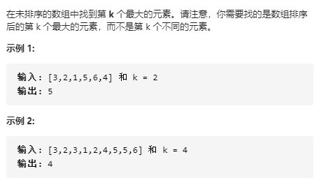

解决思路：找到第k个最大的元素，只需要维持一个容量为k的最小堆即可，遍历整个数组，最后堆中的堆顶元素即为所求。手动实现堆的代码和利用heapq库的代码如下所示。

```python
#手动实现堆
class Solution:
    def findKthLargest(self, nums: List[int], k: int) -> int:
        heapnum = Heap(nums[:k])
        for i in range(k, len(nums)):
            if nums[i] > heapnum.Topheap():
                heapnum.Poppushheap(nums[i])
        return heapnum.Topheap()

class Heap():
    def __init__(self, nums):
        self.heapnum = nums
        self.heaplen = len(self.heapnum)
        for index in range((self.heaplen-1) // 2, -1, -1):
            self.Sink_up(index)

    def Sink_up(self, index):
        left, right = index * 2 + 1, index * 2 + 2
        smallest = index
        if left < self.heaplen and self.heapnum[left] < self.heapnum[smallest]:
            smallest = left
        if right < self.heaplen and self.heapnum[right] < self.heapnum[smallest]:
            smallest = right

        if smallest != index:
            self.heapnum[smallest], self.heapnum[index] = self.heapnum[index], self.heapnum[smallest]
            self.Sink_up(smallest)
        else:
            return
    

    
    def Topheap(self):
        self.heaplen -= 1
        return self.heapnum[0]
```

```python
class Solution:
    def findKthLargest(self, nums: List[int], k: int) -> int:
        import heapq
        res = nums[:k]
        heapq.heapify(res)
        for i in range(k, len(nums)):
            if nums[i] > res[0]:
                heapq.heappop(res)
                heapq.heappush(res, nums[i])
        return res[0]
```

## [347. 前 K 个高频元素](https://leetcode-cn.com/problems/top-k-frequent-elements/)


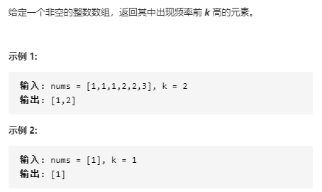

解决思路：维护有个容量为k的最小堆即可。

```python
class Solution:
    def topKFrequent(self, nums: List[int], k: int) -> List[int]:
        from collections import defaultdict
        count_num = defaultdict(int)

        for num in nums:
            count_num[num] += 1
        import heapq
        res = []
        i = 0
        for key in count_num:
            if i < k:
                res.append((count_num[key], key))
            if i == k - 1:
                heapq.heapify(res)
            if i >= k:
                if count_num[key] > res[0][0]:
                    heapq.heappop(res)
                    heapq.heappush(res, (count_num[key], key))
            i += 1
        
        return [key for count, key in res]
```


## [973. 最接近原点的 K 个点](https://leetcode-cn.com/problems/k-closest-points-to-origin/)

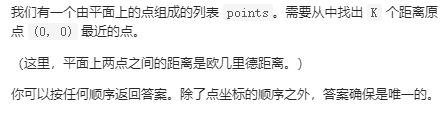

解决思路：采用堆来实现优先队列，以距离作为权重，维护容量为K的最大堆即可。

```python
class Solution:
    def kClosest(self, points: List[List[int]], k: int) -> List[List[int]]:
        import heapq
        
        res = []
        while k > 0:
            curpoint = points.pop()
            x, y = curpoint[0], curpoint[1]
            distance = -sqrt(x ** 2 + y ** 2)
            res.append((distance, x, y))
            k -= 1
        heapq.heapify(res)
        while points:
            curpoint = points.pop()
            x, y = curpoint[0], curpoint[1]
            curdistance = -sqrt(x ** 2 + y ** 2)
            if curdistance > res[0][0]:
                heapq.heappop(res)
                heapq.heappush(res, (curdistance, x, y))
        return [[x, y] for d, x, y in res]
```

## [378. 有序矩阵中第 K 小的元素](https://leetcode-cn.com/problems/kth-smallest-element-in-a-sorted-matrix/)

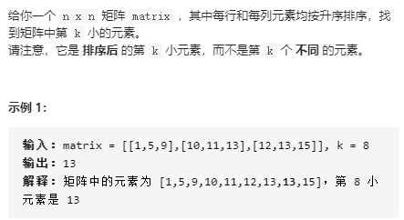

解决思路：由于矩阵每行每列都按升序排列，因此维护一个最小堆，当每次从堆中弹出堆顶元素时，都将其右侧和下侧的元素添加到堆中，直到弹出第k个元素即可。为了避免重复添加矩阵中的元素，采用一个集合来记录已访问的矩阵位置。

```python
class Solution:
    def kthSmallest(self, matrix: List[List[int]], k: int) -> int:
        rows, cols = len(matrix), len(matrix[0])
        visit = set()
        import heapq
        hea = []
        hea.append((matrix[0][0], 0, 0))
        visit.add((0, 0))
        heapq.heapify(hea)
        res = 0
        while k:
            val, x, y = heapq.heappop(hea)
            res = val
            k -= 1
            if y + 1 < cols and (x, y+1) not in visit:
                heapq.heappush(hea, (matrix[x][y+1], x, y+1))
                visit.add((x, y+1))
            if x + 1 < rows and (x+1, y) not in visit:
                heapq.heappush(hea, (matrix[x+1][y], x+1, y))
                visit.add((x+1, y))
        return res
```

## [451. 根据字符出现频率排序](https://leetcode-cn.com/problems/sort-characters-by-frequency/)

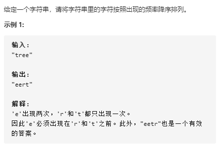

```python
class Solution:
    def frequencySort(self, s: str) -> str:
        from collections import defaultdict
        count = defaultdict(int)
        visit = set()
        for c in s:
            count[c] += 1
            visit.add(c)
        reslist = sorted(list(visit), key=lambda x:-count[x])
        res = ''
        for c in reslist:
            res += c * count[c]
        return res
```

## [692. 前K个高频单词](https://leetcode-cn.com/problems/top-k-frequent-words/)

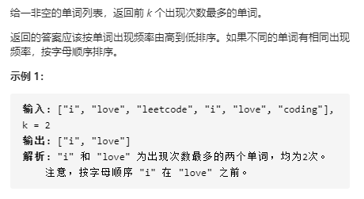

解决思路：需要返回k个出现次数最多的单词，因此采用堆来实现优先队列，频率作为权重值，维护一个容量为k的优先队列（最小堆）。不过这里需要注意的是，当频率值相等时，单词字典序更多的应该出队的优先级更高，即权重值更小，因此手动实现堆来实现该算法。

```python
class Solution:
    def topKFrequent(self, words: List[str], k: int) -> List[str]:
        from collections import defaultdict
        import heapq
        count = defaultdict(int)
        for word in words:
            count[word] += 1
        
        hea = []
        for key in count:
            if k:
                hea.append((count[key], key))
                k -= 1
                if k == 0:
                    Hea = heap(hea)
                continue
            if count[key] > Hea.hea[0][0] or (count[key] == Hea.hea[0][0] and key < Hea.hea[0][1])  : #当频率值相等时，单词字典序更多的应该出队的优先级更高
                Hea.poppush((count[key], key))
        Hea.hea.sort(key = lambda x:(-x[0], x[1]))
        res = []
        for num, key in Hea.hea:
            res.append(key)
        return res

class heap:
    def __init__(self, nums):
        self.hea = nums
        self.length = len(nums)
        for i in range((self.length-1) // 2, -1, -1):
            self.sink_up(i)

    def sink_up(self, index):
        smallest = index
        left, right = 2 * index + 1, 2 * index + 2
        while left < self.length and (self.hea[left][0] < self.hea[smallest][0] or (self.hea[left][0] == self.hea[smallest][0] and self.hea[left][1] > self.hea[smallest][1])): #当频率值相等时，单词字典序更多的应该出队的优先级更高
            smallest = left
        while right < self.length and (self.hea[right][0] < self.hea[smallest][0] or (self.hea[right][0] == self.hea[smallest][0] and self.hea[right][1] > self.hea[smallest][1])):
            smallest = right
        
        if smallest != index:
            self.hea[smallest], self.hea[index] = self.hea[index], self.hea[smallest]
            self.sink_up(smallest)
    
    def poppush(self, val):
        self.hea[0], self.hea[-1] = self.hea[-1], self.hea[0]
        self.hea.pop()
        self.hea.append(val)
        self.hea[0], self.hea[-1] = self.hea[-1], self.hea[0]
        self.sink_up(0)
```

## [659. 分割数组为连续子序列](https://leetcode-cn.com/problems/split-array-into-consecutive-subsequences/)

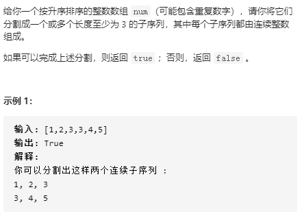

解决思路：采用哈希表和堆来解决，利用元素中的值作为哈希表的key值，哈希表的value是最小堆，最小堆的元素表示以key值作为连续子序列末尾时的子序列程度，当遍历到数组中的值为x时：

1. 先检测哈希表中的key= x-1是否存在，若存在，则将key = x-1对应的最小堆的堆顶元素弹出并加1，将该值添加到哈希表中的key = x对应的最小堆中。
2. 若哈希表中的key = x-1不存在，则表示以x值为连续子序列的起点，因此把1添加到key=x的最小堆中。

最后检测哈希表中的各个键对应的最小堆中的堆顶元素是否大于3即可。

```python
class Solution:
    def isPossible(self, nums: List[int]) -> bool:
        import heapq
        from collections import defaultdict
        count = defaultdict(list)

        for num in nums:
            if count[num-1] != []:
                minval = heapq.heappop(count[num-1])
                heapq.heappush(count[num], minval + 1)
            else:
                heapq.heappush(count[num], 1)
        
        for key in count:
            if count[key] and count[key][0] < 3:
                return False
        return True
```

## [743. 网络延迟时间](https://leetcode-cn.com/problems/network-delay-time/)

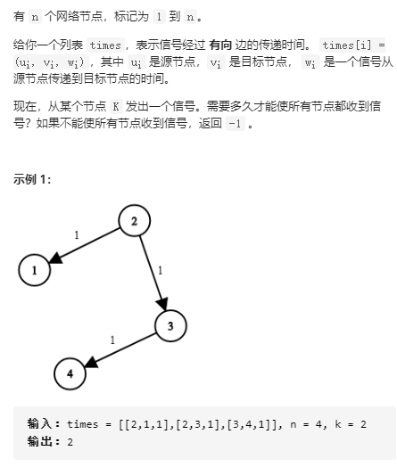

解决思路：采用优先队列（带权重的宽度优先搜索）来实现，从起点开始，每次遍历该节点所能访问到的所有边，并将（起点到该节点的距离， 该节点）添加到优先队列中，每次从优先队列中弹出距离最小的点，并采用哈希表记录到该节点时所花费的距离，再依次遍历，同时记录已经访问过的点，已经访问过的点不需要再次访问（此时形成环，有环的距离必然比无环的距离更大）。最后判断是否访问过所有点，并从哈希表中返回最大值即可。此时哈希表的（key， value）表示从起点到key点时花费的最小距离为value。

```python
class Solution:
    def networkDelayTime(self, times: List[List[int]], n: int, k: int) -> int:
        from collections import defaultdict
        import heapq
        graph_edge = defaultdict(list)
        for u, v, w in times:
            graph_edge[u].append((v, w))

        hea = []
        hea.append((0, k))
        dist = {}
        while hea:
            weight, node = heapq.heappop(hea)
            if node in dist:
                continue
            dist[node] = weight
            for nextnode, nextweight in graph_edge[node]:
                if nextnode not in dist:
                    heapq.heappush(hea, (weight + nextweight, nextnode))
        return max(dist.values()) if len(dist) == n else -1
```

## [787. K 站中转内最便宜的航班](https://leetcode-cn.com/problems/cheapest-flights-within-k-stops/)

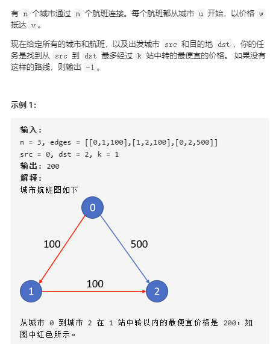

解决思路：从起点开始遍历，每次将该节点连接到的所有边添加到优先队列中，并以距离为权重值，直到遇到终点时，返回该终点时所对应的距离即可。若是没有遇到终点，并且中转次数也小于k，则继续依次遍历所连接的边即可。每次从优先队列中弹出最小距离的边，若是最终都没有达到目的点，则返回-1。

```python
class Solution:
    def findCheapestPrice(self, n: int, flights: List[List[int]], src: int, dst: int, K: int) -> int:
        from collections import defaultdict
        import heapq

        graph = defaultdict(list)
        for u, v, weight in flights:
            graph[u].append((v, weight))
        
        hea = [(0, 0, src)]
        dist = {}
        while hea:
            weight, num,  node = heapq.heappop(hea)

            if node == dst:
                return weight
        
            for nextnode, nextweight in graph[node]:
                if num <= K:
                    heapq.heappush(hea, (weight + nextweight, num + 1,  nextnode))
        
        return -1
```

## [373. 查找和最小的K对数字](https://leetcode-cn.com/problems/find-k-pairs-with-smallest-sums/)

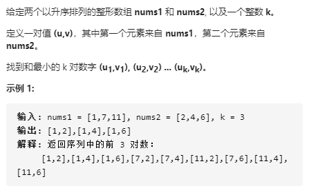

解决思路：维护一个容量为k的优先队列（最大堆）即可，以两数和作为权重，依次遍历两个数组即可。若当前的$(u,v)$的权重小于堆顶元素的权重，则弹出堆顶元素，将$(u,v)$添加到队列中，此时num2中的v后面的数值也不需要继续遍历了，nums1中u后面的元素所需要遍历nums2的数，最多只需要到v即可。

```python
class Solution:
    def kSmallestPairs(self, nums1: List[int], nums2: List[int], k: int) -> List[List[int]]:
        import heapq
        hea = []

        n1, n2 = len(nums1), len(nums2)
        for i in range(n1):
            for j in range(n2):
                if k:
                    hea.append((-(nums1[i] + nums2[j]), nums1[i], nums2[j]))
                    k -= 1
                    if k == 0:
                        heapq.heapify(hea)
                    continue
                cur = -(nums1[i] + nums2[j])
                if cur > hea[0][0]:
                    heapq.heappop(hea)
                    heapq.heappush(hea, (cur, nums1[i], nums2[j]))
                else:
                    n2 = j#此时num2中的v后面的数值也不需要继续遍历了，nums1中u后面的元素所需要遍历nums2的数，最多只需要到v即可
                    break
        res = []
        for sumval, u, v in hea:
            res.append([u, v])
        return res
```

## [313. 超级丑数](https://leetcode-cn.com/problems/super-ugly-number/)

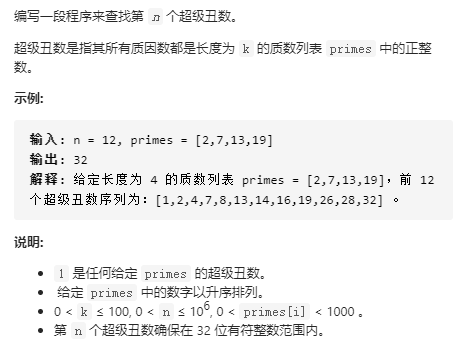

解决思路：采用最小堆来实现，每次从堆中弹出堆顶元素，并将该堆顶元素与primes中的元素依次相乘，并维持最小堆的性质，直到弹出的第k个元素即为所求。

```python
class Solution:
    def nthSuperUglyNumber(self, n: int, primes: List[int]) -> int:
        hea = [1]
        visit = set()
        visit.add(1)
        while n:
            cur = heapq.heappop(hea)
            n -= 1
            for pr in primes:
                if cur * pr not in visit:
                    heapq.heappush(hea, cur * pr)
                    visit.add(cur * pr)
                
        return cur
```

