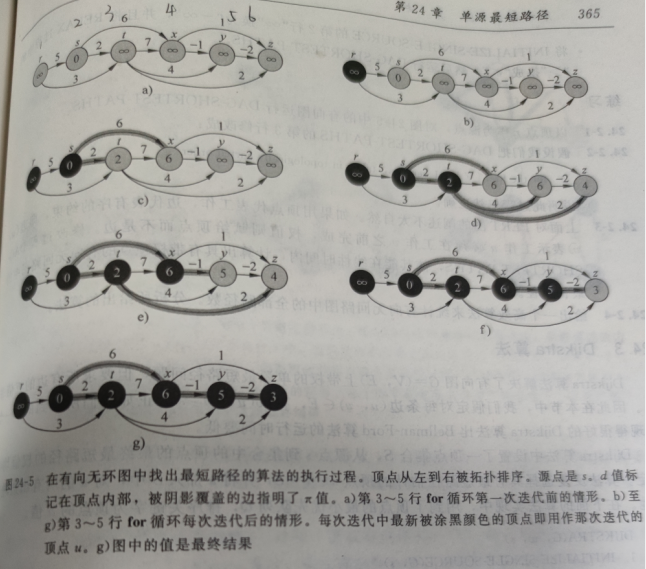
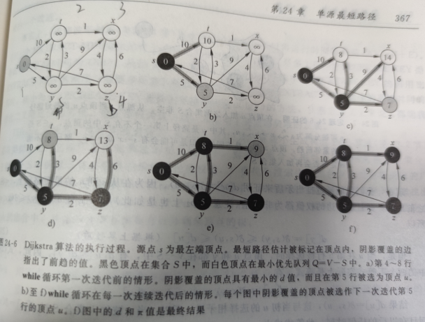

- [图算法](#---)
  * [1 图的基本算法](#1-------)
    + [广度优先搜索](#------)
    + [深度优先搜索](#------)
    + [拓扑排序](#----)
    + [强连通分支](#-----)
  * [2 最小生成树](#2------)
    + [Kruskal算法](#kruskal--)
    + [Prim算法](#prim--)
  * [3 单源最短路径](#3-------)
    + [Bellman-Ford算法](#bellman-ford--)
    + [拓扑排序解决 **有向无回路**中的单源最短路径](#------------------------)
    + [Dijkstra算法](#dijkstra--)
  * [4 每对顶点间的最短路径](#4-----------)
    + [Floyd-Warshall算法](#floyd-warshall--)
  * [5 赫夫曼编码](#5------)

# 图算法

该部分是<<算法导论>>图算法中的读书笔记，包括代码的实现。

## 1 图的基本算法

代码详细原理参考《算法导论》第二版书中第22章“图的基本算法”。

图$G=(V, E)$的表示有两种标准的方法，即邻接表和邻接矩阵。这两种方法既可以表示有向图，又可以表示无向图。通常采用邻接表表示稀疏图。当遇到稠密图时，一般采用邻接矩阵表示。


### 广度优先搜索

广度优先搜索是图的搜索算法之一，也是很多重要的图算法的原型，Prim最小生成树算法和Dijkstra算法都采用了广度优先搜索的思想。

广度优先搜索将每个点多着色为白色、灰色和黑色。

1. 白色：开始搜索前，所有的点都为白色，表示还未访问到该节点
2. 灰色：搜索中第一个碰到该顶点时，顶点颜色变为非白色，即灰色或黑色
3. 黑色：与黑色相邻的顶点所有顶点都被访问过，即与黑色相邻的所有顶点要么是灰色，要么是黑色

广度优先搜索构造了一颗广度优先搜索树，开始时只包含根顶点，即源顶点。在扫描某个已发现顶点u的邻接表时，每当发现一个白色顶点v，则该顶点v和边(u, v)就被添加到树中。


该图的广度优先算法实现如下：

```python
#图的广度优先搜索
#白色：white，灰色：gray, 黑色：black
from collections import deque
Graph = {1:[2, 5], 2:[1,6], 3:[4, 6, 7], 4:[3,7,8], 5:[1], 6:[2,3,7], 7:[3,4,6,8], 8:[4,7]}
color = {}
distance = {}
parent = {}

def BFS(G, s):
    for vertex in Graph:
        if vertex != s:
            color[vertex] = "white"
            distance[vertex] = "inf"
            parent[vertex] = "NIL"
    color[s] = "gray"
    distance[s] = 0
    parent[s] = "NIL"
    Q = deque()
    Q.append(s)
    while Q:
        u = Q.popleft()
        for v in Graph[u]:
            if color[v] == "white":
                color[v] = "gray"
                distance[v] = distance[u] + 1
                parent[v] = u
                Q.append(v)
        color[u] = "black"

#输出从s到v的最短路径上的所有顶点

def PRINT_PATH(G, s, v):
    if s == v:
        print(s)
    elif parent[v] == "NIL":
        print("no path from 's' to 'v'")
    else:
        PRINT_PATH(G,s,parent[v])
        print(v)
```


### 深度优先搜索

深度优先搜索遵循的搜索策略是尽可能“深”的搜索一个图。在深度优先搜索中，对于最新发现的顶点，如果它还有以此为起点而未探测到边，则沿此边继续探测下去。当顶点v的所有边都已被探寻过后，搜索将回溯到发现顶点v有起始点的那些边。这一过程一直进行到已发现从源顶点到达所有顶点时为止。如果还存在未被发现的顶点，则选择其中一个作为源顶点，并重复上述过程。直到所有顶点被发现时为止。

深度优先搜索会创建一个深度优先森林，并且同时为每个顶点加盖时间戳，每个顶点有两个时间戳：

1. d[v]:顶点v第一次被发现（并置成灰色）时，记录下第一个时间戳
2. f[v]:当结束检查v的邻接表时（并置为黑色），记录下第二个时间戳


上图的深度优先搜索代码：

```python
#图的深度优先搜索

G = {1:[2,4], 2:[5], 3:[5,6], 4:[2], 5:[4], 6:[6]}
color = {}
start = {}
end = {}
parent = {}
def DFS(G):
    for u in G:
        color[u] = "white"
        parent[u] = "NIL"
    global time
    time = 0
    for u in G:
        if color[u] == "white":      
            DFS_VISIT(u)

def DFS_VISIT(u):
    global time
    color[u] = "gray"
    time += 1
    start[u] = time
#     print("(", end = "")
#     print(u, end = "")
    for v in G[u]:
        if color[v] == "white":
            parent[v] = u
            DFS_VISIT(v)
    color[v] = "black"
    time += 1
    end[u] = time
#     print(u, end = "")
#     print(")", end = "")
```

在图G上进行深度优先搜索所产生的深度优先森林$G_\pi$，可以把图的边分为四种类型：

1. 树边：如果顶点v是在探寻边(u,v)时被首次发现的，那么(u,v)就是一条树边。
2. 反向边：连接顶点u到它的某一祖先顶点v的那些边。有向图中可能出现的自环也被认为是反向边
3. 正向边：连接顶点u到它某个后裔的非树边(u,v)
4. 交叉边：其他类型的边

对于每条边(u, v)，当该边被第一次探寻到时，根据锁到达顶点v的颜色。来对边进行区分：

1. 白色：是树边
2. 灰色：表示是反向边
3. 黑色：表明是正向边或交叉边


### 拓扑排序

运用深度优先搜索对有向无环路图进行拓扑排序。对有向无环图$G=(V,E)$进行拓扑排序后，结果为该图所有顶点的一个线性序列，满足如果G包含边(u,v)，则在该序列中，u就出现在v的前面。一个图的拓扑排序可以看成是图中所有顶点沿水平线排列而成的一个序列，使得所有的有向边均从左指向右。

主要思路是根据深度优先搜索过程后，将顶点按照顶点结束时间来进行逆向排序即可，即深度优先搜索最后结束的顶点应在拓扑排序的最前面。

```python
#有向无环图的拓扑排序
G = {1:[2,4], 2:[5], 3:[5,6], 4:[2], 5:[4], 6:[6]}

res = []
def TOPOLOGICAL_SORT(G):
    DFS(G)
    return res[::-1]

def DFS(G):
    for u in G:
        color[u] = "white"
        parent[u] = "NIL"
    global time
    time = 0
    for u in G:
        if color[u] == "white":
            DFS_VISIT(u)
            
def DFS_VISIT(u):
    global time
    color[u] = "gray"
    time += 1
    start[u] = time
    for v in G[u]:
        if color[v] == "white":
            parent[v] = u
            DFS_VISIT(v)
        elif color[v] == "gray":
            cycleflag = 1
            #表示有向图有环路， 此时不存在拓扑排序。
    color[u] = "black"
    time += 1
    end[u] = time
    res.append(u)

```


### 强连通分支

通过深度优先搜索来求解有向图的强连通分支。


```python
#有向图的强连通分支
G = {1:[2], 2:[3,5,6], 3:[4,7], 4:[3,8], 5:[1,6], 6:[7], 7:[6, 8], 8:[8]}

Gt = {}
#求解转置图
for u in G:
    Gt[u] = []
for u in G:
    for v in G[u]:
        Gt[v].append(u)

        
color = {}
start = {}
end = {}
parent = {}

SCC = []
def Strong_connect_component(G):
    global end_downsort
    DFS(G)
    end_downsort = sorted(end, key = lambda x:end[x], reverse = True)
    DFS_Gt(Gt)
    
    return SCC

def DFS(G):
    for u in G:
        color[u] = "white"
        parent[u] = "NIL"
    global time
    time = 0
    for u in G:
        if color[u] == "white":
            DFS_VISIT(u)

            
def DFS_VISIT(u):
    global time
    color[u] = "gray"
    time += 1
    start[u] = time
    for v in G[u]:
        if color[v] == "white":
            parent[v] = u
            DFS_VISIT(v)
    color[v] = "black"
    time += 1
    end[u] = time

    
def DFS_Gt(G):
    for u in G:
        color[u] = "white"
        parent[u] = "NIL"
    global time,end_downsort
    time = 0
    for u in end_downsort:
        if color[u] == "white":
            root = DFS_VISIT_Gt(G, u, [u])
            SCC.append(root)
def DFS_VISIT_Gt(G, u, tmp):
    global time
    color[u] = "gray"
    time += 1
    start[u] = time
    for v in G[u]:
        if color[v] == "white":
            parent[v] = u
            tmp += DFS_VISIT_Gt(G, v, [v])
            
    color[v] = "black"
    time += 1
    end[u] = time
    return tmp
```


## 2 最小生成树

代码详细原理参考《算法导论》第二版书中第23章“最小生成树”。

对于无向连通图$G=(V, E)$, 每条边对应一个权值，找出一个无回路的子集T属于E，它连接了所有的顶点，且其树中的权值和最小，则其是最小生成树。

### Kruskal算法

```python
#最小生成树  kruskal算法
G = {1:[2,8], 2:[1,3,8], 3:[2,4,6,9],4:[3,5,6],5:[4,6],6:[3,4,5,7],7:[6,8,9],8:[1,2,7,9], 9:[3,7,8]}
w = {(1,2):4, (2,1):4, (1,8):8, (8,1):8, (2,3):8, (3,2):8, (2,8):11,(8,2):11, (3,4):7, (4,3):7,(3,6):4,(6,3):4, (3,9):2, (9,3):2,
    (4, 5):9, (5,4):9, (4,6):14, (6,4):14, (5,6):10,(6,5):10, (6,7):2,(7,6):2,(7,8):1,(8,7):1,(7,9):6,(9,7):6,(8,9):7,(9,8):7}
#并查集
def make_set(x):
    p[x] = x
    rank[x] = 0

def Union(x, y):
    Link(Find_set(x), Find_set(y))

def Link(x, y):
    if rank[x] > rank[y]:
        p[y] = x
    else:
        p[x] = y
        if rank[x] == rank[y]:
            rank[y] = rank[x] + 1

def Find_set(x):
    if x != p[x]:
        p[x] = Find_set(p[x])
    return p[x]

p = {}
rank = {}
res = []
def mst_kruskal(G, w):
    for v in G:
        make_set(v)
    w_sort = sorted(w, key = lambda x:w[x])
    for u, v in w_sort:
        if Find_set(u) != Find_set(v):
            res.append((u,v))
            Union(u, v)
    return res
```


### Prim算法


```python
#最小生成树  prim算法
G = {1:[2,8], 2:[1,3,8], 3:[2,4,6,9],4:[3,5,6],5:[4,6],6:[3,4,5,7],7:[6,8,9],8:[1,2,7,9], 9:[3,7,8]}
w = {(1,2):4, (2,1):4, (1,8):8, (8,1):8, (2,3):8, (3,2):8, (2,8):11,(8,2):11, (3,4):7, (4,3):7,(3,6):4,(6,3):4, (3,9):2, (9,3):2,
    (4, 5):9, (5,4):9, (4,6):14, (6,4):14, (5,6):10,(6,5):10, (6,7):2,(7,6):2,(7,8):1,(8,7):1,(7,9):6,(9,7):6,(8,9):7,(9,8):7}


import heapq

key = {}
parent = {}
def mst_prim(G, w, r):
    for u in G:
        key[u] = 10 ** 5 #表示inf
        parent[u] = "NIL"
    
    key[r] = 0
    hea = [(key[r], r)]
    visit = set()
    while hea:
        curw, curver = heapq.heappop(hea)
        #print(curw,curver, hea)
        if curver in visit:
            continue
        visit.add(curver)
        for v in G[curver]:
            if v not in visit and w[(curver, v)] < key[v]:
                parent[v] = curver
                key[v] = w[(curver, v)]
                heapq.heappush(hea, (key[v], v))
    res = []
    for curver in parent:
        res.append((curver, parent[curver]))
    return res
                
```


## 3 单源最短路径

代码详细原理参考《算法导论》第二版书中第24章“单源最短路径”。

从给定图$G = (V, E)$, 从中找出某个给定源顶点s，到每个顶点v的最短路径，称之为单源最短路径。

本节的算法采用了松弛技术，对每个顶点v，都设置一个属性d[v]，用来描述从原点s到v的最短路径上权值的上界， 称为最短路径估计。本节中的算法，松弛是改变最短路径和前趋的唯一方式。

```python
def Initialize_single_source(G, s):
    for v in G:
        d[v] = 10 ** 5 #表示inf
        parent[v] = "NIL"
    d[s] = 0

def Relax(u, v, w):
    if d[v] > d[u] + w[(u, v)]:
        d[v] = d[u] + w[(u, v)]
        parent[v] = u
```


### Bellman-Ford算法

可以解决有向图中可以存在**负权边**和存在**回路**的单源最短路径问题。核心在于对所有的边都松弛$|V|$次。并且该算法可以**判断图中是否存在负权回路。**


```python
#单源最短路径

G = {1:[2,5], 2:[3,4,5], 3:[2], 4:[3,1], 5:[3, 4]}
w = {(1,2):6, (1,5):7, (2,3):5, (2,4):-4, (2,5):8, (3,2):-2, (4,1):2, (4,3):7,(5,3):-3, (5,4):9}

d = {}
parent = {}
def Initialize_single_source(G, s):
    for v in G:
        d[v] = 10 ** 5 #表示inf
        parent[v] = "NIL"
    d[s] = 0

def Relax(u, v, w):
    if d[v] > d[u] + w[(u, v)]:
        d[v] = d[u] + w[(u, v)]
        parent[v] = u
        
#Bellman-Ford算法 解决可以存在负权边的带权有向图问题，可以存在回路        
def Bellman_Ford(G, w, s):
    Initialize_single_source(G, s)
    Vnums = len(G)
    for _ in range(Vnums - 1): #路径松弛性质
        for u in G:
            for v in G[u]:
                Relax(u, v, w)
    
    for u in G:
        for v in G[u]:
            if d[v] > d[u] + w[(u, v)]:
                return False #图中存在负权回路
    return True

def PRINT_PATH(G, s, v):
    if s == v:
        print(s)
    elif parent[v] == "NIL":
        print("no path from 's' to 'v'")
    else:
        PRINT_PATH(G,s,parent[v])
        print(v)
```

### 拓扑排序解决 **有向无回路**中的单源最短路径

利用拓扑排序解决 **有向无回路**中的单源最短路径。对于无回路图，按照拓扑排序的顶点顺序依次松弛所有边即可。

该算法还可以解决**关键路径**问题，关键路径是指通过有向无回路图中的一条最长路径，它对应于执行一个有序的工作序列的最长时间。关键路径的权值是完成所有工作需要时间的下限，只需对原来图中的边权值取负值，并运行该算法即可。



```python
#单源最短路径,有向无回路图

G = {1:[2, 3], 2:[3,4],3:[4,5,6], 4:[5,6], 5:[6], 6:[]}
w = {(1, 2):5, (1,3):3, (2,3):2, (2,4):6, (3,4):7, (3,5):4, (3,6):2, (4,5):-1, (4,6):1, (5,6):-2}

d = {}
parent = {}
color = {}
start = {}
end = {}
def Initialize_single_source(G, s):
    for v in G:
        d[v] = 10 ** 5 #表示inf
        parent[v] = "NIL"
    d[s] = 0

def Relax(u, v, w):
    if d[v] > d[u] + w[(u, v)]:
        d[v] = d[u] + w[(u, v)]
        parent[v] = u

def Dag_shortest_paths(G, w, s):
    V_toposort = TOPOLOGICAL_SORT(G)
    Initialize_single_source(G, s)
    for u in V_toposort:
        for v in G[u]:
            Relax(u, v, w)
    
    
#有向无环图的拓扑排序
def TOPOLOGICAL_SORT(G):
    global res
    res = []
    DFS(G)
    return res[::-1]

def DFS(G):
    for u in G:
        color[u] = "white"
        parent[u] = "NIL"
    global time
    time = 0
    for u in G:
        if color[u] == "white":
            DFS_VISIT(u)
            
def DFS_VISIT(u):
    global time, res
    color[u] = "gray"
    time += 1
    start[u] = time
    for v in G[u]:
        if color[v] == "white":
            parent[v] = u
            DFS_VISIT(v)
        elif color[v] == "gray":
            pass
            #表示有向图有环路
    color[u] = "black"
    time += 1
    end[u] = time
    res.append(u)
```

### Dijkstra算法

解决有向图中 **权值非负**的单源最短路径问题。



```python
#单源最短路径, 权值非负 Dijkstra算法
import heapq
G = {1:[2,5], 2:[3,5], 3:[4], 4:[3,1], 5:[2,3, 4]}
w = {(1,2):10, (1,5):5, (2,3):1, (2,5):2, (3,4):4, (4,1):7, (4,3):6, (5,2):3,(5,3):9, (5,4):2}

d = {}
parent = {}

def Dijkstra(G, w, s):
    Initialize_single_source(G, s)
    S = set()
    
    Q = [(d[s], s)]
    while Q:
        du, u = heapq.heappop(Q)
        if u in S:
            continue
        S.add(u)
        for v in G[u]:
            if d[v] > d[u] + w[(u, v)]:
                d[v] = d[u] + w[(u, v)]
                parent[v] = u
                heapq.heappush(Q, (d[v], v))

def Initialize_single_source(G, s):
    for v in G:
        d[v] = 10 ** 5 #表示inf
        parent[v] = "NIL"
    d[s] = 0
    
   
```


## 4 每对顶点间的最短路径

代码详细原理参考《算法导论》第二版书中第25章“每对顶点间的最短路径”。


```python
#每对顶点间的最小路径 允许存在负权值的边 
# 动态规划算法1
W = [[0, 3, 8, float("inf"), -4], [float("inf"), 0, float("inf"), 1, 7], [float("inf"), 4, 0, float("inf"), float("inf")],
    [2, float("inf"), -5, 0, float("inf")], [float("inf"), float("inf"), float("inf"), 6, 0]]

def Extend_shortest_paths(L, W):
    n = len(L)
    Lnext = [[float("inf")] * n for _ in range(n)]
    for i in range(n):
        for j in range(n):
            for k in range(n):
                Lnext[i][j] = min(Lnext[i][j], L[i][k] + W[k][j])
    return Lnext

# O(n4)
def Slow_all_pairs_shortest_paths(W):
    n = len(W)
    L = [W]
    for i in range(1, n):
        L.append([])
        L[i] = Extend_shortest_paths(L[i-1], W)
    return L[-1]

#采用重复平方技术来改进 O(n3lgn)
def Faster_all_pairs_shortest_paths(W):
    n = len(W)
    L = {}
    L[1] = W
    m = 1
    while m < n:
        L[2 * m] = Extend_shortest_paths(L[m], L[m])
        m = 2 * m
    return L[m]
```


### Floyd-Warshall算法

允许有向图中存在权值为负的边。

```python
#Floyd-Warshall算法2 时间复杂度O(n3)

def Floyd_Warshall(W):
    n = len(W)
    D = [[[0] * n for _ in range(n)] for _ in range(n)]
    for k in range(n):
        for i in range(n):
            for j in range(n):
                if k == 0:
                    D[k][i][j] = min(W[i][j], W[i][k] + W[k][j])
                else:
                    D[k][i][j] = min(D[k-1][i][j], D[k-1][i][k] + D[k-1][k][j])

    return D[-1]         

#包含路径
def Floyd_Warshall_path(W):
    n = len(W)
    D = [[[0] * n for _ in range(n)] for _ in range(n)]
    parent = [[[0] * n for _ in range(n)] for _ in range(n)]
    parent0 = [[0] * n for _ in range(n)]
    for i in range(n):
        for j in range(n):
            if i == j or W[i][j] == float("inf"):
                parent0[i][j] = "NIL"
            else:
                parent0[i][j] = i
    for k in range(n):
        for i in range(n):
            for j in range(n):
                if k == 0:
                    if W[i][j] <= W[i][k] + W[k][j]:
                        D[k][i][j] = W[i][j]
                        parent[k][i][j] = parent0[i][j]
                    else:
                        D[k][i][j] = W[i][k] + W[k][j]
                        parent[k][i][j] = parent0[k][j]
                else:
                    if D[k-1][i][j] <= D[k-1][i][k] + D[k-1][k][j]:
                        D[k][i][j] = D[k-1][i][j]
                        parent[k][i][j] = parent[k-1][i][j]
                    else:
                        D[k][i][j] = D[k-1][i][k] + D[k-1][k][j]
                        parent[k][i][j] = parent[k-1][k][j]

    return D[-1], parent[-1] 

def Print_all_pairs_shortest_path(parent, i, j):
    if i == j:
        print(i)
    elif parent[i][j] == "NIL":
        print("no path from i to j")
    else:
        Print_all_pairs_shortest_path(parent, i, parent[i][j])
        print(j)
```

## 5 赫夫曼编码

代码详细原理参考《算法导论》第二版书中第16章“贪心算法”中赫夫曼编码部分。


实现代码如下：

```python
#贪心选择算法 Huffman编码
class Tree():
    def __init__(self, val):
        self.val = val
        self.left = None
        self.right = None

import heapq

C = {'f':5, 'e':9, 'c':12, 'b':13, 'd':16, 'a':45}
def Huffman(C):
    n = len(C)
    Q = []
    for key in C:
        Q.append((C[key], Tree(key)))
    for _ in range(n-1):
        fx, x = heapq.heappop(Q)
        fy, y = heapq.heappop(Q)
        z = Tree(fx + fy)
        z.left, z.right = x, y
        heapq.heappush(Q, (fx + fy, z))
    
    return Q #Q中是赫夫曼树的树根节点和根节点的频率[(froot, root)]
 from collections import deque

res = {}
#输入的root即为Q中的root
def Huffman_encode(root, path):
    if root == None:
        return
    if root.left == None and root.right == None:
        res[root.val] = [path]
        return
        
    if root.left:
        Huffman_encode(root.left, path + '0')
    if root.right:
        Huffman_encode(root.right, path + '1')  
```

