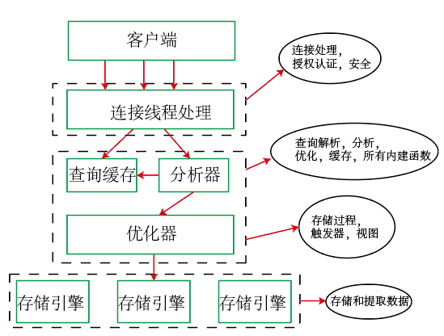
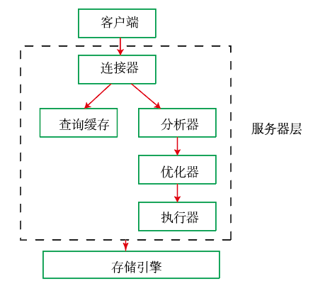
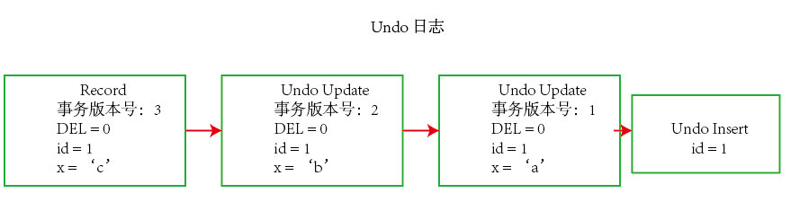
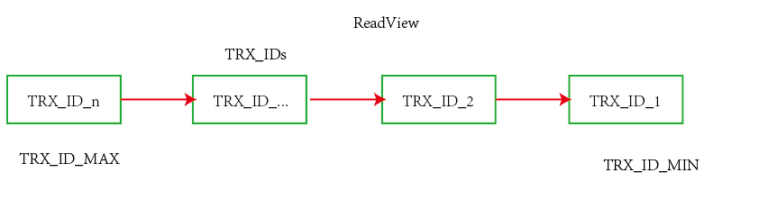

- [数据库系统原理](#-------)
  * [1.事务](#1--)
    
    + [MySQL数据库如何实现这4个特性？](#mysql--------4----)
  * [2. 并发一致性问题](#2--------)
  * [3. 锁](#3--)
  * [4. 隔离级别](#4-----)
  * [5. 多版本并发控制（MVCC）](#5---------mvcc-)
  * [6. 临键锁（记录锁+间隙锁）](#6-------------)
  
    

# 数据库系统原理


## 1.事务

事务指的是满足ACID特性的一组操作，可以通过COMMIT提交一个事务，也可以使用Rollback进行回滚。

ACID特性是原子性，一致性，隔离性和持久性。

1. 原子性：事务被视为不可分割的最小单元，事务的所有操作要么全部提交成功，要么全部失败回滚。
2. 一致性：数据库在事务执行前后都保持一致性状态。在一致性状态下，所有事务对同一个数据的读取结果都是相同的
3. 隔离性：一个事务所做的修改在提交之前，对其他事务是不可见的
4. 持久性：一旦事务被提交，则其所做的修改会永远保存到数据库中。即使系统发生崩溃，事务执行的结果也不能丢失。

一致性保证事务的执行结果是正确的，在没有并发进程的情况下，事务串行执行，隔离性一定能满足，此时保证原子性则一定能满足一致性。在并发的情况下，多个事务并行执行，事务不仅需要满足原子性，还需要满足隔离性，才能满足一致性，事务满足持久性是为了防止系统奔溃数据丢失。在MySQL中默认采用自动提交模式，也就是如果不采用$START TRANSACTION$语句来显示开启事务，则每个查询操作都会被当做一个事务并自动提交。

### MySQL数据库如何实现这4个特性？

1. **MySQL数据库逻辑架构和存储引擎**



MySQL服务器逻辑架构**分为三层**：

  1.  第一层：处理客户端连接、授权认证等
  2. 第二层：服务器层，负责查询语句的解析、优化、缓存和内置函数的实现、存储过程等
  3. 第三层：存储引擎，负责MySQL数据的存储和崎岖，**事务是由存储引擎实现的**，在MYSQL中支持事务的引擎有InnoDB等，不支持事务的存储引擎有Mylsam， Memory等。

**原子性的实现原理**：在MySQL日志中有很多种，如二进制日志、错误日志，查询日志和慢查询日志等。**InnoDB引擎**还提供了两种事务日志， **redo log（重做日志）和undo log**（回滚日志）等。其中 **重做日志**用来保证事务的**持久性**， **回滚日志**则是事务**原子性和隔离性**实现的基础。

​        当事务对数据库进行修改时，InnodB会生成对应的 **undo log**，如果事务执行失败或者调用rollback，导致事务需要回滚，便可以**利用undo log中的信息将数据回滚到修改**之前的样子。undo log属于逻辑日志，记录SQL执行相关的信息，当发生回滚时，InnoDB会根据undo log的内容做与之相反的工作，对于每个insert操作，回滚时会执行delete操作。

**持久性的实现原理**：InnoDB作为MySQL的存储引擎，数据是存放在磁盘中的，但如果每次读写数据都需要磁盘IO，效率会很低。因此，**InnoDB提供了缓存**，缓存中包含了磁盘中部分数据页的映射，作为访问数据库的缓冲，当从数据库中提取数据时，先从缓存中提取，如果缓存中没有，则会从磁盘读取放入到缓存中，向数据库写入数据，采用写回的方式，首先先将数据写入缓存，然后定期刷脏。 

缓存的使用大大的提高了读写数据的效率，但是如果MYSQL崩溃，则此时缓存的数据还没有刷脏，则会导致数据的丢失，无法保证持久性。因此引入 **redo log**，当数据修改时，除了修改缓存中的数据，还需要再 redo log中记录这次操作，用**fsync（）**接口强制**将redo log内容写进磁盘**，如果MYSQL崩溃，则可以读取redo log的内容进行恢复数据库的内容， redo log采用的是 **日志先行**的策略，所有数据修改先写入日志，再更新到缓存，保证了数据不会丢失。

**将redo log**写入磁盘比缓存中数据的修改直接写入磁盘的**好处**在于：

1. redo log的写入是顺序IO，而刷脏是随机IO，因为修改数据的位置是随机的
2. 刷脏每次都需要读取整个页，MYSQL中默认页的大小是16KB，而redo log只包含真正需要写入的部分，无效IO大大减少。


**redo log和bin log的比较**：二进制日志也可以记录操作并将用于数据的恢复，但是两种是有很大区别的。

1. 作用不同：重做日志是用于故障恢复的，二进制日志是基于时间点恢复数据，并且还可以用作主从复制
2. 层次不同： 重做日志是InnoDB引擎实现的， 而二进制日志是MYSQL的服务器层实现的，支持所有引擎
3. 内容不同：重做日志是物理日志，内容是基于磁盘的页，其内容是循环写的。而二进制日志的内容是二进制的，可能基于SQL语句、或者基于数据本身或者两者的混合，其内容是追加写的，不会覆盖之前的日志。
4. 写入时机不同：二进制日志在事务提交时写入磁盘中的日志文件， 重做日志可以每隔一定时机写入磁盘，也可以再事务提交时写入到磁盘中。

当在InnoDB引擎中执行更新语句的时，其内部流程的操作：



```sql
update T set c=c+1 where ID=2;
```

1. 执行器首先主键为id = 2这一行。因为ID是主键，引擎直接用树搜索找到该行。如果该行所在的数据页在内存中，则直接返回给执行器，否则，先从磁盘读入内存，然后再返回。
2. 执行器拿到引擎返回的行数据，将原来的行数据加1，再调用引擎写入这行数据
3. 引擎将这行数据更新到内存中，同时将这个记录更新到redo log中，此时**redo log处于准备状态**，然后告知执行器完成了，随时可以提交事务
4. 执行器生成这个操作的binlog，并把binlog写入磁盘
5. 执行器调用引擎的提交事务接口，引擎刚刚把写入的redo log改成提交状态，在空闲的时候落盘，更新完成。

redo log采用两阶段提交，来保证数据的一致性。

**隔离性的实现原理**：写操作对写操作的影响采用锁机制来保证隔离性， 写操作对读操作的影响，采用MVCC保证隔离性。

## 2. 并发一致性问题

在有多个进程并发操作的时候，隔离性容易受到破坏，因此会有并发一致性的问题，包括有：

1. **丢失修改**：一个事务的更新操作被另外一个事务的更新操作替换。比如事务$T1$修改数据$A$的值。$T1$先修改提交并生效，$T2$也随后修改，而此时$T2$的修改覆盖了$T1$的修改，因此对于事务$T1$而言，它的修改被丢失了。
2. **读脏数据**：在不同的事务下，当前事务可以读到另外事务未提交的数据。即$T2$事务读取到了$T1$事务正在修改但未提交的数据，如果$T1$撤销了这次修改，则$T2$读到的数据就是不存在的。
3. **不可重复读**：在一个事务内多次读取同一数据集合，在该事务读取过程尚未结束的时候，另一个事务对此数据集合做了修改，因此在一个事务内两次读取同一数据结合得到的结果却是不一致的。（同一个数据的值）
4. **幻影读**：在一个事务内多次读取某个范围内的数据，但是在读取的过程中，另外一个事务在这个范围内插入了新数据，此时，在同一个事务内读取的同一数据集合结果也是不同的。（同一个数据范围的值不同）

这些并发不一致性问题的产生主要是事务的隔离性没有得到保证。可以通过加锁操作保证事务访问的隔离性。


## 3. 锁

**锁粒度**：在MySQL中提供了两种粒度锁，一种是行级锁，另一种是表级锁。行级锁的粒度更小，在封锁的过程中应当尽量只锁定需要修改的那部分数据，锁定的数据越少，系统的并发性就可以更高，加锁需要消耗系统资源，会增加系统开销，并且封锁的粒度越小，系统开销越大。在选择不同的锁时候，要考虑封锁粒度和封锁开销之间的权衡。

**锁类型**：

1.**读写锁**

1. 互斥锁：X锁，也叫写锁，同一时刻只能保证使用一把写锁
2. 共享锁：S锁，也叫读锁，读锁与读锁之间是可以同时使用的

一个事务对数据A加了写锁，此时可以对数据进行读取和更新，其他的事务都不能对A加任何锁，即写锁与所有锁互斥

一个事务对数据A加了读锁，此时可以对数据进行读取操作，但是不能进行写操作，其他事务可以对其加读锁，不能加写锁。

2.**意向锁**

意向锁可以更容易的支持多粒度封锁。在采用行级锁和表锁的情况下，事务$T$想对表$A$加X锁，就需要先检测是否有其他事务对表A或者表A中的任意一行加了锁，此时就需要遍历表中的每一行，但是这开销是非常大的。因此通过 **意向锁**来解决这个问题。

意向锁增加意向写锁（$IX$锁）和意向读锁（$IS$锁）,它们的使用规定为：

1. 一个事务要获得某个**数据行对象的读锁**之前，必须先获得**表的IS锁**或者更强的锁
2. 一个事务要获得某个**数据行对象的写锁**之前，必须先获得**表的IX锁**

因此引入意向锁后，事务对数据表要加X锁时，需要先检测是否有其他事务对表加了 **X锁/IX锁/S锁/IS锁**，如果加了此时就不能再对该表添加X锁了，这时候只需要检查表的锁，而不需要遍历每一行来检测锁，因此锁的开销变小了。这四把锁的关系是，**X锁**与所有锁都互斥，**S锁与IX锁**互斥，其他锁相互之前都是可以同时使用的。要注意IX/IS锁只是表示想对表加锁，而没有真正加锁。该关系指的是表级锁之间的关系，而表级的IX锁与行级的X锁是兼容的，两个事务可以对两个数据行加锁。


**封锁协议**分为三级封锁协议和两段锁协议。

**三级封锁协议**：

1. 一级封锁协议：**事务$T$要修改数据A时必须加X锁**，直到T结束时才释放锁。此时可以解决 **丢失修改**问题，因为此时不会有两个事务同时对一个数据对象进行修改，因此事务的修改不会被覆盖。
2. 二级封锁协议：在一级封锁协议的基础上，**要求读取数据A时必须加S锁**，读取完**马上释放S锁**。此时可以解决**读取脏数据**的问题，因此在读取事务的过程中，此时已经有了S锁，因此另外的事务不可能获取到X锁来对该事务进行修改。
3. 三级封锁协议：在二级封锁协议的基础上，**要求读取数据A时必须加S锁，**事务结束时**才释放S锁**。此时可以解决 **不可重复读**的问题，因为在读取的过程中，另外的事务不可能加X锁来进行修改数据。

**两段锁协议**：加锁和解锁分为两个阶段进行。

通过**两段锁协议**可以保证并发执行事务的结果与某个串行过程执行的事务结果相同，即 **可串行化调度**。串行执行的事务互不干扰，不会出现并发一致性问题。事务遵循两段锁协议是保证可串行化调度的充分条件。

在MySQL中的**InnoDB存储引擎采用两段锁协议**，会根据隔离级别在需要的时候自动加锁，并且所有的锁在同一时刻被释放，这是**隐式锁定**。

同时也可以采用显示锁定，使用特定的语句来实现：

```SQL
SELECT ... LOCK In SHARE MODE;
SELECT ... FOR UPDATE;
```


## 4. 隔离级别

**未提交读**：事务中的修改，即使没有提交，对其他事务也是可见的，会出现 **脏读、不可重复读和幻影读问题**

**提交读**：一个事务只能读取已经提交的事务所做的修改，会出现 **不可重复读和幻影读**问题

**可重复读**：保证在同一个事务中多次读取同一数据的结果是一样的，会出现 **幻影读**问题

**可串行化**：强制事务串行执行，这样多个事务互不干扰，**不会出现并发一致性问题**。该隔离级别需要加锁来实现，使用加锁机制可以保证在同一时间只有一个事务执行，也就是保证事务串行执行。


## 5. 多版本并发控制（MVCC）

**多版本并发控制（MVCC）**是MySQL的**InnoDB存储引擎实现隔离级别的一种具体方式**，用于实现 **提交读和可重复读**这两种隔离级别。 而 **未提交读隔离级别**总是读取读取最新的数据行，不需使用MVCC。 **可串行化隔离级别**需要对所有读取的行都加锁，只使用MVCC无法实现。

**基本思想**：加锁可以解决多个事务同时执行时出现的并发一致性问题，而在实际场景中 **读操作往往多于写操作**，因此又引入读写锁来避免不必要的加锁操作，而MVCC利用多版本的思想， **写操作更新最新的新本快照**，**而读操作去读旧版本快照**，没有互斥关系。

在MVCC中事务的修改操作（删除，插入和更新）会为数据行新增一个版本快照。 **脏读和不可重复读** 的原因在于事务读取到其他事务未提交的修改。在事务进行读取操作时，为了解决 **脏读和不可重复读**问题， MVCC规定只能读取已经提交的快照，当然一个事务可以读取自身未提交的快照，这不算脏读。

**实现**：

1. **版本号**：系统版本号$SYS\_ID$: 是一个递增的数字，每开始一个新的事务，系统版本号会自动递增。 事务版本号$TRX\_ID$: 事务开始时的系统版本号。

2. **Undo日志**: MVCC的多版本指的是多个版本的快照， 快照存储在Undo日志中，该日志通过 **回滚指针**把一个数据行的所有的快照连接起来。例如在$MySQL$中

   创建一个表$t$，包含主键id和一个字段x。先插入一个数据行，然后对该数据行执行两次更新操作。

   ```sql
   INSERT INTO t(id, x) VALUES(1, "a");
   UPDATE t SET x="b" WHERE id=1;
   UPDATE t SET x="c" WHERE id=1;
   ```

   根据MySQL的机制，每个操作都会被当成一个事务来执行，所有上面的操作总共涉及到三个事务。快照中除了记录事务版本号外，还记录一个位的DEF删除标志，用于标记是否被删除。

   

执行完语句后，Undo日志表中如图所示，修改操作都会创建一个日志。

3. MVCC维护了一个ReadView结构，主要包含了**当前系统未提交的事务列表** TRX_IDs{TRX_ID_1, TRX_ID_2, ...}，还有该列表的最小值**TRX_ID_MIN和TRX_ID_MAX。**

   

在执行 **SELECT 操作**时，根据数据行快照的 **事务版本号（TRX_ID）**与 TRX_ID_MIN和TRX_ID_MAX之间的关系，从而来判断数据行快照是否可以使用：

1. **事务版本号（TRX_ID）** <  TRX_ID_MIN，表明该数据行快照是在**当前所有未提交事务之前**进行更改的，因此可以使用

2. **事务版本号（TRX_ID）** > TRX_ID_MAX, 表明该数据行快照是**在事务启动之后被更改的**，因此不可使用

3. TRX_ID_MIN  <= **事务版本号（TRX_ID）** <= TRX_ID_MAX, 此时需要根据隔离级别来进行判断：

   **提交读**：如果**事务版本号（TRX_ID）**在 **当前系统未提交的事务列表** TRX_IDs中，则表明该数据行快照对应的事务还没提交，则该快照不可使用，否则表示已经提交，可以使用

   **可重复读**：都不可以使用。若是可以使用，则其他事务也可以读到这个数据行快照来进行修改，那么当前事务再去读这个数据行得到的值就会发生改变，也就是出现了不可重复读问题。

4. 在数据行快照不可使用的情况下，需要沿着Undo Log的回滚指针找到下一个快照，再重述1-3步。


**快照读和当前读**：

1. **快照读**：MVCC的SELECT操作是快照中的数据，不需要进行加锁操作。

```SQL
SELECT * FROM table ...;
```

2. **当前读**：MVCC其他会对数据库进行修改的操作（插入、更新和删除）需要进行加锁操作，从而读取最新的数据。可以看到MVCC并不是完全不用加锁，而只是避免了SELECT的加锁操作。

```sql
INSERT； UPDATE； DELETE；
```

在进行SELECT操作时，可以强制指定进行加锁操作。

```sql
SELECT * FROM table ... WHERE ? lock in share mode; 加读锁
SELECT * FROM table ... WHERE ? lock for update; 加写锁
```


## 6. 临键锁（记录锁+间隙锁）

**临键锁**是MySQL的InnoDB储存引擎的一种锁实现。 MVCC不能解决 **幻影读**问题，临键锁就是为了解决这个问题。 在**可重复读的**隔离级别下，使用MVCC+临键锁可以**解决幻影读问题。**

**记录锁（行锁）**：锁定一个记录上的索引，而不是记录本身。如果表没有设置索引， InnoDB会自动在主键上创建隐藏的聚簇索引，因此记录锁仍然可以使用。

**间隙锁**：锁定索引之间的间隙，但是不包含索引本身。例如当一个事务执行以下语句，其他事务就不能在t.c之间插入15.

```SQL
SELECT c FROM t WHERE c BETWEEN 10 and 20 FOR UPDATE;
```

**临键锁**是 **行锁和间隙锁**的结合，不仅索引一个记录上的索引，并且锁住索引之间的间隙，它锁定**一个前开后闭区间**，例如索引包含10,11,13和20，则会锁定以下区间：

```SQL
(-∞, 10]
(10, 11]
(11, 13]
(13, 20]
(20, +∞)
```

