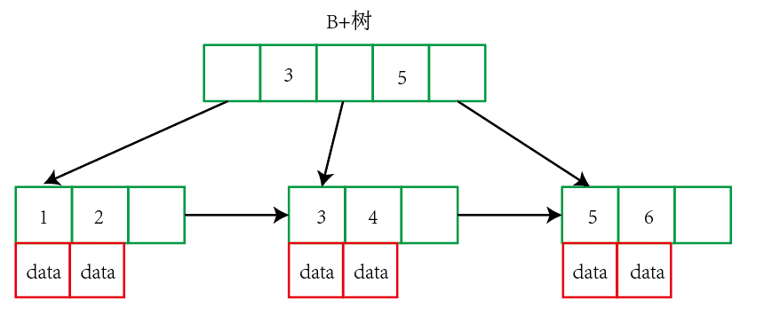
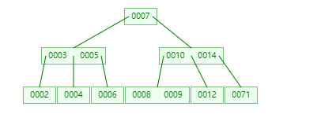
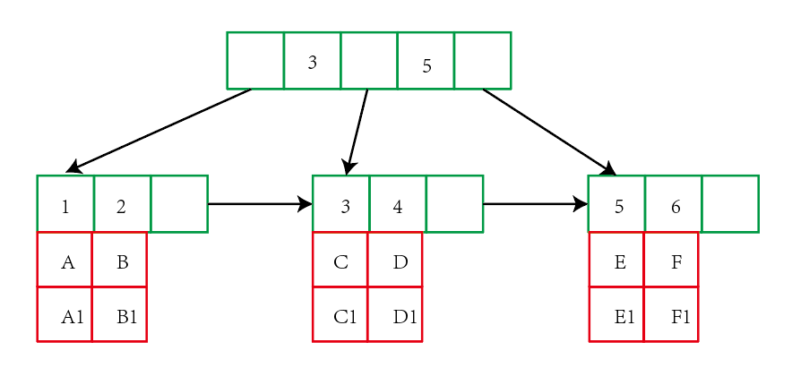
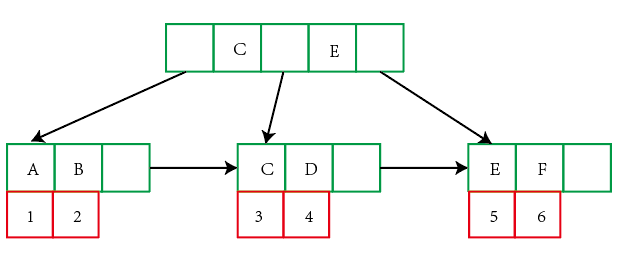
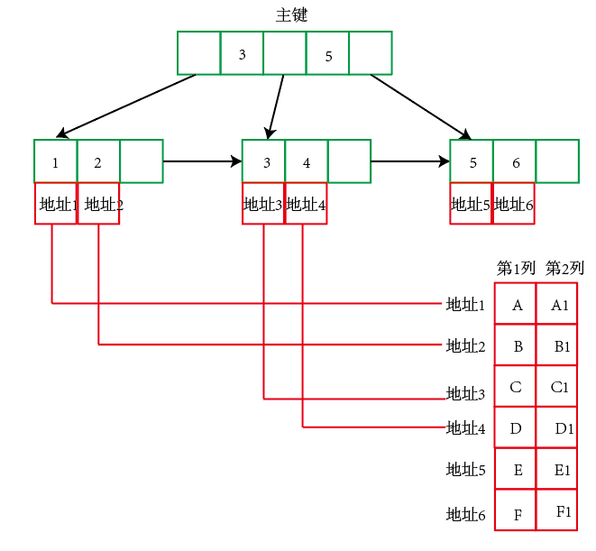
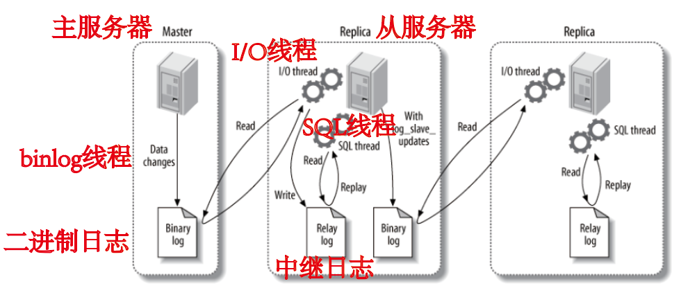

- [MySQL数据库](#mysql---)
  * [1.索引](#1--)
  * [2. MySQL索引](#2-mysql--)
  * [3. 存储引擎](#3-----)
  * [4. 日志](#4---)
  * [5. 复制](#5---)

# MySQL数据库


## 1.索引

### **B+树原理**

1. 数据结构：B+树是基于B树和叶子节点顺序访问指针实现，B树是一个平衡数，所有叶子节点位于同一层。B+树具有B树的平衡性，并且通过顺序访问指针来提高区间查询的性能，在B+树中，一个节点的**key从左到右非递减排列**。

   

2. 操作：进行**查找操作**时，首先在跟节点进行二分查找，找到一个key所在的指针，然后递归的在指针所指向的节点进行查找，直到查到叶子节点，然后在叶子节点上进行二分查找，找到key所对应的data。插入删除操作会破坏平衡树的平衡性，因此在进行插入删除操作后，需要对树进行分裂、合并和旋转等操作来维护平衡性。
3. B+树的优点：
   1. B+树的每个节点的出度比较大，因此树高更低，查找速度会更快。
   2. 磁盘访问原理：内存和磁盘交换以页为单位交换数据，因此数据库系统将索引的一个节点的大小设置为页的大小，使得一次I/O可以完全载入一个节点，并且可以最大化的利用页的内容。如果数据不在同一个磁盘块上，还需要进行寻道等操作，因此效率会降低，所以B+树页更适合磁盘数据的读取
   3. 磁盘预读特性：为了减少磁盘I/O操作，磁盘一般不是按需读取，而是会进行预读，因此在预读过程中，磁盘进行顺序读取，此时不需要进行寻道时间，而只需要旋转时间，因此速度会非常快，此时相邻的节点会被预先载入。

**平衡二叉树**：非叶子节点只能允许最多两个子节点存在，平衡的二叉搜索树，树的左右两边的层级数相差不会大于1，没有值相等的重复节点。

### **B树原理**

B树属于多叉树，也叫平衡多路查找树。规则是：

1. 所有节点关键字按照递增次序排序，遵循左小右大原则
2. 子节点数：非叶子节点的子节点数大于1，小于等于M(M>=2)。非根节点必须有M/2个关键字，**每个节点都存有索引和数据**（B+数的非叶子节点只保存索引）。
3. 所有叶子节点均在同一层，叶子节点除了包含关键字或关键字记录的指针外，也有指向其子节点的指针。

   **查询流程**：首先获取根节点的关键字进行比较，二分法查找，继续找其左子节点或右子节点，一路往下查询。



**其优点是**：与B+树比较时，如果经常访问的数据离根节点很近，则此时的数据检索速度更快。

**B+树**：与B树比较的优点：

1. 相比较于B树，B+树每个 **非叶子节点**存储的关键字数更多，树的层级更少，查询更快

2. 查询速度更加稳定，因为B+树的数据都在叶子节点上

3. 天然具备排序功能，B+树的所有叶子节点数据构成了一个有序链表，在查询大小区间的数据更加方便，数据紧凑型更高

4. 全节点遍历也更加快速，不需要像B树一样对每一层进行遍历，只需要遍历所有叶子节点即可

   

## 2. MySQL索引

索引是在存储引擎实现的，而不是在服务器层实现的，所以不同存储引擎具有不同的索引类型和实现。

### **1. B+树索引**

​        是大多数MySQL存储引擎的默认索引类型，因为不需要对表进行全表扫描，只需对树进行搜索即可，所以查找速度很快。由于**B+树的有序性**，除了用于查找，还可以用于排序和分组。可以指定多个列作为索引列，多个索引列共同组成键，适用于全键值、键值范围和键前缀查找，其中键前缀查找只适用于最左前缀查找，如果不是按照索引列的顺序进行查找，则无法使用索引（因为B+树的排序是按照索引来排序的）。

​        InnoDB的B+树索引分为**主索引和辅助索引**。主索引的叶子节点data于记录着完整的数据记录，这种索引方式称为**聚簇索引**。因为无法把一个数据行存放在两个不同的地方，所以一个表只能有一个聚簇索引。**聚集索引和非聚集索引的区别是表记录的排列顺序是否与索引的排列顺序一致**。

**主键和聚集索引的区别：**1.主键是用来保证表的实体完整性，一个表只能有一个主键约束，并且不接受空值，创建主键时，数据库引擎会自动为其建议唯一索引，如果表中不存在聚集索引，则将强制创建 **唯一的聚集索引**。2.聚集索引基于数据行的键值在表内排序和存储这些数据行。



​         辅助索引的叶子节点的data于记录着主键的值，因此在使用**辅助索引进行查找时，需要先找到主键值**，然后再到主索引中查找。



### 2.哈希索引

​        哈希索引能以O（1）的时间进行查找，但是失去了有序性，因此**无法用于排序和分组**，只支持精确查找，**无法用于部分查找和范围查找**。InnoDB存储引擎有一个特殊的功能叫“**自适应哈希索引**”，当某个索引值被使用的非常频繁时，会在B+树索引之上再建立一个哈希索引，这样就让B+树索引具有哈希索引的一些优点，可以进行快速的哈希查找。

### 3.全文索引

​      MyISAM存储引擎支持全文索引，用于查找文本中的关键字，而不是直接比较是否相等。全文索引采用倒排索引实现，记录着关键词到其所在文本的映射，InnoDB存储引擎在MySQL后续的版本中也得到支持

### 4.**空间索引**

​      MyISAM支持空间索引，主要用于地理空间数据类型


### **5. 索引优化**

1. **独立的列**：在进行查找时，**索引列不能是表达式的一部分，也不能是函数的参数**，否则无法使用索引。例如下面的查询不能使用id列的索引。

```SQL
SELECT id FROM student WHERE id + 1 = 5;
```

2. **多列索引**：在需要使用多个列作为条件进行查询时，使用**多列索引比使用多个单列索引性**能更好，将actor_id和film_id设置为多列索引更好。

```SQL
SELECT film_id, actor_ id FROM sakila.film_actor
WHERE actor_id = 1 AND film_id = 1;
```

3. **索引列的顺序**：**让选择性更强的索引列放在前面**。索引的选择性是指不重复的索引值和记录总数的比值。因为此时区分度更强，后续查询的数量就会减少。
4. **覆盖索引**：索引包含所有需要查询的字段的值，因为索引通常小于数据行的大小，只读索引能大大减少数据访问量。而且一些存储引擎（例如MyISAM）在内存中只缓存索引，而数据依赖于操作系统来缓存。因此只访问索引可以 不使用系统调用。

### **6.  索引优点**

1. 减少了服务器需要扫描的数据行数

2. 帮助服务器避免进行排序和分组，以及避免创建临时表。因为B+树索引本身是有序的，可以用于ORDER BY操作和GROUP BY操作，而临时表主要在上述操作过程建立，而不需要排序和分组，所以不需要创建临时表。

3. 将随机的I/O操作变为顺序I/O，因为B+树索引是有序的，会将相邻的数据都存储在一起。

   

### **7. 索引的使用条件**

1. 对于非常小的表、大部分情况下简单的全表扫描比建立索引更高效
2. 对于中到大型的表，索引就非常有效
3. 对于特大型的表，建立和维护索引的代价也会随之增长。


## 3. 存储引擎

### **InnoDB**

1. 该引擎是MySQL中默认的事务型存储引擎，只有在不需要支持事务时，才考虑使用其他引擎。
2. 实现了四个标准的隔离级别，默认情况下是可重复读，在可重复读的级别下，采用**多版本并发控制加临键锁来防止幻影读**。
3. 主索引是聚簇索引，在索引中保存了数据，从而避免直接读取磁盘，因此对查询性能有很大改进。
4. 支持行级锁和表级锁，支持外键，不保存表的具体行数，执行count命令时需要全表扫描，而MyISAM用一个变量保存了整个表的行数，执行count语句时只需要读取该变量即可，速度非常快。

### **MyISAM**

1. 设计简单，不支持事务。
2. 不支持行级锁，只能对整张表加锁，读取时会对需要读到的所有表加共享锁，写入时则对表加排他锁。但在表有读取操作的同时，也可以往表中插入新的记录，即并发插入，来减少表读写之间的竞争。
3. 在数据库崩溃时，可能会导致一些数据丢失。数据以文件的形式存储，数据的转移很方便。
4. 只缓存索引，不缓存数据
5. 读取速度快，占用资源少

**主键索引**：MyISAM引擎也使用B+树作为索引结果，但是叶子节点的data域**存放的是数据记录的地址**，而不是直接存放内容。



**辅助索引**：**MyISAM引擎的辅助索引与主键索引**没有任何区别，只是主索引要求关键字是唯一的，而辅助索引的key可以重复。

与InnoDB相比，该**辅助索引只需要检查一遍索引**即可，而在InnoDB中需要检查两遍索引（第一遍先找到主键，第二遍根据主键再检索）

### **Memory**

   数据库中的表如果使用Memory引擎，则称这个表为内存表。区别：

1. InnoDB引擎把数据放在主键索引上，其他索引上保存的是主键的id。而Memory引擎是把数据单独存放，**索引上保存数据位置**的组织形式。
2. InnoDB表的数据是有序存放的，而内存表的数据是按照写入顺序存放的
3. 内存表不支持行锁，**数据放在内存中**，在数据量可控的情况下，所需的临时表可以使用内存表


## 4. 日志

在MySQL中有六种日志文件，分别是**重做日志redo log，回滚日志undo log，二进制日志binlog，错误日志errorlog，慢查询日志slow query log，一般查询日志general log，中继日志。**

### **二进制日志**

主要是用来记录MySQL数据更新或潜在发生更新的SQL语句。**主要作用有**：

1. 复制：MySQL主从复制在主服务器端开启binlog，并将其传递给从服务器并回放来达到主从一致的目的
2. 数据恢复：通过特定的工具来恢复数据

**特点：**

1.  不会记录不修改数据的语句，比如select
2. 会重写日志中的密码，保证不会以明文出现
3. 写入时间：在事务提交的时候，数据库会把binlog cache写入binlog中，但并没有执行fsync操作，即只将文件内容写入OS缓存中，随后根据配置判断是否执行fsync

### 重做日志和回滚日志

来保证事务的四大特性，是InnoDB存储引擎的日志。

**重做日志**包括两部分，一是内存中的**重做日志缓冲**，是易失的，二是**重做日志文件**，是持久的。redo log记录事务操作的变化，记录的是数据修改之后的值，不管事务是否提交都会记录下来。当修改的数据页写入到磁盘后，重做日志的该区域就可以重复利用了。

**回滚日志**的两个作用是提供回滚和实现MVCC下的读。在数据修改的时候，不仅记录了redo，还记录了相对应的undo，当事务提交失败是，可以借助undolog进行回滚。undo log记录的是逻辑日志，会记录相反的SQL命令。undo log本身也会产生redo log，因为其本身也要持久性保护。

InnoDB完成一次更新操作的具体步骤：

1. 开启事务
2. 查询待更新的记录到内存，并加X锁
3. 记录undo log到内存buffer
4. 记录redo log到内存buffer
5. 更改内存中的数据记录
6. 提交事务，触发redo log刷盘
7. 记录 bin log
8. 事务结束

### 慢查询日志

记录在MySQL中查询时，响应时间超过阈值的语句。

## 5. 复制

**主从复制**：主要涉及binlog线性、I/O线程和SQL线程。

**binlog线程**：负责将主服务器上的数据更改写入二进制日志中。

**I/O线程**：负责从主服务器上读取二进制日志，并写入从服务器的中继日志（Relay log）

**SQL线程**：负责读取中继日志，解析出主服务器已经执行的数据更改并在从服务器中重放（Relay）。



**读写分离**：**主服务器处理写操作**以及实时性要求比较高的读操作，**而从服务器处理读操作**。读写分离性能高的原因在于：

1. 主从服务器负责各自的读和写，极大程度缓解了锁的争用
2. 从服务器可以使用MyISAM，提升查询性能
3. 增加冗余，提供可用性

读写分离常用带来方式来实现，代理服务器接收应用层传来的读写请求，然后决定转发到哪个服务器。