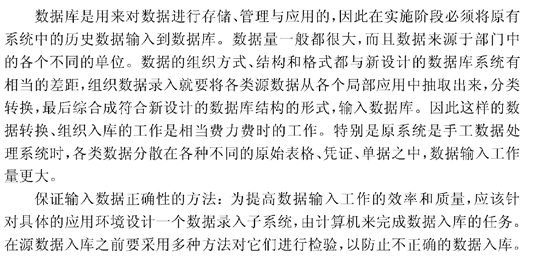

- [《数据库系统概论》（王珊、萨师煊）书籍课后作业](#-----------------------)
  * [第一章绪论作业](#----------)
  * [第二章关系数据库作业](#----------)
  * [第三章关系数据库标准语言作业](#--------------)
  * [第四章数据库安全性作业](#-----------)
  * [第五章数据库完整性作业](#-----------)
  * [第六章关系数据理论作业](#-----------)
  * [第七章数据库设计作业](#----------)

# 《数据库系统概论》（王珊、萨师煊）书籍课后作业

## **第一章绪论作业**

1.各概念的含义：

1. **数据**：描述事物的符号记录称为数据。数据的种类有数字、文字、图像、图形和声音等。数据与其语义是不可分的。
2. **数据库**：数据库是长期储存在计算机内的、有租住的、可共享的数据集合。数据库中的数据按一定的数据模型组织、描述和储存，具有较小的冗余度、较高的数据独立性和移扩展性，并为各种用户共享。
3. **数据库系统**：数据库系统是指在计算机系统中引入数据库后的系统构成，一般由数据库，数据库管理系统，应用系统、数据库管理员构成
4. 数据库管理系统：位于用户与操作系统之间的一层数据管理软件，用于科学的组织和存储数据。高效的维护数据和获取数据。DBMS的主要功能包括数据定义功能、数据操纵功能、数据库的运行管理功能等。

2.**文件系统面向某一应用程序，共享性差，**冗余度高，数据独立性差，记录内有结构，整体无结构，由应用程序自己控制。**数据库系统**面向现实世界，共享性高，冗余度小，具有较高的物理独立性和一定的逻辑独立性，整体结果化，用数据模型表示，有数据库管理系统提供数据的安全性、完整性、并发控制和恢复能力。

3.**数据的备份、软件或应用程序**的使用过程中的临时数据存储一般使用**文件系统**比较合适。 

4.数据库系统的特点：数据结构化，数据的共享性高，冗余度差，易扩充，数据的独立性高，数据由DBMS统一管理和控制 

5.**数据模型**是数据库中用来对现实世界进行抽象的工具，是数据库中用于提供信息表示和操作手段的形式构架。**数据模型通常由数据结构、数据操作和完整性约束构成。**

1. 数据结构： 是所研究对象类型的集合，是对系统静态特性的描述

2. 数据操作： 各种对象进行操作，系统动态特性的描述

3. 数据的约束条件：是一组完整性规则的集合

6.

1. 实体：客观存在并可以相互区分的事物叫实体

2. 实体型：具有相同属性的实体具有相同的特征和性质，用实体名及其属性名集合来抽象和刻画同类实体，称为实体型

3. 实体集：同型实体的集合

4. 属性：实体所具有的某一特性

5. 码：唯一标识实体的属性称为码

7.

1. 关系：一个关系对应通常说的一张表

2. 属性：表中的一列为一个属性

3. 域：属性的取值范围

4. 元组：表中的一行即为一个元组

5. 主码：表中的某个属性组，它可以唯一确定一个元组

6. 分量：元组中的一个属性值

7. 关系模式：对关系的描述，一般为关系名（属性1， 属性2， 属性3, …， 属性n）

8.关系数据模型**优点**：

1. 建立在严格的数学概念的基础上的

2. 关系模型的概念单一， 无论实体还是实体之间的联系都用关系表示，操作的对象和操作的结果都是关系，所以其数据结构简单，清晰，用户易懂易用

3. 关系模型的存取路径对用户透明，从而具有更高的数据独立性，更好的安全保密性

   **缺点**：查询效率不如非关系数据模型，因此为了提高性能，必须对用户的查询请求进行优化，增加了开发数据库管理系统的难度

9.数据库系统的三级模式结构由**外模式，模式和内模式组成**

1. 外模式：用户模式，是数据库用户能够看见和使用的局部数据的逻辑结构和特征的描述，是数据库用户的数据视图，是与某一应用有关的数据的逻辑表示

2. 模式：逻辑模式，是数据库中全体数据的逻辑结构和特征的描述，是所有用户的公共数据视图。模式描述的是数据的全局逻辑结构。外模式涉及数据的局部逻辑结构，是模式的子集

3. 内模式：存储模式，是数据在数据库系统内部的表示，即对数据的物理结构和存储方式的描述。 
4. 数据库在这三个模式之间提供了两层映像：外模式/模式映像和模式/内模式映像，正是这两个映像保证了数据库系统中的数据能够具有较高的逻辑独立性和物理独立性

10.

1. DDL: 数据定义语言，用来定义数据库模式、外模式、内模式的语言

2. DML: 数据操纵语言， 用来对数据库中的数据进行查询、插入、删除和修改的语句

11.

1. 数据与程序的**逻辑独立性**：当模式改变时，由数据库管理员对各个外模式/模式的映像做出相应的改变，可以时外模式保持不变，引用程序时根据外模式编写的，从而应用程序可以不必修改，保证了数据的逻辑独立性

2. 数据与程序的**物理独立性**：当数据库的存储结构改变了，只需改变模式/内模式映像，可以使得模式保持不变，从而应用程序也不必改变，保证了数据的物理独立性。

 

## 第二章关系数据库作业

1.**关系模型由关系数据结构，关系操作集合， 关系的完整性**约束三部分组成

2.关系数据语言可以分为三类

1. 关系代数语言

2. 关系演算语言：分为元组关系演算语言和域关系演算语言

3. 具有关系代数和关系演算双重特点的语言 例如SQL
4. 共同特点：具有完备的表达能力，是非过程化的操作语言，功能强，能够嵌入高级语言中使用

3.

1. 域： 域是一组具有相同数据类型的值的集合

2. 笛卡尔积： 给定一组域D1，…, Dn,这些域中可以有相同的。这组域的笛卡尔积为   

其中每一个元素$(d_1,d_2,...,d_n)$叫做一个n元组，元素中的每一个值叫做分量。

3. 关系：在域D1,..,Dn上的笛卡尔积的子集称之为关系

4. 元组：关系中的每个元素是关系中的元组

5. 属性：关系也是一个二维表， 表的每行对于一个元组，表的每列对应一个域，由于域可以相同，为了加以区分，对每列起一个名字，称为属性

6. 候选码：关系中的某一属性组的值能够唯一的确定一个元组，称该属性组为候选码

7. 主码：若一个关系总有多个候选码，则选定其中一个为主码

8. 外部码：F是基本关系R中的一个或一组属性，但不是R的码，如果F与基本关系S的主码K相对应，则称F是基本关系R的外部码，简称为外码。基本关系R是参照关系，S是被参照关系或目标关系，R和S 可以相同

9. 关系模式：关系的描述为关系模式，可以形式化的表述为

   

10. 关系：笛卡尔积的子集为关系$R(D_1,D_2,...,D_n)$。关系是关系模式在某一时刻的状态和内容。关系模式是静态的，稳定的，而关系式动态的，随时间不断变化的，因为关系操作在不断更新着数据库中的数据

11. 关系数据库：关系数据库有型和值之分，关系数据库的型也称为关系数据库模式，是对关系数据库的描述， 关系数据库的值是这些关系模式在某一时刻对应的关系的集合

 

4.关系模式的完整性规则是对关系的某种约束条件，分为实体完整性约束，参照完整性约束， 用户定义的完整性约束。实体完整性和参照完整性是关系模型必须满足的完整性约束条件，被称做是关系的两个不变性，应该由关系系统自动支持。

1. 实体完整性规则：属性A是基本关系R的主属性，则不能为空

2. 参照完整性规则： F是基本关系R的外码， 与基本关系S的主码K对应，则对于R中的每个元组在F上的值要么为空， 要么为S中某个元组的主码值

3. 用户定义的完整性：针对某一具体关系数据库的约束调点。

 

 

## 第三章关系数据库标准语言作业

1.SQL的特点：

1. 综合统一：SQL语言集数据定义语言DDL，数据操作操纵语言DML、数据控制语言DCL的功能于一体

2. 高度非过程化：用SQL语言进行数据操作，只要提出做什么，而无需指明怎么做，因此无需了解存取路径，存取路径的选择以及SQL语句的操作过程由系统自动完成

3. 面向集合的操作方式：SQL语言采用集合操作方式，不仅操作对象、查找结果可以是元组的集合，而且一次性插入、删除、更新操作的对象也可以是元组的集合。

4. 以同一种语法借给提供两种使用方式，SQL语言既是自含式语言，又是嵌入式语言，作为自含式语言，它能够独立地用于联机交互的使用方式，作为嵌入式语言，它能够嵌入到高级语言程序中去。

2.SQL的定义功能: SQL的数据定义功能包括定义表、定义视图和定义索引。

1. 使用CREATE TABLE语句建立基本表， ALTER TABLE语句修改基本表定义， DROP TABLE语句删除基本表。

2. CREATE INDEX 建立索引

3. DROP INDEX 删除索引

4. CREATE VIEW 建立视图

5. DROP VIEW 删除视图

3. **基本表**：基本表是本身独立存在的表，在SQL中一个关系就对应一个表。**视图**是从一个或几个基本表导出的表。视图本身不独立存储在数据库中，是一个虚表。数据库中只存放视图的定义而不存放视图对应的数据，这些数据仍然存在导出视图的基本表中。视图在概念上与基本表等同，用户可以如图基本表那样使用视图，可以在视图上再定义视图

4**.视图的优点**：

1. 视图能够简化用户的操作

2. 视图使用户能以多种角度看待同一数据

3. 视图对重构数据库提供了一定程度的逻辑独立性

4. 视图能够对机密数据提供安全保护

5.不是所有的视图都可以更新。视图是不实际存储数据的虚表，因此对视图的更新，最终需要转换为对基本表的更新。因为有些视图的更新不能唯一有意义地转变成对相应基本表的更新，所以，并不是所有的视图都是可更新的。

6.基本表的行列子集视图一般是可更新的。若视图的属性来自集函数、表达式，则该视图肯定是不可以更新的。

 

## 第四章数据库安全性作业

1.数据库的安全性是指保护数据库以防止不合法的使用所造成的数据泄露、更改和破坏.

2.安全性问题不是数据库系统所独有的，所有计算机系统都有这个问题。只是数据库系统中大量数据集中存放，而且为许多最终用户直接共享，从而使安全性问题更为突出。系统安全保护措施是否有效是数据库系统的主要指标之一。数据库的安全性和计算机系统的安全性，包括操作系统、网络系统的安全性是紧密联系。相互支持的

3.各个国家在计算机安全技术方面都建立了一套可信标准。目前各国引用或制定的一系列安全标准中，最重要的是美国国防部正式颁布的。 TDI/TCSEC标准是将TcsEc扩展到数据库管理系统。在TDI中定义了数据库管理系统的设计与实现中需满足和用以进行安全性级别评估的标准。TDI和TcsEC一样，从安全策略、等描述安全性级别划分的指标。

4.系统安全级别划分为4组7个等级的基本内容。依次是D，C（C1,C2）、B(B1,B2,B3),A(A1)

1. D级是最低级别，一切不符合更高标准的系统，统统归于D组

2. C1级只提供了非常初级的自主安全保护。能够实现用户和数据的分离，进行自主存取控制（DAC）,保护或限制用户权限的传播。

3. C2级实际是安全产生的最低档次，提供受控的存取保护，即将C1的DAC进一步细化，以个人身份注册负责，并实施审计和资源隔离

4. B1级标记安全保护。对系统的数据加以标记，并对标记的主体和客体实施强制存取控制（MAC）以及审计等安全机制

5. B2级结构化安全保护。建立形式化的安全策略模型并对系统内的所有主体和客体实施DAC和MAC。

6. B3级安全域 该级的TCB必须满足访问监控器的要求，审计跟踪能力更强，并提供系统的恢复过程

7. A1级验证设计 即提供B3级保护的同时给出系统的形式化设计说明和验证以确信各安全保护真正实现。

5.实现数据库安全性控制的常用方法和技术

1. 用户标识和鉴别：该方法由系统提供一定的方式让用户标识自己的名字或身份。每次用户要求进入系统时，由系统进行核对，通过鉴定后才提供系统的使用权

2. 存取控制：通过用户权限定义和合法权限检查确保只有合法权限的用户访问数据库，所有未被授权的人员无法存取数据。

3. 视图机制：为不同的用户定义视图，通过视图机制要把保密的数据对无权存取的用户隐藏起来，从而自动地对数据提供一定程序的安全保护

4. 审计:建立审计日志，把用户对数据库的所有操作自动记录下来放入审计日志中，DBA可以利用审计跟踪的信息，重现导致数据库现有状况的一系列事件，找出非法存取数据的人，时间和内容。

5. 数据加密： 对存储和传输的数据进行加密处理，从而使得不知道解密算法的人无法获取数据的内容。

6.什么是数据库中的**自主存取控制和强制存取控制**方法

1. 自主存取控制方法：定义各个用户对不同数据对象的存取权限。当用户对数据库访问时首先检查用户的存取权限。防止不合法用户的数据库的存取

2. 强制存取控制方法：每一个数据对象被强制的标以一定的密级，每一个用户也被强制地授予某一个级别的许可证。系统规定只有具有某一许可证级别的用户才能存取某一个密集的数据对象。

7.SQL语言中提供了GRANT和REVOKE语句来实现自主存取控制。

8.为什么强制存取控制提供了更高级别的数据库安全性。强制存取控制（MAC）是对数据本身进行密级标记，无论数据如何复制，标记与数据是一个不可分的整体，只有符合密级标记要求的用户才可以操纵数据，从而提供了更高级别的安全性。

9.理解并解释MAC机制中主体、客体、敏感度标记的含义

1. 主体是系统中的活动实体，既包括DBMS所管理的实际用户。也包括代表用户的各进程。

2. 客体是系统中的被动实体，是受主体操纵的，包括文件、基表、索引、视图等。对于主体和客体，DBMS为它们每个实例指派一个敏感度标记。

3. 敏感度标记被分成若干级别，例如绝密，机密，可信，公开等。主体的敏感度标记称为许可证级别，客体的敏感度标记称为密级。

10.MAC机制如何确定主体是否能存取客体的。

1. 仅当主体的许可证级别大于或等于客体的密级时，该主体才能读取相应的客体

2. 仅当主体的许可证级别等于客体的密级时，该主体才能写相应的客体

11.什么是数据库的审计功能，为什么要提供审计功能。审计功能是指DBMS的审计模块在用户对数据库执行操作的同时把所有操作自动记录到系统的审计日志中。因为任何系统的安全保护措施都不是完美无缺的，蓄意盗窃破坏数据的人总可能存在。利用数据库的审计功能，DBA可以根据审计跟踪的信息，重现导致数据库现有状况的一系列事件，找出非法存取数据的人，事件，内容。

12.统计数据库中存在何种特殊的安全问题。统计数据库允许用户查询聚集类型的信息，如合计、平均值、最大值，最小值等，不允许查询单个记录信息。但是，人们可以从合法的查询推导中推导出不合法的信息，即可能存在隐蔽的信息通道，这是统计数据库要研究和解决的特殊的安全性问题。

   

##  第五章数据库完整性作业

1.什么是数据库的完整性。数据库的完整性是指数据的正确性和相容性

2.数据库的完整性概念与数据库的安全性概念有什么区别和联系

1. **数据库的完整性和安全性**是两个不同的概念，但是有一定的联系。前者是为了防止数据库中存在不符合语义的函数，防止错误信息的输入和输出，即所谓垃圾进垃圾出所造成的无效操作和错误结果。
2. 后者是保护数据库防止恶意的破坏和非法的存取。也就是说，安全性措施的防范对象是非法用户和非法操作，完整性措施的防范对象是不合语义的数据。

3.什么是数据库的完整性约束条件。可分为哪几类？**实体完整性，参照完整性，用户自定义的完整性**

完整性约束条件是指数据库中的数据应该满足的语义约束条件。一般可分为6类；静态列级约束，静态元组约束，静态关系约束，动态列级约束，动态元组约束、动态关系约束。

  1.静态列级约束是对一个列的取值域的说明，包括以下几个方面：

1. 对数据类型的约束，包括数据的类型、长度、单位、精度等

2. 对数据格式的约束

3. 对取值范围或取值集合的约束

4. 对空值的约束

5. 其他约束。

  2.静态元组约束就是规定组成一个元组的各个列之间的约束关系，静态元组只局限在单个元组上。静态关系约束是在一个关系的各个元组之间或者若干关系之间常常存在各种联系或约束。

  3.常见的静态关系约束有： 

1. 实体完整性约束 
2. 参照完整性约束 
3. 函数依赖约束

  4.动态列级约束是修改列定义或列值时应满足的约束条件。包括以下两个方面：

1. 修改列定义的约束

2. 修改列值时的约束 

  5.动态元组约束是指修改某个元组的值需要参照其旧值，并且新旧值之间需要满足某种约束条件

  6.动态关系约束是加在关系变化前后状态上的限制条件，例如事物一致性，原子性等约束条件。

4.RDBMS的完整性控制机制应具有哪些功能

1. 定义功能 提供定义完整性约束条件的机制

2. 检查功能 提供完整性检查的方法

3. 违约处理 

**实体完整性**：主属性不能为空

1. 检查主码值是否唯一，不唯一则拒绝插入或修改

2. 检查主码的各个属性是否为空，有一个为空就拒绝插入或者修改

**参照完整性**：属性F是基本关系的外码，它与基本关系S的主码K对应，或为空或为S主码值。拒绝策略和级联操作，设置为空值，对于参照完整性，除了定义外码，还应该定义外码是否为空值。

5.RDBMS的**实现参照完整性需要考虑哪些方面**

1. 外码是否可以接受空值

2. 删除被参照关系的元组时考虑，是否是级联删除，受限删除，置空值删除

3. 修改关系中主码时，一般不能用UPDATA语句修改关系主码，而是先删除，再插入。

6.在关系系统中，当操作违反实体完整性，参照完整性和用户自定义的完整性约束条件时，一般是如何分别进行处理的。

1. 对于违反实体完整性和用户定义的完整性的操作一般都采用拒绝的方式进行处理。

2. 对于违反参照完整性的操作，并不都是简单地拒绝执行，有时要根据应用语义执行一些附加的操作，以保证数据库的正确性

 

## 第六章关系数据理论作业

1.理解并给出下列术语的定义。

## 函数依赖， 部分函数依赖， 完全函数依赖， 传递依赖，候选码、主码、外码，全码，1NF， 2NF， 3NF， BCNF，多值依赖、4NF

1. **函数依赖**：R（U）是一个关系模式，U是R的属性集合，X和Y是U的子集。对于R（U）的任意一个可能的关系r，在r中不存在两个元组，它们在x上的属性值相同，而在Y上的属性值不同。**则x函数确定Y**，或Y函数依赖于X，记作X->Y。
   1. 函数依赖是最基本的一种数据依赖，也是最重要的一种数据依赖。

​          2. 函数依赖是属性之间的一种联系，体现在属性值是否相等。X唯一确定Y   

​          3. 函数依赖反映了现实世界的一种语义

​          4. 函数依赖是指R任何时刻的一切关系均要满足的约束条件。

2. **完全函数依赖**：在R（u）中，如果X->Y,并且对于X的任何一个真子集X’，都有X’/-> Y, 则X->(F)Y, Y对X完全函数依赖，否则X->(P)Y, Y对X部分函数依赖

3. **传递依赖**：在R（U）中，如果X->Y,且Y不是X的子集（非平凡函数依赖），Y/->X, Y->Z，则称Z对X传递函数依赖。（也就是说从X->Y是单向传递的才符合））注意：如果Y->X, 则X<-->Y,则Z直接函数依赖于X

4. **候选码**、**主码**：设K为R<U,F>中的属性或属性集合，若K->(F)U,则K为R的候选码。若候选码多于一个，则选定其中的一个为主码。

5. **主属性**：包含在任何一个候选码中的属性

6. **非主属性**：不包含在任何码中的属性

7. **外码**：关系模式R中属性或属性组X并非R的码，但X是另一个关系模式的码，则称X是R的外部码，也称外码。

8. **全码**：整个属性组是码，称为全码

9. **1NF**：如果一个关系模式R的**所有属性都是不可分的基本数据项**，则R∈1NF，第一范式是对关系模式的最起码要求，不满足第一范式的数据库模式不能称为关系数据库。

10. **2NF**：若关系模式R∈1NF，并且每一个非**主属性都完全函数依赖于R的码**，则R属于2NF。

11. **3NF**：关系模式R<U,F>中若不存在这样的码X，属性组Y及非属性Z（Z不是Y的子集），使得X->Y,Y->Z成立，Y/->X,则称R<U,F>∈3NF

12. **BCNF**：关系模式R<U,F>∈1NF，若X->Y且Y不是X的子集时，X必含有码，则R<U,F>∈BCNF，也就是说关系模式R<U,F>中，若每一个决定因素都包含码，则R<U,F>属于BCNF。一个满足BCNF的关系模式有：所有非主属性对每一个码都是完全函数依赖。

    

13. 多值依赖：

    

14. **4NF**：关系模式R<U，F>属于1NF，如果对于R的每个非平凡多值依赖X->->Y，Y不是X的子集，X都含有码，则称R<U,F>∈4NF。

       1. 不允许有非平凡且非函数依赖的多值依赖
          2. 允许的非平凡多值依赖是函数依赖 

**即第一范式是属性不可分，第二范式是每个非主属性完全函数依赖于码，第三范式是非主属性不传递函数依赖于码**。

## 第七章数据库设计作业

1.数据库的设计过程: 六个阶段

1. 需求分析性

2. 概念结构设计

3. 逻辑结构设计

4. 数据库物理设计

5. 数据库实施

6. 数据库运行和维护

2.数据库设计过程中各个阶段上的设计描述

1. 需求分析：准确了解与分析用户需求（包括数据和处理）

2. 概念结构设计：通过对用户需求进行综合抽象归纳，形成一个独立于具体DBMS的概念模型

3. 逻辑结构设计：将概念结构转换为某个DBMS所支持的数据模型，并对其进行优化

4. 数据库物理设计：为逻辑数据模型选取一个最适合应用环境的物理结构（包括存储结构和存取方法）

5. 数据库实施：设计人员运用DBMS提供的数据语言、工具及宿主语言，根据逻辑设计和物理设计的结果建立数据库，编制和调试应用程序，组织数据入库，并进行试运行。

6. 数据库的运行和维护：在数据库系统运行过程中对其进行平阿基及、调整和修改。

3.数据库设计过程中结构设计部分形成的数据库模式。数据库结构设计的不同阶段形成数据库的各级模式，即：

1. 在概念设计阶段形成于独立机器特点，独立于各个DBMS产品的概念模式，在本篇中就是E-R图

2. 在逻辑设计阶段将E-R图转换成具体的数据库产品支持的数据模型，如关系模型，形成数据库逻辑模式，然后在基本表的基础上再建立必要的视图（View），形成数据的外模式

3. 在物理设计阶段，根据DBMS特点和处理的需要，进行物理存储安排，建立索引，形成数据库内模式。

4.数据库设计的主要特点：

1. 数据库建立是硬件、软件和干件（技术与管理的界面）的结合

2. 从软件设计的技术角度看，数据库设计应该和应用系统设计相结合，整个设计过程中要把结构设计和行为设计密切相结合。

5.需求分析阶段的设计目标是什么，调查内容是什么？

​     需求分析阶段的设计目标是通过详细调查世界要处理的对象，充分了解原系统工作概况，明确用户的各种需求，然后在此基础上确定新系统的功能。

调查的内容是“数据”和“处理”，即获得用户对数据库的如下要求：

1. 信息要求 用户需要从数据库获得信息的内容与性质，由信息要求可以导出数据要求，即在数据库需要存储哪些数据

2. 处理要求 用户要完成什么处理功能，对处理的响应时间有什么要求，处理方式是批处理还是联机处理

3. 安全性与完整性要求

6.数据字典是系统中各类数据描述的集合，数据字典的内容包括：

1. 数据项

2. 数据结构

3. 数据流

4. 数据存储

5. 处理过程

其中数据项是数据的最小组成单位，若干数据项可以组成一个数据结构，数据字典通过对数据项和数据结构的定义来描述数据流和数据存储的逻辑内容。

数据字典作用：数据字典是关于数据库中数据的买搜狐，在需求分析阶段建立，是下一步进行概念设计的基础，并在数据库设计模式过程中不断修改、充实和完善。

7.什么是数据库的概念结构，特点和设计策略。概念结构是信息世界的结构，即概念模型，主要特点：

1. 能真实、充分地反映现实世界结构，包括事物和事物之间的联系，能满足用户的数据对数据的处理要求。

2. 易于理解，从而可以用它和不熟悉计算机的用户交换意见，用户的积极参数是数据库设计成功的关键

3. 易于更改，当应用环境和应用要求改变时，容易对概念模型修改和扩充；

4. 易于向网状、层次等各种数据模型转换。

 概念结构的设计策略有：

1. 自顶向下：首先定义全局概念结构的框架，然后逐步细化

2. 自底向上: 首先定义各局部应用的概念结构，然后将其集成起来， 得到全局概念结构。

3. 逐步扩张: 首先定义最重要的核心概念解耦股股，然后向外扩充。以滚雪球的方式逐步生成其他概念结构，直至总体概念结构。

4. 混合策略 将自顶向下和自底向上结合，用自顶向下策略设计一个全局概念结构的框架，以其骨架集成由自底向上策略设计中设计的各局部概念结构。

8.什么是数据抽象。数据抽象是对实际的人，物。事进行人为处理，抽取关心得共同特性，忽略非本质的细节，并把这些特性用各种概念精确加以描述，这些概念组成了某种模型。三种常用的抽象：

1. 分类定义某一类概念作为现实世界中一组对象的模型，抽象了对象值和型的语义

   

2. 聚集定义某一类型的组成成分

   

   

3. 概括定义类型之间的一组子集联系，有继承性

   

9.数据库概念结构设计的重要性和设计步骤。重要性：数据库所涉及是整个数据库设计的关键，将在需求分析得到的应用首先抽象为概念结构，以此为各种数据模型的共同基础，从而能更好，更准确的用某一DBMS实现这些需求。设计步骤：最经常采用的是自底向上方法，该方法的设计步骤分为两步：

1. 抽象数据并设计局部视图

2. 集成局部视图，得到全局的概念结构

10. 什么是E-R图，构成E-R图的基本要素是什么？E-R图为实体-联系图，提供了表示实体型、属性和联系的方法，用来描述显示世界的概念模型。

构成E-R图的基本要素是实体型，属性和联系，其表示方法为：

1. 实体型：用矩阵表示，矩形框内写明实体名

2. 属性：用椭圆形表示，并用无向边将其与相应的实体联系起来

3. 联系 用菱形表述，菱形框内写明联系名，并用无向边分别与有关实体连接起来，同时在无向边旁标上联系的类型（1:1,1:n或m:n）

11.为什么要视图集成？视图集成的方法是什么？

​     在对数据库系统进行概念较高设计时，一般采用自底向上的方法，把繁杂的大系统分解为小系统。首先设计各个子系统的局部视图，然后通过视图集成的方式将各子系统的局部视图有级融合起来，综合成一个系统的总视图。这样，设计清晰，由减到繁。由于数据库系统是从整体角度看待和描述数据的，因此数据不再面向某个应用而是整个系统。因此必须进行视图集成，使得数据库能被全系统的多个用户，多个应用共享使用。视图集成的方式：

1. 多个分E-R图一次集成

2. 逐步集成，用累加的方式一次集成两个分E-R图

   无论采用哪种方式，每次集成E-R图都需要分两步走：

1. 合并，解决个分E-R图之间的冲高图，将各分E-R图合并起来生成初步E-R图

2. 修改和重构， 消除不必要的冗余，生成基本E-R图。

 

11.什么是数据库的逻辑结构设计。数据库的逻辑结构设计就是把概念结构设计阶段设计好的基本E-R图转换为与选用的DBMS产品所支持的数据模型相符合的逻辑结构。设计步骤：

1. 将概念结构转换为一般的关系，网状，层次mox

2. 将转换来的关系、网状、层次模型向特定DBMS支持下的数据模型转换

3. 对数据模型进行优化

12.两个关系库数据库的各个关系模式都只有一个码，且都是唯一决定的因素，所以都属于BCNF，不会产生更新异常现象

13.规范化理论对数据库设计有什么指导设计。规范化理论为数据库设计人员判断关系模式的优劣提供了理论标准，可用以指导关系数据库模型的优化，用来预测模式可能出现的问题，为设计人员提供了自动产生各种模式的算法工具，使数据库设计工作有了严格的理论基础。

14 数据库物理设计的内容和步骤。数据库在物理设备上的存储结构与存取方法称为数据库的物理结构，它依赖于给定的DBMS。为一个给定的逻辑数据模型选取一个最适合应用要求的物理结构，就是数据库的物理设计的主要内容。设计步骤：

1. 确定数据库的物理结构，在关系数据库中主要指存取方法和存储结构

2. 对物理结构进行评价，评价的重点是时间效率和空间效率。

 **DBMS常用存取方法：索引方法：**

1. B+树索引方法

2. 经典存取方法，使用最普遍

选择索引存取方法的一般规则：

1. 属性在查询中经常出现，建立索引

2. 属性经常作为最大值和最小值等聚集函数的参数，建立索引

3. 属性经常在连接操作的连接条件出现，建立索引

额外开销：

1. 维护索引的开销

2. 查找索引的开销

**聚簇方法**：为提高查询速度，把属性（聚簇码）上具有相同值的元组集中存放在连续的物理块称为聚簇。

优点：

1 大大提高按聚簇码进行查询的效率

2 节省存储空间

聚簇以后，聚簇码相同的元组集中在一起了，因此聚簇码值不必爱每个元组中重复存储，只要在一组中存放一次。

 局限性：

1. 聚簇只能提高某些特定应用的性能

2. 建立和维护聚簇的开销相当大

 使用范围：

1. 既适用于单个关系独立聚簇，也适用于多个关系组合聚簇.

    

2. 当通过聚簇码进行访问或连接是该关系的主要应用，与聚簇码无关的其他访问很少或者次要时，可以使用聚簇。

   

设计候选聚簇：

1. 经常一起进行连接操作的关系可以建立聚簇

2. 一个关系的一组属性经常出现在相等比较条件时，则该单个关系可建立聚簇

3. 一个属性上的值重复率很高，则可建立聚簇，即对应每个聚簇码值的平均元组数不太少。

**HASH方法：**

1. 该关系的属性主要出现在等值连接条件中或主要出现在相等比较选择条件中

2. 该关系的大小可预知，而且不变，或 该关系的大小动态改变，但所选用的DBMS提供了动态HASH存取方法。

可选择HASH存取方法

 

16 数据输入在实施阶段的重要性是什么，如何保证输入数据的正确性

 

 

17.数据库的再组织和重构造，为什么要进行再组织和重构造

数据库的再组织是指：按原设计要求重新安排存储位置、回收垃圾，减少指针链等，以提高系统性能

数据库的重构造是指部分修改数据库的模式和内模式，即修改原设计的逻辑和物理结构。数据库的再组织是不修改数据库的模式和内模式的。

原因：

1. 数据库在运行一段时间后，不断增删改会时数据库的物理存储情况变坏，降低了数据的储存效率，数据库的性能下降，这时DBA就要对数据库进行重组织。

2. 数据库应用环境常常发生变化，如实体间的联系发生变化，增加新的应用实体，使得原有的数据库设计不能满足新的需求，需要调整数据库的模式和内模式。这就是进行数据库重构造。

