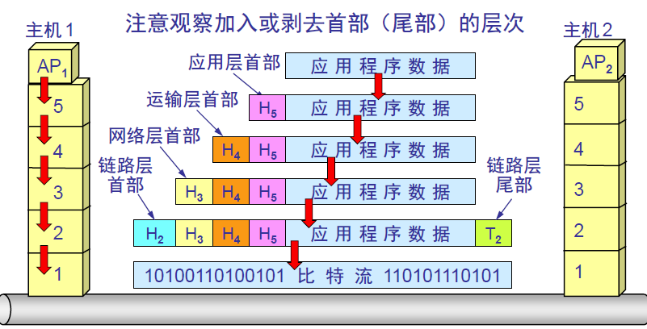

# 计算机网络-概述

## 网络的网络

网络把主机连接起来，而互联网是把多种不同的网络连接起来，因此互联网是网络的网络，而互联网是全球范围的互联网。

## 互联网提供者ISP

互联网提供商ISP可以从互联网管理机构获得许多IP地址，同时拥有通信线路以及路由器等联网设备，个人或机构向ISP缴纳费用就可以接入互联网。

目前的互联网是一种多层次的ISP机构，ISP根据IP地址数目的不同，分为不同的层次。

## 主机之间的通信方式

**客户-服务器（C/S）方式**：客户和服务器都是指通信中所涉及的两个用户进程。客户是服务的请求方，服务器是请求的提供方。

1. 客户端：客户程序必须知道服务器程序的地址，不需要特殊的硬件和很复杂的操作系统
2. 服务端：启动后一直不断的运行，被动的等待并接受来自各个的客户端的通信请求，服务端不需要知道客户端的地址，一般需要强大的硬件和高级的操作系统的支持

**对等（peer-to-peer）方式**：不区分哪一个是服务请求方还是服务提供方。双方都可以下载对方已经存储在硬盘中的共享文档

## 电路交换和分组交换

**电路交换**：用于电话通信系统，两个用户要通信之前需要建立一条**专用的物理链路**，并且整个通信过程中始终占用该链路。由于通信的过程不可能一直在使用传输线路，因此电路交换对线路的利用率低。

**分组交换**：在发送端，先把较长的报文 **划分成较短的、固定长度的数据报**。在每一个数据段前面**加上首部构成分组**。分组交换网以 **分组**作为数据传输单元，依次把分组发送到接收端。

每个分组都有首部，**包含了源地址和目的地址等控制信息**，分组交换网中的结点交换机（**路由器**）根据收到的分组的首部中的 **地址信息**，把分组**转发**到下一个结点交换机。用这样的 **存储转发**（在一个邮局通信系统中，邮局收到一份邮件后，先存储下来，然后把相同目的地邮件一起转发到下一个目的地，该过程就是存储转发过程）方式，最后分组能够到达目的地。

**分组交换的优点**：

1. 高效：在同一个传输线路上同时传输多个分组互相不会影响
2. 灵活：以分组为传送单位和查找路由
3. 迅速：不必先建立连接就能向其他主机发送分组
4. 可靠：分布式的路由选择协议使网络具有很好的生存性

**分组交换的问题**：

1. 分组在各结点存储转发时需要**排队**，会造成**一定的时延**
2. 分组必须携带首部，造成一定的**开销**

## 计算机网络的性能指标

1. **速率**：即数据率或比特率，单位是b/s。
2. **带宽**：本来是指信号具有的频带宽度，现在是指 **数字信道所能传送的 “最高数据率”**，单位是 比特每秒，b/s。
3. **吞吐量**：单位时间内通过某个网络（或信道、接口）的数据量
4. **时延**：总时延：排队时延+处理时延+传输时延+传播时延
   1. 排队时延：分组在路由器的输入队列和输出队列中排队等待的时间，取决**于网络当前的通信量**
   2. 处理时延：主机或路由器收到分组时，为**存储转发时**进行处理所需要的时间，例如分析首部、从分组中提取数据、进行差错检验或查找适当的路由等
   3. 传输时延：主机或路由器**传输数据帧**所需要的时间，即从发送数据帧的第一个比特到最后一个比特发送完毕时所需要的时间。
   4. 传播时延：电磁波在**信道中传播**所需要花费的时间，电磁波传播的速度接近光速

## 计算机网络体系结构

综合OSP和TCP/IP的优点，采用五层协议的体系结构。

**1.五层协议**

1. 应用层：为特定应用程序提供数据传输服务，例如HTTP、DNS等协议。数据单位为报文。
2. 传输层：为进程提供通用数据传输服务。由于应用层协议很多，定义通用的传输层协议就可以支持不断增多的应用层协议。运输层包括两种协议：传输控制协议TCP和用户数据报协议。TCP主要提供完整性服务，UDP主要提供及时向服务。
3. 网络层：为主机提供数据传输服务。而传输层协议是为主机中的进程提供数据传输服务。网络层把传输层传递下来的报文段或者用户数据报封装成组
4. 数据链路层：网络层针对的是主机之间的数据服务，而主机之间可以有很多链路，而链路层协议就是为同一链路的主机提供数据传输服务。数据链路层把网络层传下来的分组封装成帧。
5. 物理层：考虑如何在传输媒介上传输数据比特流，而不是指具体的传输媒体。物理层的作用就是尽可能屏蔽传输媒体和通信手段的差异，使得链路层感觉不出这些差异

**2.OSI**

1. 表示层：数据压缩、加密以及数据描述，这使得应用程序不必关心在各台主机中数据内部格式不同的问题
2. 会话层：建立及管理会话

五层协议没有表示层和会话层，将这些功能留给应用程序开发者处理。

**3.TCP/IP**

它只有四层，相当于将五层协议中数据链路层和物理层合并为网络接口层。

TCP/IP体系结构不严谨遵循OSI分层概念，应用层可能会直接使用IP层或者网络接口层。

**4 数据在各层之间的传递过程**

在向下的过程中，需要添加下层协议所需要的首部或者尾部，而在向上的过程中不断拆开首部和尾部。路由器只有下面三层协议，因为路由器位于网络核心中，不需要为进程或者应用程序提供服务，因此就不需要传输层和引用层。

