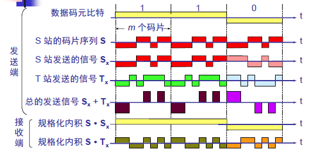

- [计算机网络-物理层](#---------)
  * [通信方式](#----)
  * [带通调制（载波调制）](#----------)
  * [信道复用技术](#------)
    + [1 频分复用](#1-----)
    + [2 时分复用](#2-----)
    + [3 统计时分复用](#3-------)
    + [4 波分复用](#4-----)
    + [5 码分复用](#5-----)

# 计算机网络-物理层

物理层的主要任务描述为确定与传输媒体的接口的一些特性，包括机械特性、电气特性、功能特性等。

## 通信方式

根据信息在传输线上的方向，分为以下三种通信方式：

1. **单工通信**：单向传输
2. **半双工通信**：双向交替传输
3. **全双工通信**：双向同时传输

## 带通调制（载波调制）

**基带信号**：信源的信号，例如计算机输出的代表各种文字或图像文件的数据信号都属于基带信号。包含有较多的低频成分，甚至有直流成分，而许多信道不能传输这种低频成分。因此必须对基带信号进行 **调制**。

**带通信号**：把基带信号经过载波调制后，把信号的频率范围搬移到较高的频段以便在信道中传输。

**基本的调制方法**：调幅、调频、调相

模拟信号是连续的信号，数字信号是离散的信号。带通调制把数字信号转换为模拟信号。

## 信道复用技术

### 1 频分复用

频分复用的所有主机在相同的时间**占用不同的频率带宽**资源。

### 2 时分复用

时分复用的所有主机在不同的时间内占用相同的频率带宽资源。将时间划分为一段段等长的 **时分复用帧（TDM帧）**

使用频分复用和时分复用进行通信，在通信的过程中主机会一直占用一部分信道资源。但是由于计算机数据的突发性质，通信过程没必要一直占用信道资源而不让给其他用户使用，因此这两种方式对信道的利用率都不高。

### 3 统计时分复用

对时分复用的一种改进，不固定每个用户在时分复用帧中的位置，只要有数据就集中起来组成统计时分复用帧然后发送。**统计时分复用帧（STDM）**中包含每个用户的数据数量是可以不同的。

### 4 波分复用

光的频分复用。由于光的频率很高，因此习惯上用波长而不是频率表示所使用的光载波。

### 5 码分复用

各用户使用经过特殊挑选的不同码型，彼此不会造成干扰。每一个比特时间划分为m个短的间隔，称为 **码片。** 为每个用户分配 m bit的码片，并且**所有的码片正交**，对于任意的两个码片 $\overrightarrow{S}$和$\overrightarrow{T}$，有
$$
\frac{1}{m}\overrightarrow{S}\cdot\overrightarrow{T}=0
$$
当取m=8时，设码片$\overrightarrow{S}$为0001 1011。在拥有该码片的用户发送**比特1时就发送该码片**，发送**比特0时就发送该码片的反码**$\overrightarrow{S'}$1110 0100。在计算时将0001 1011记作{-1 -1 -1 +1 +1 -1 +1 +1}，可以得到：
$$
\frac{1}{m}\overrightarrow{S}\cdot\overrightarrow{S}=1
$$

$$
\frac{1}{m}\overrightarrow{S}\cdot\overrightarrow{S'}=0
$$

由上式可以知道，当接收端使用码片$\overrightarrow{S}$对接收到的数据进行内积运算时，结果为0的是其他用户发送的数据，结果为1的数据是用户发送的比特1，结果为-1的是用户发送的比特0。

码分复用需要**发送的数据量为原先的m倍**。

