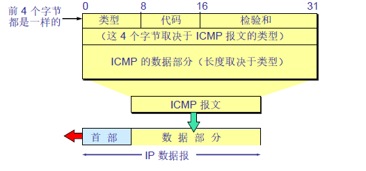

- [计算机网络-网络层](#---------)
  * [概述](#--)
  * [IP数据报格式](#ip-----)
  * [IP地址编址方式](#ip------)
    + [1.分类的IP地址](#1---ip--)
    + [2.子网划分](#2----)
    + [3.无分类编址](#3-----)
  * [地址解析协议ARP](#------arp)
  * [网际控制报文协议ICMP](#--------icmp)
    + [1.Ping](#1ping)
    + [2.Traceroute（路由跟踪）](#2traceroute------)
  * [网际组管理协议IGMP](#-------igmp)
  * [虚拟专用网](#-----)
  * [网络地址转换NAT](#------nat)
  * [路由器结构](#-----)
  * [路由器分组转发流程](#---------)
  * [路由选择协议](#------)
      - [1.内部网关协议RIP](#1------rip)
      - [2.内部网关协议OSPF（开放最短路径优先）](#2------ospf----------)
      - [3.外部网关协议BGF](#3------bgf)

# 计算机网络-网络层

## 概述

因为网络层是整个互联网的核心，因此应当尽量让网络层尽可能简单。网络层向上只能提**供简单灵活的、无连接的、尽最大努力交互的数据报服务**。**使用IP协议**，可以把异构的物理网络连接起来，使得在网络层看起来好像是一个统一的网络。

网际协议IP是TCP/IP体系中两个最主要的协议之一，与IP协议配套使用的还有四个协议：

1. 地址解析协议ARP（Address Resolution Protocol）
2. 地址逆解析协议RARP（Reverse Address Resolution Protocol）
3. 网际控制报文协议ICMP（Internet Control Message Protocol）
4. 网际组管理协议IGMP（Internet Group Management Protocol）

## IP数据报格式

1. 版本：有4（IPv4）和6（IPv6）两个值
2. 首部长度：占4位，因此最大值为15。值为1表示的是1个32位字的长度，也就是4字节。因为固定部分长度为20字节，因此该值最小为5。如果可选字段的长度不是4字节的整数倍，就用尾部的填充部分来填充
3. 区分服务：用来获得更好的服务，一般情况下不使用
4. 总长度：包括首部长度和数据部分长度
5. 生存时间：TTL，它的存在就是为了防止无法交互的数据报在互联网中不断兜圈子。以路由器跳数为单位，当TTL为0时就丢弃数据报
6. 协议：指出携带的数据应该上交给哪个协议进行处理，例如ICMP、TCP、UDP等
7. 首部校验和：因为数据报每经过一个路由器，都要重新计算校验和，因此检验和不包含数据部分可以减少计算工作量
8. 标识：在数据报长度过长从而发生分片的情况下，相同的数据报的不同的分片具有相同的标识符
9. 片偏移：和标识符一起，用于发生分片的情况下。片偏移的单位为8字节。

## IP地址编址方式

IP地址就是给每**个连接在因特网上的主机（或路由器）分配一个在全世界范围内唯一的32位标识符**。IP地址的编址方式经历了三个历史阶段：

1. 分类的IP地址
2. 子网划分
3. 无分类编址

### 1.分类的IP地址

每一类地址都由两部分组成，**网络号（标识主机或路由器所连接到的网络）和主机号（标识该主机或路由器）**。其中不同分类具有不同的网络号长度，并且是固定的。

IP地址$::=\{<网络号>，<主机号>\}$

**优点：**

1. IP地址管理机构在分配IP地址时只分配网络号即可，而主机号由得到该网络号的单位自行分配
2. 路由器仅根据目的主机所连接的网络号来转发分组，这样就可以使路由表表中的项目数大幅度减少，减少了路由表所占的存储空间。

### 2.子网划分

通过在主机号字段中国拿一部分作为子网号，把两级IP地址划分为三级IP地址。

IP地址$::=\{<网络号>，<子网号>,<主机号>\}$

要使用子网，必须配置子网掩码。一个B类地址的默认子网掩码为255.255.0.0，如果B类地址的子网站两个比特，那么子网掩码为11111111

11111111 11000000 00000000，也就会255.255.192.0。

注意，**外部网络看不到子网的存在。**

### 3.无分类编址

无分类编址CIDR消除了传统A类、B类和C类地址以及子网划分的概念，使用网络前缀和主机号来对IP地址进行编码，**网络前缀的长度可以根据需要变化**（A、B、C类的网络前缀地址是固定的。）。

IP地址$::=\{<网络前缀号>，<主机号>\}$

CIDR的记法上采用在IP地址后面加上网络前缀长度的方法，例如128.14.35.7/20表示前20位为网络前缀，该地址块共有$2^{12}$个地址

CIDR的地址掩码可以继续成为子网掩码，子网掩码首1长度为网络前缀的长度。

一个CIDR的地址块中有很多地址，一个CIDR表示的网络就可以表示原来的很多个网络，并且在路由表中只需要一个路由就可以代替原来的多个路由，减少了路由表项的数量。把这种通过使用网络前缀来减少路由表项的方式称为路由聚合，也称为 **构成超网**。

在路由表中的项目由“**网络前缀”和“下一跳地址**”组成，在查找时可能会得到不止一个匹配结果，应当采用**最长前缀匹配**来确定应该匹配哪一个。

## 地址解析协议ARP

网络层实现主机之间的通信，而**链路层实现具体每段链路之间**的通信。因此在通信过程中，**IP数据报的源地址和目的地址始终不变**。而**MAC地址随着链路的改变而改变。**不管网络层使用什么协议，在实际网络的链路上传送数据帧时，最终还是必须使用硬件地址。

ARP实现由IP地址得到MAC地址。ARP是解决**同一个局域网上**的**主机或路由器**的IP地址和硬件地址的映射问题。因为IP地址的主机号标识特定主机，因此可以实现该映射。若该主机不在同一个局域网，则映射到对应的路由器，返回路由器的硬件地址。

1. 每个主机都有一个**ARP高速缓存**，里面有本局域网上的各主机和和理由器的**IP地址到MAC地址的映射表**。

2. 如果主机A知道B的IP地址，但是ARP高速缓存没有该IP地址到MAC地址的映射，此时主机A**通过广播的方式发送ARP请求分组**，主机B收到该请求后会发送ARP响应分组给主机A告知其MAC地址，随后主机A向其高速缓存中**写入主机B的IP地址到MAC地址的映射。**

为什么不直接用硬件地址进行通信：

1. 全世界存在着各式各样的网络，它们使用不同的硬件地址。要使得这些异构网络能够互相通信，就必须进行复杂的硬件地址转换工作。
2. 连接到因特网的主机都有统一的IP地址，它们之间的通信就像在连接在同一个网络上一样简单方便，调用ARP来寻找路由器或主机的硬件地址都是由计算机软件自动进行的，对用户是透明的。

## 网际控制报文协议ICMP

ICMP是为了更有效的**转发IP数据报和提高交付成功**的机会。ICMP允许主机或路由器报告差错情况和提供有关异常情况的报告。它封装在IP数据报中，但是不属于高层协议。

ICMP报文分**为差错报告报文**和**询问报文**。

**ICMP差错报告报文的数据字段的内容**：

### 1.Ping

Ping 是ICMP的一个重要应用，主要用来测试两台主机之间的连通性。使用了**ICMP回送请求与回送回答**报文。是应用层直接使用网络层ICMP的例子，没有通过运输层的TCP和UDP。Ping的原理是通过**向目的主机发送ICMP 回送请求**报文，目的主机收到之后会发送**回送回答报文**。Ping会根据时间和成功响应的次数估计数据包往返时间以及丢包率。

### 2.Traceroute（路由跟踪）

Traceroute是ICMP的另一个应用，用来**跟踪一个分组从源点到终点的路径**。Traceroute发送的IP数据报封装的是**无法交付的UDP用户数据报**，并由目的主机发送终点不可达差错报告报文。

1. 源主机向目的主机发送一连串的IP数据报。第一个数据报P1的生存时间TTL设置为1，当P1到达路径上的第一个路由器R1时，R1收下它并把TTL减1，此时TTL等于0。R1就把P1丢弃，并向源主机发送一个**ICMP时间超过差错时间**报文。
2. 源主机接着发送第二个数据报P2，并把TTL设置为2。P2先到达R1，R1收下后把TTL减1再转发给R2，R2收下后也把TTL减1，由于此时TTL等于0，R2就丢弃P2，并向源主机发送一个ICMP时间超过差错报文。
3. 不断执行这样的步骤，直到最后一个数据报刚刚到达目的主机，主机不转发数据，也不把TTL值减1。但是因为数据报封装的是无法交互的UDP，因此目的主机要向源主机发送**ICMP终点不可达差错报告**报文。
4. 之后源主机知道了到达**目的主机所经过的路由器的IP地址以及到达每个路由器**的往返时间

## 网际组管理协议IGMP

利用IGMP来使路由器知道多播组成员的信息。IGMP协议是让连接在本地局域网上的多播路由器知道本局域网是否有主机参加或退出了某个多播组。

## 虚拟专用网

由于IP地址的紧缺，一个机构能申请到的IP地址往往远远小于本机构所拥有的的主机数。并且一个机构并不需要把所有的主机连接到外部的互联网中，机构内的计算机可以使用仅在本机构内有效的IP地址（专用地址），**专用地址只能用作本地地址，只能用于机构的内部通信**。

有三个专用地址块：

1. 10.0.0.0-10.255.255.255
2. 172.16.0.0-172.31.255.255
3. 192.168.0.0-192.168.255.255

VPN是使用公用的互联网作为本机构各专用网之间的通信载体。专用指机构内的主机只与本机构内的其他主机通信；虚拟指好像是但是实际上并不经过公用的互联网。

场所A和B的通信经过互联网，如果场所A的主机X要和另一场所B的主机Y通信，IP数据报的源地址是10.1.0.1,目的地址是10.2.0.3。数据报先发送到与互联网相连的路由器R1，R1对内部数据进行加密，然后重新加上数据报的首部，源地址是路由器R1的全球地址125.1.2.3，目的地址是路由器R2 的全球地址194.4.5.6。路由器R2收到数据报后将数据进行解密，恢复原来的数据报，此时目的地址还10.2.0.3，就交付给Y。

## 网络地址转换NAT

专用网内部的主机**使用本地IP地址又想和互联网上的主机通信**时，可以使用**NAT来将本地IP地址转为全球IP地址**。

网络地址转换的过程：

1. 内部主机X用本地地址IPx必和因特网网的主机Y通信时，必须经过NAT路由器。
2. NAT路由器将数据报的源地址IPx转换成全球地址IPg，但目的地址IPy保存不变，然后发送到因特网
3. NAT路由器收到主机Y发回的数据报时，知道数据报中的源地址是IPy，而目的地址是IPg
4. 根据NAT转换表，NAT路由器将目的地址IPg转换为IPx，转发给最终的内部主机X

## 路由器结构

路由器从功能上可以划分为：路由选择和分组转发

分组转发结构由三个部分组成：交换结构、一组输入端口和一组输出端口。

## 路由器分组转发流程

1. 从IP数据报的首部提取目的主机IP地址D，得到目的网络地址N（若是有子网划分，则需要将网络地址与子网掩码进行与运算，得到新的“网络地址”）
2. 若N就是与此路由器直接相连的某个网络地址，则进行**直接交付**
3. 若路由表中有到达目的地址为D的特定主机路由，则把数据报传送给路由表**所指明的下一跳路由器**
4. 若路由表中有一**个默认路由**，则把数据报传送给路由表中所指明的下一跳路由器
5. 报告转发分组出错

## 路由选择协议

路由选择协议是自适应的，能随着网络通信量和拓扑结构的变化而自适应的进行调整。互联网可以划分为许多较小的自治系统AS，**一个AS可以使用一种和别的AS不同的路由选择协议。**

可以把**路由选择协议分为两大类**：

1. 自治系统内部的路由选择：RIP和OSPF
2. 自治系统之间的路由选择：BGP

#### 1.内部网关协议RIP

RIP是一种**基于距离向量**的路由选择协议。距离是指跳数，直接相连的路由器跳数为1。跳数最多为15，超过15表示不可达。RIP协议要求网络中的**每一个路由器都要维护从它自己到其他每一个目的网络的距离记录。**RIP按**固定的时间间隔**仅和**相邻路由器**交换自己的路由表，经过若干次交换后，所有路由器最终会知道到达本自治系统中任何一个网络的最短距离和下一跳路由器地址。

距离向量算法：

1. 对地址为X的相邻路由器发来的RIP报文，先修改报文中的所有项目，把下一跳字段中的地址改为X，并把所有的距离字段加1

2. 对修改后的RIP报文中的每一个项目，进行以下步骤：

   1. 若原来的路由表**没有目的网络N，则把该项目添加到路由表中**

   2. 否则：若下一跳路由器地址是X，则把收到的项目替换为原来路由表中的项目；否则：若收到的项目中的距离d小于路由表中的距离，则进行更新；否则什么页不做

3. 若3分钟还没有收到相邻路由器的更新路由表，则把该相邻路由器标为不可达，即把距离置为16

RIP协议实现简单，开销小。但是RIP能使用的最大距离为15，限制了网络的规模。并且**当网络出现故障时，要经过比较长的时间才能将此消息传送到所有路由器**。

#### 2.内部网关协议OSPF（开放最短路径优先）

开放最短路径优先OSPF，是为了克服RIP的缺点而开发出来的。开放表示OSPF不受某一家厂商的控制，而是公开发表的；最短路径优先表示采用了Dijkstra提出的最短路径算法SPF。OSPF直接用IP数据报传送，这样可以减少路由信息的通信量。

OSPF具有以下特点：

1. 向**本自治系统中的所有路由器**发送消息，这种方法称为洪范法
2. 发送的信息就是与相邻路由器的链路状态，链路状态包括哪些路由器以及链路的度量，度量用费用、距离和时延、带宽来表示。
3. 只有**当链路状态发生变化时，路由器才会发送信息**

所有路由器都具有全网的拓扑结构图，并且是一致的。相比于RIP，OSPF的**更新过程收敛更快**，并且可以将通信量分配给多条路径，实现负载均衡。

#### 3.外部网关协议BGF

BGP（边界网关协议），AS之间的路由选择很困难，主要是由于：

1. 互联网规模很大
2. 每个AS内部使用不同的路由选择协议，无法准确定义路径的度量
3. AS之间的路由选择必须考虑有关的策略，有的AS不愿意让其他AS经过

BGP只能寻找一条比较好的路由，而不是最佳路由。**每个AS都必须配置BGP发言人**，通过在两个相邻BGP发言人之间建立TCP连接来交换路由信息。

