# 计算机网络

##  传输层

传输层提供了进程间的逻辑通信，传输层向高层用户屏蔽了下面网络层的核心细节，使得应用程序看起来像是在两个传输层实体之间有一条端到端的逻辑通信信道。传输层的两个主要协议是**UDP（User Datagram Protocol）和TCP（Transmission Control Protocol）**。

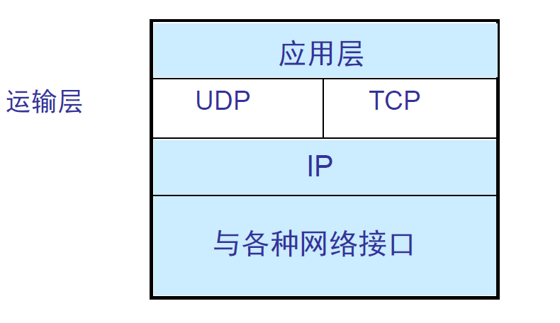

### **UDP和TCP特点**：

1. **用户数据报协议UDP**是无连接的，尽最大可能交互，没有拥塞控制，**面向报文**（对于应用程序传下来的报文不合并也不拆分，只是添加UDP首部），支持一对一、**一对多、多对一和多对多的交互通信**，UDP的首部开销小，只有8个字节。对方的传输层收到UDP报文后，不需要给出任何确认。
2. **传输控制协议TCP**是面向连接的，提供可靠交互，有流量控制、拥塞控制，提供**全双工通信**，**面向字节流**（把应用层传下来的报文看成字节流，把字节流组织成大小不等的数据块），每一条TCP连接只能是点对点的，不提供广播或多播服务。

### UDP首部格式

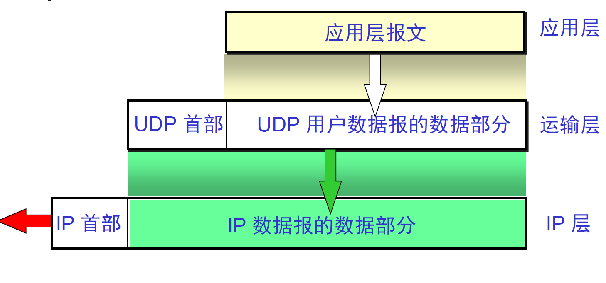

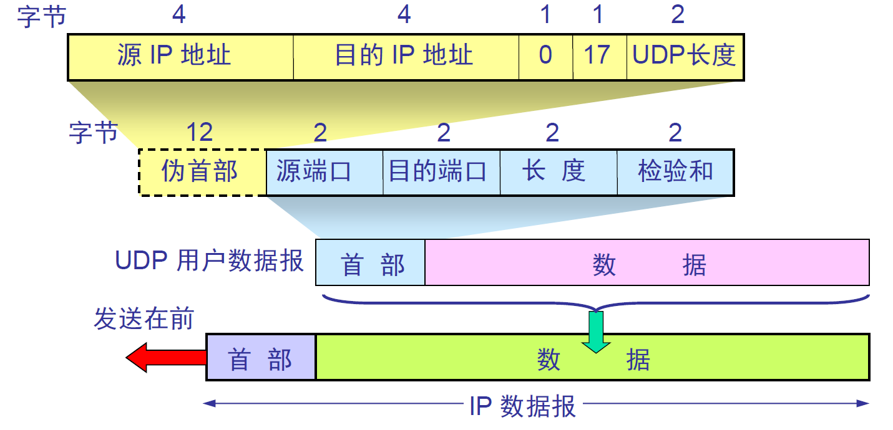

发送方UDP对应用程序交下来的报文，在添加首部后就向下交付IP层。伪首部仅仅是为了计算校验和。

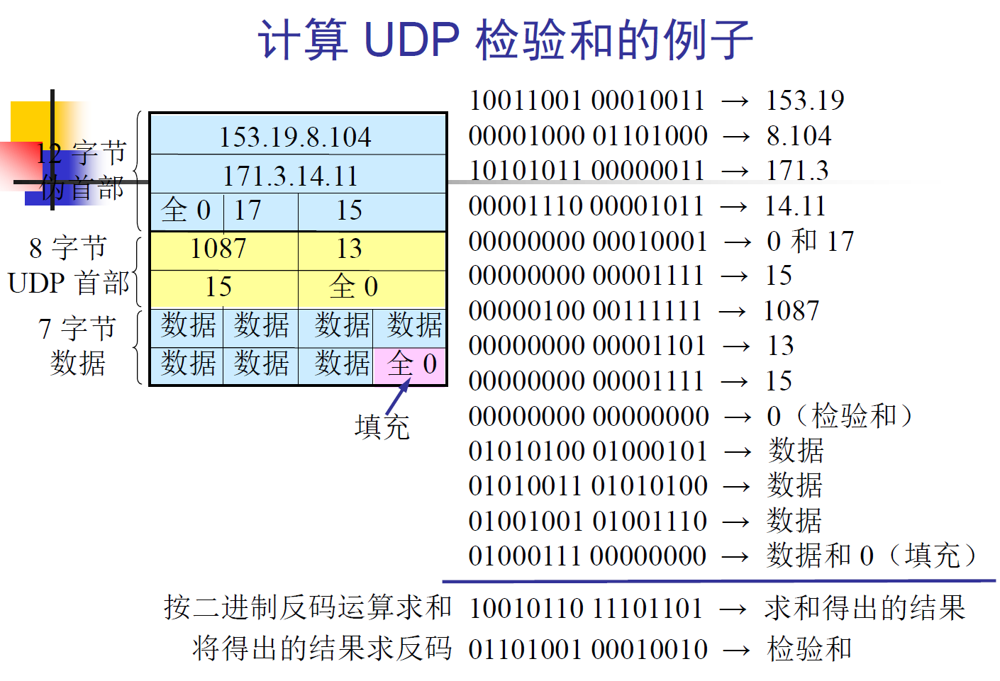

### TCP首部格式

TCP面向字节流，TCP连接的端点是套接字即（IP地址， 端口号）。

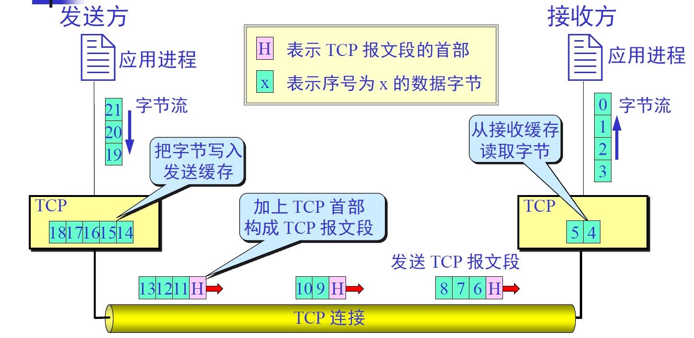

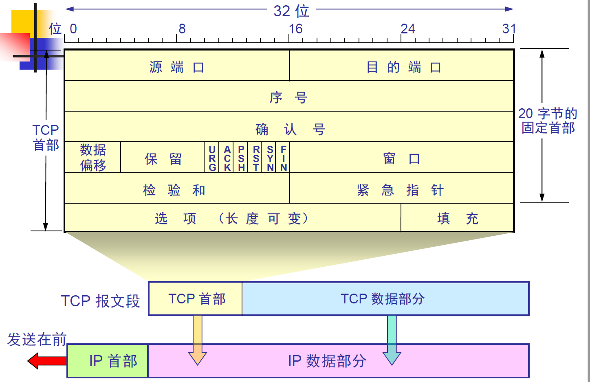

1. **序号**：用于对字节流进行编号，例如序号为301，表明第一个字节的编号是301，如果携带的数据长度为100字节，那么下一个报文段的序号应为401。
2. **确认号**：期望收到的下一个报文段的序号。例如B正确收到A发送来的一个报文段，序号为501，携带的数据长度为200字节，因此B期望下一个报文段的序号为701，B发送给A的确认报文段中确认号是701。
3. **数据偏移**：指的是数据部分距离报文段起始处的偏移量，实际上指的是首部的长度。
4. **确认ACK**：当ACK=1时确认号字段有效，否则无效。TCP规定，在连接建立后所有传送的报文段都必须把ACK置为1
5. **同步SYN**：在连接建立时用来同步序号。当SYN=1，ACK=0时表示**这是一个连接请求报文段**。若对方同意建立连接，则响应报文中SYN=1，ACK=1。
6. **终止FIN**：用来释放一个连接，当FIN=1时，表示此报文段的发送方的数据已经发送完毕，并要求释放连接。
7. **窗口**：窗口值作为接收方让发送方设置其发送窗口的依据，之所以要有该限制，因为接收方的数据缓存空间是有限的。
8. **URG**：当URG=1时，告诉系统该报文中有紧急数据，应尽快传送。
9. **PSH**：接收方收到PSH=1的报文段，就尽快交付接收应用进程。
10. **RST**：当RST=1时，表明TCP连接中出现严重差错，必须释放连接，然后再重新建立连接

### TCP的三次握手

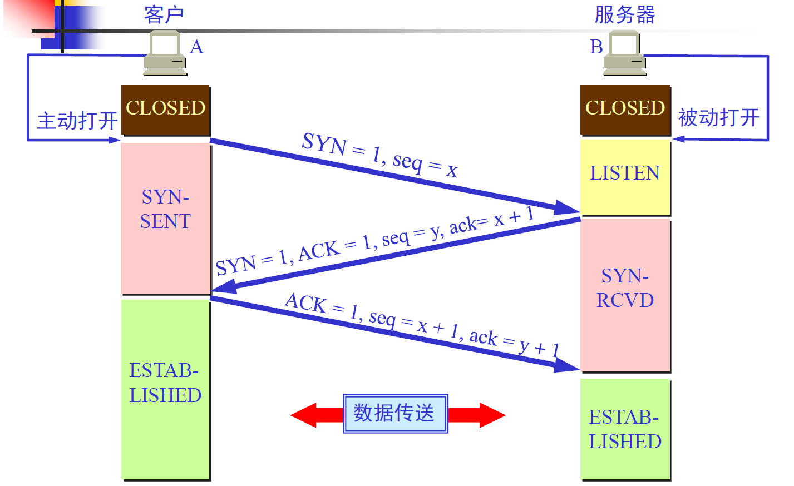

假设A为客户端，B为服务器端。

1. 首先B处于LISTEN监听状态，等待客户的连接请求
2. A向B发送连接请求报文，SYN=1，ACK=0，选择一个初始的序号x
3. B收到连接请求报文，如果同意建立连接，则向A发送连接确认报文，SYN=1，ACK=1，确认号为x+1，同时选择一个初始的序号y
4. A收到B的连接确认报文后，还要向B发出确认，确认号为y+1，序号为x+1
5. B收到A的确认后，连接建立。

#### 三次握手的原因

第三次握手是为了防止失效的连接请求到达服务器，让服务器错误打开连接。

客户端发送的连接请求如果在网络中滞留，那么就会隔很长一段时间才能收到服务器端发回的连接确认。客户端等待一个超时重传时间之后，就会重新请求连接。但是这个滞留的连接请求最后还是会到达服务器，如果不进行三次握手，那么服务器就会打开两个连接。如果有第三次握手，客户端会忽略服务器之后发送的对滞留连接请求的连接确认，对此不会进行第三次握手，因此就不会再次打开连接。

### TCP的四次挥手

四次挥手过程：

1. A发送连接释放报文，FIN=1
2. B收到之后发出确认，此时TCP属于半关闭状态，B能向A发送数据但是A不能向B发送数据
3. 当B不再需要连接时，发送连接释报文，FIN=1
4. A收到后发出确认，进入TIME-WAIT状态，等待2MSL（最大报文存活时间）后释放连接
5. B收到A的确认后释放连接

#### 四次挥手的原因

客户端发送了FIN连接释放报文后，服务器收到了这个报文，就进入了CLOSE-WAIT状态，这个状态是为了让服务器发送还未传送完的数据，传送完毕后，服务器会发送FIN释放报文。

客户端收到服务端的FIN报文后进入此状态，此时并不是直接进入CLOSED状态，还需要等待一个时间计时器设置到2MSL。这么做的原因是：

1. 确保最后一个确认报文能够送达。如果B没有收到A发送来的确认报文，那么就会重新发送连接释放报文，A等待一个时间就会为了处理这种情况的发生
2. 等待一段时间是为了让本连接持续时间内所产生的所有报文都从网络中消失，使得下一个新的连接不会出现旧的连接请求报文。

### TCP可靠传输

TCP使用**超时重传来**实现可靠传输，TCP每发送一个报文段，就对这个报文段设置一次计时器，只要计时器设置的重传时间到但是还没有收到确认，就要重传报文段。一个报文段从发送再到接收到确认所经过的时间称为往返时间RTT，加权平均往返时间RTTs计算为：

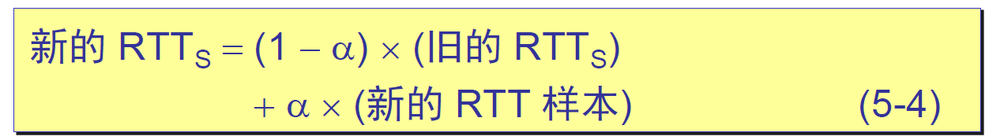

其中$0<=a<1$，RTTs随着a的增加更容易受到RTT的影响。超时时间RTO应该略大于RTTs，TCP使用的超时时间计算为：
$$
RTO = RTTs + 4 * RTT_d
$$
其中$RTT_d$为偏差的加权平均值。

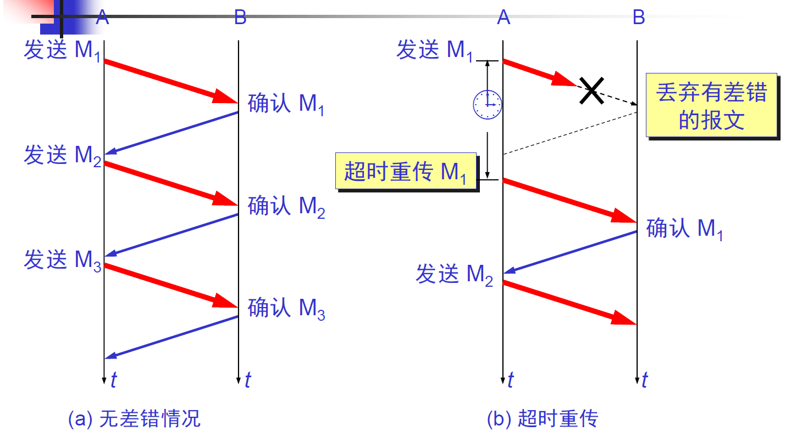

### TCP滑动窗口

窗口是缓存的一部分，**用来暂时存放字节流**。发送方和接收方各有一个窗口，接收方通过**TCP报文段中的窗口字段**告诉发送方自己的窗口大小，发送方根据这个值和其他信息设置自己的窗口大小。

发送窗口内的字节都允许被发送，接收窗口内的字节都允许被接收。如果发送窗口左部的字节已经发送并且收到确认，那么就将发送窗口向右滑动一定距离，直到左部第一个字节不是已发送并且已确认状态；接收窗口的滑动类似，接收窗口左部字节已经发送确认并交互主机，就向右滑动接收窗口。

接收窗口只会对**窗口内最后一个按序到达的字节进行确**认，即累积确认，这样可以减少传输开销，例如接收窗口已经收到的字节为{31,34,35}，其中{31}按序到达，而{34,35}就不是，因此只对字节31进行确认。发送方得到一个字节的确认后，就知道该字节之前的所有字节都已经被接收。

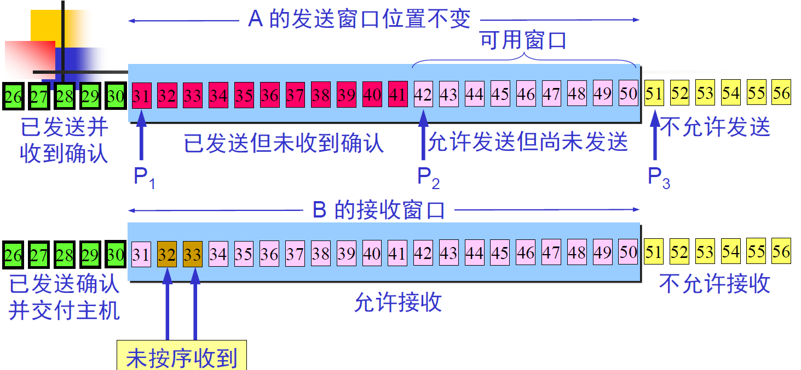

### TCP流量控制

流量控制是为了**控制发送方发送速率，保证接收方来得及接收**，也不要使网络发生拥塞。

接收方发送的确认报文中的窗口字段可以用来控制发送方窗口的大小，从而影响发送方的速率。将窗口字段设置为0，则发送方不能发送数据。当TCP的一方收到对方的零窗口通知，就启动持续计时器，若持续计时器设置的时间到期，就发送一个窗口探测报文段，而对方就在确认这个探测报文段时给出现在的窗口值。

### TCP拥塞控制

如果网络出现拥塞，分组将会丢失，此时发送方会继续重传，从而导致网络拥塞程度会更高。因此当出现拥塞时，应当控制发送方的速率。这一点和流量控制很像，但是出发点不同。流量控制是为了让**接收方能**来得及接收，而**拥塞控制是为了降低整个网络的拥塞控制**。

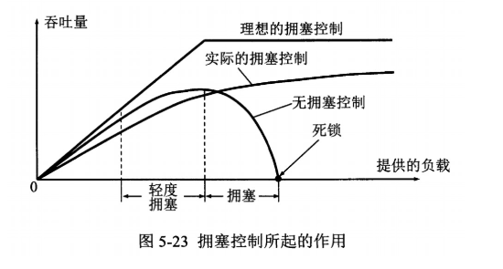

TCP主要同四个算法来进行拥塞控制：慢开始、拥塞避免、快重传和快恢复。

发送方需要维护一个叫做 **拥塞窗口**的状态变量，发送方让自己的发送小于等于拥塞窗口。注意拥塞窗口与发送方窗口的区别，拥塞窗口只是一个状态变量，实际决定发送方能发送多少数据的是发送方窗口。

#### 慢开始和拥塞避免

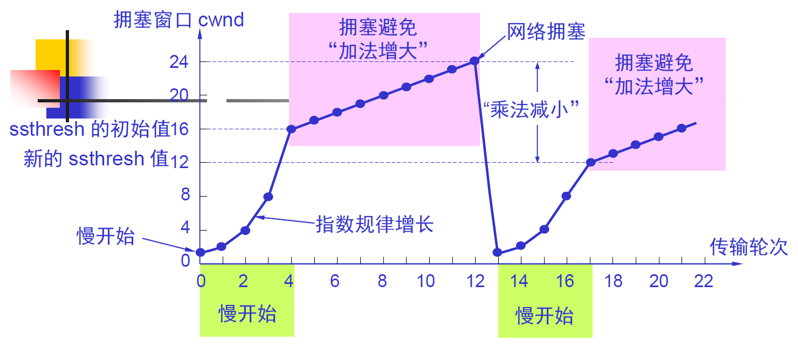

在未达到慢开始门限ssthreah时，采用指数规律增加拥塞窗口大小，当达到慢开始门限后，采用拥塞避免算法，拥塞窗口值线性增长。当增加到网络拥塞时，将慢开始门限时调小，继续慢开始算法和拥塞避免算法。

#### 快重传与快恢复

快重传算法首先要求接收方**每收到一个失序的报文段后就立即发出重复确认**。这样做可以让发送方及早知道有报文段没有到达接收方。发送方只要**一连接收到三个重复确认**就应当立即重传对方尚未收到的报文段。

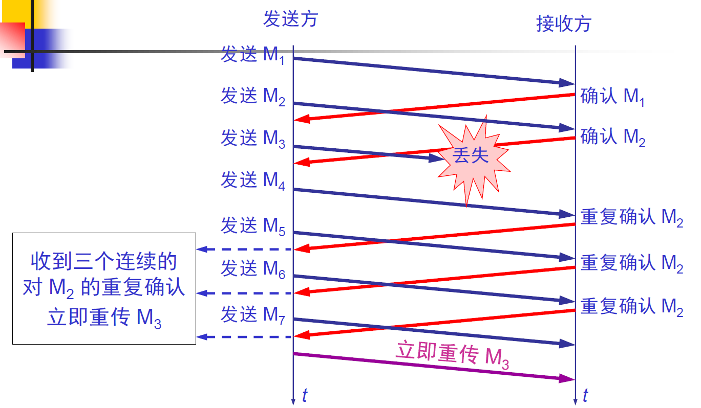

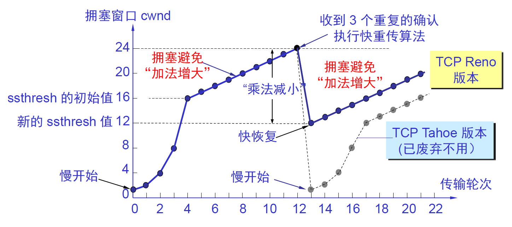

