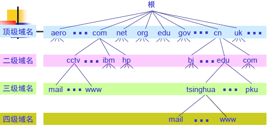
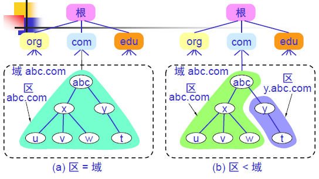
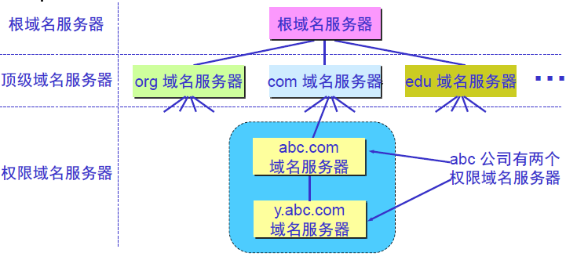
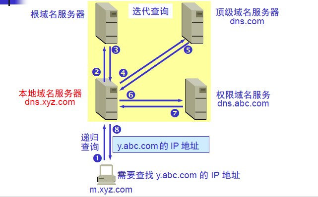
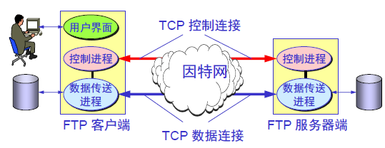
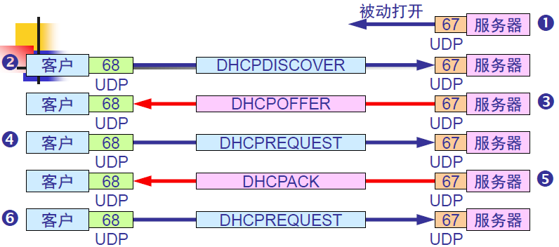
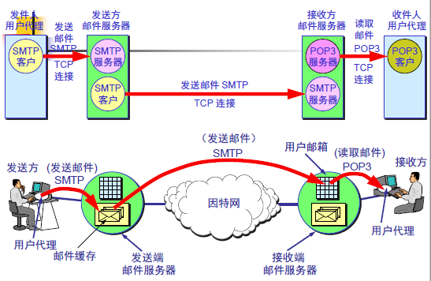
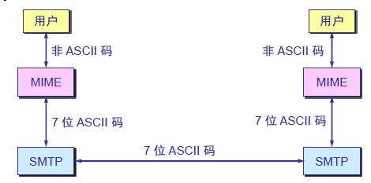
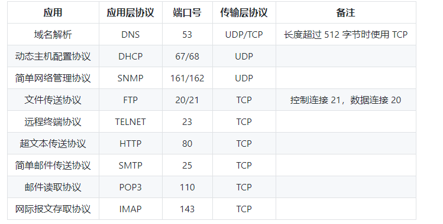

# 计算机网络-应用层

## 域名系统DNS

DNS是一个分布式数据库，提供了主机名和IP地址之间相互转换的服务。这里的分布式数据库是指每个站点只保留它自己那部分的数据。

域名具有层次树状结构，任何一个连接在因特网上的主机或路由器，都具有一个唯一的层次结构名字，即域名。域名的结构由标号序列组成，各标号之间用点隔开。从上到下依次为：根域名、顶级域名、二级域名等。

一个域名服务器所负责管辖的范围叫做 **区**，每一个区设置相应的 **权限域名服务器**。DNS服务器管辖的范围以区为单位。

主机向本地域名服务器的查询是 **递归查询**，若本地域名服务器不知道被查询域名的IP地址，那么本地域名服务器就以DNS客户的身份，向其他根域名服务器继续发出查询请求报文。

DNS可以使用UDP或者TCP进行传输，使用的端口号为53。大多数情况下DNS使用UDP进行传输，这就要求域名解析器和域名服务器都必须自己处理超时和重传从而保证可靠性。在两种情况下会使用TCP进行传输：

1. 如果返回的响应超过512字节，因为UDP最多支持512字节的数据
2. 区域传送，区域传送是指主域名服务器向辅助域名服务器传送变化的那部分数据

## 文件传送协议FTP

FTP使用 **客户服务器方式**。 服务器进程由**主进程和从属进程**组成，主进程负责接收新的请求，从属进程负责处理单个请求。FTP使用TCP进行连接，它需要两个连接来传送一个文件：

1. **控制连接**：服务器打开端口号21等待客户端的连接，客户端主动建立连接后，使用这个连接将客户端的命令传送给服务器，并传回服务器的应答
2. **数据连接**：用来传送一个文件

根据数据连接是否是服务器端主动建立，FTP有主动和被动两种模式：

1. **主动模式**：服务器端主动建立数据连接，其中服务器端的端口号为20，客户端的端口号随机，但是必须大于1024，因为0-1023是熟知端口号

2. **被动模式**：客户端主动建立数据连接，其中客户端的端口号由客户端自己指定，服务器端的端口号随机

主动模式要求客户端开放端口号给服务器端，需要去配置客户端的防火墙。被动模式只需要服务器开放端口号即可，无需客户端配置防火墙，但是被动模式会导致服务器端的安全性减弱，因为开放了过多的端口号。

## 动态主机配置协议DHCP

DHCP提供了**即插即用的连网方式**，用户不需要手动配置IP地址等信息。DHCP配置的内容不仅是**IP地址**，还包括**子网掩码**、**默认路由器的IP地址**和**域名服务器的IP地址**。DHCP工作过程为：

1. 需要IP地址的主机广播发送 **发现报文**，这时该主机就成为DHCP客户。该报文被广播到同一个子网的所有主机上，但是只有DHCP服务器才回答此广播报文。如果客户端和DHCP服务器不在同一个子网，就需要使用中继代理，它配置了DHCP服务器的IP地址信息
2. DHCP服务器收到发现报文后，先在其数据库中查找该计算机的配置信息。若找到，则返回找到的信息。若找不到，则从服务器的IP地址池中取一个地址分配给该计算机。DHCP服务器的回报报文叫做 **提供报文**。 该报文包含了客户端所需要的信息。因为客户端可能收到多个DHCP服务器提供的信息，因此客户端需要进行选择
3. 如果客户端选择了某个DHCP服务器提供的信息，那么就发送request报文给该DHCP服务器
4. DHCP服务器发送确认报文，表示客户端此时可以使用提供给它的信息。

## 远程登录协议TELNET

TELNET用于登录到远程主机上，并且远程主机上的输出通过TCP连接也会返回到用户屏幕。

## 电子邮件协议

一个电子邮件系统由三部分组成：

1. 用户代理：电子邮件客户端软件
2. 邮件服务器：发送和接收邮件，并向发信人报告邮件传送的情况
3. 邮件协议：发送协议和读取协议，**发送协议常用STMP**，**读取协议**常用**POP3和IMAP**

### 1 SMTP

使用客户服务器方式，通信分为三个阶段：

1. 连接建立：在发送主机的SMTP客户和接收主机的SMTP服务器之间建立连接，不使用中间的邮件服务器
2. 邮件传送
3. 连接释放：邮件发送完毕后，SMTP释放TCP连接

SMTP只能发送ASCII码，而互联网邮件扩充MIME可以发送二进制文件。MIME并没有改动或者取代SMTP，而是增加邮件主体的结构，定义了非ASCII码的编码规则。

### 2 POP3

POP3的特点是只要用户从服务器上读取了邮件，就把邮件删除。但新版本的POP3可以不删除邮件。

### 3 IMAP

IMAP协议中客户端和服务器上的邮件保持同步，如果不手动删除邮件，那么服务器上的邮件也不会删除。IMAP这种做法可以让用户随时随地的访问服务器上的邮件。

## 常用端口

## Web页面请求过程

### 1 DHCP配置主机信息

1. 假设主机最开始没有IP地址以及其他信息，那么就需要先使用DHCP来获取
2. 该主机生成一个DHCP请求报文，并将这个报文放入具有目的端口67和源端口68的UDP报文段中
3. 该报文段则被放入在一个具有广播IP目的地址（255.255.255.255）和源IP地址（0.0.0.0）的IP数据报中
4. 该数据报则被放置在MAC帧中，该帧具有目的地址FF:FF:FF:FF,将广播到与交换机相连的所有设备
5. 连接在交换机的DHCP服务器收到广播帧后，不断向上分解得到IP数据报、UDP报文段、DHCP请求报文段，之后生成DHCP ACK报文，该报文包含以下信息：IP地址、DNS服务器的IP地址、默认网关路由器的IP地址和子网掩码。该报文被放入UDP报文段中，UDP报文段又被放入IP数据报中，最后放入MAC帧中。
6. 该帧的目的地址是请求主机的MAC地址，因为交换机具有自学习能力，之前主机发送了广播帧之后就记录了MAC地址到其转发接口的交换表项，因此，现在交换机就可以直接知道应该向哪个接口发送该帧
7. 主机收到该帧后，不断分解得到DHCP报文，之后就配置它的IP地址，子网掩码和DNS服务器的IP地址，并在其IP转发表中安装默认网关

### 2 ARP解析MAC地址

1. 主机通过游览器生成一个TCP套接字，套接字向HTTP服务器发送HTTP请求。为了生成该套接字，主机需要知道网络的域名对应的IP地址
2. 主机生成一个DNS查询报文，该报文具有53号端口，因为DNS服务器端口号为53
3. 该DNS查询报文被放入具有目的地址为DNS服务器IP地址的IP数据报中
4. 该IP数据报放入一个以太网帧中，该帧发送到网关路由器
5. DHCP过程只知道网关路由器的IP地址，为了获取网关路由器的MAC地址，需要使用ARP协议
6. 主机生成一个包含目的地址为网关路由器IP地址的ARP查询报文，将该ARP查询报文放入一个具有广播地址的以太网帧中，并向交换机发送该以太网帧，交换机将帧转发给所有的连接设备，包括网关路由器
7. 网关路由器收到该帧后，不断向上分解得到ARP报文，发现其中的IP地址与其接口的IP地址匹配，因此就发送一个ARP回答报文，包含了它的MAC地址，发回给主机

### 3 DNS解析域名

1. 知道了网关路由器的MAC地址后，就可以继续DNS的解析过程
2. 网关路由器收到包含DNS查询报文的以太网帧后，抽取出IP数据报，并根据该表决定IP数据报应该转发的路由器
3. 因为路由器具有内部网关协议（RIP，OSPF）和外部网关协议（BGP）两种路由选择协议，因此路由表中已经配置了网关路由器到达DNS服务器的路由表项
4. 到达DNS服务器后，DNS服务器抽取DNS查询报文，并在DNS数据库中查找待解析的域名
5. 找到DNS记录后，发送DNS回答报文，并将该回答报文放入UDP报文段中，然后放入IP数据报中，通过路由器反向转发回网关路由器，并经过以太网交换机到达主机

### 4 HTTP请求页面

1. 有了HTTP服务器的IP地址后，主机就能够生成TCP套接字，该套接字将用于向Web服务器发送HTTP GET报文
2. 在生成TCP套接字前，必须先与HTTP服务器进行三次握手建立连接。生成一个具有目的端口80的TCP SYN报文段，并向HTTP服务器发送该报文段
3. HTTP服务器收到该报文段后，生成TCP SYN ACK报文段，发回给主机
4. 连接建立后，游览器生成HTTP GET报文，并交付给HTTP 服务器
5. HTTP 服务器从TCP套接字读取HTTP GET报文，生成一个HTTP响应报文，将Web页面的内容放入报文主体中，发回给主机
6. 游览器收到HTTP 响应报文后，抽取出Web页面内容，之后进行渲染，显示Web页面