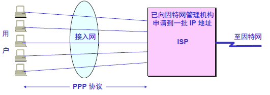

# 计算机网络-链路层

**链路**是一条无源的点到点的物理线路段，中间没有任何其他的交换结点。**数据链路**除了物理线路外，还必须有通信协议来控制这些数据的传输，若把实现这些协议的硬件和软件加到链路上，就构成了数据链路。

## 三个基本问题（封装成帧、透明传输、差错控制）

数据链路层传送的是 **帧**。

### 1.封装成帧

将网络层传下来的数据添加**首部和尾部**，用于**标记帧的开始和结束**。

### 2.透明传输

透明表示一个实际存在的事物看起来好像不存在一样。

帧使用首部和尾部进行定界，如果**帧的数据部分含有和首尾部相同的内容**，那么帧的开始和结束位置就会被错误的判断。需要在数据部分出现首部尾部相同的内容前面**插入转义字符**。如果数据部分出现转义字符，那么就在转义字符前面再加个转义字符。在接收端处理之后可还原出原始数据。这个过程透明传输的内容的是转义字符，用户觉察不到转义字符的存在。

### 3.差错控制

在传输过程中可能会产生 **比特差错（1变为0,0变为1）**。 目前数据链路层广泛使用**循环冗余检验（CRC）**来检查比特差错。

#### 循环冗余检验原理：

1. 在发送端，先把数据划分成组。假定每组k个比特。
2. 假设待传送的一组数据M=101001（现在k=6）。我们在M的后面再添加供差错检测用的n位 **冗余码**一起发送
3. 接收端对收到的每一帧进行CRC检验。

**冗余码的计算**：

1. 用二进制的模2运算进行$2^n$乘M的运算，这相当于在M后面添加n个0。
2. 得到的（k+n）位的数除以事先选定号的长度为（n+1）位的 **除数**P，得出 **商**是Q而 **余数**是R，余数比除数P少1位，即R是n位。

把**余数R**作为 **冗余码**添加在数据M的后面发送出去。发送的数据是：$2^nM+R$。

在数据后面添加上的冗余码称为 **帧检验序列FCS**。

## 信道分类

### 1 广播信道

一对多通信，一个节点发送的数据能够广播信道上所有的节点接收到

所有节点都在同一个广播信道上发送数据，因此需要有专门的控制方法进行协调，避免发送冲突（碰撞）。主要有两种方法进行协调，一个是使用信道复用技术，一个是使用CSMA/CD 协议。

### 2 点对点信道

一对一通信，因为不会发生碰撞，因此比较简单，采用**PPP（Point-to-Point Protocol）**协议进行控制。

## CSMA/CD协议（载波监听多点接入/碰撞检测。）

CSMA/CD表示载波监听多点接入/碰撞检测。

1. **多点接入**：说明这是总线型网络，许多主机以多点方式连接到总线上
2. **载波监听**：每个主机都必须不停的监听信道。在发送前，如果监听到信道正在使用，就必须等待
3. **碰撞检测**：在发送中，如果监听到信道已有其它主机正在发送数据，就表示发生了碰撞。虽然每个主机在发送数据之前都已经监听到信道为空闲，但是由于电磁波的传播时延的存在，还是有可能会发生碰撞。

记载端到端的传播时延为$\tau$，最先发送的站点最多经过$2\tau$就知道是否发生了碰撞，称$2\tau$为 **争用期**。只有经过争用期之后还没有检测到碰撞，才能肯定这次发送不会发生碰撞。不能进行全双工通信而只能进行双向交替通信（半双工通信）。

当发生碰撞时，站点要停止发送，等待一段时间再发送。这个时候采用 **截断二进制指数退避算法**来确定。从离散的整数集合{0,1,2,...,($2^k$-1)}中随机取出一个数，k为重传次数，记作r，然后取r倍的争用期为 **重传等待时间**。

## PPP协议（点对点协议）

互联网用户通常需要连接到某个ISP之后才能接入到互联网，PPP协议是**用户计算机和ISP进行通信时**所使用的数据链路层协议。

#### PPP协议有三个组成部分

1. 一个将**IP数据报**封装到串行链路的方法
2. **链路控制协议LCP**
3. **网络控制协议NCP**

#### **PPP协议的帧格式**

1. 标志字段**F=0x7E**为帧的定界符
2. A=0xFF和C=0x03字段暂时没有意义
3. FCS字段是使用CRC的检验序列
4. 信息部分的长度不超过1500字节
5. 当协议字段为0x0021时，PPP帧的信息字段是**IP数据报**。若为0xC021，则信息字段表示是**PPP链路控制数据**。若为0x8021，信息字段表示是**PPP网络控制数据。**

#### PPP协议不使用序号和确认机制的原因：

1. 数据链路层出现差错的概率不大时，使用比较简单的PPP协议较为合理
2. 在因特网环境下，PPP的信息字段放入的是数据是IP数据报。数据链路层的可靠传输并不能够保证网络层的传输是可靠的
3. 帧检验序列FCS字段可保证无差错接受

#### PPP协议的工作状态

1. 当用户拨号接入ISP时，路由器的调制解调器对拨号做出确认，并建立一条物理连接
2. PC机向路由器发送一系列的LCP（**链路控制协议**）分组（封装成多个PPP帧）
3. 这些分组及其响应选择一些PPP参数，和进行网络层配置， NCP（**网络控制协议**）给新接入的PC机分配一个临时的IP地址，使得PC机成为因特网上的一个主机
4. 通信完毕后，NCP释放网络层连接，收回原来分配出去的IP地址。接着LCP释放数据链路层连接，最后释放物理层的连接。

## MAC地址

MAC地址是链路层地址，长度为6字节（48位），用于唯一标识网络适配器（网卡）。网络适配器的重要功能有进行串并行转换，对数据进行缓存，对计算机的操作系统安装设备驱动程序，实现以太网协议。

**计算机通过适配器和局域网进行通信**：

一台主机拥有多少个网络适配器就有多少个MAC地址。例如比较本电脑普遍存在无线网络适配去和有线网络适配器，因此就有两个MAC地址。

## 局域网

局域网是一种典型的**广播信道**，主要特点是网络为一个单位所拥有，且地理范围和站点数数目均有限。

主要有以太网、令牌环网、FDDI和ATM等局域网技术，目前以太网占领着有线局域网市场。

可以按照网络拓扑结构对局域网进行分类。

## 以太网

以太网是一种星型拓扑结构局域网。早期使用集线器进行连接，**集线器是一种物理层设备**，作用于比特而不是帧，当一个比特到达接口时，集线器重新生成这个比特，并将其能量强度放大，从而扩大网络的传输距离，之后再将这个比特发送到其他的所有接口。如果集线器**同时接收到两个不同接口的帧，那么就发送了碰撞**。

目前以太网使用**交换机替代就集线器**，交换机是**一种链路层设备**，它不会发生碰撞，能根据MAC地址进行存储转发。

适配器从网络上**每收到一个MAC帧就首先用硬件检查MAC帧中的MAC地址**，如果是发往本站的帧就收下，否则将此帧丢弃。

以太网帧格式：

1. 类型：标记**上一层**使用的协议，以便把收到的MAC帧的数据上交给上一层的这个协议。
2. 数据：长度在46-1500之间，如果太小则需要填充，需要保证以太网的帧长不小于64字节。
3. FCS：帧检验序列，使用的是CRC检验方法

## 交换机

交换机具有自学习能力，学习的是交换表的内容，交换表中存储着MAC地址到接口的映射。交换机是多接口网桥，工作在数据链路层。

正是由于其具有自学习能力，所以交换机是一种即插即用设备，不需要网络管理员手动配置交换表内容。

下图中国，交换机有四个接口，主机A向主机B发送数据帧时，交换机把主机A到接口1的映射写入交换表。为了发送数据帧到B，先查交换表，此时没有主机B的表项，那么主机A就发送广播帧，主机C和主机D会丢弃该帧，主机B回应该帧向主机A发送数据包时，交换机查找交换表得到主机A映射的接口为1，就发送数据帧到接口1，同时交换机添加主机B到接口2的映射。

## 虚拟局域网

虚拟局域网可以**建立与物理位置无关的逻辑组**，只有在同一个虚拟局域网中的成员才会收到链路层广播信息。

例如下图中（A1,A2,A3,A4）属于一个虚拟局域网，A1发送的广播会被A2，A3，A4收到，而其他站点收不到。

使用VLAN干线连接来建立虚拟局域网，每台交换机上的一个特殊接口被设置为干线接口，以互连VLAN交换机。IEEE定义了一种扩展的以太网帧格式802.1Q，它在标准以太网帧上加进了4字**节首部VLAN标签，用于表示该帧属于哪一个虚拟局域网。**虚拟局域网使用的以太网帧格式：

