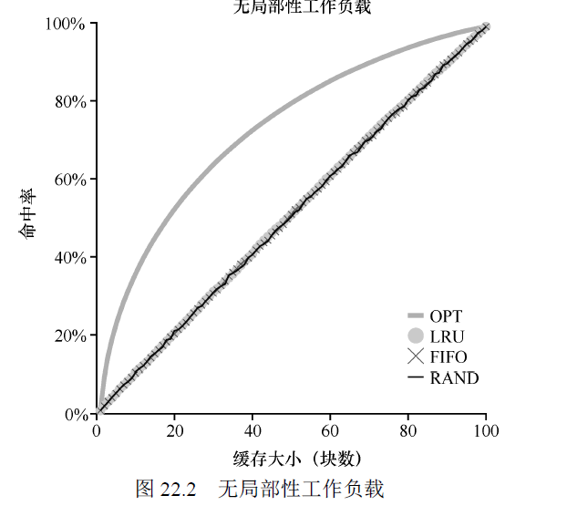

- [《Operating Systems:Three Easy Pieces》虚拟化—内存](#-operating-systems-three-easy-pieces-------)
- [13 抽象地址空间](#13-------)
  * [地址空间](#----)
  * [虚拟化内存的目标](#--------)
  * [小结](#--)
- [14 插叙： 内存操作API](#14---------api)
  * [常见错误](#----)
  * [底层操作系统支持](#--------)
- [15 机制： 地址转换](#15---------)
  * [动态（基于硬件）重定位](#-----------)
  * [硬件支持： 总结](#--------)
  * [操作系统的问题](#-------)
  * [小结](#---1)
- [16 分段](#16---)
  * [分段：泛化的基址/界限](#-----------)
  * [我们引用哪个段](#-------)
  * [栈怎么办](#----)
  * [支持共享](#----)
  * [操作系统支持](#------)
  * [小结](#---2)
- [17 空闲空间管理](#17-------)
  * [假设](#--)
  * [底层机制](#----)
    + [分割和合并](#-----)
    + [追踪已分配空间的大小](#----------)
    + [嵌入空闲列表](#------)
    + [让堆增长](#----)
  * [基本策略](#----)
  * [其他方式](#----)
    + [分离空闲列表](#------)
    + [伙伴系统](#----)
  * [小结](#---3)
- [18 分页： 介绍](#18-------)
  * [页表存在哪里](#------)
  * [页表中究竟有什么](#--------)
  * [分页： 也很慢](#-------)
  * [内存跟踪](#----)
  * [小结](#---4)
- [19 分页： 快速地址转变（TLB）](#19------------tlb-)
  * [TLB的基本算法](#tlb-----)
  * [谁来处理TLB未命中](#----tlb---)
  * [TLB的内容](#tlb---)
  * [上下文切换时对TLB的处理](#-------tlb---)
  * [TLB替换策略](#tlb----)
  * [实际系统的TLB表项](#-----tlb--)
  * [小结](#---5)
- [20 分页： 较小的表](#20---------)
  * [简单的解决方案：更大的页](#------------)
  * [混合方法： 分页和分段](#-----------)
  * [多级页表](#----)
  * [反向页表](#----)
  * [将页表交换到磁盘](#--------)
  * [小结](#------)
- [21 超越物理内存： 机制](#21-----------)
  * [交换空间](#----)
  * [存在位](#---)
  * [页错误](#---)
  * [内存满了怎么办](#-------)
  * [页错误处理流程](#-------)
  * [交换何时真正发生](#--------)
  * [小结](#---6)
- [22 超越物理内存： 策略](#22-----------)
  * [缓存管理](#----)
  * [最优替换策略](#------)
  * [简单策略： FIFO](#------fifo)
  * [另一个简单策略：随机](#----------)
  * [利用历史数据： LRU](#--------lru)
  * [工作负载实例](#------)
  * [实现基于历史信息的算法](#-----------)
  * [近似LRU](#--lru)
  * [考虑脏页](#----)
  * [其他虚拟内存策略](#--------)
  * [抖动](#--)
  * [小结](#---7)
- [23 VAX/VMS 虚拟内存系统](#23-vax-vms-------)
  * [内存管理硬件](#------)
  * [一个真实的地址空间](#---------)
  * [页替换](#---)
    + [分段的FIFO](#---fifo)
    + [页聚集](#---)
  * [其他漂亮的虚拟内存技巧](#-----------)
  * [小结](#---8)
- [内存虚拟化小结](#-------)

# 《Operating Systems:Three Easy Pieces》虚拟化—内存

用户程序生成的每个地址都是虚拟地址。主要是为了**易于使用**，操作系统会让每个程序觉得，它有一个很大的连续地址空间来放入其代码和数据。

同时可以提供 **隔离和保护**，可以保证错误的程序不会读取或者覆盖其他程序的内存。

# 13 抽象地址空间

## 地址空间

操作系统提供一个易于使用的**物理内存抽象**， 这个抽象叫做**地址空间**，是运行的程序能够看到的系统中的内存。

一个进程的地址空间包含运行的程序的 **所有内存状态**。

当我们描述地址空间时，描述的是操作系统提供给**运行程序的抽象**。程序不再物理地址0-16KB的内存中，而是加载在任意的物理地址。操作系统这样做时，我们说操作系统在**虚拟化内存**。

## 虚拟化内存的目标

1. **透明**：操作系统实现虚拟化内存的方式，应该让运行的程序看不见。
2. **效率**：操作系统应该追求虚拟化尽可能高效，包括时间上和空间上。在实现高效率虚拟化时，操作系统需要TLB等硬件支持。
3. **保护**：操作系统确保进程受到保护，不会受到其他进程影响，操作系统本身也不会受进程影响。保护能让进程之间提供隔离的特性，每个进程都应该在自己的独立的环境中运行。

## 小结

虚拟系统负责为程序提供一个**巨大的、稀疏的、私有的地址空间**的假象，其中保存了程序的所有指令和数据。

操作系统在专门硬件的帮助下，通过每一个虚拟内存的索引，将其转换为物理地址，物理内存根据获得的物理地址去获取所需的信息。

操作系统会让许多进程同时执行此操作，并确保程序之间互相不会受到影响，也不会影响操作系统。

# 14 插叙： 内存操作API

栈内存，它的申请和释放是编译器隐式管理，所有有时也称为自动内存。

堆内存，它的申请和释放都由程序员显示完成。

malloc(), 该调用使用sizeof()操作符去申请正确大小的空间，在C中，这通常被认为是编译时操作符，意味着这个大小是在编译时就已经知道的，因此被替换成一个数。因此sizeof被认为是一个操作符，而不是一个函数调用（函数调用在运行时发生）。

分配字符串空间时，要记得为字符串结束符分配空间。

free()，不传入分配区域的大小，该大小由内存分配库本身记录追踪。

## 常见错误

1. **忘记分配内存**

正确的代码是：

2. **没有分配足够的内存**，也称为缓冲区溢出

3. **忘记初始化分配的内存**，会读到未知值数据
4. **忘记释放内存**，会发生内存泄漏。当程序运行时间很短，很快就会推出，此时当进程死亡时，操作系统将清理其分配的所有页面，因此不会发生内存泄漏。但是这不是一个好习惯。
5. **在用完之前释放内存**
6. **反复释放内存**
7. **错误调用free**，参数只能是从malloc得到的一个指针

查找内存有关问题的工具有valgrind和purify。

## 底层操作系统支持

malloc库管理虚拟地址空间内的空间，它本身是建立在一些系统调用之上的。

**brk系统调用**：改变堆结束的位置，来增加或减少堆的大小

**mmap调用**：可以在程序中创建一个**匿名内存区域**，该区域不与任何特定文件关联，而是与**交换空间**相关联。

# 15 机制： 地址转换

采用**基于硬件的地址转换**，简称**地址转换**来实现高效、灵活得虚拟化内存。利用地址转换，硬件对每次**内存访问**进行处理（即指令获取、数据读取或写入），将指令中的 **虚拟地址**转换为数据实际存储的 **物理地址**。

**硬件提供了底层机制来提高效率， 操作系统在关键的位置介入**，设置好硬件，以便完成正确的地址转换，因此操作系统必须管理内存，记录被占用和空闲的内存位置，并明智和谨慎的介入，保持对内存使用的控制。

因此，这些工作创造出了一个美好的假象： **每个程序都拥有私有的内存，那里存放着它自己的代码和数据。**

## 动态（基于硬件）重定位

**基址加界限机制**，有时又称为动态重定位。每个CPU需要两个硬件寄存器，**基址寄存器和界限寄存器**，利用这组基址和界限寄存器，让我们能够将地址空间放在物理内存的任何位置，同时又能确保进程只能访问自己的地址空间。这种基址寄存器配合界限寄存器的硬件结构是芯片中的，每个CPU一对，有时我们也将CPU中这个负责地址转换的部分统称为 **内存管理单元（MMU）**。

硬件取得进程认为它要访问的地址，将它转换称数据实际位于的物理地址，这种重定位是在运行时发生的，而且我们可以在进程开始运行后改变其地址空间，因此称为 **动态重定位**。

## 硬件支持： 总结

## 操作系统的问题

1. 在进程创建时，操作系统必须采取行动，为进程的地址空间找到内存空间
2. 在进程终止时，操作系统回收它的所有内存，给其他进程或者操作系统使用
3. 在上下文切换时，操作系统也必须执行一些额外的操作，**保存和恢复基础和界限寄存器**，当操作系统决定中止当前的进程时，必须将当前基址和
   界限寄存器中的内容**保存在内存中**，放在某种**每个进程都有的结构**中，如进程结构或进程控制块。
4. 操作系统必须提供异常处理程序

**地址转换过程完全由硬件处理，没有操作系统的介入。**

## 小结

虚拟内存使用的一种特殊机制，即**地址转换（address translation）**，扩展了**受限直接访问**的概念

利用地址转换，操作系统可以**控制进程的所有内存访问**，确保访问在地址空间的界限内

这个技术高效的关键是**硬件支持**，硬件快速地将所有内存访问操作中的虚拟地址转换为物理地址。

我们还看到了一种特殊的虚拟化方式，称为**基址加界限的动态重定位**。基址加界限的虚拟化方式非常高效，因为只需要很少的硬件逻辑，就可以将虚拟地址和基址寄存器加起来，并检查进程产生的地址没有越界。**基址加界限也提供了保护**，操作系统和硬件的协作，确保没有进程能够访问其地址空间之外的内容。**保护肯定是操作系统最重要的目标之一**。

目前这个简单的动态重定位技术有效率低下的问题，容易产生 **内部碎片**，因为堆栈区没有内容，也需要为其分配空间。

# 16 分段

## 分段：泛化的基址/界限

在MMU中引入不止一个基址和界限寄存器对，而是给地址空间的 **每个逻辑段**一对。一个段只是地址空间里的一个连续定长的区域，在典型的地址空间里有3个逻辑不同的段：代码、栈和堆。**分段的机制**使得操作系统能够将不同的段放到不同的物理内存区域，从而**避免了虚拟地址空间中的未使用部分占用物理内存**。

## 我们引用哪个段

显示方式：**用虚拟地址的开头几位**来标识不同的段

根据不同的段，采用不同的基址界限器和界限寄存器。

隐式方式：硬件通过**地址产生的方式**来确定段。例，如果地址由程序计数器产生，那么地址是在代码段。如果基于栈或基址指针，它一定在栈段，其他地址在堆段。

## 栈怎么办

**栈**有一点关键区别，**它是反向增长。**因此硬件还需要知道段的增长方向。

## 支持共享

为了共享，硬件还需要提供 **保护位**。通过将代码段标记为只读，同样的代码可以被多个进程共享，而不用担心破坏隔离。每个进程都认为自己独占这块内存，但操作系统秘密共享了内存，进程不能修改这些内存，所以假象得以保持。

## 操作系统支持

1. 操作系统在上下文切换时，各个段寄存器中的内容必须保存和恢复。
2. 操作系统管理物理内存的空闲空间，会产生 **外部碎片**，解决方案：1. 紧凑物理内存，重新安排原有的段（需要拷贝段，成本高） 2. 利用空闲列表管理算法，试图保留较大的内存块用于分配，包括有最优匹配、最坏匹配、首次匹配和伙伴匹配算法。

## 小结

**分段**实现了**更高效的虚拟内存**。不只是动态重定位，通过避免地址空间的逻辑段之间的大量潜在的内存浪费，分段能**更好的支持稀疏地址空间**。**速度很快**，分段要求的算法容易，很适合**硬件完成**，地址转换**开销极小**。分段还有一个附加的好处：**代码共享**。

分段会**导致外部碎片**，分段还是**不足以支持更一般化的稀疏地址空间**。例如，如果有一个很大但是稀疏的堆，都在一个逻辑段中，整个堆仍然必须加载到内存中。

# 17 空闲空间管理

管理的空间被划分为固定大小的单元，就很容易， **分页机制**。

管理的空间由 **大小不同**的单元构成，管理就变得困难， 该情况出现在**用户级的内存分配库(mallo和free)**，或者操作系统用**分段**实现虚拟内存。出现**外部碎片**。

## 假设

1. 在堆上管理空闲空间的数据结构通常称为**空闲列表**。该结构包含了管理内存区域中所有空闲块的引用。

2. 内存一旦分配给客户，就不可以重定位到其他位置，直到调用free函数将它归还。因此，不能进行紧凑空闲空间的操作来减少碎片。

3. 要避免外部碎片过多。

## 底层机制

### 分割和合并

**分割**：它找到一块可以满足请求的空闲空间，将其分割，第一块返回给用户，第二块留在空闲列表中

**合并：**在归还一块空闲内存时，**查看要归还的内存块的地址以及邻它的空闲空间块**。如果新归还的空间与一个原有空闲块相邻（或两个），就将它们合并为一个较大的空闲块。

###  追踪已分配空间的大小

在分配区域的头块上**包含分配空间的大小**，还包含一些额外的指针来加速空间释放，包含幻数提供完整性检查。

实际释放的空间大小：是**头块大小**加上**分配给用户的空间的大小**

### 嵌入空闲列表

将空闲块加回空闲列表，当形成碎片化的内存空间时，遍历列表，合并相邻块。

### 让堆增长

当堆中的内存耗尽，向操作系统申请更大的空间。**操作系统执行sbrk调用**，会找回空闲的物理内存页，将它们映射到请求进程的地址空间去，并返回新的堆的末尾地址。

## 基本策略

理想的分配程序可以同时保证快速和碎片的最小化。

1. **最优匹配**：首先遍历整个空闲列表，找到和请求大小一样或更大的空闲块，然后返回这组候选者中最小的一块。因此，可以尽量避免空间浪费，但是要遍历查找，性能代价高。
2. **最差匹配**：它尝试找最大的空闲块，分割并满足用户需求后，将剩余的块（很大）加入空闲列表。同样需要遍历查找，碎片也过多

3. **首次匹配**：找到第一个足够大的块，将请求的空间返回给用户。速度快，但是会让空闲列表开头部分有很多小块。
4. **下次匹配**：多维护一个指针，指向上一次查找结束的位置，从上次结束的位置找到第一个足够大的块。

## 其他方式

### 分离空闲列表

**基本想法**：如果某个应用程序经常申请一种（或几种）大小的内存空间，那就**用一个独立的列表，只管理这样大小的对象**。其他大小的请求都一给更通用的内存分配程序

**优点**：通过拿出一部分内存专门满足某种大小的请求，碎片就不易出现，而且查找效率也会提高。

**缺点**：应该拿出多少内存专门为某种大小的请求服务？增加了复杂性。

**解决方案**：**厚块分配程序**，在内核启动时，为可能频繁请求的内核对象创建一些对象缓存（object cache），如锁和文件系统inode 等。这些的对象缓存每个分离了特定大小的空闲列表，因此能够很快地响应内存请求和释放。如果某个缓存中的空闲空间快耗尽时，它就向通用内存分配程序申请一些内存厚块（slab）（总量是页大小和对象大小的公倍数）。相反，如果给定厚块中对象的引用计数变为0，通用的内存分配程序可以从专门的分配程序中回收这些空间，这通常发生在虚拟内存系统需要更多的空间的时候

### 伙伴系统

空闲空间首先从概念上被看出大小为$2^N$的大空间。当有一个内存分配请求时，空闲空间被递归的一分为二，直到刚好可以满足请求的大小。这时，请求的块被返回给用户。该分配策略只允许2的整数次幂大小的空闲块，因此会有内部碎片。

在块被释放时，分配程序会检查伙伴是否空闲。若是，就合二为一，这个递归合并过程继续上溯，直到合并整个内存区域或者伙伴不是空闲的。

## 小结

本章讨论了最基本的内存分配形式以及内存分配的基本策略。

# 18 分页： 介绍

将空间分割成**固定长度**的分配，在虚拟内存中，这种思想称为 **分页**。

分页是将**地址空间**分割成固定大小的单元，每个单元称为一**页**，把**物理内存**看成是定长槽块的阵列，叫做**页帧**。

**优点**：

1. **灵活性高**：通过完善的分页方法，不管进程如何使用地址空间，操作系统能够高效的提供地址空间的抽象
2. **空闲空间管理的简单性**：操作系统保存了一个所有空闲页的空闲列表，便于管理

**页表**：记录地址空间的每个虚拟页放在物理内存中的位置，操作系统为**每个进程保存一个页表**（例外：倒排页表）

**作用：**为地址空间中的每个虚拟页面保存地址转换， 虚拟页面 --------->    物理内存中的页帧

为了转换虚拟地址，将虚拟地址分为 **虚拟页面号（VPN）** 和 **页内偏移量**（offset）。偏移量所用的位取决于页的大小（4位，16KB）。

将虚拟页面号(VFN)通过**页表**转换为**物理帧号（PFN）**。

## 页表存在哪里

**页表可以变得非常大**，一个典型的32位地址空间， 带有4KB的页，因此虚拟地址有20位的VFN和12位的偏移量。假设每个**页表条目（PTE）**是4个字节，来保存物理地址转换和其他有用的东西。则每个页表就需要巨大的4MB($2^{20} \times 4 = 4MB$)内存。操作系统有100个进程在运行，则需要400M内存。

由于页表这么大，因此没有在MMU中利用任何特殊的硬件来存储当前正在运行的进程的页表，而是将**页表存放在内存中**。操作系统内存本身也可以虚拟化，因此页表可以存放在操作系统的 **虚拟内存中（甚至可以交换到磁盘上）**。

## 页表中究竟有什么

页表就是一种数据结构，用于将虚拟地址映射到物理地址。因此，任何数据结构都可以采用，最简单的形式是 **线性页表**，就是一个数组。操作系统通过**虚拟页号（VPN）**检索该数组，并在该**索引处查找页表项（PTE）**，以便找到期望的**物理帧号（PFN）**。

每个**PTE**的内容有：

1. **有效位**：用于指示特定地址转换是否有效，有效位**对于支持稀疏地址空间至关重要**，通过将未使用的页面标记为无效，不需要为这些页面分配物理帧，节省内存
2. **保护位**：表明页是否可以读取、写入或执行
3. **存在位**：表明该页是否在物理存储器还是在磁盘上（它已被换出），交换允许操作系统将很少使用的页面移到磁盘，从而释放内存
4.  **脏位**：表明页面被带入内存后是否修改过
5. **参考位**：也被称为访问位，用于追踪页是否被访问，在页面替换时有用

## 分页： 也很慢

系统必须先对虚拟地址(21)转换为正确的物理地址(117)，因此系统首先从进程的页表中提取适当的页表项，执行转换，然后从物理内存中加载数据。

硬件通过 **页表基址寄存器**来得到页表的起始位置的物理地址，然后通过 **VPN**号，硬件就可以**从内存中**得到想要的 **PTE**位置，然后得到 **PFN**，再根据 **偏移量**，形成正确的物理地址。最后硬件可以**从内存中**获取所需的数据，并将其放入寄存器。

此时，每个内存引用，我们都需要执行**额外的一次内存引用**，开销很大。

## 内存跟踪

## 小结

分页有许多优点。首先，它不会导致外部碎片，因为分页将内存划分为固定大小的单元。其次，它非常灵活，支持稀疏虚拟地址空间。然而，实现分页支持而不小心考虑，会导致**较慢的机器**（有许多**额外的内存访问**来访问页表）和**内存浪费**（内存被页表塞满而不是有用的应用程序数据）

# 19 分页： 快速地址转变（TLB）

**地址转换旁路缓冲器（TLB）**，也叫 **地址转换缓存**， 它就是频繁发生的虚拟到物理地址转换的 **硬件缓存**。每次内存访问，硬件先检查TLB，看看其中是否有期望的转换映射，如果有，就完成转换（很快），不用访问页表（其中有全部的转换映射）。TLB带来了巨大的性能提升。

## TLB的基本算法

硬件算法流程：

1. 从虚拟地址中提取 **页号**（VPN），检查TLB是否有该VPN的转换映射，若有，则产生TLB命中，从相关的TLB项中取出页帧号（PFN），与虚拟地址中的偏移量形成期望的物理地址（PA），并访问内存，假定保护检查没有失效。
2. 若TLB没命中，则**硬件访问页表**寻找转换映射，并用该映射更新TLB，假设该虚拟地址有效，也我们有相关的访问权限。上述操作开销大，因为访问页表需要 **额外的内存访问**（多级页表，内存访问次数更多）。当TLB更新成功后，系统重新尝试该指令，这时TLB命中，内存引用得到处理。

TLB的成功依赖于 **空间和时间局部性**，因此TLB的命中率会很高

## 谁来处理TLB未命中

在现代体系结构中，发生**TLB未命中时**，硬件系统会**抛出一个异常**，这会暂停当前的指令流，将**特权级提升至内核模式**，跳转至**陷阱处理程序**。该陷阱程序是操作系统用来**处理TLB未命中**的一段代码。代码在运行时，会**查找页表中的转换映射**，然后用特权指令**更新TLB**，并从陷阱返回。此时，硬件会重试该指令（导致TLB命中）。

在运行TLB未命中处理代码时，操作系统要格外小心**避免**引起TLB未命中的**无限递归**。解决方法：可以把TLB未命中陷阱处理程序直接放到 **物理内存**，它们没有映射过，不用地址转换。或者在TLB保留一些项，记录永久有效的地址转换，并将该地址转换槽块留给处理代码本身。

用软件管理来处理TLB未命中，**主要优势是灵活性和简单性**，操作系统可以用任意结构来实现页表，不需要改变硬件，硬件不需要做太多工作，它抛出异常，操作系统的未命中处理程序会负责剩下的工作。

## TLB的内容

硬件TLB是全相联的，意味一条地址映射可以存在TLB中的任意位置，硬件会并行查找TLB，找到期望的地址映射。

**TLB项内容**：

VPN和PFN同时存在于TLB中，**因为一条地址映射可能出现在任意位置。**

## 上下文切换时对TLB的处理

**TLB中包含的地址映射只对当前进程有效，对其他进程是没有意义的**。因此，在进程切换时，硬件或操作系统必须确保即将运行的进程不要误读了之间进程的地址映射。

**解决方案**：

​     在上下文切换时，简单的清空TLB。若是软件管理TLB的系统，在切换时，通过显式特权指令来完成。若是硬件管理TLB，则可以在**页表基址寄存器**内容发生变化时，清空TLB。两种情况都是将全部 **有效值**置为0，本质上清空了TLB。

**缺点**：有一定开销，因为新进程运行时，访问数据和代码页时，都会触发**TLB未命中**。

为了减少该开销，一些系统增加硬件支持，实现 **跨上下文切换的TLB共享**。比如在TLB中添加一个**地址空间标识符（ASID）**，可以将ASID看做是 **进程标识符（PID）**，但通常比PID位数少（PID是32位，ASID是8位）。

因此，加上ASID，不同进程就可以共享TLB了。硬件也需要知道当前进程对于的是哪个ASID，因此必须将某个**特权寄存器设置为当前进程的ASID**。

## TLB替换策略

常见的策略：

1. **最近最少使用策略(LRU)**: 利用内存引用中的局部性，假定最近没有使用过的项，是最好的换出候选项。
2.  **随机策略**：很简单，而且可以避免一些极端情况。例如，一个程序循环访问n+1 个页，但TLB 大小只能存放n 个页。这时之前看似“合理”的LRU 策略就会表现得不可理喻，因为每次访问内存都会触发TLB未命中，而随机策略在这种情况下就好很多。

## 实际系统的TLB表项

全局位G，标识这个页是不是所有进程全局共享的，设置该位，就会忽略ASID。

3个一致性位C，决定硬件如何缓存该页。

## 小结

芯片内的**TLB** 作为**地址转换的缓存**，大多数内存引用就**不用访问内存中的页表**了。因此，在大多数情况下，**程序的性能就像内存没有虚拟化一样**，这是操作系统的杰出成就，对现代操作系统中的分页非常必要。

TLB也不能满足所有的程序需求，如果一个程序短时间内访问的页数超过了TLB中的页数，就会产生大量的TLB未命中，运行速度就会变慢。解决该问题的一种方案是支持更多的页，把关键数据放在程序地址空间中的某些区域，**将该区域映射到更多的页**，使得TLB的有效覆盖率增加。

另外一个问题是：访问TLB容易成为CPU流水线的瓶颈，尤其是存在 **物理地址索引缓存**。有了该缓存，地址转换必须发生在访问该缓存之间，会让操作变慢。

# 20 分页： 较小的表

简单的基于数组的页表太大，会消耗更多的内存。

## 简单的解决方案：更大的页

**优点：**使用更大的页，会减少页表的大小，也可以减少TLB的压力，让程序访问更多的地址空间时由更高的TLB命中率

**缺点：**大内存页会导致每页内的浪费，称为内部碎片。

## 混合方法： 分页和分段

为每个逻辑分段提供一个页表，在MMU中使用基址寄存器指向**对应段的页表的物理地址**，界限寄存器用于指示**页表的结尾**。

首先硬件通过**分段位（SN）**确定要用那个基址/界限对，然后硬件将其中的物理地址和VPN结合得到页表项（PTE）的地址。

该方案的关键区别是： 每个分段都有界限寄存器，每个界限寄存器保存了段中最大有效页的值。该方式实现了**显著的内存节省**，栈和堆之间的未分配的页不再使用页表中的空间（仅标记为无效）。

**缺点**：它仍然要求使用分段，分段不像我们需要的那么灵活，例如我们有一个大而稀疏的堆，仍然会导致大量的页表浪费。同样该方案还会导致外部碎片出现。

## 多级页表

基本思想： 将页表分成页大小的单元，然后，如果整页的页表项（PTE）无效，就完全不分配该页的页表。为了记录页表的页时否有效，采用**页目录**来记录。

页目录为每页页表包含了一项，由多个页目录项（PDE）组成。**PDE至少拥有有效位和页帧号（PFN）**，类似于PTE。

**有效位**：如果PDE项是有效的，意味着该项指向的页表中至少有一页是有效的，即在该PDE所指向的页中，至少一个PTE，其有效位设置为1。

**优点**：

1. 多级页表分配的页表空间与正在使用的地址空间内存量成比例，通常很紧凑，并且支持稀疏的地址空间，节省内存。
2. 页表的每个部分都可以整齐放入一页中，从而更容易管理内存

**缺点**：

1. 在TLB未命中时，需要从内存加载两次，才能从页表中获取正确的地址转换信息（一次用于页目录。一次用于PTE本身），而线性页表只需要一次加载。
2. 复杂性更高。

## 反向页表

在反向页表中，可以看到页表世界中更极端的空间节省。

**只保留一个页表，其中的项代表系统中的每个物理页**。页表项告诉我们那个进程正在使用此页，以及该进程的那个虚拟页映射到此物理页。要找到正确的项，线性扫描是昂贵的，需要再次基础上建立散列表，来加速查找。

## 将页表交换到磁盘

页表还是可能太大而无法一次装入内存，因此，一些系统将这样的页表放入 **内核虚拟内存**，从而允许系统在内核压力较大时，将这些页表的一部分**交换到磁盘**。

## **小结**

页表不一定是线性数组，而是更复杂的数据结构，这样的页表体现了时间和空间上的折中。在一个**内存受限的系统**中，小结构是有意义的。在具有较多内存，
并且工作负载主动使用大量内存页的系统中，**用更大的页表来加速TLB 未命中处理**，可能是正确的选择。

# 21 超越物理内存： 机制

**增加交换空间让操作系统为多个并发运行的进程都提供巨大地址空间的假象**。有了巨大的地址空间，我们使用起来更加**方便和具有易用性**。

## 交换空间

在硬盘上开辟一部分空间用于物理页的移入和移出，在操作系统中，该空间称为**交换空间**。

操作系统能够以页大小为单元读取或者写入交换空间，必须要记住 **给定页的硬盘地址**。

**交换空间不是唯一的硬盘交换目的地**，例如，运行二进制程序，该程序的代码页最开始是在硬盘上，程序运行时，被加载到内存中，如果系统需要在物理内存中腾出空间满足其他需求，则可以安全的使用这些代码页的内存空间。

## 存在位

存在位：在页表项中设置为1，表示该页存在与物理内存中，否则，该页不在内存中。

**访问不在物理内存中的页，这种行为称为页错误**（缺页）。

## 页错误

如果一个页不存在，它已被交换到硬盘，在处理页错误的时候，操作系统需要将该页交换到内存中。**在页表中，操作系统用PTE中的某些位来存储硬盘地址**，这些为本来是储存PFN这样的数据。

1. 当操作系统接收到页错误时，会在PTE中查找地址，并将请求发送到硬盘，将页读取到内存中。

2. 硬盘I/O完成时，操作系统会更新页表，将页标记为存在，并更新页表项的PFN字段来记录页在内存中的位置，并重试指令。
3. 下一次重新访问TLB还是未命中，然而此次会将页表中的地址更新到TLB中
4. 最后再重试操作会在TLB中找到地址映射，来获得数据或指令

## 内存满了怎么办

选择那些页被交换出或被替换的过程，称为 **页交换策略**。

## 页错误处理流程

当程序从内存中读取数据会发生什么？

页错误处理程序：

## 交换何时真正发生

为保证有少量的空闲内存，大多数操作系统会设置**高水位线（HW）**和**低水位线（LW）**，来决定何时从内存中清除页。

**原理**： 当操作系统发现有少于LW 个页可用时，后台负责释放内存的线程会开始运行，直到有HW 个可用的物理页。这个后台线程有时称为**交换守护进程****或**页守护进程**，它然后会进入休眠状态。

通过执行多个交换进程，可以进行一些性能优化，许多系统会把多个要写入的页 聚集或分组，同时写入到交换空间，从而提高硬盘的效率，该合并操作减少了**硬盘的寻道和开销操作。**

## 小结

在页表结构中需要存在位，告诉我们页是不是在内存中。如果不存在，则操作系统**页错误处理程序**会运行以处理页错误，从而将需要的页从硬盘读取到内存，可能还需要先换出内存中的一些页，为即将换入的页腾出空间

对进程而言，它只是访问自己私有的、连续的虚拟内存。在后台，**物理页**被放置在物理内存中的任意位置，**有时甚至不在内存，需要从硬盘取回**。虽然一般情况下内存访问速度很快，**但在某些情况下，它需要多个硬盘操作的时间**。

# 22 超越物理内存： 策略

## 缓存管理

**内存可以视为系统中虚拟内存页的缓存**。目标是让缓存未命中最少，即从磁盘获取页的次数最少。

## 最优替换策略

替换出最远将来才会被访问的页，最优替换策略能达到总体未命中数量最少。

## 简单策略： FIFO

FIFO策略，页在进入系统时，放入一个队列，当发生替换时，队列尾部的被踢出，实现相当简单。

## 另一个简单策略：随机

在内存满的时候，随机选择一个页进行替换。实现起来相当简单。

## 利用历史数据： LRU

最近最少使用策略，基于历史的信息以及局部性的想法，来替换出最近最少被使用的页。

## 工作负载实例

在随机工作负载下，各种策略的命中率都不好，在具有局部性的工作负载下，LRU效果最好，在循环工作负载下，随机策略效果最好。循环工作负载在数据库非常常见。

## 实现基于历史信息的算法

为了记录哪些页时最少和最近被使用，系统必须对每次内存引用做一些记录工作。

增加硬件支持，硬件在每个页内存访问时更新内存中的时间字段（时间字段可以在每个进程的页表中，或者在内存的某个数组中，每个物理页有一个），因此，当页被访问，将时间记录为当前时间，在需要替换时**，操作系统扫描所有页的时间字段找到最近最少被使用的页，但是代价太大**。

## 近似LRU

在现代系统中，采用**近似LRU策略。**

在硬件中增加一个**使用位（引用位）**，每当页被引用时，硬件将该位设置为1，但是硬件不会清楚该位，由操作系统负责清楚。

**时钟算法**：开始时指向某个特定的页。当必须进行页替换时，操作系统检查当前指向的页P的使用位是1还是0。如果是1，则意味着页面P最近被使用，因此不替换，然后，P 的使用位设置为0，时钟指针递增到下一页（P + 1）。该算法一直持续到找到一个使用位为0 的页，使用位为0意味着这个页最近没有被使用过。

**它在最差情况下，也只会遍历一次所有内存。**

## 考虑脏页

时钟算法做一个修改，是对内存中是否被修改额外考虑。因为，页被修改并因此变脏，踢出它时，必须写回磁盘，这很昂贵。如果没有被修改，则可以直接踢出，因此系统更倾向于踢出干净页。**硬件增加一个修改位来实现**，每次写入页时，设置该位。

## 其他虚拟内存策略

页面替换不是虚拟内存子系统采用的唯一策略。

操作系统还必须决定何时将页载入内存，该策略有时称为 **页选择策略**。操作系统可能会猜测一个页面即将被使用，而提前载入，这种行为称为 **预取**。这也是基于局部性。

**另一个策略决定了操作系统如何将页面写入磁盘**。许多系统会在内存中收集一些待写入，并聚集或分组一次写入，这样使得磁盘的效率更高。

## 抖动

正在运行的进程的内存需求超出了可用物理内存，**会不断进行换页，称为抖动**。

系统可以决定不运行部分进程，希望减少的进程工作集能放入内存，从而能够取得进展。这种方法通常被称为**准入控制**。少做工作有时比尝试一下子做好所有事情更好。

## 小结

在许多情况下，由于**内存访问和磁盘访问时间之间的差异增加**，这些算法的重要性降低了。由于分页到硬盘非常昂贵，因此频繁分页的成本太高。所以，过度分页的最佳解决方案往往很简单：购买更多的内存。

# 23 VAX/VMS 虚拟内存系统

## 内存管理硬件

VAX为每个进程提供了一个32位的虚拟地址空间，分为512字节的页。因此虚拟地址由**23位VPN和9位偏移组成**，此外VPN的**高两位用于区分页所在段**，该系统是**段页混合体。**

地址空间的下半部称为 **进程空间**，对于每个进程都是唯一的。进程空间包括用户程序和向下增长的堆（P0），还有向上增长的栈（P1）。

地址空间的上半部是 **系统空间**，尽管只有一半被使用。受保护的**操作系统代码和数据驻留在此处**，操作系统以这种方式实现跨进程共享。

由于页大小非常小，因此需要**减少页表对内存的压力：**

1. 首先，将用户地址分成两部分P0和P1,为每个进程的两个区域都提供了页表，因此，栈和堆之间未使用的地址空间部分不需要页表空间
2. 通过在内核虚拟内存中放置用户页表（对于P0和P1，每个进程2个），操作系统进一步降低内存压力。此时，内核可以将页表的页面交换到磁盘。

## 一个真实的地址空间

**代码段永远不会从第0页开始，该页被标记为不可访问**，为检测空指针访问提供支持。

**内核虚拟地址空间（即其数据结构和代码）是每个用户地址空间的一部分**，在上下文切换时，操作系统改变P0和P1寄存器来指向即将运行的进程的适当页表，但是，不会更改S基址和界限寄存器，并因此将 “相同的”内核结构映射到每个用户的地址空间。

操作系统不希望用户应用程序读取或写入操作系统数据和代码，VAX通过在页表中的 **保护位**中指定CPU访问特定页面所需的特权级别来实现。

## 页替换

VAX中的页表项包含，**有效位，一个保护字段（4位），一个修改（或脏位）位，为OS使用保留的字段（5位），最后是一个物理帧号码（PFN）。**

没有引用位，因此VMS替换算法必须在没有硬件支持的情况下，确定哪些页是活跃的。同时还要担心进程之间分享内存的公平性。

### 分段的FIFO

每个进程都有一个可以保存在内存中的最大页数，称为 **驻留集大小（RSS）**。每个页都保留在FIFO列表中，当一个进程P超过其RSS时，先入的页被驱逐。

**为了提高FIFO的性能**，VMS引入**两个二次机会列表**，页在内存中被踢出之前被放入其中，就是保存全局的**干净页空闲列表**和**脏页列表**，当移除的页是干净页，则放在干净页列表末尾，如果脏，则放在脏页列表末尾。

如果另一个进程需要空闲页，则从全局干净列表中取出第一个空闲页。但是，如果**原来的进程P后续再次需要**该页，**则从空闲或脏列表会回收，避免了磁盘访问**。

### 页聚集

通过聚集，VMS将大批量的页从全局脏列表中分组到一起，将它们一起写入磁盘，可以提高磁盘写入的效率。

## 其他漂亮的虚拟内存技巧

1.  **按需置零**：在页表中放入**一个标记页不可访问的条目**，如果进程读取或写入页，则会向操作系统发送陷阱，操作系统发现（通过页表项中的“**保留的操作系统字段**部分标记的位”）这实际上是一个 按需置零页，此时操作系统会完成寻找物理页的必要工作，将它置零，并映射到进程的地址空间。如果该进程从不访问该页，则所有这些工作都能避免。（**操作系统响应一个请求，在物理内存中找到页，将该页添加到堆中，并将其置零（这是必需的。否则，你可以看到其他进程使用该页时的内容。），然后将其映射到你的地址空间**。）
2.  **写入时复制**：操作系统需要将一个页面从一个地址空间复制到另一个地址空间，**不是实际复制它，而是将其映射到地址空间**，并在两个地址空间中标记为只读。因此操作系统已经实现了快速复制而不移动任何数据。但是，如果其中一个地址空间尝试写入该页面，则会陷入操作系统，操作系统注意到该页是 **写入时复制**页，因此分配一个新页，填充数据，并将新页映射到地址空间，该进程然后继续，现在有了该页的私有副本。

## 小结

本章介绍了VAX/VMS虚拟内存系统。

# 内存虚拟化小结

**TLB 是一个非常关键的部分**，为系统提供了一个地址转换的小硬件缓存。页表通常相当大，因此放在大而慢的内存中。没有 TLB，程序运行速度肯定会慢得多，TLB让虚拟内存成为可能。

**页表是需要了解的数据结构之一**，它只是一个数据结构，这意味着几乎可以使用任何结构。我们从简单的结构（如数组，**即线性页表**）开始，一直到多
**级表**（它们看起来像树），甚至像**内核虚拟内存中的可分页页表**一样疯狂，全是为了在内存中节省一点空间！

