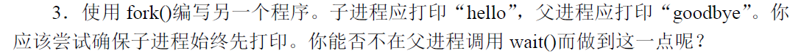
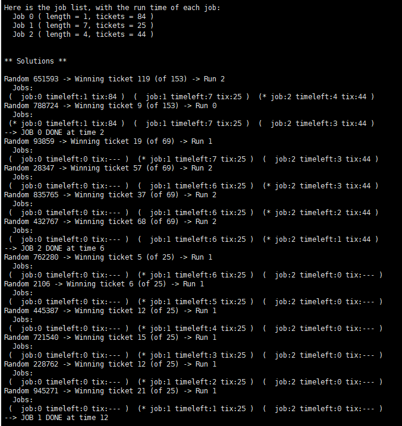
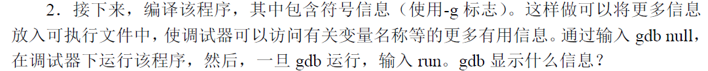
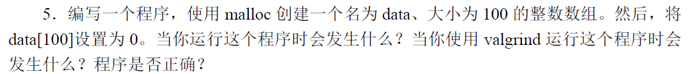
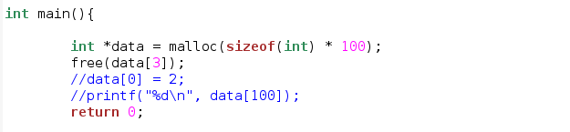
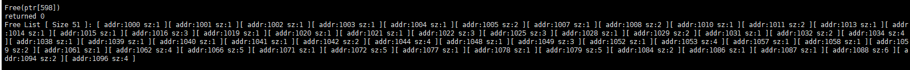
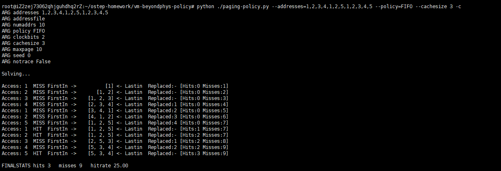

- [04章 抽象](#04----)
- [05 插叙：进程API](#05------api)
- [07 进程调度](#07-----)
- [08 多级反馈队列](#08-------)
- [09 调度 比例份额](#09--------)
- [14 插叙 内存操作API](#14--------api)
- [15 机制 地址转换](#15--------)
- [16  分段](#16----)
- [17 空闲空间管理](#17-------)
- [18 分页 介绍](#18------)
- [19 分页 快速地址转换（TLB）](#19-----------tlb-)
- [22 超越物理内存 策略](#22----------)

# 04章 抽象

作业

1. CPU利用率100%，因为只有CPU在运行，没有I/O操作.

2. 10个操作，结果如图：

3. 现在效率提高了，因为在等待I/O操作的同时，进行了CPU操作。

4. 此时CPU浪费了，因为I/O操作的时候，CPU没有进行有效操作。

5. 现在效率提高了，因为在等待I/O操作的同时，进行了CPU操作

6. 

7.  当I/O完成时，会立即运行发出它的进程，这样的效率也会更高

8. 当采用$-S \ SWITCH\_ON\_IO$标志时，进程运行I/O操作时，会切换到另一个进程，此时可以更好的利用CPU.

   当采用$-I \ IO\_RUN\_IMMEDIATE$标志时，当I/O完成时，会立即运行发出它的进程，这样的效率也会更高，因为发出I/O的进程很可能还会有I/O操作需要进行，因此这样效率更高。

# 05 插叙：进程API

​	代码：

​        结果：

​         子进程和父进程改变值时，它们各自改变，相互不影响。

​                          父子进程访问同一个文件描述符，父子进程都会在同一个文件中写入。

​                         可以通过文件描述符来作为父子通信的桥梁，从而不使用wait，也可以保证父子进程的运行顺序。

​                     父进程返回子进程的进程号，子进程返回0

​                      waitpid是可以等待确定的子进程结束。而不是任意一个子进程进程结束，当父进程有多个子进程时，waitpid可以起作用。

​                     将不会有任何输出内容。

# 07 进程调度

见书

# 08 多级反馈队列

2. 

 规则4a和4b,结果：

 每50ms提升优先级结果：

  不采用时间片，而是采用队列配额：

  结果：

# 09 调度 比例份额

1. 

2. 

​                   工作0可能会运行，从平均的角度来看会运行0.1个时间片，会造成饥饿。

3. 

​           不公平因子基本趋近于1，比较公平。

# 14 插叙 内存操作API 

1. 

​                          运行时，什么都没有发生。

2. 

​						显示正常退出。

3. 

​						结果显示free没有执行，因此可知释放NULL指针的代码在编译器中进行了优化，没有执行free函数。

4. 

 				运行时不会报错，用gdb也不会报错，但是个valgrind可以发现有内存泄漏

5.  

​					运行时，这个程序不会报错。当使用valgrind时，可以发现该程序有一个错误的写和内存泄漏。

6.

​						运行时不会报错, 用valgrind发现有一个错误的写。

7.

​						此时直接在编译过程中就会报错。

# 15 机制 地址转换

见书上

# 16  分段

见书上

# 17 空闲空间管理

1. 

2. 

​							碎片变多了，能分配的最大块的容量减少了。

3. 

搜索空闲块的时间变快了，不需要遍历整个空闲链表，只需要找到第一个满足的空闲块即可。

4

​		对于首次适配方法而言，SIZESORT排序是最快的，因为此时可以大大减少搜索空闲块的时间。

5

不合并：

合并：

明显不合并碎片数量增大，而且空闲列表的分配量也会增大，因为碎片太小不能满足分配需求，所以需要从堆上继续分配空间。

# 18 分页 介绍

1. 

​				页表大小随着地址空间的增长而增长。 随着页面大小的增大而减少。

​				因为 页表大小 ×  页大小 ==  地址空间。

​				当使用较大的页时，容易产生内部碎片，而且每次加载页时时间也会变长。

2. 

会使得虚拟地址能更多的有效映射到物理内存区域，也就是可使用的虚拟地址空间增多。

-u 0

-u 100

3.

第一组页的大小太小，不容易存储有效数据。

第三组页的大小太大， 容易造成内部碎片。

4

当地址空间大于物理内存时，有些页数据可以交换到磁盘上，这取决于交换空间容量的限制。

# 19 分页 快速地址转换（TLB）

1.

还是只需要一个寄存器李定位页目录。

2.

需要三次内存引用，第一次是页目录页，第二次是页表页，第三次是数据。

3

缓存页表中的页表项

# 22 超越物理内存 策略

1. 

OPT策略最佳，LRU次之， FIFO再次

2. 

对于FIFO策略：构造0,1,2,3,4,5,0,1,2,3,4,5序列即可

此时采用OPT策略为：

而继续采用FIFO策略，缓存增加为6即可：

对于LRU策略：也同FIFO策略一样。

补充：

缓存增大时：命中率反而下降

3. 

对于随机序列的负载，任何策略的效果都基本一样，除了OPT，它们的命中率都只与缓存容量大小有关，与策略无关。这也很好理解，因为随机序列无法根据历史信息预测未来，因此LRU算法也会失效。

4. 

CLOCK时钟位越多，保留的历史信息越多，越趋近于LRU。