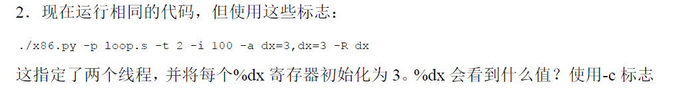
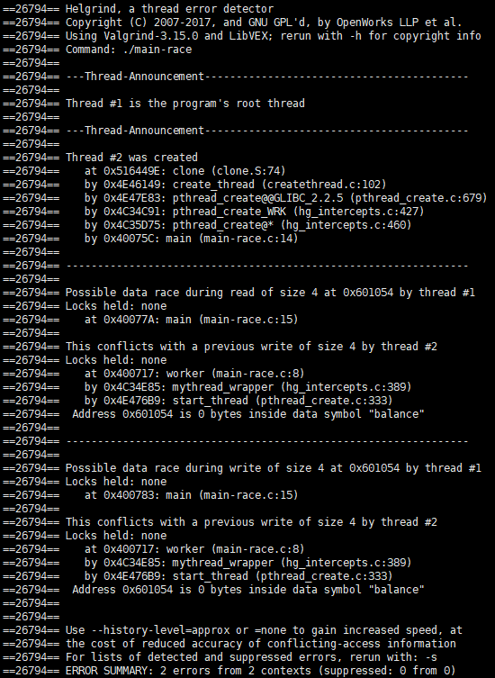
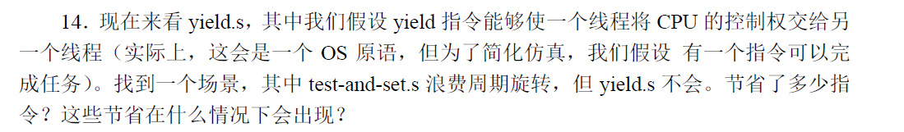
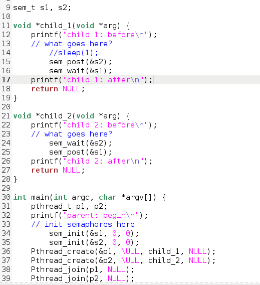

- [26 并发 介绍](#26------)
- [27 插叙 线程API](#27------api)
- [28 锁](#28--)
- [29 基于锁的并发数据结构](#29-----------)
- [30 条件变量](#30-----)
- [31 信号量](#31----)
- [32 常见并发问题](#32-------)
- [33 基于事件的并发](#33--------)

# 26 并发 介绍

1. 


2. 




多个线程的存在不会影响计算，不存在竞态条件，因为每个线程的寄存器是独立的，每次线程切换时，恢复线程上下文时，会将上次保留的寄存器值取出来恢复。

3. 


不会改变


4. 


5. 


因为bx为3，x的最终值为6


6. 


观察可知，


该区域是临界区，中断发生在该区域时，会引起麻烦。


7. 


-i = 1


-i = 2


-i = 3


8. 


当 i < 100 *6 时，-i标志为3的倍数时，是正确的结果

当i >= 100 * 6时都是正常的结果。

因为整个循环代码为6行，临界区代码为3行


因此要两个线程的临界区访问不冲突，则i应当满足正好$i=3(mod \ 6)$,此时两个线程交替访问临界区，因此结果是正确的。


9. 


线程0在循环的等待，浪费了CPU，中断间隔越长，来个费的CPU时间越多。


# 27 插叙 线程API


1. 



报告了竞态条件出现的位置，观察反汇编代码可知：


2. 

当去掉一行冲突代码时：


结果：


当对共享变量加锁：


结果：


3、 4. 


加锁顺序导致了死锁产生。

5. 


该程序因为加了全局互斥锁，是不会出现死锁情况的，但是用helgrind来检测时，仍然报出了死锁问题。因此，我们可以知道检查死锁的情况是复杂的，死锁不容易非常准确的侦探出来，该工具采用了保守的策略。

6.


当父进程执行完16行时，此时如果子进程还需要长时间运行，则父进程使用的CPU全部浪费在while循环中了，CPU没有得到有效的利用。


7


报告了竞态条件出现的位置，实际上这个代码应该是没有问题的，如果while改为if，那确实是有问题的。

8. 


这个程序时正确的，且性能更高，因为父进程当没有满足条件运行时，它会休眠，放弃CPU，因此提高了CPU的利用率，采用条件变量来保证父子进程运行的先后顺序。采用全局互斥锁，来保证对共享变量done的正确访问。


如果没有互斥锁，则可能在执行完36行的时候，被中断，子进程运行，此时done为1了，而且唤醒休眠进程，但是由于父进程现在还没接诶进入休眠，因此父进程没有运行。当子进程运行结束，父进程从37行运行，此时父进程进入休眠队列，因为子进程以及运行结束了，所以父进程不会再被唤醒，因此问题出现了。


# 28 锁


通过判断flag的值，来实现锁。


2. 


能正常工作


3. 


代码循坏的给count值加1。此时答案还是正确的


4. 


当-i的值为11的倍数时，结果是正确的，因为整个代码就是11行，因此不会产生竞态条件。


否则，若是在第1002时产生中断，则两个进程的锁标志都会是1，因此可能会造成对1004-1006行的冲突访问。


5. 


采用xchq指令原子的交换寄存器ax和内存区域mutex的值。


6. 


代码都可以按照预期正常工作。因为当一个线性占有锁时，另一个线程中断时，会不停的消耗CPU，此时CPU被浪费，直到操作系统调度另一个线程时，才会继续运行新的进程，因此一直在循环等待处的线程的占用的CPU时间被浪费。


7. 


正确的事情发生了。


8. 


9. 


看到了结果不对。


11. 


结果是正确的


13. 


代码运行时间明显变长。


14. 




运行时间与13相比，明显速度加快。不会浪费时间在自旋等待锁。


15. 


多了一次测试，可以更少的执行xchg指令，而xchg指令需要消耗3个CPU周期，mov指令只需要一个CPU周期，因此效率更高。

# 29 基于锁的并发数据结构


# 30 条件变量


2 即使缓冲区在增大，一个生产者的生产量在增大，num_full 一直在0和1之间变化，说明每次生产一个，就会被消费一个


当消费者以-C， 0,0,0,0,0,0,1在运行时，此时消费者在c6行会sleep，因此消费速度减慢，所以NF的值会增大


此时缓冲区大部分时间都会一直处于满的状态。


4. 


运行结果为：


5. 缓冲区增大：时间会缩短，因为此时生产者生产的速度会增大，因为有三个大小的缓冲区可以放生产物品。


6. 


此时速度会明显加快。因为此时消费者把锁释放了，其他消费者可以继续进行消费。


7.  增大缓冲区时，此时速度同m=1时基本保持不变。说明生产者的速度可以跟上消费者的速度，速度的制约主要来源于锁的释放。


8.  只有一个消费者和一个生产者时，该程序时可以正常工作的，因为生产者只会唤醒消费者，消费者只会唤醒生产者。


9. 


当有一个生产者，两个消费者时，且缓冲区为1，此时消费者消费完生产者生产的物品后，又唤醒了消费者，而此时没有生产者继续生产，因此消费者一直陷在阻塞中。


10. 


11. 

```
./main-two-cvs-while-extra-unlock -p 1 -c 2 -m 10 -l 10 -v -C 0,0,0,0,1,0,0:0,0,0,0,0,0,0
```


第一个消费者仅仅消费一个，公平性不够。


# 31 信号量


1. 


2. 



3. 


count来计算当前已经有多少进程在阻塞了

信号量s2保证临界区count变量的互斥访问

当最后一个进程执行完before后，通过s1唤醒其他阻塞的进程。


4. 读写锁的实现


5. 


多用一把读者锁，当写者准备写时，先获取读者锁，此时后续的读者因为得不到读者锁，因此无法阻塞写者了，所以不会造成写者的饥饿。

6. 实现没有饥饿的互斥锁


原理参考：


# 32 常见并发问题


1. 


2. 

当l增大时，会有死锁的情况发生。但不是总是发生，有一定的概率发生。

3.  当只有0个或1个线程时，就必定不会有死锁。

4. 

因为当源地址和目地址相同时，加两次锁，则必定会死锁。


5. 


是0.02s

增加线程数时：时间会增加


增加loop时：


时间也会增加。

6.


当每个线程的参数是不同的向量时，运行速度会加快，因为没有锁的相互竞争。

7.

有必要，因为第二次调用的时候，后续有释放该锁的操作。


$vector-try-wait.c$和$vector-global-order.c$相比，运行效率基本一致。


retry的值随着n和l增加，增加。

8. 


效率比其他方法要更低，加p和不加p的差别不是很显著。


9. 


它采用fetch and add指令来替换锁。


10.  


效率明显最低。


# 33 基于事件的并发

