- [《Operating Systems:Three Easy Pieces》虚拟化—CPU](#-operating-systems-three-easy-pieces-----cpu)
- [4 抽象： 进程](#4-------)
  * [4.1 抽象：进程](#41------)
  * [4.2 进程API](#42---api)
  * [4.3 进程创建：更多细节](#43----------)
  * [4.4 进程状态](#44-----)
  * [4.5 数据结构](#45-----)
  * [4.6 小结](#46---)
- [5 插叙： 进程API](#5-------api)
- [6 机制: 受限直接执行](#6-----------)
  * [6.1 基本技巧： 受限直接执行](#61-------------)
  * [6.2 问题1：受限制的操作](#62---1-------)
  * [6.3 问题2： 在进程之间切换](#63---2---------)
    + [协作方式](#----)
    + [非协作方式](#-----)
    + [保存和恢复上下文](#--------)
    + [6.5 小结](#65---)
- [789 进程调度介绍、调度：多级反馈队列、 调度：比例份额](#789--------------------------)
  * [调度指标](#----)
  * [调度策略](#----)
  * [调度： 多级反馈队列](#----------)
  * [调度：比例份额](#-------)
- [10 多处理器调度](#10-------)
  * [10.1 背景：多处理器架构](#101----------)
  * [10.2 别忘了同步](#102------)
  * [10.3 最后一个问题： 缓存亲和度](#103--------------)
  * [10.4 单队列调度](#104------)
  * [10.5 多队列调度](#105------)
  * [10.6 Linux多处理器调度](#106-linux------)
  * [10.7 小结](#107---)
- [CPU虚拟化小结](#cpu-----)

#  《Operating Systems:Three Easy Pieces》虚拟化—CPU

操作系统将物理资源（处理器、内存或磁盘）转换为更通用的、更强大且更易于使用的虚拟形式。因此，有时将操作系统称为 **虚拟机**。将单个CPU转换为看似无限数量的CPU，从而让许多程序看似同时运行，这就是所谓的**虚拟化CPU**。

现代机器提供的物理内存模型非常简单，内存就是一个字节数组。程序将所有数据结构都保存在内存中，并通过各种指令来访问他们。每次读取指令都会访问内存。每个进程访问自己的私有地址空间（也称为地址空间），操作系统以某种方式映射到机器的物理内存上，这称为 **虚拟化内存**。

在系统内存中，数据容易丢失，因为DRAM设备是易失性的存储方式。因此，我们需要硬件和软件来 **持久**的存储数据。操作系统中管理磁盘的软件通常称为 **文件系统**。因此它可以负责以可靠高效的方式，将用户创建的任何文件存储到系统的磁盘上。

**操作系统取得CPU、内存或磁盘等物理资源，并对它们进行虚拟化。它处理与并发有关的麻烦且棘手的问题。它持久地存储文件，从而使它们长期安全。**

操作系统的目标是提供**高性能**、在OS和应用程序之间提供**保护**，保护是操作系统基本原理之一的核心，这就是隔离。操作系统还力求提供高度的**可靠性**。

# 4 抽象： 进程

进程就是运行中的程序。操作系统通过虚拟化CPU提供有许多CPU的假象，通过让一个进程只运行一个时间片，然后切换到其他进程，提供了该假象，这也就是**时分共享技术**，允许用户并行多个并发进程，潜在的开销是性能损失。

实现CPU的虚拟化，操作系统需要一些低级机制和一些高级智能。 将低级机制称为 **机制**，机制是一些低级方法或协议，实现了所需的功能，例如上下文切换。

在机制之上，操作系统中有一些智能以 **策略**的形式存在，策略是在操作系统内做出某种决定的算法，例如调度策略。

## 4.1 抽象：进程

**进程**就是操作系统为正在运行的程序提供的抽象。进程的机器状态包括**可以访问的内存**（地址空间）、寄存器、当前打开的文件列表等。

## 4.2 进程API

## 4.3 进程创建：更多细节

操作系统运行程序做的事情有：

1. 第一件事是将 **代码和所有静态资源**加载到内存中，加载到进程的地址空间中。现代操作系统 **惰性**执行该过程，即**仅在程序执行期间需要加载的代码或数据片段，才会加载。**

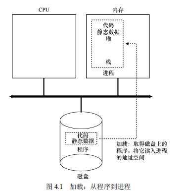

2. 操作系统为程序运行时栈分配内存。
3. 为程序的堆运行分配内存。
4. 执行初始化任务，特别是I/O相关的任务，例如每个进程都有3个打开的文件描述符，标准输入、输出和错误。
5. 启动程序，在入口处运行，即main()，通过跳到main()例程，OS将CPU的控制器转移到新创建的进程中，从而程序开始执行。

## 4.4 进程状态

**运行，就绪，阻塞**。有时候还有**初始状态**，表示进程在创建时处于的状态。

还有**僵尸状态**，表示进程处于已退出但尚未清理的最终状态，它允许其他进程（通常是父进程）检查进程的返回代码，查看刚完成的进程是否成功执行。

完成后，父进程将进行最后一次调用，等待子进程的完成，并告诉操作系统可以清楚这个正在结束的进程的所有相关的数结构。

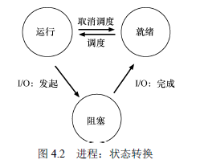

## 4.5 数据结构

操作系统是一个程序，通过一些关键的数据结构来跟踪各种相关信息。

## 4.6 小结

本章介绍了进程，后续将讨论操作系统如何实现进程所需的机制和调度策略。

# 5 插叙： 进程API

主要包括有fork(), exec()和wait(), kill()调用来实现。

shell通过调用fork()创建新进程，并调用exec()来执行可执行程序，调用wait()等待该命令完成。子进程执行结束后，shell从wait()返回并再次输出一个提示符，等待用户输入下一条命令。

# 6 机制: 受限直接执行

## 6.1 基本技巧： 受限直接执行

直接执行：只需直接在CPU上运行程序即可。

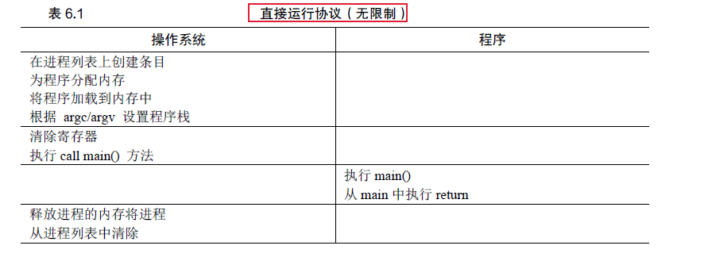

但是直接执行，操作系统无法保证程序不做任何我们不希望它做的时，也无法让进程停下来切换到另一个进程。

## 6.2 问题1：受限制的操作

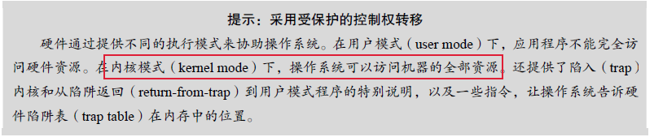

将处理器模式分为用户模式和内核模式，用户程序执行**系统调用**来执行某种特权操作。执行系统调用，程序执行特殊的 **陷阱**指令，该指令同时跳入内核并将特权级别提升到内核模式。

内核通过在系统启动时设置**陷阱表**来实现，从而陷阱知道在OS内执行哪些代码。**操作系统做的第一件事就是告诉硬件在发生某些异常事件时要执行哪些代码**。

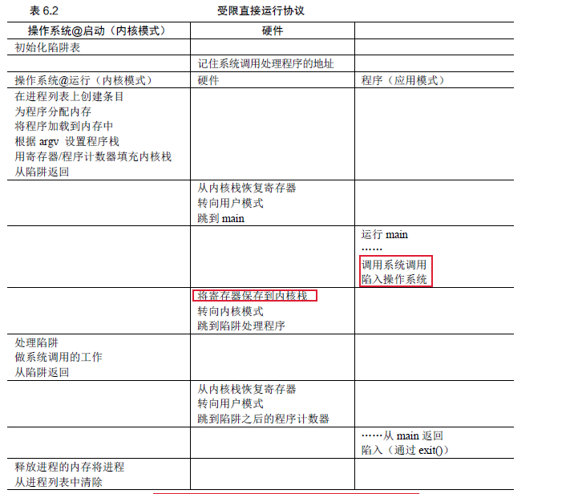

LED协议有两个阶段：

1. 内核初始化陷阱表，并且CPU记住其位置供随后使用。内核通过特权指令来执行此操作。
2. 从陷阱返回指令开始执行进程前，内核设置一些内容。会将CPU切换到用户模式执行该进程。

## 6.3 问题2： 在进程之间切换

### 协作方式

大多数进程通过**系统调用**，将CPU的控制权转移给操作系统。

### 非协作方式

利用 **时钟中断**操作系统重新获得控制权。硬件在发生中断时要为正在运行的程序保存足够的状态，以便随后从陷阱返回指令能够正确恢复正在运行的程序。

### 保存和恢复上下文

上下文切换： 操作系统为正在执行的进程保存一些寄存器值（到它的内核栈），并为即将执行的进程恢复一些寄存器值。

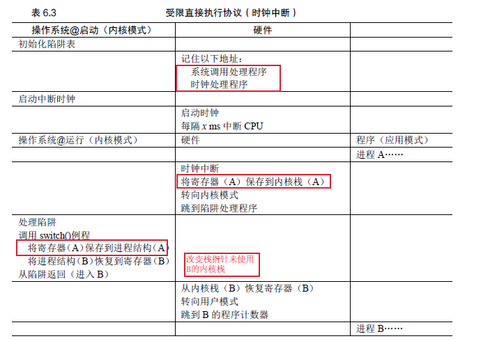

此协议中，有两种类型的寄存器保存/恢复：

1. 发生时钟中断的时候，运行进程的用户寄存器由硬件隐式保存，使用该进程的内核栈
2. 操作系统决定由A切换到B时，内核寄存器被软件明确保存，这次被存储到该进程的进程结构的内核中。

### 6.5 小结

实现CPU虚拟化的关键底层机制是 **受限直接执行**。基本思路很简单：就让你想运行的程序在CPU 上运行，但首先确保设置好硬件，以便在没有操作系统帮助的情况下**限制**进程可以执行的操作

# 789 进程调度介绍、调度：多级反馈队列、 调度：比例份额

## 调度指标

周转时间：它是一个**性能**指标
$$
T_{周转时间} = T_{完成时间} - T_{到达时间}
$$
响应时间：它是一个公平指标，反应系统的交互性。
$$
T_{响应时间} = T_{首次运行} - T_{到达时间}
$$

​				
​					
​						

## 调度策略

1. **先进先出调度（FIFO）**：很简单，易于实现，平均周转时间高。

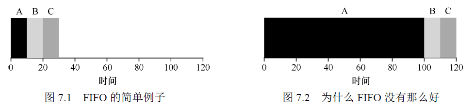

2. **最短任务优先（SJF）**：基于所有工作同时到达的假设，以及只考虑周转时间。SJF调度是最优算法。非抢占式。

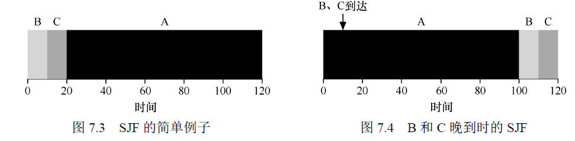

3. **最短完成时间优先（STCF）**：**也称为抢占式最短作业优先（PSTF）**。**周转时间性能好。**

   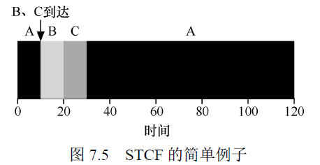

4. **轮转（RR）**:在一个时间片内运行一个工作，然后切换到运行队列中的下一个任务，而不会运行一个任务直到结束。时间片长度必须是时钟中断周期的倍数。**响应时间性能好。**

   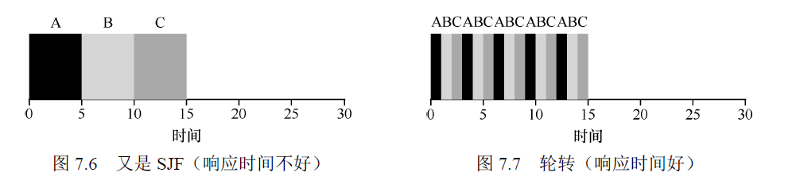

时间片长度至关重要，越短，RR在响应时间上表项越好，然而，上下文切换成本增大，影响整体性能。上下文切换的成本不仅仅有来自**保存和恢复少量寄存器**的操作系统操作。在程序运行时，它们在**CPU高速缓存、TLB、分支预测器和其他片上硬件**中建立了大量的状态，在切换时，这些状态都会被刷新，这可能导致显著的性能成本。

**限制**：以上4中策略都需要调度程序知道每个工作的长度，但实际上操作系统可能无法得知。

## 调度： 多级反馈队列

多级反馈队列，它要优化周转时间，还需要降低响应时间。

MLFQ中有许多独立的队列，每个队列有不同的优先级。任何时刻，一个工作只能存在于一个队列中。MLFQ总是执行优先级高的工作。

**多级反馈队列(MLFQ)**的规则:

1. **如果A的优先级 > B的优先级， 运行A**
2. **如果A的优先级 = B的优先级， 轮转运行A和B**
3. **工作进入系统时，放在最高优先级（最上层队列）**：假设工作刚开始都是短工作
4. **一旦工作用完了其在某一层中的时间配额（无论中间主动放弃了多少次CPU），就降低其优先级（移入低一级队列）**：防止调度程序被愚弄
5. **经过一段时间S, 就将系统中所有工作重新加入最高优先级队列**: 避免饥饿问题

每层队列的时间片长度可以不一样，一般低优先级的队列时间片长一点，因为更多的是CPU密集型工作。

多级反馈队列它不需要对工作的运行方式有先验知识，而是通过观察工作运行给出对应的优先级。

## 调度：比例份额

比例份额调度程序有时也称为公平份额调度程序。基于一个简单的想法：调**度程序的最终目标，是确保每个工作获得一定比例的CPU 时间**，而不是优化周转时间和响应时间。

**彩票调度**：每隔一段时间，都会举行一次彩票抽奖，来确定接下来应该运行哪个进程。

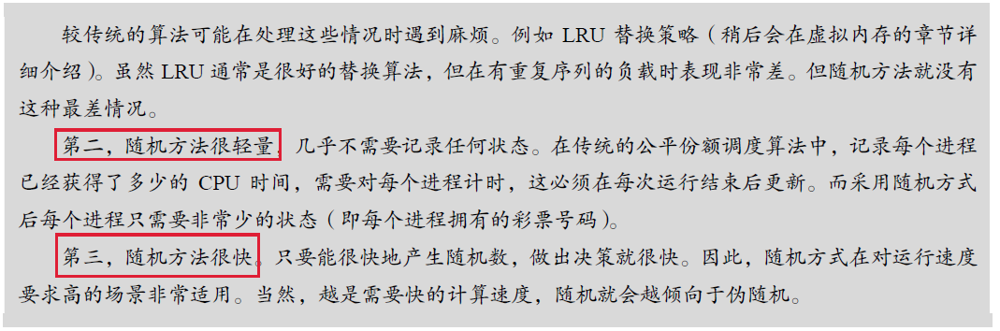

缺点：

1. 如何给进程分配彩票数是非常棘手的。
2. 不能很好的适合I/O。

因此，没有得到广泛的应用。

# 10 多处理器调度

## 10.1 背景：多处理器架构

多处理器与单CPU之间区别的核心在于对 **硬件缓存**的使用， 以及多处理器之间 **共享数据的方式**。

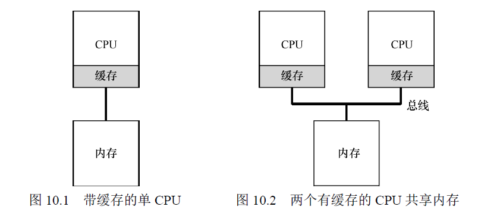

多CPU情况下，缓存要更复杂。存在 **缓存一致性问题**。CPU1上的程序读了内存地址A处的数据，并且修改了数据，此时只是将CPU1处的缓存更新为新值D‘，将数据写回内存较慢，系统会稍后再做，而此时CPU2的程序读取地址A处的数据，读的是旧值D。

**硬件提供了基本解决方案**：通过监控内存访问，硬件保证获得正确的数据，并保证共享内存的唯一性。采用的方式是使用 **总线窥探**。每个缓存都通过监听链接所有缓存和内存的总线，来发现内存访问。

## 10.2 别忘了同步

跨CPU访问共享数据或数据结构时，需要使用互斥原语（比如锁），才能保证正确性。

## 10.3 最后一个问题： 缓存亲和度

一个进程在某个CPU上运行时，会在该CPU的缓存中维护许多状态。**下次该进程在相同CPU上运行时，由于缓存中的数据而执行得更快**。因此多处理器调度应该考虑到这种缓存亲和性，并尽可能将进程保持在同一个CPU上。

## 10.4 单队列调度

**单队列多处理器调度（SQMS）**：把所有需要调度的工作放入一个单独的队列中，最大的优点是简单。

**缺点**：

1. **缺乏可扩展性**：为了保证在多CPU上正常运行，调度程序的开发者需要在代码中加锁开保证原子性。锁可能带来巨大的性能损失。
2. **缓存亲和性**：每个CPU都简单从全局共享的队列中选择下一个工作秩序，因此每个工作都不断在不同的CPU之间转移，与缓存亲和性的目标背道而驰。

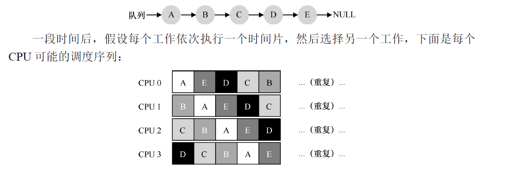

通过引入亲和度机制，保证一些工作的亲和度的同时，需要牺牲其他工作的亲和度来实现负载均衡。

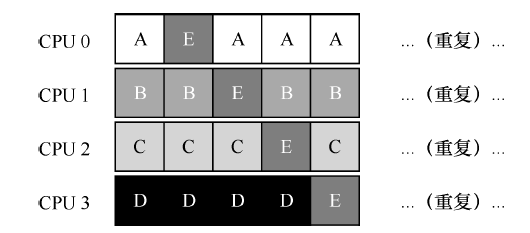

## 10.5 多队列调度

**多队列多处理器调度（MQMS）**：包含多个队列，每个队列可以使用不同的调度规则，比如轮转或其他算法。

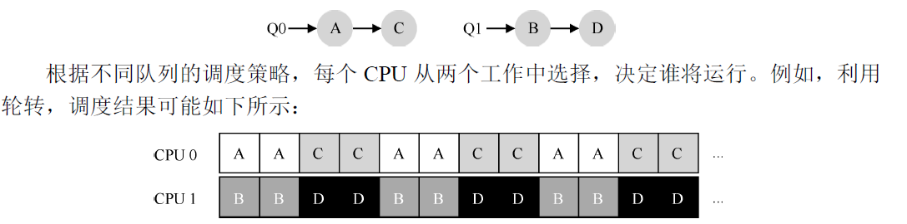

优点：

1. **天生具有可扩展性**：队列的数量会随着CPU的增加而增加
2. **良好的缓存亲和度**：所有的工作都保持在固定的CPU上

缺点：

1. **负载不均**：客服负载不均采用 **迁移** 的技术。通过工作的跨CPU迁移，可以真正实现负载均衡。系统通过 **工作窃取**的方法来决定何时发起迁移。工作量较少（源）队列不定期地“偷看”其他（目标）队列是不是比自己的工作多。如果目标队列比源队列（显著地）更满，就从目标队列“窃取”一个或多个工作，实现负载均衡。

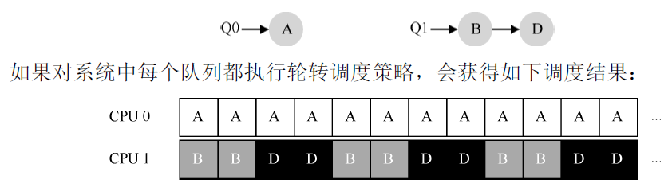

## 10.6 Linux多处理器调度

存在不同的3种调度程序，没有达成共识。

1. **O(1)调度程序：**采用多队列，基于优先级的，类似于MLFQ，随时间改变进程的优先级，然后调度最高进程，实现调度目标。
2. **完全公平调度程序（CFS）：**采用多队列，确定的比例调度方法
3. **BF调度程序（BFS）：**采用单队列，也基于比例调度，采用更复杂的方案，称为最早最合适虚拟截止时间优先算法（EEVEF）。

## 10.7 小结

多处理器调度的不同方法有单队列的方式和多队列的方式，单队列构建简单，负载均衡较好，在扩展性和缓存亲和度有固定的缺陷。

对多队列方式很好的扩展性和缓存亲和度，但实现负载均衡却很困难。

# CPU虚拟化小结

首先，我们了解了操作系统如何虚拟化CPU。为了理解这一点，必须了解一些重要的机制：**陷阱和陷阱处理程序，时钟中断以及操作系统和硬件在进程间切换时如何谨慎地保存和恢复状态。**然后了解了操作系统如何在单处理器和多处理器上调度进程的不同策略。

