- [深入理解计算机系统第一章读书笔记](#深入理解计算机系统第一章读书笔记)
  * [计算机系统漫游](#计算机系统漫游)
    + [1.1 信息就是位 + 上下文](#11-信息就是位-+-上下文)
    + [1.2 程序的翻译过程](#12-程序的翻译过程)
    + [1.3 编译系统如何工作的](#13-编译系统如何工作的)
    + [1.4 处理器读并解释储存在内存中的命令](#14-处理器读并解释储存在内存中的命令)
      - [1.4.1 系统的硬件组成](#141-系统的硬件组成)
      - [1.4.2  hello程序为例](#142-hello程序为例)
    + [1.5 高速缓存（cache）](#15-高速缓存（cache）)
    + [1.6 储存设备形成层次结构](#16-储存设备形成层次结构)
    + [1.7 操作系统管理硬件](#17-操作系统管理硬件)
      - [1.7.1 进程](#171-进程)
      - [1.7.2 线程](#172-线程)
      - [1.7.3 虚拟内存](#173-虚拟内存)
      - [1.7.4 文件](#174-文件)
    + [1.8 系统之间利用网络通信](#18-系统之间利用网络通信)
    + [1.9 重要主题](#19-重要主题)
      - [1.9.1 Amdahl定律](#191-Amdahl定律)
      - [1.9.2 并发和并行](#192-并发和并行)
      - [1.9.3 计算机中抽象的重要性](#193-计算机中抽象的重要性)
    + [小结](#小结])
  * [体会](#体会)

# 深入理解计算机系统第一章读书笔记

## 计算机系统漫游

### 1.1 信息就是位+上下文

​      源程序实际上就是一个由值**0**和**1**组成的位序列，8个位被组织成一组，称为字节。每个字节表示程序中的某些文本字符。目前大部分都用ASCII标准来表示文本字符，如图1-1所示

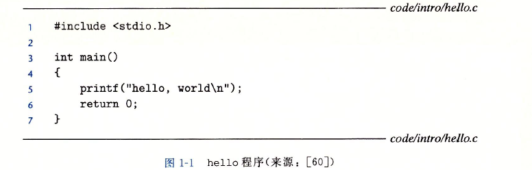

每个文本行都是以换行符**\n**来表示的，***hello.c*** 只由ASCII字符构成，称为文本文件，实际上底层都是二进制文件, 都是由**0**和**1**组成。

### 1.2 程序的翻译过程

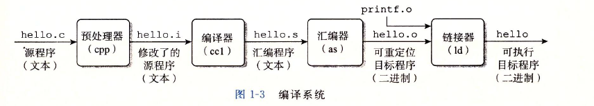

***gcc*** 编译器驱动程序可完成上述过程，执行这四个阶段的的程序（预处理器、编译器、汇编器和链接器)一起构成了编译系统。

1. **预处理阶段**：替换头文件和宏，**#include<stdio.h>**命令告诉预处理器读取系统头文件***stdio.h***的内容，并把它直接插入文本中，结果得到了另一个C程序，以***hello.i*** 作为文件扩展名。

2. **编译阶段**：编译器将文本文件***hello.i*** 编译成文本文件***hello.s***，它包含一个汇编语言程序，该程序包含***main***函数的定义：
3. 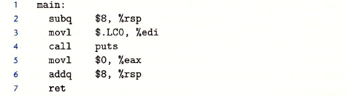

3. **汇编阶段**:   汇编器将***hello.s***文件翻译成机器语言指令，将这些指令打包成**可重定位目标程序**的格式，保存在***hello.o***中。

4. **链接阶段**:   在***hello.c***程序调用了***printf***函数，它是每个C编译器都提供的标准C库中的一个函数。***printf***函数存在于一个名为***printf.o***的单独的预编译好了的目标文件中。链接器将该文件合并到***hello.o***中,  结果就得到可执行文件，可以加载到内存中执行。

### 1.3 编译系统如何工作的

1. 优化程序性能

2. 理解链接时出现的错误
3. 避免安全漏洞

### 1.4 处理器读并解释储存在内存中的命令

#### 1.4.1 系统的硬件组成

1. **总线**：贯穿整个系统的是一组电子管道，称为总线，它**携带信息字节**并负责在各个部件间传递, 现在机器字长要是是32位或64位，也就会我们通常所说的地址。

2.  **I/O设备**：输入输出设备，键盘，鼠标，显示器通过控制器或适配器与I/O总线相连接。

3. **主存**：在处理器执行程序时，用来存放**程序和数据**。在物理上，由一组动态随机存取存储器(DRAM)芯片构成。从逻辑上，存储器是一个**线性的字节数组**，每个字节都有唯一的地址。

4. **处理器（CPU）**: 是解释存储在主存中指令的引擎，其核心是一个大小为一个字的储存设备（或寄存器），称为**程序计数器（PC）**。在任何时刻，PC都指向主存中的某条机器语言指令（即含有该条指令的地址）。

   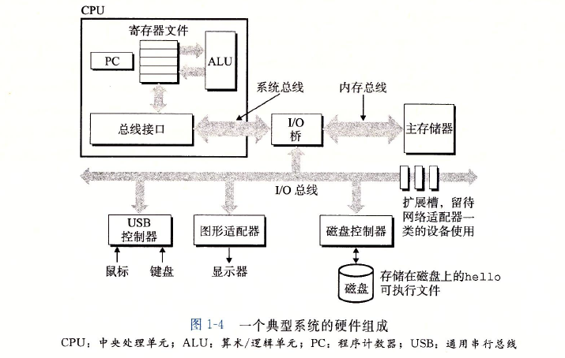  

**CPU指令的操作**

1. 加载：从主存复制一个字节或者一个字到寄存器，以覆盖原来寄存器的内容

2. 存储：从寄存器复制一个字节或者复制一个字到主存的某个位置，来覆盖这个位置上的原有内容

3. 操作:   把两个寄存器的内容复制到ALU，ALU对这两个字做算术运算，并将结果保存到一个寄存器中，来覆盖寄存器原有的内容

4.  跳转:  从指令本身中抽取一个字，并将这个字复制到程序计算器（PC）中，来覆盖PC中原有的值

   

#### 1.4.2  hello程序为例 ####

1. shell程序输入“./hello”后，将该命令逐一读到寄存器中，再放入内存中

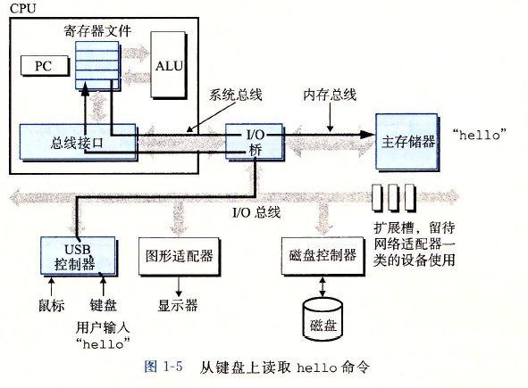

2. 加载可执行的***hello***文件，将其代码和数据**从磁盘复制到主存**。利用直接存储器存取(***DMA***)技术，数据可以不通过处理器而直接从磁盘到达主存。

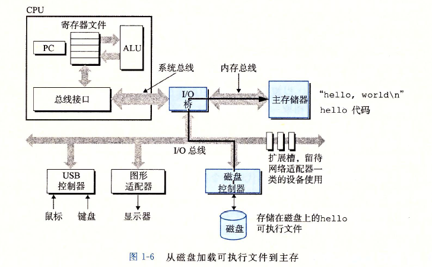

3. 执行***hello***程序的机器语言指令，将显示字符“***hello world\n***”从内存复制到寄存器，再从寄存器复制到显示设备。

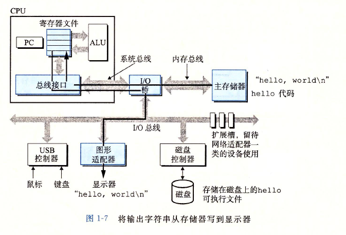

hello中的程序和数据加载到主存后，CPU开始执行hello程序的main程序中的机器语言指令。

### 1.5 高速缓存（cache）

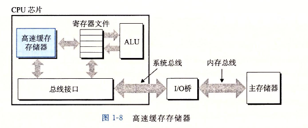

利用了高速缓存的局部性原理，系统可以获得一个很大的存储器，同时访问速度也很快。

### 1.6 储存设备形成层次结构

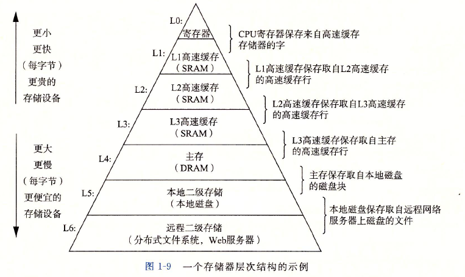

### 1.7 操作系统管理硬件

**操作系统**：应用程序和硬件之间插入的一层软件

**基本功能：**

1. 防止硬件被失控的应用程序调用

2. 向应用程序提供简单一致的机制来控制复杂而又通常大不相同的低级硬件设备

操作系统通过**进程、虚拟内存、和文件**来实现基本功能

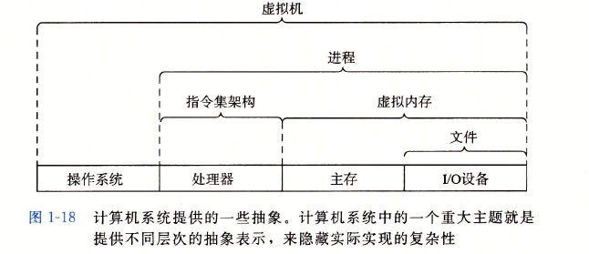

文件是对I/O设备的虚拟， 虚拟内存是对主存和I/O设备的虚拟， 进程是对处理器、主存和I/O设备的虚拟。

#### 1.7.1 进程

**进程：是操作系统对一个正在运行的程序的一种抽象**。

每个进程都好像在独占的使用硬件，操作系统在实现进程切换的机制是**上下文切换**。操作系统保持跟踪进程运行所需的所有信息，这种状态，也就是上下文，

包括PC和寄存器文件的当前值，以及主存的内容。

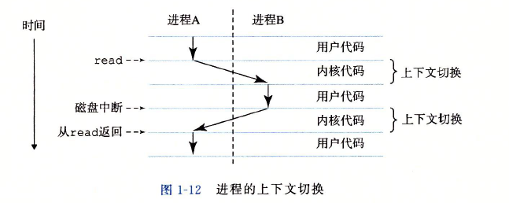

进程和进程的切换时操作系统内核实行**系统调用**来实现的，保存当前进程的上下文，恢复新进程的上下文。

#### 1.7.2 线程

一个进程可以由**多个线程**的执行单元组成，每个线程都运行在**进程的上下文**中，并共享同样的代码和全局数据。多线程比多进程更容易共享数据，因此线程一般来说都比进程更高效。

#### 1.7.3 虚拟内存

虚拟内存为每个进程提供了一个假象， **即每个进程都在独立的使用内存**。每个进程看到的内存都是一致的，为虚拟地址空间。

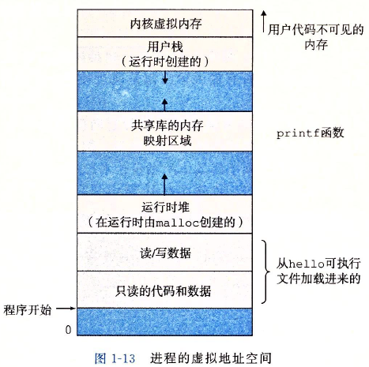

程序代码和数据，堆，共享库，栈，内核虚拟内存。

#### 1.7.4 文件

文件就是字节序列，**每个I/O设备，包括磁盘，键盘，显示器，甚至网络都可以看成文件**。

### 1.8 系统之间利用网络通信

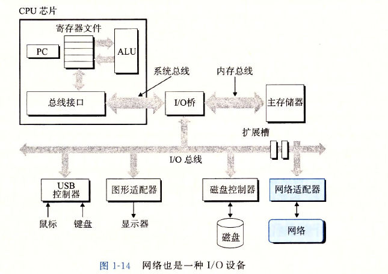

### 1.9 重要主题

#### 1.9.1 Amdahl定律

我们对系统的某一部分加速时，其对系统的整体性能的影响取决于该部分的重要性和加速程度
$$
T_{new} = (1-\alpha)T_{old} + (\alpha T_{old})/k = T_{old}[(1-\alpha) + \alpha/k]
$$
由此可以加计算出加速比 $ S = T_{old}/T_{new}$为
$$
S = \frac{1}{(1-\alpha) + \alpha/k}
$$
**要想显著加速整个系统，必须提升全系统中相当大的部分的速度。**

#### 1.9.2 并发和并行

线程级并发，指令级并行，单指令和多数据并行。

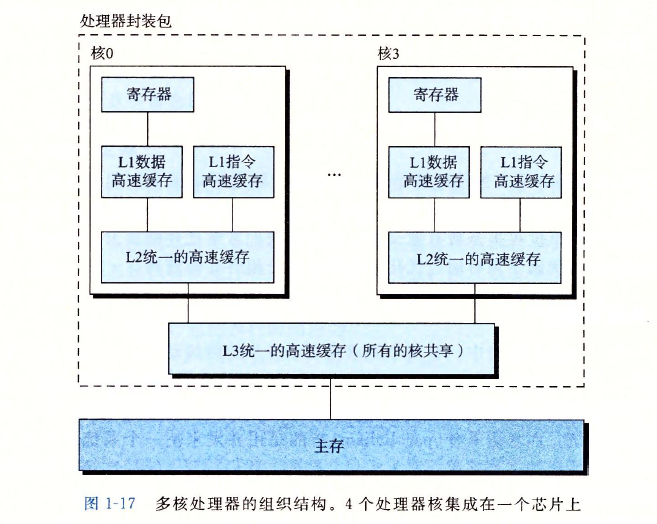

多核处理器将多个CPU集成到一块电路芯片上。每个核都有自己的L1和L2高速缓存，L1高速缓存包括两个部分，分别保存最近收到的指令和数据。

#### 1.9.3 计算机中抽象的重要性

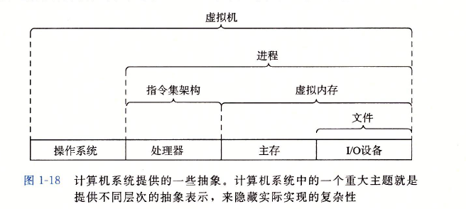

### 小结

​         **计算机内部的信息被表示为一组组的位，它们依据上下文有不同的解释方式**。程序被其他程序翻译成不同的形式，开始时是ASCII文本，然后被编译器和链接器翻译成**二进制可执行文件**。

​         处理器读取并解释存放在主存里的二进制指令。计算机花费了大量时间在内存、I/O设备和CPU寄存器之间复制数据，所以将系统的存储机构划分成层次结构。层次较高的存储设备可以作为层次较低存储设备的高速缓存。

​         操作系统内核是应用程序和硬件之间的媒介，提供了三个基本的抽象，文件是对I/O设备的抽象，虚拟内存是对主存和磁盘的抽象， 进程是处理器，主存和I/O设备的抽象。

## 体会

通过对第一章的学习，对计算机的结构由了一个整体的了解，明白了一个程序在计算中是如何运行的。