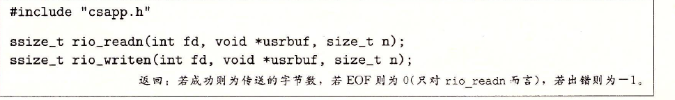
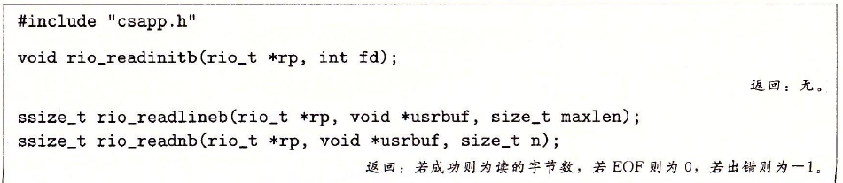
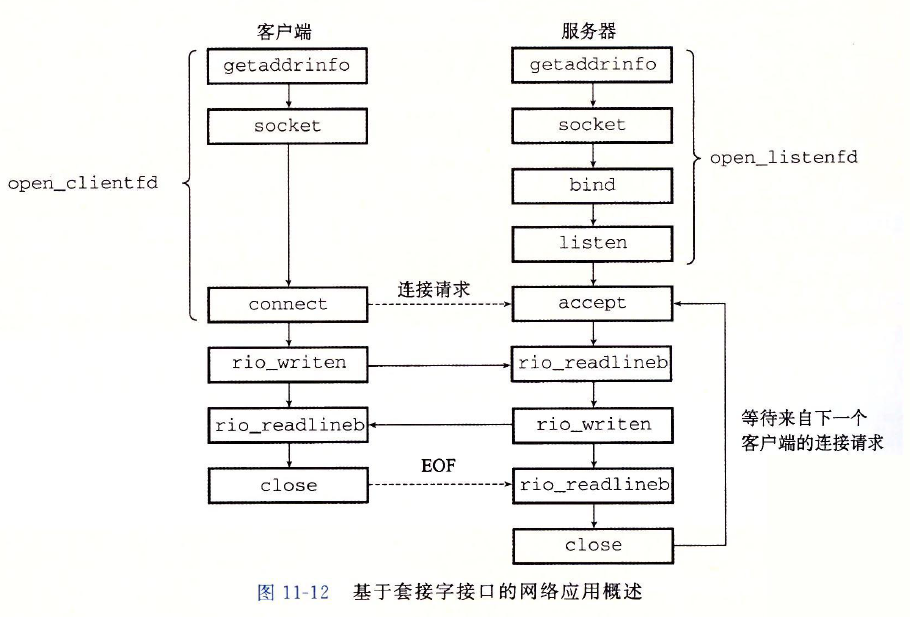

# 深入理解计算机系统第十一章读书笔记 

# 网络编程

## 11.1 客户端-服务器编程模型

## 11.2 网络

## 11.3 全球IP因特网

## 11.4 套接字接口

## 11.5 Web服务器

## 11.6 综合：TINY Web服务器

## 11.7 小结

rio_readn函数：在内存和文件之间直接传送数据

从描述符fd的当前文件位置最大传送n个字节到内存位置usrbuf，rio_writer反过来。

rio_readlineb:从一个内部缓冲区复制一个文本行，当缓冲区为空时，会自动用read重新填满缓冲区。

rio_readlineb从文件rp读出下一个文本行（包括结尾的换行符），将其复制到usrbuf，并且利用NULL（零）字符来借宿这个文本行。最多读maxlen - 1个字节，余下的留给NULL字符。

rio_readnb函数从文件rp最多读n个字节到内存位置usrbuf。

rio_readinitb函数：将描述符fd和地址rp处的一个类型为rio_t的读缓冲区联系起来。每打开一个描述符，都会调用一次它。

http://www.cppblog.com/lf426/archive/2008/07/10/55800.html

socket 函数：创建套接字描述符

connect函数：客户端调用connect函数来建立服务器的连接。

bind： 服务器用来与客户端建立连接

bind函数告诉内核将addr中的服务器套接字地址和套接字描述符sockfd联系起来。

listen函数：服务器用listen函数高速内核，描述符是被服务器而不是客户端使用的。

将sockfd从一个主动套接字转化为一个监听套接字，该套接字可以接受来自客户端的连接请求。

backlog参数暗示在内核开始拒绝连接请求之前，队列中要排队的未完成的连接请求的数量。

accept函数：服务器调用它来等待来自客户端的连接请求。

listened：客户端的请求到达侦听描述符

addr：填空客户端的套接字地址，返回一个已连接描述符。这个描述符可以被用来利用UnixI/O函数与客户端通信

getaddrinfo函数：将主机名或主机地址、服务名或端口号的字符串转化为套接字地址结构。

host参数：域名或数字地址（点进制十分制IP地址）

service： 服务名或端口号

getnameinfo函数：将套接字地址结构转换为相应的主机和服务名字符串

套接字接口的辅助函数

open_clientfd函数：客户端调用它来建立与服务器的连接

open_listenfd函数：服务器创建一个监听描述符，准备好接收连接请求

HTTP请求：

服务器接收如上请求时，调用fork来创建一个子进程，并调用execve在子进程中的上下文中执行/cgi-bin/adder程序。