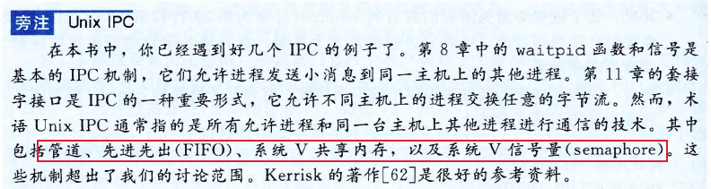

# 深入理解计算机系统第十二章读书笔记 

# 并发编程

逻辑控制流在时间上重叠，那么它们就是 **并发**的。应用级并发在很多情况下也是很有用的：

1. **访问慢速I/O设备**：当应用正在等待来自慢速I/O设备（磁盘）的数据到达时，内核会运行其他进程， 使CPU保存繁忙。
2. **与人交互**：和计算机交互的人要求计算机有同时执行多个任务的能力
3. **通过推迟工作以降低延迟**：应用程序有时需要通过推辞其他操作和并发的执行它们，利用并发来降低某些操作的延迟。例：动态内存分配器可以通过推迟合并，把它放到一个运行在较低优先级上的并发 “合并”流中，在有空闲的CPU的周期时充分利用这些空闲周期，从而降低单个free操作的延迟。
4. **服务多个网络端**
5. **在多核机器上进行并行计算**

现代操作系统提供了三种基本的构造并发程序的方法:

1. **进程**：每个逻辑控制流都是一个进程，由内核来调度和维护。进程有独立的虚拟地址空间，进程之间相互同学，必须使用某种显示的 **进程间通信（IPC）机制**。
2.  **I/O多路复用**：**应用程序**在一个进程的上下文中**显示地调度**它们自己的逻辑流。 逻辑流被模型化为状态机，数据到达文件描述符后，主程序显示地从一个状态转换到另一个状态。因为程序是一个单独的进程，所以**所有的流都共享同一个地址空间**。
3. **线程**： 线程是运行在一个单一进程上下文中的逻辑流，由**内核进行调度**。

## 12.1 基于进程的并发编程

对于父子进程间共享状态信息，它们 **共享文件表**， 但是**不共享地址空间**。进程都独立的地址空间，优点是：**一个进程不可能不小心覆盖另一个进程的虚拟内存。**

缺点是：**独立的地址空间使得进程之间共享状态信息变的困难。**基于进程的设计的另一个缺点是： **速度较慢，因为进程控制和IPC的开销都很高**。

## 12.2 基于I/O多路复用的并发编程

I/O多路复用技术的基本思路： 使用select函数，要求内核挂起进程，只有在一个或多个I/O事件发生后，才将控制权返回给程序。

select函数：

select函数处理类型为fd_set的集合，也叫做 **描述符集合**。逻辑上，我们将描述符集合看成一个大小为$n$的位向量：
$$
b_{n-1},..., b_1, b_0
$$
每个位$b_k$对应与描述符$k$。当且仅当$b_k=1$，描述符$k$才表明是描述符集合的一个元素。

只允许对描述符集合做三件事：

1. 分配它们
2. 将一个此种类型的变量赋值给另一个变量
3. 用FD_ZERO, FD_SET, FD_CLR, FD_ISSET宏来修改和检查它们

select函数有两个输入，一个为 **读集合**的描述符集合和该**读集合的基数（n）**(实际上是任何描述符集合的最大基数)。select函数会一直阻塞， 直到读集合中至少有一个描述符准备好可以读。当且仅当一个从该描述符读取一个字节的请求不会阻塞时，描述符k就表示 **准备好可以读了**。select有一个副作用，它修改参数fdset指向的fd_set，指明读集合的一个子集， 称为 **准备好集合**，该集合是由读集合中 **准备好可以读了**的描述符组成的。该函数返回值指明了 **准备好集合**的基数。由于这个副作用， 我们**必须在每次调用select时都更新读集合**。

### 基于I/O多路复用的并发事件驱动服务器

I/O多路复用可以用作 **并发事件驱动**程序的基础，在事件驱动程序中，某些事件会导致流向前推进。将逻辑流模型化为状态机，不严格的说，一个 **状态机**就是一组 **状态**、 **输入事件**和 **转移**，其中转移是将状态和输入事件映射到状态。每个转移是将一个（输入状态， 输入事件）对映射到一个输出状态。

### I/O多路复用技术的优劣

优点：

1. 与基于进程的设计比较，它给了程序员更多的对程序行为的控制
2. 它是运行在 **单一进程上下文**中，因此每个逻辑流都能访问该进程的全部地址空间，使得流与流之间共享数据变得容易
3.  作为单个进程运行相关的优点是，可以利用熟悉的调试工具，如GDB来调试并发程序，就像对顺序程序一样
4.  比基于进程的设计要更高效，因为不需要进程上下文的切换来调度新的流

缺点：

1. 编码复杂，并且随着并发粒度的减小，复杂性还会上升。 粒度： 每个逻辑流每个时间片执行的指令数量
2. **不能充分利用多核处理器**

## 12.3 基于线程的并发编程

**线程**就是运行在进程上下文中的逻辑流。 现代系统里运行在一个进程里同时运行多个线程的程序。线程由内核自动调度。 每个线程都有自己的 **线程上下文**，包括一个唯一的**整数线程ID**（Thread ID， TID）、**栈**、**栈指针**、**程序计数器**，**通用目的寄存器和条件码**。所有运行在一个进程里的线程**共享该进程的整个虚拟地址空间。**

基于线程的逻辑流结合了基于进程和基于I/O多路复用的流的特性。同进程一样， 线程由内核自动调度，内核通过一个整数ID来识别线程。同基于I/O多路复用的流一样，多个线程运行在单一进程的上下文中，共享这个进程虚拟地址空间的所有内容，包括代码、数据、堆、共享库和打开的文件。

### 线程执行模型

每个进程开始时都是单一线程，为 **主线程**，某一时刻，主线程创建一个 **对等线程**。

线程执行不同于进程的方面：

1. 线程的上下文切换比进程的上下文切换**快的多**
2. 线程不像进程一样，不是严格按照父子层次来组织的， 和一个**进程**相关的线程组成一个 **对等（线程）池**，独立于其他线程创造的线程。主线程与其他线程的区别是仅是它总是进程中第一个运行的线程。 对等（线程池）的主要影响是： 一个线程可以杀死它的任何对等线程，或者等待它的任意对等线程终止，每个对等线程都能读写相同的共享数据。

### Posix线程

Posix线程（Pthreads）是在C程序中处理线程的一个标准接口。

### 创建线程

调用pthread_create函数来创建其他线程。

调用pthread_self函数来获得它自己线程ID。

### 终止线程

线程终止方式：

1. 当顶层的线层例程返回时，线程会 **隐式**终止
2. 调用pthread_exit函数，线程会 **显示**终止。若**主线程调用pthread_exit**，它会等待所有其他对等线程终止，然后再终止主线程和整个进程。

3. 某个对等线程调用Linux的exit函数，该函数终止进程以及所有与该进程相关的线程

4. 另一个对等线程通过以当前线程ID作为参数调用pthread_cancel函数来终止当前进程

   

   

### 回收已终止线程的资源

线程调用pthread_join函数等待其他线程终止。

该函数会阻塞，直到线程tid终止，将该线程例程返回的通用指针复制为thread_return指向的位置，然后回收已终止线程占用的所有内存资源。

和Linux的wait函数不同，该函数智能等待 **一个指定的线程终止**。没有办法等待任意一个线程终止。

### 分离线程

在任何一个时间点上， 线程是 **可结合的**或者是 **分离的**。

1. **可结合的线程**：能被其他线程回收和杀死，在被其他线程回收之前，它的内存资源时不释放的
2. **分离的线程**：不能被其他线程回收或杀死，内存资源在它终止时由系统自动释放。

默认情况下，线程被创建成可结合的。为了避免内存泄漏，每个可结合线程都应该被其他线程显式地收回，要么通过调用pthread_detach被分离。

### 初始化线程

pthread_once函数允许初始化与线程例程相关的状态。

once_control变量是一个**全局或者静态变量**，总是被初始化为PTHREAD_ONCE_INIT。当需要动态初始化多个线程**共享的全局变量**时，该函数很有作用。

### 基于线程的并发服务器

## 12.4 多线程程序中的共享变量

### 线程内存模型

 每个线程都有自己的 **线程上下文**，包括一个唯一的**整数线程ID**（Thread ID， TID）、**栈**、**栈指针**、**程序计数器**，**通用目的寄存器和条件码**。每个线程和其他线程一起**共享进程上下文的剩余部分**，包括整个用户虚拟地址空间，由只读文本（代码）、读/写数据、堆以及所有的共享库代码和数据区域组成。线程也**共享相同的打开文件的集合。**

**寄存器从不共享，虚拟内存总是共享的。**

各自独立的**线程栈**的内存模型不是那么整齐清楚的，这些栈被保存在虚拟地址空间的栈区域中，**通常是被相应的线程独立访问的**。但是由于不同的线程栈是不对其他线程设防的，所以如果一个线程以某种方式得到一个指向其他其他线程栈的指针，那么他就可以读写这个栈的任何部分。

### 将变量映射到内存

多线程的C程序中变量根据其存储类型别映射到虚拟内存;

1. **全局变量**：定义在函数之外的变量。在运行时，虚拟内存的读/写区域**只包含每个全局变量的一个实例**，**任何线程都可以引用**。
2. **本地自动变量**：定义在函数内部但没有static属性的变量。在运行时，**每个线程的栈**都**包含**它自己的所有**本地自动变量**的实例。
3. **本地静态变量**：定义在函数内部但有static属性的变量。和 **全局变量**一样，虚拟内存的读/写区域**只包含**在程序中声明的每个**本地静态变量**的一个实例。**每个对等线程都读和写**这个实例。

### 共享变量

一个变量是 **共享的**，当且仅当多个线程引用这个变量的某个实例。**全局变量和本地静态变量**是共享的。

## 12.5 用信号量同步线程

### 进度图

将n个并发线程的执行模型化为一条n维笛卡尔空间中的轨迹线。

### 信号量

信号量s是具有非负整数值的全局变量。由PV操作来进程处理。

**P（s）**： 如果s是非零的吗，那么P将s减1，并且立即返回。如果s为0，挂起该线程，直到s变为非0，而一个V操作会重启这个线程。重启后，P操作将s减1，并将控制权返回给调用者。

**V（s）**: V 操作将s加1.如果有任何线程阻塞在P操作处等待s变成非0，那么V操作会重启这些线程中的一个（**不能预测重启哪一个线程**），然后该线程完成P操作。

P中的测试和减1，V中的测试和加1操作都是不可分割的。一个正确初始化了的信号量不可能具有一个负值，称为 **信号量不变性**。

Posix标准定义了操作信号量的函数：

### 使用信号量来实现互斥

基本思想将每个共享变量与一个信号量（初值为1）联系起来，然后用PV操作将相应的临界区包围起来。

### 利用信号量来实调度共享资源

#### 生产者-消费者问题

#### 读者-写者问题

### 综合：基于预线程化的并发服务器

​      提前创建了几个工作者线程，相当于构建一个线程池，工作者线程不断运行，只要缓冲区里面有连接描述符，就取出连接描述符，并进行服务，服务完之后，工作者线程不会取消，还是在等缓冲区里面产生新的连接描述符。

## 12.6 使用线程提高并行性

在多核处理器上运行多线程时，核数越多，性能可能越差，原因是：**相对于内存操作更新的开销，同步操作代价太大，并行编程，要尽可能避免同步开销，如果无可避免，必须要用尽可能多的有用的计算弥补这个开销。**

最理想的情况是核的数量和线程数相等，当线程数再增加时，会增加在一个核上多个线程上下文切换的开销。

并行程序编写相当棘手，对代码看上去很小的改动可能对性能有极大的影响。

## 12.7 其他并发问题

### 线程安全

一个函数称为 **线程安全的**，当且仅当被多个线程反复的调用时，会一直产生正确的结果。

四个线程不安全函数类：

1. 不保护共享变量的函数
2. 保持跨越多个调用的状态的函数
3. 返回指向静态变量的指针的函数，因为静态变量是线程之间共享的
4. 调用线程不安全函数的函数

### 可重入性

可重入性函数：当他们被多个函数调用时，不会引入任何共享数据。

当引入共享变量，但是加锁保护后，是线程安全的，但是不是可重入的。

### 在线程化的程序中使用已存在的库函数

加锁-复制方法基本思想，将线程不安全函数与互斥锁联系起来， 在每一个调用位置，对互斥锁加锁，调用线程不安全函数，将函数返回的结果复制到一个私有的内存位置，然后对互斥锁解锁。

该方法也有许多缺点：

1. 额外的同步降低了程序的速度
2.  对于返回指向复杂结构的的结构的指针的函数，要复制整个结构层次，需要深层复制
3.  对像第二类线程不安全函数无效。

### 竞争

### 死锁

互斥锁加锁顺序规则： 给定所有互斥操作的一个全序，如果每个线程都是以一种顺序获得互斥锁并以相反的顺序释放，那么该程序时无死锁的。

## 12.8 小结

