# 深入理解计算机系统第二章读书笔记

# 信息表示与处理

## 2.1 信息存储

机器级的程序将内存视为一个非常大的字节数组，称为**虚拟内存**。

内存的每一个字节由唯一的一个数字来标识，称为**地址**，所有可能地址的集合称为**虚拟地址空间**。

虚拟地址空间只是一个概念性的映像，物理实现是将动态随机访问存储器，闪存、磁盘储存器、特殊硬件和操作系统软进结合起来的，为程序提供一个看上去统一的字节数组。

C语言指针：提供了引用数据结构的元素的机制。包括值和类型。

值：表示某个对象的位置   类型： 表示位置上所存储对象的类型。

### 字数据大小

每台计算机都有一个字长（word size）， 指明**指针数据**的标称大小。对于字长为***w***位的机器，虚拟地址的范围是**0~2w - 1**

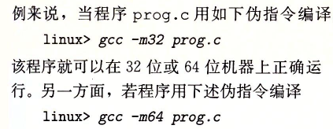

gcc采用不同的参数进行编译，可以得到不同机器的程序，因此，我们将程序称为“32”位或“64”位程序时，区别在于该程序时如何编译的，而不是其运行的机器类型。

C语言各种数据类型的大小：

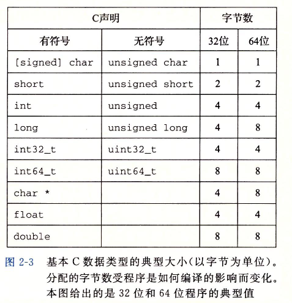

为了避免数据类型在随着不同编译器设置（例long类型，在32位是4字节，而在64位是8字节）而发生变化，从而带来奇怪的行为，因此引用了int32

_t 类型和 int64_t类型，不随编译器设置而变化，从而可移植性好。

**指针声明：**

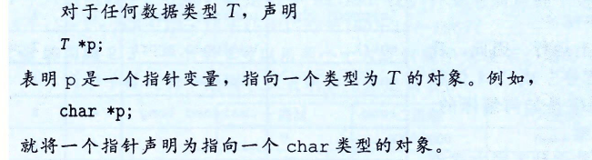

### 寻址和字节顺序

小端法：最低有效**字节**（以字节为单位，也就是8位，而不是1位）在最前面的方式

大端法：最高有效字节在最前面的方式（符合我们肉眼直观的看法）

例：十六进制值0x1234567，地址范围在0x100~0x103，则储存方式为：

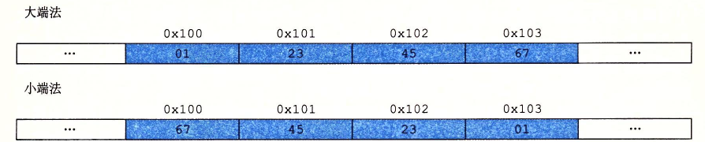

大多数时候，机器所使用的字节顺序是完全不可见的，无论为哪种类型的机器所编译都会得到同样的结果。

字节顺序成为问题： 

1. 在不同类型的机器之间通过网络传送二进制数据时，就会相互反过来，这是因为此时传输的粒度已经是字节了，因此字节的顺序是重要的，不能被忽视。

2. 阅读表示整数数据的字节顺序时，字节顺序也很重要，主要是**发生在检查机器级程序时**。

   

​        取出该序列的最后4个字节时 43 0b 20 00，在小端法机器时，应该反过来。

3. 编写规避正常的类型的系统程序时， 在C语言中可以使用强制类型转换（cast）或联合（union）来运允许以一种数据引用一个对象，而这种数据类型与创建这个对象时的定义的数据类型不同。

   **其实归根结底就是，当我们涉及到数据储存的字节或者位这个粒度时，就需要注意小端法带来的影响了。**

C语言中typedof：极大改善代码的可读性，其语法与声明变量的语法十分相像，但是它使用的是**类型名**，而不是变量名。

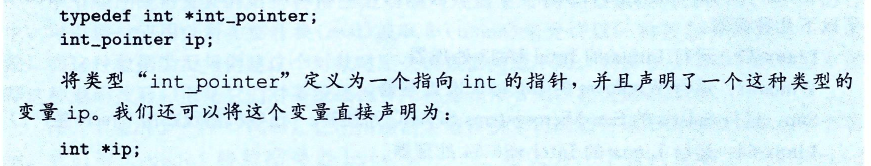

### 表示字符串

C语言中的字符串被编码为一个以null（其值为0）字符结尾的字符数组。每个字符都由某个标准编码来表示，最常见的是ASCII字符码。

字符“12345” 储存为 31 32 33 34 35 00。在使用ASCII码作为字符串的任何系统上都将得到相同的结果，与字节顺序和字大小无关。因此，**文本数据比二进制数据具有更强的平台独立性。**

### **表示代码**

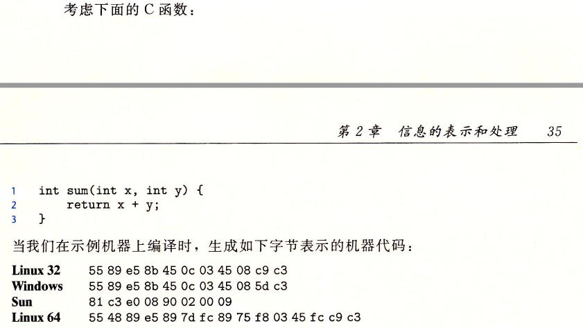

不同的机器类型使用不同的且不兼容的指令和编码方式，因此二进制代码是不兼容的。从机器的角度来看，**程序仅仅是字节序列**。机器没有关于原始源程序的任何信息，除了可能有些用来帮助调试的辅助表以外。

### 布尔运算与位运算

位级运算的一个常见用法是实现掩码运算，掩码是一个位模式，表示从一个字节中选出的位的集合。 **表达式~0将生成一个全1的掩码**，不管机器的字的大小是多少。

### 逻辑运算

所有非零的参数都表示TRUE，参数0表示FALSE。

逻辑运算与位运算的重要区别，如果对第一个参数求值就能确定表达式的结果，那么**逻辑运算就不会对第二个参数求值**。

### 移位运算

逻辑右移： 在左端补k个0，**无符号数**，进行逻辑右移

算术右移：在左端补k个最高有效位的值，对**有符号整数**数据非常有用，几乎所有的编译器和机器都对有符号数实行算术右移

## 2.2 整数表示

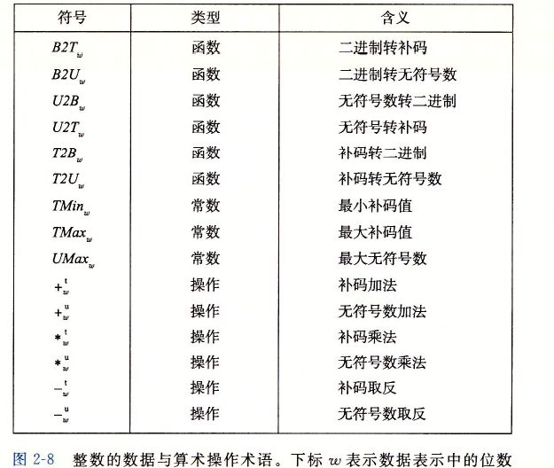

### 整型数据类型

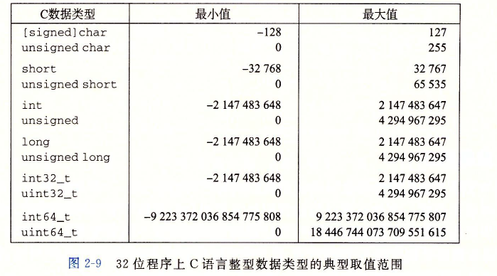

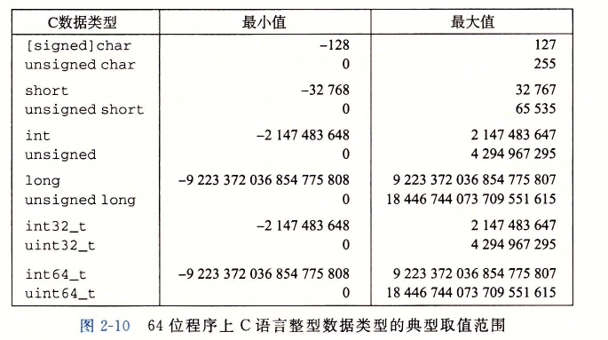

负数的范围比整数的范围大1.

### 无符号数的编码

定义：$对于向量\vec{x} = [x_{w-1}, x_{w-2}, ..., x_{0}]:$
$$
B2U_{w}(\vec{x})\dot{=}\sum_{i=0}^{w-1}x_i2^i
$$
函数$B2U_{w}$将一个长度为$w$的0、1串映射到非负整数。

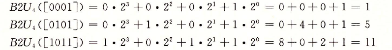

$UMax_{w} = \dot{=}\sum_{i=0}^{w-1}2^i=2^w-1$,无符号数编码具有唯一性。函数$B2U_{w}$是一个双射。

### 补码编码

有符号数的常见方式就是补码形式，将字的最高有效位解释为负权。

$B2T_{w}$函数

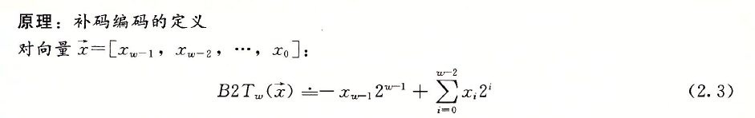

$TMin_i \dot{=} -2^{w-1}$      $TMax_w = \sum_{i=0}^{w-2}2^i=2^{w-1} - 1$, 补码编码也具有唯一性。

$|TMin| = |TMax| + 1$ , 因此$TMin$没有对应的正数。

最大的无符号数刚好比补码的最大值的两倍大1： $UMax_w = 2Tmax_w + 1$，从二进制储存的角度很好理解。$UMax_w$和-1具有同样的位表示。

C库中的文件<limits.h>定义了一组常量，限定不同整型数据类型的取值范围。

**有符号数还有两种标准的表示方法：**

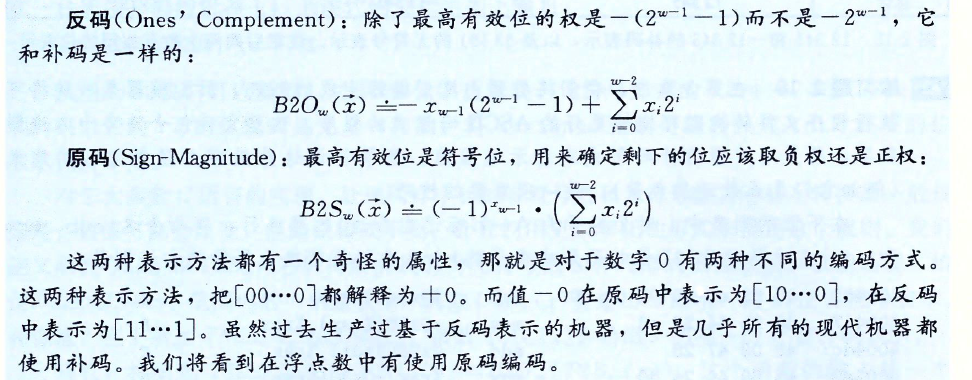

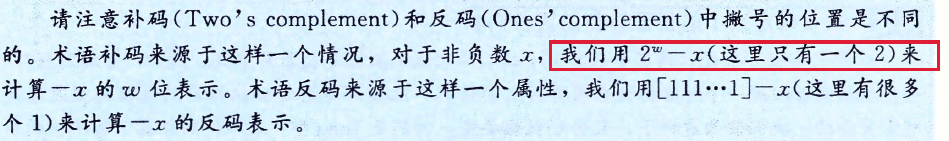

$-x$的w位表示，本质上都是x + (-x) = 0 

### 有符号数和无符号数之间的转换

**强制类型转换的结果保持位值不变，只是改变了解释这些位的方式。**

C语言中如果执行运算时，一个运算数是有符号的而另一个是无符号的，则C语言会隐式将**有符号数强制转换为无符号数**。

### 扩展一个数字的位表示

无符号数进行零扩展：高位补0

补码数的符号扩展：高位补符号位

当short转换为unsigned时，先改变其大小（从short 2 字节 -> int 4字节）， 再从有符号转变为无符号(重新解释位)。

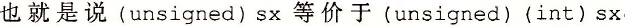

### 截断数字

不管是无符号数还是由符号位，都是截断高k位，对剩下的w-k位，重新解释。

### 有符号数和无符号数的建议

有符号数会隐式转换为无符号数，容易倒是错误或者漏洞，因此，**一般情况下不要使用无符号数。**

当我们只是把字看做**是位的集合而没有数字意义**时，无符号数是非常有用的。

## 2.3 整数运算

两个正数相加得一个负数，比较表达式$x<y$ 和比较表达式$x-y < 0$会产生不同的结果。这是由于计算机**运算的有限性**造成的。

### 无符号加法

原理：对满足 $0 \le x, y < 2^w 的x和y有：$
$$
x + _w^uy =\left\{
\begin{aligned}
x +y, \quad x + y < 2^w   \quad 正常\\
x + y - 2^w,   \quad 2^w \le x + y < 2^w   \quad溢出\\
\end{aligned}
\right.
$$
$+_w^u$表示把整数和$x + y$截断为$w$位得到结果。

执行C程序时，不会将溢出作为错误而发生信号。不过有时候我们需要判断是否发生了溢出。

原理：

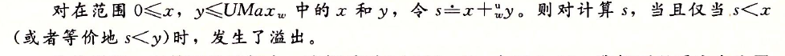

这很好理解，因为溢出了需要减去$2^w$，而x和y都不可能比$2^w$大，因此和小于原来的$x或y$时，必定发生了溢出。

**无符号数求反：**

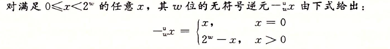

这也很好理解，因为 $x + (-x)=0$, 因此相加时， 低$w$位必定都为0.

### 补码加法

定义$x+_w^ty$为整数和$x + y$被截断为$w$位的结果，并将该结果看成是补码数。

原理：对满足 $-2^{w-1} \le x, y \le 2^{w-1}-1 的x和y有：$
$$
x + _w^yy =\left\{
\begin{aligned}
x +y - 2^w, \quad 2^{w-1}\le x + y   \quad 正溢出\\
x + y ,   \quad -2^{w-1} \le x + y < 2^{w-1}   \quad正常\\
x + y + 2^w,   \quad 2^w \le x + y < -2^{w-1}   \quad负溢出\\
\end{aligned}
\right.
$$
正溢出时，最高位由0,0变为1，此时最高位的1应由正权$2^{w-1}$解释为负权$-2^{w-1}$，因此相差$-2^{w-1} - 2^{w-1} = -2^w$, 所以减去$2^w$

负溢出时，最高位由1,1变为0，因此$w$位的1被截断，因此增大了$2^w$。

**补码加法的溢出**：由公式定义有

### 补码的非

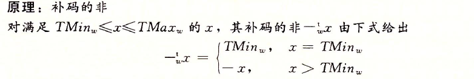

因为$TMin_w$没有对应的正数，所以单独定义。在C语言中$-x = ~x + 1$ , 本质上就是相加为0。

### 无符号乘法

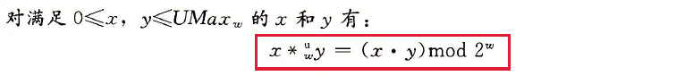

截断计算出来的高位。

### 补码乘法

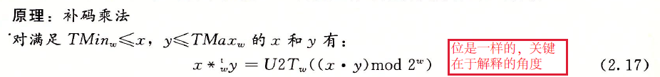

### 乘以常数

在大多数机器上，整数乘法指令相当慢，需要10个或者更多的时钟周期，而其他整数运算（加法，减法，位级运算和移位）值只需要一个时钟周期。因此，编译器使用**移位和加法**运算来代替乘以常数因子的乘法，进行优化，

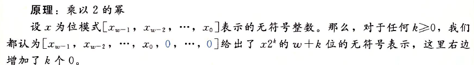

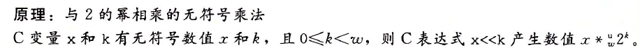

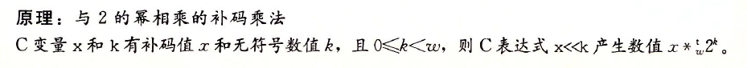

对于某个常数K，编译器会将K 的二进制表示表达为一组0和1交替的序列，然后得到两种形式的乘法计算方法：

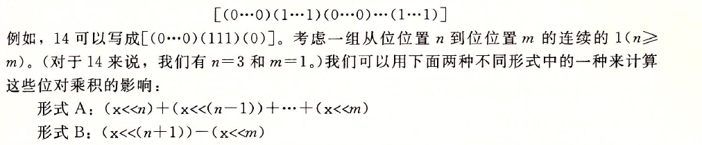

### 除以2的幂

整数除法比整数乘法更慢，需要30个或者更多的时钟周期。

**整数除法总是舍入到0，因此负数向上舍入变大，正数向下舍入变小**。

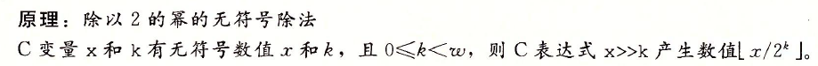

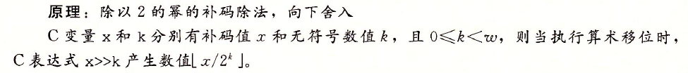

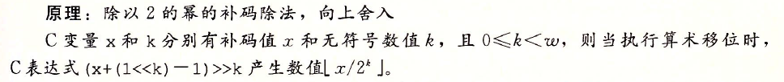

向上舍入添加偏置，从而实现负数的向上舍入。

## 2.4 浮点数

浮点数表示对形如$V = x \times 2^y$的有理数进行编码。

### IEEE浮点表示

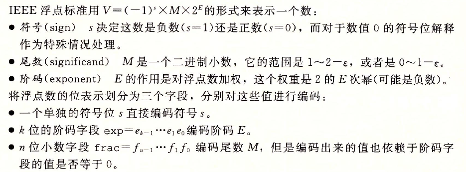

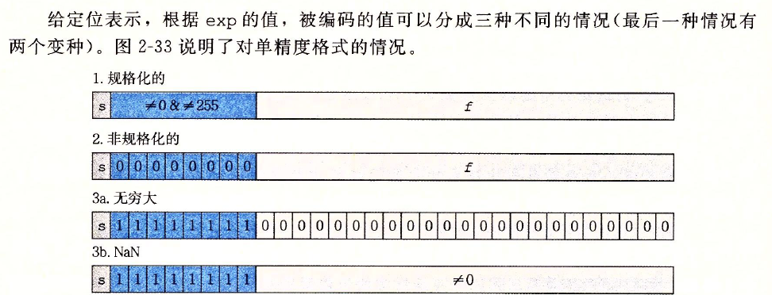

舍入方式是为向偶数舍入，这样在计算平均值时不会引入统计偏差。

### 浮点运算

浮点加法不具有结合性，满足单调属性，整数加法运算具有溢出，不满足这个特性。

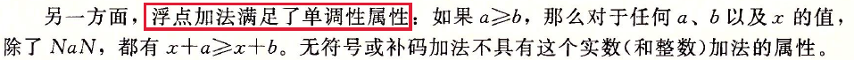

浮点乘法具有交换性，单调属性（没有NAN的情况），不具有可结合性和分配性。

在C语言中格式进行强制转换时，遵守的原则：

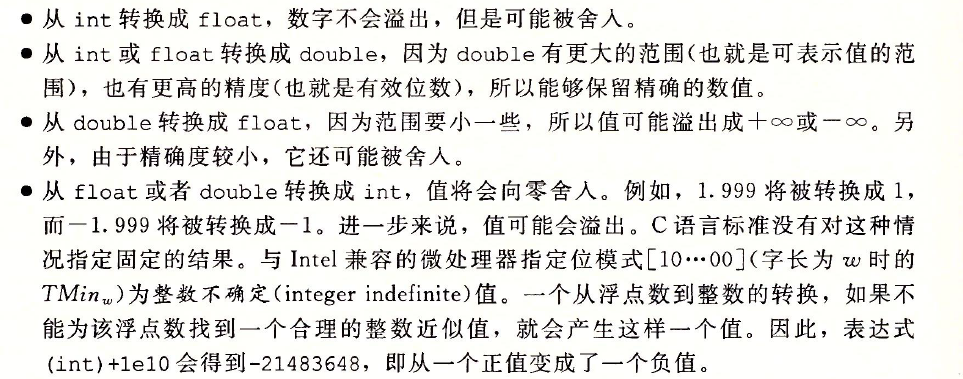

## 2.5 小结

计算机将信息编码为位，通常组织成字节序列。采用不同的编码方式来表示整数、实数和字符串。

在相同长度的无符号和有符号整数之间进行强制转换时，位模式不变，只是重新解释这些位。

C语言实现的有限整数运算和真实的整数运算相比，有一些特殊的属性。由于溢出，表达式$x*x$$（例如，w=4位的 3 \times 3=0011 \times 0011 = 1001 解释为-7）$能够得出负数。但是，无符号数和补码的运算都满足整数运算的其他属性，包括结合律，交换律和分配律，因此允许编译器做许多的优化。

必须小心的使用浮点运算，因为浮点运算只有有限的精度和范围，并且不遵守普遍的基本算术属性，比如结合性。