# 深入理解计算机系统第四章读书笔记 

# 处理器体系结构

一个处理器支持的指令和指令的字节级编码称为它的**指令集体系结构**($ISA$)。一个程序编译成在一种机器上运行，就不能在另一种机器上运行。本章研究一个硬件系统执行某种$ISA$指令的方式。

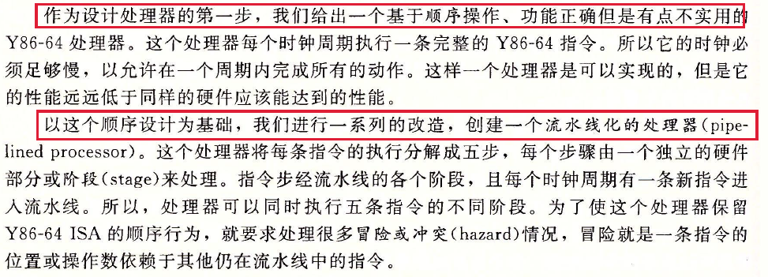

## 4.1 Y86-64指令集体系结构

定义一个指令级体系结构，包括定义各种状态单元、指令集和它们的编码、一组编码规范和异常事件处理。

### 程序员可见的状态

Y86-64程序中的每条指令都会读取或修改处理器状态的某些部分。这称为**程序员可见状态**，这里“程序员”既可以用汇编代码写程序的人，也可以是产生机器级代码的编译器。

程序寄存器，条件码，PC，内存和状态码。

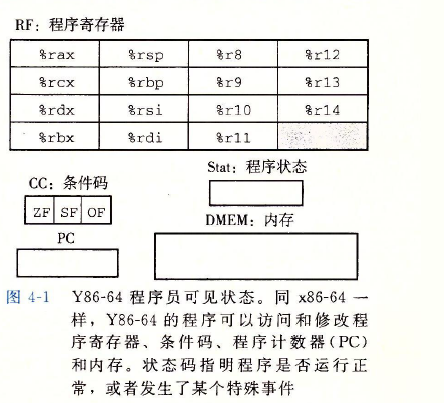

**内存**从概念上来说就是一个很大的字节数组，保存着程序和数据。Y86-64程序用虚拟地址来引用内存位置。**硬件和操作系统软件**联合起来将**虚拟地址**翻译成**实际或物理地址**，指明数据实际存放在内存中哪个地方。

### Y86-64指令

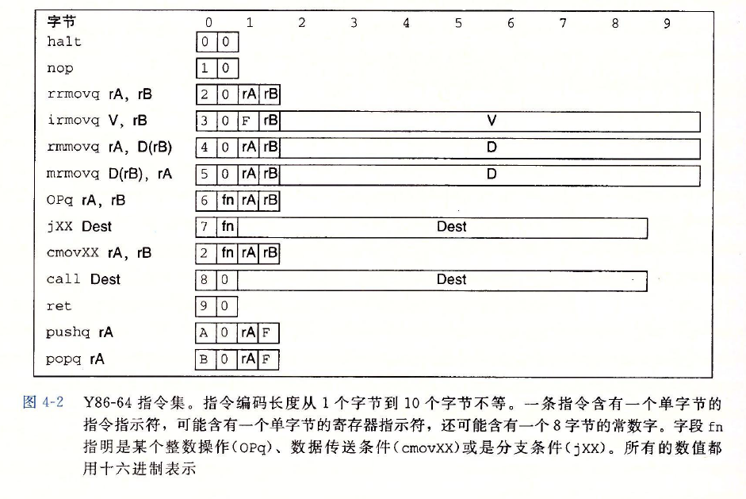

### 指令编码

指令的字节级编码：

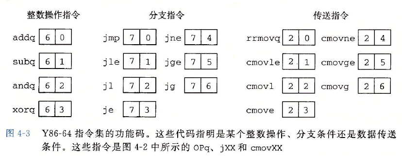

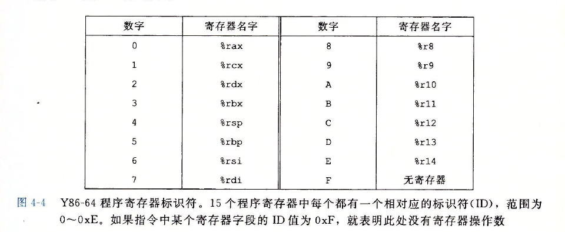

指令集的重要性质就是字节编码必须有唯一的解释。任意一个字节序列要么是一个唯一的指令序列的编码，要么就不是一个合法的字节序列。因为在指令转换为字节序列是时，如果有二义性，则计算机肯定不能继续运行。

### Y86-64异常

当遇到这些异常的时候，处理器通常会调用一个**异常处理程序**，这个过程被指定用来处理遇到的某种类型的异常。

## 4.2 逻辑设计和硬件控制语言

实现一个数字系统需要三个主要的组成部分：

1. 计算对位进行操作的函数的组合逻辑
2. 存储位的存储器单元
3. 控制存储器单元更新的时钟信号

**算术/逻辑单元（ALU）**是一种很重要的组合电路。

### 存储器和时钟

组合电路不存储任何信息。为了产生时序电路，也就是有状态并且在这个状态上进行计算的系统，必须引入按位储存信息的设备。

存储设备是由同一个时钟控制的，时钟是一个周期性信号，决定什么时候把新值加载到设备中。

存储器设备：

1. 时钟寄存器（寄存器）：存储单个位或字，时钟信号控制寄存器加载输入值
2. 随机访问存储器（内存）：存储多个字，用地址来选择该读或该写哪个字。随机访问存储器的例子有：
   1.  处理器的虚拟内存系统：硬件和操作系统软件结合起来使处理器可以在一个很大的地址空间访问任意的字
   2.  寄存器文件：在此，寄存器标识符作为地址。在Y86-64处理器中，寄存器文件有15个程序寄存器（%rax-%r14）。

寄存器命名的含义：

1. 硬件： 寄存器直接将它的输入和输出线连接到电路的其他部分，称为硬件寄存器
2. 机器级编程： 寄存器代表的是CPU中为数不多的可寻址的字，这里的地址是寄存器ID， 称为程序寄存器
3. 

## 4.3 Y86-64的顺序实现

### 将处理组织成阶段

通常条指令包括很多操作，将它们组织成某个特殊的阶段序列，即使指令的动作差异越大，但所有的指令都遵循统一的序列。

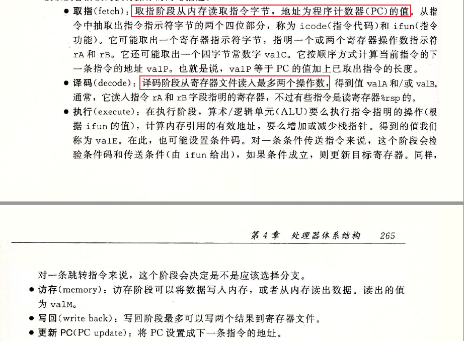

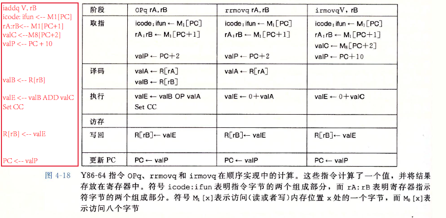

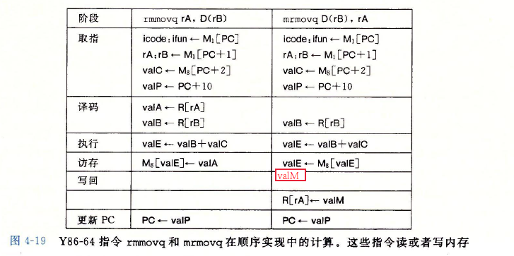

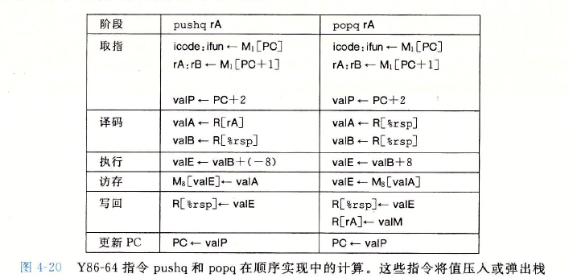

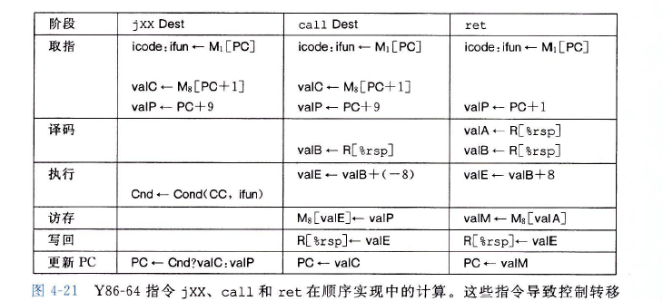

### SEQ 硬件结构

实现所有Y86-64指令所需的计算可以被组织成6个基本阶段：取指、译码、执行、访存、写回和更新PC。下图给出一个能执行这些计算的硬件结构的抽象表示。

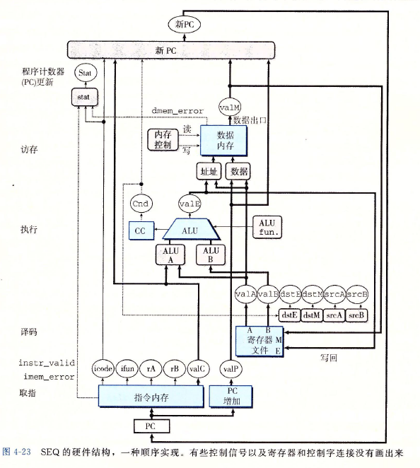

### SEQ阶段的实现

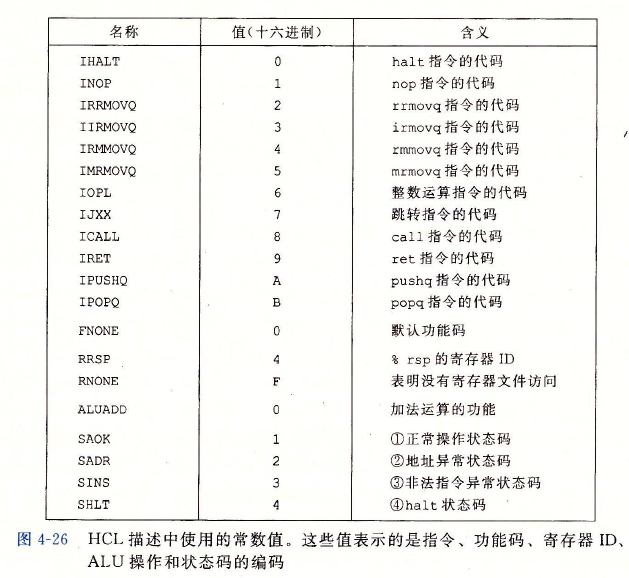

### SEQ小结

SEQ唯一的问题就是太慢了。时钟必须非常慢、以使信号能在一个周期内传播所有的阶段。

## 4.4 流水线的通用原理

### 计算流水线

流水线化的一个重要特性就是提高了系统的**吞吐量**，也将就是单位时间内服务的总数，不过它也会稍微增加**延迟**，也就会服务一个指令所需要的时间。

从头到尾执行一条指令所需要的时间称为**延迟**，在此系统中延迟为$320ps$, 也就是吞吐量的倒数。

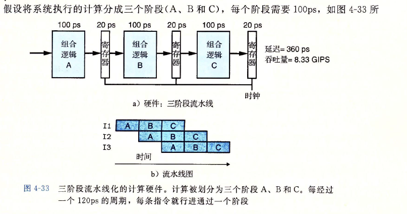

在各个阶段之间放上流水线寄存器，这样每条指令都会按照三步经过这个系统，从头到尾需要三个完整的时钟周期。

流水线之间的指令转移是由时钟信号来控制，时钟不能运行太快，值可能还来不及通过组合逻辑，因此当时钟上升时，寄存器的输入还不是合法的的值。

流水线的局限性：

1. 不一致的划分：将系统计算设计划分成一组具有相同延迟的阶段是一个严峻的挑战。

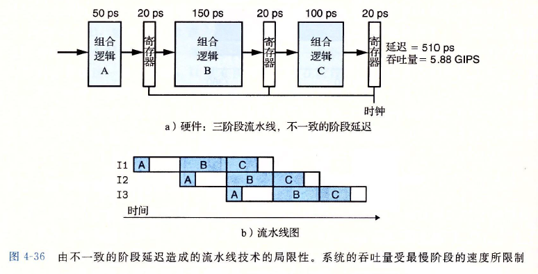

2. 流水线过深，收益反而下降：因为增加的寄存器会增加延迟。

   

   

   

### 带反馈的流水线系统

指令之间不是完全独立的，很可能是相关的。

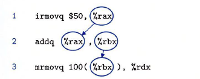

在三条指令的序列中，每条相邻的指令之间都有**数据相关**。

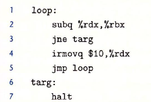

第3行jne产生了**控制相关**，因为条件测试的结果会决定要执行的新指令是irmovq还是halt指令。

## 4.5 Y86-64的流水线实现

对顺序的SEQ处理器做一点小的改动，将PC的计算挪到取指阶段，然后在各个阶段之间加上流水线寄存器。再做一些修改，就能实现一个高效的、流水线化的实现Y86-64ISA的处理器。

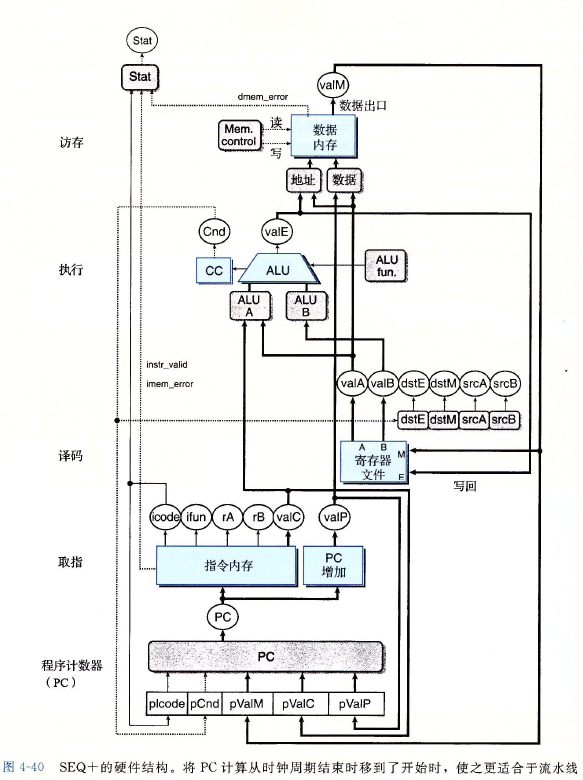

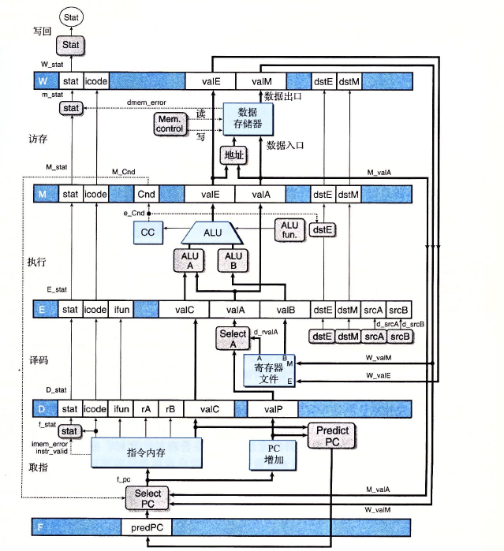

### 流水线冒险

数据相关： 下一条指令会用到这一条指令计算出的结果

控制相关： 一条指令要确定下一条的指令的位置

这些相关可能会导致流水线产生计算错误，称为冒险。冒险也分为数据冒险和控制冒险。

**当一条指令更新后面指令会读到的那些程序状态时，就有可能会出现冒险**。

处理冒险的方法：

1. 用暂停来避免数据冒险：暂停是避免冒险的一种常用技术，暂停时处理器会停止流水线中一条或多条指令，直到冒险条件不再满足。暂停技术就是让一组指令阻塞在它们所处的阶段。
2. 用转发来避免数据冒险：将结果值直接从一个流水线极端传到较早阶段的技术称为数据转发，或称转发，有时也称为旁路。
3. 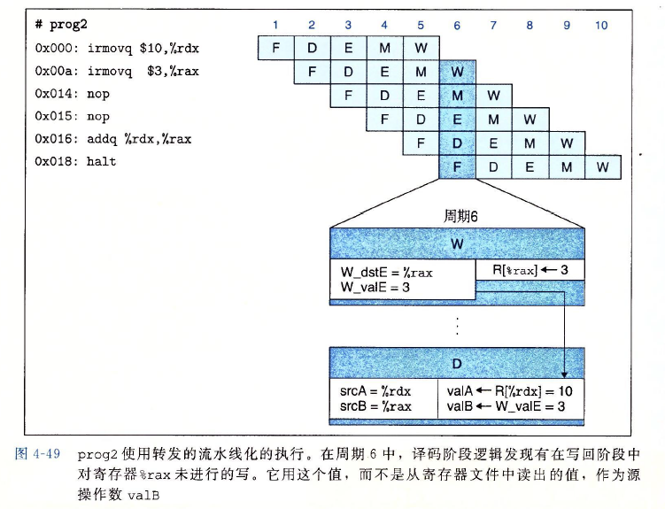

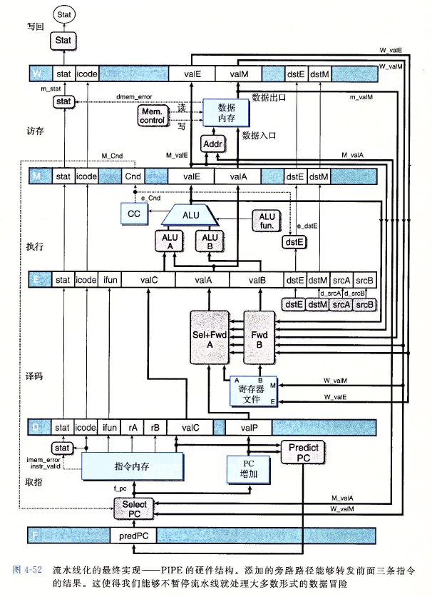

3. 加载/使用数据冒险：当内存读在流水线发生的比较晚，此时不能单纯用转发来解决。用暂停来处理加载/使用冒险的方法称为**加载互锁**。加载互锁和转发技术结合起来可以足以处理所有的可能类型的数据冒险。
4. 避免数据冒险：当处理器无法根据处于取值阶段的当前指令来确定下一条指令的地址时，就会出现控制冒险。控制冒险出现在ret指令和跳转指令，而且后一种情况只有在条件跳转方向预测错误时会造成麻烦。通过插入气泡，并同时取出跳转指令后面的指令，这样就能**取消（指令排除）**预测的错误指令。

### 流水线控制逻辑

1. 加载/使用冒险：在一条从内存中读出一个值的指令和一条使用该值的指令之间，流水线必须暂停一个周期

2. 处理ret：流水线必须暂停直到ret指令指令到达写回阶段

3. 预测错误的分支：在选择了错误的分支后，分支目标的指令已经进入流水线了，必须取消这些指令

4. 异常：当一条指令导致异常，我们想要禁止后面的指令更新程序员可见的状态，并且在异常指令到达写回阶段，停止执行。

## 4.6 小结

​       流水线化通过让不同的阶段并行操作，改进了系统的吞吐量性能。在任意一个给定的时刻，多条指令被不同的阶段处理。在引入这种并行性的过程中，我们必须非常小心，以提供与程序的顺序执行相同的程序级行为。通过重新调整SEQ各个部分的顺序，引入流水线，我们得到SEQ+，接着添加流水线寄存器，创建出PIPE-流水线。然后，添加转发逻辑，加速了将结果从一条指令发送到另一条指令，从而提高了流水线的性能。有几种特殊情况需要额外的流水线的控制逻辑来暂停或取消一些流水线阶段。

