- [深入理解计算机系统第五章读书笔记](#----------------)
- [优化程序性能](#------)
  * [5.1 优化编译器的能力和局限性](#--51---------------)
  * [5.2 表示程序性能](#52-------)
  * [5.3 程序示例](#53-----)
  * [5.4 消除循环的低效率](#54---------)
  * [5.5 减少过程调用](#55-------)
  * [5.6 消除不必要的内存引用](#56-----------)
  * [5.7 理解现代处理器](#57--------)
    + [功能单元的性能](#-------)
    + [处理器操作的抽象模型](#----------)
  * [5.8 循环展开](#58-----)
  * [5.9 提高并行性](#59------)
    + [多个累积变量](#------)
    + [重新结合变换](#------)
  * [5.10 优化合并代码的结果小结](#510------------)
  * [5.11 一些限制因素](#511-------)
    + [寄存器溢出](#-----)
    + [分支预测和预测错误处罚](#-----------)
  * [5.12 理解内存性能](#512-------)
    + [加载的性能](#-----)
    + [存储的性能](#-----)
  * [5.13 应用：性能提高技术](#513----------)
  * [5.14 确认和消除性能瓶颈](#--514------------)
    + [程序剖析](#----)
  * [5.15小结](#515--)

# 深入理解计算机系统第五章读书笔记 

# 优化程序性能

**编写高效程序**需要做到以下几点：

1. 必须选择一组适当的算法和数据结构。
2.  必须编写出编译器能够有效优化以转换成高校可执行代码的源代码，对于这一点的实现，理解优化编译器的能力和局限性是很重要的。C语言的有些特性，例如执行指针运算和强制类型转换的能力，使得编译器很难对它进行优化。
3. 针对处理量特别大的计算，将一个任务分成多个部分，这些部分可以在多核和多处理器上的某种组合进行并行计算

**程序优化：**

1. 第一步就是消除不必要的工作，让代码尽可能有效执行所期望的任务。这包括消除不必要的函数调用、条件测试和内存引用。这些优化不依赖于目标机器的任何具体属性。
2. 了解处理器的运作，进行优化程序的第二步，利用处理器提供的**指令级并行**能力，同时执行多条指令。

## **5.1 优化编译器的能力和局限性**

GCC向用户提供了一些优化的控制，最简单的控制就是制定**优化级别**，命令行选项$-Og$调用GCC是让GCC使用一组基本的优化。$-O1$或更高调用GCC会让它使用更大量的优化。这样做可以进一步提高程序的性能，但是也可能增加程序的规模，也可能使得标准的调试工具更难对程序进行调试。

编译器必须很小心地对程序只使用**安全**的优化，即对程序可能遇到的所有情况，在C语言标准提供的保证之下，优化后得到的程序和未优化的版本有一样的行为。

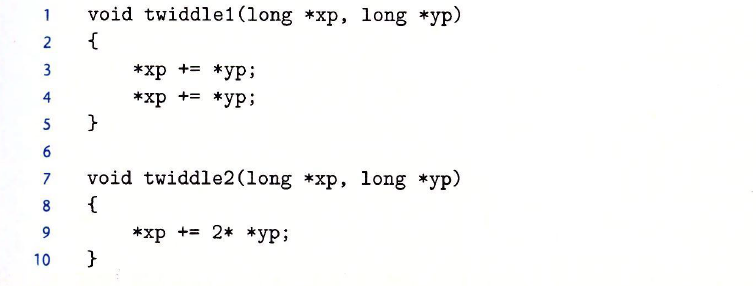

这两个过程似乎有相同的行为，都是将存储在由指针yp指示的位置处的值两次加到指针xp所指示的位置处。另一方面，函数twiddle2的效率更高一些，它只要求三次内存引用，而twiddle1需要6次。

但是考虑xp等于yp的情况：

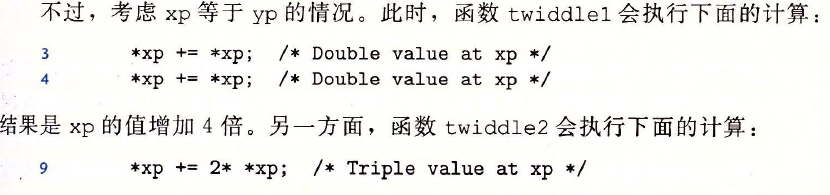

因此两个函数并不是完全相同的，所以编译器不会产生twiddle2作为twiddle1的优化。

这种两个指针可能指向同一个内存位置的情况称为**内存别名使用**。

考虑下面代码示例：

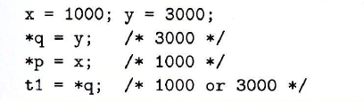

t1的计算值依赖于指针p和q是否指向内存中同一位置。**内存别名使用**造成了一个主要的**妨碍优化的因素**，这也是可能严重限制编译器产生优化代码机会的程序的一个方面。

第二个妨碍优化的因素是**函数调用**。

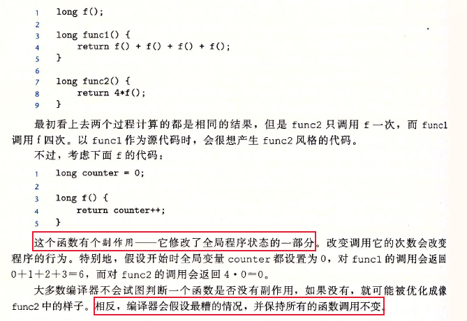

## 5.2 表示程序性能

引入度量标准 **每元素的周期数（Cycles Per Element， CPE）**, 作为一种表示程序性能并指导我们改进代码的方法。

处理器活动的顺序是由时钟控制的，时钟提供了某个频率的规律信号。

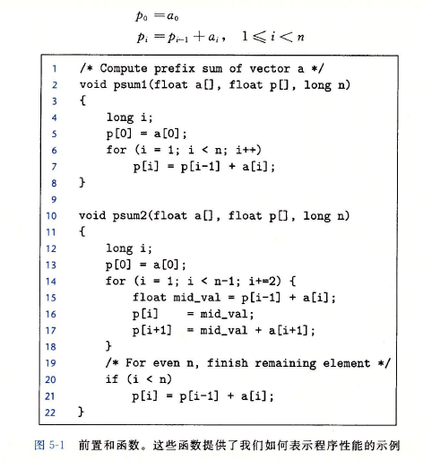

## 5.3 程序示例

向量数据结构：

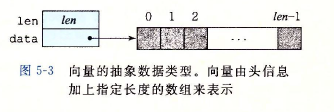

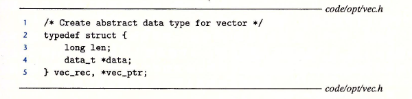

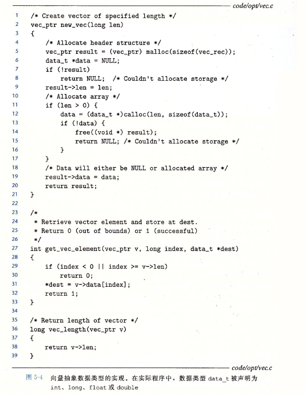

初始实现：

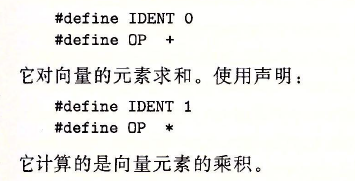

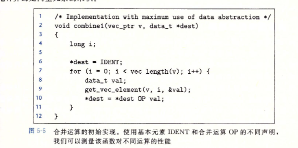

性能结果：

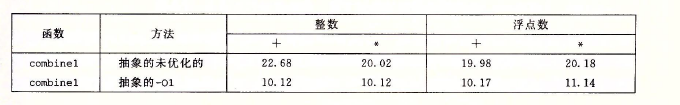

## 5.4 消除循环的低效率

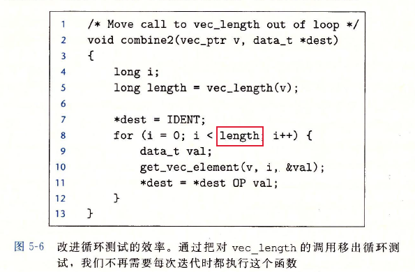

combine1不用每次都调用vec_length函数来作为for循环的测试条件，combine2做了改进，效果：

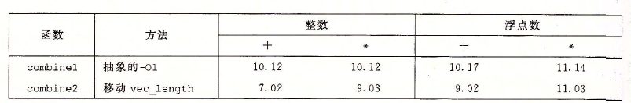

这个优化方法称为 **代码移动**。这类优化包括识别要执行多次，但是计算结果不会改变的计算。因此可以将计算移动到代码前面不会被多次求值的部分。优化编译器会试着进行代码移动，但是编译器通常会非常小心，它们不能可靠的发现一个函数是否会有副作用，因而假设函数会有副作用。一个看上去无常轻重的代码片段有隐藏的**渐进低效率**。

## 5.5 减少过程调用

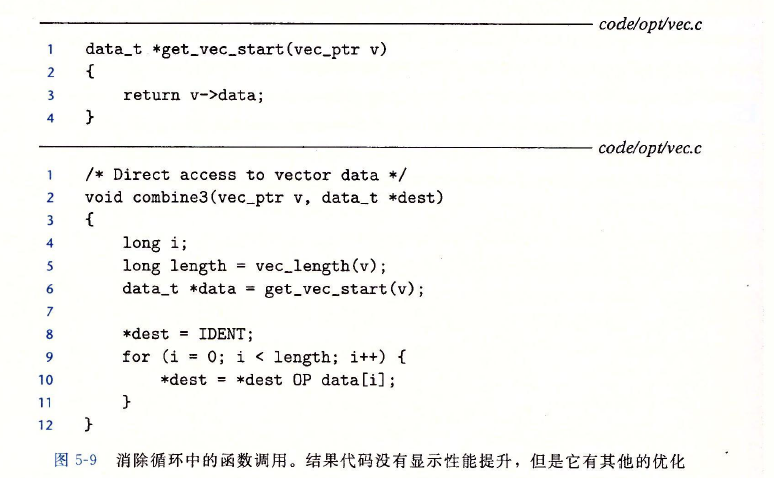

将combine2中的函数调用get_vec_element改为直接访问数组。性能效果如下：

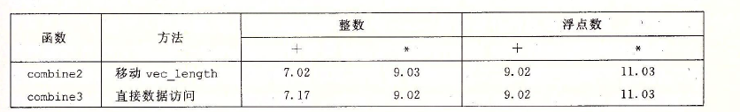

但是性能没有明显的提升，事实上，整数求和的性能还略有下降。显然，内循环中的其他操作形成了瓶颈。

## 5.6 消除不必要的内存引用

combine3的代码将合并运算的值累积在指针dest指定的位置。每次迭代时，累积变量的数值都要内存读出再写入到内存，这样的读写很浪费，因为每次读出的值就是上次迭代最后写入的值。

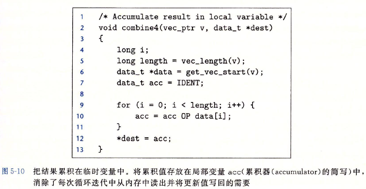

为了消除这种不必要的内存读写，引入临时变量$acc$，在循环中用来累积计算出来的值。只有在循环完成之后结果才存放在dest中，因此每次迭代的内存操作可以减少一次读和一次写（临时的写进dest，又临时读出来）。性能效果:

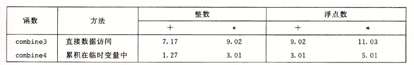

## 5.7 理解现代处理器

试图进一步提高性能，必须考虑利用处理器 **微体系结构**的优化。在实际的处理器中，是同时对多条指令求值的，这个现象称为 **指令级并行**。

当一系列操作必须按照严格顺序执行是，就会遇到 **延迟界限**，因为在下一条指令开始前，这条指令必须结束。

**吞吐量界限** 刻画了处理器功能单元的原始计算能力，这个界限是程序性能的终极限制。

Intel处理器在工业界称为 **超标量**， 意思是它可以在每个时钟周期执行多个操作，而且是 **乱序的**，即执行的顺序不一定要与它们在机器级程序中的顺序一致。

整个设计包括： **指令控制单元**（ICU） 和 **执行单元**（EU）。

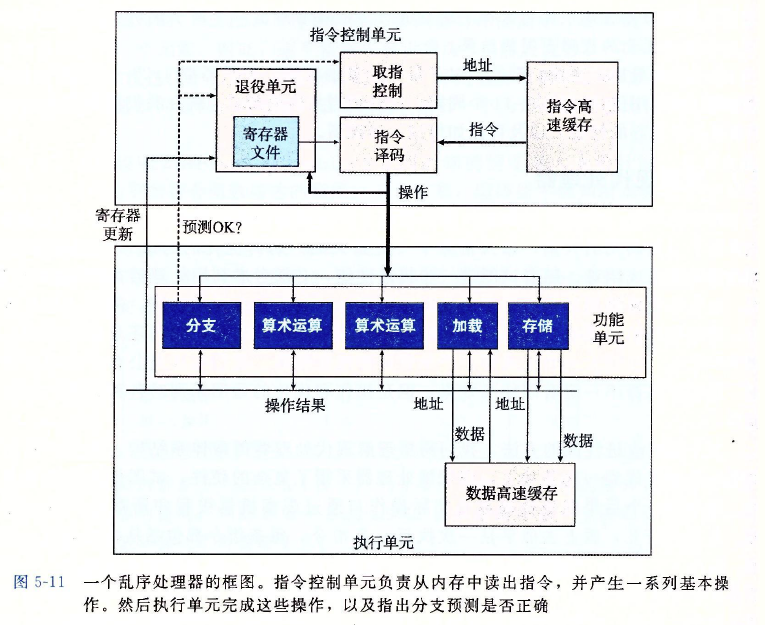 

### 功能单元的性能

延迟： 完成运算所需要的总时间

发射时间：两个连续的同类型的运算之间需要的最小时钟周期数

容量： 能够执行该运算的功能单元的数量

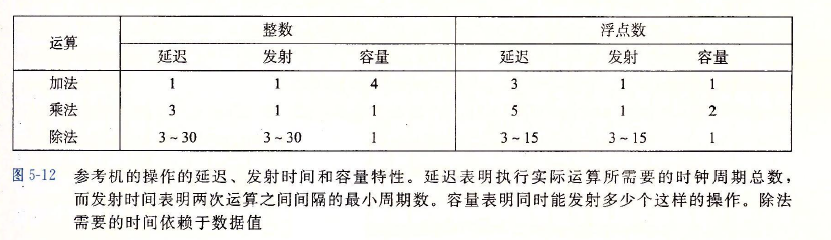

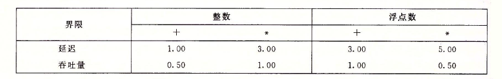

延迟界限给出了任何必须按照严格顺序完成合并运算的函数所需要的最小CPE值。

根据功能单元产生结果的最大速率，吞吐量界限给出了CPE的最小界限。

### 处理器操作的抽象模型

程序的 **数据流**展示了不同操作之间的 **数据相关** 是如何限制它们的执行顺序的。 这些限制形成了图中的 **关键路径**， 这是执行一组机器指令所需时钟周期数的一个下界。

## 5.8 循环展开

循环展开是一种程序变换，通过增加每次迭代计算的元素的数量，减少循环的迭代次数。

从两个方面改善程序性能：

1. 它减少了不直接有助于程序结果的操作的数量，例如循环索引计算和条件分支
2. 提供了方法，可以进一步变化代码，减少整个计算中关键路径上的操作数量。

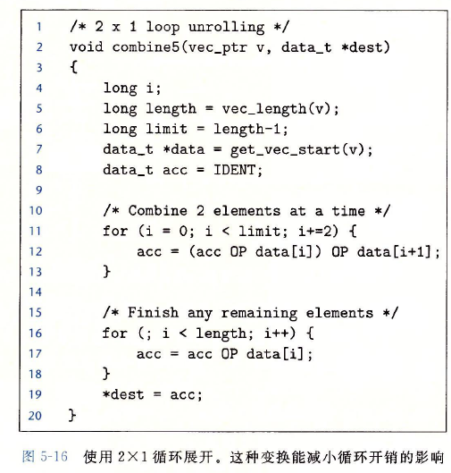

性能效果：

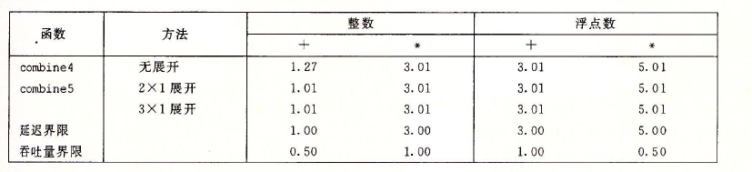

关键路径还是n个乘法操作，迭代次数减半了，但是每次迭代操作还是有两个顺序的乘法操作。这个关键路径是循环没有展开代码的的性能制约因数，而仍然是$k \times 1$循环展开代码的性能制约因数。

## 5.9 提高并行性

### 多个累积变量

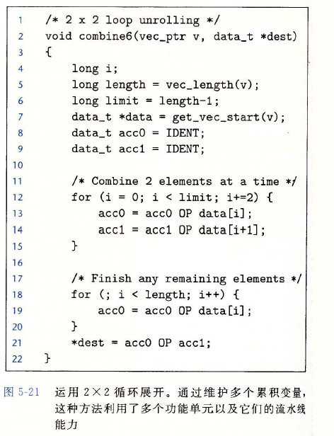

性能效果：

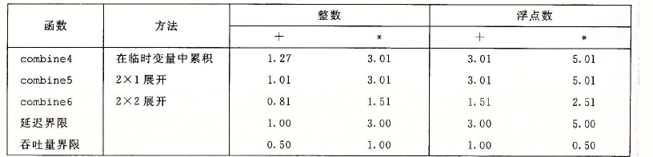

按照严格顺序对元素求积的准确性不太可能从根本上比“分成两组独立求积，然后再将这两个积相乘”更好，对大多数应用程序来说，使性能翻倍要比冒对奇怪的数据模式产生不同的结果的风险更为重要。

### 重新结合变换

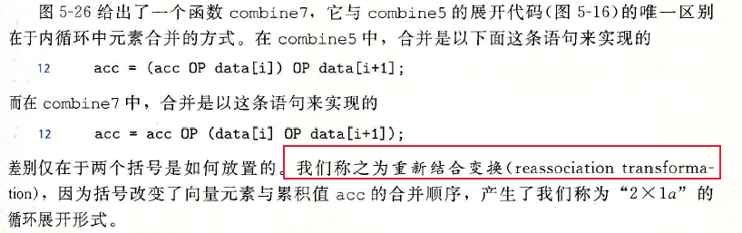

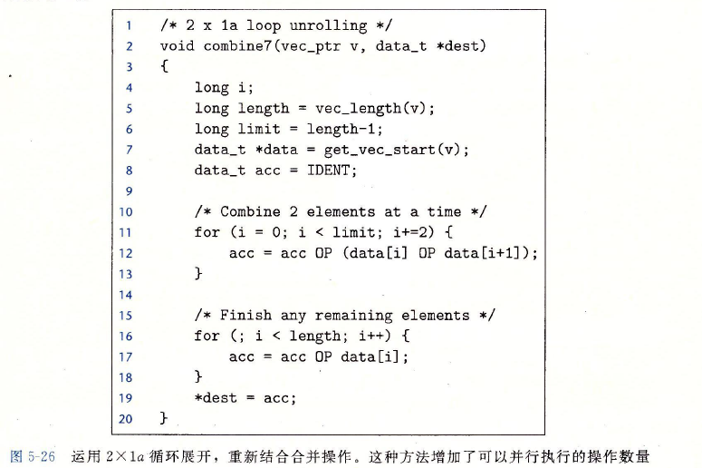

性能效果：

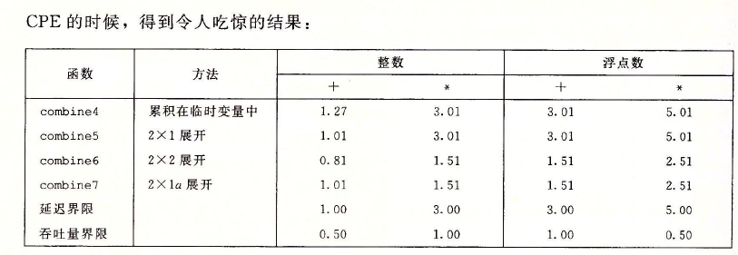

每次迭代内的第一个乘法都不需要等待前一次迭代的累积值就可以运行，**关键路径**上操作减少了一半， 因此最小可能的CPE就减少了两倍。

**重新结合变换** 可以减少计算中关键路径上操作的数量，通过更好的利用功能单元的流水线能力得到更好的性能。

## 5.10 优化合并代码的结果小结

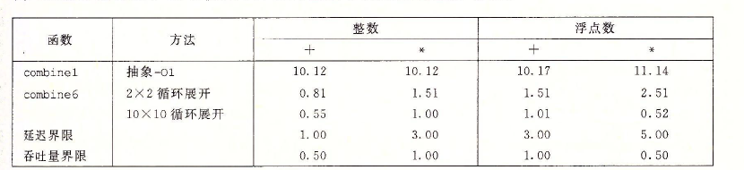

使用多项优化技术，性能提高了10-20倍，说明现代处理器具有相当的计算能力，但是我们可能需要按非常程式化的方式来编写程序将其能力诱发出来。

## 5.11 一些限制因素

程序中有某条数据相关链，这条链上的所有延迟之和等于$T$, 那么程序至少需要$T$周期才能执行完。

一个程序共需要$N$个某种运算的计算，而微处理器智能$C$个能执行这个操作的功能单元，并且这些单元的发射时间为$I$, 那么程序的执行至少需要 $N \cdot I / C$个周期。

### 寄存器溢出

如果并行度$p$超过了可用的寄存器数量，那么编译器就会诉诸 **溢出**， 将某些临时值存放到内存中， 通常是在运行时堆栈上分配空间。

### 分支预测和预测错误处罚

1. 不要过分关心可预测的分支
2.  书写适合用条件传送实现的代码：如果编译器能够产生使用 **条件数据传送** 而不是使用 **条件控制转移**的代码，可以极大的提高程序的性能。

## 5.12 理解内存性能

###  加载的性能

一个包含加载操作的程序的性能既依赖于流水线的能力，也依赖于加载单元的延迟。对两个加载单元而言，其每个时钟周期只能启动一条加载操作，所以CPE不可能低于0.5.

### 存储的性能

存储操作：将一个寄存器值写到内存。一系列的存储操作不会产生 **数据相关**。只有 **加载**操作会受存储操作的结果的影响。

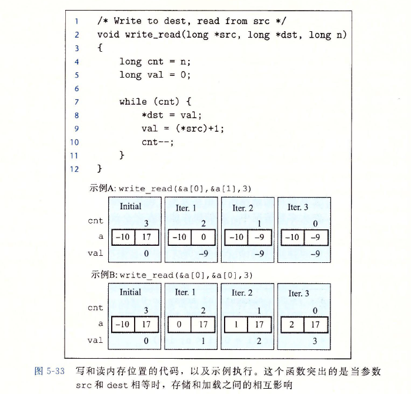

**读/写数据相关**。

存储单元包含一个存储缓冲区，它包含已经被发射到存储单元而又还没有完成的存储操作的地址和数据，这里的完成包括更新数据高速缓存。

提供该缓存区，可以使得一系列存储操作不必等待每个操作都更新高速缓存就能够执行。当 **加载**操作发生时，它必须检查存储缓冲区的条目，看有没有地址相匹配。

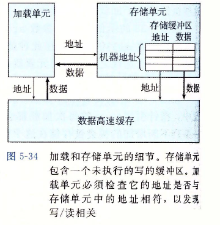

## 5.13 应用：性能提高技术

**优化程序性能的基本策略**

1. **高级设计**：遇到问题选择合适的算法和数据结构，要特别警觉，避免使用那些渐进产生糟糕性能的算法或编码技术
2. **基本编码原则**：
   - **消除连续的函数调用**。在可能时，将**计算移动到循环外**。
   - **消除不必要的内存引用**

3. 低级优化
   - **展开循环**，降低开销，并且使得进一步的优化成为可能
   - 采用多个**累积变量**和**重新结合**等技术，找到方法提高**指令级并行**
   - 用功能性的风格重写条件操作，使得编译采用**条件数据传送**

 

## **5.14 确认和消除性能瓶颈**

### 程序剖析

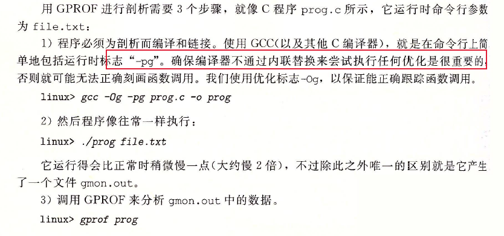

## 5.15小结

内存别名使用和过程调用，严重限制了编译器执行大量优化的能力，因此，我们必须对消除这些妨碍优化的因素负主要的责任。研究了一系列技术来对程序的性能进行优化。确认由程序中数据相关决定的关键路径，尤其是循环的不同迭代之间的数据相关，是非常重要的。采用GPROF工具来指导我们进行程序的剖析，可以检验性能是否得到了改善。

