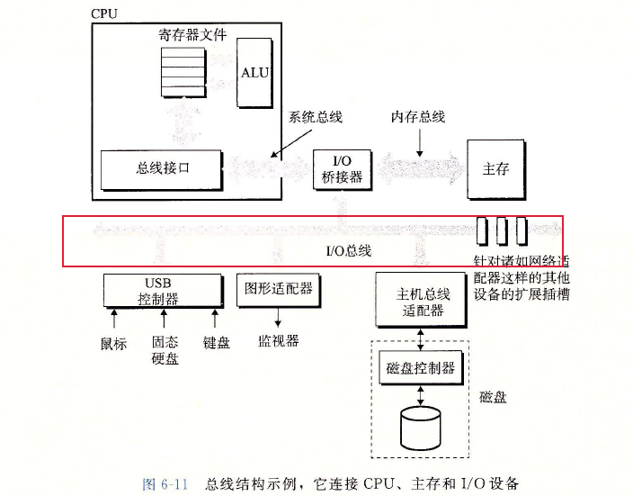
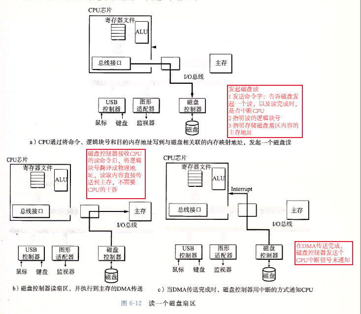
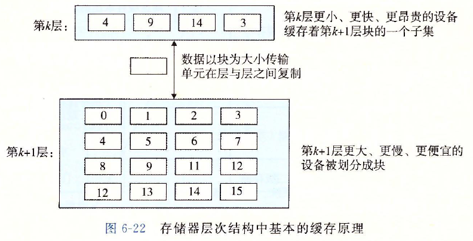
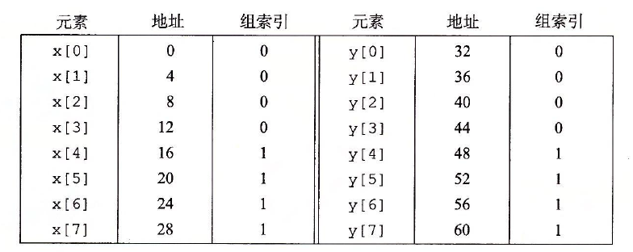
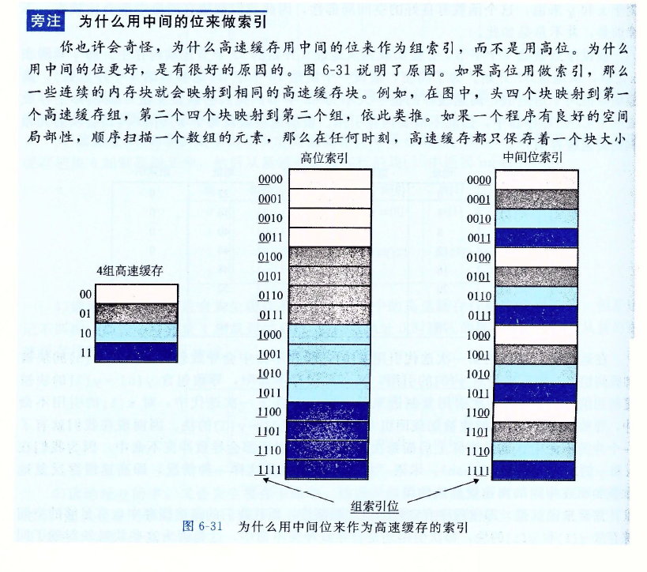
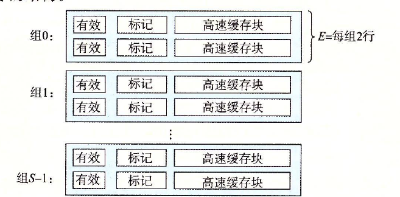
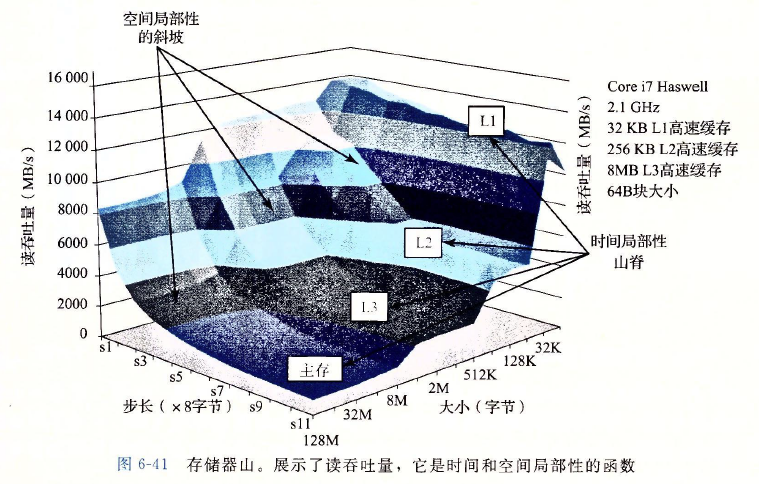
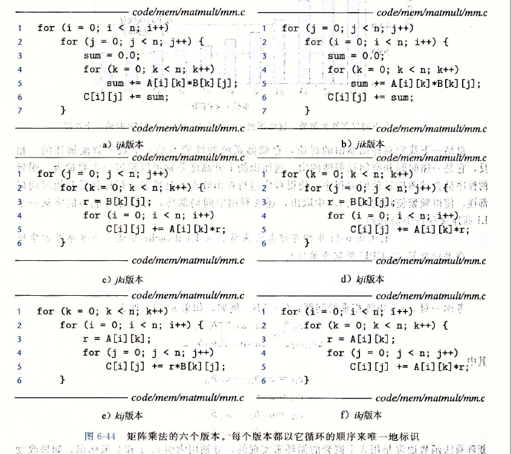

- [深入理解计算机系统第六章读书笔记](#----------------)
- [存储器层次结构](#-------)
  * [6.1 存储技术](#61-----)
    + [随机访问存储器（Random-Access Memory, RAM）](#--------random-access-memory--ram-)
    + [磁盘存储](#--------)
      - [磁盘构造](#----)
      - [磁盘容量](#--------)
      - [磁盘操作](#--------)
      - [逻辑磁盘块](#-----)
      - [连接I/O设备](#--i-o--)
      - [访问磁盘](#----)
    + [固态硬盘](#----)
  * [6.2 局部性](#62----)
    + [对程序数据引用的局部性](#-----------)
    + [取指令的局部性](#-------)
    + [局部性小结](#-----)
  * [6.3 存储器层次结构](#63--------)
    + [存储器层次结构中的缓存](#-----------)
      - [缓存命中](#----)
      - [缓存不命中](#-----)
      - [缓存不命中的种类](#--------)
      - [缓存管理](#----)
      - [存储器层次结构概念小结](#-----------)
  * [6.4 高速缓存存储器](#64--------)
    + [通用的高速缓存存储器组织结构](#--------------)
    + [直接映射高速缓存](#--------)
      - [直接映射高速缓存中的组选择](#-------------)
      - [直接映射高速缓存中的行匹配](#-------------)
      - [直接映射高速缓存中的字抽取](#-------------)
      - [直接映射高速缓存中的行替换](#-------------)
      - [综合： 运行中的直接映射高速缓存](#----------------)
      - [直接映射高速缓存中的冲突不命中](#---------------)
    + [组相联高速缓存](#-------)
      - [组相联高速缓存的组选择](#-----------)
      - [组相联高速缓存的行匹配和字选择](#---------------)
      - [组相联高速缓存中不命中时的行替换](#----------------)
    + [全相连高速缓存](#-------)
      - [全相连高速缓存组选择](#----------)
      - [全相连高速缓存行匹配和字选择](#--------------)
    + [有关写的问题](#------)
    + [高速缓存参数的性能影响](#-----------)
  * [6.5 编写高速缓存友好的代码](#65------------)
  * [6.6 综合：高速缓存对程序性能的影响](#66----------------)
    + [存储器山](#----)
    + [重新排列循环以提高空间局部性](#--------------)
    + [在程序中利用局部性](#---------)
  * [6.7 小结](#67---)

# 深入理解计算机系统第六章读书笔记 

# 存储器层次结构

存储器系统**是一个具有不同容量、成本和访问时间的存储设备的层次结构。**CPU**寄存器保存着最常用的数据。靠近CPU的小的、快速的 **高速缓存存储器**作为一部分存储在相对慢速的**主存储器**中数据和指令的缓冲区域。主存缓存存储在容量较大的、慢速**磁盘**上的数据，而磁盘又常常作为存储在**通过网络连接的其他机器的磁盘或磁带上的数据的缓冲区域。

CPU寄存器：0个周期就能访问到

高速缓存： 4-75个周期

主存：几百周期

磁盘： 几千万个周期

​       具有良好 **局部性**的程序倾向于一次又一次地访问相同的数据项集合，或是倾向于访问邻近的数据项集合。更多的倾向于从存储器层次结构中较高层次访问数据项，因此运行的更快。

​      基本的存储技术，SRAM存储器、DRAM存储器、ROM存储器以及旋转的和固态硬盘，它们被组织成存储器层次结构。**高速缓存存储器**作为CPU和主存之间的缓存区域，对应用程序性能的影响最大。

## 6.1 存储技术

### 随机访问存储器（Random-Access Memory, RAM）

1. 静态RAM（SRAM）：用来作为 **高速缓存存储器**，可以在CPU芯片上，也可以再片下，不会超过几兆字节
2. 动态RAM（DSAM）：作为主存以及图形系统的帧缓冲区，几百上千兆字节

如果断电，DRAM和SRAM会丢失它们的信息，从这个意义上来说，它们是 **易失的**。

**非易失性存储器**：即使断电，仍然保存着信息。

**闪存（flash memory）**是一类非易失性存储器，基于EEPROM（可擦写可编程）

**固态硬盘**（Solid State Disk）：基于闪存的磁盘驱动器，提供相对于传统旋转磁盘的一种更快速、更强健和更低能耗的选择。

存储在ROM（只读存储器）设备中的程序称为 **固件**。

数据流通过 **总线**的共享电子电路在处理器和DRAM主存之间来来回回。每次CPU和主存之间的数据传送都是通过一系列步骤来完成的，这些步骤称为 **总线事务**。 **读事务** 从主存传送数据到CPU， **写事务** 从CPU传数据到主存。

### **磁盘存储**

#### 磁盘构造

磁盘是保存大量数据的存储设备，数量级可以达到几百上千兆字节。从磁盘上读信息的时间为毫秒级，比DRAM读慢了10万倍，从SRAM读慢了100万倍。

磁盘由 **盘片**构成。每个盘片的两面称为 **表面**，表面覆盖着磁性记录材料。 盘片中央有一个可旋转的 **主轴**，使得盘片以固定的 **旋转速率**旋转。表面是由一组称为 **磁道**的同心圆组成。 每个磁道被划分为一组 **扇区**。每个扇区包含相等数量的 **数据位**（通常为512字节）， 这些数据编码在扇区上的磁性材料之中。 扇区之间由一些 **间隙**分隔开，间隙不存储数据位，存储用来 **标识扇区的格式化位**。

磁盘是一个或多个叠放在一起的盘片组成的，它们被封装在一个密封的包装里。整个装置是称为 **磁盘驱动器**，简称为 **磁盘**，有时也称为 **旋转磁盘**，使之区别基于

闪存的 **固态硬盘**，其没有移动部分。

**柱面**是所有盘片表面上到主轴中心的距离相等的**磁道集合**。

#### **磁盘容量**

#### **磁盘操作**

磁盘用 **读/写头**来读写存储在表面上的位，读写头连接到一个 **传动臂** 一端。

寻道时间最长， 旋转时间其次， 传送时间远远小于前两者。

#### 逻辑磁盘块

为了对操作系统隐藏现代磁盘的复杂性，现代磁盘将其构造呈现为一个简单的视图， 一个B个扇区大小的 **逻辑块**的序列，编号为0,1，..., B-1。磁盘封装中有一个小的硬件/固件设备， 称为 **磁盘控制器**，维护着逻辑块号 和 实际（物理）磁盘扇区之间的映射关系，控制器上的固件执行一个快速表查询，将一个逻辑块号映射为**(盘面， 磁道， 扇区)的三元组**，这个三元组唯一的标识了对应的物理扇区。

#### 连接I/O设备

图形卡、监视器、鼠标、键盘和磁盘这样的输入/输出(I/O)设备，都是通过 I/O**总线**， 例如Intel的 **外围设备互联（Peripheral Component interconnect, PCI）**总线连接到CPU和主存的。 系统总线和内存总线是与CPU相关的， 而PCI这样的I/O总线设计是与底层CPU无关的。

I/O总线比系统总线和内存总线慢，它可以容纳繁多的第三方I/O设备，包括有：

1. 通用串行总线（Universal Serial Bus， USB）控制器是连接到USB总线的设备的中转机构，USB总线可以连接各种外围设备等。
2. 图形卡适配器包含硬件和软件逻辑，负责CPU在显示器上画像素
3.  主机总线适配器，将磁盘连接到I/O总线
4. 其他的设备，比如网络适配器等

#### 访问磁盘

CPU使用一种称为 **内存映射I/O(memory-mapped I/O)** 的技术来向I/O设备发射命令。使用内存映射I/O的系统中，**地址空间有一块地址**是为与I/O设备通信保留的。 每个这样的地址称为一个**I/O端口（I/O port）**。 当一个设备连接到总线时，它与一个或多个端口相关联。

**直接内存访问（Direct Memory Access， DMA）**：设备可以自己执行读或者写总线事务而不需要CPU干涉的过程，这种数据传送过程称为 **DMA传送**。

### 固态硬盘

SSD封装由一个或多个**闪存芯片****和 **闪存翻译层**组成，闪存芯片替代传统旋转磁盘中的机械驱动器， 闪存翻译层成是一个硬件/固件设备， 替代磁盘控制器。

读SSD比写要快，数据是以页为单位写的，只有在一页所属的块整个被查出后，才能写这一页。

随机写慢的原因：

1. 擦除块需要较长的时间
2. 如果写操作试图修改的页中包含有效数据，那么这个块中所有带有有效数据的页都必须被复制到一个新块中，才能对该页进行写

SSD与旋转磁盘比

1. 优点：由半导体存储器构成，没有移动部件，因而随机访问时间比旋转磁盘块，能耗更低，更结实
2. 缺点： 闪存块容易磨损，同样的价格，存储容量更小

## 6.2 局部性

**局部性原理**：具有良好 **局部性**的程序倾向于一次又一次地访问相同的数据项集合，或是倾向于访问邻近的数据项集合

包括两种形式：

1. **时间局部性** ： 被引用过一次的位置很可能在不远的将来再被多次引用
2. **空间局部性**： 一个内存位置被引用了，在不远的将来引用附近的一个内存位置

现代计算机系统的各个层次，从硬件到操作系统、再到应用程序，它们的设计都利用了局部性。

1. **硬件层**：局部性原理允许计算机设计者通过引入称为 **高速缓存存储器**的小而快速的存储器来保存最近被使用的指令和数据，从而提高对主存的访问速度
2. **操作系统**: 局部性原理允许系统使用**主存**作为**虚拟地址空间**最近被使用块的高速缓存

### 对程序数据引用的局部性

sum具有良好的时间局部性，向量v按顺序读取，具有良好的空间局部性，因此，整个函数具有良好的局部性。

**步长为1的引用模式**为**顺序引用模式**，一个连续向量每隔k个元素进行访问，就称为**步长为k的引用模式**。一般而言，步长增加，空间局部性下降。

### 取指令的局部性

因为程序指令是存放在内存中的，CPU必须读这些指令，for循环体里的指令是按照连续的内存顺序执行的，因此循环有良好的空间局部性。因为循环体会被执行多次，也具有良好的时间局部性。代码区别于数据的重要属性是运行时它不能被修改。

### 局部性小结

简单原则：

1. 重复引用相同变量的程序具有良好的时间局部性
2. 对于具有步长为k的引用模式的程序，步长越小，空间局部性越好。
3. 对于取指令来说，循环具有良好的时间局部性和空间局部性，循环体越小，循坏迭代次数越多，局部性越好。

## 6.3 存储器层次结构

### 存储器层次结构中的缓存

**高速缓存**是一个小而快速的存储设备，它作为存储在更大更慢的设备中数据对象的缓冲区域，**使用高速缓存的过程称为缓存**。

层次结构中的每一层都**缓存**来自较低一层的数据对象。

第k+1层的存储器被划分成连续的数据对象组块（chunk），**称为块（block）**。每个块都有唯一的地址或名字，可以是固定大小的（通常是），也可以是可变大小的（例如存储在Web服务器上的远程HTML文件）。

任何时候，第k层的缓存包含第k+1层存块的一个子集的副本。数据总是以块大小为**传送单元**在第k层和第k+1层之间来回复制。一般而言，层次结构中低层的设备的访问时间较长，因此为了补偿这些较长的访问时间，倾向于使用更大的块。

#### 缓存命中

当程序需要第k+1层的数据对象d时，它刚好存储在第k层的一个块中，称为缓存命中。

#### 缓存不命中

当程序需要第k+1层的数据对象d时，它没有存储在第k层的一个块中，称为缓存不命中。

当发生缓存不命中时，取出所需的那个块放在第k层中，如果第k层的缓存满了，则需要覆盖一个块，覆盖一个现存的块的过程称为**替换或驱逐**这个块。

**替换策略**：决定该替换哪个块

1. 随机替换策略
2. 最近最少被使用替换策略（LRU）：选择最后被访问的时间离现在最远的块

#### 缓存不命中的种类

**冷缓存**：一个空的缓存，称为强制性不命中或冷不命中，只在刚开始时出现

​      只要发生了不命中，第k层的缓存就必须执行某个 **放置策略**，确定把第k+1层中取出的块放在哪里。**最灵活的替换策略**是允许第k+1层的任何块放在第k层的任何块中，对于存储器层次结构中高层的缓存，它们是用硬件来实现，而且速度是最优的，这个策略实现起来非常昂贵，因为随机放置块，定位起来代价很高，

因此，硬件缓存通常使用的是更严格的放置策略，这个策略将第k+1层的某个块限制放在**第k层块的一个小的子集**中。因此，这种限制性的放置策略会引起一种不命中，称为 **冲突不命中**。

**冲突不命中**：此情况下，缓存足够大，能够保存被引用的数据对象，但是因为这些对象会映射到同一个缓存块，缓存会一直不命中。

工作集： 程序每个阶段访问缓存块的某个相对稳定不变的集合，该集合称为工作集

**容量不命中：** 工作集的大小超过缓存的大小时，就是容量不命中

#### 缓存管理

管理缓存的逻辑可以是硬件、软件，或者是两种的集合。

1. 寄存器文件：由编译器管理
2. L1、L2、L3层的缓存： 由内置在缓存中的 **硬件逻辑**管理
3. 在有 **虚拟内存**的系统，DRAM主存作为存储在磁盘上的数据块的缓存：**由操作系统软件**和 **CPU上的地址翻译硬件**共同管理

#### 存储器层次结构概念小结

基于缓存的存储器层次结构行之有效，是因为较慢的存储设备比较快的存储设备更便宜，还因为程序倾向于展示局部性。

## 6.4 高速缓存存储器

### 通用的高速缓存存储器组织结构

考虑一个计算机系统，其中每个存储器地址有m位，形成$M = 2^m$个不同的地址。这样一个机器的高速缓存被组织成一个有$S = 2^s$个**高速缓存组**的数组。

每个组包含有$E$个 **高速缓存行**。 每个行是由一个 $B = 2^b$字节的数据块组成的，一个 **有效位**指明这个行是否包含有意义的信息。还有$t = m-(b+s)$个 **标记位**，它们唯一标识存储在这个高速缓存行中的块。

**高速缓存的容量$C$**：所有块的大小的和，不包括标记位和有效位，所以$C = S\times E\times B$

当加载指令指示CPU从主存地址A中读一个字时，它将地址A发送到高速缓存，高速缓存如何知道他是否包含地址A处那个字的副本呢？

1. 先比对地址中的$s$个**组索引位**，确定组的序号
2. 再比对地址中的$t$个**标记位**，同时验证**有效位**，确定具体的行
3. 再由地址中的b个**块偏移位**，给出了在B个字节数据块中的字偏移

### 直接映射高速缓存

每个组只有一行的(E = 1)的高速缓存称为 **直接映射高速缓存**

高速缓存确定一个请求是否命中，然后抽出请求字的过程，分为三步：

1. 组选择
2. 行匹配
3. 字抽取

#### 直接映射高速缓存中的组选择

#### 直接映射高速缓存中的行匹配

#### 直接映射高速缓存中的字抽取

#### 直接映射高速缓存中的行替换

对于直接映射高速缓存来说，每个组只包含一行，替换策略非常简单：用新取出的行替换当前的行

#### 综合： 运行中的直接映射高速缓存

#### 直接映射高速缓存中的冲突不命中

冲突不命中在真实的程序中很常见，会导致令人困惑的性能问题。当程序访问大小为2的幂的数组时，直接映射高速缓存中通常会发生冲突不命中。

**抖动**： 高速缓存反复地加载和驱逐相同的高速缓存块的组

高速缓存由两个组组成，高速缓存的整个大小为32字节。因此y[0]会驱逐x[0]，产生抖动。

### 组相联高速缓存

直接映射高速缓存中冲突不命中造成的问题源于每个组只有一行这个限制。**组相联高速缓存**放松了这条限制，所以每个组都保存有多于一个的高速缓存行。

#### 组相联高速缓存的组选择

#### 组相联高速缓存的行匹配和字选择

高速缓存必须搜索组中的每一行，寻找一个有效的行，其标记与地址中的标记相匹配。

#### 组相联高速缓存中不命中时的行替换

替换策略有：

1. 随机替换策略
2. 最不常使用策略（LFU）
3. 最近最少使用策略（LRU）

### 全相连高速缓存

全相连高速缓存是由一个包含所有高速缓存行的组组成的。

#### 全相连高速缓存组选择

因为只有一个组，所以不再需要组索引位。

#### 全相连高速缓存行匹配和字选择

因为高速缓存电路必须并行的搜索许多相匹配的标记，构造一个又大又快的相联高速缓存很困难。 因此，全相联高速缓存只适合做小的高速缓存，例如**虚拟内存系统中的翻译备用缓冲器(TLB)。**

### 有关写的问题

写命中：写一个已经缓存的字

​	1. 直写：当更新了缓存的字$w$后，立即将$w$的高速缓存块写回到紧接着的低一层中，缺点是每次都会引起总线流量。

​	2. 写回：尽可能的推迟更新，只有当替换算法要驱逐这个更新的块时。才写入低一层中，缺点是增加复杂性，高速缓存必须为每一个高速缓存行维护一个额外的**修改位**。

写不命中:

1. 写分配：加载相应的低一层块到高速缓存中，然后更新该块
2. 非写分配：直接把字写入到低一层

### 高速缓存参数的性能影响

1. **高速缓存大小的影响**：容量较大，可能会提高命中率。但是使大存储器运行得更快总是要难一些的。
2. **块大小的影响**：较大的块能利用程序中可能存在的空间局部性，帮助提高命中率。但是容量一定的情况下，块越大就意味着高速缓存行越小，这会损害时间局部性比空间局部性更好的命中率。较大的块对不命中处罚也有负面影响，因为传送时间更长。现代系统的高速缓存块包含64字节。
3. **相联度的影响**：较高的相联度的优点就是降低了冲突不命中出现抖动的可能性，不过会造成较高的成本，实现起来很昂贵，速度也很难变快。每一行需要更多的标记位，需要额外的LRU标志位和额外的控制逻辑。会增加命中时间，还会增加不命中处罚，因为选择牺牲行的复杂性也增加了
4. **写策略的影响**： **直写**高速缓存比较容易实现，而且能使用独立于高速缓存的 **写缓冲区**，用来更新内存，此外，读不命中的开销也没这么大，因为他们不会触发内存写。**写回**高速缓存引起的传送比较少，允许更多到内存的带宽用于执行DMA的I/O设备。越往层次结构下面走，传送时间增加，减少传送的数量就更加重要，因此更多的采用写回。

## 6.5 编写高速缓存友好的代码

基本方法：

1. 让最常见的情况运行的快
2. 尽量减少每个循环内部的缓存不命中数量
3. 对局部变量的反复使用是好的
4. 步长为1的引用模式是好的

## 6.6 综合：高速缓存对程序性能的影响

### 存储器山

一个程序从存储器系统读数据的速率称为 **读吞吐量**或者称为 **读带宽**。

### 重新排列循环以提高空间局部性

### 在程序中利用局部性

有良好局部性的程序从快速的高速缓存存储器中访问它的大部分数据，局部性差的程序从相对慢速的DRAM主存中访问它的大部分数据。

## 6.7 小结

一般而言，较快的存储技术每个位会更贵，而且容量更小，通过编写具有良好空间和时间局部性的程序来显著改进程序的运行时间。