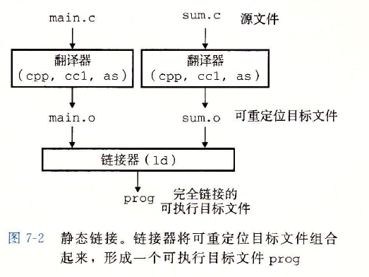
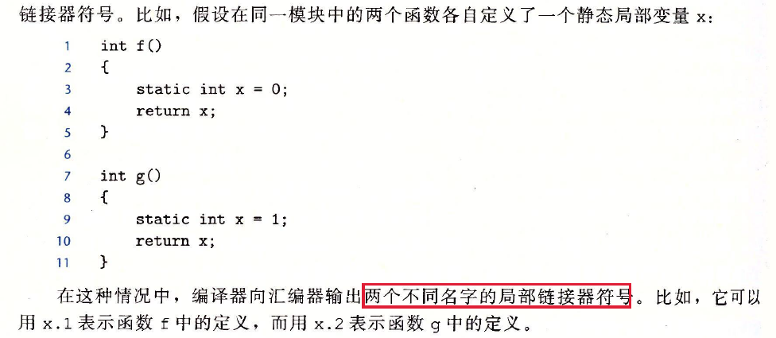
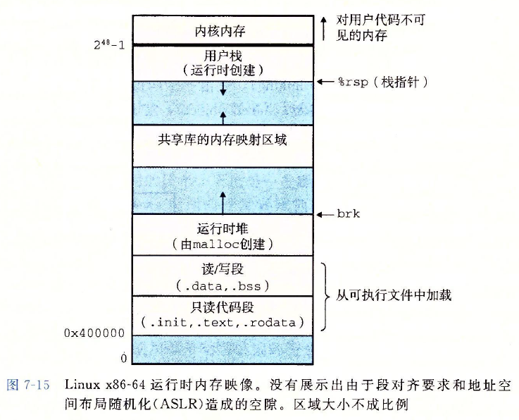
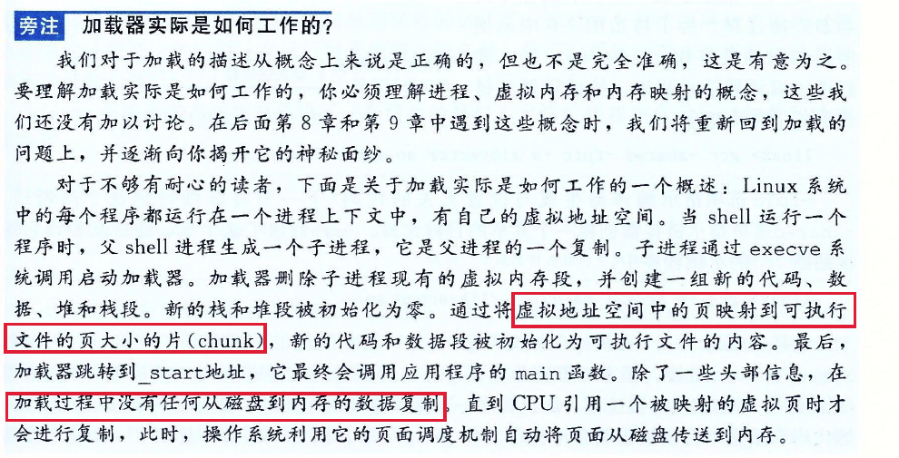
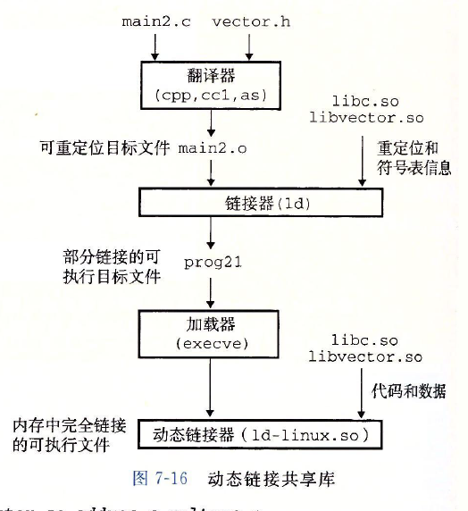
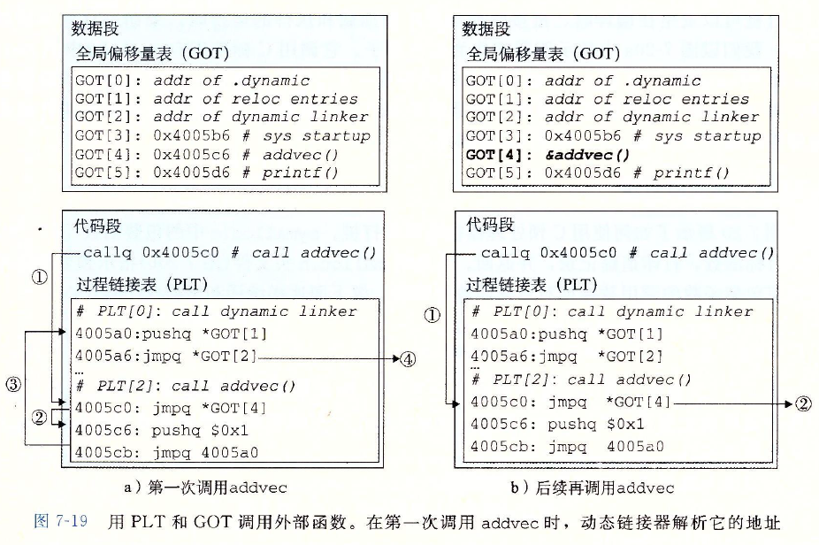
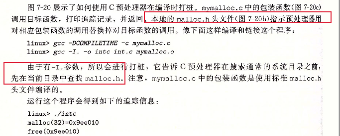

# 深入理解计算机系统第七章读书笔记 

# 链接

**链接**是将各种代码和数据片段收集并组合成为一个单一文件的过程，这个文件可以被加载（复制）到内存并执行。

链接可以执行于 **编译**时，也就是源代码被翻译成机器代码时；也可以执行于 **加载**时，也就是程序被 **加载器**加载到内存并执行时；甚至执行于 **运行**时，也就是由应用程序来执行。

链接是由 **链接器**的程序自动执行的。链接器使得 **分离编译**成为可能，我们可以将一个大型的应用程序分解成更小更好管理的模块，可以独立的修改和编译这些模块。

链接器的作用：

1. 理解链接器将帮助我们构成大型程序
2. 理解链接器将帮助我们避免一些危险的编程错误
3. 理解链接将帮助我们理解语言的作用域规则是如何实现的
4. 理解链接将帮助我们理解其他重要的系统概念
5. 理解链接将使我们能够利用共享库

## 7.1 编译器驱动程序

编译系统提供 **编译器驱动程序**，它代表用户在需要时调用语言预处理器、编译器、汇编器和链接器。

当采用GNU编译系统构造示例程序时，通过在shell中输入如下命令来调用GCC驱动程序：
$$
linux > gcc \ -Og\ -o\ prog\ main.c \ sum.c
$$

驱动程序将示例程序从ASCII码源文件翻译成可执行目标文件的过程。

1. 驱动程序首先运行C预处理器（cpp），它将C的源程序main.c翻译成一个ASCII码的中间文件main.i
2. 驱动程序运行C编译器（ccl），将main.i翻译成一个ASCII汇编语言文件main.s
3. 驱动程序运行汇编器(as)，将main.s翻译成一个 **可重定位目标文件**main.o
4. 驱动程序经过相同的过程生成sum.o，最后运行链接器ld，将main.o和sum.o以及一些必要的系统目标文件组合起来，创建一个 **可执行目标文件**。
5. 

要运行可执行文件prog，在linux shell的命令行输入;

shell调用操作系统中一个叫做 **加载器**的函数，它将可执行文件prog中的代码和数据复制到内存，然后将控制转移到这个程序的开头。

## 7.2 静态链接

静态链接器：以一组**可重定位目标文件**和**命令行参数**作为输入，生成一个完全链接的、可以加载和运行的**可执行目标文件**作为输出。

输入的可重定位目标文件由各种不同的 **代码**和 **数据节**组成，每一节都是一个连续的字节序列。指令在一节中，初始化了的全局变量在另一节中， 而未初始化的变量在另一节中。

为了构造 **可执行文件**，链接器必须完成两个主要任务：

1. **符号解析**：目标文件定义和引用符号，每个符号对应与一个函数、一个全局变量或一个静态变量（C语言中static）。符号解析的目的是将每个符号 **引用**正好与一个符号 **定义**关联起来。
2. **重定位**：编译器和汇编器生成从地址0开始的代码和数据节。 链接器通过把**每个符号定义和一个内存位置**关联起来， 从而 **重定位**这些节，然后修改所有对这些符号的引用，引的它们指向这个内存的位置。 链接器使用汇编器产生的 **重定位条目**的详细指令，不加甄别的执行这样的重定位。

## 7.3 目标文件

目标文件由三种形式：

1. **可重定位目标文件**：**包含二进制代码和数据**，其形式可以在编译时与其他可重定位目标文件合并起来，创建一个可执行目标文件，由编译器和汇编器生成
2. **可执行目标文件**：**包含二进制代码和数据**， 其形式可以被直接复制到内存并执行，由链接器生成
3. **共享目标文件**： 一种特殊类型的 **可重定位目标文件**，可以在加载或者运行时被动态的加载进内存并链接，由编译器和汇编器生成

一个 **目标模块**就是一个 **字节序列**，而一个 **目标文件**就是一个以文件形式存放在磁盘中的目标模块。

目标文件是按照特定的目标文件格式来组织的，各个系统的目标文件格式都不相同，在现代Linux和Unix系统使用 **可执行可链接格式**（Executable and Linkable Format， ELF）。

## 7.4 可重定位目标文件

典型的ELF可重定位目标文件的格式如下：

1. ELF头：以一个16字节的序列开始，这个序列描述了生成该文件的系统的字大小和字节顺序
2. 剩下的部分： 包含帮助链接器语法分析和解释目标文件的信息，包括有 ELF头的大小， 目标文件的类型（如可重定位、可执行或者共享的）、机器类型（如x86-64）、**节头部表**的文件偏移， 以及节头部表中条目的大小和数量。 

不同节的位置和大小是由**节头部表**描述的，其中目标文件中每个节都有一个固定大小的条目。夹在**ELF头和节头部表**之间的都是**节**。一个典型的**ELF可重定位目标文件**包含以下几个节：

1. **.text:** 已编译程序的机器代码
2. **.rodata:** 只读数据，比如printf语句中的格式串和开关语句的跳转表
3. **.data**： 已初始化的全局和静态C变量。局部C变量在运行时被保存在栈中，不出现在.data节，也不出现在.bss节
4. **.bss**： 未初始化的全局和静态C变量，以及所有被初始化为0的全局或静态变量。在目标文件中，该节不占据实际的空间，仅仅是一个占位符。目标文件格式区分已初始化和未初始化变量是为了空间效率，**在目标文件中，未初始化的变量不需要占据任何实际的磁盘空间**，运行时，在内存中分配这些变量，初始值为0。
5. **.symtab**：一个符号表，它存放在程序中定义和引用的函数和全局变量的信息。每个可重定位目标文件在.symtab中都有一张符号表（除非程序员特意用STRIP命令去掉它）。然而，与编译器中的符号表不同，.symtab符号表不包含局部变量的条目。
6. **.rel.text**：一个.text节中位置的列表，当链接器把这个目标文件和其他文件组合时，需要修改这些位置。 一般而言，任何调用外部函数或者引用全局变量的指令都需要修改。可执行目标文件中并不要重定位信息，通常省略。
7. **.rel.data**：被模块引用或定义的所有全局变量的重定位信息。一般而言，任何已初始化的全局变量，如果它的初始值是一个全局变量地址或者外部定义函数的地址，都需要被修改。
8. **.debug**：一个调试符号表，其条目是程序中定义的局部变量和类型定义，程序中定义和引用的全局变量，以及原始的C源文件。只有以-g选项调用编译器驱动程序时，才会得到这张表
9. **.line**： 原始C源程序中的行号和.text节中机器指令之间的映射。只要以-g选项调用编译器驱动程序时，才会得到这种表
10. **.strlab**：一个字符串表，其内容包括.symtab和.debug节中的符号表，以及节头部中的节名字。字符串表就是以null结尾的字符串的序列。

## 7.5 符号和符号表

每个可重定义目标模块m都有一个符号表，它包含m**定义和引用的符号**的信息。在链接器的上下文中，有三种不同的符号:

1. 由模块m定义并能被其他模块引用的全局符号。**全局链接器符号**对应于 **非静态的C函数和全局变量**
2. 由其他模块定义并被模块m引用的全局符号。这些符号称为**外部符号**，对应于在其他模块中定义的**非静态的C函数和全局变量**
3. 只被模块m定义和引用的 **局部符号**：对应于**带 static属性的C函数和全局变量**，这些符号在模块m中任何位置都可见，但是不能被其他模块引用

定义为带有C static属性的本地过程变量**不在栈中**管理。编译器在.data和.bss中为每个定义分配空间，并在符号表中创建一个有唯一名字的本地连接器符号。

## 7.6 符号解析

链接器解析符号引用的方法是将**每个引用**与它可输入的**可重定位目标文件的符号表中一个确定的符号定义**关联起来。

对全局符号的符号解析很棘手，还因为多个目标文件可能会定义相同名字的全局符号。在该情况下，链接器必须要么标志一个错误，要么以某种方法选出一个定义并抛弃其他定义。

### 链接器如何解析多重定义的全局变量

在编译时，编译器和汇编器输出每个全局符号，或者是 **强** 或者是 **弱**，而汇编器把这个信息隐含地编码在可重定位目标文件的符号表里。、

**强符号**： 函数和已初始化的全局变量

**弱符号**： 未初始化的全局变量

Linux链接器使用下面的规则来处理多重定义的符号名：

1. 规则1： 不允许有多个同名的强符号
2. 规则2：如果有一个强符号和多个弱符号同名，那么选择强符号
3. 规则3：如果有多个弱符号同名，那么从这些弱符号中任意选择一个

强符号和弱符号同名，可能会造成一些不易察觉的错误，而且只会触发链接器发出一条警告，通常要在程序运行很久才会表现出来。当怀疑有此类错误时，用GCC

-fno-commom标志这样的选项调用链接器，此时在遇到多重定义的全局符号时，触发一个错误。

### 与静态库连接

编译系统提供一组机制，将所有相关的目标模块打包成为一个单独的文件，称为 **静态库**，它可以用作链接器的输入。当链接器构造一个可输出的可执行文件时，它只是复制静态库里被应用程序引用的目标模块。

如果不使用静态库的缺点：

1.  让编译器辨认出对标准函数的调用，并直接生成相应的代码。这种方法将增加编译器显著的复杂性，而且每次修改一个标准函数时，就需要新的编译器版本。
2. 将所有的标准C函数都放在一个单独的可重定位目标文件中，应用程序可以把这个模块链接到他们的可执行文件中。然而，系统中每个可执行文件都包含着一份标准函数的完全副本，对磁盘空间和内存造成极度的浪费。 任何标准函数的任何改变，都要求库的开发人员重新编译整个源文件，这是一个非常耗时的操作。

静态库，在链接时，链接器将只复制被程序引用的目标模块，这就减少了可执行文件在磁盘和内存中的大小。

在Linux系统中， 静态库以一种称为 **存档**的特殊文件格式存放在磁盘中。存档文件是一组连接起来的可重定位目标文件的集合，有一个头部用来描述每个成员目标文件的大小和位置。存档文件由后缀.a标识。

### 链接器如何使用静态库来解析引用

在符号解析阶段， 链接器**从左到右**按照他们在编译器驱动程序命令行上出现的顺序来扫描**可重定位目标文件和存档文件**。

集合E：一个可重定位目标文件的集合

集合U： 一个未解析的符号（即引用了但是尚未定义的符号）集合

集合D： 一个在前面输入文件中已定义的符号集合

初始时， E、U和D为空，然后：

在命令行中，如果定义一个符号的库出现在引用这个符号的目标文件之前，那么该引用就不能被解析，链接会失败。

**关于库的一般准则是将它们放在命令行的结尾。**

## 7.7 重定位

重定位步骤中，将合并输入模块，并为每个符号分配运行地址。重定位由两步组成：

1. **重定位节和符号定义**：链接器将所有相同类型的节合并为同一类型的新的 **聚合节**。例如，来自所有输入模块的.data节被全部合并成一个节， 这个节成为输出的可执行目标文件的.data节。然后，链接器将运行时内存地址赋给新的聚合节，赋给输入模块定义的每个节，以及赋给输入模块定义的每个符号。当这一步完成时，程序中的每条指令和全局变量都有唯一的运行时内存地址。
2. **重定位节中的符号引用**： 链接器修改代码节和数据节中对每个符号的引用，使得它们指向正确的运行时地址。要执行这一步，链接器依赖于可重定位目标模块中的称为 **重定位条目**的数据结构。

### 重定位条目

当汇编器生成一个目标模块时，它并不知道数据和代码最终存放在内存中的什么位置。它也不知道这个模块引用的任何外部定义的函数或者全局变量的位置。所以，汇编器当遇到对最终位置未知的目标引用，它就会生成一个 **重定位条目**，告诉链接器在将目标文件合并成可执行文件时，如何修改这个引用。代码的重定位条目放在 **.rel.text**。已初始化数据的重定位条目放在 .**rel.data** 中。

### 重定位符号引用

## 7.8 可执行目标文件

可执行目标文件的格式类似于可重定位目标文件文件的格式。

1. ELF头：描述文件的总体格式，还包括程序的 **入口点**，也就是当程序要运行时执行的第一条指令的地址。
2. .text、.rodata和.data节与可重定位目标文件的节是相似的，除了这些节已经被重定位到它们最终的运行时内存地址以外。
3. .init节定义了一个小函数，叫做_init，程序的初始化代码会调用它
4. 因为可执行文件是 **完全链接的**（已被重定位），所以它不再需要.rel节

ELF可执行文件被设计的很容易加载到内存，可执行文件的连续的片被映射到连续的内存段。 **程序头部表**描述了这种映射关系。

## 7.9 加载可执行目标文件

要运行可执行目标文件prog, shell通过调用某个驻留在存储器中称为 **加载器**的操作系统代码来运行它。任何Linux程序都可以通过调用**execve函数**来调用加载器。

加载器将可执行目标文件中的代码和数据从磁盘复制到内存中， 然后通过跳转到程序的第一条指令或 **入口点**来运行该程序。 将程序复制到内存并运行的过程叫做 **加载**。

每个Linux程序都有一个运行时内存映像。代码段总是从地址0x400000处开始，后面是数据段。运行时 **堆** 在数据段之后，通过调用malloc库往上增长。 堆后面的区域是为共享模块保留的。 用户栈总是从最大的合法用户地址，$2^{48}-1$开始的，向较小的内存地址增长。栈上的区域，从地址$2^{48}$开始，是为 **内核**中的代码和数据保留的，所谓内核就是操作系统驻留在内存的部分。

当加载器运行时，创建上图所示的内存映像。在程序头部表的引导下，加载器将可执行文件的片复制到代码段和数据段。然后，加载器跳转到程序的入口点，也就是**_start函数**的地址。 该函数是在系统目标文件ctrl.o中定义的，对所有的C程序是一样的。 _start函数调用系统启动函数 _ _ libc_start_main，该函数定义在libc.so中。它初始化执行环境，调用用户层的main函数，处理main函数的返回值，并且在需要的时候把控制返回给内核。

## 7.10 动态链接共享库

静态库仍然有一些缺点，必须定期维护。另外几乎每个C程序都使用标准的I/O函数，比如printf和scanf。在运行时，这些函数的代码会被复制到每个运行进程的文本段。在一个运行上百个进程的典型系统中，这将是对 **内存**稀缺资源的极大浪费。

**共享库**是致力于解决静态库缺陷的一个产物， 它是一个 **目标模块**，在运行或加载时，可以加载到任意的内存地址，并和一个在内存中的程序链接起来。 这个过程称为 动态链接，是由一个叫做 **动态链接器**的程序来执行的。 共享库也称为 **共享目标**，linux系统中常用后缀.so表示，微软的操作系统称为DLL（动态链接库）。

共享库实现共享的方式：

1. 一个库只有一个.so文件， 所有引用该库的可执行目标文件共享这个.so文件中的代码和数据，而不是像静态库的内容那样复制和嵌入到引用它们的可执行的文件中
2. 在内存中，一个共享库的.text节的一个副本可以被不同的正在运行的进程共享

动态链接器通过执行下面的任务完成重定位：

1. 重定位libc.so的文本和数据到某个内存段
2. 重定位libvector.so的文本和数据到另一个内存段
3. 重定位prog21中所有对由libc.so和libvector.so定义的符号的引用。

最后，动态链接器将控制传递给应用程序。此时，共享库的位置就固定了，并且在程序的执行过程中不会改变。

## 7.11 从应用程序中加载和链接共享库

应用程序在运行时可以进行动态链接器加载和链接某个共享库，而无需在编译时将那些库链接到应用中。

## 7.12 位置无关代码

**共享库**的一个主要目的就是允许多个正在运行的进程**共享内存中相同的库代码**，因而节约宝贵的内存资源。

可以加载而无需重定位的代码称为 **位置无关代码**（Position-Independent Code, PIC)。用户对GCC使用-fpic选项指示GNU编译系统生成PIC代码，共享库的编译必须总是使用该选项。

### PIC数据引用

无论我们在内存中的何处加载一个目标模块，数据段和代码段的距离总是保持不变。因此，代码段中任何指令和数据段中任何变量之间的 **距离**都是一个运行时常量。

想要生成对全局变量PIC引用的编译器利用了这个事实，它在数据段开始的地方创建了一个表， 叫做 **全局偏移量表（GOT）**。在GOT中，每个被这个目标模块引用的**全局数据目标（**过程或全局变量）都有一个8字节条目。 编译器还为GOT中每个条目生成一个 **重定位记录**。在加载时，动态链接器会重定位GOT中的每个条目，使得它包含目标的正确的 **绝对地址**。 每个引用全局目标的目标模块都有自己的GOT。

### PIC函数调用

**延迟绑定**：将过程地址的绑定推迟到第一次调用该过程时

使用延迟绑定的动机是对于像一个libc.so这样的共享库输出的成千上百个函数中，一个典型的应用程序只会使用其中的很少的一部分，把函数地址的解析推迟到它实际被调用的地方，能避免动态链接器在加载时进行成百上千个其实并不需要的重定位。第一次调用过程运行时开销很大，但是其后的每次调用都只会花费一条指令和一个间接的内存引用。

延迟绑定通过 **GOT和过程链接表（Procedure Linkage Table，PLT）**来实现的。如果目标模块调用共享库中的任何函数，那么他就会有自己的GOT和PLT，GOT是数据段的一部分，而PLT是代码段的一部分。

PLT和GOT如何合作在运行时解析函数的地址：

## 7.13 库打桩机制

**库打桩：**允许我们截获对共享库函数的调用，取而代之执行自己的代码。使用打桩机制，可以追踪对某个特殊库函数的调用次数，验证和追踪它的输入和输出值，甚至替换成一个完全不同的实现。

**基本思想**：给定一个需要打桩的 **目标函数**，创建一个 **包装函数**，它的原型和目标函数完全一样。 使用某种特殊的打桩机制，我们可以欺骗系统调用包装函数而不是目标函数，包装函数执行自己的逻辑，然后调用目标函数，再将目标函数的返回值传递给调用者。

### 编译时打桩

### 链接时打桩

Linux静态链接器支持用 $--wrap \ f$ 标志进行链接时打桩。这个标志告诉链接器，把对符号f的引用**解析成_ _wrap_f**，还要把对符号 **_ _real _ f的引用解析为f。**

### 运行时打桩

编译时打桩需要能够访问程序的源代码，链接时打桩需要能够访问程序的可重定位对象文件。

运行时打桩只需要能够访问可执行目标文件，是基于**动态链接器的LD_PRELOAD环境变量**机制实现的

，

## 7.14 处理目标文件的工具

## 7.15 小结

链接可以在编译时由静态编译器来完成，也可以再加载时和运行时由动态链接器来完成。链接器处理称为目标文件的二进制文件，它有3种不同的形式，可重定位的、可执行的和共享的。 可重定位的目标文件由静态链接器合并成一个可执行的目标文件，它可以加载到内存中并执行。 共享目标文件是在运行时由动态链接器链接和加载的，或者隐含的在调用程序被加载和开始执行时，或者根据需要在程序调用dlopen库的函数时。

链接器的两个主要任务是符号解析和重定位。符号解析将目标文件中的每个全局符号都绑定到唯一的定义，而重定位确定每个符号的最终内存地址，并修改对那么目标的引用。

 静态链接器是由像GCC这样的编译驱动程序调用的，它们将多个可重定位目标文件合并成一个单独的可执行目标文件。多个目标文件可以定义相同的符号，而链接器用来解析这些多重定义的规则。

多个目标文件可以被连接到一个单独的静态库中。链接器用库来解析其他目标模块中的符号引用。许多链接器通过从左到右的顺序来解析符号引用，这也是另一个引起令人迷惑的链接时的错误来源。

加载器将可执行文件的内容映射到内存，并运行这个程序。链接器还可能生出部分链接的可执行目标文件，这样的文件中有对定义在共享库中的例程和数据的未解析的引用。在加载时，加载器将部分链接的可执行文件映射到内存，然后调用动态链接器，它通过加载共享库和重定位程序中的引用来完成链接任务。

被编译为位置无关代码的共享库可以加载到任何地方，也可以在运行时被多个进程共享。为了加载、链接和访问共享库的函数和数据，应用程序也可以在运行时使用动态链接库。