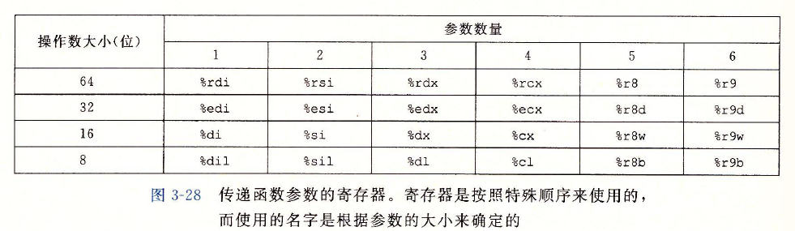

- [深入理解计算机系统第三章读书笔记](#----------------)
- [程序的机器级表示](#--------)
  * [3.1 历史观点](#31-----)
  * [3.2 程序编码](#32-----)
    + [机器级代码](#---------)
    + [代码示例](#----)
  * [3.3 数据格式](#33-----)
  * [3.4 访问信息](#34-----)
    + [操作数指示符](#-----------)
    + [数据传送指令](#------)
    + [压入和弹出数据](#-------)
  * [3.5 算术和逻辑操作](#35--------)
    + [加载有效地址](#------)
    + [特殊的算术操作](#-------)
  * [3.6 控制](#36---)
    + [条件码](#---)
    + [访问条件码](#-----)
    + [跳转指令](#----)
    + [条件传送指令来实现条件分支](#-------------)
    + [switch语句](#--switch----)
  * [3.7 过程](#37---)
    + [运行时栈](#----)
    + [转移控制](#----)
    + [数据传送](#----)
    + [栈上的局部存储](#-------)
    + [寄存器中的局部存储空间](#-----------)
  * [3.8 数组分配和访问](#38--------)
    + [基本原则](#----)
    + [指针运算](#----)
    + [嵌套的数组](#-----)
    + [定长数组与变长数组](#---------)
  * [3.9 异数的数据结构](#39--------)
    + [结构](#--)
    + [联合](#--)
    + [数据对齐](#----)
  * [3.10 在机器级程序中将控制和数据结合起来](#310------------------)
    + [理解指针](#----)
    + [使用GDB调试器](#--gdb---)
    + [内存越界引用和缓冲区溢出](#------------)
    + [对抗缓冲区溢出攻击](#---------)
    + [支持变长栈帧](#------)
  * [3.11 浮点代码](#311-----)
  * [3.12 小结](#312---)

# 深入理解计算机系统第三章读书笔记 

# 程序的机器级表示

计算机执行机器代码，用**字节序列**编码低级的操作，包括处理数据、管理内存、读写存储设备上的数据，以及利用网络通信。 编译器基于编码语言的规则、目标机器的指令级和操作系统遵循的惯例，经过一系列的阶段生成机器代码。 GCC C 语言编译器以汇编代码的形式产生输出，**汇编代码是机器代码的文本表示**，给出程序中的每一条指令。然后GCC调用**汇编器和链接器**，根据汇编代码生成可执行的机器代码。

## 3.1 历史观点

## 3.2 程序编码

该命令中gcc指的是GCC C编译器。编译器选项-Og告诉编译器使用会生成符合原始C代码整体结构的机器代码的优化等级。使用较高级别优化产生的代码会严重变形，以至于产生的机器代码和初始源代码之间的关系非常难以理解。使用-Og优化作为学习工具，从程序的性能考虑，较高级别的优化（选项-O1或-O2）被认为是较好的选择。

 		gcc调用了一整套的程序，将源代码转化成可执行代码。

1. **C预处理器**扩展源代码，插入所有#include命令指定的文件，并扩展所有用#define声明指定的宏
2. **编译器**产生两个文件源文件的汇编代码，名字分别为p1.s和p2.s。
3. **汇编器**将汇编代码转换成二进制目标文件代码跑p1.o和p2.o。目标代码是机器代码的一种形式，包含所有指令的二进制表示，但是还没有填入全局值的地址。
4. **链接器**将两个目标代码文件与实现库函数的代码（例printf）的代码合并，并产生最终的可执行代码文件p（由-o p 指定的）。

### **机器级代码**

两种抽象：

1. 由指令级体系结构或指令级架构（ISA）来定义机器级程序的格式和行为，它定义了处理器状态、指令的格式、以及每条指令对状态的影响。
2. 机器级程序使用的内存地址是虚拟地址，提供的内存模型看上去是一个非常大的额字节数组。

C语言提供了一种模型，可以在内存中声明和分配个数数据类型的对象，但是机器代码只是简单将**内存**看成是一个很大的，**按字节寻址的数组**。汇编代码不区分有无符号整数，不区分各种类型指针，甚至不区分指针和整数。

### 代码示例

生成汇编代码文件***mstore.s***包括有：

生成目标代码文件**mstore.o**, 它是二进制格式的，所以无法直接查看。

就是上面列出的汇编指令对应的目标代码。机器执行的程序只是一个字节序列，它是一系列指令的编码，机器对产生这些指令的源代码几乎一无所知。

查看机器代码文件的内容，采用反汇编程序非常有用，该程序根据机器代码产生一种类似于汇编代码的格式。采用该命令实现：

结果有：

格式注解：

以'.'开头的行都是指导汇编器和链接器工作的伪指令。通常可以忽略这些行。在C语言中可以插入汇编代码，一种是编写完整的函数，放进一个独立的汇编代码文件中，让汇编器器和链接器把它和用C语言书写的代码合并起来。二是可以使用GCC的内联汇编特性。

## 3.3 数据格式

Intel用术语“字”表示16位数据类型。

## 3.4 访问信息

一个x86-64的中央处理单元（CPU）包含一组16个存储64位值的**通用目的寄存器**，可以用来存储整型数据和指针。

### **操作数指示符**

大多数指令都有一个或多个操作数，操作数分为三种类型：

1. 立即数，用$0x1F
2. 寄存器 $r_a$表示任意寄存器a， $R[r_a]$表示它的值。
3. 内存引用，它会根据计算出来的地址访问某个内存位置。 $M_b[Addr]$表示在内存中从地址Addr开始的b个字节的引用。
4. 

### 数据传送指令

注意： movl指令以寄存器作为目的时，会把寄存器的高位4字节设置为0.

***movz***把目的中剩余的字节填充为0，***movs***把目的中剩余的字节填充为符号位。

C语言中所谓的指针就是地址，间接引用指针就是将该指针放在一个寄存器中，然后再内存中引用这个寄存器。

### 压入和弹出数据

栈指针$\%rsp$保存栈顶元素的地址。因为栈和程序代码以及其他形式的程序数据都是放在同一内存中，所以程序可以用标准内存寻址方法访问栈内的任何位置。

## 3.5 算术和逻辑操作

### 加载有效地址

***leaq指令***，是从内存读数据到寄存器，但实际上并没有引用内存。它的第一个操作数看上去是一个内存引用，但该指令并不是从指定的位置读入数据，**而是将有效地址写入到目的操作数。**能执行加法和有限形式的乘法。

### 特殊的算术操作

## 3.6 控制

采用jump指令控制应该被传递到程序的某个其他部分。

### 条件码

CF：进位标志。最近的操作使最高位产生了进位。可用来检查无符号操作的溢出。

ZF：零标志。最近的操作使得结果为0。

SF：符号标志。最近的操作使得到的结果为负数。

OF：溢出标志。最近的操作导致一个补码溢出（正溢出或负溢出）。

ADD指令完成C表达式$t = a + b$的功能：

leaq指令不改变任何条件码，因为它是用来地址计算的。除此之外，图3-10中所有的指令都会设置条件码。

该指令只设置条件码而不改变任何寄存器。

### 访问条件码

条件码通常不会直接读取，常用的使用方法有3种：

1. 根据条件码的组合，将一个字节设置为0或1
2. 条件跳转到程序的其他部分
3. 有条件的传送数据

### 跳转指令

***jmp***指令是无条件跳转，可以直接跳转或者间接跳转。

### 条件传送指令来实现条件分支

实现条件操作的传统方法是通过使用**控制**的条件转移，程序沿着一条执行路径执行，而当条件不满足时，就走另一条路径。

一种替代策略是使用**数据**的条件转移。这种方法计算一个条件操作的两种结果，然后再根据条件是否满足从中选取一个。只有在一些受限制的情况中，这种策略才可行，可以使用简单的**条件传送**指令来实现它，**条件传送**更符合现代处理器的性能特性。因为现代处理器使用**流水线**来获得高性能，指令的实行是并发的，因此需要提前确定下一步的指令，而使用控制的条件转移，可能会对分支预测出错，因此会浪费15-30个时钟周期。编译器必须考虑浪费的计算和由于分支预测错误所造成的性能处罚之间的相对性能。

### **switch语句**

通过使用跳转表这种数据结构使得实现更加高效。使用跳转表的优点是执行开关语句的时间与开关情况的数量无关。

## 3.7 过程

过程是软件中一种很重要的抽象。提供了一种封装代码的方式，用一组指定的参数和一个可选的返回值实现某种功能。过程的形式多样：函数、方法、子例程和处理函数等。

假设过程P调用过程Q，Q执行后返回到P。这些动作包括下面一个或多个机制：

1. **传递控制** 在进入过程Q时，程序计数器必须被设置为Q 的起始地址，然后在返回时，把程序计数器设置为P中调用Q后面那条指令的地址。
2. **传递数据** P必须能够向Q提供一个或多个参数，Q必须能够向P返回一个值
3. **分配和释放内存** 开始时，Q可能需要为局部变量分配空间，而在返回前，又必须释放这些存储空间。

### 运行时栈

当过程需要的存储空间超出寄存器能够存放的大小时，就会在栈上分配空间。这个部分称为函数的**栈帧**。通过寄存器，过程P可以传递最多6个整数值（指针和整数），如果Q需要更多的参数，则P在调用Q前在自己的栈帧里存储好这些参数。

### 转移控制

### 数据传送

通过寄存器和栈来传递数据（函数参数）。

### 栈上的局部存储

有些时候，**局部数据必须存放在内存中**，常见的情况有：

1. 寄存器不足够存放所有的本地数据
2. 对一个局部变量使用地址运算符$\&$，因此必须能够产生一个地址
3. 某些局部变量是数组或结构，因此必须能够通过数组或结构引用被访问到。

### 寄存器中的局部存储空间

寄存器组是唯一被所有过程共享的资源。根据惯例，寄存器$\%rbp、\%rbp$和$\%r12-r15$, 被划分为**被调用者保存寄存器**。过程P调用Q时，Q必须保存这些寄存器的值，保证它们的值在Q返回到P时与Q被调用时是一样的。所有其他的寄存器，除了栈指针$\%rsp$，都分类为**调用者保存寄存器**。这就意味着任何函数都可以修改它们。

## 3.8 数组分配和访问

C语言中的数组是一种将标量数据聚集成更大数据类型的方式。

### 基本原则

对于数据类型$T$和整型常数$N$,声明如下：$ T \ A[N] $

起始位置表示为$x_A$, 声明有两个效果:

1. 在内存中分配一个$L \cdot N$字节的连续区域， $L$是数据类型$T$的大小（单位为字节）。
2. 其次，引入了标识符$A$，可以用A来作为指向数组开头的指针，这里指针的值就是$x_A$。

可以用$0\sim N-1$的整数索引来访问该数组元素，数组元素i被放在地址为$x_A + L \cdot i$的地方。

### 指针运算

$p$是一个指向类型为$T$的数据的指针，$p$的值为$x_p$，那么表达式$p+i$的值为$x_p+L \cdot i$,  $L$是数据类型$T$的大小。

单操作数操作符$\&$和$*$可以产生指针和间接引用该指针。 因此，表达式$Expr 和 * \ \&Expr$是等价的。

数组引用$A[i]$等同于表达式$*\ (A+i)$, 它计算第$i$个数组元素的地址，然后访问这个内存位置。

### 嵌套的数组

声明

$int \ A[5][3]$ 

与 

$typedo \ int \ row3\_t[3]; $

$row3\_t \ A[5] ;$

是等价的。

### 定长数组与变长数组

## 3.9 异数的数据结构

C语言提供了两种将不同类型的对象组合到一起创建数据类型的机制：

1. **结构（struct）**：用关键字struct来声明，将多个对象集合到一个单位中
2. **联合（union）**： 用关键字union来声明，允许几种不同的类型来引用一个对象。

### 结构

**结构**的所有组成部分都存放在内存中一段**连续的区域**内。指向结构的指针就是**结构第一个字节的地址**。编译器维护关于每个结构类型的信息，指示每个字段**（field）**的偏移， 然后以这些偏移作为内存引用指令中的位移，从而产生对结构元素的**引用**。

**结构声明及其存储结构**：

### 联合

提供了一种方式，能够规避C语言的类型系统，允许以多种类型来引用一个对象。其语法结构和结构的声明一样，语义不同。

**联合不同字段共用一片内存区域，不偏移**。当两个字段的使用是互斥的，使用联合声明可以减少分配空间的总量。

如二叉树的数据结构，每个叶子节点都有两个double类型的数据值，而每个内部节点都有指向两个孩子节点的指针，但是没有数据。

有效数据结构是4 + 16 = 20  个字节，但是需要对齐，所以是总共需要24个字节。

### 数据对齐

对齐数据可以提高内存系统的性能。

**对齐原则**是任何$K$字节的基本对象的地址必须是$K$的倍数。

编译器在汇编代码中放入命令，指明全局数据所需的对齐。

## 3.10 在机器级程序中将控制和数据结合起来

### 理解指针

1. **每个指针都对应一个类型**。这个类型表明该指针指向哪一类对象。

2. **每个指针都有一个值**。这个值是某个指定类型的对象的地址。特殊的$NULL（0）$值表示该指针没有任何地方。
3. **指针用$\&$运算符创建**。
4. **$*$操作符用于间接引用指针**。其结果是一个值，它的类型与该指针的类型一致。间接引用是用内存引用来实现的，要么是存储到一个指定的地址，要么是从一个指定的地址读取。
5. **数组与指针紧密相连**。一个数组的名字可以像指针变量一样引用（但是不能修改）。数组引用$a[3]$与指针运算和间接引用($*(a + 3)$)有一样的效果。
6. **将指针从一种类型强制转换为另一种类型，只改变它的类型，而不改变它的值**。相当于换了一种解释方式。强制类型转换的一个效果就是改变指针运算的伸缩。
7. **指针也可以指向函数**。这提供了一个很强大的**存储**和向代码**传递引用**的功能，这些**引用**可以被程序的某个其他部分调用。

### 使用GDB调试器

常见命令：

gdb常用命令：

r 重新运行

b 设置断点 b functionname//  b *0x5859c0

c 运行到下一个断点处

n next到

s step到

info breakpoints 显示所有断点信息

info register  pc  显示指定寄存器信息

info register 显示所有寄存器信息

set $name = "Hell0" 设置临时变量

set {int}0x83040 = 4 给内存区域值变化

p name 打印name变量xinx

x /52c 0x402400 打印内存在0x402400为起点，52个字节的内存信i息

 watch $rsp 监控寄存器

https://blog.csdn.net/github_38148039/article/details/103744270

### 内存越界引用和缓冲区溢出

**C对于数组引用不进行任何的边界检查，而且局部信息和状态信息（例如保存的寄存器值和返回地址）都存放在栈中**。这两种情况结合到一起就能导致严重的程序错误，对**越界的数组元素的写操作会破坏存储在栈中的**状态信息。当程序使用这个被破坏的状态，试图重新加载寄存器执行$ret$指令时，就会出现很严重的错误。

1. **缓冲区溢出**：在栈中分配某个字符数组来保存一个字符串，但是字符串的长度超出了为数组分配的空间。

**缓冲区溢出的一个更加致命的使用就会让程序执行它本来不愿意执行的函数**。

### 对抗缓冲区溢出攻击

1. **栈随机化**：其思想使得栈的位置在程序每次运行时都有变化，因此，即是许多机器都运行同样的代码，它们的栈地址空间都是不同的。实现方式是：在程序开始时，在栈上分配一段$0 \sim n$字节之间的随机大小的空间，例如，使用分配函数$alloca$在栈上分配指定字节数量的空间。分配的范围$n$必须足够大，才能获得足够多的栈地址变化，但是又要足够小，不至于浪费程序太多的空间。

空操作雪橇进行暴力破解，插入很长的一段nop，只要返回地址在这一顿序列中的任何一处，都会到达我们的攻击地址，因此目标地址的范围扩大，破解栈随机化的可能性增大。

2.  **栈破坏检测**：加入一种栈保护者机制，来检测缓冲区是否越界。其思想是在栈帧中任何局部缓冲区与栈状态之间存储一个特殊的**金丝雀**值。该值程序每次运行时随机产生的。

金丝雀值是用**段寻址**从内存中读入的，其存放在一个特殊的段中，**标志为“只读”**，这样攻击者就不能覆盖储存的金丝雀值。

3. **限制可执行代码区域**：消除攻击者向系统中插入可执行代码的能力，通过限制哪些内存区域能够存放可执行代码来实现。

### 支持变长栈帧

为了管理变长栈帧，代码使用寄存器%rbp作为**帧指针**（有时也称为基指针）。

## 3.11 浮点代码

## 3.12 小结

在本章中，我们窥视了C语言提供的抽象层下面的东西，了解了机器级编程。通过让编译器产生机器级程序的汇编代码表示，我们了解了编译器和它的优化能力，以及机器、数据类型和指令级。更完整的了解了程序如何将数据存储在不同的内存区域中。

机器级程序和它们的汇编代码表示，与C程序的差别很大。各种数据类型之间的差别很小。C语言中缺乏边界检查，使得许多程序容易出现缓冲区溢出。

：

