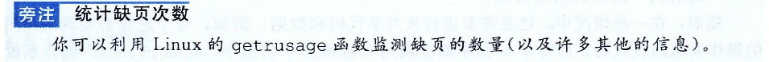

- [深入理解计算机系统第九章读书笔记](#----------------)
- [虚拟内存](#----)
  * [9.1 物理和虚拟寻址](#91--------)
  * [9.2 地址空间](#92-----)
  * [9.3 虚拟内存作为缓存的工具](#93------------)
    + [DRAM 缓存的组织结构](#dram--------)
    + [页表](#--)
    + [页命中](#---)
    + [缺页](#--)
    + [分配页面](#----)
    + [又是局部性救了我们](#---------)
  * [9.4 虚拟内存作为内存管理的工具](#94--------------)
  * [9.5 虚拟内存作为内存保护的工具](#95--------------)
  * [9.6 地址翻译](#96-----)
    + [结合高速缓存和虚拟内存](#---------------)
    + [利用TLB加速地址翻译](#--tlb------)
    + [多级页表](#----)
    + [综合：端到端的地址翻译](#-----------)
  * [9.7 案例研究：Intel core i7/Linux 系统](#97------intel-core-i7-linux---)
  * [9.8 内存映射](#98-----)
    + [再看共享对象](#------)
    + [再看fork函数](#--fork--)
    + [再看execve函数](#--execve--)
    + [使用mmap函数的用户级内存映射](#--mmap----------)
  * [9.9 动态内存分配](#99-------)
    + [malloc和free函数](#--malloc-free----)
    + [为什么要使用动态内存分配](#------------)
    + [分配器的要求和目标](#---------)
    + [碎片](#--)
    + [隐式空闲链表](#------)
    + [放置已分配的块](#-------)
    + [分割空闲块](#-----)
    + [获取额外的堆内存](#--------)
    + [合并空闲块](#-----)
    + [带边界标记的合并](#--------)
    + [综合：实现一个简单的分配器](#-------------)
    + [显示空闲链表](#------)
    + [分离的空闲链表](#-------)
  * [9.10 垃圾收集](#910-----)
    + [垃圾收集器的基本知识](#----------)
    + [Mark&Sweep垃圾收集器](#mark-sweep-----)
  * [9.11 C程序中常见的与内存有关的错误](#911-c--------------)
  * [9.12 小结](#912---)

# 深入理解计算机系统第九章读书笔记 

# 虚拟内存

为了有效的管理内存并且少出错，现代系统提供了一种对主存的抽象概念，叫做 **虚拟内存**。虚拟内存是 **硬件异常**、**硬件地址翻译**、**主存**、**磁盘文件**和 **内核软件**的完美交互，它为每个进程提供了一个大的、一致的和私有的地址空间。

**虚拟内存提供了三个重要的能力：**

1. 将主存看成是一个储存在磁盘上的地址空间的高速缓存，在主存中只保留活动区域，并根据需要在磁盘和主存之间来回传送数据，通过该方式，高效的使用了主存
2. 为每个进程提供了一致的地址空间，从而简化了内存管理
3. 保护了每个进程的地址空间不被其他进程破坏

## 9.1 物理和虚拟寻址

计算机系统的主存被组织成一个由M个连续的字节大小的单元组成的数组。每字节都有唯一的 **物理地址**。

**物理寻址**：CPU使用物理地址来访问内存

**虚拟寻址**：CPU通过生成一个虚拟地址来访问主存，该虚拟地址在被传送到内存之前先转换成适当的物理地址。

**地址翻译**：将虚拟地址转换为物理地址，地址翻译需要**CPU硬件和操作系统**之间的紧密合作

CPU芯片上叫做 **内存管理单元（Memory management Unit,  MMU）**的专用硬件，利用存放在主存中的 **查询表**来动态翻译成虚拟地址，该表的内容由操作系统管理。

## 9.2 地址空间

地址空间是一个非负整数地址的有序集合$\{0,1,2,...\}$，如果地址空间的整数是连续的， 称为 **线性地址空间**。

CPU从一个有$ N = 2^n$个地址的地址空间中生成虚拟地址， 该地址空间称为 **虚拟地址空间**，$\{0,1,2,...,N-1\}$。

地址空间的大小由表示最大地址所需要的 **位数**来描述的。现代系统通常支持32位或者64位虚拟空间。

**物理地址空间**对应于系统中物理内存的$M$个字节，$\{0,1,2,...,M-1\}$.

虚拟内存的基本思想，允许每个数据对象有多个独立的地址，其中每个地址都选自一个不同的地址空间。主存中的每个字节都有一个选自 **虚拟地址空间**的虚拟地址和一个 **选自物理地址**空间的物理地址。

## 9.3 虚拟内存作为缓存的工具

虚拟内存系统通过将 **虚拟内存**分割为 **虚拟页（Virtual Page， VP）**的大小固定的块，每个虚拟页的大小为$P = 2^p$字节，**物理内存**被分割为 **物理页（Physical Page， PP）**,大小也为$P$字节， 物理页也称为 **页帧**。

虚拟页面的集合分为三个不相交的子集：

1. **未分配的**: 虚拟内存系统还未分配的页。未分配的块没有任何数据和它们相关联，因此不占用任何磁盘空间
2. **缓存的**： 当前已缓存在物理内存中的已分配页
3. **未缓存的**：未缓存在物理内存中的已分配页
4. 

### DRAM 缓存的组织结构

**DRAM缓存：**表示虚拟内存系统的缓存， 它在主存中缓存虚拟页。DRAM缓存的组织结构完全是由巨大的不命中开销驱动的，因为大的不命中发出，虚拟页往往很大，通常是4KB-2MB。由于大的不命中处罚， DRAM缓存是 **全相联的**，即任何虚拟页都可以放置在任何物理页中。DRAM缓存总是使用 **写回**。

### 页表

**页表**：将虚拟页映射到物理页。

每次地址翻译硬件将一个虚拟地址转换为物理地址时，都会读取页表。操作系统负责维护页表的内容，以及在磁盘和DRAM之间来回传送页。

页表就是一个 **页表条目（Page Table Entry， PTE）**的数组

虚拟地址空间中的每个页在页表中一个 **固定偏移量处**都有一个 **PTE**， 每个PTE由一个 **有效位**和一个 **n位地址字段**组成。有效位表明该虚拟页当前是否被缓存在DRAM中。

有效位设置了：地址指向虚拟页缓存在物理页中的物理内存地址

没有设置： 地址指向虚拟页在磁盘的地址

### 页命中

地址翻译硬件将虚拟地址作为一个索引来定位PTE2，并从内存中读取它，因为设置了有效位，所以地址翻译硬件就知道VP2

是缓存在内存中。

### 缺页

DRAM缓存不命中称为 **缺页**。

地址翻译硬件从内存中读取PTE3，从有效位推断出VP3未被缓存，并且触发一个 **缺页异常**。缺页异常调用内核中的缺页异常处理程序，该程序会选择一个牺牲页，如果该牺牲页被修改过，那么内核就会将它复制会磁盘。然后内核从磁盘复制VP3到内存中的PP3，并且更新PTE3，随后返回。 当异常处理程序返回时，会重新启动导致缺页的指令，该指令会把导致缺页的虚拟地址重发送到 **地址翻译软件**，但是此时，VP3已经缓存中，因此页命中了。

在虚拟内存的习惯说法中，块被称为页。在磁盘和内存之间传送页的活动叫做 **交换**或者 **页面调度**。当有页面不命中发生时，才换入页面的这种策略称为 **按需页面调度**。

### 分配页面

操作系统分配一个新的虚拟内存页时，调用malloc，VP5的分配过程是在磁盘上创建空间并更新PTE5，使它指向磁盘上这个新创建的页面。

### 又是局部性救了我们

尽管在整个运行过程中程序引用的不同页面的总数可能超出物理内存总的大小，但是局部性原则保证了在任意时刻，程序将趋向于在一个较小的 **活动页面**集合上工作， 这个集合叫做 **工作集**。

只要我们的程序有好的时间局部性，虚拟内存系统就能工作的相当好。但是如果工作集的大小超出了物理内存的大小，那么程序将产生一种不幸的状态， 叫做 **抖动**。

## 9.4 虚拟内存作为内存管理的工具

操作系统为每个进程提供了一个独立的页表，因而也是一个独立的虚拟地址空间。

基本思想：

多个虚拟页面可以映射到同一个共享物理页面上。**按需页面调度**和独立的 **虚拟地址空间**的结合，对系统中内存的使用和管理造成了深远的影响。VM简化了 **链接**和 **加载**、 **代码和数据共享**，以及应用程序的内存的分配。

1.  **简化链接**：独立的地址空间允许每个进程的内存映像使用相同的基本格式，而不管代码和数据实际存放在物理内存的何处。
2.  **简化加载**：虚拟内存使得向内存中加载可执行文件和共享对象文件变得容易。要把目标文件中.text和.data节加载到一个新创建的进程中，linux加载器为代码和数据段分配虚拟页，把它们标记为无效的（即未被缓存的），将页表条目指向目标文件中适当的位置。

​        **内存映射**：将一组连续的虚拟页映射到任意一个文件中的任何位置的表示法，Linux提供mmap的系统调用，允许应用程序自己做内存映射

3.  **简化共享**：独立地址空间为操作系统提供了一个管理用户进程和操作系统自身之间共享的一致机制。
4.  **简化内存分配**： 虚拟内存向用户进程提供一个简单的分配额外内存的机制。当用户进程调用malloc，操作系统分配一个k个**连续的虚拟内存**页面，并且将它们映射到任意位置的k个任意的物理页面。由于页表工作的方式，操作系统**没有必要分配k个连续的物理页面**。

## 9.5 虚拟内存作为内存保护的工具

地址翻译机制以一种自然的方式扩展到提供更好的访问机制，因为每次CPU生成一个地址时，地址翻译硬件都会读一个PTE，所以通过在PTE上添加一些额外的许可位来控制对一个虚拟页面内容的访问十分简单。

如果指令违反了许可条件，CPU就会触发一个一般保护故障，将控制传递给内核中的异常处理程序。该异常报告称为 **段错误**。

## 9.6 地址翻译

MMU如何利用页表来实现 **地址翻译**：

CPU中的一个控制寄存器， **页表基址寄存器（PTBR）**指向当前页表。n位的虚拟地址分为： p位的 **虚拟页面偏移（VPO）**和 n-p位的 **虚拟页面（VPN）**。

MMU利用VPN来选择适当的PTE。将 **物理页号（PPN）**和虚拟地址中VPO结合起来，得到相应的 **物理地址**。因为物理页面和虚拟页面都是P字节的，所以 **物理页面偏移（PPO）**和 VPO是相同的。

**页面命中时**：

CPU硬件执行的步骤：

**页面缺页**：

### **结合高速缓存和虚拟内存**

使用物理地址来访问SRAM高速缓存，

1. 使用物理寻址，多个进程同时在高速缓存中有存储块和共享来自相同虚拟页面的块成为很简单的事。
2. 而且高速缓存无需处理保护问题，因为访问权限的检查是地址翻译过程的一部分。

**地址翻译发生在高速缓存查找之前。**

### 利用TLB加速地址翻译

每次CPU产生一个虚拟地址，MMU就必须查阅一个PTE，在最糟糕的情况下，会要求从内存中多取一次数据，代价是几十到上百个周期。为了试图消除这种开销，在MMU中包括一个关于PTE的小缓存，称为 **翻译后备缓冲器**（TLB）。

TLB是一个小的、虚拟寻址的缓存，其中每一行都保留着一个由单个PTE组成的块，通常有高度的相联度。

所有的地址翻译步骤都是在芯片上的MMU中执行的，因此非常快。翻译步骤：

### 多级页表

假设是一个32位的地址空间，4KB$(2^{12})$的页面和一个4字节的PTE，那么即使应用程序引用的只是虚拟地址空间中很小的一部分，也总是需要一个4MB$(2^{32}/ 2^{12} \times 4 = 4MB)$的页表驻留在内存中。

### 综合：端到端的地址翻译

## 9.7 案例研究：Intel core i7/Linux 系统

## 9.8 内存映射

Linux通过将一个虚拟内存区域与一个磁盘上的 **对象**关联起来，以初始化这个虚拟内存区域的内容，该过程称为 **内存映射**。

虚拟内存区域可以映射到两种类型的对象中的一种：

1. **Linux文件系统中的普通文件**：一个区域可以映射到一个普通磁盘文件的连续部分，例如一个可执行目标文件。文件区被分成页大小的片，每一片包含一个虚拟页面的初始内容。因为按需进行调度，所以这些虚拟页面没有实际交换进入物理内存，直到CPU第一次引用到页面（即发射一个虚拟地址，落在地址空间这个页面的范围之内）。如果区域比文件区要大，那么就用0来填充这个区域剩下的部分。
2. **匿名文件**：一个区域也可以映射到一个匿名文件，匿名文件是由内核创建的，包含的全是二进制0。CPU第一次引用这样一个区域内的虚拟页面时，内核就在物理内存中找到一个合适的牺牲页面，用二进制0覆盖页面并更新页表。在磁盘和内存之间没有实际的数据传送，因此，映射到匿名文件的区域中的页面也叫做 **请求二进制零的页**

一旦一个虚拟页面被初始化了，它就在一个由内核维护的专门的 **交换文件**之间换来换去。交换文件也称 **交换空间**或者 **交换区域**。需要意识到的是，交换空间限制着当前运行的进程能够分配的虚拟页面的总数。

### 再看共享对象

一个对象可以被映射到虚拟内存的一个区域，要么作为 **共享对象**，要么作为 **私有对象。**

如果进程将一个**共享对象**映射到它的虚拟地址空间的一个区域内，那么这个进程对这个区域的任何写操作，对于那些把这个共享对象也映射到它们虚拟内存的其他进程也是可见的，而且，这些变化也会反映在磁盘上的原始对象中。映射到共享对象的虚拟内存区域为 **共享区域**。

如果进程对于一个映射到 **私有对象**的区域做出的改变，对于其他进程是不可见的，并且进程在这个区域所做的任何写操作也不会反映到磁盘上的对象。

私有对象使用一种 **写时复制**的技术被映射到内存中。

在物理内存中也只保存私有对象的一份副本，对于每个映射到私有对象的进程，相应私有区域的条目都被标记为只读，并且区域结构被标记为 **私有的写时复制**。当有进程试图写私有区域的某个页面，这个写操作就会触发一个保护故障，此时故障处理程序就会在物理内存中创建这个页面的一个新副本，更新页表指向这个新的副本，然后恢复这个页面的可写权限。

### 再看fork函数

fork函数被当前函数调用时，内核为 **新进程**创建各种数据结构，并分配给它一个唯一的PID。将两个进程的每个页面都标记为只读， 并将两个进程的每个区域结构都标记为 **私有的写时复制**。

### 再看execve函数

在当前进程中的程序执行了如下的execve调用

用a.out程序有效替代当前程序，加载并运行a.out经过以下步骤：

1. **删除已存在的用户区域**：删除当前进程虚拟地址的用户部分已存在的区域结构
2. **映射私有区域**：为新程序的代码、数据、bss和栈区域创建新的区域结构。所有这些新的区域都是私有的，写时复制的。
3. **映射共享区域**： 如果a.out与共享对象链接，那么这些对象是动态链接到程序的，然后再映射到用户虚拟地址空间中的共享区域内
4. **设置程序计数器PC**：execve做的最后一件事即使设置当前进程上下文中的程序计数器，使之指向代码区域的入口点、

### 使用mmap函数的用户级内存映射

Linux进程可以使用mmap函数来创建新的虚拟内存区域，并将对象映射到这些区域中。

prot参数指明权限：由可被CPU执行的指令组成、可读、可写、不能被访问

flags： 指明是匿名对象还是私有的、写时复制的对象。

## 9.9 动态内存分配

动态内存分配器维护着一个进程的虚拟内存区域，称为 **堆**。分配器将堆视为一组大小不同的 **块**的集合来维护。每个块就是一个连续的虚拟内存片， 要么是 **已分配的**，要么是空闲的。

分配器分为两种风格，不同点在于由哪个实体来负责释放已分配的块。

1. **显式分配器**：要求应用显示释放任何已分配的块。C语言的malloc和free。
2. **隐式分配器**：要求分配器检测一个已分配的块何时不再被程序所使用，那么就释放这个块。 隐式分配器也叫做 **垃圾收集器**，自动释放未使用的已分配的块叫做 **垃圾收集**。

### **malloc和free函数**

### 为什么要使用动态内存分配

**最重要的原因是经常直到程序实际运行时，才知道某些数据结构的大小。**

### 分配器的要求和目标

**要求**：

1. 处理任意请求序列
2. 立即响应请求
3. 只使用堆
4. 对齐要求
5. 不修改已分配的块

**目标**：

1. 最大化吞吐率：每个单位时间里完成的请求数 最大
2. 最大化内存利用率：使用峰值利用率来衡量分配器使用堆的效率

### 碎片

造成堆利用率很低的主要原因是一种称为 **碎片** 的现象，当虽然有未使用的内存但不能用来满足分配请求时，就发生这种现象。

1. **内部碎片**：已分配块比有效载荷大时发生。
2. **外部碎片：**当空闲内存合计起来足够满足一个分配请求，但是没有单独的空闲块足够大可以来处理这个请求时发生的。外部碎片比内部碎片量化要更困难，因为它不仅取决于以前请求的模式和分配器的实现方式， 还取决于 **将来**请求的模式。

### 隐式空闲链表

### 放置已分配的块

**首次适配**：从头开始搜索空闲链表，选择第一个合适的空闲块， **下一次适配**与之很相似，只是不是从头开始，而是从上一次查询结束的地方开始。

**最佳适配**检查每个空闲块，选择适合所需请求大小的最小空闲块。

### 分割空闲块

### 获取额外的堆内存

分配器调用堆内存，向内核请求额外的堆内存。

### 合并空闲块

分配器可以选择 **立即合并**和 **推迟合并**。立即合并可以在常数时间内完成，但是对于某些请求模式，这种方式会产生一种形式的抖动，块会反复的合并，然后马上分割。

### 带边界标记的合并

边界标记技术，允许在常数时间内进程对前面块的合并。在每个块的结尾处添加一个**脚部**，其中脚部就是头部的一个副本。

### 综合：实现一个简单的分配器

### 显示空闲链表

使用双向链表而不是隐式空闲链表，使首次适配的分配时间从块总数的线性时间减少到了 **空闲块**数量的线性时间。

释放一个块的时间可以是线性的，也可以是常数。

1. 常数： 用 **后进先出**的顺序维护链表，将新释放的块放置在链表的开始处。
2. 线性：按照 **地址顺序**来维护链表，其中链表每个块的地址都小于它后继的地址。有更高的内存利用率。

显示链表的缺点是空闲块必须足够大，来包含所有需要的指针，以及头部和可能的脚步，这就导致了更大的最小块大小，也潜在的提高了内部碎片的程度。

### 分离的空闲链表

**分离存储**来减少分配块所用时间的方法，就是维护多个空闲链表，其中每个链表中的块有大致相等的大小。一般的思路是将所有可能的块大小分成一些等价类， 也叫做 **大小类**。

1. 简单分离存储：每个大小类的空闲列表包含大小相等的块，每个块的大小就是这个大小类中最大元素的大小。
2. 分离适配：分配器维护着一个空闲链表的数组。每个空闲链表是和一个大小类相关联的，并且被组织成某种类型的显示或隐式链表。C标准库malloc采用该方法，因为该方法既快速，对内存的使用也很有效率。
3. 伙伴系统

## 9.10 垃圾收集

**垃圾收集器**是一种动态内存分配器，自动释放程序不再需要的已分配块。这些块称为**垃圾**，自动回收存储的过程叫做 **垃圾收集**。

### 垃圾收集器的基本知识

垃圾收集器将内存视为一张有向 **可达图**，该图的节点被分为一组 **根节点**和一组 **堆节点**。每个堆节点对应堆中的一个已分配块。根节点对应于不在堆中的位置，它们中包含指向堆中的指针，这些位置可以是寄存器、栈里的变量，或者是虚拟内存中读写数据区域内的全局变量。

### Mark&Sweep垃圾收集器

该垃圾收集器由 **标记**阶段和 **清除**阶段组成。

1. **标记阶段**：标记出根节点的所有可达的和已分配的后继
2. **清除阶段**：释放每个未被标记的已分配块

## 9.11 C程序中常见的与内存有关的错误

1. 间接引用坏指针
2. 读未初始化的内存
3. 允许栈缓冲区溢出
4. 假设指针和它们所指向的对象是相同大小的
5. 造成错位错误
6. 引用指针，而不是它所指向的对象
7. 误解指针运算
8. 引用不存在的变量

9. 引用空闲堆块中的数据
10. 引起内存泄漏

## 9.12 小结

