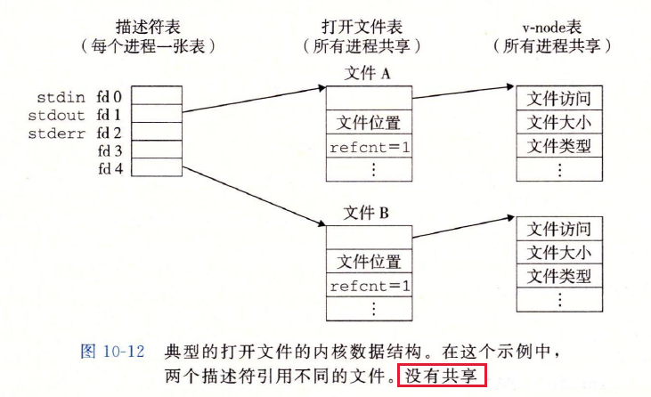
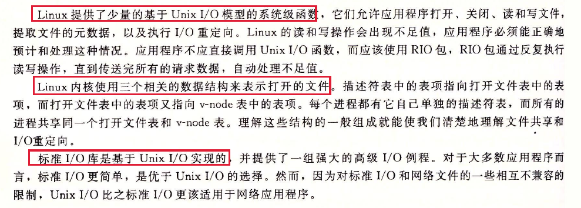

- [深入理解计算机系统第十章读书笔记](#----------------)
- [系统级I/O](#---i-o)
  * [10.1 Unix I/O](#101-unix-i-o)
  * [10.2 文件](#102---)
  * [10.3 打开和关闭文件](#103--------)
  * [10.4 读和写文件](#104------)
  * [10.5 用RIO包健壮的读写](#105--rio------)
  * [10.6 读取文件元数据](#106--------)
  * [10.7 读取目录和内容](#107--------)
  * [10.8 共享文件](#108-----)
  * [10.9 I/O重定向](#109-i-o---)
  * [10.10 标准I/O重定向](#1010---i-o---)
  * [10.11 综合： 我该用哪些I/O函数](#1011----------i-o--)
  * [10.12 小结](#1012---)

# 深入理解计算机系统第十章读书笔记 

# 系统级I/O

输入/输出（I/O）是在主存和外部设备（磁盘驱动器、终端和网络）之间复制数据的过程。**输入操作**是从I/O设备复制数据到内存，**输出操作**是从主存数复制数据到I/O设备。

## 10.1 Unix I/O

一个Linux文件就会一个$m$个字节的序列：
$$
B_0, B_1, ..., B_k, ..., B_{m-1}
$$
所有的I/O设备（网络、磁盘和终端）都被模型化为文件，而所有的输入和输出都被当作对相应文件的读和写来执行。将设备映射为 **文件**的方式，允许Linux内核引出一个简单、低级的应用接口， 称为 **Unix I/O**，这使得所有的输入和输出都能以一种统一且一致的方式来执行。

1. **打开文件**：一个应用程序通过要求内核打开相应的文件，来访问一个I/O设备。内核返回一个小的非负整数，叫做 **描述符**。它在后续对此文件的所有操作中标识这个文件。 内核记录有关这个打开文件的所有信息。 应用程序只需记住这个 **描述符**。
2. Linux shell 创建的每个进程开始时都有三个打开的文件： **标准输入（描述符0）**， **标准输出（描述符1）**， **标准错误（描述符2）**。
3. **改变当前的文件位置**： 对于打开的文件， 内核保存着一个 **文件位置k**，初始为0， 这个文件位置就是从文件开头起始的字节偏移量。应用程序能够通过执行seek操作，来显示的设置文件的当前位置为k。
4. **读写文件**：一个读操作就是从文件复制n > 0个字节到内存，从当前位置k开始，然后将k增加到k+n。当n大于文件字节数量时，会触发 $end-of-line（EOF）$条件，应用程序能检测到这个条件。在文件结尾处并没有明显的“EOF符号”。
5. **关闭文件**：当引应用完成了对文件的访问之后，会通知内核关闭这个文件。 此时，内核会释放文件打开时创建的数据结构，并将这个描述符恢复到可用的描述符池中。

## 10.2 文件

每个Linux文件都有一个类型(type)来表明其在系统中的角色：

1. **普通文件**：包含任意数据。应用程序常常区分 **文本文件和二进制文件**，文本文件是只含有ASCII或Unicode字符的普通的文件。 二进制文件是所有其他的文件。对内核而言，两种没有区别。
2. **目录**：是包含一组 **链接** 的文件，其中每个链接都将一个文件名映射到一个文件，这个文件可能是另一个目录。 每个目录至少含有两个条目，'.'到该目录自身的链接， '..'是到目录层次中父目录的链接。
3. **套接字**：是用来与另一个进程进行跨网络通信的文件
4. **其他文件类型**： **命名通道**、**符号链接**、 **字符和块设备**

目录层次结构中的位置用 **路径名来指定**，分为两种形式：

1. 绝对路径名： hello.c的绝对路径名为 /home/droh/hello.c
2. 相对路径名： 如果/home/droh是当前工作目录，则hello.c的相对路径名就是./hello.c。如果/home/bryant/是当前工作目录， 则相对路径名为../home/droh/hello.c。

## 10.3 打开和关闭文件

1. 调用open函数打开文件，将filename转换为一个文件描述符，返回描述符数字，返回的描述符总是在进程中当前没有打开的**最小描述符**。

flags: 指明进程是读、写等方式访问该文件。

mode：指定文件的访问权限位：

2. 调用close函数关闭打开的文件。关闭已关闭的描述符会出错。

   

## 10.4 读和写文件

通过调用read和write函数来执行输入和输出。

调用lseek函数，应用程序能够显示修改当前文件的位置。

在一些情况下，read和write传送的字节比应用的程序要求的少，原因有：

1. **读时遇到EOF**
2. **从终端读文本行**：如果打开的文件是与终端相关联的（键盘和显示器），那么每个read函数将一次传送一个文本行，返回的不足值等于文本行的大小。
3. **读和写网络套接字**： 内部缓存约束和较长的网络延迟会引起read和write返回不足值。对Linux管道调用时，也可能出现不足值。

在读磁盘文件时，只有EOF这一种情况，在写磁盘文件时，不会遇到不足值。而对于web服务器这样的网络应用，就要不断的调用read和write来处理不足值，知道所有字节传送完毕。

## 10.5 用RIO包健壮的读写

## 10.6 读取文件元数据

应用程序能够通过stat 和 fstat函数，来查看文件的 **元数据**。

stat数据结构：

## 10.7 读取目录和内容

应用程序调用readdir系列函数来读取目录的内容。

返回指向 **目录流**（目录项的列表）的指针。

调用readdir返回指向流dirp中**下一个目录项**的指针，如果没有更多，则返回NULL。

每个目录项都是一个结构：

函数closedir关闭流并释放其所有的资源。

## 10.8 共享文件

内核用三个相关的数据结构来表示打开的文件：

1. **描述符表**：每个进程都有独立的描述符表，它的表项是由进程打开的文件描述符来索引的。 每个打开的文件描述符指向 **文件表**中的一个表项
2. **文件表**：打开的文件的集合是由一张文件表来表示的，所有进程共享这张表。 每个文件表的表项组成有 **当前的文件位置**， **引用计数**，以及指向 **v-node表** 中对应表项的指针。 关闭一个描述符会减少相应的文件表表项中的 **引用计数**。内核当引用计数为0时，删除该文件表表项。
3. **v-node表**： 所有进程共享这种v-node表。每个表项包含stat结构中的大多数信息。

多个描述符可以通过不同的文件表表项来引用同一个文件。若对同一个filename调用open函数两次，就会发生这种情况。关键思想是每个描述符都有自己的文件位置，所以对不同描述符的读操作可以从文件的不同位置获取数据。

父子进程共享 **打开文件表**集合，因此共享相同的文件位置。在内核删除相应文件表表项前，父子进程都必须关闭它们的描述符。

## 10.9 I/O重定向

Linux shell提供了I/O重定向操作符，允许用户将磁盘文件和标准输入输出联系起来。

使用dup2函数实现I/O重定向。

**dup2函数复制描述符表表项oldfd到描述符表项newfd**，覆盖描述符表项newfd以前的内容。如果newfd以及打开了，dup2会在复制oldfd之前关闭newfd。

## 10.10 标准I/O重定向

C语言中定义了一组高级输入输出函数，称为 **标准I/O库**，为程序员提供了Unix I/O的较高级别的替代。库libc提供了打开（fopen）和关闭（fclosed）文件的函数，读（fread）和写（fwrite）字节的函数，读（fgets）和写（fputs）字符串的函数，以及复杂的格式化的I/O函数（scanf和printf）。

标准I/O库将一个打开的文件模型化为一个流，一个流就是一个指向**FILE**类型的结构的指针。每个ANSI C程序开始时都有三个打开的流 stdin、stdout和stderr，对应标准输入、标准输出和标准错误。

类型为FILE的流就是对 **文件描述符**和 **流缓冲区**。流缓存区的目的：使开销较高的Linux I/O系统调用的数量尽可能少。

## 10.11 综合： 我该用哪些I/O函数

指导原则:

1. 只要有可能就使用标准I/O。
2. 不要使用scanf来读二进制文件，该函数是专门读文本文件的。

标准I/O流，从某种意义上是全双工的，因为程序能在同一个流上执行输入和输出。对流的限制和套接字的限制，有一些冲突：

1. 跟在 **输出函数**之后的 **输入函数**。如果中间没有对fflush、fseek、fsetpos或者rewind的调用， 输入函数不能跟在输出函数之后。
2. 跟在 **输入函数**之后的 **输出函数**。如果中间没有对fseek、fsetpos或者rewind的调用， 输出函数不能跟在输入函数之后

## 10.12 小结

