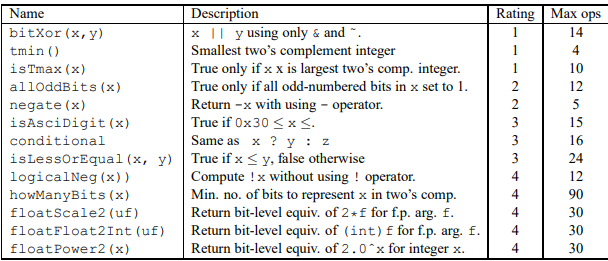
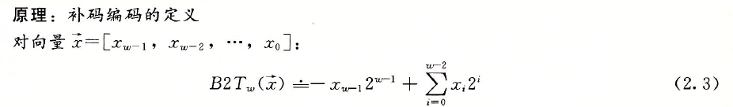
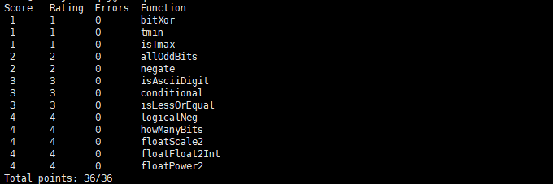

# Data Lab: Manipulating  Bits

本Lab是在指定的规则下，完成如下指定的功能：



具体实现：

# bitXor

用**非运算**和**与运算**实现**异或运算**，因为：
$$
x  \wedge y = (x \& (\sim y) \ | \ ((\sim x) \& y) = \sim (\sim (x \& \sim y) \& (\sim(\sim x \& y)) )
$$
所以代码实现如下:

```c
/* 
 * bitXor - x^y using only ~ and & 
 *   Example: bitXor(4, 5) = 1
 *   Legal ops: ~ &
 *   Max ops: 14
 *   Rating: 1
 */
int bitXor(int x, int y) {
  
  return ~(~(x & (~y)) & (~(~x & y)));
}
```


# tmin

返回最小的二进制补码整数，由补码的定义可知，最小的二进制补码整数为最高位为1，其余位为0：



```c
/* 
 * tmin - return minimum two's complement integer 
 *   Legal ops: ! ~ & ^ | + << >>
 *   Max ops: 4
 *   Rating: 1
 */
int tmin(void) {

  return (0x1 << 31);

}
```


# isTmax

判断x是够是最大的二进制补码整数，即判断$x== 0x7fff$ ，根据
$$
0x7fffffff + 1 == 0x10000000 == \ \sim 0x7fffffff
$$
该等式主要是利用0x7fff只有1位为0，因此可以通过**加1进位**来与**直接取反**相等。

而且需要考虑到
$$
0xffffffff + 1 == 0x00000000 == \sim 0xffffffff
$$
因此要排除0xffffffff的影响，考虑到0xffffffff的特殊性在于~0xffffffff为0，而**其他任何数的非运算**都为1，因此可以根据该特性来区分0xffffffff。


```c

/*
 * isTmax - returns 1 if x is the maximum, two's complement number,
 *     and 0 otherwise 
 *   Legal ops: ! ~ & ^ | +
 *   Max ops: 10
 *   Rating: 1
 */
int isTmax(int x) {
//0x7fff + 1 == 0x1000 == ~0x7fff,and exclude 0xffff + 1 == 0x000 == ~0xffff
  return !!(~x) & (!((x + 1) ^ (~x)));
}
```

# allOddBits

若x的所有奇数位都为1，则返回1。

先构建出所有奇数位为1的二进制数，即0xAAAAAAAA，然后将x与其进行比较，由于我们不关心x的偶数位，所以先将x与0xAAAAAAAA进行 **与运算**，得到x的所有奇数位，然后再判断其是否都为1。

```c
/* 
 * allOddBits - return 1 if all odd-numbered bits in word set to 1
 *   where bits are numbered from 0 (least significant) to 31 (most significant)
 *   Examples allOddBits(0xFFFFFFFD) = 0, allOddBits(0xAAAAAAAA) = 1
 *   Legal ops: ! ~ & ^ | + << >>
 *   Max ops: 12
 *   Rating: 2
 */
int allOddBits(int x) {
  int val;
  val = (0xAA << 8)| 0xAA;
  val = (val << 8) | 0xAA;
  val = (val << 8) | 0xAA;

  return !((x & val) ^ val);
}
```


# negate

$$
-x = \sim x + 1
$$


```c
/* 
 * negate - return -x 
 *   Example: negate(1) = -1.
 *   Legal ops: ! ~ & ^ | + << >>
 *   Max ops: 5
 *   Rating: 2
 */
int negate(int x) {
  return (~x + 1);
}
```


# isAsciiDigit

判断x是否在0x30到0x39之间，即$0x00000030-0x00000039$

先判断在8-31位之间是否含有1，再判断4-7位之间是否为3，最后判断0-3位之间是否是0-9。

```c
/* 
 * isAsciiDigit - return 1 if 0x30 <= x <= 0x39 (ASCII codes for characters '0' to '9')
 *   Example: isAsciiDigit(0x35) = 1.
 *            isAsciiDigit(0x3a) = 0.
 *            isAsciiDigit(0x05) = 0.
 *   Legal ops: ! ~ & ^ | + << >>
 *   Max ops: 15
 *   Rating: 3
 */
int isAsciiDigit(int x) {
  int mosthighdigit, highdigit, lowdigit;
  mosthighdigit = !((~0x0 << 8) & x); // 判断在8-31位之间是否含有1
  highdigit = !((x & 0xF0) ^ 0x30); // 再判断4-7位之间是否为3
  lowdigit = (!(x & 0x8)) | !(x & 0x6); // 最后判断0-3位之间是否是0-9
  return mosthighdigit & highdigit & lowdigit;
}
```


# conditional

实现条件表达式$x \ ? \ y \ :\  z $。即x为真，输出y，x为假，输出z。

因此，我们要根据x的值来决定输出是y还是z，所有我们要根据x来构建一个值，使得该值能同时与y和z进行运算，并输出正确的结果。因此我们构建的该值为0xFFFFFFFF，即x为0时，该值为0x00000000，x为其他值时，该值为0xFFFFFFF。

0和其他所有非0的数的区别在于进行 **逻辑非**，因此利用该特性来构造val。
$$
val = (((\sim !x) >> (!x)) + !x); // 0 - 0x00000000, other - 0xFFFFFFFF
$$


```c
/* 
 * conditional - same as x ? y : z 
 *   Example: conditional(2,4,5) = 4
 *   Legal ops: ! ~ & ^ | + << >>
 *   Max ops: 16
 *   Rating: 3
 */
int conditional(int x, int y, int z) {
  int val;
  val = (((~!x) >> (!x)) + !x); // 0 - 0x00000000, other - 0xFFFFFFFF
  //printf("%#X\n", val);
  return (val & y) | (~val & z) ;
}
```

# isLessOrEqual

实现**小于等于运算**。

先比较x和y的符号位，符号位若是不同，则可以直接判断大小。

若x和y的符号位相同，则通过计算x-y的值，来判断该值的最高位，

	1. 若最高位为1，则x-y<0。
 	2. 若最高位为0，还需要判断x-y是否等于0。

```c
/* 
 * isLessOrEqual - if x <= y  then return 1, else return 0 
 *   Example: isLessOrEqual(4,5) = 1.
 *   Legal ops: ! ~ & ^ | + << >>
 *   Max ops: 24
 *   Rating: 3
 */
int isLessOrEqual(int x, int y) {
  int dif, neg, zero, directneg, directpos, xmost, ymost;
  xmost = (x >> 31) & 1;
  ymost = (y >> 31) & 1;
  directpos = (!xmost) & ymost; // most digit different, direct judge
  directneg = xmost & (!ymost);
  dif = x + (~y + 1); // most digit same, calculate x - y
  neg = (dif >> 31 & 0x1);// if x - y < 0, most digit is 1
  zero = !(~dif ^ (~0)); // if x - y == 0, dif is 0, so zero is 1,otherwise it is 0
  return directneg | ((!directpos) & (neg | zero));
}
```

# logicalNeg

实现 **逻辑非**运算。

先判断x的最高位是否为1，若为1，则返回0

若最高位为0，则通过构建0x7FFFFFFF，将其与x相加，判断最高位是否进位，因为x如果为0，则最高位无进位，仍然为0，若x不为0，则最高位必定有进位1。

因此可以根据x的最高位和0x7FFFFFFF+x的最高位来实现 **逻辑非**。

```c
/* 
 * logicalNeg - implement the ! operator, using all of 
 *              the legal operators except !
 *   Examples: logicalNeg(3) = 0, logicalNeg(0) = 1
 *   Legal ops: ~ & ^ | + << >>
 *   Max ops: 12
 *   Rating: 4 
 */
int logicalNeg(int x) {
  int xmost, midval, resultmost;
  xmost = (x >> 31) & 1; //  xmostdigit 
  midval = ~(1 << 31); // 0x7FFFFFFF
  resultmost = ((x + midval) >> 31) & 1; // (0x7FFFFFF + x) mosthighdigit, because x != 0, result mosthighdigit is 1
  return (xmost ^ 1) & (resultmost ^ 1); // xmost == 0, resultmost == 0 --> x is 0, return 1
                                         // otherwise --> x is not 0, return 0
}
```


# howManyBits

实现x的二进制补码表示最少需要多少位的功能。

先判断x的正负，若x为正，则只需要知道x的最靠左的1在哪个位置，就能知道，最少需要多少位来表示。

若x为负，则需要将其转换为x的反码，即将1变为0, 0变为1，此时若知道反码的最靠左的1在哪个位置。

通过，根据不同的x最高位，来构建midval，0对应midval为0x00000000， 1对应mindval为0xFFFFFFFF，从而实现x反码的表示。

接下来就是判断x的最靠左的1在哪个位置，最直接的办法就是不断右移，当左边还有1时，!!x则为1，当左边都为0时，!!x则为0，因此可以计算最靠左的1在哪个位置，再加上符号位，即可得到x的二进制补码表示最少需要多少位。

```c
/* howManyBits - return the minimum number of bits required to represent x in
 *             two's complement
 *  Examples: howManyBits(12) = 5
 *            howManyBits(298) = 10
 *            howManyBits(-5) = 4
 *            howManyBits(0)  = 1
 *            howManyBits(-1) = 1
 *            howManyBits(0x80000000) = 32
 *  Legal ops: ! ~ & ^ | + << >>
 *  Max ops: 90
 *  Rating: 4
 */
int howManyBits(int x) {
  int mosthighdigit, midval, count;
  mosthighdigit = (x >> 31) & 1;
  midval = (((~!mosthighdigit) >> (!mosthighdigit)) + !mosthighdigit); // 0 - 0x00000000, other - 0xFFFFFFFF when mosthighdigit == 1, x ^ 0xFFFFFFFF-->000..001....
  x = x ^ midval; // all translate 0000...00001...... 
  count = 1;
  count = count +  !!(x >> 0);
  count = count +  !!(x >> 1);//if x is not 0, count++
  count = count +  !!(x >> 2);
  count = count +  !!(x >> 3);
  count = count +  !!(x >> 4);
  count = count +  !!(x >> 5);
  count = count +  !!(x >> 6);
  count = count +  !!(x >> 7);
  count = count +  !!(x >> 8);
  count = count +  !!(x >> 9);
  count = count +  !!(x >> 10);
  count = count +  !!(x >> 11);
  count = count +  !!(x >> 12);
  count = count +  !!(x >> 13);
  count = count +  !!(x >> 14);
  count = count +  !!(x >> 15);
  count = count +  !!(x >> 16);
  count = count +  !!(x >> 17);
  count = count +  !!(x >> 18);
  count = count +  !!(x >> 19);
  count = count +  !!(x >> 20);
  count = count +  !!(x >> 21);
  count = count +  !!(x >> 22);
  count = count +  !!(x >> 23);
  count = count +  !!(x >> 24);
  count = count +  !!(x >> 25);
  count = count +  !!(x >> 26);
  count = count +  !!(x >> 27);
  count = count +  !!(x >> 28);
  count = count +  !!(x >> 29);
  count = count +  !!(x >> 30);
  count = count +  !!(x >> 31);

  return count;
}
```


# floatScale2

实现浮点数的乘2功能。

该功能的实现是先区分uf的编码，来确定不同的类型操作：

1. uf是无穷大或者NAN，则返回其本身
2. uf本身不是无穷大，乘上2是无穷大，则返回无穷大
3. uf是规格化的值，则直接改变阶码即可。
4. uf是非规格化的值，则直接将位数左移1位即可，不需要单独考虑从非规格化跳转到规格化的过程，因为这个过渡是顺利过渡的。

```c
//float
/* 
 * floatScale2 - Return bit-level equivalent of expression 2*f for
 *   floating point argument f.
 *   Both the argument and result are passed as unsigned int's, but
 *   they are to be interpreted as the bit-level representation of
 *   single-precision floating point values.
 *   When argument is NaN, return argument
 *   Legal ops: Any integer/unsigned operations incl. ||, &&. also if, while
 *   Max ops: 30
 *   Rating: 4
 */
unsigned floatScale2(unsigned uf) {
  unsigned Edigits, s, posinf, neginf, Mdigits;
  posinf = 0x7F800000;
  neginf = 0xFF800000;
  s = (uf >> 31) & 1;
  Edigits = (uf & 0x7F800000) >> 23;
  //printf("%#X\n", Edigits);
  if (Edigits == 0xFF)// to get E digits: 0x7F80 0000
 {
  return uf;  // uf is NaN or uf is inf
 }
  if (Edigits == 0xFE)//0x 1 1111 1110 f * 2 --> inf 
  {
    return s ? neginf:posinf;
  }
  if (Edigits != 0)// not 0x 0000 0000 f is normalized
  {
    Edigits = Edigits + 1;
    return (uf & 0x807FFFFF)|(Edigits << 23); // change uf E_digits
  }
  Mdigits = uf & 0x00FFFFFF;// get Mdigits + 1 digits
  Mdigits = Mdigits << 1;
  return (uf & 0xFF000000)| Mdigits;
}
```

# floatFloat2Int

实现将浮点数转换为整数功能。

同样的，将x进行分类：

1. 若uf是无穷大或者NaN，返回0x80000000
2. 若x是非规格化的，则x太小，返回0
3. 若uf的阶码大于31，超过整数所能表示的最大值，则返回0x80000000
4. 若uf是规格化的，且范围在$0-（2^{32}-1）$里，则将uf的阶码表示的数加上尾码中没有超过阶码的位，直接舍去小数位即可
5. 若uf的阶码表示的数小于0，则直接返回0

```c
/* 
 * floatFloat2Int - Return bit-level equivalent of expression (int) f
 *   for floating point argument f.
 *   Argument is passed as unsigned int, but
 *   it is to be interpreted as the bit-level representation of a
 *   single-precision floating point value.
 *   Anything out of range (including NaN and infinity) should return
 *   0x80000000u.
 *   Legal ops: Any integer/unsigned operations incl. ||, &&. also if, while
 *   Max ops: 30
 *   Rating: 4
 */
int floatFloat2Int(unsigned uf) {
  unsigned NaN, s, bias, frac, curdig, weight, digflag, Edigits;
  int res, E;
  bias = 127;
  NaN = 0x80000000;
  Edigits = (uf & 0x7F800000) >> 23;
  //printf("%u\n", uf);
  //printf("%u\n", Edigits);
  if (Edigits == 0xFF) // exp == 255
  {
    return NaN;  
  }

  if (Edigits == 0)
  {
    return 0; // exp == 0
  }

  s = (uf >> 31) & 1; // if s == 1, negative, else positive
  E = Edigits - bias; 
  frac = uf & 0x007FFFFF; // get frac
  if (E > 31)
  {
    return NaN;
  }

  curdig = 22;
  if (E >= 0)
  { 
    res = 1 << E; // get 1.frac
    weight = 23 - curdig;
    while (weight <= E) // when frac digit's neg weight > E, it break, beacuse the remain result is decimals
    {
     digflag = (frac >> curdig) & 0x1;
     res += (digflag << (E - weight));
     curdig--;
     weight++;
    }
    return s ? -res:res;
  }
 return 0;


}
```


# floatPower2

实现2的x次幂功能。

同样的，将x进行分类：

1. 如果x小于浮点数（包括规格化和非规格化）所能表示的最小数，则返回0
2. 如果x大于规格化所能表示的最大数，则返回inf
3. 如果x在规格化所能表示的数范围内，则只需修改阶码即可
4. 如果x在非规格化的数里，则只需修改尾码即可

```c
/* 
 * floatPower2 - Return bit-level equivalent of the expression 2.0^x
 *   (2.0 raised to the power x) for any 32-bit integer x.
 *
 *   The unsigned value that is returned should have the identical bit
 *   representation as the single-precision floating-point number 2.0^x.
 *   If the result is too small to be represented as a denorm, return
 *   0. If too large, return +INF.
 * 
 *   Legal ops: Any integer/unsigned operations incl. ||, &&. Also if, while 
 *   Max ops: 30 
 *   Rating: 4
 */
unsigned floatPower2(int x) {
    unsigned Zero, INF, bias, Exp, res;
    int Maxpow, Minpow, Minexp;
    bias = 127;
    INF = 0x7F800000;
    Zero = 0;
    Maxpow = 127;
    Minpow = 1 - 127 - 23;
    Minexp = -126;
    //printf("%d\n", x);
    if (x < Minpow) // x < -126-23
    { 
      return Zero; 
    }
    
    if (x > Maxpow) // x > 127
    {
      return INF;
    }

    if (x >= Minexp) // x >= -126
    {
      Exp = bias + x;
      return Exp << 23;
    }
    res = 1;
    return res << (x + 149); //  -149 <= x < -126 

    /* int INF = 0xff << 23;
    int exp = x + 127;
    if (exp <= 0) return 0;
    if (exp >= 255) return INF;
    return exp << 23;
    */
}
```


运行结果如图所示：

