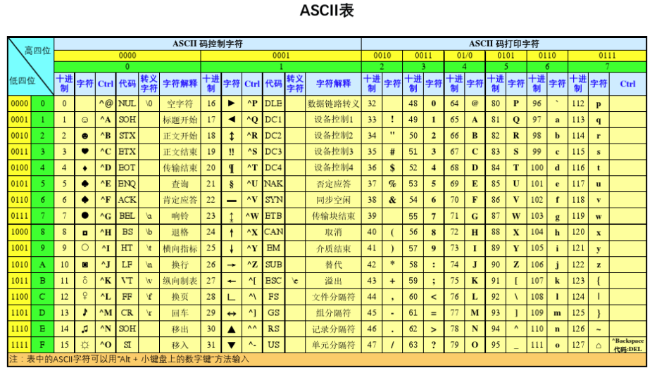

# Defusing a Binary Bomb

本Lab是通过拆除bomb的形式来熟悉gdb工具的使用。总共有6个bomb需要拆除。

首先将bomb二进制执行文件通过反汇编命令objdump得到反汇编代码，来进行分析。

# bomb1

首先从main程序入口，找到phase_1的位置

```c
400e3a:	e8 a1 00 00 00       	callq  400ee0 <phase_1>
```

然后进入到<phase_1>函数

```c
0000000000400ee0 <phase_1>:
  400ee0:	48 83 ec 08          	sub    $0x8,%rsp
  400ee4:	be 00 24 40 00       	mov    $0x402400,%esi // 将该地址的字符串作为第2个函数参数传入
  400ee9:	e8 4a 04 00 00       	callq  401338 <strings_not_equal>
  400eee:	85 c0                	test   %eax,%eax
  400ef0:	74 05                	je     400ef7 <phase_1+0x17>
  400ef2:	e8 43 05 00 00       	callq  40143a <explode_bomb>
  400ef7:	48 83 c4 08          	add    $0x8,%rsp
  400efb:	c3                   	retq 
```

该函数又调用<strings_not_equal>，进入该函数:

```c
0000000000401338 <strings_not_equal>:
  401338:	41 54                	push   %r12
  40133a:	55                   	push   %rbp
  40133b:	53                   	push   %rbx
  40133c:	48 89 fb             	mov    %rdi,%rbx // 将输入的字符串作为第1个函数参数传入
  40133f:	48 89 f5             	mov    %rsi,%rbp
  401342:	e8 d4 ff ff ff       	callq  40131b <string_length>
  401347:	41 89 c4             	mov    %eax,%r12d
  40134a:	48 89 ef             	mov    %rbp,%rdi
  40134d:	e8 c9 ff ff ff       	callq  40131b <string_length>
  401352:	ba 01 00 00 00       	mov    $0x1,%edx
  401357:	41 39 c4             	cmp    %eax,%r12d
  40135a:	75 3f                	jne    40139b <strings_not_equal+0x63>
  40135c:	0f b6 03             	movzbl (%rbx),%eax
  40135f:	84 c0                	test   %al,%al
  401361:	74 25                	je     401388 <strings_not_equal+0x50>
  401363:	3a 45 00             	cmp    0x0(%rbp),%al
  401366:	74 0a                	je     401372 <strings_not_equal+0x3a>
  401368:	eb 25                	jmp    40138f <strings_not_equal+0x57>
  40136a:	3a 45 00             	cmp    0x0(%rbp),%al
  40136d:	0f 1f 00             	nopl   (%rax)
  401370:	75 24                	jne    401396 <strings_not_equal+0x5e>
  401372:	48 83 c3 01          	add    $0x1,%rbx
  401376:	48 83 c5 01          	add    $0x1,%rbp
  40137a:	0f b6 03             	movzbl (%rbx),%eax
  40137d:	84 c0                	test   %al,%al
  40137f:	75 e9                	jne    40136a <strings_not_equal+0x32>
  401381:	ba 00 00 00 00       	mov    $0x0,%edx
  401386:	eb 13                	jmp    40139b <strings_not_equal+0x63>
  401388:	ba 00 00 00 00       	mov    $0x0,%edx
  40138d:	eb 0c                	jmp    40139b <strings_not_equal+0x63>
  40138f:	ba 01 00 00 00       	mov    $0x1,%edx
  401394:	eb 05                	jmp    40139b <strings_not_equal+0x63>
  401396:	ba 01 00 00 00       	mov    $0x1,%edx
  40139b:	89 d0                	mov    %edx,%eax
  40139d:	5b                   	pop    %rbx
  40139e:	5d                   	pop    %rbp
  40139f:	41 5c                	pop    %r12
  4013a1:	c3                   	retq   

000000000040131b <string_length>: //计算字符串长度
  40131b:	80 3f 00             	cmpb   $0x0,(%rdi)
  40131e:	74 12                	je     401332 <string_length+0x17>
  401320:	48 89 fa             	mov    %rdi,%rdx
  401323:	48 83 c2 01          	add    $0x1,%rdx
  401327:	89 d0                	mov    %edx,%eax
  401329:	29 f8                	sub    %edi,%eax
  40132b:	80 3a 00             	cmpb   $0x0,(%rdx) // 字符串结尾字符
  40132e:	75 f3                	jne    401323 <string_length+0x8>
  401330:	f3 c3                	repz retq 
  401332:	b8 00 00 00 00       	mov    $0x0,%eax
  401337:	c3                   	retq   
```

分析代码可知，我们需要输入与0x402400地址处的字符串相等的字符串，在gdb中采用该命令：

```c
(gdb) x /52c 0x402400 //以字符形式输出该地址处的字符
输出：
0x402400:	66 'B'	111 'o'	114 'r'	100 'd'	101 'e'	114 'r'	32 ' '	114 'r'
0x402408:	101 'e'	108 'l'	97 'a'	116 't'	105 'i'	111 'o'	110 'n'	115 's'
0x402410:	32 ' '	119 'w'	105 'i'	116 't'	104 'h'	32 ' '	67 'C'	97 'a'
0x402418:	110 'n'	97 'a'	100 'd'	97 'a'	32 ' '	104 'h'	97 'a'	118 'v'
0x402420:	101 'e'	32 ' '	110 'n'	101 'e'	118 'v'	101 'e'	114 'r'	32 ' '
0x402428:	98 'b'	101 'e'	101 'e'	110 'n'	32 ' '	98 'b'	101 'e'	116 't'
0x402430:	116 't'	101 'e'	114 'r'	46 '.'
(gdb) p (char*)0x402400 // 以字符串形式输出该地址处的字符
输出：
$2 = 0x402400 "Border relations with Canada have never been better."
```

因此输入字符串 "Border relations with Canada have never been better."（不带引号），即拆除bomb1。


# bomb2

同样通过main函数，找到phase_2的入口：

```c
400e56:	e8 a1 00 00 00       	callq  400efc <phase_2>
```

进入到phase函数：

```c
0000000000400efc <phase_2>:
  400efc:	55                   	push   %rbp
  400efd:	53                   	push   %rbx
  400efe:	48 83 ec 28          	sub    $0x28,%rsp
  400f02:	48 89 e6             	mov    %rsp,%rsi
  400f05:	e8 52 05 00 00       	callq  40145c <read_six_numbers>
  400f0a:	83 3c 24 01          	cmpl   $0x1,(%rsp)
  400f0e:	74 20                	je     400f30 <phase_2+0x34>
  400f10:	e8 25 05 00 00       	callq  40143a <explode_bomb>
  400f15:	eb 19                	jmp    400f30 <phase_2+0x34>
  400f17:	8b 43 fc             	mov    -0x4(%rbx),%eax
  400f1a:	01 c0                	add    %eax,%eax
  400f1c:	39 03                	cmp    %eax,(%rbx)
  400f1e:	74 05                	je     400f25 <phase_2+0x29>
  400f20:	e8 15 05 00 00       	callq  40143a <explode_bomb>
  400f25:	48 83 c3 04          	add    $0x4,%rbx
  400f29:	48 39 eb             	cmp    %rbp,%rbx
  400f2c:	75 e9                	jne    400f17 <phase_2+0x1b>
  400f2e:	eb 0c                	jmp    400f3c <phase_2+0x40>
  400f30:	48 8d 5c 24 04       	lea    0x4(%rsp),%rbx
  400f35:	48 8d 6c 24 18       	lea    0x18(%rsp),%rbp
  400f3a:	eb db                	jmp    400f17 <phase_2+0x1b>
  400f3c:	48 83 c4 28          	add    $0x28,%rsp
  400f40:	5b                   	pop    %rbx
  400f41:	5d                   	pop    %rbp
  400f42:	c3                   	retq   
```

其中又调用了read_six_numbers函数：

```c
000000000040145c <read_six_numbers>:
  40145c:	48 83 ec 18          	sub    $0x18,%rsp
  401460:	48 89 f2             	mov    %rsi,%rdx
  401463:	48 8d 4e 04          	lea    0x4(%rsi),%rcx
  401467:	48 8d 46 14          	lea    0x14(%rsi),%rax
  40146b:	48 89 44 24 08       	mov    %rax,0x8(%rsp)
  401470:	48 8d 46 10          	lea    0x10(%rsi),%rax
  401474:	48 89 04 24          	mov    %rax,(%rsp)
  401478:	4c 8d 4e 0c          	lea    0xc(%rsi),%r9
  40147c:	4c 8d 46 08          	lea    0x8(%rsi),%r8
  401480:	be c3 25 40 00       	mov    $0x4025c3,%esi
  401485:	b8 00 00 00 00       	mov    $0x0,%eax
  40148a:	e8 61 f7 ff ff       	callq  400bf0 <__isoc99_sscanf@plt>
  40148f:	83 f8 05             	cmp    $0x5,%eax
  401492:	7f 05                	jg     401499 <read_six_numbers+0x3d>
  401494:	e8 a1 ff ff ff       	callq  40143a <explode_bomb>
  401499:	48 83 c4 18          	add    $0x18,%rsp
  40149d:	c3                   	retq   
```

该函数是读取6个整数，从该行可以看出我们需要输入6个整数

```c
401480:	be c3 25 40 00       	mov    $0x4025c3,%esi

(gdb) p (char*) 0x4025c3
$3 = 0x4025c3 "%d %d %d %d %d %d"
```

又从phase_2函数中的这段可以看出6个整数之间需要满足的关系：

```c
  400f0a:	83 3c 24 01          	cmpl   $0x1,(%rsp) //第一个输入整数为1
  400f0e:	74 20                	je     400f30 <phase_2+0x34>
  400f10:	e8 25 05 00 00       	callq  40143a <explode_bomb>
  400f15:	eb 19                	jmp    400f30 <phase_2+0x34>
  400f17:	8b 43 fc             	mov    -0x4(%rbx),%eax //将当前整数的前一个整数地址赋给eax
  400f1a:	01 c0                	add    %eax,%eax //前一个整数相加
  400f1c:	39 03                	cmp    %eax,(%rbx) // 判断 X_cur == 2 * X_pre
  400f1e:	74 05                	je     400f25 <phase_2+0x29>
  400f20:	e8 15 05 00 00       	callq  40143a <explode_bomb>
  400f25:	48 83 c3 04          	add    $0x4,%rbx
  400f29:	48 39 eb             	cmp    %rbp,%rbx
  400f2c:	75 e9                	jne    400f17 <phase_2+0x1b>
  400f2e:	eb 0c                	jmp    400f3c <phase_2+0x40>
  400f30:	48 8d 5c 24 04       	lea    0x4(%rsp),%rbx //下一个整数的地址
  400f35:	48 8d 6c 24 18       	lea    0x18(%rsp),%rbp
  400f3a:	eb db                	jmp    400f17 <phase_2+0x1b>
```

$$
X_{cur} == 2 * X_{pre}
$$

且第一个整数为1，因此需要输入的6个整数为：
$$
1、2、4、8、16、32
$$


# bomb3

同样通过main函数，找到phase_3的入口：

```c
400e72:	e8 cc 00 00 00       	callq  400f43 b *x<phase_3>
```

phase_3函数的内容为：

```c
0000000000400f43 <phase_3>:
  400f43:	48 83 ec 18          	sub    $0x18,%rsp
  400f47:	48 8d 4c 24 0c       	lea    0xc(%rsp),%rcx
  400f4c:	48 8d 54 24 08       	lea    0x8(%rsp),%rdx
  400f51:	be cf 25 40 00       	mov    $0x4025cf,%esi // 0x4025cf地址的内容为"%d %d"，因此需要输入两个整数
  400f56:	b8 00 00 00 00       	mov    $0x0,%eax
  400f5b:	e8 90 fc ff ff       	callq  400bf0 <__isoc99_sscanf@plt>
  400f60:	83 f8 01             	cmp    $0x1,%eax
  400f63:	7f 05                	jg     400f6a <phase_3+0x27>
  400f65:	e8 d0 04 00 00       	callq  40143a <explode_bomb>
  400f6a:	83 7c 24 08 07       	cmpl   $0x7,0x8(%rsp) //第一个整数应当小于7，因为大于7会explode
  400f6f:	77 3c                	ja     400fad <phase_3+0x6a>
  400f71:	8b 44 24 08          	mov    0x8(%rsp),%eax
  400f75:	ff 24 c5 70 24 40 00 	jmpq   *0x402470(,%rax,8)
  400f7c:	b8 cf 00 00 00       	mov    $0xcf,%eax
  400f81:	eb 3b                	jmp    400fbe <phase_3+0x7b>
  400f83:	b8 c3 02 00 00       	mov    $0x2c3,%eax
  400f88:	eb 34                	jmp    400fbe <phase_3+0x7b>
  400f8a:	b8 00 01 00 00       	mov    $0x100,%eax
  400f8f:	eb 2d                	jmp    400fbe <phase_3+0x7b>
  400f91:	b8 85 01 00 00       	mov    $0x185,%eax
  400f96:	eb 26                	jmp    400fbe <phase_3+0x7b>
  400f98:	b8 ce 00 00 00       	mov    $0xce,%eax
  400f9d:	eb 1f                	jmp    400fbe <phase_3+0x7b>
  400f9f:	b8 aa 02 00 00       	mov    $0x2aa,%eax
  400fa4:	eb 18                	jmp    400fbe <phase_3+0x7b>
  400fa6:	b8 47 01 00 00       	mov    $0x147,%eax
  400fab:	eb 11                	jmp    400fbe <phase_3+0x7b>
  400fad:	e8 88 04 00 00       	callq  40143a <explode_bomb>
  400fb2:	b8 00 00 00 00       	mov    $0x0,%eax
  400fb7:	eb 05                	jmp    400fbe <phase_3+0x7b>
  400fb9:	b8 37 01 00 00       	mov    $0x137,%eax
  400fbe:	3b 44 24 0c          	cmp    0xc(%rsp),%eax
  400fc2:	74 05                	je     400fc9 <phase_3+0x86>
  400fc4:	e8 71 04 00 00       	callq  40143a <explode_bomb>
  400fc9:	48 83 c4 18          	add    $0x18,%rsp
  400fcd:	c3                   	retq   
```

从该行可以看出，代码根据输入的第一个整数进行间接跳转：

```C
400f75:	ff 24 c5 70 24 40 00 	jmpq   *0x402470(,%rax,8)

(gdb) x /8g 0x402470
0x402470:	0x0000000000400f7c	0x0000000000400fb9
0x402480:	0x0000000000400f83	0x0000000000400f8a
0x402490:	0x0000000000400f91	0x0000000000400f98
0x4024a0:	0x0000000000400f9f	0x0000000000400fa6
```

执行不同的分支，执行任意的分支都是正确的，只需要输入的第二个整数等于对应分支下的整数，因此，输入任意1组的序号和对应的10进制数即可。

```c
序号   十六进制   十进制
0,		0xcf,    207
1, 		0x137,   311
2, 		0x2c3,   707
3, 		0x100,	 256
4, 		0x185,	 389
5, 		0xce,	 206
6, 		0x2aa,	 682
7， 		0x147,	 327
```


# bomb4

同样通过main函数，找到phase_4的入口：

```c
 400e8e:	e8 79 01 00 00       	callq  40100c <phase_4>
```

进入到phase_4函数：

```c
000000000040100c <phase_4>:
  40100c:	48 83 ec 18          	sub    $0x18,%rsp
  401010:	48 8d 4c 24 0c       	lea    0xc(%rsp),%rcx
  401015:	48 8d 54 24 08       	lea    0x8(%rsp),%rdx
  40101a:	be cf 25 40 00       	mov    $0x4025cf,%esi // 0x4025cf地址的内容为"%d %d"，因此还是需要输入两个整数
  40101f:	b8 00 00 00 00       	mov    $0x0,%eax
  401024:	e8 c7 fb ff ff       	callq  400bf0 <__isoc99_sscanf@plt>
  401029:	83 f8 02             	cmp    $0x2,%eax
  40102c:	75 07                	jne    401035 <phase_4+0x29>
  40102e:	83 7c 24 08 0e       	cmpl   $0xe,0x8(%rsp) //第一个整数应当小于等于0xe， 即14
  401033:	76 05                	jbe    40103a <phase_4+0x2e>
  401035:	e8 00 04 00 00       	callq  40143a <explode_bomb>
  40103a:	ba 0e 00 00 00       	mov    $0xe,%edx
  40103f:	be 00 00 00 00       	mov    $0x0,%esi
  401044:	8b 7c 24 08          	mov    0x8(%rsp),%edi
  401048:	e8 81 ff ff ff       	callq  400fce <func4>
  40104d:	85 c0                	test   %eax,%eax
  40104f:	75 07                	jne    401058 <phase_4+0x4c>
  401051:	83 7c 24 0c 00       	cmpl   $0x0,0xc(%rsp)
  401056:	74 05                	je     40105d <phase_4+0x51>
  401058:	e8 dd 03 00 00       	callq  40143a <explode_bomb>
  40105d:	48 83 c4 18          	add    $0x18,%rsp
  401061:	c3                   	retq   
```

该函数内部又调用了func4函数：该函数将输入的第一个整数与14/2相比较，当该数小于7等于时，跳转到400ff2, 此时将0赋值给eax，再将该数与7比较，大于等于7再跳出该函数，因为在40104d行判断eax是否等于0，等于0才不会explode，因此第一个输入数为7，第二个输入数与0比较，因此第二个数为0。所以bomb4的答案为：$7 \ 0$

```c
0000000000400fce <func4>:
  400fce:	48 83 ec 08          	sub    $0x8,%rsp
  400fd2:	89 d0                	mov    %edx,%eax
  400fd4:	29 f0                	sub    %esi,%eax
  400fd6:	89 c1                	mov    %eax,%ecx
  400fd8:	c1 e9 1f             	shr    $0x1f,%ecx // 将ecx寄存器中的值逻辑右移0x1f(31)位 
  400fdb:	01 c8                	add    %ecx,%eax
  400fdd:	d1 f8                	sar    %eax //该指令是SAR $1, %eax的简写，将eax寄存器的值算术右移1位
  400fdf:	8d 0c 30             	lea    (%rax,%rsi,1),%ecx
  400fe2:	39 f9                	cmp    %edi,%ecx //将第一个输入数与7比较
  400fe4:	7e 0c                	jle    400ff2 <func4+0x24>
  400fe6:	8d 51 ff             	lea    -0x1(%rcx),%edx
  400fe9:	e8 e0 ff ff ff       	callq  400fce <func4>
  400fee:	01 c0                	add    %eax,%eax
  400ff0:	eb 15                	jmp    401007 <func4+0x39>
  400ff2:	b8 00 00 00 00       	mov    $0x0,%eax //将0赋给eax
  400ff7:	39 f9                	cmp    %edi,%ecx
  400ff9:	7d 0c                	jge    401007 <func4+0x39>//将第一个输入数与7比较
  400ffb:	8d 71 01             	lea    0x1(%rcx),%esi
  400ffe:	e8 cb ff ff ff       	callq  400fce <func4>
  401003:	8d 44 00 01          	lea    0x1(%rax,%rax,1),%eax
  401007:	48 83 c4 08          	add    $0x8,%rsp
  40100b:	c3                   	retq   
```


# bomb5

同样通过main函数，找到phase_5的入口：

```c
400eaa:	e8 b3 01 00 00       	callq  401062 <phase_5>
```

进入到phase_5函数：

```c
0000000000401062 <phase_5>:
  401062:	53                   	push   %rbx
  401063:	48 83 ec 20          	sub    $0x20,%rsp
  401067:	48 89 fb             	mov    %rdi,%rbx
  40106a:	64 48 8b 04 25 28 00 	mov    %fs:0x28,%rax
  401071:	00 00 
  401073:	48 89 44 24 18       	mov    %rax,0x18(%rsp)
  401078:	31 c0                	xor    %eax,%eax
  40107a:	e8 9c 02 00 00       	callq  40131b <string_length> 
  40107f:	83 f8 06             	cmp    $0x6,%eax // 保证输入的字符数量是6个
  401082:	74 4e                	je     4010d2 <phase_5+0x70>
  401084:	e8 b1 03 00 00       	callq  40143a <explode_bomb>
  401089:	eb 47                	jmp    4010d2 <phase_5+0x70>
  40108b:	0f b6 0c 03          	movzbl (%rbx,%rax,1),%ecx //将输入字符串的第一个字符的ASCII码赋给ecx
  40108f:	88 0c 24             	mov    %cl,(%rsp) //取ASCII码的低八位存储在栈区域的局部变量区
  401092:	48 8b 14 24          	mov    (%rsp),%rdx //取ASCII码的低八位赋值给rdx
  401096:	83 e2 0f             	and    $0xf,%edx //取ASCII码的低四位，高四位赋值为0
  401099:	0f b6 92 b0 24 40 00 	movzbl 0x4024b0(%rdx),%edx
  4010a0:	88 54 04 10          	mov    %dl,0x10(%rsp,%rax,1)
  4010a4:	48 83 c0 01          	add    $0x1,%rax
  4010a8:	48 83 f8 06          	cmp    $0x6,%rax
  4010ac:	75 dd                	jne    40108b <phase_5+0x29>
  4010ae:	c6 44 24 16 00       	movb   $0x0,0x16(%rsp)
  4010b3:	be 5e 24 40 00       	mov    $0x40245e,%esi 
  4010b8:	48 8d 7c 24 10       	lea    0x10(%rsp),%rdi 
  4010bd:	e8 76 02 00 00       	callq  401338 <strings_not_equal>
  4010c2:	85 c0                	test   %eax,%eax
  4010c4:	74 13                	je     4010d9 <phase_5+0x77>
  4010c6:	e8 6f 03 00 00       	callq  40143a <explode_bomb>
  4010cb:	0f 1f 44 00 00       	nopl   0x0(%rax,%rax,1)
  4010d0:	eb 07                	jmp    4010d9 <phase_5+0x77>
  4010d2:	b8 00 00 00 00       	mov    $0x0,%eax
  4010d7:	eb b2                	jmp    40108b <phase_5+0x29>
  4010d9:	48 8b 44 24 18       	mov    0x18(%rsp),%rax
  4010de:	64 48 33 04 25 28 00 	xor    %fs:0x28,%rax
  4010e5:	00 00 
  4010e7:	74 05                	je     4010ee <phase_5+0x8c>
  4010e9:	e8 42 fa ff ff       	callq  400b30 <__stack_chk_fail@plt>
  4010ee:	48 83 c4 20          	add    $0x20,%rsp
  4010f2:	5b                   	pop    %rbx
  4010f3:	c3                   	retq   
```

由该处代码分析可知，即需要0x40245e为起始地址的字符串与0x10(%rsp)为起始地址的字符串相等：

```c
  4010b3:	be 5e 24 40 00       	mov    $0x40245e,%esi 
  4010b8:	48 8d 7c 24 10       	lea    0x10(%rsp),%rdi 
  4010bd:	e8 76 02 00 00       	callq  401338 <strings_not_equal>

(gdb) x /6c 0x40245e
0x40245e:	102 'f'	108 'l'	121 'y'	101 'e'	114 'r'	115 's'   
```

而0x10(%rsp)为起始地址的字符串来源于该处核心代码

```c
40108b:	0f b6 0c 03          	movzbl (%rbx,%rax,1),%ecx //将输入字符串的第一个字符的ASCII码赋给ecx
  40108f:	88 0c 24             	mov    %cl,(%rsp) //取ASCII码的低八位存储在栈区域的局部变量区
  401092:	48 8b 14 24          	mov    (%rsp),%rdx //取ASCII码的低八位赋值给rdx
  401096:	83 e2 0f             	and    $0xf,%edx //取ASCII码的低四位，高四位赋值为0
  401099:	0f b6 92 b0 24 40 00 	movzbl 0x4024b0(%rdx),%edx
  4010a0:	88 54 04 10          	mov    %dl,0x10(%rsp,%rax,1)
  4010a4:	48 83 c0 01          	add    $0x1,%rax
  4010a8:	48 83 f8 06          	cmp    $0x6,%rax
```

即根据输入的字符串的ASC码的低4位来从以 0x4024b0为起始地址的16个字符中选择6个存储在0x10(%rsp)为起始地址的内存中，又有

```c
(gdb) x /16c 0x4024b0
0x4024b0 <array.3449>:	109 'm'	97 'a'	100 'd'	117 'u'	105 'i'	101 'e'	114 'r'	115 's'
0x4024b8 <array.3449+8>:	110 'n'	102 'f'	111 'o'	116 't'	118 'v'	98 'b'	121 'y'	108 'l'
```

因此要从中选择出字符串“flyers”，所以输入字符的ASCII码的低4位为$9、15、14、5、6、7$



对照ASCII码表可知，答案之一为 "$ionefg $"。


# bomb6

首先从main程序入口，找到phase_6的位置

```c
400ec6:	e8 29 02 00 00       	callq  4010f4 <phase_6>
```

进入到phase_6函数

```c
00000000004010f4 <phase_6>:
  4010f4:	41 56                	push   %r14
  4010f6:	41 55                	push   %r13
  4010f8:	41 54                	push   %r12
  4010fa:	55                   	push   %rbp
  4010fb:	53                   	push   %rbx
  4010fc:	48 83 ec 50          	sub    $0x50,%rsp
  401100:	49 89 e5             	mov    %rsp,%r13
  401103:	48 89 e6             	mov    %rsp,%rsi
  401106:	e8 51 03 00 00       	callq  40145c <read_six_numbers> //输入6个整数
  40110b:	49 89 e6             	mov    %rsp,%r14 //从该处开始的代码到0x40112c的代码
  40110e:	41 bc 00 00 00 00    	mov    $0x0,%r12d
  401114:	4c 89 ed             	mov    %r13,%rbp
  401117:	41 8b 45 00          	mov    0x0(%r13),%eax
  40111b:	83 e8 01             	sub    $0x1,%eax
  40111e:	83 f8 05             	cmp    $0x5,%eax
  401121:	76 05                	jbe    401128 <phase_6+0x34>
  401123:	e8 12 03 00 00       	callq  40143a <explode_bomb>
  401128:	41 83 c4 01          	add    $0x1,%r12d
  40112c:	41 83 fc 06          	cmp    $0x6,%r12d // 判断输入的6个整数是否在1-6之间，如果不在，则会触发401123处的explode
  401130:	74 21                	je     401153 <phase_6+0x5f>
  401132:	44 89 e3             	mov    %r12d,%ebx
  401135:	48 63 c3             	movslq %ebx,%rax
  401138:	8b 04 84             	mov    (%rsp,%rax,4),%eax
  40113b:	39 45 00             	cmp    %eax,0x0(%rbp)
  40113e:	75 05                	jne    401145 <phase_6+0x51>
  401140:	e8 f5 02 00 00       	callq  40143a <explode_bomb>
  401145:	83 c3 01             	add    $0x1,%ebx
  401148:	83 fb 05             	cmp    $0x5,%ebx
  40114b:	7e e8                	jle    401135 <phase_6+0x41>
  40114d:	49 83 c5 04          	add    $0x4,%r13
  401151:	eb c1                	jmp    401114 <phase_6+0x20>
  401153:	48 8d 74 24 18       	lea    0x18(%rsp),%rsi
  401158:	4c 89 f0             	mov    %r14,%rax
  40115b:	b9 07 00 00 00       	mov    $0x7,%ecx 
  401160:	89 ca                	mov    %ecx,%edx
  401162:	2b 10                	sub    (%rax),%edx // 将7减去输入的6个整数值，每个整数值yi = 7 - xi
  401164:	89 10                	mov    %edx,(%rax)
  401166:	48 83 c0 04          	add    $0x4,%rax
  40116a:	48 39 f0             	cmp    %rsi,%rax
  40116d:	75 f1                	jne    401160 <phase_6+0x6c>
  40116f:	be 00 00 00 00       	mov    $0x0,%esi
  401174:	eb 21                	jmp    401197 <phase_6+0xa3>
  401176:	48 8b 52 08          	mov    0x8(%rdx),%rdx
  40117a:	83 c0 01             	add    $0x1,%eax
  40117d:	39 c8                	cmp    %ecx,%eax
  40117f:	75 f5                	jne    401176 <phase_6+0x82>
  401181:	eb 05                	jmp    401188 <phase_6+0x94>
  401183:	ba d0 32 60 00       	mov    $0x6032d0,%edx //该处是链表的首地址，查看链表内容为如下
  401188:	48 89 54 74 20       	mov    %rdx,0x20(%rsp,%rsi,2)
  40118d:	48 83 c6 04          	add    $0x4,%rsi
  401191:	48 83 fe 18          	cmp    $0x18,%rsi
  401195:	74 14                	je     4011ab <phase_6+0xb7>
  401197:	8b 0c 34             	mov    (%rsp,%rsi,1),%ecx
  40119a:	83 f9 01             	cmp    $0x1,%ecx
  40119d:	7e e4                	jle    401183 <phase_6+0x8f>
  40119f:	b8 01 00 00 00       	mov    $0x1,%eax
  4011a4:	ba d0 32 60 00       	mov    $0x6032d0,%edx
  4011a9:	eb cb                	jmp    401176 <phase_6+0x82>
  4011ab:	48 8b 5c 24 20       	mov    0x20(%rsp),%rbx
  4011b0:	48 8d 44 24 28       	lea    0x28(%rsp),%rax
  4011b5:	48 8d 74 24 50       	lea    0x50(%rsp),%rsi
  4011ba:	48 89 d9             	mov    %rbx,%rcx
  4011bd:	48 8b 10             	mov    (%rax),%rdx
  4011c0:	48 89 51 08          	mov    %rdx,0x8(%rcx)
  4011c4:	48 83 c0 08          	add    $0x8,%rax
  4011c8:	48 39 f0             	cmp    %rsi,%rax
  4011cb:	74 05                	je     4011d2 <phase_6+0xde>
  4011cd:	48 89 d1             	mov    %rdx,%rcx
  4011d0:	eb eb                	jmp    4011bd <phase_6+0xc9>
  4011d2:	48 c7 42 08 00 00 00 	movq   $0x0,0x8(%rdx)
  4011d9:	00 
  4011da:	bd 05 00 00 00       	mov    $0x5,%ebp
  4011df:	48 8b 43 08          	mov    0x8(%rbx),%rax
  4011e3:	8b 00                	mov    (%rax),%eax
  4011e5:	39 03                	cmp    %eax,(%rbx)
  4011e7:	7d 05                	jge    4011ee <phase_6+0xfa> //确保此时链表的值是递减的，否则会explode
  4011e9:	e8 4c 02 00 00       	callq  40143a <explode_bomb>
  4011ee:	48 8b 5b 08          	mov    0x8(%rbx),%rbx
  4011f2:	83 ed 01             	sub    $0x1,%ebp
  4011f5:	75 e8                	jne    4011df <phase_6+0xeb>
  4011f7:	48 83 c4 50          	add    $0x50,%rsp
  4011fb:	5b                   	pop    %rbx
  4011fc:	5d                   	pop    %rbp
  4011fd:	41 5c                	pop    %r12
  4011ff:	41 5d                	pop    %r13
  401201:	41 5e                	pop    %r14
  401203:	c3                   	retq   
```

查看链表内容：

```c
(gdb) x /48x 0x6032d0
0x6032d0 <node1>:	0x014c	0x0000	0x0001	0x0000	0x32e0	0x0060	0x0000	0x0000
0x6032e0 <node2>:	0x00a8	0x0000	0x0002	0x0000	0x32f0	0x0060	0x0000	0x0000
0x6032f0 <node3>:	0x039c	0x0000	0x0003	0x0000	0x3300	0x0060	0x0000	0x0000
0x603300 <node4>:	0x02b3	0x0000	0x0004	0x0000	0x3310	0x0060	0x0000	0x0000
0x603310 <node5>:	0x01dd	0x0000	0x0005	0x0000	0x3320	0x0060	0x0000	0x0000
0x603320 <node6>:	0x01bb	0x0000	0x0006	0x0000	0x0000	0x0000	0x0000	0x0000
```

先保证序号在1~6之间，再7-xi = yi， 链表的yi序号对应的值从大到小输出，观察链表的值可知，答案应为$4 \ 3 \ 2 \ 1 \ 6 \ 5$

