- [二叉树](#---)
  * [[1110. 删点成林](https://leetcode-cn.com/problems/delete-nodes-and-return-forest/)]
  * [[623. 在二叉树中增加一行](https://leetcode-cn.com/problems/add-one-row-to-tree/)]
  * [[951. 翻转等价二叉树](https://leetcode-cn.com/problems/flip-equivalent-binary-trees/)]
  * [[655. 输出二叉树](https://leetcode-cn.com/problems/print-binary-tree/)]
  * [[889. 根据前序和后序遍历构造二叉树](https://leetcode-cn.com/problems/construct-binary-tree-from-preorder-and-postorder-traversal/)]
  * [[979. 在二叉树中分配硬币](https://leetcode-cn.com/problems/distribute-coins-in-binary-tree/)]
  * [[449. 序列化和反序列化二叉搜索树](https://leetcode-cn.com/problems/serialize-and-deserialize-bst/)]
  * [[894. 所有可能的满二叉树](https://leetcode-cn.com/problems/all-possible-full-binary-trees/)]
  * [[998. 最大二叉树 II](https://leetcode-cn.com/problems/maximum-binary-tree-ii/)]
  * [[865. 具有所有最深节点的最小子树](https://leetcode-cn.com/problems/smallest-subtree-with-all-the-deepest-nodes/)]
  * [[1261. 在受污染的二叉树中查找元素](https://leetcode-cn.com/problems/find-elements-in-a-contaminated-binary-tree/)]
  * [[1130. 叶值的最小代价生成树](https://leetcode-cn.com/problems/minimum-cost-tree-from-leaf-values/)]
  * [[1145. 二叉树着色游戏](https://leetcode-cn.com/problems/binary-tree-coloring-game/)]
  * [[988. 从叶结点开始的最小字符串](https://leetcode-cn.com/problems/smallest-string-starting-from-leaf/)]
  * [[1123. 最深叶节点的最近公共祖先](https://leetcode-cn.com/problems/lowest-common-ancestor-of-deepest-leaves/)]
  * [[971. 翻转二叉树以匹配先序遍历](https://leetcode-cn.com/problems/flip-binary-tree-to-match-preorder-traversal/)]
  * [[1026. 节点与其祖先之间的最大差值](https://leetcode-cn.com/problems/maximum-difference-between-node-and-ancestor/)]
  * [[652. 寻找重复的子树](https://leetcode-cn.com/problems/find-duplicate-subtrees/)]
  * [[958. 二叉树的完全性检验](https://leetcode-cn.com/problems/check-completeness-of-a-binary-tree/)]
  * [[508. 出现次数最多的子树元素和](https://leetcode-cn.com/problems/most-frequent-subtree-sum/)]
  * [[1008. 前序遍历构造二叉搜索树](https://leetcode-cn.com/problems/construct-binary-search-tree-from-preorder-traversal/)]
  * [[1104. 二叉树寻路](https://leetcode-cn.com/problems/path-in-zigzag-labelled-binary-tree/)]
  * [[1305. 两棵二叉搜索树中的所有元素](https://leetcode-cn.com/problems/all-elements-in-two-binary-search-trees/)]
  * [[662. 二叉树最大宽度](https://leetcode-cn.com/problems/maximum-width-of-binary-tree/)]
  * [[863. 二叉树中所有距离为 K 的结点](https://leetcode-cn.com/problems/all-nodes-distance-k-in-binary-tree/)]
  * [[1315. 祖父节点值为偶数的节点和](https://leetcode-cn.com/problems/sum-of-nodes-with-even-valued-grandparent/)]
  * [[1302. 层数最深叶子节点的和](https://leetcode-cn.com/problems/deepest-leaves-sum/)]
  * [[1038. 把二叉搜索树转换为累加树](https://leetcode-cn.com/problems/binary-search-tree-to-greater-sum-tree/)]
  * [[814. 二叉树剪枝](https://leetcode-cn.com/problems/binary-tree-pruning/)]
  * [[515. 在每个树行中找最大值](https://leetcode-cn.com/problems/find-largest-value-in-each-tree-row/)]
  * [[429. N 叉树的层序遍历](https://leetcode-cn.com/problems/n-ary-tree-level-order-traversal/)]
  * [[513. 找树左下角的值](https://leetcode-cn.com/problems/find-bottom-left-tree-value/)]
  * [[450. 删除二叉搜索树中的节点](https://leetcode-cn.com/problems/delete-node-in-a-bst/)]
  * [[654. 最大二叉树](https://leetcode-cn.com/problems/maximum-binary-tree/)]
  * [[701. 二叉搜索树中的插入操作](https://leetcode-cn.com/problems/insert-into-a-binary-search-tree/)]
  * [[684. 冗余连接](https://leetcode-cn.com/problems/redundant-connection/)]
  * [[95. 不同的二叉搜索树 II](https://leetcode-cn.com/problems/unique-binary-search-trees-ii/)]
  * [[剑指 Offer 34. 二叉树中和为某一值的路径](https://leetcode-cn.com/problems/er-cha-shu-zhong-he-wei-mou-yi-zhi-de-lu-jing-lcof/)]
  * [[230. 二叉搜索树中第K小的元素](https://leetcode-cn.com/problems/kth-smallest-element-in-a-bst/)]
  * [[117. 填充每个节点的下一个右侧节点指针 II](https://leetcode-cn.com/problems/populating-next-right-pointers-in-each-node-ii/)]
  * [[538. 把二叉搜索树转换为累加树](https://leetcode-cn.com/problems/convert-bst-to-greater-tree/)]
  * [[437. 路径总和 III](https://leetcode-cn.com/problems/path-sum-iii/)]
  * [[剑指 Offer 32 - I. 从上到下打印二叉树](https://leetcode-cn.com/problems/cong-shang-dao-xia-da-yin-er-cha-shu-lcof/)]
  * [[106. 从中序与后序遍历序列构造二叉树](https://leetcode-cn.com/problems/construct-binary-tree-from-inorder-and-postorder-traversal/)]
  * [[剑指 Offer 32 - III. 从上到下打印二叉树 III](https://leetcode-cn.com/problems/cong-shang-dao-xia-da-yin-er-cha-shu-iii-lcof/)]
  * [[222. 完全二叉树的节点个数](https://leetcode-cn.com/problems/count-complete-tree-nodes/)]
  * [[337. 打家劫舍 III](https://leetcode-cn.com/problems/house-robber-iii/)]
  * [[剑指 Offer 26. 树的子结构](https://leetcode-cn.com/problems/shu-de-zi-jie-gou-lcof/)]
  * [[116. 填充每个节点的下一个右侧节点指针](https://leetcode-cn.com/problems/populating-next-right-pointers-in-each-node/)]
  * [[129. 求根到叶子节点数字之和](https://leetcode-cn.com/problems/sum-root-to-leaf-numbers/)]
  * [[113. 路径总和 II](https://leetcode-cn.com/problems/path-sum-ii/)]
  * [[114. 二叉树展开为链表](https://leetcode-cn.com/problems/flatten-binary-tree-to-linked-list/)]
  * [[96. 不同的二叉搜索树](https://leetcode-cn.com/problems/unique-binary-search-trees/)]
  * [[236. 二叉树的最近公共祖先](https://leetcode-cn.com/problems/lowest-common-ancestor-of-a-binary-tree/)]
  * [[剑指 Offer 07. 重建二叉树](https://leetcode-cn.com/problems/zhong-jian-er-cha-shu-lcof/)]
  * [[105. 从前序与中序遍历序列构造二叉树](https://leetcode-cn.com/problems/construct-binary-tree-from-preorder-and-inorder-traversal/)]
  * [[145. 二叉树的后序遍历](https://leetcode-cn.com/problems/binary-tree-postorder-traversal/)]
  * [[144. 二叉树的前序遍历](https://leetcode-cn.com/problems/binary-tree-preorder-traversal/)]
  * [[94. 二叉树的中序遍历](https://leetcode-cn.com/problems/binary-tree-inorder-traversal/)]
  * [[102. 二叉树的层序遍历](https://leetcode-cn.com/problems/binary-tree-level-order-traversal/)]
  * [[98. 验证二叉搜索树](https://leetcode-cn.com/problems/validate-binary-search-tree/)]


# 二叉树

在计算机科学中，**二叉树**（Binary tree）是每个节点最多只有两个分支（即不存在分支度大于2的节点）的 **树结构**。通常分支被称作“左子树”或“右子树”。二叉树的分支具有左右次序，不能随意颠倒。二叉树的第$i$层至多拥有$2^{i-1}$个节点；深度为$k$的二叉树至多总共有$2^{k} - 1$个节点（定义根节点所在深度为$k_0=1$），而总计拥有节点数符合的，称为“满二叉树”；深度为$k$有$n$个节点的二叉树，当且仅当其中的每一节点，都可以和同样深度$k$的满二叉树，序号为1到$n$的节点一对一对应时，称为 **完全二叉树**。


二叉树结构实现：

```python
#Definition for a binary tree node.
class TreeNode:
    def __init__(self, x):
        self.val = x
        self.left = None
        self.right = None
```


## [1110. 删点成林](https://leetcode-cn.com/problems/delete-nodes-and-return-forest/)

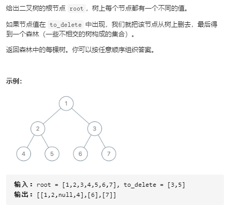

解决思路：首先将删除的元素列表哈希化，便于加快元素查找速度。其次后序遍历二叉树：

1. 若当前节点是需要删除的节点，将删除节点后形成的子树添加到结果集合中，并且在原集合中用空子树替换原来的位置。
2. 若当前节点是不需要删除的节点，则不用管。

```python
class Solution:
    def delNodes(self, root: TreeNode, to_delete: List[int]) -> List[TreeNode]:

        res = []
        to_delete = set(to_delete)
        def PostOrder(root):
            if root == None:
                return
            root.left = PostOrder(root.left)
            root.right = PostOrder(root.right)
            if root.val in to_delete:
                if root.left:
                    res.append(root.left)
                if root.right:
                    res.append(root.right)
                root = None
            return root
        
        root = PostOrder(root)
        if root:
            res.append(root)
        return res
```


## [623. 在二叉树中增加一行](https://leetcode-cn.com/problems/add-one-row-to-tree/)

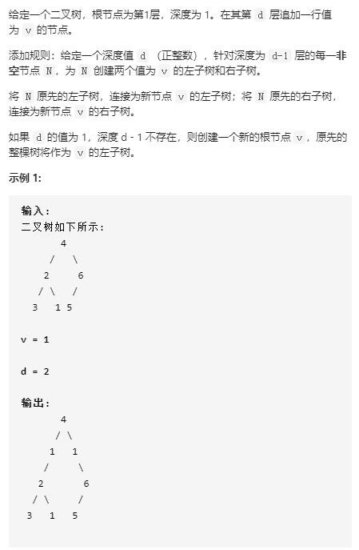

解决思路：层次遍历该树，将节点和其所在的深度添加到队列中，直到当前节点深度为$d-1$时，将其左右子树用新子树替换，并将原来的子树插入在新子树的左右子树中。

```python


class Solution:
    def addOneRow(self, root: TreeNode, v: int, d: int) -> TreeNode:
        from collections import deque
        que = deque()
        que.append((root, 1))
        while que:
            curnode, level = que.popleft()
            if level < d - 1:
                if curnode.left:
                    que.append((curnode.left, level + 1))
                if curnode.right:
                    que.append((curnode.right, level + 1))
            elif level == d - 1:
                newnode1, newnode2 = TreeNode(v), TreeNode(v)
                newnode1.left, newnode2.right = curnode.left, curnode.right
                curnode.left, curnode.right = newnode1, newnode2
        if d == 1:
            newnode = TreeNode(v)
            newnode.left = root
            return newnode
        return root
```


## [951. 翻转等价二叉树](https://leetcode-cn.com/problems/flip-equivalent-binary-trees/)


解决思路：该问题分两步解决：

1. 首先都将其左右子树节点翻转（若左子树节点值小于右子树节点值则不需翻转），使得其左右子树按升序排列。(空子树为最大值)
2. 比较两个翻转后的新树是否完全一致。

```python
class Solution:
    def flipEquiv(self, root1: TreeNode, root2: TreeNode) -> bool:
        
        def DFS(root):
            if root == None:
                return
            
            if root.left and root.right:
                if root.left.val > root.right.val:
                    root.left, root.right = root.right, root.left
            elif root.left == None and root.right:
                root.left, root.right = root.right, None
            DFS(root.left)
            DFS(root.right)
            return root
        
        root1 = DFS(root1)
        root2 = DFS(root2)

        def IsSame(root1, root2):
            if root1 == None and root2 == None:
                return True
            if root1 == None and root2:
                return False
            if root1 and root2 == None:
                return False
            if root1.val != root2.val:
                return False
            
            return IsSame(root1.left, root2.left) and IsSame(root1.right, root2.right)
        
        return IsSame(root1, root2)
```


## [655. 输出二叉树](https://leetcode-cn.com/problems/print-binary-tree/)

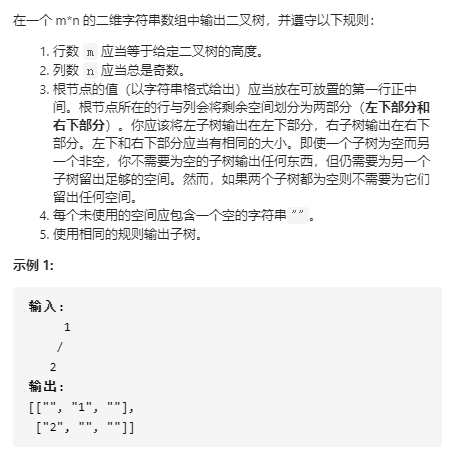

## [889. 根据前序和后序遍历构造二叉树](https://leetcode-cn.com/problems/construct-binary-tree-from-preorder-and-postorder-traversal/)

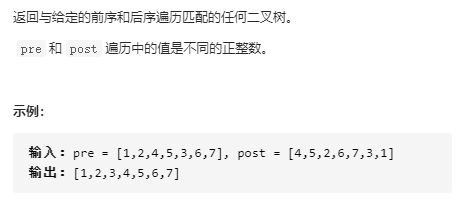

解决思路:通过寻找子树根的位置，来将$pre$和$post$分成左右子树的两部分，再递归解决。

```python
class Solution:
    def constructFromPrePost(self, pre: List[int], post: List[int]) -> TreeNode:
        if pre == [] and post == []:
            return
        valuetoindex = {}
        
        def DFS(pre, post):
            if pre == [] and post == []:
                return
            if len(pre) == 1:
                return TreeNode(pre[0])
            
            rootval = pre[0]
            root = TreeNode(rootval)
            postindex = post.index(pre[1])
            root.left = DFS(pre[1:postindex+2], post[:postindex+1])
            root.right = DFS(pre[postindex+2:], post[postindex+1:-1])
            return root
        return DFS(pre, post)
```


## [979. 在二叉树中分配硬币](https://leetcode-cn.com/problems/distribute-coins-in-binary-tree/)

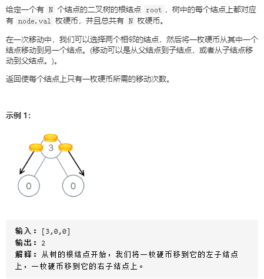

解决思路：对于树中的每个节点，其$|node.val - 1|$值就是是当节点最终值为$node.val = 1$时，其父节点的硬币移动到该节点所需的移动次数，并且将$node.val - 1$值赋给其父节点，此时父节点值就代表该父节点的下所有子树满足条件时还需要的硬币数。因此我们将整个树中硬币的移动问题**转换为父节点到其左右子节点的硬币移动问题。**

```python
class Solution:
    def distributeCoins(self, root: TreeNode) -> int:
        self.res = 0

        def postorder(root):
            if root == None:
                return
            
            postorder(root.left)
            postorder(root.right)
            if root.left:
                root.val += root.left.val - 1
                self.res += abs(root.left.val - 1)
            if root.right:
                root.val += root.right.val - 1
                self.res += abs(root.right.val - 1)
        
        postorder(root)
        return self.res
```


## [449. 序列化和反序列化二叉搜索树](https://leetcode-cn.com/problems/serialize-and-deserialize-bst/)

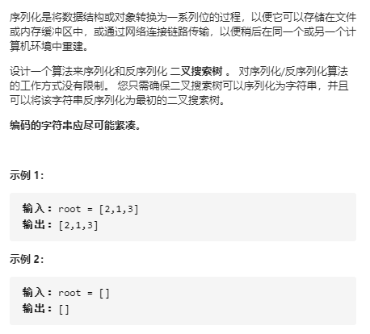

解决思路：采用先序遍历来保存二叉树，再递归还原。

```python
class Codec:

    def serialize(self, root):
        """Encodes a tree to a single string.
        
        :type root: TreeNode
        :rtype: str
        """
        res = []
        def preorder(root):
            if root == None:
                return
            res.append(str(root.val))
            preorder(root.left)
            preorder(root.right)
        
        preorder(root)
        return ','.join(res)

    def deserialize(self, data):
        """Decodes your encoded data to tree.
        
        :type data: str
        :rtype: TreeNode
        """
        import bisect
        if data == "":
            return
        data = list(data.split(',')) 
        data = [int(num) for num in data]
        
        def decode(data):
            if data == []:
                return
            
            rootval = data.pop(0)
            root = TreeNode(rootval)
            index = bisect.bisect(data, rootval)
            root.left = decode(data[:index])
            root.right = decode(data[index:])
            return root
        
        return decode(data)
```


## [894. 所有可能的满二叉树](https://leetcode-cn.com/problems/all-possible-full-binary-trees/)

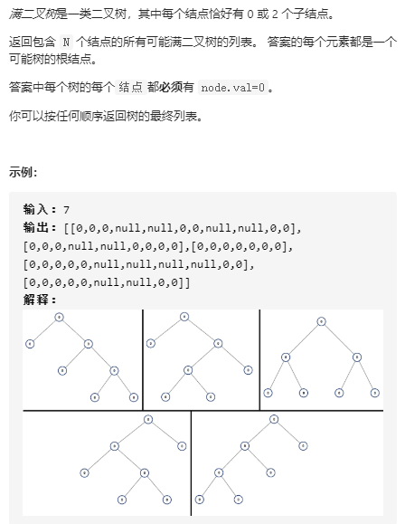

解决思路：因为其节点都有0或2个节点，因此节点总数必定为奇数，所以当$N=$偶数时，必定是空树。当$N$为奇数是，由于当树为满二叉树时，其左右子树也必定为满二叉树，因此可以采用动态规划算法解决。
$$
dp[n] = dp[k] * dp[n-1-k] \qquad k = 1,3,...,n-1
$$
其中左子树从$dp[k]$中取，右子树从$dp[n-1-k]$中取，根节点为$Treenode(0)$。因此可以求解出$dp[n]$

初始条件:
$$
dp[0] = None, \qquad dp[1] = [Treenode(0)]
$$


```python
class Solution:
    def allPossibleFBT(self, N):
        if N % 2 == 0:
            return []
        from collections import defaultdict
        dp = defaultdict(list)
        def DFS(N):
            if N in dp:
                return dp[N]
            if N == 0:
                return 
            if N == 1:
                dp[1].append(TreeNode(0))
                return dp[1]
            for i in range(1, N, 2):
                left = DFS(i)
                right = DFS(N-1-i)
                for lefttree in left:
                    for righttree in right:
                        root = TreeNode(0)
                        root.left = lefttree
                        root.right = righttree
                        dp[N].append(root)
            return dp[N]
        
        DFS(N)
        return dp[N]
```


## [998. 最大二叉树 II](https://leetcode-cn.com/problems/maximum-binary-tree-ii/)

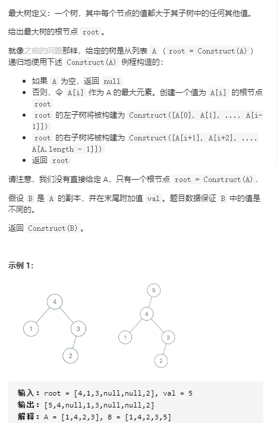

解决思路：最大二叉树虽然是新定义，但是其与二叉搜索树有类似性质，可以借鉴求解二叉搜索树的方法。

1. 当$val > root.val$时，直接在此处插入新节点，原来的树作为新节点的子树
2. 当$val < root.val$时，递归插入其右子树即可，因为插入的值是在列表最后，所以不需要考虑递归插入左子树的问题。

```python
class Solution:
    def insertIntoMaxTree(self, root: TreeNode, val: int) -> TreeNode:

        def DFS(root, val):
            if root == None:
                return TreeNode(val)
            
            if root.val < val:
                newnode = TreeNode(val)
                newnode.left = root
                return newnode
            
            root.right = DFS(root.right, val)
            return root
        
        return DFS(root, val)
```


## [865. 具有所有最深节点的最小子树](https://leetcode-cn.com/problems/smallest-subtree-with-all-the-deepest-nodes/)

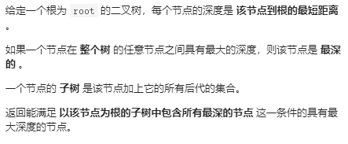

解决思路：因为是需要最深节点的最小子树：

1. 所以首先必定涉及到深度，而要涉及到求解当前接节点的深度，则其左右子树的深度必定是需要已知的，因此采用后序遍历来求解

2. 左右子树的深度求解后又分为3种情况：定义叶子节点深度为0

   a. $lefthigh == righthigh$时，此时左右子树的**高度相等**，则最小子树必定是其父节点，且父节点的深度为$lefthigh + 1$。

   b. $lefthigh > righthigh$时， 此时**左子树的高度大于右子树**， 因此其最小子树必定是左子树根节点$leftnode$，且父节点的深度为$lefthigh + 1$

   c. $lefthigh < righthigh$时， 此时**左子树的高度小于左子树**， 因此其最小子树必定是右子树根节点$leftnode$，且父节点的深度为$righthigh + 1$

```python
class Solution(object):
    def subtreeWithAllDeepest(self, root):
        
        def DFS(root):
            if root == None:
                return None, 0
            
            leftnode, lefthigh = DFS(root.left)
            rightnode, righthigh = DFS(root.right)
            if lefthigh == righthigh:
                return root, lefthigh + 1
            if lefthigh > righthigh:
                return leftnode, lefthigh + 1
            else:
                return rightnode, righthigh + 1
           
        DFS(root)
        return DFS(root)[0]
```

## [1261. 在受污染的二叉树中查找元素](https://leetcode-cn.com/problems/find-elements-in-a-contaminated-binary-tree/)

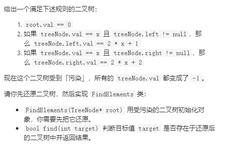

解决思路：该问题只需要层次遍历即可，即可确定每个节点的元素值，并将元素值保存在集合中，便于快速判断要查找的元素是否在集合中。

```python
from collections import deque
class FindElements:
    def __init__(self, root: TreeNode):
        que = deque()
        self.treevals = set()
        que.append((root, 0))

        while que:
            curnode, curval = que.popleft()
            curnode.val = curval
            self.treevals.add(curval)
            if curnode.left:
                que.append((curnode.left, 2 * curval + 1))
            if curnode.right:
                que.append((curnode.right, 2 * curval + 2))

    def find(self, target: int) -> bool:
        return target in self.treevals
```


## [1130. 叶值的最小代价生成树](https://leetcode-cn.com/problems/minimum-cost-tree-from-leaf-values/)

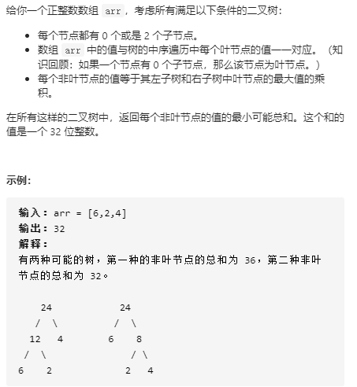

解释思路1：要求得叶值的最小代价生成树，因为树的结构具有递归性，可以采用动态规划来进行求解：$dp[(start,end)]$表示数组$arr[start:end+1]$的最小代价生成树，有递推关系式如下
$$
dp[(start, end)] = min(dp[(start, k)] + dp[(k+1, end)] + max(arr[start:k+1]) * max(arr[k+1:end+1]) \qquad 其中 start <= k < end
$$
即通过选取$arr[start:end+1]$中不同的元素作为根节点，并计算此时的叶值最小代价生成树，最后再求其的最小值，则可求的整个的叶值最小代价生成树。

```python
class Solution:
    def mctFromLeafValues(self, A: List[int]) -> int:
        n = len(A)
        dp = {}
       
        def DFS(start, end):
            if (start, end) in dp:
                return dp[(start, end)]
            if end <= start:
                return 0
            curmin = float("inf")
            for k in range(start, end):
                curmin = min(curmin, DFS(start, k) + DFS(k+1, end) + max(A[start:k+1]) * max(A[k+1:end+1]))
            dp[(start, end)] = curmin
            return dp[(start, end)] 

        return DFS(0, n-1)
```

解决思路2：该思路的来源在于每次从数组元素$a_1,a_2,...,a_n$中选取两个元素生成一个新节点时，即两个叶子节点生成一个父节点时，都会产生代价$a_1 * a_2$，此时会去除一个元素$min(a_1, a_2)$ (因为剩余节点的生成只会利用两者的最大值，而$min(a_1,a_2)$元素再也不会被用到了)。因此为了要使得代价最小，则乘积也需要最小，因此必须从元素$a_k$的左右两侧最早大于$a_k$（**局部性**，不是全局中所有大于$a_k$元素都需要找到，而是只需要找到左右两侧分别第一个大于$a_k$的元素）的两个元素之间最小值。可以使用**单调递减栈**解决，栈中元素从栈底到栈顶降序排序。当**新元素**大于**栈顶元素**$(stack[-1])$时，此时**栈顶元素的左侧**大于其的值为栈中栈顶元素的**下一个元素**（$stack[-2]$）， **右侧大于栈顶元**素的值即为**新元素**，因此比较两者，则可计算去除栈顶元素的最小代价为$min(stack[-2], newnum) * stack[-1]$，最后直到栈中元素为空时，最小代价生成树的值也求得。第二种思路的解决需要对这个问题有更本质的认识。

```python
class Solution:
    def mctFromLeafValues(self, A: List[int]) -> int:
        
        stack = [float("inf")]
        res = 0
        for num in A:
            while stack and stack[-1] <= num:
                curval = stack.pop()
                res += curval * min(stack[-1], num)
            stack.append(num)

        while len(stack) > 2:
            res += stack.pop() * stack[-1]
        return res
```


## [1145. 二叉树着色游戏](https://leetcode-cn.com/problems/binary-tree-coloring-game/)

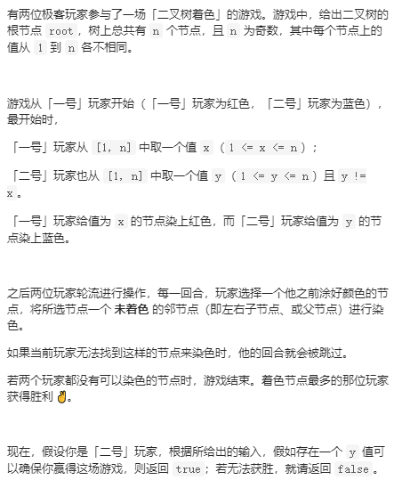

解决思路：该问题的本质在于1号玩家着色后，将其整个树结构分为3个区域，**左子树连通区域，右子树连通区域， 父节点连通区域**。2号玩家要想赢得游戏，则必定是需要从这三个区域中选择**节点数最大的区域**进行着色，且着色点就是与1号着色点相邻的节点（左子树根节点、右子树根节点、父节点），并且这最大区域的节点数必须大于$n // 2$, 即总节点数的一半，才会获胜。因此只需要判断1号着色点的三个区域是否有其中一个区域满足该条件即可。

​         判断的前提是统计子树的节点数，为了统计子树的节点数，必须先统计左右子树的节点数，因此采用**后序遍历**来解决。

```python
class Solution:
    def btreeGameWinningMove(self, root: TreeNode, n: int, x: int) -> bool:
        self.res = False

        def DFS(root):
            if root == None:
                return 0
            
            leftnum = DFS(root.left)
            rightnum = DFS(root.right)

            if root.val == x:
                if (leftnum > n // 2) or (rightnum > n//2) or ((n-1-leftnum-rightnum) > n // 2):
                    self.res = True
            return leftnum + rightnum + 1
        DFS(root)
        return self.res
```


## [988. 从叶结点开始的最小字符串](https://leetcode-cn.com/problems/smallest-string-starting-from-leaf/)

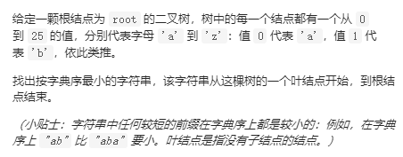

解决思路：该问题在首先计划用动态规划来解决，即对每个字节点只保留所有叶子节点到该节点路径的最小字典序路径，但是这个思路是由问题的，问题在于这些所有的路径字符串它们的长度不一致，所以会导致即使$ab<abc$，此时如果保留最小路径，则应该保留$ab$, 但是如果下一个节点是$d$，则$abd>abcd$，因此求的最小字符串$abd$并不是最小的。这根源在于当前的最小字符串并不仅仅是只与局部字符串有关系。所以动态规划的算法解决不了。因此**采用深度优先搜索来解**决。

```python
class Solution:
    def smallestFromLeaf(self, root: TreeNode) -> str:
        
        numtoalp = dict()
        for i in range(27):
            numtoalp[i] = chr(i+97)

        self.minstr = 'z' * 10000
        def DFS(root, path):
            if root == None:
                return 
            if root.left:
                DFS(root.left, numtoalp[root.left.val] + path)
            if root.right:
                DFS(root.right, numtoalp[root.right.val] + path)
            if root.left == None and root.right == None:
                self.minstr = min(self.minstr, path)

        DFS(root, numtoalp[root.val])    
        return self.minstr
```


## [1123. 最深叶节点的最近公共祖先](https://leetcode-cn.com/problems/lowest-common-ancestor-of-deepest-leaves/)

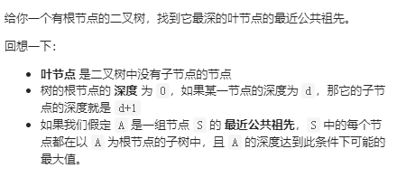

解决思路：该问题同上[865. 具有所有最深节点的最小子树](https://leetcode-cn.com/problems/smallest-subtree-with-all-the-deepest-nodes/)

```python
class Solution:
    def lcaDeepestLeaves(self, root: TreeNode) -> TreeNode:

        def DFS(root):
            if root == None:
                return None, 0
            
            leftnode, lefthigh = DFS(root.left)
            rightnode, righthigh = DFS(root.right)
            if lefthigh == righthigh:
                return root, lefthigh + 1
            if lefthigh > righthigh:
                return leftnode, lefthigh + 1
            else:
                return rightnode, righthigh + 1
           
        DFS(root)
        return DFS(root)[0]
```


## [971. 翻转二叉树以匹配先序遍历](https://leetcode-cn.com/problems/flip-binary-tree-to-match-preorder-traversal/)

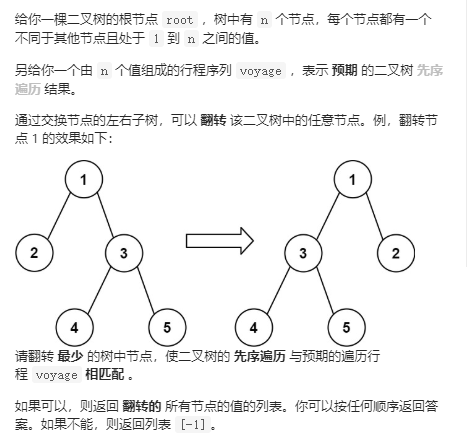

解决思路：需要求解翻转次数的最小值，则是需要在不得已的情况下才进行翻转。因此关键之处在于找到什么时候才是必须要进行翻转的时刻，因为$voyage$

是先序遍历的数组，因此若是当前左子树根节点的值在$voyage$的索引大于当前右子树根节点的值在$voyage$的索引时，则是必须要翻转的时候了，因为若不翻转，则前者索引应当是小于后者索引的。最后将翻转后的先序遍历数组与$voyage$比较，判断是否相等。若相等，再看翻转次数，若不等，则返回-1。

```python
class Solution:
    def flipMatchVoyage(self, root: TreeNode, voyage: List[int]) -> List[int]:
        valueToindex = {value: index for index, value in enumerate(voyage)}
        
        res = []
        preorder = []
        def DFS(root):
            if root == None:
                return
            preorder.append(root.val)
            if root.left and root.right:
                if valueToindex[root.left.val] > valueToindex[root.right.val]:
                    root.left, root.right = root.right, root.left
                    res.append(root.val)
            DFS(root.left)
            DFS(root.right)

        DFS(root)
        return res if preorder == voyage else [-1]
```


## [1026. 节点与其祖先之间的最大差值](https://leetcode-cn.com/problems/maximum-difference-between-node-and-ancestor/)

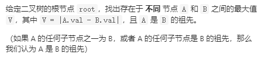

解决思路：要计算当前节点与其祖先之间的差值，与计算当前节点与其后代的差值是等价的。因此要计算节点与其后代的最大差值，则首先要拿到后代，即左右子树的所有值中的最大值和最小值，再求得$max(|root.val - maxvalue|, |root.val - minvalue|)$即为当前节点与其子孙的最大差值，因为先要拿到左右子树的最值，则采用后序遍历即可。

```python
class Solution:
    def maxAncestorDiff(self, root: TreeNode) -> int:
        
        self.maxval = -1

        def DFS(root):
            if root == None:
                return -float("inf"), float("inf")

            if root.left == None and root.right == None:
                return root.val, root.val
            
            leftmax, leftmin = DFS(root.left)
            rightmax, rightmin = DFS(root.right)

            self.maxval = max(abs(max(leftmax, rightmax) - root.val), abs(min(leftmin, rightmin) - root.val), self.maxval)

            return max(leftmax, rightmax, root.val), min(leftmin, rightmin, root.val)
        
        DFS(root)
        return self.maxval
```


## [652. 寻找重复的子树](https://leetcode-cn.com/problems/find-duplicate-subtrees/)


解决思路：要寻找重复子树，则必定先要找到所有的子树，因此将其所有子树采用后序遍历序列化保存在集合中，从而来判断是否是重复子树。

```python
class Solution:
    def findDuplicateSubtrees(self, root: TreeNode) -> List[TreeNode]:
        sonTreeset = {}
        res = []

        def DFS(root):
            if root == None:
                return "#"

            leftstr = DFS(root.left)
            rightstr = DFS(root.right)
            poststr = leftstr + ',' + rightstr + ','+ str(root.val) + ',' # 防止数字不同，但是字符串连接后相同
            if poststr in sonTreeset:
                if sonTreeset[poststr] == 1:
                    res.append(root)
                    sonTreeset[poststr] += 1
                else:
                    sonTreeset[poststr] += 1
            else:
                sonTreeset[poststr] = 1

            return poststr

        DFS(root)
        return res
```


## [958. 二叉树的完全性检验](https://leetcode-cn.com/problems/check-completeness-of-a-binary-tree/)


解决思路：二叉完全树的左右子树根节点与父节点的索引存在关系：当父节点索引为$i$时，左右子树的索引为$2*i,2*i+1$，其中根节点索引为1，索引的排列为层次遍历的顺序。因此只需要判断最后一个节点的索引是否等于节点数，即可判断是否是完全二叉树。

```python
class Solution:
    def isCompleteTree(self, root: TreeNode) -> bool:
        
        from collections import deque
        if root == None:
            return True
        que = deque()
        que.append((root, 1))
        nums = 0
        while que:
            curnode, index = que.popleft()
            nums += 1
            if curnode.left:
                que.append((curnode.left, 2 * index))
            if curnode.right:
                que.append((curnode.right, 2 * index + 1))
        
        return index == nums
```


## [508. 出现次数最多的子树元素和](https://leetcode-cn.com/problems/most-frequent-subtree-sum/)


解决思路：思路基本同[652. 寻找重复的子树](https://leetcode-cn.com/problems/find-duplicate-subtrees/)

```python
class Solution:
    def findFrequentTreeSum(self, root: TreeNode) -> List[int]:
        
        from collections import defaultdict
        if root == None:
            return []
        res = []
        SontreeSum = defaultdict(int)
        def DFS(root):
            if root == None:
                return 0
            
            if root.left == None and root.right == None:
                SontreeSum[root.val] += 1
                return root.val
            
            leftsum = DFS(root.left)
            rightsum = DFS(root.right)

            SontreeSum[leftsum + rightsum + root.val] += 1
            return leftsum + rightsum + root.val
        
        DFS(root)
        maxvalue = max(SontreeSum.values())
        for key, value in SontreeSum.items():
            if value == maxvalue:
                res.append(key)
        return res
```


## [1008. 前序遍历构造二叉搜索树](https://leetcode-cn.com/problems/construct-binary-search-tree-from-preorder-traversal/)

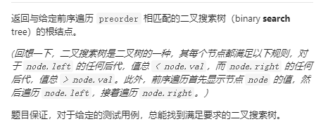

解决思路：利用二叉搜索树的性质，左子树的节点值小于根节点值，右子树的节点值大于根节点值，递归即可解决。

```python
import bisect
class Solution:
    def bstFromPreorder(self, preorder: List[int]) -> TreeNode:

        def DFS(preorder):
            if preorder == []:
                return 
            if len(preorder) == 1:
                return TreeNode(preorder[0])
            
            rootval = preorder.pop(0)
            index = bisect.bisect(preorder, rootval)
            root = TreeNode(rootval)
            root.left = DFS(preorder[:index])
            root.right = DFS(preorder[index:])
            return root
        
        return DFS(preorder)
```


## [1104. 二叉树寻路](https://leetcode-cn.com/problems/path-in-zigzag-labelled-binary-tree/)

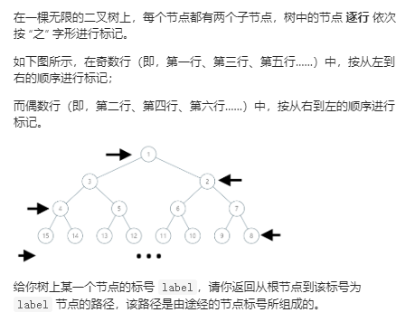

解决思路：可以观察当前层节点标号与其父节点的标号对应关系为：
$$
upper\_label = (2 ** curpower + (2 ** (curpower + 1) - 1 - cur\_label)) // 2 \qquad 其中2^{curpower} <= cur\_label < 2^{curpower+1}
$$


```python
class Solution:
    def pathInZigZagTree(self, label: int) -> List[int]:
        import math

        res = []
        while label != 1:
            twopower = int(math.log(label, 2))
            res.append(label)
            label = (2 ** twopower + (2 ** (twopower + 1) - 1 - label)) // 2
        res.append(label)
        return res[::-1]
```


## [1305. 两棵二叉搜索树中的所有元素](https://leetcode-cn.com/problems/all-elements-in-two-binary-search-trees/)

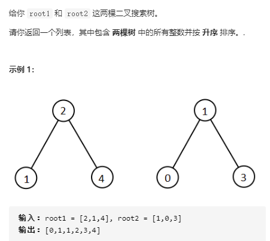

解决思路：先中序遍历两颗二叉搜索树，得到两个有序排列的升序数组，再对两数组排序即可。

```python
from collections import deque
class Solution:
    def getAllElements(self, root1: TreeNode, root2: TreeNode) -> List[int]:
        
        def inorder(root, path):
            if root == None:
                return path
            
            res = inorder(root.left, path)
            res.append(root.val)
            res = inorder(root.right, res)
            return res
        
        path1 = inorder(root1, [])
        path2 = inorder(root2, [])
        res = []

        len1, len2 = len(path1), len(path2)
        i, j = 0, 0
        while i < len1 and j < len2:
            if path1[i] < path2[j]:
                res.append(path1[i])
                i += 1
            else:
                res.append(path2[j])
                j += 1
        res += path1[i:len1] + path2[j:len2]
        return res
```


## [662. 二叉树最大宽度](https://leetcode-cn.com/problems/maximum-width-of-binary-tree/)

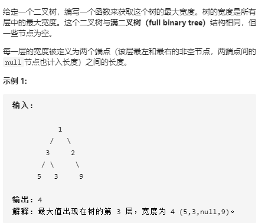

解决思路：层序遍历该二叉树，并且保留每层的最小索引和最大索引，最后比较所有层的$最大索引_i - 最小索引_i|$，得到最大值即可。

```python
class Solution:
    def widthOfBinaryTree(self, root: TreeNode) -> int:
        if root == None:
            return 0
        levelminmax = {}

        from collections import deque
        que = deque()
        que.append((root, 1, 1))
        while que:
            curnode, level, index = que.popleft()
            if level in levelminmax:
                levelminmax[level][0] = min(levelminmax[level][0], index)
                levelminmax[level][1] = max(levelminmax[level][1], index)
            else:
                levelminmax[level] = [index, index]
            
            if curnode.left:
                que.append((curnode.left, level + 1, 2 * index))
            if curnode.right:
                que.append((curnode.right, level + 1, 2 * index + 1))

        maxwidth = 0
        for i in range(1, level + 1):
            maxwidth = max(maxwidth, levelminmax[i][1] - levelminmax[i][0] + 1)

        return maxwidth
```


## [863. 二叉树中所有距离为 K 的结点](https://leetcode-cn.com/problems/all-nodes-distance-k-in-binary-tree/)


解决思路：因为该距离不只包括当前节点到左右子树的距离，还包括当前节点到其父节点的距离，因此首先将二叉树的单向连接变为双向连接。再从目标节点开始开始搜索，遍历左右子树，父子树找到距离为$K$的所有节点。这里要注意因为此时是双向连接的，因此需要记录已经访问的节点，避免重复访问。

```python
# Definition for a binary tree node.
class TreeNode:
    def __init__(self, x):
        self.val = x
        self.left = None
        self.right = None
        self.parent = None

class Solution:
    def distanceK(self, root: TreeNode, target: TreeNode, K: int) -> List[int]:
        
        def DFS(root):
            if root == None:
                return
            if root.left == None and root.right == None:
                return

            if root.left:
                root.left.parent = root
            if root.right:
                root.right.parent = root

            DFS(root.left)
            DFS(root.right)
        
        root.parent = None
        DFS(root)

        res = []
        visit = set()
        def findK(root, K):
            
            if root == None:
                return
            if root.val in visit:
                return
            visit.add(root.val)
            if K == 0:
                res.append(root.val)

            findK(root.left, K-1)
            findK(root.right, K-1)
            findK(root.parent, K-1)
        
        findK(target, K)
        return res
```

## [1315. 祖父节点值为偶数的节点和](https://leetcode-cn.com/problems/sum-of-nodes-with-even-valued-grandparent/)

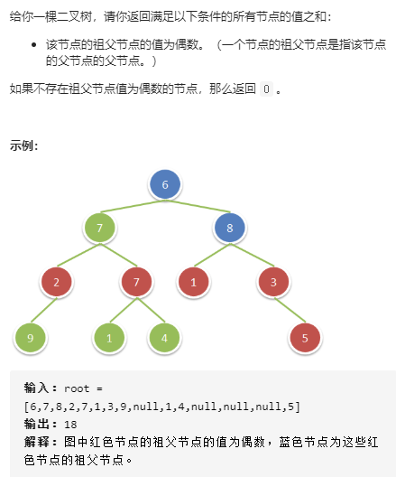

解决思路：该题只需要当前节点值为偶数时，直接对其孙节点的值进行相加即可。

```python
class Solution:
    def sumEvenGrandparent(self, root: TreeNode) -> int:
        
        self.res = 0
        def DFS(root):
            if root == None:
                return
            
            if root.val % 2 == 0:
                if root.left:
                    if root.left.left:
                        self.res += root.left.left.val
                    if root.left.right:
                        self.res += root.left.right.val
                if root.right:
                    if root.right.left:
                        self.res += root.right.left.val
                    if root.right.right:
                        self.res += root.right.right.val
            
            DFS(root.left)
            DFS(root.right)
        
        DFS(root)
        return self.res
```

## [1302. 层数最深叶子节点的和](https://leetcode-cn.com/problems/deepest-leaves-sum/)

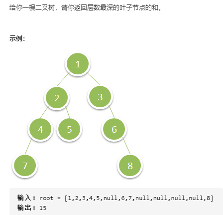

解决思路：层序遍历，直接计算最后一层节点的值的和即可。

```python
class Solution:
    def deepestLeavesSum(self, root: TreeNode) -> int:
        res = []
        from collections import deque
        que = deque()
        que.append((root, 0))
        while que:
            curnode, level = que.popleft()
            if level == len(res):
                res.append([])
            res[level].append(curnode.val)

            if curnode.left:
                que.append((curnode.left, level+1))
            if curnode.right:
                que.append((curnode.right, level+1))
        
        return sum(res[-1])
```


## [1038. 把二叉搜索树转换为累加树](https://leetcode-cn.com/problems/binary-search-tree-to-greater-sum-tree/)

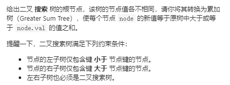

解决思路：要使得二叉搜索树的节点新值等于原树中大于或等于节点值的值之和，由于二叉搜索树的性质有右子树的值大于根节点，根节点大于左子树的值，因此只需要按 **右根左的顺序**遍历即可，每次保留前一个节点的值，则当前节点的值加上前一个节点的值即可。

```python
class Solution:
    def bstToGst(self, root: TreeNode) -> TreeNode:

        def DFS(root, pre):
            if root == None:
                return
            
            DFS(root.right, pre)
            if pre:
                root.val += pre.val
            pre = root
            DFS(root.left, pre)
        
        DFS(root, 0)
        return root
```


## [814. 二叉树剪枝](https://leetcode-cn.com/problems/binary-tree-pruning/)

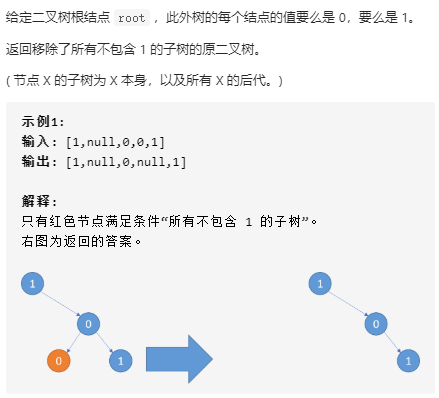

解决思路：要知道当前节点的子树是否包含1，则需要知道当前节点的左右子树是否包含1，因此采用后序遍历，当左右子树为空，且节点值为0时，则移除，返回空树。

```python
class Solution:
    def pruneTree(self, root: TreeNode) -> TreeNode:
        
        def DFS(root):
            if root == None:
                return
            
            root.left = DFS(root.left)
            root.right = DFS(root.right)

            if root.left == None and root.right == None:
                if root.val == 0:
                    return None
                
            return root
        return DFS(root)
```


## [515. 在每个树行中找最大值](https://leetcode-cn.com/problems/find-largest-value-in-each-tree-row/)

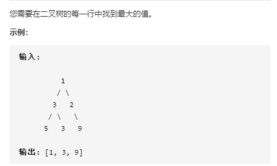

解决思路：层序遍历

```python
class Solution:
    def largestValues(self, root: TreeNode) -> List[int]:
        from collections import deque

        if root == None:
            return []
        res = []

        que = deque()
        que.append((root, 0))

        while que:
            curnode, level = que.popleft()
            if level == len(res):
                res.append(-float("inf"))
            res[level] = max(res[level], curnode.val)

            if curnode.left:
                que.append((curnode.left, level + 1))
            if curnode.right:
                que.append((curnode.right, level + 1))
        
        return res
```


## [429. N 叉树的层序遍历](https://leetcode-cn.com/problems/n-ary-tree-level-order-traversal/)


解决思路：层序遍历

```python
"""
# Definition for a Node.
class Node:
    def __init__(self, val=None, children=None):
        self.val = val
        self.children = children
"""
from collections import deque
class Solution:
    def levelOrder(self, root: 'Node') -> List[List[int]]:
        
        if root == None:
            return []
        res = []
        que = deque()
        que.append((root, 0))

        while que:
            curnode, level = que.popleft()
            if level == len(res):
                res.append([])
            res[level].append(curnode.val)

            for child in curnode.children:
                que.append((child, level+1))
        
        return res
```

## [513. 找树左下角的值](https://leetcode-cn.com/problems/find-bottom-left-tree-value/)

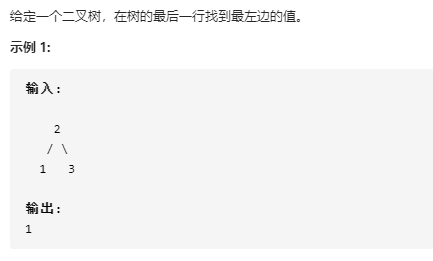

解决思路：层序遍历，并且采用小技巧，每次先保存右子节点的值，再保存左子节点的值，则最后的返回值就是左下角的值。

```python
class Solution:
    def findBottomLeftValue(self, root: TreeNode) -> int:
        if root is None:
            return
        
        from collections import deque
        que = deque()
        que.append(root)
        while que:
            cur = que.popleft()
            
            if cur.right:
                que.append(cur.right)
            if cur.left:
                que.append(cur.left)
        return cur.val
```


## [450. 删除二叉搜索树中的节点](https://leetcode-cn.com/problems/delete-node-in-a-bst/)

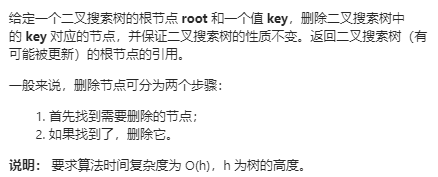

解决思路：首先需要找到其需要删除的节点，然后再删除它

1. 找到节点比较简单，只需要将需要删除的节点值与当前节点比较，若是前者更小，则递归搜索左子树，否则递归搜索右子树

2. 当找到该节点后，分4种情况进行讨论：

    a. 该节点的左右子树均为空，则直接删除即可

    b. 当该节点的左子树为空，则直接返回右子树

    c. 当该节点的右子树为空， 则直接返回左子树

    d.当该节点的左右子树都存在，则需要从其子树中找到一个节点来代替根节点，根据二叉搜索树的性质，该节点有两种选取方式，分别为左子树的右下角值（即小于根节点的最大值）或右子树的左下角值（即大于根节点的最小值）。此处我们选择右子树的左下角值，将原来根节点值替换为该值，再递归删除右子树的该节点值即可。

```python
class Solution:
    def deleteNode(self, root: TreeNode, key: int) -> TreeNode:
        def DFS(root, key):
            if root == None:
                return
            
            if root.val == key:
                if root.left == None and root.right == None:
                    return None
                if root.left and root.right == None:
                    return root.left
                if root.right and root.left == None:
                    return root.right
                if root.left and root.right:
                    p = root.right
                    while p.left:#右子树的左下角值
                        p = p.left
                    root.val = p.val
                    root.right = DFS(root.right, root.val)#递归删除右子树的该节点值即可。
                    
            elif root.val > key:
                root.left = DFS(root.left, key)
            elif root.val < key:
                root.right = DFS(root.right, key)
            
            return root
        
        return DFS(root, key)
```


## [654. 最大二叉树](https://leetcode-cn.com/problems/maximum-binary-tree/)

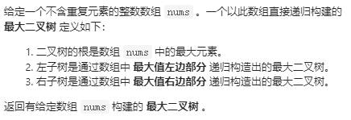

解决思路：同二叉搜索树的构建基本一致。

```python
class Solution:
    def constructMaximumBinaryTree(self, nums: List[int]) -> TreeNode:
       
        
        def DFS(nums):
            if nums == []:
                return
            maxnum = max(nums)
            maxindex = nums.index(maxnum)
            root = TreeNode(maxnum)
            root.left = DFS(nums[:maxindex])
            root.right = DFS(nums[maxindex + 1:])
            return root
        
        return DFS(nums)
```


## [701. 二叉搜索树中的插入操作](https://leetcode-cn.com/problems/insert-into-a-binary-search-tree/)


解决思路：同[450. 删除二叉搜索树中的节点](https://leetcode-cn.com/problems/delete-node-in-a-bst/)中的寻找节点值的步骤基本一致。

```python
class Solution:
    def insertIntoBST(self, root: TreeNode, val: int) -> TreeNode:
 
        
        def DFS(root):
            if root == None:
                return TreeNode(val)
            
            if root.val > val:
                root.left = DFS(root.left)
            else:
                root.right = DFS(root.right)
            
            return root
        return DFS(root)
```


## [684. 冗余连接](https://leetcode-cn.com/problems/redundant-connection/)

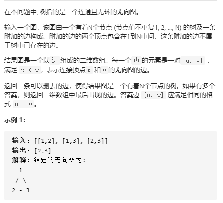

## [95. 不同的二叉搜索树 II](https://leetcode-cn.com/problems/unique-binary-search-trees-ii/)

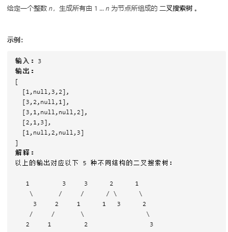

解决思路：由于二叉搜索树的子树也是二叉搜索树，因此可以采用动态规划算法解决。$dp[start][end]$表示元素$start, start+1,...,end$组成的二叉搜索树
$$
dp[start][end] = dp[start][k] * dp[k+1][end] \qquad 其中 start<=k<end
$$
即通过从$start<=k<end$选择$k$作为根节点，从$dp[start][k]和dp[k+1][end]$中分别选取元素作为左右子树即可构成新的二叉搜索树。

```python
import copy
class Solution:
    def generateTrees(self,n : int) -> List[TreeNode]:

        def DFS(start, end):
            if end - start == 0:
                return [None]
            if end - start == 1:
                return [TreeNode(start)]
            
            res = []
            for k in range(start, end):
                lefts = DFS(start, k)
                rights = DFS(k+1, end)
                for left in lefts:
                    for right in rights:
                        root = TreeNode(k)
                        root.left = left
                        root.right = right
                        res.append(root)
            return res
        return DFS(1, n + 1)
```


## [剑指 Offer 34. 二叉树中和为某一值的路径](https://leetcode-cn.com/problems/er-cha-shu-zhong-he-wei-mou-yi-zhi-de-lu-jing-lcof/)

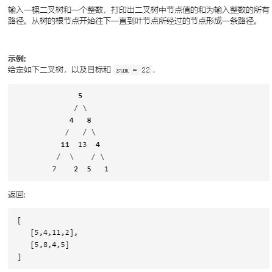

解决思路：深度优先遍历

```python
class Solution:
    def pathSum(self, root: TreeNode, sum: int) -> List[List[int]]:
        
        if root == None:
            return []
        res = []

        def DFS(root, target, path):
            if root == None:
                return
            
            if root.left == None and root.right == None:
                if target == 0:
                    res.append(path)
                return
            
            if root.left:
                DFS(root.left,  target - root.left.val, path + [root.left.val])
            if root.right:
                DFS(root.right,  target - root.right.val, path + [root.right.val])
        DFS(root, sum - root.val, [root.val])
        return res
```


## [230. 二叉搜索树中第K小的元素](https://leetcode-cn.com/problems/kth-smallest-element-in-a-bst/)


解析思路：由于二叉搜索树的中序遍历有序，因此采用中序遍历即可。

```python
class Solution:
    def kthSmallest(self, root: TreeNode, k: int) -> int:

        stack = []

        while (root or stack) and k:

            while root:
                stack.append(root)
                root = root.left
            
            cur = stack.pop()
            k -= 1
            root = cur.right
        
        return cur.val
```

## [117. 填充每个节点的下一个右侧节点指针 II](https://leetcode-cn.com/problems/populating-next-right-pointers-in-each-node-ii/)

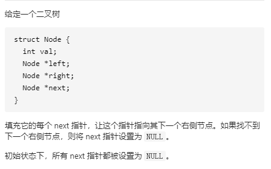

解决思路：在树的每一层左边添加一个虚拟节点，则当前节点的左子树为虚拟节点的next节点，然后当前节点的右子树为虚拟节点的next节点的next节点。

当前节点采用当前节点的next节点迭代，虚拟节点采用虚拟节点的next节点迭代。

```python
"""
# Definition for a Node.
class Node:
    def __init__(self, val: int = 0, left: 'Node' = None, right: 'Node' = None, next: 'Node' = None):
        self.val = val
        self.left = left
        self.right = right
        self.next = next
"""

class Solution:
    def connect(self, root: 'Node') -> 'Node':
        cur = root
        while cur:
            pre = Node(-1)
            t = pre
            while cur:
                if cur.left:
                    t.next = cur.left
                    t = t.next
                if cur.right:
                    t.next = cur.right
                    t = t.next
                cur = cur.next
            cur = pre.next
        
        return root
```


## [538. 把二叉搜索树转换为累加树](https://leetcode-cn.com/problems/convert-bst-to-greater-tree/)

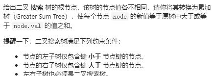

解决思路：[1038. 把二叉搜索树转换为累加树](https://leetcode-cn.com/problems/binary-search-tree-to-greater-sum-tree/)

```python
class Solution:
    def convertBST(self, root: TreeNode) -> TreeNode:
        if root is None:
            return

        self.pre = 0
        def postorder(root):
            if root is None:
                return 
            postorder(root.right)
            root.val += self.pre
            self.pre = root.val
            postorder(root.left)
        
        postorder(root)
        return root
```


## [437. 路径总和 III](https://leetcode-cn.com/problems/path-sum-iii/)


解决思路：因为该路径不需要从根节点开始，也不需要到叶子节点结束，因此所有的路径都需要考虑到，采用深度优先搜索，每次都将当前路径中的元素值加上当前节点值，并且在路径中还需要添加当前节点值，代表该路径只由当前节点组成。

```python
class Solution:
    def pathSum(self, root: TreeNode, sum: int) -> int:
        self.res = 0

        def DFS(root, nums):
            if root == None:
                return
            for i in range(len(nums)):
                nums[i] += root.val
                if nums[i] == sum:
                    self.res += 1
            if root.val == sum:
                self.res += 1
           
            DFS(root.left, nums + [root.val])
            DFS(root.right, nums + [root.val])
        
        DFS(root, [])
        return self.res
```


## [剑指 Offer 32 - I. 从上到下打印二叉树](https://leetcode-cn.com/problems/cong-shang-dao-xia-da-yin-er-cha-shu-lcof/)

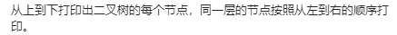

解决思路：层序遍历

```python
from collections import deque
class Solution:
    def levelOrder(self, root: TreeNode) -> List[int]:
        if root == None:
            return []
        que = deque()
        que.append(root)
        res = []
        while que:
            cur = que.popleft()
            res.append(cur.val)
            if cur.left:
                que.append(cur.left)
            if cur.right:
                que.append(cur.right)
        return res
```

## [106. 从中序与后序遍历序列构造二叉树](https://leetcode-cn.com/problems/construct-binary-tree-from-inorder-and-postorder-traversal/)


解决思路：利用根节点值的索引来定位左右子树的中序遍历数组和后序遍历数组，然后递归即可。

```python
class Solution:
    def buildTree(self, inorder: List[int], postorder: List[int]) -> TreeNode:
        valtoind = {val:index for index, val in enumerate(inorder)}

        def DFS(instart, inend, postart, poend):
            if inend - instart == 0:
                return 
            
            if inend - instart == 1:
                return TreeNode(inorder[instart])

            rootval = postorder[poend-1]
            root = TreeNode(rootval)
            index = valtoind[rootval]
            root.left = DFS(instart, index, postart, postart + index - instart)
            root.right = DFS(index+1, inend, postart + index - instart, poend - 1)
            return root
        
        return DFS(0, len(inorder), 0, len(postorder))
```


## [剑指 Offer 32 - III. 从上到下打印二叉树 III](https://leetcode-cn.com/problems/cong-shang-dao-xia-da-yin-er-cha-shu-iii-lcof/)


```python
class Solution:
    def levelOrder(self, root: TreeNode) -> List[List[int]]:
        if root == None:
            return []
        res = []
        que = deque([(root, 0)])
        while que:
            cur, level = que.popleft()
            if level == len(res):
                res.append([])
            if level % 2 == 0:
                res[level].append(cur.val)
            else:
                res[level].insert(0,cur.val)
            if cur.left:
                que.append((cur.left, level+1))
            if cur.right:
                que.append((cur.right, level+1))
        return res
```


## [222. 完全二叉树的节点个数](https://leetcode-cn.com/problems/count-complete-tree-nodes/)


解决思路：利用完全二叉树的性质，当该树的左下角元素的高于右下角元素的高相等时，则代表此完全二叉树是满二叉树，因此可以通过树高直接计算节点数。否则返回左子树节点数加上右子树节点数，再加上根节点数（即1）。

```python
class Solution:
    def countNodes(self, root: TreeNode) -> int:
        
        def DFS(root):
            if root == None:
                return 0
            
            lh, rh = 0, 0
            curleft, curright = root.left, root.right
            while curleft:
                curleft = curleft.left
                lh += 1

            while curright:
                curright = curright.right
                rh += 1
            
            if lh == rh:
                return 2 ** (lh + 1) - 1
            
            return DFS(root.left) + DFS(root.right) + 1
        
        return DFS(root)
```


## [337. 打家劫舍 III](https://leetcode-cn.com/problems/house-robber-iii/)


解决思路1：该问题采用动态规划算法解决，当前树的偷盗金额$dp[当前树]$最大值为：
$$
dp[当前树] = max(dp[当前树.left] + dp[当前树.right], 当前树.val + \sum dp[当前树.孙辈])
$$

```python
class Solution:
    def rob(self, root: TreeNode) -> int:
        dp = {}
        def DFS(root):
            if root in dp:
                return dp[root]
            if root == None:
                return 0
            if root.left == None and root.right == None:
                dp[root] = root.val
                return dp[root]
            if root.left == None:
                dp[root] = max(DFS(root.right), root.val + DFS(root.right.left) + DFS(root.right.right))
                return max(DFS(root.right), root.val + DFS(root.right.left) + DFS(root.right.right))
            if root.right == None:
                dp[root] = max(DFS(root.left), root.val + DFS(root.left.right) + DFS(root.left.left))
                return dp[root]
            dp[root] = max(DFS(root.left) + DFS(root.right), root.val + DFS(root.left.left) + DFS(root.left.right) + DFS(root.right.left) + DFS(root.right.right))
            return  dp[root]
        
        return DFS(root)
```

解决思路：将返回值定义为当前节点为根的两个收益：[当前节点不参与的最大收益，当前节点(参与/不参与)的最大收益]则：
$$
[root\_profit1, root\_profit2] = [root.left\_profit2 + root.right\_profit2, root.val + root.left\_profit1 + root.right\_profit1]
$$


```python
class Solution:
    def rob(self, root: TreeNode) -> int:
        return self.helper(root)[1]
    #helper函数返回一个节点为根的最大值=[当前节点不参与的最大收益，当前节点(参与/不参与)的最大收益]
    def helper(self,root):
        if not root:
            return [0,0]
        left_amount = self.helper(root.left)
        right_amount = self.helper(root.right)
        withoutroot = left_amount[1] + right_amount[1]
        withroot = root.val + left_amount[0] + right_amount[0]
        return [withoutroot, max(withoutroot, withroot)]
```


## [剑指 Offer 26. 树的子结构](https://leetcode-cn.com/problems/shu-de-zi-jie-gou-lcof/)

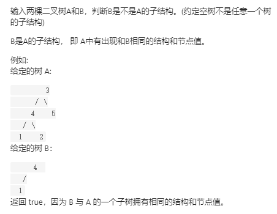

解决思路：见注解

```python
class Solution:
    def isSubStructure(self, A: TreeNode, B: TreeNode) -> bool:
        
        def Issame(root1, root2): #若tree1（B的子树）是tree2（A的子树）的子结构，需要满足tree1为空，或者tree1的根节点值等于tree2的根节点值，而且满足tree1.left是tree2.left的子结构，tree1.right是tree2.right的子结构。
            if root2 == None:
                return True
            if root1 == None:
                return False
            
            return root1.val == root2.val and Issame(root1.left, root2.left) and Issame(root1.right, root2.right)
        
        def check(root1, root2):
            if root1 == None or root2 == None: # 若B是A的子结构，需要满足A和B均不为空树，并且需要满足Issame(root1, root2) or check(root1.left, root2) or check(root1.right, root2)
                return False
            return Issame(root1, root2) or check(root1.left, root2) or check(root1.right, root2)


        return check(A, B)
```


## [116. 填充每个节点的下一个右侧节点指针](https://leetcode-cn.com/problems/populating-next-right-pointers-in-each-node/)

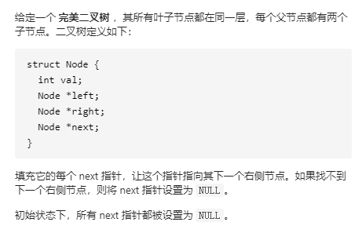

```python
class Solution:
    def connect(self, root: 'Node') -> 'Node':
        
        def DFS(root):
            if root == None:
                return
            if root.left:
                root.left.next = root.right
            if root.right and root.next:
                root.right.next = root.next.left

            DFS(root.left)
            DFS(root.right)
            return root
        
        return DFS(root)
```


## [129. 求根到叶子节点数字之和](https://leetcode-cn.com/problems/sum-root-to-leaf-numbers/)

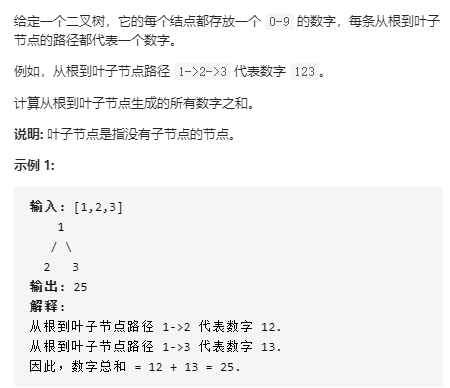

解决思路：深度优先遍历即可

```python
class Solution:
    def sumNumbers(self, root: TreeNode) -> int:
        
        self.res = 0
        def DFS(root, num):
            if root == None:
                return
            if root.left == None and root.right == None:
                self.res += num * 10 + root.val
                return
            
            if root.left:
                DFS(root.left, num * 10 + root.val)
            if root.right:
                DFS(root.right, num * 10 + root.val)
        DFS(root, 0)
        return self.res
```


## [113. 路径总和 II](https://leetcode-cn.com/problems/path-sum-ii/)


解决思路：同[437. 路径总和 III](https://leetcode-cn.com/problems/path-sum-iii/)

```python
class Solution:
    def pathSum(self, root: TreeNode, sum: int) -> List[List[int]]:
        res = []

        def DFS(root, target, path):
            if root == None:
                return
            if root.left == None and root.right == None:
                if target == 0:
                    res.append(path)
                return 
            
            if root.left:
                DFS(root.left, target - root.left.val, path + [root.left.val])
            if root.right:
                DFS(root.right, target - root.right.val, path + [root.right.val])
        if root == None:
            return []
        DFS(root, sum - root.val, [root.val])
        return res
```


## [114. 二叉树展开为链表](https://leetcode-cn.com/problems/flatten-binary-tree-to-linked-list/)

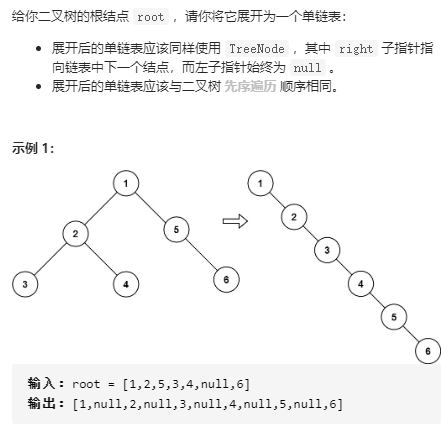

解决思路：为了将二叉树展开为链表，并且该链表与先序遍历即根左右顺序相同，因此在展开时，可以按照右左根顺序进行遍历，每次将前一个节点添加到当前节点的右子树上即可，并将其左子树赋值为空。

```python
class Solution:
    def flatten(self, root: TreeNode) -> None:
        """
        Do not return anything, modify root in-place instead.
        
        """
        self.pre = None
        def DFS(root):
            if root == None:
                return
            
            DFS(root.right)
            DFS(root.left)

            root.right = self.pre
            root.left = None
            self.pre = root
        
        DFS(root)
```


## [96. 不同的二叉搜索树](https://leetcode-cn.com/problems/unique-binary-search-trees/)

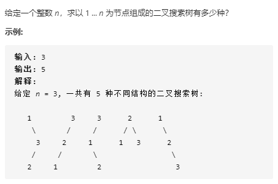

解决思路：同[95. 不同的二叉搜索树 II](https://leetcode-cn.com/problems/unique-binary-search-trees-ii/)

```python
class Solution:
    def numTrees(self, n: int) -> int:
        dp = [0] * (n + 1)
        dp[0] = 1
        dp[1] = 1
        for i in range(2, n + 1):
            for k in range(1, i+1):
                dp[i] += dp[k-1] * dp[i-k]
        return dp[n]
```


## [236. 二叉树的最近公共祖先](https://leetcode-cn.com/problems/lowest-common-ancestor-of-a-binary-tree/)

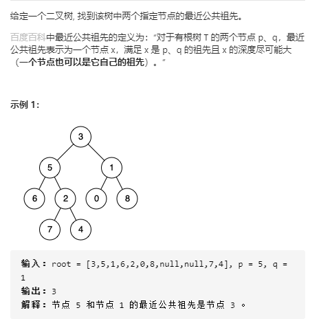

解决思路：当判断当前节点是否指定节点的最近公共祖先时，需要先判断左子树和右子树是否是其指定节点的祖先，则需要采用后序遍历来进行搜索。

```python
class Solution:
    def lowestCommonAncestor(self, root: 'TreeNode', p: 'TreeNode', q: 'TreeNode') -> 'TreeNode':
        
        self.res = None
        def DFS(root):
            if root == None:
                return None, 0
            if root.left == None and root.right == None:
                return root, root in {p, q}

            leftnode, lflag = DFS(root.left)
            rightnode, rflag = DFS(root.right)

            if lflag and rflag:#当左右子树都是指定节点的祖先时，则当前节点就是需要寻找的最近公共祖先
                self.res = root
                return root, 1

            if lflag or rflag: # 若左右子树中有一个是指定节点的祖先，则需要判断当前节点是否是指定节点的祖先，若是，则返回当前节点和1，若不是，则返回当前节点和0。
                if root in {p, q}:
                    self.res = root
                return root, 1
            
            return root, root in {p, q} # 若左右子树都不是其指定节点的祖先，则需要判断当前节点是否是指定节点的祖先，若是，则返回当前节点和1，若不是，则返回当前节点和0。

        DFS(root)
        return self.res
```


## [剑指 Offer 07. 重建二叉树](https://leetcode-cn.com/problems/zhong-jian-er-cha-shu-lcof/)


```python
class Solution:
    def buildTree(self, preorder: List[int], inorder: List[int]) -> TreeNode:
        inord_valindex = {val:index for index, val in enumerate(inorder)}

        def DFS(prestart, preend, instart, inend):
            if preend - prestart == 0:
                return
            if preend - prestart == 1:
                return TreeNode(preorder[prestart])
            
            rootval = preorder[prestart]
            index = inord_valindex[rootval]
            root = TreeNode(rootval)
            root.left = DFS(prestart + 1, prestart + 1 + index - instart, instart, index)
            root.right = DFS(prestart + 1 + index - instart, preend, index + 1, inend)
            return root
        
        return DFS(0, len(preorder), 0, len(inorder))
```


## [105. 从前序与中序遍历序列构造二叉树](https://leetcode-cn.com/problems/construct-binary-tree-from-preorder-and-inorder-traversal/)

```python
class Solution:
    def buildTree(self, preorder: List[int], inorder: List[int]) -> TreeNode:
     
        inord_valindex = {val:index for index, val in enumerate(inorder)}

        def DFS(prestart, preend, instart, inend):
            if preend - prestart == 0:
                return
            if preend - prestart == 1:
                return TreeNode(preorder[prestart])
            
            rootval = preorder[prestart]
            index = inord_valindex[rootval]
            root = TreeNode(rootval)
            root.left = DFS(prestart + 1, prestart + 1 + index - instart, instart, index)
            root.right = DFS(prestart + 1 + index - instart, preend, index + 1, inend)
            return root
        
        return DFS(0, len(preorder), 0, len(inorder))
```


## [145. 二叉树的后序遍历](https://leetcode-cn.com/problems/binary-tree-postorder-traversal/)

解决思路：采用迭代法来求解时，关键在于模仿递归法的压栈过程。

```python
class Solution:
    def postorderTraversal(self, root: TreeNode) -> List[int]:

        stack = []
        result = []
        while root or stack:
            while root:
                stack.append(root)
                root = root.left if root.left else root.right #模仿压栈过程

            root = stack.pop()
            result.append(root.val)
            if stack and stack[-1].left == root:#若刚出栈的是栈顶元素的左节点，则还需要搜索右节点
                root = stack[-1].right
            else:
                root = None # #若刚出栈的是栈顶元素的右节点，则需要进行出栈
        return result
```

## [144. 二叉树的前序遍历](https://leetcode-cn.com/problems/binary-tree-preorder-traversal/)

```python
class Solution:
    def preorderTraversal(self, root: TreeNode) -> List[int]:
        
        """迭代版本"""
        res = []
        stack = []
        while root or stack:
            while root:
                stack.append(root)
                res.append(root.val)
                root = root.left
            
            cur = stack.pop()
            root = cur.right
        return res
```

## [94. 二叉树的中序遍历](https://leetcode-cn.com/problems/binary-tree-inorder-traversal/)

```python
class Solution:
    def inorderTraversal(self, root: TreeNode) -> List[int]:
        res = []
        stack = []

        while root or stack:
            while root:
                stack.append(root)
                root = root.left
            
            cur = stack.pop()
            res.append(cur.val)
            root = cur.right
        return res
```

## [102. 二叉树的层序遍历](https://leetcode-cn.com/problems/binary-tree-level-order-traversal/)

```python
class Solution:
    def levelOrder(self, root: TreeNode) -> List[List[int]]:
        from collections import deque
        if root == None:
            return []
        """ 迭代版本"""
        # que = deque()
        # que.append((root, 1))
        # nums = [[]]
        # level = 0
        # while que:
        #     cur, height = que.popleft()
        #     if height > len(nums):
        #         nums.append([])
        #         nums[height-1].append(cur.val)
        #     else:
        #         nums[height-1].append(cur.val)
        #     if cur.left:
        #         que.append((cur.left, height + 1))
        #     if cur.right:
        #         que.append((cur.right, height + 1))

        # return nums

        results = []
        """ 递归版本 """
        def WidthOrder(root, level):
            if len(results) < level:
                results.append([])
            
            results[level - 1].append(root.val)
            if root.left:
                WidthOrder(root.left, level + 1)
            if root.right:
                WidthOrder(root.right, level + 1)
        
        WidthOrder(root, 1)
        return results
```

## [98. 验证二叉搜索树](https://leetcode-cn.com/problems/validate-binary-search-tree/)


```python
class Solution:
    def isValidBST(self, root: TreeNode) -> bool:
        
        self.pre = -float("inf")
        self.res = True
        def inorder(root):
            if root == None:
                return True
            
            inorder(root.left)
            if root.val <= self.pre:
                self.res = False
            self.pre = root.val
            inorder(root.right)
        inorder(root)
        return self.res
```

