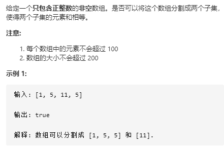

- [动态规划](#----)
  * [[5. 最长回文子串](https://leetcode-cn.com/problems/longest-palindromic-substring/)]
  * [[198. 打家劫舍](https://leetcode-cn.com/problems/house-robber/)]
  * [[62. 不同路径](https://leetcode-cn.com/problems/unique-paths/)]
  * [[64. 最小路径和](https://leetcode-cn.com/problems/minimum-path-sum/)]
  * [[300. 最长递增子序列](https://leetcode-cn.com/problems/longest-increasing-subsequence/)]
  * [[322. 零钱兑换](https://leetcode-cn.com/problems/coin-change/)]
  * [[120. 三角形最小路径和](https://leetcode-cn.com/problems/triangle/)]
  * [[63. 不同路径 II](https://leetcode-cn.com/problems/unique-paths-ii/)]
  * [[96. 不同的二叉搜索树](https://leetcode-cn.com/problems/unique-binary-search-trees/)]
  * [[剑指 Offer 14- I. 剪绳子](https://leetcode-cn.com/problems/jian-sheng-zi-lcof/)]
  * [[152. 乘积最大子数组](https://leetcode-cn.com/problems/maximum-product-subarray/)]
  * [[91. 解码方法](https://leetcode-cn.com/problems/decode-ways/)]
  * [[343. 整数拆分](https://leetcode-cn.com/problems/integer-break/)]
  * [[139. 单词拆分](https://leetcode-cn.com/problems/word-break/)]
  * [[213. 打家劫舍 II](https://leetcode-cn.com/problems/house-robber-ii/)]
  * [[221. 最大正方形](https://leetcode-cn.com/problems/maximal-square/)]
  * [[279. 完全平方数](https://leetcode-cn.com/problems/perfect-squares/)]
  * [[647. 回文子串](https://leetcode-cn.com/problems/palindromic-substrings/)]
  * [[416. 分割等和子集](https://leetcode-cn.com/problems/partition-equal-subset-sum/)]
  * [[309. 最佳买卖股票时机含冷冻期](https://leetcode-cn.com/problems/best-time-to-buy-and-sell-stock-with-cooldown/)]
  * [[376. 摆动序列](https://leetcode-cn.com/problems/wiggle-subsequence/)]
  * [[剑指 Offer 47. 礼物的最大价值](https://leetcode-cn.com/problems/li-wu-de-zui-da-jie-zhi-lcof/)]
  * [[剑指 Offer 63. 股票的最大利润](https://leetcode-cn.com/problems/gu-piao-de-zui-da-li-run-lcof/)]
  * [[338. 比特位计数](https://leetcode-cn.com/problems/counting-bits/)]
  * [[978. 最长湍流子数组](https://leetcode-cn.com/problems/longest-turbulent-subarray/)]
  * [[1143. 最长公共子序列](https://leetcode-cn.com/problems/longest-common-subsequence/)]
  * [[95. 不同的二叉搜索树 II](https://leetcode-cn.com/problems/unique-binary-search-trees-ii/)]
  * [[714. 买卖股票的最佳时机含手续费](https://leetcode-cn.com/problems/best-time-to-buy-and-sell-stock-with-transaction-fee/)]
  * [[494. 目标和](https://leetcode-cn.com/problems/target-sum/)]
  * [[718. 最长重复子数组](https://leetcode-cn.com/problems/maximum-length-of-repeated-subarray/)]
  * [[131. 分割回文串](https://leetcode-cn.com/problems/palindrome-partitioning/)]
  * [[486. 预测赢家](https://leetcode-cn.com/problems/predict-the-winner/)]
  * [[剑指 Offer 14- II. 剪绳子 II](https://leetcode-cn.com/problems/jian-sheng-zi-ii-lcof/)]
  * [[516. 最长回文子序列](https://leetcode-cn.com/problems/longest-palindromic-subsequence/)]
  * [[413. 等差数列划分](https://leetcode-cn.com/problems/arithmetic-slices/)]


个人主页：https://leetcode-cn.com/u/koobrun/

本文总结在Leetcode上做的有关动态规划算法的算法题，主要采用Python语言实现算法。动态规划按照我的理解是与数学归纳法和递推关系式数列有异曲同工之妙，通过寻找$a_n$与$a_{n-1}、a_{n-2}、...$的递推关系式，从而将问题的规模不断缩小，直到达到显而易见的程度，即$n=1$的情况，从而将该过程可逆化，达到解决规模为$n$的问题。由于$a_n$只与局部的某几项有关系，即$a_{n-1}、a_{n-2}、...$，即只与局部的子问题有联系，而与子问题的子问题无直接联系，因此我们可以将注意力集中在小范围上，这也有利于解决问题，这也是动态规划算法的特点。

## [5. 最长回文子串](https://leetcode-cn.com/problems/longest-palindromic-substring/)

问题描述：给你一个字符串 `s`，找到 `s` 中最长的回文子串。


解决思路：求最长回文子串，需要先到所有的回文子串找到，从而求得最长长度。$dp[i][j]$表示字符串$s[i:j+1]$中的最长回文子串长度，因此有递推关系式：
$$
dp[i][j] = dp[i+1][j-1] + 2 \ 若s[i] == s[j], 且dp[i+1][j-1]不为0(保证子串为回文子串) \ 或者 \ （j-1) - （i+1）== 1(空子串肯定是回文子串)
$$
初始值：$dp[i][i] = 1 \ i=1,2,..,n$

因此从下往上，从左往右遍历右上角状态矩阵即可得到所有的回文子串。

```python
class Solution:
    def longestPalindrome(self, s: str) -> str:
        n = len(s)
        dp = [[0] * n for _ in range(n)]
        max_len = 0
        start, end = 0, 0
        for row in range(n):
            dp[row][row] = 1
        for row in range(n-1, -1, -1):
            for col in range(row+1, n):          
                if s[row] == s[col] and (dp[row+1][col-1] != 0 or col - row == 1): #后面两个条件是为了保证前一个子串是回文子串
                    dp[row][col] = dp[row+1][col-1] + 2

                if dp[row][col] > max_len:
                    max_len = dp[row][col]
                    start, end = row, col
        return s[start:end+1]
```


## [198. 打家劫舍](https://leetcode-cn.com/problems/house-robber/)


解决思路：由于相邻房间不能同时进入，因此：在总共有$n$个房间时，偷盗金额最大值为下列两种情况的最大值：

1. 不偷第$n$个房间，此时金额为偷盗前$n-1$个房间的金额 $dp[n-1]$
2. 偷第n个房间， 此时金额为偷盗前$n-2$个房间的金额 $dp[n-2]$ + 第$n$个房间的金额$nums[n]$

$$
dp[n] = max(dp[n-1], dp[n-1] + nums[i])
$$


```python
class Solution:
    def rob(self, nums: List[int]) -> int:
        if nums == []:
            return 0
        n = len(nums)
        dp = [0 for _ in range(n+1)]
        dp[1] = nums[0]
        for i in range(1, n):
            dp[i+1] = max(dp[i], dp[i-1] + nums[i])
        return dp[-1]
```


## [62. 不同路径](https://leetcode-cn.com/problems/unique-paths/)


解决思路：该问题用动态会话算法求解即为：
$$
dp[i][j] = dp[i][j-1] + dp[i-1][j]
$$
$dp[i][j]$表示到达坐标为$(i, j)$点时的方案数。该题也可以直接用数学方法求解，从原点到达终点总共需要走$m+n-2$步，在$m+n-2$步中可以在任意时刻向右走$n-1$步，即方案数为组合数$C_{m+n-2}^{n-1}$，下列代码即为计算该组合数。

```python
class Solution:
    def uniquePaths(self, m: int, n: int) -> int:
        if m == 1 or n == 1:
            return 1
        num1 = m;
        for i in range(m+1, m+n-1):
            num1 *= i
        
        num2 = 1;
        for i in range(2, n):
            num2 *= i

        return num1 // num2
```


## [64. 最小路径和](https://leetcode-cn.com/problems/minimum-path-sum/)


解决路路：该题与上一题基本相同，
$$
dp[i][j] = min(dp[i][j-1] + dp[i-1][j]) + cost[i][j]
$$
$dp[i][j]$表示在到达坐标$(i,j)$时的最小花费代价，由于它可以向右或向下走，因此取该两种方案的最小值并加上当前坐标点的代价即可。

```python
class Solution:
    def minPathSum(self, grid: List[List[int]]) -> int:
        rows, cols = len(grid), len(grid[0])
        dp = [[0] * (cols + 1) for _ in range(rows + 1)]
        for i in range(rows):
            dp[i+1][1] = dp[i][1] + grid[i][0]
        for j in range(cols):
            dp[1][j+1] = dp[1][j] + grid[0][j]

        for i in range(2, rows + 1):
            for j in range(2, cols + 1):
                dp[i][j] = min(dp[i][j-1], dp[i-1][j]) + grid[i-1][j-1]
        return dp[-1][-1]
```


## [300. 最长递增子序列](https://leetcode-cn.com/problems/longest-increasing-subsequence/)


解决思路：需要先找到所有的递增子序列，再找出最长递增子序列。
$$
dp[i] = max_{j=1}^{i-1}(dp[i], dp[j] + 1) \ 若 nums[i] > nums[j]
$$
$dp[i]$表示在子数组$nums[:i]$中以$nums[i-1]$结尾的最长递增子序列长度，分为两种情况：

1. $当nums[i-1] > nums[j] \ j = 1,2,...,i-1$时，它由$dp[j] + 1$得到
2. 不符合1时，它为$dp[i]$

取两种情况的最大值，即为$dp[i]$。


```python
class Solution:
    def lengthOfLIS(self, nums: List[int]) -> int:
        if nums == []:
            return 0
        n = len(nums)
        dp = [1] * n
        for i in range(n):
            for j in range(i):
                if nums[i] > nums[j]:
                    dp[i] = max(dp[i], dp[j] + 1)
        return max(dp)
```


## [322. 零钱兑换](https://leetcode-cn.com/problems/coin-change/)


解决思路：要得到金额$n$的最少硬币组合$dp[n]$，可以将其拆解成子问题：先从硬币金额中选出一个金额$coin$, 然后再求解金额为$n-coin$的子问题。
$$
dp[n] = min(dp[n-coin], dp[n]) \ for \ coin \  in\ coins
$$


```python
class Solution:
    def coinChange(self, coins: List[int], amount: int) -> int:
        if amount == 0:
            return 0
        dp = [-1] * (amount + 1)
        def DFS(num):
            if num < 0:
                return float("inf")
            if num == 0:
                return 0
            if dp[num] != -1:
                return dp[num]
            
            curmin = float("inf")
            for coin in coins:
                curmin = min(DFS(num - coin)+1, curmin)
            dp[num] = curmin
            return dp[num]

        DFS(amount)
        if dp[amount] == -1 or dp[amount] == float("inf"):
            return -1
        else:
            return dp[amount]
```


## [120. 三角形最小路径和](https://leetcode-cn.com/problems/triangle/)


解决思路：由于每一步只能移动到下一行相邻的节点上，因此$(i,j)$点的只能从$(i-1, j-1)$或$(i-1, j)$到达，因此取这两条路径和的最小值即可。
$$
dp[i][j] = min(dp[i-1][j-1], dp[i-1][j]) + triangle[i][j]
$$


```python
class Solution:
    def minimumTotal(self, triangle: List[List[int]]) -> int:
        rows = len(triangle)
        if rows == 0:
            return 0
        cols = len(triangle[-1])

        dp = [[0] * i for i in range(1, rows + 1)]
        dp[0][0] = triangle[0][0]
        for i in range(1, rows):
            for j in range(i+1):
                if j-1 < 0:
                    dp[i][j] = dp[i-1][j] + triangle[i][j]
                elif j == i:
                    dp[i][j] = dp[i-1][j-1] + triangle[i][j]
                else:
                    dp[i][j] = min(dp[i-1][j-1], dp[i-1][j]) + triangle[i][j]
        return min(dp[-1])
```


## [63. 不同路径 II](https://leetcode-cn.com/problems/unique-paths-ii/)


解决思路：
$$
\begin{align}
& dp[i][j] = dp[i][j-1] + dp[i-1][j] \qquad 若无障碍物 \\
& dp[i][j] = 0                       \qquad 若有障碍物
\end{align}
$$


```python
class Solution:
    def uniquePathsWithObstacles(self, obstacleGrid: List[List[int]]) -> int:
        rows = len(obstacleGrid)
        if rows == 0:
            return 0
        cols = len(obstacleGrid[0])
        dp = [[0] * cols for _ in range(rows)]
        for j in range(cols):
            if obstacleGrid[0][j] == 0:
                dp[0][j] = 1
            else:
                break
        for i in range(rows):
            if obstacleGrid[i][0] == 0:
                dp[i][0] = 1
            else:
                break

        for i in range(1, rows):
            for j in range(1, cols):
                if obstacleGrid[i][j] == 0:
                    dp[i][j] = dp[i-1][j] + dp[i][j-1]

        return dp[-1][-1]
```


## [96. 不同的二叉搜索树](https://leetcode-cn.com/problems/unique-binary-search-trees/)


解决思路：因为二叉搜索树的子树还是二叉搜索树，因此以$1,...,n$为节点组成的二叉搜索树可以由以下方案组成：首先任选一个节点$i$作为根节点，则左子树由节点为$1,...,i-1$组成的二叉搜索树组成，右子树由节点为$i+1,...,n$组成的二叉搜索组组成。$dp[n]$表示以$1,...,n$为节点组成的二叉搜索树方案总数，则：
$$
dp[n] = \sum_{i=1}^{n}dp[i-1]*dp[n-i]
$$
初始条件:
$$
dp[0] = 0, \qquad dp[1] = 1
$$


```python
class Solution:
    def numTrees(self, n: int) -> int:
        dp = [0] * (n + 1)
        dp[0] = 1
        dp[1] = 1
        for i in range(2, n + 1):
            for k in range(1, i+1):
                dp[i] += dp[k-1] * dp[i-k]
        return dp[n]
```

## [剑指 Offer 14- I. 剪绳子](https://leetcode-cn.com/problems/jian-sheng-zi-lcof/)


解决思路：要求得长度为$n$的绳子，分成大于2段长度的绳子，计算绳子长度乘积的最大值，$dp[n]$表示长度为$n$的绳子乘积最大值，则有：
$$
dp[n] = max(dp[j] * dp[k-j], j * (k-j), j * dp[k-j], dp[j] * (k-j)) \qquad j = 1,2,n-1
$$
因为$dp[j]$不包括长度为$j$ 的分法，而$dp[n]$是可以包括的，因此有后面3项的比较。

```python
class Solution:
    def cuttingRope(self, n: int) -> int:
        if n == 2:
            return 1
        dp = [0] * (n + 1)
        dp[1] = 1
        dp[2] = 1
        dp[3] = 2
        for k in range(4, n+1):
            for j in range(1, k):
                dp[k] = max(dp[k], dp[j] * dp[k-j], j * (k - j), j * dp[k-j], dp[j] * (k-j))
        return dp[n]
```


## [152. 乘积最大子数组](https://leetcode-cn.com/problems/maximum-product-subarray/)


解决思路：计整数数组子数组$nums[0:n]$的乘积最大连续子数组为$dpmax[k]$, 乘积最小连续子数组为$dpmin[k]$，因此关系式有：
$$
dpmax[n] = max(dpnax[n-1] * nums[n], dpmin[n-1] * nums[n], nums[n]) \\
dpmin[n] = min(dpmax[n-1] * nums[n], dpmin[n-1] * nums[n], nums[n])
$$
因为$nums[n]$可正可负，因此必须保留$dpmax[n-1]$和$dpmin[n-1]$。

```python
class Solution:
    def maxProduct(self, nums: List[int]) -> int:
        n = len(nums)
        if n == 0:
            return 
        dpmax = [0] * n
        dpmin = [0] * n
        dpmax[0], dpmin[0] = nums[0], nums[0]
        for i in range(1, n):
            dpmax[i] = max(dpmax[i-1] * nums[i], dpmin[i-1] * nums[i], nums[i])
            dpmin[i] = min(dpmax[i-1] * nums[i], dpmin[i-1] * nums[i], nums[i])
        return max(dpmax)
```


## [91. 解码方法](https://leetcode-cn.com/problems/decode-ways/)


解决思路：将$s[i:j+1]$的字符串解码拆分成两种情况：

1. 情况1：$s[i]$和$s[i+1:j+1]$
2. 情况2：$s[i:i+2] 和s[i+2:j+1]$

则有：$dp[i][j]$表示字符串$s[i:j+1]$的解码方案数
$$
dp[i][j] = 情况1 + 情况2 \ 即有\\
dp[i][j] = s[i]的方案数 * dp[i+1][j] + s[i:i+2]的方案数 * dp[i+2][j]
$$


```python
class Solution:
    def numDecodings(self, s: str) -> int:
        if s == "":
            return 0

        slength = len(s)
        from collections import defaultdict
        needset = {"10","11","12","13","14","15","16","17","18","19","20","21","22","23","24","25","26"}
        dp = defaultdict(int)

        def DFS(start, end):
            if (start, end) in dp:
                return dp[(start, end)]
            
            if end - start == 1: # 求解s[i]的方案数
                if s[start] == "0":
                    dp[(start, end)] = 0
                else:
                    dp[(start, end)] = 1
                return dp[(start, end)]
            
            if end - start == 2: #求解s[i:i+2]的方案数
                if s[start] != "0" and s[start+1] != "0" and s[start:end] in needset:
                    dp[(start, end)] = 2
                elif s[start:end] == "10" or s[start:end] == "20" or (s[start] != "0" and s[start+1] != "0"):
                    dp[(start, end)] = 1
                else:
                    dp[(start, end)] = 0
                return dp[(start, end)]

            if s[start] != "0":
                dp[(start, end)] +=  DFS(start+1, end)
            if s[start:start+2] in needset:
                dp[(start, end)] +=  DFS(start+2, end)
            return dp[(start, end)]
        
        DFS(0, slength)
        return dp[(0, slength)]
```


## [343. 整数拆分](https://leetcode-cn.com/problems/integer-break/)


解决思路：同[剑指 Offer 14- I. 剪绳子](https://leetcode-cn.com/problems/jian-sheng-zi-lcof/)

```python
class Solution:
    def integerBreak(self, n: int) -> int:
        if n == 2:
            return 1
        dp = [0] * (n + 1)
        dp[1] = 1
        dp[2] = 1
        dp[3] = 2
        for k in range(4, n+1):
            for j in range(1, k):
                dp[k] = max(dp[k], dp[j] * dp[k-j], j * (k - j), j * dp[k-j], dp[j] * (k-j))
        return dp[n]
```


## [139. 单词拆分](https://leetcode-cn.com/problems/word-break/)


解决思路：同[322. 零钱兑换](https://leetcode-cn.com/problems/coin-change/)基本相同，此时的单词列表即为硬币的面值数组。

```python
class Solution:
    def wordBreak(self, s: str, wordDict: List[str]) -> bool:
        if s == []:
            return True
        if wordDict == []:
            return False
        setwordDict = set(wordDict)
        from collections import defaultdict
        dp = defaultdict(int)

        def DFS(start, end):
            if (start, end) in dp:
                return dp[(start, end)]

            if end == start:
                return True

            for i in range(start+1, end+1):
                if s[start:i] in setwordDict:
                    if DFS(i, end):
                        dp[(start, end)] = True
                        return dp[(start, end)]

            dp[(start, end)] = False
            return dp[(start, end)]
        
        DFS(0, len(s))
       
        return dp[(0, len(s))]
```


## [213. 打家劫舍 II](https://leetcode-cn.com/problems/house-robber-ii/)


解决思路：在[198. 打家劫舍](https://leetcode-cn.com/problems/house-robber/)的基础上增加了首号房屋和尾号房屋也是相邻的条件，因此首号和末号房屋必不能同时进入，因此该问题可以分解为[198. 打家劫舍](https://leetcode-cn.com/problems/house-robber/)相同的两个字子问题，即房屋范围为$1,...,n-1$和房屋范围为$2,...,n$，因此这两个子问题的最大值即为所求。

```python
class Solution:
    def rob(self, nums: List[int]) -> int:

        n = len(nums)
        if n == 0:
            return
        elif n == 1:
            return nums[0]
        dp = [0] * (n + 1)
        dp[1] = nums[0]
        for i in range(1, n-1):
            dp[i + 1] = max(dp[i], dp[i-1] + nums[i])
        
        max1 = max(dp)
        dp = [0] * (n + 1)
        dp[2] = nums[1]
        for i in range(2, n):
            dp[i + 1] = max(dp[i], dp[i-1] + nums[i])
                
        max2 = max(dp)
        return max(max1, max2)
```


## [221. 最大正方形](https://leetcode-cn.com/problems/maximal-square/)


解决思路1：要求得最大正方形，可以将其划分为4个字问题，采用$dp[x1][y1][x2][y2]$表示左上角坐标为$(x1,y1)$和右下角坐标为$(x2,y2)$的正方形，该正方形全为1，则$dp 为True$。则有递推关系式:
$$
dp[(x1, y1, x2, y2)] = dp[(x1, y1, x2-1, y2-1)] \ and \ dp[(x1+1, y1, x2, y2-1)] \ and \ dp[(x1, y1+1, x2-1, y2)] \ and \ dp[(x1+1, y1+1, x2, y2)]
$$
当四个子正方形都满足时，则大正方形也符合。

```python
class Solution:
    def maximalSquare(self, matrix: List[List[str]]) -> int:
        n, m = len(matrix), len(matrix[0])
        from collections import defaultdict
        dp = defaultdict(int)
        global maxedge
        maxedge = 0
        def DFS(x1, y1, x2, y2):
            global maxedge
            if (x1,y1,x2,y2) in dp:
                return dp[(x1, y1, x2, y2)]
            
            if x2 - x1 == 1 and y2 - y1 == 1:
                if matrix[x1][y1] == "1":
                    dp[(x1, y1, x2, y2)] = True
                    maxedge = max(maxedge, x2-x1)
                else:
                    dp[(x1, y1, x2, y2)] = False
                return dp[(x1, y1, x2, y2)]


            Flag1, Flag2, Flag3, Flag4 = DFS(x1, y1, x2-1, y2-1), DFS(x1+1, y1, x2, y2-1), DFS(x1, y1+1, x2-1, y2), DFS(x1+1, y1+1, x2, y2)
            dp[(x1, y1, x2, y2)] = Flag1 and Flag2 and Flag3 and Flag4
           
            
            if dp[(x1,y1,x2,y2)]:
                maxedge = max(maxedge, x2-x1)

            return  dp[(x1, y1, x2, y2)] 
        
        if n == m:
            DFS(0, 0, n, m)
        elif n > m:
            for i in range(0, n-m + 1):
                DFS(i, 0, i + m, m)
        elif n < m:
            for j in range(0, m-n+1):
                DFS(0, j, n, j+n)
        return maxedge * maxedge
```

解决思路2：$dp[i][j]$表示以$matrix[i-1][j-1]$元素结尾的正方形中符合条件的最大正方形边长值。则：
$$
dp[i][j] = min(dp[i-1][j]，dp[i][j-1], dp[i-1][j-1]) + 1 \qquad 当matrix[i][j] == "1"
$$

$$
dp[i][j] = 0 \qquad 当matrix[i][j] == "0"
$$


```python
class Solution:
    def maximalSquare(self, matrix: List[List[str]]) -> int:
        if not matrix:
            return 0
        m = len(matrix)
        n = len(matrix[0])
        res = 0
        dp = [[0] * (n + 1) for i in range(m + 1)]
        for i in range(1, m + 1):
            for j in range(1, n + 1):
                if matrix[i-1][j-1] == '1':
                    dp[i][j] = min(dp[i-1][j], dp[i-1][j-1], dp[i][j-1]) + 1
                res = max(res, dp[i][j])
        
        return res * res
```


## [279. 完全平方数](https://leetcode-cn.com/problems/perfect-squares/)


解决思路：该问题的字问题的划分为在$n$的基础上先分出一个完全平方数即可：
$$
dp[n] = min(dp[n-i*i] + 1) \qquad while \ i * i < n
$$


```python
class Solution:
    def numSquares(self, n: int) -> int:
        if n == 1:
            return 1
        if n == 2:
            return 2
        dp = [n] * (n + 1)
        dp[0] = 0
        dp[1] = 1
        dp[2] = 2
        for k in range(3, n+1):
            i = 1
            while i * i <= k:
                dp[k] = min(dp[k], dp[k - i * i] + 1)
                i += 1
        return dp[n]
```


## [647. 回文子串](https://leetcode-cn.com/problems/palindromic-substrings/)


解决思路：同[5. 最长回文子串](https://leetcode-cn.com/problems/longest-palindromic-substring/)

```python
class Solution:
    def countSubstrings(self, s: str) -> int:
        n = len(s)
        dp = [[0] * n for _ in range(n)]
        numsum = n
        for row in range(n):
            dp[row][row] = 1
        for row in range(n-1, -1, -1):
            for col in range(row+1, n):          
                if s[row] == s[col] and (dp[row+1][col-1] != 0 or col - row == 1):
                    dp[row][col] = 1
                    numsum += 1
        return numsum
```


## [416. 分割等和子集](https://leetcode-cn.com/problems/partition-equal-subset-sum/)



解决思路：只需要求解该数组是否存在子数组，该子数组的和为$sum(nums)$的一半即可$(target)$。
$$
在数组nums[0:n]\ 中\ dp[target] = true \qquad 成立的条件是：\\
需要存在一个i，满足在nums[0:i] + nums[i+1:n]\ 中 \ dp[target - nums[i]] = true \qquad i=1,2,..,n
$$


```
class Solution:
    def canPartition(self, nums: List[int]) -> bool:
        if sum(nums) % 2 == 1:
            return False
        target = sum(nums) // 2

        from collections import defaultdict
        dp = defaultdict(int)
        
        def DFS(curval, nums):
            if curval in dp:
                return dp[curval]
            if curval == 0:
                return True
            
            for i in range(len(nums)):
                if DFS(curval - nums[i], nums[:i] + nums[i+1:]):
                    dp[curval] = True
                    return dp[curval]
            
            dp[curval] = False
            return dp[curval]
        
        DFS(target, nums)
        return True if dp[target] else False
```


## [309. 最佳买卖股票时机含冷冻期](https://leetcode-cn.com/problems/best-time-to-buy-and-sell-stock-with-cooldown/)


解决思路：$第i天$的状态有是否持有股票，是否能进行交易，因此状态空间$dp[第i天][持有股票:1, 不持有股票0][处于冷冻期:1, 不处于冷冻期:0]$表示在此状态下的最大利润。卖出股票不受冷冻期限制，买入股票才收限制。

因此状态转移矩阵为：
$$
\begin{align}
& dp[i][不持有股票：0][不处于冷冻期：0] = max(dp[i-1][不持有股票：0][不处于冷冻期：0]， dp[i-1][不持有股票：0][处于冷冻期：1]) \\
& dp[i][不持有股票：0][处于冷冻期：1] = max(dp[i-1][持有股票：1][处于冷冻期：1], dp[i-1][持有股票：1][处于冷冻期：1]) + prices[i-1] \\
& dp[i][持有股票：1][不处于冷冻期：0] = max(dp[i-1][持有股票：1][不处于冷冻期：0], dp[i-1][持有股票：1][处于冷冻期：1]) \\
& dp[i][持有股票：1][处于冷冻期：1] = dp[i-1][不持有股票：0][不处于冷冻期：0] - prices[i-1]
\end{align}
$$


```python
class Solution:
    def maxProfit(self, prices: List[int]) -> int:
        n = len(prices)
        if n == 0:
            return 0
        dp = [[[0] * 2 for _ in range(2)] for _ in range(n+1)]
        dp[1][0][0] = 0
        dp[1][0][1] = -float("inf")
        dp[1][1][0] = -float("inf")
        dp[1][1][1] = -prices[0]
        for i in range(2, n+1):
            dp[i][0][0] = max(dp[i-1][0][0], dp[i-1][0][1])
            dp[i][0][1] = max(dp[i-1][1][0], dp[i-1][1][1]) + prices[i-1] #卖出股票才有冷冻期， 买入股票没有冷冻期，
            dp[i][1][0] = max(dp[i-1][1][0], dp[i-1][1][1])
            dp[i][1][1] = dp[i-1][0][0] - prices[i-1]
        return max(max(dp[n][0]), max(dp[n][1]))

# 因为买入股票没有冷冻期，可以简化为
class Solution:
    def maxProfit(self, prices: List[int]) -> int:
        n = len(prices)
        if n == 0:
            return 0
        dp = [[[0] * 2 for _ in range(2)] for _ in range(n+1)]
        dp[1][0][0] = 0
        dp[1][0][1] = -float("inf")
        dp[1][1][0] = -prices[0]
        for i in range(2, n+1):
            dp[i][0][0] = max(dp[i-1][0][0], dp[i-1][0][1])
            dp[i][0][1] = dp[i-1][1][0] + prices[i-1] #买入股票没有冷冻期，卖出股票才有冷冻期
            dp[i][1][0] = max(dp[i-1][1][0], dp[i-1][0][0] - prices[i-1])
        return max(max(dp[n][0]), max(dp[n][1]))
```

## [376. 摆动序列](https://leetcode-cn.com/problems/wiggle-subsequence/)


解决思路：

1. 采用$dp[k][0]$表示以数组第k个元素结尾时，末尾两个元素之差为负
2. 采用$dp[k][1]$表示以数组第k个元素结尾时，末尾两个元素之差为正

因此：
$$
dp[k][1] = max(dp[i][0] + 1) \qquad 若nums[k] > nums[i] \qquad i=1,2,..,k-1 \\
dp[k][0] = max(dp[i][1] + 1) \qquad 若nums[k] < nums[i] \qquad i=1,2,..,k-1
$$


```python
class Solution:
    def wiggleMaxLength(self, nums: List[int]) -> int:
        if nums == []:
            return 0
        n = len(nums)
        dp = [[1] * 2 for _ in range(n+1)]
        maxlen = 1
        for k in range(1, n):
            for i in range(k):
                if nums[k] > nums[i]:
                    dp[k][1] = max(dp[k][1], dp[i][0] + 1)
                elif nums[k] < nums[i]:
                    dp[k][0] = max(dp[k][0], dp[i][1] + 1)
            maxlen = max(max(dp[k]), maxlen)
        
        return maxlen
```

## [剑指 Offer 47. 礼物的最大价值](https://leetcode-cn.com/problems/li-wu-de-zui-da-jie-zhi-lcof/)


解决思路：思路同[62. 不同路径](https://leetcode-cn.com/problems/unique-paths/)

```
class Solution:
    def maxValue(self, grid: List[List[int]]) -> int:
        m = len(grid)
        n = len(grid[0])
        dp = [[0] * (n + 1) for _ in range(m + 1)]
        for j in range(1, n + 1):
            dp[1][j] = dp[1][j-1] + grid[0][j-1]
        for i in range(1, m + 1):
            dp[i][1] = dp[i-1][1] + grid[i-1][0]
        
        for i in range(2, m + 1):
            for j in range(2, n + 1):
                dp[i][j] = max(dp[i-1][j], dp[i][j-1]) + grid[i-1][j-1]
        return dp[m][n]
```


## [剑指 Offer 63. 股票的最大利润](https://leetcode-cn.com/problems/gu-piao-de-zui-da-li-run-lcof/)


```
class Solution:
    def maxProfit(self, prices: List[int]) -> int:
        if prices == []:
            return 0
        n = len(prices)
        pre = prices[0]
        maxvalue = 0
        for i in range(1, n):
            maxvalue = max(maxvalue, prices[i] - pre)
            if prices[i] < pre:
                pre = prices[i]
        return maxvalue
```


## [338. 比特位计数](https://leetcode-cn.com/problems/counting-bits/)


解决思路：当$k$为偶数时，直接右移1位，当$k$为奇数时， 直接求$k-1$即可，并加1。
$$
\begin{align}
& dp[k] = dp[k-1] + 1 \qquad 若k为奇数 \\
& dp[k] = dp[k // 2]  \qquad 若k为偶数
\end{align}
$$


```python
class Solution:
    def countBits(self, num: int) -> List[int]:
        dp=[0]*(num+1)
        for i in range(1,num+1):
            if(i%2==1):
                dp[i]=dp[i-1]+1
            else:
                dp[i]=dp[i//2]
        return dp
```

```python
class Solution:
    def countBits(self, num: int) -> List[int]:
        if num == 0:
            return [0]
        import math
        n = num
        dp = [0] * (n + 1)
        dp[1] = 1
        for k in range(2, n+1):
            power = int(math.log(k, 2))
            dp[k] = dp[k - 2 ** power] + 1
        return dp

```


## [978. 最长湍流子数组](https://leetcode-cn.com/problems/longest-turbulent-subarray/)


解决思路：先计算$arr$数组中相邻两元素的大小:

1. $arr[i] > arr[i-1]$, $symbol[i] = 2$
2. $arr[i] == arr[i-1]$, $symbol[i] = 1$
3. $arr[i] < arr[i-1]$, $symbol[i] = 0$

$dp[i]$表示以数组第$i$个元素结尾时的摆动序列的长度，则有：
$$
dp[i] = dp[i-1] + 1 \qquad 当 arr[i]与arr[i-1]的差、arr[i-1]与arr[i-2]的差异号时
$$
初始值$dp[i] = 2$，先首先排除数组全部相等的情况，因为此时长度为1。

```python
class Solution:
    def maxTurbulenceSize(self, arr: List[int]) -> int:
        n = len(arr)
        if n == 1 or list(set(arr)) == [arr[0]]: #排除数组全部相等的情况
            return 1
        symbol = [-1] * (n+1)
        for i in range(1, n):
            if arr[i] > arr[i-1]:
                symbol[i] = 2
            elif arr[i] == arr[i-1]:
                symbol[i] = 1
            elif arr[i] < arr[i-1]:
                symbol[i] = 0
        
        dp = [2] * (n+1)
        for i in range(2, n):
            if (symbol[i] == 0 and symbol[i-1] == 2) or (symbol[i] == 2 and symbol[i-1] == 0):
                dp[i] = dp[i-1] + 1
        return max(dp)
```


## [1143. 最长公共子序列](https://leetcode-cn.com/problems/longest-common-subsequence/)


解决思路：$dp[i][j]$表示$text1[:i]$和$text2[:j]$的最长公共子序列：
$$
dp[i][j] = max(dp[i-1][j], dp[i][j-1], dp[i-1][j-1] + text1[i-1] == text2[j-1])
$$


```python
class Solution:
    def longestCommonSubsequence(self, text1: str, text2: str) -> int:
        n = len(text1)
        m = len(text2)
        if n == 0 or m == 0:
            return 0
        dp = [[0] * (m+1) for _ in range(n+1)]
        for j in range(1, m+1):
            if text1[0] == text2[j-1]:
                dp[1][j] = 1
            else:
                dp[1][j] = dp[1][j-1]

        for i in range(1, n+1):
            if text1[i-1] == text2[0]:
                dp[i][1] = 1
            else:
                dp[i][1] = dp[i-1][1]
        
        for i in range(2, n+1):
            for j in range(2, m+1):
                if text1[i-1] == text2[j-1]:
                    dp[i][j] = max(dp[i-1][j], dp[i][j-1], dp[i-1][j-1] + 1)
                else:
                    dp[i][j] = max(dp[i-1][j], dp[i][j-1])
        return dp[n][m]
```


## [95. 不同的二叉搜索树 II](https://leetcode-cn.com/problems/unique-binary-search-trees-ii/)


解决思路：同[96. 不同的二叉搜索树](https://leetcode-cn.com/problems/unique-binary-search-trees/)基本相同，不过前者只需要统计数量，此题还需要保留二叉搜索树的结构，因此我们可以巧妙利用节点$1,2,...,n$组成的二叉搜索树与节点$k+1,k+2,...,k+n$组成的二叉搜索树结构相同，而只是节点值相差一个常数的特点，来进行求解。

```python
# Definition for a binary tree node.
# class TreeNode:
#     def __init__(self, x):
#         self.val = x
#         self.left = None
#         self.right = None
import copy
class Solution:
    def generateTrees(self,n : int) -> List[TreeNode]:
        def Sumval(root, val):
            if root == None:
                return
            Sumval(root.left, val)
            root.val += val
            Sumval(root.right, val)
            return root

        from collections import defaultdict
        dp = defaultdict(list)
        dp[0].append(None)
        dp[1].append(TreeNode(1))
        for m in range(2, n + 1):
            for k in range(1, m + 1):
                for lefttree in dp[k-1]:
                    for righttree in dp[m-k]:
                        root = TreeNode(k)
                        root.left = lefttree
                        root.right = copy.deepcopy(righttree)
                        Sumval(root.right, k)
                        dp[m].append(root)
        #print(dp[2])
        return dp[n]
```


## [714. 买卖股票的最佳时机含手续费](https://leetcode-cn.com/problems/best-time-to-buy-and-sell-stock-with-transaction-fee/)


解析思路:第$i$天的状态有两种：持有股票和不持有股票，因此状态转移矩阵：
$$
\begin{align}
& dp[i][不持有股票：0] = max(dp[i-1][不持有股票：0], dp[i-1][持有股票：1] + prices[i-1] - fee) \\
& dp[i][持有股票：1] = max(dp[i-1][持有股票：1], dp[i-1][不持有股票：0] - prices[i-1])
\end{align}
$$


```python
class Solution:
    def maxProfit(self, prices: List[int], fee: int) -> int:
        n = len(prices)
        if n == 0:
            return 0
        dp = [[0] *  2 for _ in range(n + 1)]
        dp[0][0] = 0
        dp[0][1] = -float("inf")
        for i in range(1, n + 1):
            dp[i][0] = max(dp[i-1][0], dp[i-1][1] + prices[i-1] - fee)
            dp[i][1] = max(dp[i-1][1], dp[i-1][0] - prices[i-1])
        
        return dp[-1][0]
```


## [494. 目标和](https://leetcode-cn.com/problems/target-sum/)


解决思路:$dp[i][j+Sumnum]$表示数组$nums[:i]$在添加正负号后，计算出来的结果为$j$的方案数，其中$Sumnum$表示整个数组的和，因此计算结果可能从$-Sumnum到Sumnum$范围，因此总共有$2 * Sumnum + 1$种状态。因此状态转移矩阵为:
$$
dp[i][j+Sumnum] = dp[i-1][j + nums[i] + Sumnum] + dp[i-1][j-nums[i] + Sumsum] \qquad 分别对应在nums[i]添加负号和正号的情况
$$
值得注意的是，当初始元素为0时，$dp[0][0] = 2$

```python
class Solution:
    def findTargetSumWays(self, nums: List[int], S: int) -> int:
        Sumnum = sum(nums)
        if S > Sumnum or S < -Sumnum:
            return 0
        n = len(nums)
        dp = [[0] * (2 * Sumnum + 1) for _ in range(n)]
        dp[0][Sumnum + nums[0]] = 1
        dp[0][Sumnum - nums[0]] = dp[0][Sumnum - nums[0]] + 1 #要考虑初始值为0的情况，此时dp[0][0] = 2
        for i in range(1, n):
            for j in range(-Sumnum, Sumnum + 1):
                if (0 <= j + nums[i] + Sumnum < 2 * Sumnum + 1) and (0 <= j - nums[i] + Sumnum <  2 * Sumnum + 1):
                    dp[i][j + Sumnum] = dp[i-1][j+nums[i] + Sumnum] + dp[i-1][j - nums[i] + Sumnum]
                elif 0 <= j + nums[i] + Sumnum < 2 * Sumnum + 1:
                    dp[i][j + Sumnum] = dp[i-1][j+nums[i] + Sumnum]
                elif 0 <= j - nums[i] + Sumnum <  2 * Sumnum + 1:
                    dp[i][j + Sumnum] = dp[i-1][j - nums[i] + Sumnum]
        return dp[n-1][S + Sumnum]
```


## [718. 最长重复子数组](https://leetcode-cn.com/problems/maximum-length-of-repeated-subarray/)


解决思路：$dp[i][j]$表示数组$A[:i]$和$B[:j]$的最长重复子数组，并且以$A[i-1]和B[j-1]元素结束。
$$
dp[i][j] = dp[i-1][j-1] + 1
$$
因此$dp$的最大值即为所求。

```python
class Solution:
    def findLength(self, A: List[int], B: List[int]) -> int:
        n = len(A)
        m = len(B)
        dp = [[0] * m for _ in range(n)]
        for j in range(m):
            if A[0] == B[j]:
                dp[0][j] = 1
            
        for i in range(n):
            if A[i] == B[0]:
                dp[i][0] = 1
            
        maxlen = 0
        for i in range(1, n):
            for j in range(1, m):
                if A[i] == B[j]:
                    dp[i][j] = dp[i-1][j-1] + 1
                    maxlen = max(maxlen, dp[i][j])
        return maxlen
```


## [131. 分割回文串](https://leetcode-cn.com/problems/palindrome-partitioning/)


解决思路1：回溯算法

```python
class Solution:
    def partition(self, s: str) -> List[List[str]]:

        res = []
        
        def DFS(s, tmp):
            if not s:
                res.append(tmp)
            for i in range(1, len(s) + 1):
                if s[:i] == s[:i][::-1]:
                    DFS(s[i:], tmp + [s[:i]])
        DFS(s, [])
        return res
```

解决思路2：判断是否是回文串采用动态规划算法同[647. 回文子串](https://leetcode-cn.com/problems/palindromic-substrings/)来完成。

```python
class Solution:
    def partition(self, s: str) -> List[List[str]]:
        n = len(s)
        dp = [[0] * n for _ in range(n)]
        for row in range(n):
            dp[row][row] = 1
        for row in range(n-1, -1, -1):
            for col in range(row+1, n):          
                if s[row] == s[col] and (dp[row+1][col-1] != 0 or col - row == 1):
                    dp[row][col] = 1
        res = []
        def DFS(start, tmp):
            if start == n:
                res.append(tmp)
            for end in range(start, n):
                if dp[start][end]:
                    DFS(end + 1, tmp + [s[start: end + 1]])

        DFS(0, [])
        return res
```


## [486. 预测赢家](https://leetcode-cn.com/problems/predict-the-winner/)


解决思路: 因为每个玩家都是最聪明的，尽可能最大化获得分数，因此对于每个数组玩家的方案选择是固定的，只有一点有区别，那就是先手和后手的区别。因此定义：

$dp[i][j][0]$为在数组$nums[i:j+1]$下，先手获取分数的最大值，$dp[i][j][1]$为后手获取分数的最大值。则有状态转移矩阵:
$$
\begin{align}
& dp[i][j][0] = max(nums[i] + dp[i+1][j][1], nums[j] + dp[i][j-1][1]) \\
& dp[i][j][1] = sum(nums[i:j+1]) - dp[i][j][0]
\end{align}
$$
初始情况为:
$$
dp[i][i][0]  = nums[i], \qquad dp[i][i][1] = 0
$$
逆序遍历上三角状态矩阵即可。


```python
class Solution:
    def PredictTheWinner(self, nums: List[int]) -> bool:
        n = len(nums)
        Sumnum = sum(nums)
        dp = [[[0, 0] for _ in range(n)] for _ in range(n)]
        for i in range(n):
            dp[i][i][0] = nums[i]
        
        for i in range(n - 2, -1, -1):
            for j in range(i + 1, n):
                dp[i][j][0] = max(nums[i] + dp[i+1][j][1], nums[j] + dp[i][j-1][1])
                dp[i][j][1] = sum(nums[i:j+1]) - dp[i][j][0]
        
        if dp[0][n-1][0] >= (Sumnum // 2 + Sumnum % 2):
            return True
        else:
            return False
```


## [剑指 Offer 14- II. 剪绳子 II](https://leetcode-cn.com/problems/jian-sheng-zi-ii-lcof/)


解决思路: 同[剑指 Offer 14- I. 剪绳子](https://leetcode-cn.com/problems/jian-sheng-zi-lcof/)

```python
class Solution:
    def cuttingRope(self, n: int) -> int:
        if n == 2:
            return 1
        dp = [0] * (n + 1)
        dp[1] = 1
        dp[2] = 1
        dp[3] = 2
        for k in range(4, n+1):
            for j in range(1, k):
                dp[k] = max(dp[k], dp[j] * dp[k-j], j * (k - j), j * dp[k-j], dp[j] * (k-j))
        return dp[n] % (1000000007)
```


## [516. 最长回文子序列](https://leetcode-cn.com/problems/longest-palindromic-subsequence/)


解决思路：基本同[5. 最长回文子串](https://leetcode-cn.com/problems/longest-palindromic-substring/)，但是子序列可以元素不相邻，因此状态转移矩阵为：
$$
\begin{align}
& dp[i][j] = max(dp[i+1][j], dp[i][j-1], dp[i+1][j-1] + 2) \qquad 若 s[i] == s[j] \\
& dp[i][j] = max(dp[i+1][j], dp[i][j-1], dp[i+1][j-1]) \qquad 若 s[i] != s[j]
\end{align}
$$


```python
class Solution:
    def longestPalindromeSubseq(self, s: str) -> int:
        if s == "":
            return 0
        n = len(s)
        dp = [[0] * n for _ in range(n)]
        for i in range(n):
            dp[i][i] = 1
        for i in range(n-2, -1, -1):
            for j in range(i+1, n):
                if s[i] == s[j]:
                    dp[i][j] = max(dp[i+1][j], dp[i][j-1], dp[i+1][j-1] + 2)
                else:
                    dp[i][j] = max(dp[i+1][j], dp[i][j-1])
        
        return dp[0][n-1]
```


## [413. 等差数列划分](https://leetcode-cn.com/problems/arithmetic-slices/)


解决思路：$dp[k]$表示在子数组$A[:k+1]$中以数组元素$A[k]$结尾的等差数列，当$A[k-2], A[k-1], A[k]$成等差数列时，$dp[k]$由下列两种情况组成：

1. 可以去掉$dp[k-1]$中等差数列的首项，补上$A[k]$项，则仍是等差数列。

2. 不去掉$dp[k-1]$中等差数列的首项，直接补上补上$A[k]$项，则仍是等差数列。

   则递推关系式为
   $$
   dp[k] = dp[k-1] + 1 \qquad 当A[k] - A[k-1] == A[k-1] - A[k-2]
   $$
   

```python
class Solution:
    def numberOfArithmeticSlices(self, A: List[int]) -> int:
        n = len(A)
        if n < 3:
            return 0
        dp = [0] * n
        for k in range(2, n):
            if A[k] - A[k-1] == A[k-1] - A[k-2]:
                dp[k] = dp[k-1] + 1
              
        return sum(dp)
```

