- [图](#-)
  * [[207. 课程表](https://leetcode-cn.com/problems/course-schedule/)]
  * [[210. 课程表 II](https://leetcode-cn.com/problems/course-schedule-ii/)]
  * [[684. 冗余连接](https://leetcode-cn.com/problems/redundant-connection/)]
  * [[685. 冗余连接 II](https://leetcode-cn.com/problems/redundant-connection-ii/)]
  * [[841. 钥匙和房间](https://leetcode-cn.com/problems/keys-and-rooms/)]
  * [[1162. 地图分析](https://leetcode-cn.com/problems/as-far-from-land-as-possible/)]
  * [[399. 除法求值](https://leetcode-cn.com/problems/evaluate-division/)]
  * [[133. 克隆图](https://leetcode-cn.com/problems/clone-graph/)]
  * [[990. 等式方程的可满足性](https://leetcode-cn.com/problems/satisfiability-of-equality-equations/)]
  * [[785. 判断二分图](https://leetcode-cn.com/problems/is-graph-bipartite/)]
  * [[332. 重新安排行程](https://leetcode-cn.com/problems/reconstruct-itinerary/)]

# 图


## [207. 课程表](https://leetcode-cn.com/problems/course-schedule/)

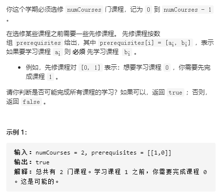

解决思路：

### **拓扑排序**：

对于 **有向图**而言， 其拓扑排序为其所有节点的一个线性排序（该线性排序可能并不唯一）。该排序满足：对于图中的任意节点$u$和$v$，若存在一条有向边从$u$指向$v$，则在拓扑排序中$u$一定出现在$v$前面。拓扑排序可以用来解决有向图中是否存在循环依赖的问题。

**算法原理**：先统计每个节点的入度，将入度为0的节点添加到队列中，进行宽度优先搜索，每次从队列中弹出一个节点$u$，将以u为起点的边，重点为$v$的边进行删除，并将$v$的入度减少1，若$v$的入度为0，则添加到队列中，这样循环，判断最终进入队列的节点数是否等于图中的所有节点数，若是，则表示存在拓扑排序，节点从队列中的弹出顺序即为一条有效的拓扑路径。

该问题即可转换为有向图的拓扑排序来求解。

```python
class Solution:
    def canFinish(self, numCourses: int, prerequisites: List[List[int]]) -> bool:
        from collections import deque, defaultdict
        edge = defaultdict(list)
        edge_indegere = defaultdict(int)

        for u, v in prerequisites:
            edge[u].append(v)
            edge_indegere[v] += 1
        

        que = deque()
        for u in range(numCourses):
            if edge_indegere[u] == 0:
                que.append(u)
        num = 0
        while que:
            curver = que.popleft()
            num += 1
            for v in edge[curver]:
                edge_indegere[v] -= 1
                if edge_indegere[v] == 0:
                    que.append(v)
        return num == numCourses
```

## [210. 课程表 II](https://leetcode-cn.com/problems/course-schedule-ii/)

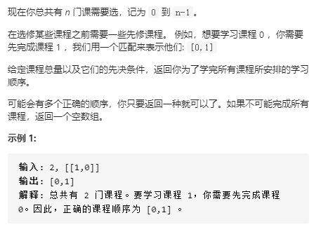

解决思路：同[207. 课程表](https://leetcode-cn.com/problems/course-schedule/)，若存在拓扑排序，则输出拓扑路径，否则，输出空。

```python
class Solution:
    def findOrder(self, numCourses: int, prerequisites: List[List[int]]) -> List[int]:
        from collections import deque, defaultdict
        edge = defaultdict(list)
        edge_indegere = defaultdict(int)

        for u, v in prerequisites:
            edge[v].append(u)
            edge_indegere[u] += 1
        

        que = deque()
        for u in range(numCourses):
            if edge_indegere[u] == 0:
                que.append(u)
        num = 0
        res = []
        while que:
            curver = que.popleft()
            res.append(curver)
            num += 1
            for v in edge[curver]:
                edge_indegere[v] -= 1
                if edge_indegere[v] == 0:
                    que.append(v)
        return res if num == numCourses else []
```

## [684. 冗余连接](https://leetcode-cn.com/problems/redundant-connection/)

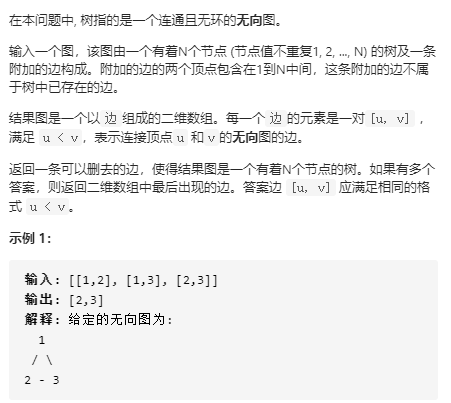

解决思路：该问题实际上是需要将一个有环路的连通图去掉一条边变成没有环路的连通图，即树。

对于连通区域或者环路的判断，我们采用并查集来解决。

### **并查集**：

并查集也被称为不相交的数据结构，将开始不相交的集合进行多次合并后成为一个大集合，最终可以判断两个元素是否在同一个集合中，所有元素形成几个集合，如果元素是图的节点，则可以计算图中形成多少个连通区域。并查集逻辑上是一个深林，每个集合中选出的代价就是树的根。

并查集的数据结构实现：

```python
class UnionFind():
	def __init__(self, n):
        self.uf = [-1 for _ in range(1, n+1)] #长度为n的并查集大小，节点的范围为1-n，-1表示该节点是父节点，初始时刻，每个节点都是自己的父节点
        self.count = n #初始时刻连通区域有n个
    
    def find(self, p): #寻找p节点的父节点
        r = p
        while self.uf[p] > 0: #若self.uf[p]大于0，则表示self.uf[p]不是父节点，需要继续向上查找，直到找到小于0的时候，才表明找到父节点
            p = self.uf[p]
        while r != p: #为了提高查找父节点的速度，需要压缩树的高度，使得每个父节点的子孙都直接指向父节点
            self.uf[r], r = p, self.uf[r]
        return p
   
    def union(self, p, q): #将p和q所属的连通区域进行合并
        proot = self.find(p)
        qroot = self.find(q)
        if proot == qroot:#如果p和q本来就属于同一连通区域，则直接返回即可
            return
        elif self.uf[proot] > self.uf[qroot]:   #若p和q不属于同一区域，则将节点少的连通区域合并到节点多的连通区域中，因为此时在路径压缩时可以压缩更少的节点
            self.uf[qroot] += self.uf[proot]    #self.uf中的负元素可以表示该连通区域的节点数量的多少，因此合并时，节点数也需要增加
            self.uf[proot] = qroot
        else:
            self.uf[proot] += self.uf[qroot]    
            self.uf[qroot] = proot
        self.sets_count -= 1                    # 两个连通合并后，连通区域总数减少1
    
    def is_connected(self, p, q): #如果两个节点的父节点相同，则表示他们属于同一个连通区域
    	return self.find(p) == self.find(q)
```

因此此题可以归化为在给定的边中找到一条边，该边需要满足的条件是：该边在一个连通环路中，并且是最后出现的，因此此时按照可以并查集来解决，只需要对每一条边的顶点$<u,v>$进行判断，在没有这条边之前，该两顶点是否已经在一个连通区域中了，若是已经在，则该边$<u,v>$加入时，必定会形成回路。这就是我们需要找的目标边。

```python
class Solution:
    def findRedundantConnection(self, edges: List[List[int]]) -> List[int]:   
        def find(p):
            r = p
            while self.uf[p] > 0:
                p = self.uf[p]
            while r != p:
                self.uf[r], r = p, self.uf[r]
            return p

        def is_connected(p, q):
            return find(p) == find(q)

        def union(p, q):
            proot = find(p)
            qroot = find(q)
            
            if proot == qroot:
                return 
            elif self.uf[proot] > self.uf[qroot]:
                self.uf[qroot] += self.uf[proot]
                self.uf[proot] = qroot
            else:
                self.uf[proot] += self.uf[qroot]
                self.uf[qroot] = proot
        
        n = len(edges)
        self.uf = [-1 for i in range(n+1)]
        for u, v in edges:
            if is_connected(u, v):
                return [u, v]
            else:
                union(u, v)
```

## [685. 冗余连接 II](https://leetcode-cn.com/problems/redundant-connection-ii/)

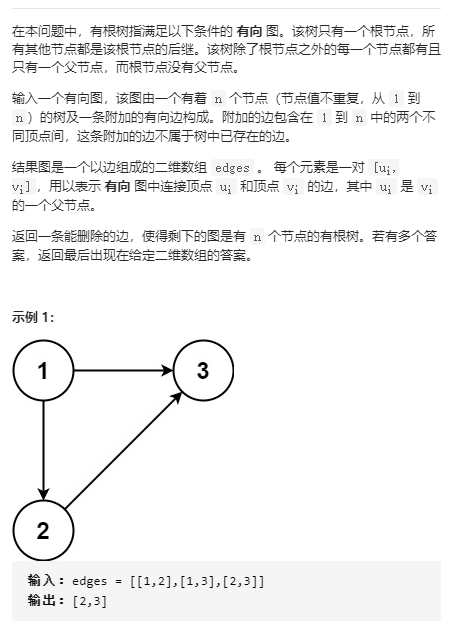

解决思路：该题与[684. 冗余连接](https://leetcode-cn.com/problems/redundant-connection/)的区别是该图是有向图，因此需要保证的是删除一条边后，满足两个条件：

1. 整个图不会形成回路，这点与无向图是有类似的
2. 整个图是有根树，即除根顶点外，**每个顶点有且只有一个父节点**，这点与无向图是有区别的，因为无向图没有方向，所以没有父子节点之分。

因此该题的解决方法分两步走：

1. 先统计每个节点的入度，寻找是否有入度为2的节点$v$, 若有入度为2的节点$v$，则我们删除的边必定是$<u_1, v>$或者$<u_2, v>$，此时我们才会满足条件2。

   ​    a. 首先我们删除$<u2, v>$, **判断剩下的边是否形成回路**，若是形成回路，则表示$<u_2, v>$无效，因此只能删除$<u_1, v>$

   ​    b. 若是删除$<u2, v>$不形成回路，则表示删除$<u2, v>$是有效的，并且它也是后出现的，因此我们找到的目标边就是$<u2, v>$。

2. 若是不存在入度为2的节点$v$，则条件2自动满足，**只需要满足条件1即可**。

   

​      通过上述两点的分析，我们需要解决的问题就是找到使有向图形成回路的最后一条边$<m,n>$，该问题的解决与无向图类似，不过区别在于合并节点$p$和$q$之时，我们**不能任意的指定根节点，而是必须以$p$为根节点**，这是与无向图有区别的。

```python
def union(p, q):
	proot = find(p)
    qroot = find(q)
    self.uf[qroot] = proot #对于有向图，必须是q的祖先指向p的祖先，对于无向图则随意。
```

​	


```python
class Solution:
    def findRedundantDirectedConnection(self, edges: List[List[int]]) -> List[int]:
        def find(p):
            r = p
            while self.uf[p] > 0:
                p = self.uf[p]
            while r != p:
                self.uf[r], r = p, self.uf[r]
            return p

        def is_connected(p, q):
            return find(p) == find(q)

        def union(p, q):
            proot = find(p)
            qroot = find(q)
            self.uf[qroot] = proot #对于有向图，必须是q的祖先指向p的祖先，对于无向图则随意。
           
        
        from collections import defaultdict
        vertes_indegree = defaultdict(int)
        need_delete = []
        for u, v in edges: #分两种情况，一种是存在入度为2的节点v，则删除的边必定是指向节点v的两条边之一
            if vertes_indegree[v] == 1:
                need_delete = [u, v] #保留指向入度为2的节点v的靠后的边[u, v]
                break
            vertes_indegree[v] += 1

        n = len(edges)
        self.uf = [-1 for i in range(n+1)]

        for u, v in edges:
            if need_delete: #若存在入度为2的节点v，首先删除入度为2的节点v的靠后的边[u, v]，判断此时是否还有环
                if [u, v] == need_delete:
                    continue
                if v == need_delete[1]:
                    newneed_delete = [u, v] #入度为2的节点v的靠前的边[u, v]
                if is_connected(u, v): #若还有环，则表明删除靠后的边[u,v]没用，因此删除靠前的边
                    return newneed_delete
                else:
                    union(u, v)
            else: # 若不存在入度为2的节点v，则只需要删除会形成环的边即可
                if is_connected(u, v):
                    return [u, v] #因此若走else分支，从此处必定会返回
                else:
                    union(u, v)
        return need_delete  #若无环，则表明删除靠后的边[u,v]有用
```


## [841. 钥匙和房间](https://leetcode-cn.com/problems/keys-and-rooms/)

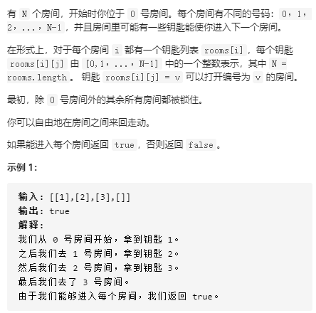

解决思路：该问题实质上也是有向图的拓扑排序问题，与[207. 课程表](https://leetcode-cn.com/problems/course-schedule/)的区别在于，此题指定了起始点为0号房间。为了避免重复访问同一个房间，因此采用集合来统计已经访问过的房间，最后判断访问过的房间数是否等于总房间数即可。

```python
class Solution:
    def canVisitAllRooms(self, rooms: List[List[int]]) -> bool: 
        from collections import deque
        que = deque()
        visit = set()
        que.append(0)
        while que:
            roomindex = que.popleft()
            if roomindex in visit:
                continue
            else:
                visit.add(roomindex)
            for newkey in rooms[roomindex]:
                que.append(newkey)
        
        return len(visit) == len(rooms)
```

## [1162. 地图分析](https://leetcode-cn.com/problems/as-far-from-land-as-possible/)

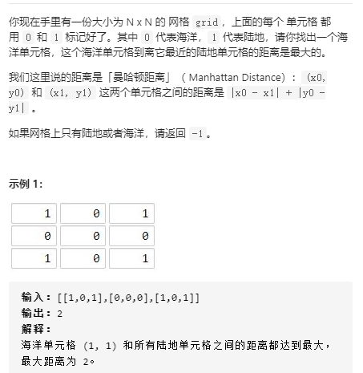

解决思路：该问题的本质上是由有多个源（即陆地），要寻找每个位置距离所有源最近距离的最大值。因此要寻找最近距离，可以采用宽度优先搜索，以源为中心，等距扩展即可，将每次访问到的节点添加到队列中，再依次弹出，这样便可以找到其最近距离的最大值。这样还可以避免对一个节点多次统计距离源的距离，因为第一次访问时肯定是距离源的最近距离，所有避免重复访问节点。

```python
class Solution:
    def maxDistance(self, grid: List[List[int]]) -> int:
        N = len(grid)
        distance = [[float("inf")] * N for _ in range(N)]
        from collections import deque
        que = deque()
        landnum = 0
        for i in range(N):
            for j in range(N):
                if grid[i][j] == 1:
                    distance[i][j] = 0
                    landnum += 1
                    que.append((i, j))
        if landnum == 0 or landnum == N * N:
            return -1
        
        res = -1
        visit = set()
        diff = [(0, 1), (0, -1), (-1, 0), (1, 0)]
        while que:
            x, y = que.popleft()
            for xdif, ydif in diff:
                xnew, ynew = x + xdif, y + ydif
                if 0 <= xnew < N and 0 <= ynew < N and (xnew, ynew) not in visit:
                    visit.add((xnew, ynew))
                    distance[xnew][ynew] = min(distance[xnew][ynew], distance[x][y] + 1)
                    res = max(res, distance[xnew][ynew])
                    que.append((xnew, ynew))
        return res
```

## [399. 除法求值](https://leetcode-cn.com/problems/evaluate-division/)

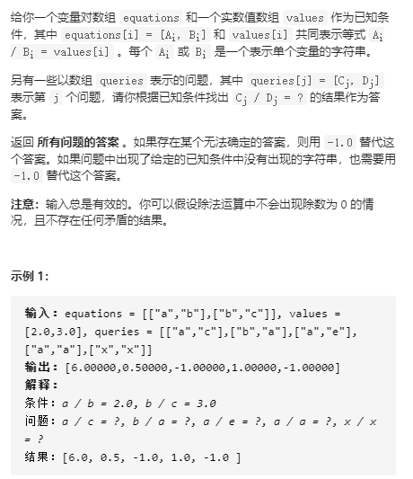

解决思路：因为除法具有传递性，因此该题目的本质是一个有向图，并且有向图的每条边具有不同的权重，问题就可以转化为给定两个节点$u,v$，判断两节点是否在同一回路中，若是在同一回路中，则计算出两节点之间路径的不同边的权重乘积。若是不在同一回路上，则返回-1即可。

因此给定节点$<u,v>$时，遍历节点$v$为起点的所有边$<v,w>$，则可以计算$<u,w>$的权重值。由于除法还具有反向传递性，因此还需要遍历节点$u$为起点的所有边$<u,k>$，则可以计算出$<v,k>$的权重值，因此与边$<u,v>$相关的所有边都进行了计算。最后直接判断所需要求的边是否在计算结果中即可。

```python
class Solution:
    def calcEquation(self, equations: List[List[str]], values: List[float], queries: List[List[str]]) -> List[float]:
        from collections import defaultdict, deque
        edge = defaultdict(list)
        edge_weight = {}
        que = deque()

        for i in range(len(equations)):
            u, v = equations[i][0], equations[i][1]
            edge[u].append(v)
            edge[v].append(u)
            edge_weight[(u, u)] = 1.0
            edge_weight[(v, v)] = 1.0
            edge_weight[(u, v)] = values[i]
            edge_weight[(v, u)] = 1 / values[i]
            que.append((u,v))
            que.append((v,u))
        
        res = []


        while que:
            u, v = que.popleft()
            for w in edge[v]:
                if (u, w) not in edge_weight:
                    edge_weight[(u,w)] = edge_weight[(u,v)] * edge_weight[(v, w)]
                    que.append((u, w))
            for k in edge[u]:
                if (v, k) not in edge_weight:
                    edge_weight[(v, k)] = edge_weight[(u, k)] / edge_weight[(u, v)]
                    que.append((v, k))
        res = []
        # print(edge_weight)
        for u, v in queries:
            if (u, v) in edge_weight:
                res.append(edge_weight[(u, v)])
            elif (v, u) in edge_weight:
                res.append(1 / edge_weight[(v, u)])
            else:
                res.append(-1.0)
        return res
```

## [133. 克隆图](https://leetcode-cn.com/problems/clone-graph/)

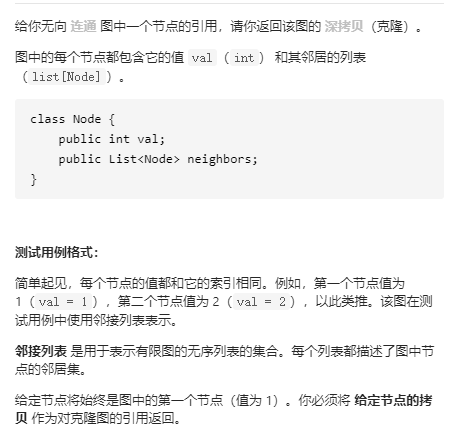

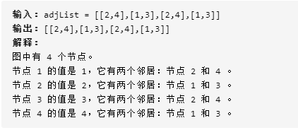

解决思路：只需要宽度优先搜索来遍历图即可，采用两个队列分别来保持原始图的节点和克隆图的节点，来使得两个图的遍历顺序保持一致。这里要特别注意的是我们需要建立一个原始节点和克隆节点的对应关系，避免节点重复克隆，从而破坏了克隆图的节点对应关系。

```python
"""
# Definition for a Node.
class Node:
    def __init__(self, val = 0, neighbors = None):
        self.val = val
        self.neighbors = neighbors if neighbors is not None else []
"""

class Solution:
    def cloneGraph(self, node: 'Node') -> 'Node':
        from collections import deque
        if node == None:
            return None
        if node.neighbors == []:
            return Node(node.val)
        que = deque()
        que.append(node)

        queclone = deque()
        p = Node(node.val, [])
        queclone.append(p)

        visit = set()
        old_tonew = {node:p}
        while que:
            curnode = que.popleft()
            clonenode = queclone.popleft()
            if curnode not in visit:
                visit.add(curnode)

                for neig in curnode.neighbors:
                    que.append(neig)
                    
                    if neig not in old_tonew:
                        cloneneig = Node(neig.val, [])
                        clonenode.neighbors.append(cloneneig)
                        old_tonew[neig] = cloneneig
                    else:
                        clonenode.neighbors.append(old_tonew[neig])
                    queclone.append(old_tonew[neig])
        return p
```

## [990. 等式方程的可满足性](https://leetcode-cn.com/problems/satisfiability-of-equality-equations/)

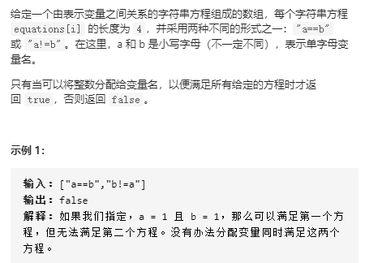

解决思路：等式方程具有传递性，该题也可以转化为无向图的连通性问题，若变量相等，则代表变量之间有无向边连接，若变量不等，则代表变量之间没有边连接。因此分两步解决：

1. 首先将等式方程形成的无向图的连通区域找出来，可以采用并查集解决，从而可以知道整个图的连通性
2. 将非等式方程的变量来判断连通性，若是两变量具有连通性，则矛盾，因此返回False。若是都不矛盾，则表示可以满足所有方程，不会冲突。

```python
class Solution:
    def equationsPossible(self, equations: List[str]) -> bool:

        alpha_toindex = {}
        for index in range(26):
            alpha_toindex[chr(ord('a') + index)] = index + 1
        self.uf = [-1 for _ in range(27)]

        def find(p):
            r = p
            while self.uf[p] > 0:
                p = self.uf[p]
            while r != p:
                self.uf[r], r = p, self.uf[r]          
            return p
        
        def union(p, q):
            proot = find(p)
            qroot = find(q)
            if proot == qroot:
                return
            
            elif self.uf[proot] > self.uf[qroot]:
                self.uf[qroot] += self.uf[proot]
                self.uf[proot] = qroot
            
            else:
                self.uf[proot] += self.uf[qroot]
                self.uf[qroot] = proot
        
        def is_connected(p, q):
            return find(p) == find(q)
            
        not_equa = []
        for c1, c2, c3, c4 in equations:
            if c2 == '!':
                not_equa.append(c1 + c4)
            else:
                c1num, c4num = alpha_toindex[c1], alpha_toindex[c4]
                union(c1num, c4num)

        for cs, cd in not_equa:
            csnum, cdnum = alpha_toindex[cs], alpha_toindex[cd]
            if is_connected(csnum, cdnum):
                return False
        return True
```

## [785. 判断二分图](https://leetcode-cn.com/problems/is-graph-bipartite/)

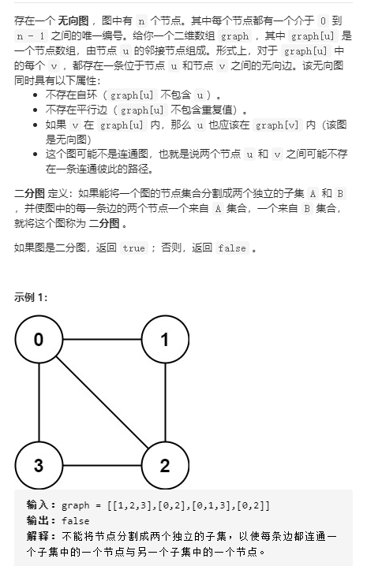

解决思路：首先因为该图不一定是连通的，因此需要先找出所有的连通分离，可以采用并查集来解决。其次，将每个连通分量的父节点添加到队列中，然后依次从队列中弹出节点$u$, 找到节点$u$相邻的所有边$<u,v>$:

1. 若是节点$u$第一次访问，则$u$必定是连通分量的父节点，此时该节点可以随意添加到集合A 或集合B中，我们统一都添加到集合A中，则相邻边的节点$v$则必须都添加到集合B中。
2. 若是节点$u$不是第一次访问，则该节点必定在集合A中或者集合B中，若$u$在A中，则$v$必定添加到B中，反之$v$则添加到A中。

最后所有节点访问完时，我们只需要判断集合A和集合B的元素个数之和是否等于总元素个数即可，若相等，则表示可以形成二分图，若不等，则至少存在一个运算，它既要集合A中，又在在集合B中，这显然是矛盾的，因此不可能形成二分图。

```python
class Solution:
    def isBipartite(self, graph: List[List[int]]) -> bool:
        A = set()
        B = set()
        n = len(graph)

        self.uf = [-1 for _ in range(n)]

        def find(p):
            r = p
            while self.uf[p] >= 0: #因为0也可以是父节点，所以大于等于0
                p = self.uf[p]
            while r != p:
                self.uf[r], r = p, self.uf[r]
            return p

        def union(p, q):
            proot = find(p)
            qroot = find(q)
            if proot == qroot:
                return
            elif self.uf[proot] > self.uf[qroot]:
                self.uf[qroot] += self.uf[proot]
                self.uf[proot] = qroot
            else:
                self.uf[proot] += self.uf[qroot]
                self.uf[qroot] = proot
            
        def is_connected(p, q):
            return find(p) == find(q)

        for u in range(n):
            for v in graph[u]:
                if is_connected(u, v) == False:
                    union(u, v)
        
        from collections import deque
        que = deque()
        for i in range(n):
            if self.uf[i] < 0: #将每个连通区域的父节点添加到队列中
                que.append(i)
        visit = set()
        while que:
            curnode = que.popleft() 
            if curnode in visit: #节点若是已经被访问了，则必然在A或B中
                if curnode in A:#若该节点在A中，则与之相邻的节点必然在B中
                    for v in graph[curnode]:
                        B.add(v)
                        if v not in visit:  #若该节点还是第一次访问到，则节点必须添加在队列中
                            que.append(v)
                            visit.add(v)

                else: #若该节点在B中，则与之相邻的节点必然在A中
                    for v in graph[curnode]:
                        A.add(v)
                        if v not in visit:
                            que.append(v)
                            visit.add(v)


            else: #节点若是未被访问，实际上该节点是每个连通区域的父节点，则该节点先添加到A中
                visit.add(curnode)
                A.add(curnode)
                for v in graph[curnode]:
                    B.add(v)
                    if v not in visit:
                        que.append(v)
                        visit.add(v)

        return len(A) + len(B) == n #若A中和B中集合元素大于n，则说明A和B中必定会有同一个元素
```

## [332. 重新安排行程](https://leetcode-cn.com/problems/reconstruct-itinerary/)

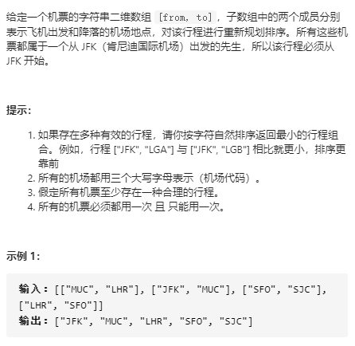

解决思路：欧拉路径的求解。

欧拉图：通过图中所有边恰好一次且访问到所有顶点的回路称为欧拉回路，具有欧拉回路的无向图是欧拉图

半欧拉图：通过图中所有边恰好一次且访问到所有顶点的通路称为欧拉回路，具有欧拉通路的无向图是半欧拉图

是否是欧拉图或半欧拉图的判定方法：

1. 对于无向图G是欧拉图， 满足G是连通的并且没有奇度顶点
2. 对于无向图G是半欧拉图， 满足G是连通的，并且G中恰有2个奇度顶点
3. 对于有向图G是欧拉图，满足G所有顶点是同一个强连通分量，并且每个顶点的出入度相同
4. 对于有向图G是半欧拉图，满足G的所有顶点是同一个强连通分量， 且有一个顶点的出度比入度大1，有一个顶点的入度比出度大1，其他顶点的出入度相同。

采用 $Hierholzer$ 算法: 步骤为三步，

1. 从起点出发，进行深度优先搜索
2. 每次沿着某条边从某个顶点移动到另一个节点的时候，删除该边
3. 如果没有可移动的路径，则将所在节点加入到栈中，并返回。

栈中节点的逆序则是我们需要寻找的路径。由于每次都删除一条边，因此首先加入到栈中的必定是出度比入度少1的顶点，即欧拉通路的终点，而第二个加入进去的顶点必定是与终点相邻的一个顶点，因为我们可以这样分析，每次加入到栈中的顶点需要满足的条件是没有可移动的路径，即出度为0。只有出度比入度少1，才会是满足这个条件，因此当去掉第一个加入栈中的顶点后，与之相邻的该点少了一条出边，因此本来出入度相等的顶点，此时出度比入度少1了。

```python
class Solution:
    def findItinerary(self, tickets: List[List[str]]) -> List[str]:
        def dfs(curr):
            while vec[curr]:
                tmp = heapq.heappop(vec[curr])
                dfs(tmp)
            stack.append(curr)

        vec = collections.defaultdict(list)
        for depart, arrive in tickets:
            vec[depart].append(arrive)
        for key in vec:
            heapq.heapify(vec[key])
        
        stack = list()
        dfs("JFK")
        return stack[::-1]
```

